# GPU通信技术初探

⌚️: 2020年10月23日

📚参考

- [参考1](https://arxiv.org/pdf/1903.04611.pdf) 

- [NVIDIA GPUDirect](https://developer.nvidia.com/gpudirect)
- [GPUDirect RDMA，让加速更深入](https://images.nvidia.com/cn/tesla/success-stories/super-computing/NV template_GPUDirect RDMA 让加速更深入_Sugon.pdf)
- [NVIDIA GPUDirect™ Technology – Accelerating GPU-based Systems](http://www.mellanox.com/pdf/whitepapers/TB_GPU_Direct.pdf)
- [浅析GPU通信技术（上）-GPUDirect P2P](https://yq.aliyun.com/articles/591403?spm=a2c4e.11153940.blogcont603617.10.61b93f66p1Ju3N)
- [浅析GPU通信技术（中）-NVLink](https://yq.aliyun.com/articles/599183?spm=a2c4e.11153940.blogcont603617.11.61b93f66p1Ju3N)
- [浅析GPU通信技术（下）-GPUDirect RDMA](https://yq.aliyun.com/articles/603617?spm=a2c4e.11153940.blogcont599183.15.c410496f4x2RgH)
- [NVLINK 结构](https://www.nvidia.cn/data-center/nvlink/)
- [NVIDIA NVSWITCH:The World’s Highest-Bandwidth On-Node Switch](https://images.nvidia.com/content/pdf/nvswitch-technical-overview.pdf)
- [NVSWITCH AND DGX-2:NVLINK-SWITCHING CHIP AND SCALE-UP COMPUTE SERVER](https://www.hotchips.org/hc30/2conf/2.01_Nvidia_NVswitch_HotChips2018_DGX2NVS_Final.pdf)
- [Accelerating High Performance Computing with GPUDirect RDMA](http://on-demand.gputechconf.com/gtc/2013/webinar/gtc-express-gpudirect-rdma.pdf)
- [S8474 - GPUDirect: Life in the Fast](http://on-demand.gputechconf.com/gtc/2018/presentation/s8474-gpudirect-life-in-the-fast-lane.pdf)
- [Mellanox OFED GPUDirect RDMA](http://www.mellanox.com/related-docs/prod_software/PB_GPUDirect_RDMA.PDF)
- [How Ethernet RDMA Protocols iWARP and RoCE Support NVMe over Fabrics](https://www.snia.org/sites/default/files/ESF/How_Ethernet_RDMA_Protocols_Support_NVMe_over_Fabrics_Final.pdf)

---

自 2007 年 NVIDIA 率先推出 GPU 加速器后，由于 GPU 的超强的计算能力，现已广泛应用于物理、生物科学、化学、天气预报等需要高性能计算的领域。实际运用中，为缩减计算时间，应用程序往往同时使用多卡进行并行计算，这里的多卡包括单个服务器多张 GPU 卡(下简称单机多卡)，和多个服务器，且每个服务器分别有多张卡的场景(下称多机多卡)。同时，由于用于计算的数据量较大，GPU 多卡之间的通信尤为重要，本文主要探索 GPU 单机多卡和多机多卡两种场景下的通信技术，并对部分技术进行实测。

## 1、单机间 GPU 通信

### 1.1	GPU Direct

使用 GPU Direct 技术，多个 GPU、网络和存储设备可以直接读写主机和设备内存，减少不必要的内存拷贝和 CPU 开销，降低网络延迟，进而获得性能的提升。

GPUDirect 技术发展有三个阶段：

- 2010年，GPU支持与网卡，存储等设备共享内存页，即GPUDirect Shared Memory;
- 2011年，NVIDIA推出GPUDirect P2P（Peer-to-Peer），支持同一PCIe总线上的GPU之间的内存访问;
- 2012年底，GPUDirect RDMA完美的解决了计算集群节点间GPU卡PCIe总线的通信问题。该技术将在多机的GPU通信中详细说明。

**1.1.1	GPUDirect Shared Memory**

GPUDirect SharedMemory 支持 GPU 与第三方 PCIe 设备通过共享的 host memory 实现共享内存。下图对未使用 GPUDirect 和使用 GPUDirect 后的 GPU 之间通信的数据拷贝进行了对比。

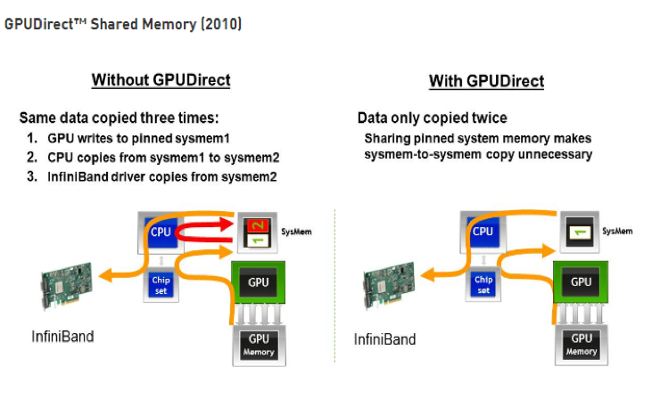

图 1：without GPUDirect vs with GPUDirect（[来源](https://developer.nvidia.com/gpudirect)）

可以看出支持 GPUDirect SharedMemory 后，GPU 之间的通信仅需要两次拷贝：

- 先从GPU缓存拷贝到系统内存
- 对端GPU缓存从系统内存拷贝数据

相较于未使用 GPUDirect 减少了一次数据拷贝，降低了数据交换的延迟。

**1.1.2	GPUDirect P2P**

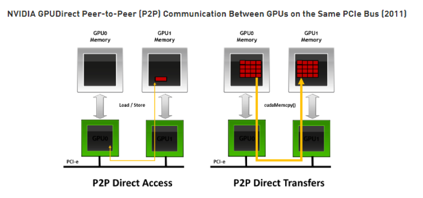

图 2：GPUDirect P2P 通信（[来源](https://developer.nvidia.com/gpudirect)）

GPUDirect P2P 支持相同 PCIe root complex 下的 GPU 之间的直接互访显存，如上图所示，GPU 之间的通信不需要将数据拷贝到 CPU host memory 作为中转，进一步的降低了数据交换的延迟。

### 1.2	NVLink

GPUDirect P2P 技术中，多个 GPU 通过 PCIe 直接与 CPU 相连，而 PCIe 3.0*16 的双向带宽不足 32GB/s，当训练数据不断增长时，PCIe 的带宽满足不了需求，会逐渐成为系统瓶颈。为提升多 GPU 之间的通信性能，充分发挥 GPU 的计算性能，NVIDIA 于 2016 年发布了全新架构的 NVLink。

NVLink 1.0 与 P100 GPU 一同发布，一块 P100 上，可集成 4 条 NVLink 连接线，每条 NVLink 具备双路共 40GB/s 的带宽，整个芯片的带宽达到了 160GB/s（4（NVLink 连接线）\*40GB/s），相当于 PCIe 3.0\*16 的 5 倍。

NVLink 2.0 版本与 Tesla V100 GPU 一同发布，NVLink 2.0 每个方向的信号发送速率从 20GB/s 增加到 25GB/s，每条 NVLink 双信道最大达到 50GB/s。单个 V100 GPU 支持 6 条 NVLink 连接线，总带宽最大可达 300GB/s（6（NVLink 连接线）\*2（双向）\*25GB/s），是 PCIe 3.0 带宽的将近 10 倍。

**1.2.1	拓扑**

图 3：NVLink 拓扑（[来源](http://on-demand.gputechconf.com/gtc/2018/presentation/s8474-gpudirect-life-in-the-fast-lane.pdf)）

上图是使用 NVLink 连接 8 个 Tesla V100 的混合立体网络拓扑。图中也以看出每个 V100 GPU 有 6 个 NVLink 通道（绿色连接线），8 块 GPU 间无法做到全连接，2 个 GPU 间最多只能有 2 个 NVLink 通道 100GB/s 的双向带宽。有趣的是 GPU 0 和 3，GPU 0 和 4 之间有 2 条 NVLink 相连，GPU0 和 GPU1 之间有一条 NVLink 连接线，GPU 0 和 6 之间没有 NVLink 连接线，也就是说 GPU0 与 GPU6 之间的通信仍然需要通过 PCIe。

**1.2.2	实测**

测试方法及环境：参考 cuda sample 的 readme，在 ubuntu16.04 镜像中安装好 cuda toolkit 10.0，编译好二进制，然后保存镜像。在华为云 CCI（Cloud Container Instance）服务中，使用刚制作好的镜像，选择规格：GPU 计算加速型 P2（支持 NVLink 的 Tesla V100 32G * 8 卡） 

创建一个无状态负载。测试结果及说明如下：

图 4：GPU 间连通性矩阵

该图为 GPU 之间的连通性，图中可以看出任何两个 GPU 设备之间是否可以直接通信，考虑到该服务器支持 NVLink，即可以看出任两个 GPU 设备之间是否有 NVLink 连接，但是无法看出 GPU 设备间 NVLink 的连接线个数。

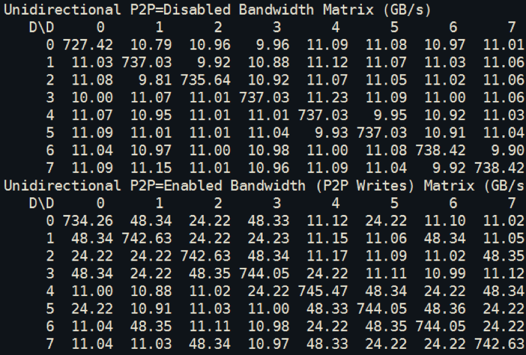

图 5：Disable P2P vs Disable P2P 单向的带宽

该图测试的是 enable GPUDirect P2P 和 Disable GPUDirect P2P 的单向带宽数据 。图中数据可看出，Enable GPUDirect P2P 时，两个 GPU 间通信带宽最大可达到 48.34GB/s，接近两条 NVLink 的理论带宽 50GB/s；部分 GPU 间通信带宽在 24GB/s 左右，接近一条 NVLink 连接线的理论带宽 25GB/s；11GB/s 左右的带宽为 PCIe 带宽。

从这组数据也能够看出 GPU 之间的 NVLink 连接线个数如下表所示，与前面的 NVLink 拓扑图一致：

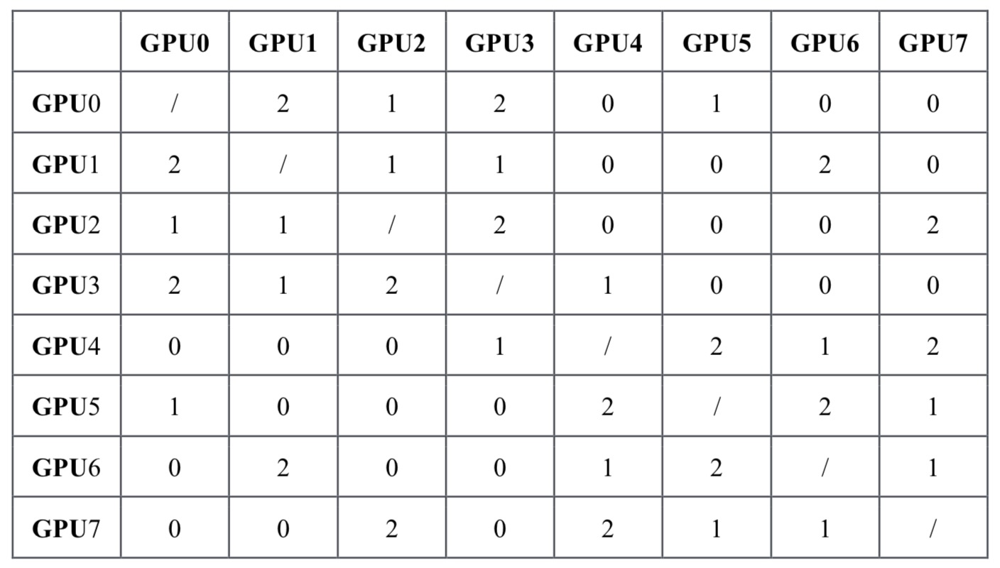

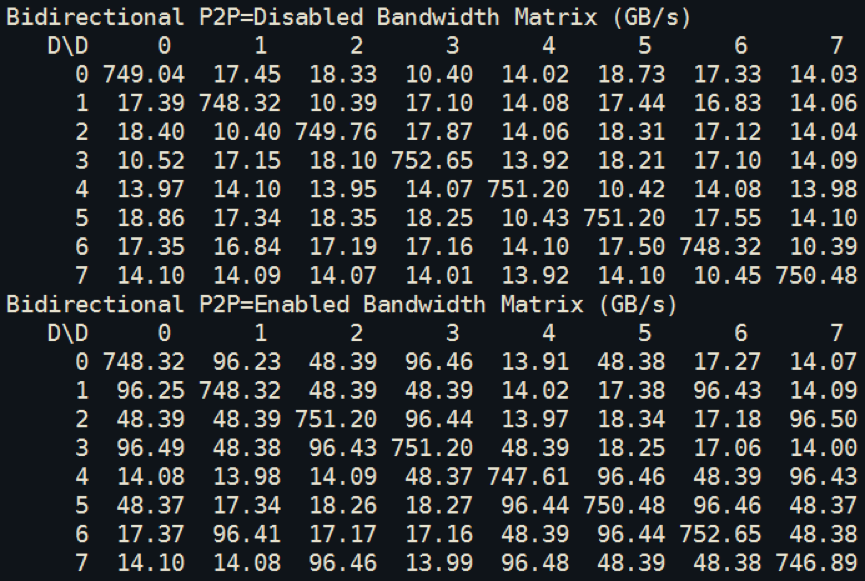

图 6：Disable P2P vs Disable P2P 双向的带宽

该图测试的是 enable GPUDirect P2P 和 Disable GPUDirect P2P 的双向带宽数据 。图中数据可看出，Enable GPUDirect P2P 时，两个 GPU 间通信带宽最大可达到 96.50GB/s，接近两条 NVLink 的双向通信的理论带宽 100GB/s；部分 GPU 间通信带宽在 48GB/s 左右，接近一条 NVLink 连接线双向通信的理论带宽 50GB/s；14-18GB/s 的带宽为 PCIe 带宽

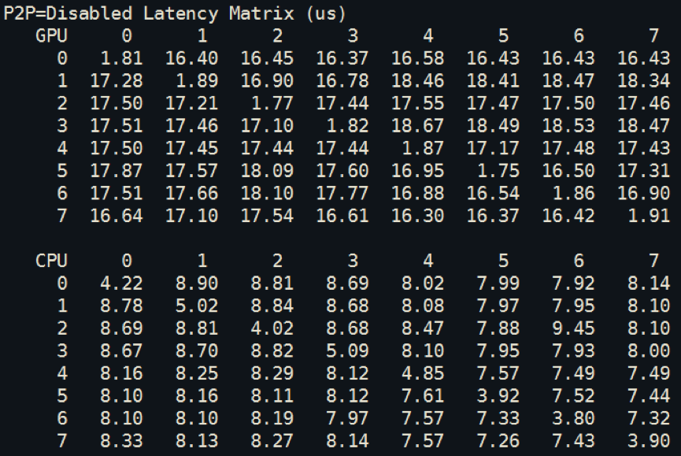

图 7：Disable P2P CPU vs GPU 时延矩阵

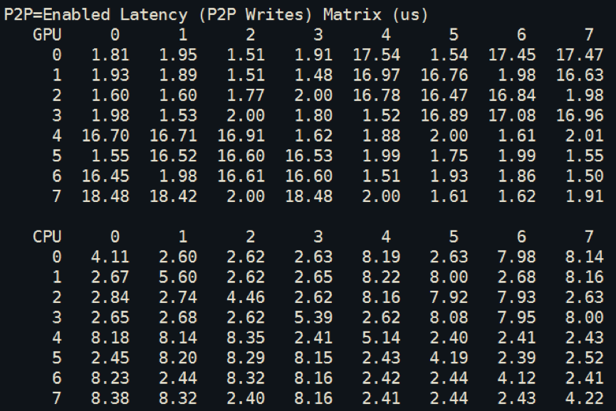

图 8：Enable P2P CPU vs GPU 时延矩阵

上面两张图为 enable GPUDirect P2P 和 Disable GPUDirect P2P 的时的 GPU 和 CPU 时延数据，可以看出 enable GPUDirect P2P 后，时延下降明显，只要用 NVLink 连接，GPU 时延从 17us 下降到不足 2us，CPU 时延也从 8us 多下降到不足 3us。

从上面的测试结果也能看出单机多卡中，有 NVLink 连接的 GPU 之间的通信性能提升明显。但是如果进行单机训练时只需要用到 2 卡或者 4 卡时，如果随机分配 GPU 卡，岂不是会出现 GPU 之间没有 NVLink 连接线？不用担心，华为云 CCI 服务在调度层保证了基本不会出现该问题，调度时会保证 GPU 之间有 NVLink 连接线，从而能充分享受到 NVLink 技术带来的性能提升。

### 1.3	NVSwitch

前面也看到，NVLink2.0 技术使得单服务器中 8 个 GPU 无法达到全连接，为解决该问题，NVIDIA 在 2018 年发布了 NVSwitch，实现了 NVLink 的全连接。NVIDIA NVSwitch 是首款节点交换架构，可支持单个服务器节点中 16 个全互联的 GPU，并可使全部 8 个 GPU 对分别达到 300GB/s 的速度同时进行通信。

下图为 16 个 GPU 通过 NVSwitch 全连接拓扑图。

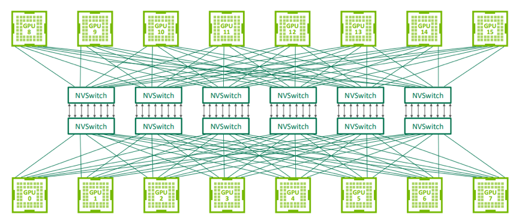

图 9：NVSwitch 全连接拓扑（[来源](http://on-demand.gputechconf.com/gtc/2018/presentation/s8474-gpudirect-life-in-the-fast-lane.pdf)）

## 2、多机间的 GPU 通信

### 2.1	RDMA & Infiniband

**2.1.1	RDMA**

由于计算数量巨大，多机多卡的计算/训练已经是一个常态，多机间的通信是影响分布式训练行的一个重要指标。在传统的 TCP/IP 网络通信中，如下图所示，数据发送方需要将数据进行多次内存拷贝，并经过一系列的网络协议的数据包处理工作；数据接收方在应用程序中处理数据前，也需要经过多次内存拷贝和一系列的网络协议的数据包处理工作。经过这一系列的内存拷贝、数据包处理以及网络传输延时等，server 间的通信时延往往在毫秒级别，不能够满足多机多卡场景对于网络通信的需求。

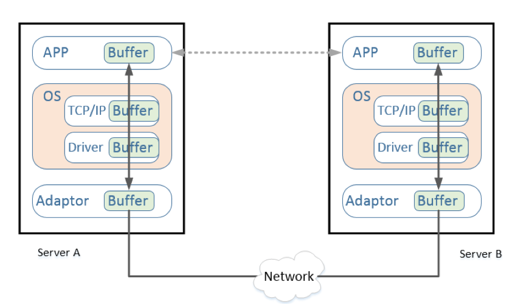

图 10：TCP/IP 网络通信

RDMA（Remote Direct Memory Access）就是为了解决网络传输中数据处理延迟而产生的一种远端内存直接访问技术，RDMA 技术原理及其与 TCP/IP 架构的对比如下图：

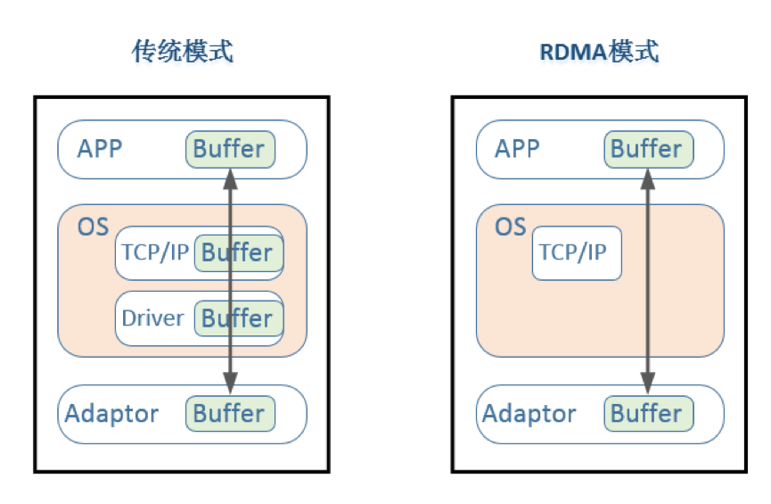

图 11：传统模式 vs RDMA 模式网路通信

可以看出 RDMA 模式的数据传输没有经过一系列的网络协议的数据包处理，通过网络设备，服务器 1 可以直接读写服务器 2 的内存。使用 RDMA 技术的优点主要有：

1. Kernel Bypass: 旁路内核，CPU卸载。实测中40Gbps流量CPU占有率只有5%
2. zero copy: 内存零拷贝，直接从网卡复制到应用内存，服务器内部处理时延低至1～2微秒
3. 因此RDMA可以实现服务器间的超低时延、超高吞吐量传输。

**2.1.2	RDMA 的三种硬件实现**

目前 RDMA 有三种不同的硬件实现：

1. Infiniband（IB）：专为RDMA设计的网络，从硬件层面保证可靠传输，同时由于这是一种新的网络技术，需要支持该技术的NIC和交换机。
2. RoCE(RDMA over Converged Ethernet)：RoCE是一种允许通过以太网进行RDMA的网络协议。RoCE有2个版本：RoCE v1和RoCE v2。RoCE v1是一种链路层协议，允许在同一个广播域下的任意两台主机直接访问；RoCE v2基于UDP层协议，实现了路由功能，RoCE v2针对RoCE v1进行了一些改进，如引入IP解决扩展性问题，可以跨二层组网等。
3. iWARP（internet Wide Area RDMA Protocol：允许在TCP上执行RDMA的网络协议。在大型组网的情况下，iWARP的大量TCP连接会占用大量的额外内存资源，对系统规格要求较高。

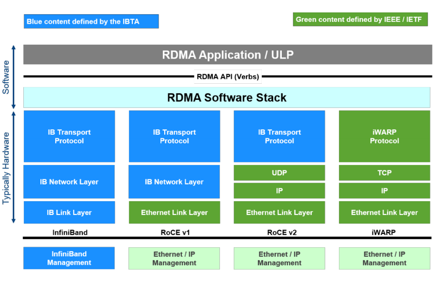

图 12：三种 RDMA 技术的软件栈 ([来源](https://www.snia.org/sites/default/files/ESF/How_Ethernet_RDMA_Protocols_Support_NVMe_over_Fabrics_Final.pdf))

### 2.2	GPU Direct RDMA

**2.2.1	简介**

GPUDirect RDMA 技术支持 Server1 的 GPU 内存可以通过同一 root complex 下的网卡直接访问对端 Server2 的 GPU 内存，如下图所示。GPU 通信通道中无需 CPU 参与，大幅度降低了 CPU 间通信的延迟。

图 13：GPUDirect RDMA ([来源](https://developer.nvidia.com/gpudirect))

将 GPUDirect 1.0 与 GPUDirect RDMA 的通信进行对比，也能看出使用 GPUDirect RDMA 进一步减少了 GPU 通信的数据复制次数，进一步降低了通信延迟。

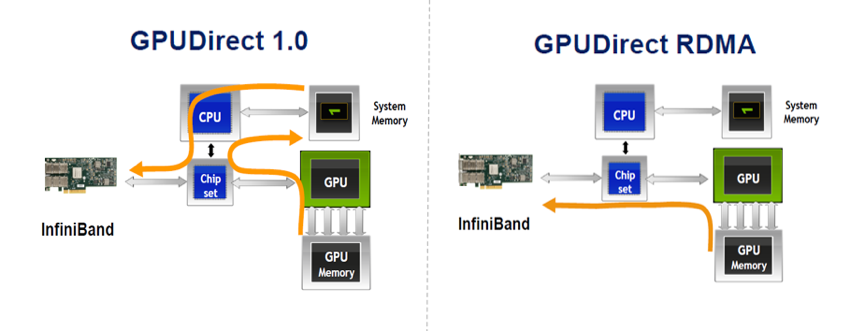

图 14：GPUDirect 1.0 vs GPUDirect RDMA

**2.2.2	性能**

中科曙光基于 GPUDirect RDMA 的性能测试的结果显示，GPUDirect RDMA 在小包通信的传输带宽和网络延迟方面可以带来至少 3 倍的性能提升([数据来源](https://images.nvidia.com/cn/tesla/success-stories/super-computing/NV template_GPUDirect RDMA 让加速更深入_Sugon.pdf))。

在 40Gbps 以太网上测试 GPUDirect RDMA 的性能测试结果如下。

图 15：enable GDR vs disable GDR 吞吐量 ([来源)](https://www.chelsio.com/wp-content/uploads/resources/T5-40Gb-Linux-GPUDirect.pdf)

上图比较了不同的 I/O size，使用 GPUDirect RDMA 和不使用的吞吐量数据。结果显示 I/O size 越大，GPUDirect RDMA 的优势越明显，在 I/O size 在 8192 时，GPUDirect RDMA 有 4 倍的性能提升。

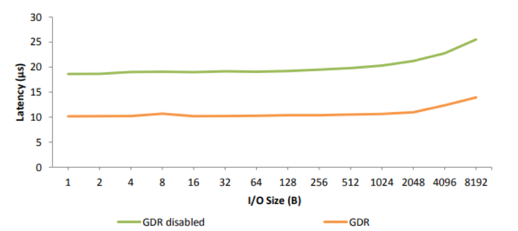

图 16：enable GDR vs disable GDR 时延 ([来源](https://www.chelsio.com/wp-content/uploads/resources/T5-40Gb-Linux-GPUDirect.pdf))

上图为不同的 I/O size 下，使用 GPUDirect RDMA 和不使用时的时延数据。数据显示在使用 GPUDirect RDMA 后，时延显著降低，从接近 20 微妙下降到 10 微妙左右。

### 2.3	IPOIB

IPoIB（Internet Protocol over InfiniBand），指利用物理 IB 网络（包括服务器上的 IB 卡、IB 连接线、IB 交换机等）通过 IP 协议进行连接，并进行数据传输。它提供了基于 RDMA 之上的 IP 网络模拟层，允许应用无修改的运行在 Infiniband 网络上。但是，IPoIB 仍然经过内核层（IP Stack），即会产生大量系统调用，并且涉及 CPU 中断，因此 IPoIB 性能比 RDMA 通信方式性能要低，大多数应用都会采用 RDMA 方式获取高带宽低延时的收益，少数的关键应用会采用 IPoIB 方式通信。

## 3、总结

本文主要介绍了 GPU 间通信技术，包括单机多卡间的 GPUDirect 和 NVLink 技术，多机多卡间的 IPOIB 和 GPUDirect RDMA 技术。在大规模计算中，单机场景下使用 NVLink 技术，分布式场景下使用 GPUDirect RDMA 技术，可以极大的缩短通信时间，提升整体性能。

当前华为云 CCI （Cloud Container Instance）服务已提供搭载 NVLink 的 Tesla V100 服务器，同时支持 IB 卡用于分布式场景下通信加速，后续我们选择一些训练场景进行实测。

