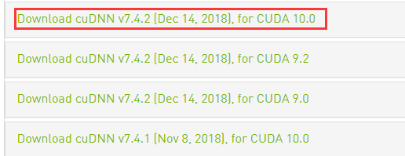
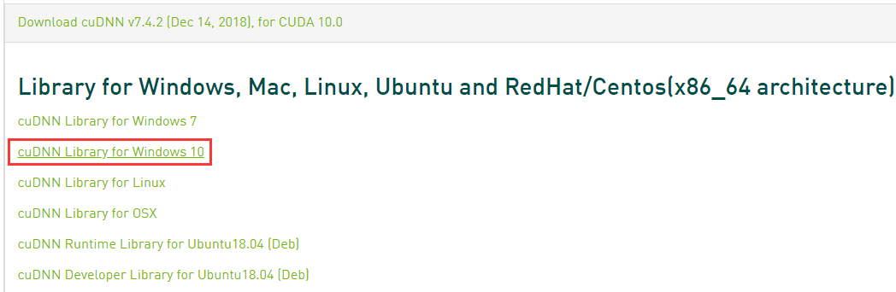
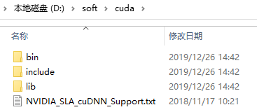
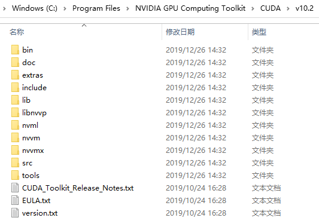
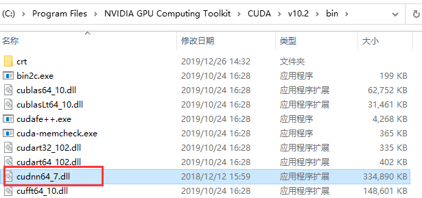
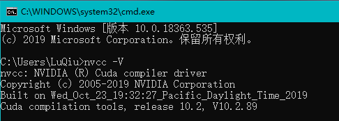
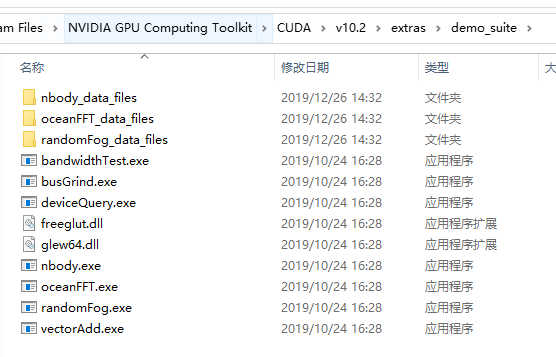
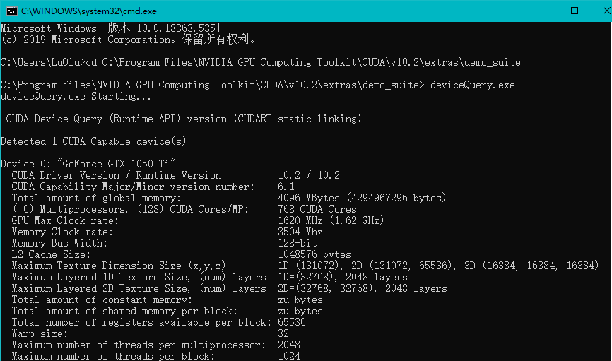
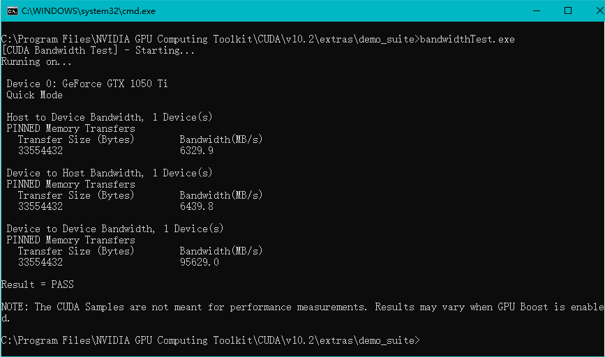

# windows 安装CUDA和CUDNN

⌚️: 2020年10月23日

📚参考

---

## 安装CUDA

## 安装cuDNN

下载 cuDNN，下载之前需要先注册一下 Nvidia 的账号，下载地址为：[https://developer.nvidia.com/rdp/cudnn-download](https://link.zhihu.com/?target=https%3A//developer.nvidia.com/rdp/cudnn-download) 根据上面的对应关系，此处下载7.4版本：

选择Windows10版本下载

下载完成之后将其解压，解压之后的目录如下：

需要将以上三个文件复制到CUDA的安装目录中，通过上面的安装，我们将CUDA安装到了 `C:\Program Files\NVIDIA GPU Computing Toolkit\CUDA\v10.2`目录中：

那么我们需要将：

- cuDNN中`bin`目录下的文件移动到 CUDA 的 `bin` 目录中

- cuDNN目录中的 `include` 中的文件移动到 CUDA 的 `include` 目录中
- cuDNN目录中的 `lib` 中的文件移动到 CUDA 的 `lib` 目录中

这样就完成了cuDNN的安装。

## 验证安装

安装完成CUDA，使用 `nvcc -V` 验证是否安装成功，看到如下信息说明安装成功

通过NVIDIA提供的 `deviceQuery.exe` 和 `bandwidthTest.exe` 来查看GPU的状态，两者均在安装目录的 `extras\demo_suite`文件夹中

首先运行 `deviceQuery.exe` ，可以看到如下结果：

运行 `bandwidthTest.exe` 看到如下结果：

