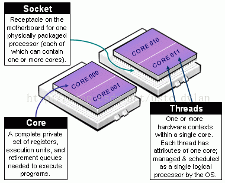
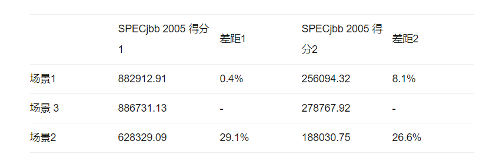

# NUMA & GPU

⌚️: 2020年10月23日

📚参考

----

## 1. [NUMA简介](https://www.cnblogs.com/sysk/p/4886209.html)

在传统的对称多处理器(SMP, Symmetric Multiprocessing)系统中，整个计算机中的所有cpu共享一个单独的内存控制器。当所有的cpu同时访问内存时，这个内存控制器常常成为性能瓶颈。同时，这种架构也不能适应使用大量的cpu的场景。于是，为了解决这些问题，越来越多的现代计算机系统采用了CC/NUMA(缓存一致性/非对称访存)架构。例如`AMD* Opteron*, IBM* Power5*, HP* Superdome, and SGI* Altix*`.

在SMP系统上，所有的cpu对共享内存控制器拥有相同的访问权限。cpu之间的访问这个共享资源的请求会导致拥塞。这个单独的内存控制器能够管理的内存大小也是有限的，很可能限制了整个系统的内存大小。另外，通过这个单独的通信中心也会导致时延高居不下。

于是，NUMA架构就被设计出来，解决SMP架构在扩展性方面的诸多限制。与SMP架构中整个系统只有一个内存控制器不同，NUMA系统中被分成多个node。每个node都有处理器和它自己控制的内存。这些处理器可以非常快速的访问node内部的本地内存。系统上所有的node使用一个快速的互联总线连接起来。每个新node加入，都会给系统提供更多的内存总带宽和内存访问性能，所以具备很高的扩展能力。

同一个node内部的处理器（一个numa node可能拥有多个cpu core）对于node内部的内存具有相同的读写能力。在一个numa系统中，cpu集成了内存控制器，例如AMD Opteron，一个numa node由一个单独的cpu组成，整个cpu具备了多个core或者多个处理线程。在其他更传统的NUMA系统中，例如SGI Altix或HP Superdome，大量的numa node（node内部类似一个SMP系统）由2个或4个cpu共享内存。

在一个NUMA系统中，每个cpu可以访问本地或者远端的内存，本地的内存位于同一个numa node中，cpu访问本地内存的时延开销很小。远端内存位于不同的numa node中，必须通过内部互联（例如QPI）才能访问。从软件的角度看来，访问远端内存与访问本地内存的方法相同；具有完全的缓存一致性。相对访问本地内存，访问远端内存要花费更长的时间，这是因为数据通过内部互联总线读取，导致了更多的时延。

理论上，软件可以按照相同的方式对待NUMA系统与SMP系统，忽略掉访问本地、远端内存的区别。实际上，也是经常这么做的。但是为了获得最佳的性能，应该考虑到NUMA、SMP架构差异引入的问题。

NUMA架构的一大优势就是：即使在一个拥有很多cpu的大系统中，cpu仍然能够以很低的时延访问本地内存。这是因为现代cpu的速度比内存芯片的速度快了很多。CPU经常要花费不小的时间来等待内存数据。最小化内存访问时延，可以显著的优化软件的性能。

NUMA的优化方式是：将内存通过特定node分配，并且让程序尽量快的读取这段内存。实现这种优化的首要方法是，线程通过node分配本地内存，并且保证这个线程一直工作在这个node上（通过node affinity来确定）。这将会获得最低的时延，最小的内部互联开销。

在SMP系统中，通常的优化方式被称为cache affinity。cache affinity尝试将数据维持在cpu的缓存中，而不是频繁的在cpu之间切换。这项工作通常有操作系统的调度器来完成。然后，这与node affinity有很大的不同点：在SMP系统中，当一个线程在cpu之间切换，它的缓存内容也跟着一同移动。一但一个内存区域被提交给一个特定的NUMA node，它将不会被一同调度到其他的numa node上。一个线程在不同node上切换，会增加访问内部互联总线的开销，导致访问时延的上升。这是为何NUMA系统比SMP系统更加需要实现node affinity。所以，cache affinity也是需要在NUMA系统上采用的优化手段。但是这些方法对于最佳的使用性能，并不足够。

 

The scheduler in the operating system cannot always optimize purely for node affinity, however. The problem is that not using a CPU in the system would be even worse than a process using remote memory and seeing higher memory latency. In cases where memory performance is more important than even use of all CPUs in the system,the application or the system administrator can override the default decisions of the operating system. This allows better optimization for specific workloads.


Linux上有系统调用用来将线程绑定到特定的cpu上（通过sched_set_affinity系统调用和schedutils库）。NUMA API拓展了这些功能，允许程序从特点的numa node上分配内存。为了使用户态程序能够更容易的优化NUMA配置，API导出了NUMA的拓扑信息，并且允许用户指定要使用的cpu和内存资源。同时，也有内核态的API为内核子系统提供了NUMA拓扑信息。

NUMA API可以描述线程与cpu、内存的布置情况。主要是用来关联内存的所在位置。另外，应用程序可以用它来单独设置cpu affinity。NUMA API当前（2005年）在SUSE LINUX Enterprise Server 9版本基于AMD64和Intel安腾系列处理器。

 

### 带宽优化

很多程序会使用NUMA API对内存访问的时延和带宽进行优化。大部分程序看起来更喜欢对时延进行优化，但是仍然有一小部分例外，需要对带宽进行优化。

使用numa node的本地内存可以获得最低的时延。如果要获得更大的带宽，多个结点的内存控制器可以被并行的使用。这很类似RAID通过将I/O操作并分到多个硬盘上来达到提高I/O性能的目的。NUMA API可以使用CPU中的MMU（内存管理单元）将来自不同内存控制器的内存块交织在一起。这意味着，在这个映射中的每个联系的页来自不同的numa node。

当一个程序对这个交错的内存区域，做一次大流量的内存访问，多个numa node的内存控制器的带宽复合在一起。这么做能有多大的效果要依赖于NUMA架构，特别是内部互联总线、本地与远端内存的访问时延。在一些系统中，只有相邻的numa node上运行才能有明显的效果。

对于一些NUMA系统，例如AMD Opteron，可以通过设置firmware实现在所有的numa node上交错内存访问。这被称为结点交错。结点交错类似NUMA API提供的交错模式，但是它们有显著的不同点。结点交错用在所有的内存访问上。NUMA API则对处理器、线程进行单独配置。如果firmware开启了结点交错，NUMA策略就被禁用了。要使用NUMA策略，就要在bios设置中，禁用掉结点交错功能。

通过NUMA API，应用程序可以单独的调整内存访问策略，选择对时延优化还是对带宽优化。

 

### 概述

内核管理处理器的内存策略和特定内存的映射。内核可以通过三个新的系统调用来控制，这通常由应用程序调用用户态的动态库libnuma来实现。libnuma是一套NUMA策略推荐的API。它比直接使用系统调用更加方便。这篇文章将会讲解这些更高层次的接口。如果程序代码不能被修改，管理员可以使用numactl命令行工具配置一些策略。相对来说，这比在程序中直接实现控制策略效果要差一些。

用户态的库、工具程序包含在numactl的RPM包中，与SUSE Linux Enterprise Server 9一同发布。另外，在这个软件包中，还有几个实用的工具，比如numastat可以收集内存分配的统计信息，numademo用了演示系统中不同numa策略的效果。软件包中也包含了所有函数、工具程序的帮助文档。

 

### 策略

NUMA API的主要任务是管理各种策略。这些策略可以用于处理器访问内存区域。NUMA API当前支持以下策略:

default            在本地numa node上分配内存(当前的线程已经开始运行)

bind              在一系列特定的numa node上分配内存

interleave          在一系列numa node上分配交错内存

preferred          优先在某个numa node上分配内存

bind与prefered区别是，在特定numa node上分配内存失败时，bind策略会直接报错返回失败信息，而preferred策略会回滚，再到其他的numa node上分配内存。使用bind策略会由于swapping，导致早期内存不足、时延上升。在libnuma中，preferred和bind是可以复合的，也可以在不同的线程中使用numa_set_strict函数进行单独配置。默认的是更有弹性的preferred内存分配方式。

每个进程（进程策略）或者每个内存区域都可以配置策略。子进程可以通过fork继承父进程的进程策略。在进程的上下文环境中，进程策略可以应用在所有的内存分配。这包括了由系统调用产生的内核的内存分配、文件缓存。中断通常在当前节点上分配内存。进程策略也通常应用在内核分配内存页的过程中。

每个内存区域策略也被称为VMA策略，它允许进程为地址空间内的内存块设置策略。内存区域策略相比进程策略优先级更高。内存区域策略最大的优势就是可以在分配内存之前生效。当前，只支持匿名进程内存、SYSV共享内存、shmem和tmpfs映射、巨页文件系统（hugetlbfs）。针对共享内存配置的策略会持续到共享内存区域或文件被删除。

 

### 简单的numactl示例

numactl是一个命令行工具，能够以特定的NUMA策略启动进程。可以在不修改或重新编译程序的前提下，设置NUMA策略。

以下是几个numactl的例子：

numactl --cpubind=0 --membind=0,1 program

使用node 0的cpu启动进程program，并且使用node 0或1为进程分配内存。cpubind后的参数是node序号，并不是cpu的序号。在多cpu组成一个numa node的系统中，cpu序号与numa node序号是不同的。

numactl --preferred=1 numactl --show

分配内存优选numa node 1上的cpu结果状态。

numactl --interleave=all numbercruncher

以交错内存的策略，运行numbercruncher程序

numactl --offset=1G --length=1G --membind=1 --file /dev/shm/A --touch 

将临时文件系统上的/dev/shm/A文件的第二GB数据绑定到numa node 1

numactl --localalloc /dev/shm/file

为共享内存文件/dev/shm/file重置策略

numactl --hardware

显示numa node的硬件信息

 

### NUMACTL：重要的命令行选项

以下是有关numactl的命令行选项的简介。这些命令行选项中的大部分需要带参数。系统中的每个numa node都有唯一的编号。一个结点掩码可以是以逗号分隔的node数列表、numa node范围（node1-node2）或者all（所有的node）。可以通过运行numactl --hardware来显示系统中所有可用的numa node。

numactl最常用到的就是给一个进程设置内存numa策略。策略由第一个参数给出，其后是要运行的程序名及其命令行参数。可用的命令行参数如下所示：

--membind=nodemask:

只在nodemask注明的node上分配内存

--interleave=nodemask:

将nodemask上所有的内存交错分配

--cpubind=nodemask:

只在nodemask上标名的cpu上运行程序，对内存分配策略不产生影响，只对进程调度有效果

--preferred=node:

从参数给出的node中优先分配内存

 

另外两个有用的选项：

--show:

打印当前进程从命令行启动shell命令中继承的NUMA策略

--hardware:

显示系统中所有可用的NUMA资源

 

其他关于numactl命令的细节，可以参考man页

 

### numactl：共享内存

numactl可以改变共享内存段的策略。这可以用来改变一个应用程序的策略。

一个程序由多个进程组成，这些进程使用了公同的共享内存。这在数据库服务器中很常见。对于单独的进程，最好是在当前的numa node上使用默认的内存分配策略。这样，就可以在读取本地数据结构时获得最低的内存访问时延。然而，共享内存段被运行在不同node节点上的多个进程共享。为了避免分配出内存的这个节点成为热点，将共享内存段设置为交错读取是更有益处。同时，对这块内存的访问也被分载到了所有的numa node上了。

使用更多复杂的numa策略也成为可能。当共享内存中的一部分被特定的处理器频繁的读取， 却很少被其他处理器访问，可以将这块内存与相应的NUMA node或者在将与之相邻的numa node绑定。     

这里的共享内存是指SYSV共享内存（由shmat系统调用获得）、tmpfs或shmfs（通常在/dev/shm下）文件系统中mmap映射的文件、巨页文件。共享内存策略可以在启动应用程序之前进行配置。共享内存的策略一直生效，直到这块共享内存被删除。

这个策略只能应用在新分配出的内存页。共享内存中已经存在的页面不能遵循这个策略。

 将1GB的tmpfs文件对应的内存设置成基于所有numa node分配：       

numactl --length=1G --file=/dev/shm/interleaved --interleave=all

巨页文件可以以相同的方式设置，但是文件的总长必须是巨页(huge page)大小的整数倍。

通过--offset=number参数可以指定共享内存或文件的便宜位置。所有的数字参数可以带单位：G、M、K。新文件的类型可以通过--mode=mode来配置。           

可以使用--strict参数。当使用--strict参数时，如果已经分配出的内存页没有遵循新的策略，numactl将会报错。        

numactl还有其他更多的选项，可以控制共享内存的类型。可以参考numactl的man页。                                                                                                                                                             

### LIBNUMA基础

文章写到这来，一直在描述numactl，它能够控制整个进程的内存分配策略。但是这种方法的缺陷是：只能控制整个进程的内存分配，不能区分不同的内存区域、线程的区别。对于很多程序，还需要更细粒度的内存分配策略。

这可以通过libnuma来实现。libnuma是一个共享库，应用程序可以调用，并且libnuma提供了配置NUMA策略的API。相比NUMA系统调用，它提供了更高级的接口，更适合在程序中使用。libnuma可以从numactl RPM包中获得。

程序连接libnuma库可以使用以下命令：

cc ... -lnuma

NUMA API函数、宏都定义在numa.h头文件中：

 

**[cpp]**[view plain](http://blog.csdn.net/vah101/article/details/40586545)[copy](http://blog.csdn.net/vah101/article/details/40586545)

 

1. \#include <numa.h>  
2. ...  
3. **if (numa_available() < 0) {**  
4. printf("Your system does not support NUMA API\n");  
5. ...  
6. }  
7. ... 

 

在任何一个NUMA API函数被调用之前，程序必须调用numa_available()函数。当这个函数返回负值，说明当前系统不支持任何一个NUMA策略。如果这样，所有其他NUMA API函数都是未定义的，并且不能被调用。

下一步通常调用numa_max_node()函数。这个函数能够上报当前系统中numa node的个数。numa node个数在程序内存策略配置的过程中需要用到。所有的程序应该使用动态的发现numa node的个数，而不是使用硬编码来设置numa node个数。

所有的libnuma状态保存在每个线程上。修改一个线程的numa策略，不会影响到同一个进程上的其他线程。

以下的章节将会通过范例介绍libnuma中函数的大概用法。一些不常用到的函数没有被提及。要想获得更多细节，请参考numa的man页。

 

### LIBNUMA：nodemask

libnuma通过numa.h中定义的抽象数据结构nodemask_t管理结点的集合。nodemast_t提供了一个描述结点数量的固定位的集合。系统中的每个结点都有对应的唯一数字。最大的数字通过numa_max_node()获得。最大的结点数是由NUM_NUM_NODES宏设置。很多NUMA API函数都会涉及nodemask。

通过nodemask_zero()函数，将nodemask初始化为空

 

**[cpp]**[view plain](http://blog.csdn.net/vah101/article/details/40586545)[copy](http://blog.csdn.net/vah101/article/details/40586545)

 

1. nodemask_t mask;  
2. nodemask_zero(&mask); 

一个单独的node可以由nodemask_set函数设置，有nodemask_clr清空。nodemask_equal用来比较两个nodemask。nodemask_isset比较nodemask中对应的位是否被置位。

 

 

**[cpp]**[view plain](http://blog.csdn.net/vah101/article/details/40586545)[copy](http://blog.csdn.net/vah101/article/details/40586545)

 

1. nodemask_set(&mask, maxnode); /* set node highest */  
2. **if (nodemask_isset(&mask, 1)) { /\* is node 1 set? \*/** 
3. ...  
4. }  
5. nodemask_clr(&mask, maxnode); /* clear highest node again */  

这里有两个预设的nodemask：numa_all_nodes代表系统中所有的结点，numa_no_node则是一个空集合。

 

numa_alloc_interleaved allocates memory interleaved on all nodes in the system.


### LIBNUMA：简单分配内存

 

libnuma提供了以特定策略分配内存的函数。这些函数将所有分配页的整数倍（在AMD系统上，页大小为4K）大小的内存，而且相对较慢。只适用于分配超过cpu缓存大小的较大的内存对象，NUMA策略很有可能对这些内存起作用。如果没有内存空间可以被分配，将会返回NULL。所有numa_alloc族函数的分配出的内存，应该由numa_free函数释放。

numa_alloc_onnode用来在一个给定的numa node上分配内存：

 

**[cpp]**[view plain](http://blog.csdn.net/vah101/article/details/40586545)[copy](http://blog.csdn.net/vah101/article/details/40586545)

 

1. **void \*mem = numa_alloc_onnode(MEMSIZE\_IN\_BYTES, 1);**  
2. **if (mem == NULL)**  
3. /* report out of memory error */  
4. ... pass mem to a **thread bound to node 1 ...**  

memsize应该小于node上的内存大小。切记，其他的程序也会在这个node上分配内存，如果这个node上所有的内存都被分配，将会导致内存被换出到硬盘。numa_node_size()函数可以被用来发现当前系统上的numa node大小限制。

 

线程最终需要释放内存，通过numa_free函数：

 

**[cpp]**[view plain](http://blog.csdn.net/vah101/article/details/40586545)[copy](http://blog.csdn.net/vah101/article/details/40586545)

 

1. numa_free(mem, memsize); 

默认情况下，numa_alloc_onnode首先尝试在特定的node上分配内存，如果失败，将会在其他有剩余内存空间的结点上分配内存。当numa_set_strict(1)先执行，numa_alloc_onnode函数在预设结点没有内存空间的情况下，将不会回滚错误，直接返回分配内存失败。在分配内存之前，内核会尝试将node上的内存换出到硬盘，并清除其他缓存，这将会导致时延。

 

numa_allocinterleaved在系统上的所有结点分配交错（interleaverd）内存

 

**[cpp]**[view plain](http://blog.csdn.net/vah101/article/details/40586545)[copy](http://blog.csdn.net/vah101/article/details/40586545)

 

1. **void \*mem = numa_alloc_interleaved(MEMSIZE\_IN\_BYTES);**  
2. **if (mem == NULL)**  
3. /* report out of memory error */  
4. ... run memory bandwidth intensive algorithm on mem ...  
5. numa\_free(mem, MEMSIZE_IN_BYTES); 

 

将内存交错在所有的结点上，并不一定能够达到最佳的性能。根据机器的NUMA架构，有时候只有相邻结点的交错内存才能获得更好的带宽。 numa_alloc_interleaved_subset函数可以只在几个给定的node上分配交错内存。

另外一个函数numa_alloc_local可以在本结点上分配内存。通常是默认用来进行内存分配，但是如果需要使用与进程的内存分配策略不同的策略时，需要首先指定策略。numa_alloc函数使用当前进程的策略分配内存。

 

### LIBNUMA：进程策略

每个线程都有一个默认的内存策略，继承自它的父线程。除非通过numactl来修改，这个策略通常是优先从本结点上优先分配内存。如果一个程序中现存的内存分配代码不能修改成numa_alloc函数，有时可以采用修改进程策略的方法达到目的。采用这种方法，给定的子函数可以在不修改代码的前提下以非默认策略的方式运行。

numa_set_interleave_mask函数可以让当前线程以交错（interleaving）方式分配内存。未来所有的内存，将会从掩码给定的结点上轮询（round robing）分配。numa_all_nodes将内存分配交错（interleaving）在所有的node上。numa_no_nodes将会关闭交错分配内存。numa_get_interleave_mask函数返回当前的交错掩码。这可以将当前的内存分配策略保存到文件中，在策略修改后，再次恢复。

 

**[cpp]**[view plain](http://blog.csdn.net/vah101/article/details/40586545)[copy](http://blog.csdn.net/vah101/article/details/40586545)

 

1. numamask_t oldmask = numa_get_interleave_mask();  
2. numa_set_interleave_mask(&numa_all_nodes);  
3. /* run memory bandwidth intensive legacy library that allocates memory */ 
4. numa_set_interleave_mask(&oldmask);  

numa_set_preferred设置当前线程优先分配内的结点。内存分配器先尝试从这个结点上分配内存。如果这个结点没有足够的空间，它会尝试其他结点。

 

numa_set_membind设置了严格的内存绑定掩码。严格意味着内存必须从指定的结点上分配。如果在内存交换以后，结点上仍然没有足够的内存，分配操作就会失败。

numa_set_membind返回当前的内存绑定掩码。

numa_set_localalloc将进程的策略设置为标准的本地分配策略。


### LIBNUMA：已经存在内存区域的策略

```
Redhat 或者Centos系统中可以通过命令# grep -i numa /var/log/dmesg
 查看输出结果：
如果输出结果为：
No NUMA configuration found
说明numa为disable，如果不是上面的内容说明numa为enable
```

## 2. Reproducible Performance on HPC | Affinity

[链接1](https://gcoe-dresden.de/reproducible-performance-on-hpc-affinity/) | [链接2](https://books.google.co.jp/books?id=DViWDwAAQBAJ&pg=PA231&lpg=PA231&dq=numactl+CPU+Affinity+GPU&source=bl&ots=u0Ra1chR6x&sig=ACfU3U0et_Fs_Gwhamz72HGkxB9PKBZbcA&hl=zh-CN&sa=X&ved=2ahUKEwiWktmH-IfqAhUGfXAKHSWNCUkQ6AEwCHoECAoQAQ#v=onepage&q&f=false)

---


[Blog](https://gcoe-dresden.de/category/blog/) by [Matthias Werner](https://gcoe-dresden.de/author/matwerne/)

Developing highly performant code for GPUs is a task with many pitfalls. And to run that code efficiently with a reproducible outcome is another. This part of our blog covers the pinning of tasks to cores within a multi-socket system.

为GPU开发高性能的代码是一项有很多陷阱的任务。而有效地运行这些代码并获得可重复的结果则是另一项任务。我们博客的这部分内容涵盖了在多插槽系统中将任务钉入核心的问题。

### Affinity

[Processor affinity](http://eli.thegreenplace.net/2016/c11-threads-affinity-and-hyperthreading/), or CPU pinning, allows to pin a process or a thread to CPU cores, e.g., for efficient communication and caching. To explain things more practically, we take a non-uniform architectures (NUMA) such as the dual-socket system [E5-2680-v3](http://ark.intel.com/products/81908/Intel-Xeon-Processor-E5-2680-v3-30M-Cache-2_50-GHz) as an example. By `lstopo --no-io --no-legend haswell.png` the topology of one of our haswell nodes becomes visualized:


On the top layer you can see the two NUMA nodes represented by the two CPU sockets, each with 32GB of DRAM. On such a socket there are 12 CPU cores, which have their own L1 and L2 caches. The L3 cache with 30 MB is shared by all the 12 CPU cores.

What we cannot see in the picture above is the [QuickPath Interconnect](https://en.wikipedia.org/wiki/Intel_QuickPath_Interconnect) (QPI) between the memory controllers in the two sockets (AMD's counterpart is [HyperTransport](https://en.wikipedia.org/wiki/HyperTransport)). The QPI bus takes care of the inter-socket traffic as illustrated by the following picture (source: [Frank Denneman](http://frankdenneman.nl/2016/07/07/numa-deep-dive-part-1-uma-numa/)).


Depending on the clockrate QPI delivers 20-25 GB/s of bandwidth (bidirectional). Well, what does it have to do with GPUs? GPUs are typically connected with PCIe to PCIe switches on the CPU die. Sharing data between non-adjacent GPUs incurs a QPI-hop. This forwarding of PCIe packets takes the performance down.

**In current generations (IvyBridge) of Intel Xeon processor E5-2600 series CPUs, the generally really useful QPI link introduces significant latency when forwarding PCIe packets between processors due to the way the packets are buffered and forwarded. (source: [The Cirrascale Blog](http://www.cirrascale.com/blog/index.php/exploring-the-pcie-bus-routes/))**

This also has consequences how you allocate the data and which devices you can use to avoid such a detour. And you have to know how your job manager enumerates the cores. If you start a job with 4 CPUs and 4 GPUs (K80) on a dual socket system, you probably will receive this topology:

```css
$ nvidia-smi topo -m

GPU0    GPU1    GPU2    GPU3    mlx4_0  CPU Affinity
GPU0     X      PIX     SOC     SOC     SOC     0-3
GPU1    PIX      X      SOC     SOC     SOC     0-3
GPU2    SOC     SOC      X      PIX     PHB     0-3
GPU3    SOC     SOC     PIX      X      PHB     0-3
mlx4_0  SOC     SOC     PHB     PHB      X

Legend:

X   = Self
SOC  = Connection traversing PCIe as well as the SMP link between CPU sockets(e.g. QPI)
PHB  = Connection traversing PCIe as well as a PCIe Host Bridge (typically the CPU)
PXB  = Connection traversing multiple PCIe switches (without traversing the PCIe Host Bridge)
PIX  = Connection traversing a single PCIe switch
NV#  = Connection traversing a bonded set of # NVLinks
```

- CPUs 0-3 are located on node 0 = **first socket**
- CPUs 0-3 connects to GPU0-1 directly via PCIe
- CPUs 0-3 connects to GPU2-3 traversing SMP link / **QPI**

The allocated CPU cores 0-3 are located on the first socket, while GPU2-3 are connected to the cores of the other socket. `numactl` helps to show and to control the NUMA policy and in our example `numactl` confirms the topology:

```bash
$ numactl -s
policy: default
preferred node: current
physcpubind: 0 1 2 3
cpubind: 0
nodebind: 0
membind: 0 1

$ numactl -H
available: 2 nodes (0-1)
node 0 cpus: 0 1 2 3 4 5 6 7 8 9 10 11
node 0 size: 32663 MB
node 0 free: 30981 MB
node 1 cpus: 12 13 14 15 16 17 18 19 20 21 22 23
node 1 size: 32768 MB
node 1 free: 31819 MB
node distances:
node   0   1
0:  10  21
1:  21  10
```

### Control affinity with numactl

We now allocate exclusively a node whereby all GPUs and CPUs are visible. `numactl` controls the process and memory placement by node and memory IDs.

```bash
$ numactl -H
available: 2 nodes (0-1)
node 0 cpus: 0 1 2 3 4 5 6 7 8 9 10 11
node 0 size: 32663 MB
node 0 free: 20561 MB
node 1 cpus: 12 13 14 15 16 17 18 19 20 21 22 23
node 1 size: 32768 MB
node 1 free: 26344 MB
node distances:
node   0   1
0:  10  21
1:  21  10

$ numactl -s
policy: default
preferred node: current
physcpubind: 0 1 2 3 4 5 6 7 8 9 10 11 12 13 14 15 16 17 18 19 20 21 22 23
cpubind: 0 1
nodebind: 0 1
membind: 0 1
```

This is our slurm jobfile for the K80 to test the process pinning and the corresponding bandwidth (bandwidthTest from CUDA SDK).

```
#!/bin/bash
#SBATCH -J BandwidthK80Pinning
#SBATCH --ntasks=1
#SBATCH --gres=gpu:4
#SBATCH --time=0:01:00
#SBATCH --mem=2000M # gpu2
#SBATCH --exclusive
#SBATCH --partition=gpu2

srun --gpufreq=2505:823 numactl -m0 -N0 ./bandwidthTest # socket0, memory0
srun --gpufreq=2505:823 numactl -m1 -N1 ./bandwidthTest # socket1, memory1
```

Results are given in the picture below.


The diagrams show which impact an ill-placed GPU job can have. The throughput on the SandyBridge/K20Xm is mostly limited by PCIe v2 and downloading might be affected by the QPI. While the throughput on the Haswell/K80 suffers 15% of performance, the Haswell/P100 looses over 80% of the throughput when the pinned memory is transferred from the other CPU memory over the QPI. It looks like there is another factor which kills the PCIe performance. Coming to a more recent architecture, the throughput on the Broadwell/P100 system seems to be independent from the node pinning and reaches almost 13 GB/s. All these transfers excluded the memory used for ECC (20% memory footprint).

Take care of process pinning and node topology, especially when using older systems. To control the pinning you can use `numactl` or `taskset`. Some HPC job managers like Slurm also offer parameters for controlling the task affinity. Keep in mind, that job managers can have different policies to distribute your tasks on the cores. The GPU-CPU binding can be found via `nvidia-smi topo -m`.

## 3. NUMA概述

### NUMA是什么

【非统一内存访问（NUMA）是一种用于多处理器的电脑记忆体设计，内存访问时间取决于处理器的内存位置。 在NUMA下，处理器访问它自己的本地存储器的速度比非本地存储器（存储器的地方到另一个处理器之间共享的处理器或存储器）快一些。】

下图就描述了一个比较形象的NUMA架构：


我们有两个NUMA结点。每个NUMA结点有一些CPU, 一个内部总线，和自己的内存，甚至可以有自己的IO。每个CPU有离自己最近的内存可以直接访问。所以，使用NUMA架构，系统的性能会更快。在NUMA结构下，我们可以比较方便的增加CPU的数目。而在非NUMA架构下，增加CPU会导致系统总线负载很重，性能提升不明显。 

每个CPU也可以访问另外NUMA结点上的内存，但是这样的访问，速度会比较慢。我们要尽量避免。应用软件如果没有意识到这种结构，在NUMA机器上，有时候性能会更差，这是因为，他们经常会不自觉的去访问远端内存导致性能下降。

### NUMA的几个概念（Socket，Core，Thread , Node）



总结：

- Socket就是主板上的CPU插槽; 

- Core就是socket里独立的一组程序执行的硬件单元，比如寄存器，计算单元等; 

- Thread：就是超线程hyperthread的概念，逻辑的执行单元，独立的执行上下文，但是共享core内的寄存器和计算单元。

  

NUMA体系结构中多了Node的概念，这个概念其实是用来解决core的分组的问题，具体参见下图来理解（图中的OS CPU可以理解thread，那么core就没有在图中画出），从图中可以看出每个Socket里有两个node，共有4个socket，每个socket 2个node，每个node中有8个thread，总共4（Socket）× 2（Node）× 8 （4core × 2 Thread） = 64个thread。


根据上面提到的，由于每个node内部有自己的CPU总线和内存，所以如果一个虚拟机的vCPU跨不同的Node的话，就会导致一个node中的CPU去访问另外一个node中的内存的情况，这就导致内存访问延迟的增加。在有些特殊场景下，比如NFV环境中，对性能有比较高的要求，就非常需要同一个虚拟机的vCPU尽量被分配到同一个Node中的pCPU上。

### 如何查看机器的NUMA拓扑结构

比较常用的命令就是lscpu，具体输出如下：

```
dylan@hp3000:~$ lscpu   
Architecture:          x86_64  
CPU op-mode(s):        32-bit, 64-bit  
Byte Order:            Little Endian  
CPU(s):                48                                       //共有48个逻辑CPU（threads）  
On-line CPU(s) list:   0-47  
Thread(s) per core:    2                               //每个core有2个threads  
Core(s) per socket:    6                                //每个socket有6个cores  
Socket(s):             4                                      //共有4个sockets  
NUMA node(s):          4                               //共有4个NUMA nodes  
Vendor ID:             GenuineIntel  
CPU family:            6  
Model:                 45  
Stepping:              7  
CPU MHz:               1200.000  
BogoMIPS:              4790.83  
Virtualization:        VT-x  
L1d cache:             32K                           //L1 data cache 32k  
L1i cache:             32K                            //L1 instruction cache 32k  （牛x机器表现，冯诺依曼+哈弗体系结构）  
L2 cache:              256K  
L3 cache:              15360K  
NUMA node0 CPU(s):     0-5,24-29        
NUMA node1 CPU(s):     6-11,30-35  
NUMA node2 CPU(s):     12-17,36-41  
NUMA node3 CPU(s):     18-23,42-47  
```

### 测试

事出这一段时间做了不少基于SPECjbb2005的系统性能测试，发觉对于不少平台，可以出现相当大的采样偏差，而有这么一台主机却表现的相当稳定。仔细排查之后，最终定位到了NUMA。

之前曾经介绍过[NUMA的原理](https://link.zhihu.com/?target=http%3A//www.litrin.net/2014/06/18/linux%e7%9a%84numa%e6%9c%ba%e5%88%b6/)以及基于[Cgroup的NUMA设定](https://link.zhihu.com/?target=http%3A//www.litrin.net/2016/05/18/cgroup%e7%9a%84cpuset%e9%97%ae%e9%a2%98/)。

这次我采用的是通过docker封装好的SPECjbb2005，Docker从本质上说底层就是一个cgroup。

首先是机器的NUMA拓扑：

```bash
# # numactl -H
available: 2 nodes (0-1)
node 0 cpus: 0 1 2 3 4 5 6 7 8 9 10 11 12 13 14 15 32 33 34 35 36 37 38 39 40 41 42 43 44 45 46 47
node 0 size: 130502 MB
node 0 free: 123224 MB
node 1 cpus: 16 17 18 19 20 21 22 23 24 25 26 27 28 29 30 31 48 49 50 51 52 53 54 55 56 57 58 59 60 61 62 63
node 1 size: 131072 MB
node 1 free: 126082 MB
node distances:
node 0 1
 0: 10 21
 1: 21 10
```

开启HT之后，系统显示64个core，其中core 0-15,32-47位于NUMA node0，Core16-31,48-63 位于 NUMA node1

通过限制cpuset-cpus，cpuset-mems只允许SPECjbb运行在core 0-15,32-47，并只能访问NUMA node1

```text
docker run --cpuset-cpus=0-15,32-47 --cpuset-mems=0 specjbb
```

然后就是之允许方位node1

```text
docker run --cpuset-cpus=0-15,32-47 --cpuset-mems=1 specjbb
```

最后就是不做任何限定

```text
docker run --cpuset-cpus=0-15,32-47 specjbb
```

一开始我自己觉得这3个场景的性能差异应该不会很大，谁知道拿出数据来之后我傻了。





**几个误区：**

- 只允许CPU访问自己本地的NUMA node并不能得到最高的性能，有的时候NUMA node也有性能瓶颈。
- 错误的NUMA设置其实会带来相当大的性能差距。
- 还有一个从上表的数据上看不出来：一旦你设置了允许CPU访问任何一个node，性能会有些许提升，但带来的结果偏差会变得很大。