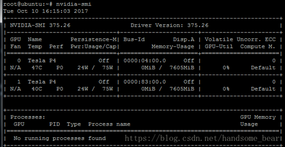
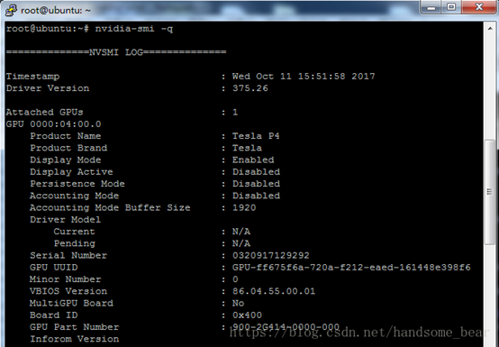
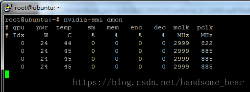
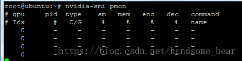

# NVIDIA-SMI系列命令总结

⌚️: 2020年10月23日

📚参考

----

## 1. NVIDIA-SMI介绍

nvidia-smi简称NVSMI，提供监控GPU使用情况和更改GPU状态的功能，是一个跨平台工具，它支持所有标准的NVIDIA驱动程序支持的Linux发行版以及从WindowsServer 2008 R2开始的64位的系统。该工具是N卡驱动附带的，只要安装好驱动后就会有它。

Windows下程序位置：C:\Program Files\NVIDIACorporation\NVSMI\nvidia-smi.exe。Linux下程序位置：/usr/bin/nvidia-smi，由于所在位置已经加入PATH路径，可直接输入nvidia-smi运行。

 

## 2. NVIDIA-SMI命令系列详解

### 2.1 nvidia-smi

显示所有GPU的当前信息状态

 

显示的表格中：

```
Fan：           风扇转速（0%--100%），N/A表示没有风扇
Temp：         GPU温度（GPU温度过高会导致GPU频率下降）
Perf：          性能状态，从P0（最大性能）到P12（最小性能）
Pwr：           GPU功耗
Persistence-M：  持续模式的状态（持续模式耗能大，但在新的GPU应用启动时花费时间更少）
Bus-Id：        GPU总线，domain:bus:device.function
Disp.A：        Display Active，表示GPU的显示是否初始化
Memory-Usage：显存使用率
Volatile GPU-Util：GPU使用率
ECC：          是否开启错误检查和纠正技术，0/DISABLED, 1/ENABLED
Compute M.：   计算模式，0/DEFAULT,1/EXCLUSIVE_PROCESS,2/PROHIBITED

附加选项：
nvidia-smi –i xxx
指定某个GPU

nvidia-smi –l xxx
动态刷新信息（默认5s刷新一次），按Ctrl+C停止，可指定刷新频率，以秒为单位

nvidia-smi –f xxx
将查询的信息输出到具体的文件中，不在终端显示
```

### 2.2 nvidia-smi -q

查询所有GPU的当前详细信息

 

附加选项：

```
nvidia-smi –q –u
显示单元而不是GPU的属性

nvidia-smi –q –i xxx
指定具体的GPU或unit信息

nvidia-smi –q –f xxx
将查询的信息输出到具体的文件中，不在终端显示

nvidia-smi –q –x
将查询的信息以xml的形式输出

nvidia-smi -q –d xxx
指定显示GPU卡某些信息，xxx参数可以为MEMORY, UTILIZATION, ECC, TEMPERATURE, POWER,CLOCK, COMPUTE, PIDS, PERFORMANCE, SUPPORTED_CLOCKS, PAGE_RETIREMENT,ACCOUNTING

nvidia-smi –q –l xxx
动态刷新信息，按Ctrl+C停止，可指定刷新频率，以秒为单位

nvidia-smi --query-gpu=gpu_name,gpu_bus_id,vbios_version --format=csv
选择性查询选项，可以指定显示的属性选项
root@node01:~# nvidia-smi --query-gpu=gpu_name,gpu_bus_id,vbios_version --format=csv

name, pci.bus_id, vbios_version
Tesla P40, 00000000:02:00.0, 86.02.23.00.01

可查看的属性有：timestamp，driver_version，pci.bus，pcie.link.width.current等。（可查看nvidia-smi--help-query–gpu来查看有哪些属性）


```

### 2.3 设备修改选项

可以手动设置GPU卡设备的状态选项

```
nvidia-smi –pm 0/1
设置持久模式：0/DISABLED,1/ENABLED

nvidia-smi –e 0/1
切换ECC支持：0/DISABLED, 1/ENABLED

nvidia-smi –p 0/1
重置ECC错误计数：0/VOLATILE, 1/AGGREGATE

nvidia-smi –c
设置计算应用模式：0/DEFAULT,1/EXCLUSIVE_PROCESS,2/PROHIBITED

nvidia-smi –r
GPU复位

nvidia-smi –vm
设置GPU虚拟化模式

nvidia-smi –ac xxx,xxx
设置GPU运行的工作频率。e.g. nvidia-smi –ac2000,800

nvidia-smi –rac
将时钟频率重置为默认值

nvidia-smi –acp 0/1
切换-ac和-rac的权限要求，0/UNRESTRICTED, 1/RESTRICTED

nvidia-smi –pl
指定最大电源管理限制（瓦特）

nvidia-smi –am 0/1
启用或禁用计数模式，0/DISABLED,1/ENABLED

nvidia-smi –caa
清除缓冲区中的所有已记录PID，0/DISABLED,1/ENABLED
```

### 2.4 nvidia-smi dmon

设备监控命令，以滚动条形式显示GPU设备统计信息。

GPU统计信息以一行的滚动格式显示，要监控的指标可以基于终端窗口的宽度进行调整。 监控最多4个GPU，如果没有指定任何GPU，则默认监控GPU0-GPU3（GPU索引从0开始）。

 

附加选项：

```
nvidia-smi dmon –i xxx
用逗号分隔GPU索引，PCI总线ID或UUID

nvidia-smi dmon –d xxx
指定刷新时间（默认为1秒）

nvidia-smi dmon –c xxx
显示指定数目的统计信息并退出
root@node01:~# nvidia-smi dmon -c 3
# gpu   pwr gtemp mtemp    sm   mem   enc   dec  mclk  pclk
# Idx     W     C     C     %     %     %     %   MHz   MHz
    0    47    36     -     0     0     0     0  3615   999
    0    50    36     -     0     0     0     0  3615  1303
    0    50    36     -     0     0     0     0  3615  1303
root@node01:~#


nvidia-smi dmon –s xxx
指定显示哪些监控指标（默认为puc），其中：
p：电源使用情况和温度（pwr：功耗，temp：温度）
u：GPU使用率（sm：流处理器，mem：显存，enc：编码资源，dec：解码资源）
c：GPU处理器和GPU内存时钟频率（mclk：显存频率，pclk：处理器频率）
v：电源和热力异常
m：FB内存和Bar1内存
e：ECC错误和PCIe重显错误个数
t：PCIe读写带宽


nvidia-smi dmon –o D/T
指定显示的时间格式D：YYYYMMDD，THH:MM:SS

nvidia-smi dmon –f xxx
将查询的信息输出到具体的文件中，不在终端显示
```

### 2.5  nvidia-smi pmon

进程监控命令，以滚动条形式显示GPU进程状态信息。

GPU进程统计信息以一行的滚动格式显示，此工具列出了GPU所有进程的统计信息。要监控的指标可以基于终端窗口的宽度进行调整。 监控最多4个GPU，如果没有指定任何GPU，则默认监控GPU0-GPU3（GPU索引从0开始）。

 

附加选项：

```
nvidia-smi pmon –i xxx
用逗号分隔GPU索引，PCI总线ID或UUID

nvidia-smi pmon –d xxx
指定刷新时间（默认为1秒，最大为10秒）

nvidia-smi pmon –c xxx
显示指定数目的统计信息并退出

nvidia-smi pmon –s xxx
指定显示哪些监控指标（默认为u），其中：
u：GPU使用率
m：FB内存使用情况


nvidia-smi pmon –o D/T
指定显示的时间格式D：YYYYMMDD，THH:MM:SS

nvidia-smi pmon –f xxx
将查询的信息输出到具体的文件中，不在终端显示
```


## 3. [英文版](https://www.microway.com/hpc-tech-tips/nvidia-smi_control-your-gpus/)

Most users know how to check the status of their CPUs, see how much system memory is free, or find out how much disk space is free. In contrast, keeping tabs on the health and status of GPUs has historically been more difficult. If you don’t know where to look, it can even be difficult to determine the type and capabilities of the GPUs in a system. Thankfully, NVIDIA’s latest hardware and software tools have made good improvements in this respect.

The tool is NVIDIA’s System Management Interface (`nvidia-smi`). Depending on the generation of your card, various levels of information can be gathered. Additionally, GPU configuration options (such as ECC memory capability) may be enabled and disabled.

As an aside, if you find that you’re having trouble getting your NVIDIA GPUs to run GPGPU code, `nvidia-smi` can be handy. For example, on some systems the proper NVIDIA devices in `/dev` are not created at boot. Running a simple `nvidia-smi` query as root will initialize all the cards and create the proper devices in `/dev`. Other times, it’s just useful to make sure all the GPU cards are visible and communicating properly. Here’s the default output from a recent version with four Tesla V100 GPU cards:

```
nvidia-smi
 
+-----------------------------------------------------------------------------+
| NVIDIA-SMI 410.48                 Driver Version: 410.48                    |
|-------------------------------+----------------------+----------------------+
| GPU  Name        Persistence-M| Bus-Id        Disp.A | Volatile Uncorr. ECC |
| Fan  Temp  Perf  Pwr:Usage/Cap|         Memory-Usage | GPU-Util  Compute M. |
|===============================+======================+======================|
|   0  Tesla V100-PCIE...  Off  | 00000000:18:00.0 Off |                    0 |
| N/A   40C    P0    55W / 250W |  31194MiB / 32480MiB |     44%      Default |
+-------------------------------+----------------------+----------------------+
|   1  Tesla V100-PCIE...  Off  | 00000000:3B:00.0 Off |                    0 |
| N/A   40C    P0    36W / 250W |  30884MiB / 32480MiB |      0%      Default |
+-------------------------------+----------------------+----------------------+
|   2  Tesla V100-PCIE...  Off  | 00000000:86:00.0 Off |                    0 |
| N/A   41C    P0    39W / 250W |  30884MiB / 32480MiB |      0%      Default |
+-------------------------------+----------------------+----------------------+
|   3  Tesla V100-PCIE...  Off  | 00000000:AF:00.0 Off |                    0 |
| N/A   39C    P0    37W / 250W |  30884MiB / 32480MiB |      0%      Default |
+-------------------------------+----------------------+----------------------+
                                                                               
+-----------------------------------------------------------------------------+
| Processes:                                                       GPU Memory |
|  GPU       PID   Type   Process name                             Usage      |
|=============================================================================|
|    0    305892      C   /usr/bin/python                            31181MiB |
+-----------------------------------------------------------------------------+
```

### 3.1 Persistence Mode

On Linux, you can set GPUs to persistence mode to keep the NVIDIA driver loaded even when no applications are accessing the cards. This is particularly useful when you have a series of short jobs running. Persistence mode uses a few more watts per idle GPU, but prevents the fairly long delays that occur each time a GPU application is started. It is also necessary if you’ve assigned specific clock speeds or power limits to the GPUs (as those changes are lost when the NVIDIA driver is unloaded). Enable persistence mode on all GPUS by running:

`nvidia-smi -pm 1`

On Windows, nvidia-smi is not able to set persistence mode. Instead, you need to set your computational GPUs to *TCC mode*. This should be done through NVIDIA’s graphical GPU device management panel.

### 3.2 GPUs supported by nvidia-smi

NVIDIA’s SMI tool supports essentially any NVIDIA GPU released since the year 2011. These include the Tesla, Quadro, and GeForce devices from Fermi and higher architecture families (Kepler, Maxwell, Pascal, Volta, etc).

> Supported products include:
> Tesla: S1070, S2050, C1060, C2050/70, M2050/70/90, X2070/90, K10, K20, K20X, K40, K80, M40, P40, P100, V100
> Quadro: 4000, 5000, 6000, 7000, M2070-Q, K-series, M-series, P-series, RTX-series
> GeForce: varying levels of support, [with fewer metrics available than on the Tesla and Quadro products](http://www.microway.com/knowledge-center-articles/comparison-of-nvidia-geforce-gpus-and-nvidia-tesla-gpus/)

### 3.3 Querying GPU Status

Microway’s [GPU Test Drive cluster](http://www.microway.com/tesla/gputestdrive/), which we provide as a benchmarking service to our customers, contains a group of NVIDIA’s latest Tesla GPUs. These are NVIDIA’s high-performance compute GPUs and provide a good deal of health and status information. The examples below are taken from this internal cluster.

To list all available NVIDIA devices, run:

```
nvidia-smi -L

GPU 0: Tesla K40m (UUID: GPU-d0e093a0-c3b3-f458-5a55-6eb69fxxxxxx)
GPU 1: Tesla K40m (UUID: GPU-d105b085-7239-3871-43ef-975ecaxxxxxx)
```

To list certain details about each GPU, try:

```
nvidia-smi --query-gpu=index,name,uuid,serial --format=csv

0, Tesla K40m, GPU-d0e093a0-c3b3-f458-5a55-6eb69fxxxxxx, 0323913xxxxxx
1, Tesla K40m, GPU-d105b085-7239-3871-43ef-975ecaxxxxxx, 0324214xxxxxx
```

To monitor overall GPU usage with 1-second update intervals:

```
nvidia-smi dmon

# gpu   pwr gtemp mtemp    sm   mem   enc   dec  mclk  pclk
# Idx     W     C     C     %     %     %     %   MHz   MHz
    0    43    35     -     0     0     0     0  2505  1075
    1    42    31     -    97     9     0     0  2505  1075
(in this example, one GPU is idle and one GPU has 97% of the CUDA sm "cores" in use)
```

To monitor per-process GPU usage with 1-second update intervals:

```
nvidia-smi pmon

# gpu        pid  type    sm   mem   enc   dec   command
# Idx          #   C/G     %     %     %     %   name
    0      14835     C    45    15     0     0   python         
    1      14945     C    64    50     0     0   python
(in this case, two different python processes are running; one on each GPU)
```

### 3.4 Monitoring and Managing GPU Boost

The **GPU Boost** feature which NVIDIA has included with more recent GPUs allows the GPU clocks to vary depending upon load (achieving maximum performance so long as power and thermal headroom are available). However, the amount of available headroom will vary by application (and even by input file!) so users and administrators should keep their eyes on the status of the GPUs.

A listing of available clock speeds can be shown for each GPU (in this case, the Tesla V100):

```
nvidia-smi -q -d SUPPORTED_CLOCKS

GPU 00000000:18:00.0
    Supported Clocks
        Memory                      : 877 MHz
            Graphics                : 1380 MHz
            Graphics                : 1372 MHz
            Graphics                : 1365 MHz
            Graphics                : 1357 MHz
            [...159 additional clock speeds omitted...]
            Graphics                : 157 MHz
            Graphics                : 150 MHz
            Graphics                : 142 MHz
            Graphics                : 135 MHz
```

As shown, the Tesla V100 GPU supports 167 different clock speeds (from 135 MHz to 1380 MHz). However, only one memory clock speed is supported (877 MHz). Some GPUs support two different memory clock speeds (one high speed and one power-saving speed). Typically, such GPUs only support a single GPU clock speed when the memory is in the power-saving speed (which is the idle GPU state). On all recent Tesla and Quadro GPUs, GPU Boost automatically manages these speeds and runs the clocks as fast as possible (within the thermal/power limits and any limits set by the administrator).

To review the current GPU clock speed, default clock speed, and maximum possible clock speed, run:

```
nvidia-smi -q -d CLOCK

GPU 00000000:18:00.0
    Clocks
        Graphics                    : 1230 MHz
        SM                          : 1230 MHz
        Memory                      : 877 MHz
        Video                       : 1110 MHz
    Applications Clocks
        Graphics                    : 1230 MHz
        Memory                      : 877 MHz
    Default Applications Clocks
        Graphics                    : 1230 MHz
        Memory                      : 877 MHz
    Max Clocks
        Graphics                    : 1380 MHz
        SM                          : 1380 MHz
        Memory                      : 877 MHz
        Video                       : 1237 MHz
    Max Customer Boost Clocks
        Graphics                    : 1380 MHz
    SM Clock Samples
        Duration                    : 0.01 sec
        Number of Samples           : 4
        Max                         : 1230 MHz
        Min                         : 135 MHz
        Avg                         : 944 MHz
    Memory Clock Samples
        Duration                    : 0.01 sec
        Number of Samples           : 4
        Max                         : 877 MHz
        Min                         : 877 MHz
        Avg                         : 877 MHz
    Clock Policy
        Auto Boost                  : N/A
        Auto Boost Default          : N/A
```

Ideally, you’d like all clocks to be running at the highest speed all the time. However, this will not be possible for all applications. To review the current state of each GPU and any reasons for clock slowdowns, use the PERFORMANCE flag:

```
nvidia-smi -q -d PERFORMANCE

GPU 00000000:18:00.0
    Performance State               : P0
    Clocks Throttle Reasons
        Idle                        : Not Active
        Applications Clocks Setting : Not Active
        SW Power Cap                : Not Active
        HW Slowdown                 : Not Active
            HW Thermal Slowdown     : Not Active
            HW Power Brake Slowdown : Not Active
        Sync Boost                  : Not Active
        SW Thermal Slowdown         : Not Active
        Display Clock Setting       : Not Active
```

If any of the GPU clocks is running at a slower speed, one or more of the above *Clocks Throttle Reasons* will be marked as active. The most concerning condition would be if *HW Slowdown* was active, as this would most likely indicate a power or cooling issue. The remaining conditions typically indicate that the card is idle or has been manually set into a slower mode by a system administrator.

### 3.5 Reviewing System/GPU Topology and NVLink with nvidia-smi

To properly take advantage of more advanced NVIDIA GPU features (such as GPU Direct), it is vital that the system topology be properly configured. The topology refers to how the various system devices (GPUs, InfiniBand HCAs, storage controllers, etc.) connect to each other and to the system’s CPUs. Certain topology types will reduce performance or even cause certain features to be unavailable. To help tackle such questions, `nvidia-smi` supports system topology and connectivity queries:

```
nvidia-smi topo --matrix

        GPU0    GPU1    GPU2    GPU3    mlx4_0  CPU Affinity
GPU0     X      PIX     PHB     PHB     PHB     0-11
GPU1    PIX      X      PHB     PHB     PHB     0-11
GPU2    PHB     PHB      X      PIX     PHB     0-11
GPU3    PHB     PHB     PIX      X      PHB     0-11
mlx4_0  PHB     PHB     PHB     PHB      X 

Legend:

  X   = Self
  SOC = Path traverses a socket-level link (e.g. QPI)
  PHB = Path traverses a PCIe host bridge
  PXB = Path traverses multiple PCIe internal switches
  PIX = Path traverses a PCIe internal switch
```

Reviewing this section will take some getting used to, but can be very valuable. The above configuration shows two Tesla K80 GPUs and one Mellanox FDR InfiniBand HCA (`mlx4_0`) all connected to the first CPU of a server. Because the CPUs are 12-core Xeons, the topology tool recommends that jobs be assigned to the first 12 CPU cores (although this will vary by application).

Higher-complexity systems require additional care in examining their configuration and capabilities. Below is the output of nvidia-smi topology for the NVIDIA DGX-1 system, which includes two 20-core CPUs, eight NVLink-connected GPUs, and four Mellanox InfiniBand adapters:

```
	GPU0	GPU1	GPU2	GPU3	GPU4	GPU5	GPU6	GPU7	mlx5_0	mlx5_2	mlx5_1	mlx5_3	CPU Affinity
GPU0	 X 	NV1	NV1	NV2	NV2	SYS	SYS	SYS	PIX	SYS	PHB	SYS	0-19,40-59
GPU1	NV1	 X 	NV2	NV1	SYS	NV2	SYS	SYS	PIX	SYS	PHB	SYS	0-19,40-59
GPU2	NV1	NV2	 X 	NV2	SYS	SYS	NV1	SYS	PHB	SYS	PIX	SYS	0-19,40-59
GPU3	NV2	NV1	NV2	 X 	SYS	SYS	SYS	NV1	PHB	SYS	PIX	SYS	0-19,40-59
GPU4	NV2	SYS	SYS	SYS	 X 	NV1	NV1	NV2	SYS	PIX	SYS	PHB	20-39,60-79
GPU5	SYS	NV2	SYS	SYS	NV1	 X 	NV2	NV1	SYS	PIX	SYS	PHB	20-39,60-79
GPU6	SYS	SYS	NV1	SYS	NV1	NV2	 X 	NV2	SYS	PHB	SYS	PIX	20-39,60-79
GPU7	SYS	SYS	SYS	NV1	NV2	NV1	NV2	 X 	SYS	PHB	SYS	PIX	20-39,60-79
mlx5_0	PIX	PIX	PHB	PHB	SYS	SYS	SYS	SYS	 X 	SYS	PHB	SYS	
mlx5_2	SYS	SYS	SYS	SYS	PIX	PIX	PHB	PHB	SYS	 X 	SYS	PHB	
mlx5_1	PHB	PHB	PIX	PIX	SYS	SYS	SYS	SYS	PHB	SYS	 X 	SYS	
mlx5_3	SYS	SYS	SYS	SYS	PHB	PHB	PIX	PIX	SYS	PHB	SYS	 X 	

Legend:

  X    = Self
  SYS  = Connection traversing PCIe as well as the SMP interconnect between NUMA nodes (e.g., QPI/UPI)
  NODE = Connection traversing PCIe as well as the interconnect between PCIe Host Bridges within a NUMA node
  PHB  = Connection traversing PCIe as well as a PCIe Host Bridge (typically the CPU)
  PXB  = Connection traversing multiple PCIe switches (without traversing the PCIe Host Bridge)
  PIX  = Connection traversing a single PCIe switch
  NV#  = Connection traversing a bonded set of # NVLinks
```

The NVLink connections themselves can also be queried to ensure status, capability, and health. Readers are encouraged to consult NVIDIA documentation to better understand the specifics. Short summaries from nvidia-smi on DGX-1 are shown below.

```
nvidia-smi nvlink --status

GPU 0: Tesla V100-SXM2-32GB
	 Link 0: 25.781 GB/s
	 Link 1: 25.781 GB/s
	 Link 2: 25.781 GB/s
	 Link 3: 25.781 GB/s
	 Link 4: 25.781 GB/s
	 Link 5: 25.781 GB/s

         [snip]

GPU 7: Tesla V100-SXM2-32GB
	 Link 0: 25.781 GB/s
	 Link 1: 25.781 GB/s
	 Link 2: 25.781 GB/s
	 Link 3: 25.781 GB/s
	 Link 4: 25.781 GB/s
	 Link 5: 25.781 GB/s
nvidia-smi nvlink --capabilities

GPU 0: Tesla V100-SXM2-32GB
	 Link 0, P2P is supported: true
	 Link 0, Access to system memory supported: true
	 Link 0, P2P atomics supported: true
	 Link 0, System memory atomics supported: true
	 Link 0, SLI is supported: false
	 Link 0, Link is supported: false
	 
         [snip]

	 Link 5, P2P is supported: true
	 Link 5, Access to system memory supported: true
	 Link 5, P2P atomics supported: true
	 Link 5, System memory atomics supported: true
	 Link 5, SLI is supported: false
	 Link 5, Link is supported: false
```

Get in touch with one of our [HPC GPU experts](https://www.microway.com/contact/) if you have questions on these topics.

### 3.6 Printing all GPU Details

To list all available data on a particular GPU, specify the ID of the card with `-i`. Here’s the output from an older Tesla GPU card:

```
nvidia-smi -i 0 -q

==============NVSMI LOG==============

Timestamp                       : Mon Dec  5 22:05:49 2011

Driver Version                  : 270.41.19

Attached GPUs                   : 2

GPU 0:2:0
    Product Name                : Tesla M2090
    Display Mode                : Disabled
    Persistence Mode            : Disabled
    Driver Model
        Current                 : N/A
        Pending                 : N/A
    Serial Number               : 032251100xxxx
    GPU UUID                    : GPU-2b1486407f70xxxx-98bdxxxx-660cxxxx-1d6cxxxx-9fbd7e7cd9bf55a7cfb2xxxx
    Inforom Version
        OEM Object              : 1.1
        ECC Object              : 2.0
        Power Management Object : 4.0
    PCI
        Bus                     : 2
        Device                  : 0
        Domain                  : 0
        Device Id               : 109110DE
        Bus Id                  : 0:2:0
    Fan Speed                   : N/A
    Memory Usage
        Total                   : 5375 Mb
        Used                    : 9 Mb
        Free                    : 5365 Mb
    Compute Mode                : Default
    Utilization
        Gpu                     : 0 %
        Memory                  : 0 %
    Ecc Mode
        Current                 : Enabled
        Pending                 : Enabled
    ECC Errors
        Volatile
            Single Bit            
                Device Memory   : 0
                Register File   : 0
                L1 Cache        : 0
                L2 Cache        : 0
                Total           : 0
            Double Bit            
                Device Memory   : 0
                Register File   : 0
                L1 Cache        : 0
                L2 Cache        : 0
                Total           : 0
        Aggregate
            Single Bit            
                Device Memory   : 0
                Register File   : 0
                L1 Cache        : 0
                L2 Cache        : 0
                Total           : 0
            Double Bit            
                Device Memory   : 0
                Register File   : 0
                L1 Cache        : 0
                L2 Cache        : 0
                Total           : 0
    Temperature
        Gpu                     : N/A
    Power Readings
        Power State             : P12
        Power Management        : Supported
        Power Draw              : 31.57 W
        Power Limit             : 225 W
    Clocks
        Graphics                : 50 MHz
        SM                      : 100 MHz
        Memory                  : 135 MHz
```

The above example shows an idle card. Here is an excerpt for a card running GPU-accelerated AMBER:

```
nvidia-smi -i 0 -q -d MEMORY,UTILIZATION,POWER,CLOCK,COMPUTE

==============NVSMI LOG==============

Timestamp                       : Mon Dec  5 22:32:00 2011

Driver Version                  : 270.41.19

Attached GPUs                   : 2

GPU 0:2:0
    Memory Usage
        Total                   : 5375 Mb
        Used                    : 1904 Mb
        Free                    : 3470 Mb
    Compute Mode                : Default
    Utilization
        Gpu                     : 67 %
        Memory                  : 42 %
    Power Readings
        Power State             : P0
        Power Management        : Supported
        Power Draw              : 109.83 W
        Power Limit             : 225 W
    Clocks
        Graphics                : 650 MHz
        SM                      : 1301 MHz
        Memory                  : 1848 MHz
```

You’ll notice that unfortunately the earlier M-series passively-cooled Tesla GPUs do not report temperatures to `nvidia-smi`. More recent Quadro and Tesla GPUs support a greater quantity of metrics data:

```
==============NVSMI LOG==============
Timestamp                           : Mon Nov  5 14:50:59 2018
Driver Version                      : 410.48

Attached GPUs                       : 4
GPU 00000000:18:00.0
    Product Name                    : Tesla V100-PCIE-32GB
    Product Brand                   : Tesla
    Display Mode                    : Enabled
    Display Active                  : Disabled
    Persistence Mode                : Disabled
    Accounting Mode                 : Disabled
    Accounting Mode Buffer Size     : 4000
    Driver Model
        Current                     : N/A
        Pending                     : N/A
    Serial Number                   : 032161808xxxx
    GPU UUID                        : GPU-4965xxxx-79e3-7941-12cb-1dfe9c53xxxx
    Minor Number                    : 0
    VBIOS Version                   : 88.00.48.00.02
    MultiGPU Board                  : No
    Board ID                        : 0x1800
    GPU Part Number                 : 900-2G500-0010-000
    Inforom Version
        Image Version               : G500.0202.00.02
        OEM Object                  : 1.1
        ECC Object                  : 5.0
        Power Management Object     : N/A
    GPU Operation Mode
        Current                     : N/A
        Pending                     : N/A
    GPU Virtualization Mode
        Virtualization mode         : None
    IBMNPU
        Relaxed Ordering Mode       : N/A
    PCI
        Bus                         : 0x18
        Device                      : 0x00
        Domain                      : 0x0000
        Device Id                   : 0x1DB610DE
        Bus Id                      : 00000000:18:00.0
        Sub System Id               : 0x124A10DE
        GPU Link Info
            PCIe Generation
                Max                 : 3
                Current             : 3
            Link Width
                Max                 : 16x
                Current             : 16x
        Bridge Chip
            Type                    : N/A
            Firmware                : N/A
        Replays since reset         : 0
        Tx Throughput               : 31000 KB/s
        Rx Throughput               : 155000 KB/s
    Fan Speed                       : N/A
    Performance State               : P0
    Clocks Throttle Reasons
        Idle                        : Not Active
        Applications Clocks Setting : Not Active
        SW Power Cap                : Not Active
        HW Slowdown                 : Not Active
            HW Thermal Slowdown     : Not Active
            HW Power Brake Slowdown : Not Active
        Sync Boost                  : Not Active
        SW Thermal Slowdown         : Not Active
        Display Clock Setting       : Not Active
    FB Memory Usage
        Total                       : 32480 MiB
        Used                        : 31194 MiB
        Free                        : 1286 MiB
    BAR1 Memory Usage
        Total                       : 32768 MiB
        Used                        : 8 MiB
        Free                        : 32760 MiB
    Compute Mode                    : Default
    Utilization
        Gpu                         : 44 %
        Memory                      : 4 %
        Encoder                     : 0 %
        Decoder                     : 0 %
    Encoder Stats
        Active Sessions             : 0
        Average FPS                 : 0
        Average Latency             : 0
    FBC Stats
        Active Sessions             : 0
        Average FPS                 : 0
        Average Latency             : 0
    Ecc Mode
        Current                     : Enabled
        Pending                     : Enabled
    ECC Errors
        Volatile
            Single Bit            
                Device Memory       : 0
                Register File       : 0
                L1 Cache            : 0
                L2 Cache            : 0
                Texture Memory      : N/A
                Texture Shared      : N/A
                CBU                 : N/A
                Total               : 0
            Double Bit            
                Device Memory       : 0
                Register File       : 0
                L1 Cache            : 0
                L2 Cache            : 0
                Texture Memory      : N/A
                Texture Shared      : N/A
                CBU                 : 0
                Total               : 0
        Aggregate
            Single Bit            
                Device Memory       : 0
                Register File       : 0
                L1 Cache            : 0
                L2 Cache            : 0
                Texture Memory      : N/A
                Texture Shared      : N/A
                CBU                 : N/A
                Total               : 0
            Double Bit            
                Device Memory       : 0
                Register File       : 0
                L1 Cache            : 0
                L2 Cache            : 0
                Texture Memory      : N/A
                Texture Shared      : N/A
                CBU                 : 0
                Total               : 0
    Retired Pages
        Single Bit ECC              : 0
        Double Bit ECC              : 0
        Pending                     : No
    Temperature
        GPU Current Temp            : 40 C
        GPU Shutdown Temp           : 90 C
        GPU Slowdown Temp           : 87 C
        GPU Max Operating Temp      : 83 C
        Memory Current Temp         : 39 C
        Memory Max Operating Temp   : 85 C
    Power Readings
        Power Management            : Supported
        Power Draw                  : 58.81 W
        Power Limit                 : 250.00 W
        Default Power Limit         : 250.00 W
        Enforced Power Limit        : 250.00 W
        Min Power Limit             : 100.00 W
        Max Power Limit             : 250.00 W
    Clocks
        Graphics                    : 1380 MHz
        SM                          : 1380 MHz
        Memory                      : 877 MHz
        Video                       : 1237 MHz
    Applications Clocks
        Graphics                    : 1230 MHz
        Memory                      : 877 MHz
    Default Applications Clocks
        Graphics                    : 1230 MHz
        Memory                      : 877 MHz
    Max Clocks
        Graphics                    : 1380 MHz
        SM                          : 1380 MHz
        Memory                      : 877 MHz
        Video                       : 1237 MHz
    Max Customer Boost Clocks
        Graphics                    : 1380 MHz
    Clock Policy
        Auto Boost                  : N/A
        Auto Boost Default          : N/A
    Processes
        Process ID                  : 315406
            Type                    : C
            Name                    : /usr/bin/python
            Used GPU Memory         : 31181 MiB
```

### 3.7 Additional nvidia-smi options

Of course, we haven’t covered all the possible uses of the `nvidia-smi` tool. To read the full list of options, run `nvidia-smi -h` (it’s fairly lengthy). Some of the sub-commands have their own help section. If you need to change settings on your cards, you’ll want to look at the device modification section:

```
    -pm,  --persistence-mode=   Set persistence mode: 0/DISABLED, 1/ENABLED
    -e,   --ecc-config=         Toggle ECC support: 0/DISABLED, 1/ENABLED
    -p,   --reset-ecc-errors=   Reset ECC error counts: 0/VOLATILE, 1/AGGREGATE
    -c,   --compute-mode=       Set MODE for compute applications:
                                0/DEFAULT, 1/EXCLUSIVE_PROCESS,
                                2/PROHIBITED
          --gom=                Set GPU Operation Mode:
                                    0/ALL_ON, 1/COMPUTE, 2/LOW_DP
    -r    --gpu-reset           Trigger reset of the GPU.
                                Can be used to reset the GPU HW state in situations
                                that would otherwise require a machine reboot.
                                Typically useful if a double bit ECC error has
                                occurred.
                                Reset operations are not guarenteed to work in
                                all cases and should be used with caution.
    -vm   --virt-mode=          Switch GPU Virtualization Mode:
                                Sets GPU virtualization mode to 3/VGPU or 4/VSGA
                                Virtualization mode of a GPU can only be set when
                                it is running on a hypervisor.
    -lgc  --lock-gpu-clocks=    Specifies  clocks as a
                                    pair (e.g. 1500,1500) that defines the range 
                                    of desired locked GPU clock speed in MHz.
                                    Setting this will supercede application clocks
                                    and take effect regardless if an app is running.
                                    Input can also be a singular desired clock value
                                    (e.g. ).
    -rgc  --reset-gpu-clocks
                                Resets the Gpu clocks to the default values.
    -ac   --applications-clocks= Specifies  clocks as a
                                    pair (e.g. 2000,800) that defines GPU's
                                    speed in MHz while running applications on a GPU.
    -rac  --reset-applications-clocks
                                Resets the applications clocks to the default values.
    -acp  --applications-clocks-permission=
                                Toggles permission requirements for -ac and -rac commands:
                                0/UNRESTRICTED, 1/RESTRICTED
    -pl   --power-limit=        Specifies maximum power management limit in watts.
    -am   --accounting-mode=    Enable or disable Accounting Mode: 0/DISABLED, 1/ENABLED
    -caa  --clear-accounted-apps
                                Clears all the accounted PIDs in the buffer.
          --auto-boost-default= Set the default auto boost policy to 0/DISABLED
                                or 1/ENABLED, enforcing the change only after the
                                last boost client has exited.
          --auto-boost-permission=
                                Allow non-admin/root control over auto boost mode:
                                0/UNRESTRICTED, 1/RESTRICTED
nvidia-smi dmon -h

    GPU statistics are displayed in scrolling format with one line
    per sampling interval. Metrics to be monitored can be adjusted
    based on the width of terminal window. Monitoring is limited to
    a maximum of 4 devices. If no devices are specified, then up to
    first 4 supported devices under natural enumeration (starting
    with GPU index 0) are used for monitoring purpose.
    It is supported on Tesla, GRID, Quadro and limited GeForce products
    for Kepler or newer GPUs under x64 and ppc64 bare metal Linux.

    Usage: nvidia-smi dmon [options]

    Options include:
    [-i | --id]:          Comma separated Enumeration index, PCI bus ID or UUID
    [-d | --delay]:       Collection delay/interval in seconds [default=1sec]
    [-c | --count]:       Collect specified number of samples and exit
    [-s | --select]:      One or more metrics [default=puc]
                          Can be any of the following:
                              p - Power Usage and Temperature
                              u - Utilization
                              c - Proc and Mem Clocks
                              v - Power and Thermal Violations
                              m - FB and Bar1 Memory
                              e - ECC Errors and PCIe Replay errors
                              t - PCIe Rx and Tx Throughput
    [-o | --options]:     One or more from the following:
                              D - Include Date (YYYYMMDD) in scrolling output
                              T - Include Time (HH:MM:SS) in scrolling output
    [-f | --filename]:    Log to a specified file, rather than to stdout
nvidia-smi topo -h

    topo -- Display topological information about the system.

    Usage: nvidia-smi topo [options]

    Options include:
    [-m | --matrix]: Display the GPUDirect communication matrix for the system.
    [-mp | --matrix_pci]: Display the GPUDirect communication matrix for the system (PCI Only).
    [-i | --id]: Enumeration index, PCI bus ID or UUID. Provide comma
                 separated values for more than one device
                 Must be used in conjuction with -n or -p.
    [-c | --cpu]: CPU number for which to display all GPUs with an affinity.
    [-n | --nearest_gpus]: Display the nearest GPUs for a given traversal path.
                   0 = a single PCIe switch on a dual GPU board
                   1 = a single PCIe switch
                   2 = multiple PCIe switches
                   3 = a PCIe host bridge
                   4 = an on-CPU interconnect link between PCIe host bridges
                   5 = an SMP interconnect link between NUMA nodes
                 Used in conjunction with -i which must be a single device ID.
    [-p | --gpu_path]: Display the most direct path traversal for a pair of GPUs.
                 Used in conjunction with -i which must be a pair of device IDs.
    [-p2p | --p2pstatus]:      Displays the p2p status between the GPUs of a given p2p capability
                   r - p2p read capabiity
                   w - p2p write capability
                   n - p2p nvlink capability
                   a - p2p atomics capability
                   p - p2p prop capability
```

### 3.8 Information on additional tools

With this tool, checking the status and health of NVIDIA GPUs is simple. If you’re looking to monitor the cards over time, then `nvidia-smi` might be more resource-intensive than you’d like. For that, have a look at the API available from [NVIDIA’s GPU Management Library (NVML)](http://developer.nvidia.com/nvidia-management-library-nvml), which offers C, Perl and Python bindings.

There are also tools purpose-built for larger-scale health monitoring and validation. When managing a group or cluster of GPU-accelerated systems, administrators should consider [NVIDIA Datacenter GPU Manager (DCGM)](https://www.microway.com/hpc-tech-tips/nvidia-dcgm-for-gpu-management/) and/or Bright Cluster Manager.

Given the popularity of GPUs, most popular open-source tools also include support for monitoring GPUs. Examples include Ganglia, Telegraf, collectd, and Diamond.