# OPENCV(C++)学习

⌚️: 2021年4月1日

📚参考

- [视频](https://www.bilibili.com/video/BV1Q54y1z7kz?p=40)
- docker pull fusimeng/project:opencv
- [资料](https://pan.baidu.com/s/1lQBGoL8moNLRsS0U_Buf4Q)  密码: 4vm9 

---

`CMakeLists.txt`

```
root@raspberrypi:~/demo_opencv/t4/build# cat ../CMakeLists.txt 
cmake_minimum_required(VERSION 3.14)
project(deploy_test)

set(CMAKE_CXX_STANDARD 14)
set(CMAKE_CXX_FLAGS "${CMAKE_CXX_FLAGS} -std=c++14 -ldl -pthread")

# find opencv
find_package(OpenCV 4.4 REQUIRED)
include_directories(${OpenCV_INCLUDE_DIRS})

add_executable(t1 t2.cpp)
target_link_libraries(t1    ${OpenCV_LIBS})
```


## 1. Mat类

大概说一下opencv来源。opencv最初是Intel在俄罗斯的团队实现的，而在后期Intel对opencv的支持力度慢慢变小。在08年，美国一家机器人公司Willow Garage开始大力支持opencv，在得到支持后opencv更新速度明显加快，加入了很多新特性。在opencv1.x时代，数据类型为IplImage，在使用这种数据类型时，考虑内存管理称为众多开发者的噩梦。在进入到opencv2.x时代，一种新的数据类型Mat被定义，将开发者极大的解脱出来。所以在接下来的教程中，都会使用Mat类，而在看到IplImage类数据时也不要感到奇怪。 
Mat类有两种基本的数据结构组成，一种是**矩阵头**（包括矩阵尺寸、存储方法、存储路径等信息），另一个是指向包含像素值的**矩阵的指针**（矩阵维度取决于其存储方法）。矩阵头的尺寸是个常数，但是矩阵自身的尺寸根据图像不同而不同。Mat类的定义有很多行，下面列出来一些关键属性如下所示：

```
class CV_EXPORTS Mat
{
public:
    //......很多函数定义,在此省略
    ...
    /*flag参数包含许多关于矩阵的信息，如：
    Mat的标识
    数据是否连续
    深度
    通道数目
    */
    int flags;
    int dims;   //矩阵的维数，取值应该大于或等于2
    int rows,cols;  //矩阵的行列数
    uchar* data;    //指向数据的指针
    int* refcount;  //指向引用计数的指针，如果数据由用户分配则为NULL

    //......其他的一些函数
};
```

可以把Mat看作是一个通用的矩阵类，可以通过Mat中诸多的函数来创建和操作多维矩阵。有很多种方法可以创建一个Mat对象。

Mat类提供了一系列的构造函数，可以根据需求很方便的创建Mat对象，其部分构造方法如下：

```
Mat::Mat()      //无参数构造方法

/*创建行数为rows，列数为cols，类型为type的图像*/
Mat::Mat(int rows, int cols, int type)  

/*创建大小为size，类型为type的图像*/
Mat::Mat(Size size, int type)

/*创建行数为rows，列数为cols，类型为type的图像
并将所有元素初始化为s*/
Mat::Mat(int rows, int cols, int type, const Scalar& s)
ex:Mat(3,2,CV_8UC1, Scalar(0))  //三行两列所有元素为0的一个矩阵

/*创建大小为size，类型为type，初始元素为s*/
Mat::Mat(Size size, int type, const Scalar& s)

/*将m赋值给新创建的对象*/
Mat::Mat(const Mat& m)  //此处不会发生数据赋值，而是两个对象共用数据

/*创建行数为rows，列数为cols，类型为type的图像, 此构造函数不创建图像数据所需内存而是直接使用data所指内存图像的步长由step指定*/
Mat::Mat(int rows, int cols, int type, void* data, size_t step = AUTO_STEP)

Mat::Mat(Size size, int type, void* data, size_t step = AUTO_STEP)  //同上

/*创建新的图像为m数据的一部分，其具体的范围由rowRange和colRange指定
此构造函数也不进行图像数据的复制操作，与m共用数据*/
Mat::Mat(const Mat& m, const Range& rowRange, const Range& colRange)

/*创建新的矩阵为m的一部分，具体的范围由roi指定
此构造函数同样不进行数据的复制操作与m共用数据*/
Mat::Mat(const Mat& m, const Rect& roi)
```

在构造函数中很多都涉及到type，type可以是CV_8UC1, CV_8UC3, …，CV_64FC4等。这些type中的8U表示8位无符号整数(unsigned int), 16S表示16位有符号整数，64F表示64位浮点数即double类型,C表示channel表示图像通道，C后面的数字表示通道数。如C1表示单通道图像，C4表示4通道图像，以此类推。如果需要更多的通道数，需要使用宏CV_8UC(n)重定义，其中n是需要的通道数。如

```
Mat M(3, 2, CV_8UC(5));     //创建3行2列通道为5的图像
```

```
#include <iostream>
#include <opencv2/core.hpp>
#include <opencv2/highgui.hpp>

using namespace std;
using namespace cv;

int main()
{

    Mat M1(3,2,CV_8UC3,Scalar(0, 0, 255));
    cout << "M1 = " << endl << " "  << M1 << endl;

    Mat M2(Size(3, 2), CV_8UC3, Scalar(1,2,3));
    cout << "M2 = " << endl << " " << M2 << endl;

    Mat M3(M2);
    cout << "M3 = " << endl << " " << M3 << endl;

    Mat M4(M2, Range(1,2), Range(1,2));
    cout << "M4 = " << endl << " " << M4 << endl;

    waitKey(0);


    return 0;
}
```

运行结果如图所示： 

```
root@567059b7080d:~/tutorials/Demo/opencv_demo/t1/build# ./t1 
M1 = 
 [  0,   0, 255,   0,   0, 255;
   0,   0, 255,   0,   0, 255;
   0,   0, 255,   0,   0, 255]
M2 = 
 [  1,   2,   3,   1,   2,   3,   1,   2,   3;
   1,   2,   3,   1,   2,   3,   1,   2,   3]
M3 = 
 [  1,   2,   3,   1,   2,   3,   1,   2,   3;
   1,   2,   3,   1,   2,   3,   1,   2,   3]
M4 = 
 [  1,   2,   3]
```


也可以使用create()函数创建对象。如果create()函数指定的参数与图像之前的参数相同，则不进行实质的内存申请操作，如果参数不同，则减少原始数据内存的索引并重新申请内存。使用方法如下所示：

```
#include <iostream>
#include <opencv2/core.hpp>
#include <opencv2/highgui.hpp>

using namespace std;
using namespace cv;

int main()
{
    Mat M1;
    M1.create(4,4,CV_8UC(2));
    cout << "M1 = " << endl << " " << M1 << endl << endl;

    waitKey(0);

    return 0;
}
```

运行结果如下

```
root@567059b7080d:~/tutorials/Demo/opencv_demo/t1/build# ./t1 
M1 = 
 [  0,   0,   0,   0,   0,   0,   0,   0;
   0,   0,   0,   0,   0,   0,   0,   0;
   0,   0,   0,   0,   0,   0,   0,   0;
   0,   0,   0,   0,   0,   0,   0,   0]
```

**值得注意的是使用create()函数无法初始化Mat类。

opencv也可以使用Matlab的风格创建函数如：zeros(),ones()和eyes()。这些方法使得代码非常简洁，使用也非常方便。在使用这些函数时需要指定图像的大小和类型。

```
#include <iostream>
#include <opencv2/core.hpp>
#include <opencv2/highgui.hpp>

using namespace std;
using namespace cv;

int main()
{
    Mat M1 = Mat::zeros(2,3,CV_8UC1);
    cout << "M1 = " << endl << " " << M1 << endl << endl;

    Mat M2 = Mat::ones(2,3,CV_32F);
    cout << "M2 = " << endl << " " << M2 << endl << endl;

    Mat M3 = Mat::eye(4,4,CV_64F);
    cout << "M3 = " << endl << " " << M3 << endl << endl;

    waitKey(0);

    return 0;
}
```

运行结果如图所示：

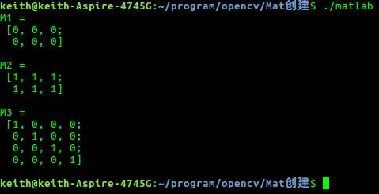


在已有Mat类的基础上创建一个Mat类，即新创建的类是已有Mat类的某一行或某一列，可以使用clone()或copyTo()，这样的构造方式不是以数据共享方式存在。可以利用setTo()函数更改矩阵的值进行验证，方法如下：

```
#include <iostream>
#include <opencv2/core.hpp>
#include <opencv2/highgui.hpp>

using namespace std;
using namespace cv;

int main()
{

    Mat M1=(Mat_<double>(3,3) << 0,-1,0,-1,5,-1,0,-1,0);
    cout << "M1 = " << endl << " " << M1 << endl << endl;

    Mat M2 = M1;
    cout << "M2 = " << endl << " " << M2 << endl << endl;

    Mat RowClone = M1.row(0).clone();
    cout << "RowClone = " << endl << " " << RowClone << endl << endl;

    Mat ColClone = M1.col(1).clone();
    cout << "ColClone = " << endl << " " << ColClone << endl << endl;

    Mat copyToM;
    M1.row(1).copyTo(copyToM);
    cout << "copyToM = " << endl << " " << copyToM << endl << endl;

    //验证数据的共享方式

    RowClone.setTo(1);
    cout << "M1(更改RowClone的值) = "<< endl  << " " << M1 << endl << endl;

    ColClone.setTo(2);
    cout << "M1(更改ColClone的值) = "<< endl << " " << M1 << endl << endl;

    M2.setTo(1);
    cout << "M1(更改M2值) = " << endl << " " << M1 << endl << endl;

    waitKey(0);

    return 0;
}
```

程序中M4.row(0)就是指的M4的第一行,其它类似。必须值得注意的是：在本篇介绍中工较少了clone()、copyTo()、和”=”三种实现矩阵赋值的方式。其中”=”是使用重载的方式将矩阵值赋值给新的矩阵，而这种方式下，被赋值的矩阵和赋值矩阵之间共享空间，改变任何一个矩阵的值会影响到另外一个矩阵。而clone()和copyTo()两种方法在赋值后，两个矩阵的存储空间是独立的，不存在共享空间的情况。 
运行结果如下

```
root@567059b7080d:~/tutorials/Demo/opencv_demo/t1/build# ./t1 
M1 = 
 [0, -1, 0;
 -1, 5, -1;
 0, -1, 0]

M2 = 
 [0, -1, 0;
 -1, 5, -1;
 0, -1, 0]

RowClone = 
 [0, -1, 0]

ColClone = 
 [-1;
 5;
 -1]

copyToM = 
 [-1, 5, -1]

M1(更改RowClone的值) = 
 [0, -1, 0;
 -1, 5, -1;
 0, -1, 0]

M1(更改ColClone的值) = 
 [0, -1, 0;
 -1, 5, -1;
 0, -1, 0]

M1(更改M2值) = 
 [1, 1, 1;
 1, 1, 1;
 1, 1, 1]
```


opencv中还支持其他的格式化输入，

```
#include <iostream>
#include <opencv2/core.hpp>
#include <opencv2/highgui.hpp>

using namespace std;
using namespace cv;

int main()
{
    //使用函数randu()生成随机数,随机数范围为0-255
    Mat R = Mat(3, 2, CV_8UC3);
    randu(R, Scalar::all(0), Scalar::all(255));

    //以默认格式输出
    cout << "R(Default) = " << endl << " " << R << endl << endl;

    //以Python格式输出
    cout << "R(Python) = " << endl << format(R, "python") << endl << endl;

    //以CSV格式输出
    cout << "R(CSV) = " << endl << format(R, "csv") << endl << endl;

    //以Numpy格式输出
    cout << "R(Numpy) = " << endl << format(R, "numpy") << endl << endl;

    //以C语言的格式输出
    cout << "R(C) = " << endl << format(R, "C") << endl << endl;

    Point2f P2f(5,1);
    cout << "Point (2D) = " << P2f << endl << endl;

    Point3f P3f(2,6,7);
    cout << "Point (3D) = " << P3f << endl << endl;

    waitKey(0);


    return 0;
}
```

运行结果如图所示：

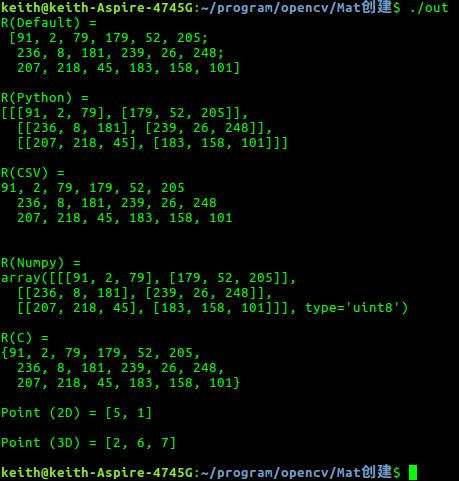

其中Point2f和Point3f都是opencv中常见的数据类型，在以后的学习中还会见到！


## 2. 图像的加载、显示、保存

在使用opencv对图像进行处理时，图像的加载就是要走出的第一步。

### **1.图像的加载之imread函数**

图像的加载在opencv中由”imread”函数来实现，在imread函数中可以加载想要进行处理的图像，imread函数支持多种图像格式。 

```
windows位图：bmp, dib 
JPEG文件:jpeg, jpg, jpe 
JPEG2000文件: jp2 
PNG图片: png 
便携文件格式： pbm, pgm, ppm 
光栅文件: sr, ras 
TIFF文件： tiff, tif. 
```

imread()函数原型如下：

```
CV_EXPORTS_W Mat imread( const String& filename, int flags = IMREAD_COLOR );
```

其参数如下含义： 

第一个参数：const String& filename是指图片的名称，如果图片不在工程目录下，则需要包含图片的路径，在输入路径时Windows环境下使用`\\`，而在Linux环境下使用`//`。同样在添加库文件时Windows环境下使用`\`如：`opencv\core\core.hpp`，而在Linux环境下使用`/`如`opencv2/core/core.hpp`，这是在使用opencv时Windows环境和Linux环境下的一点区别。

第二个参数：int 类型flags，是载入图像的表识，可指定加载图片的颜色类型。其默认加载类型为IMREAD_COLOR。查询其原型如下：

```
enum ImreadModes {
       IMREAD_UNCHANGED  = -1, //!< If set, return the loaded image as is (with alpha channel, otherwise it gets cropped).
       IMREAD_GRAYSCALE  = 0,  //!< If set, always convert image to the single channel grayscale image.
       IMREAD_COLOR      = 1,  //!< If set, always convert image to the 3 channel BGR color image.
       IMREAD_ANYDEPTH   = 2,  //!< If set, return 16-bit/32-bit image when the input has the corresponding depth, otherwise convert it to 8-bit.
       IMREAD_ANYCOLOR   = 4,  //!< If set, the image is read in any possible color format.
       IMREAD_LOAD_GDAL  = 8   //!< If set, use the gdal driver for loading the image.
     };12345678
```

根据其原型可以看出，flags是一个枚举类型。对各个参数简单解释一下： 

```
IMREAD_UNCHANGED:已经废除，不再使用 
IMREAD_GRAYSCALE=0:将加载的图像转换为单通道灰度图。 
IMREAD_COLOR=1:函数默认值，将图像转化为三通道BGR彩色图像 
IMREAD_ANYDEPTH=2:若载入图像深度为16位或32为就返回其对应深度，否则将图像转换为8位图像 
IMREAD_ANYCOLOR=4:保持图像原格式，可以读取任意可能的彩色格式 
IMREAD_LOAD_GDAL=8:使用文件格式驱动加载图像，在现阶段用处不多。 
```

在使用flags时可能会同时使用多种flags，如果发生冲突，函数将自动采用较小数字值对应的加载方式。如：IMREAD_COLOR | IMREAD_ANYCOLOR，则imread()函数将自动载入IMREAD_COLOR所对应的3通道彩色图。如果要载入图像原本的彩色格式和深度，则可以使用: IMREAD_ANYCOLOR | IMREAD_ANYDEPTH。 

也可以利用flags是int类型的变量输入其他值以达到加载特定图像格式的目的，但符合一下标准： 

```
flags > 0:返回一个三通道的彩色图像 
flags = 0: 返回灰度图像 
flags < 0: 返回包含Alpha通道的图像。 
```

图像在默认情况下不是从Alpha通道进来的，如果需要载入Alpha通道的话就取负值。

### **2.namedWindow函数**

创建一个窗口，原型如下：

```
CV_EXPORTS_W void namedWindow(const String& winname, int flags = WINDOW_AUTOSIZE);
```

第一个参数const String& winname：窗口名称 

第二个参数int flags：窗口属性


flags同样是一个枚举类型，其由如下参数：

```
enum { WINDOW_NORMAL     = 0x00000000, // the user can resize the window (no constraint) / also use to switch a fullscreen window to a normal size

       WINDOW_AUTOSIZE   = 0x00000001, // the user cannot resize the window, the size is constrainted by the image displayed

       WINDOW_OPENGL     = 0x00001000, // window with opengl support


       WINDOW_FREERATIO  = 0x00000100, // the image expends as much as it can (no ratio constraint)

       WINDOW_KEEPRATIO  = 0x00000000  // the ratio of the image is respected
     };1234567891011
```

对应解释如下： 

```
WINDOW_NORMAL:可以改变窗口大小（无限制），也可将一个满屏窗口转换成常用大小； WINDOW_AUTOSIZE：程序会根据呈现内容自动调整大小且不能手动更改窗口大小； WINDOW_OPENGL：创建支持OpenGL的窗口； WINDOW_FULLSCREEN：创建一个充满屏幕的窗口； WINDOW_FREETATIO：图像将尽可能展开; WINDOW_KEEPRATIO：图像比例受到约束。 
```

namedWindow()函数是通过指定的名字创建一个作为图像和进度条显示的窗口，如果有相同名称的窗口已经存在，则函数不会重复创建窗口，而是什么都不做。我们可以调用destroyWindows()或者destroyAllWindows()函数来关闭窗口并取消之前分配的与窗口相关的所有内存空间。

### **3.imshow()**

显示指定窗口，其函数原型如下：

```
CV_EXPORTS_W void imshow(const String& winname, InputArray mat);
```

第一个参数const String& winname:窗口名称，如果使用了namedWindow()函数创建窗口，则名字必须一致，如果没有使用namedWindow()函数，则可指定任意符合命名规则的名字。 

第二个参数InputArray mat:要输出的图像。 
imshow()在用于指定的窗口显示图像时，如果窗口用WINDOW_ATTOSIZE创建，那么显示图像原始大小。佛则将图像进行缩放以适合窗口。而imshow()函数缩放图像取决与图像深度： 

- 如果载入图像是8位无符号类型(8-bis unsigned)，就现实图像原本样子。 
- 如果图像是16位无符号类型(16-bist unsigned)或32位无整型(32-bit integer)，便使用像素值除以256.也就是说将像素值范围在[0,255x266]之间的元素映射到(0,255]范围内。 
- 如果载入图像是32位浮点型(32-bit floating-point)，像素值要乘以255.也就是说像素值范围在[0,1]映射到[0,255].

### 4.imwrite() 

将处理后的图像写入到相应的文件夹。其用法与imread()函数类似。原型如下：

```
CV_EXPORTS_W bool imwrite( const String& filename, InputArray img, const std::vector<int>& params = std::vector<int>());
```

可以看出imwrite()是一个BOOL型函数，档期写入成功返回TRUE，否则返回FALSE。 

第一个参数const String& filename:保存图像的文件名，一定要包含文件的后缀，如”lena.bmp” 

第二个参数const std::vector…:表示为特定保存格式的参数编码，在一般情况下不需要更改。如果需要更改的话，对于不同的图片格式，其对应的值由不同功能。如下： 

- JPEG：这个参数表示从0-100的图片质量(CV_IMWRITE_JPEG_QUALITY),默认值是95. 
- PNG: 这个参数表示压缩级别(CV_IMWRITE_PNG_COMPRESSION)，范围为0-9，数值越高说明压缩程度越大即尺寸更小，所花费的时间更长。默认值是3 
- PPM,PGM,PBM: 这个参数表示一个二进制标志(CV_IMWRITE_PXM_BINARY)，取值为0或1，而默认值为1。

实例代码如下：

```
#include <iostream>
#include <opencv2/core.hpp>
#include <opencv2/highgui.hpp>
#include <opencv2/imgproc.hpp>

using namespace std;
using namespace cv;

int main()
{
    Mat srcImage = imread("..//lena.jpg", IMREAD_COLOR);       //读取图像到srcImage，注意图像路径即后缀, 注意图片和build的位置
    namedWindow("Opencv图像读取-lena", WINDOW_AUTOSIZE);  //创建一个名字为“Opencv图像读取-星空”的窗口，窗口属性为自适应
    imshow("Opencv图像读取-lena", srcImage);          //显示读入的图像，窗口名称与namedWindow中名字要一致


    Mat srcImageGray;                       //创建一个Mat类型用于存储将读取到的彩色图像转换为灰度图之后的图像
    cvtColor(srcImage, srcImageGray, CV_RGB2GRAY);      //使用函数CV_RGB2GRAY将彩色图像转换为灰度图
    namedWindow("星空灰度图", WINDOW_NORMAL);
    imshow("星空灰度图",srcImageGray);
    imwrite("星空灰度图.jpg",srcImageGray);          //将转换的灰度图以.bmp格式存储，默认路径为工程目录下


    waitKey(0);


    return 0;
}
```

运行结果如下图所示： 

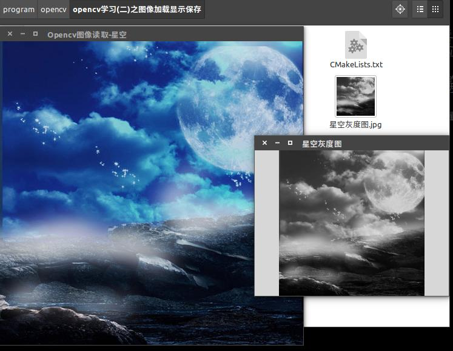

PS:代码格式又乱了。。。。

## 3. 图像像素遍历（颜色空间缩减、查找表）

在图像处理中不可避免的要涉及到对图像像素的操作，这篇文章将介绍对图像像素的访问及遍历图像像素的方法。

### 1.颜色空间缩减及查找表

设想一种简单的C\C++类型的无符号字符型矩阵的存储结构，对于单通道图像而言，图像像素最多可以由256个像素值。如果图像是三通道图像，那么图像像素存储的颜色可以达到惊人的1600w。处理如此多的颜色类型对于算法的运算是一种沉重的负担。有时候我们可以找到一些既能够降低颜色数量但是并不会影响其处理结果的方法。通常我们缩减颜色空间。这就意味着我们用新输入的数值和更少的颜色来划分当前的颜色空间。 

例如我们可以将值在0-9范围内的像素值看做0，将值位于10-19范围内的像素值看做10等等。当我们用int类型的数值代替uchar(unsigned char-值位于0-255之间)类型得到的结果仍为char类型。这些数值只是char类型的值，所以求出来的小数要向下取整。公式可以总结如下： 

 

遍历整幅图像像素并应用上述公式就是一个简单的颜色空间缩减算法。对于较大的图像需要在执行操作可以前提前计算好其像素值存储到查找表中。查找变是一种简单的数组（可能是一维或多维），对于给定的输入变量给出最终的输出值。在进行图像处理时，像素取值范围在0-255之间其实就是一共有256种情况，所以将这些计算结果提前存储于查找表中，进行图像处理时，不需要重新计算像素值，可以直接从查找表调用。其优势在于只进行读取操作，不进行运算。 
结合上述公和查找表如下：

```
    int divideWith = 0;
    stringstream s;
    s << argv[2];
    s >> divideWith;
    if(!s || !divideWith)
    {
        cout << "输入的划分间隔无效." << endl;
        return -1;
    }
    uchar table[256];
    for(int i = 0;i < 256; ++i)
        table[i] = (uchar)(divideWith * (i * divideWith));123456789101112
```

程序中table[i]存放的是值为i的像素缩减空间的结果。例如i = 25,则table[i]=20.这样看来颜色空间缩减算法可分为两部分： 

（1）.遍历图像矩阵像素 

（2）.将上述公式应用于每个像素 

值得注意的是，此公式用到了乘法和除法，而这两种计算方式相对来讲比较费时，所以在设计像素缩减空间算法时，应尽量使用加减和赋值运算代替。

### ２．opencv计时函数

在上面分析中提到用乘除法会加大程序的耗时，那么怎么计算程序运行中的耗时呢？opencv中提供了两个简便的计时函数getTickCount()和getTickFrequency()。其中getTickCount()用来获取CPU时钟周期，getTickFrequency()函数用来获取CPU时钟频率。这样就能以秒为单位对程序运行进行耗时分析，其用法如下：


```
    double t = (double)getTickCount();
    //...
    //program...
    //...
    t = ((double)getTickCount()-t)/getTickFrequency();
```

### ３．图像矩阵在内存中的存储方式 

在[opencv学习(一)之Mat类中介绍Mat类](http://blog.csdn.net/keith_bb/article/details/52928389)的创建等内容，同时也应该能够了解到图像的数据结构为Mat类，是一种矩阵结构。图像矩阵大小取决于所用的颜色模型，更确切的来说是取决于图像所用通道数。如果是灰度图像，其矩阵结构如下图所示： 


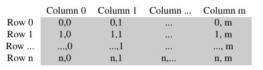 


对于多通道图像来说，矩阵的列会包含多个子列，其子列个数与通道数相等。RGB颜色模型矩阵如下图所示： 

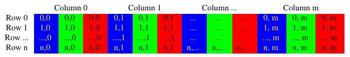 

在opencv中图像的RGB顺序如上图所示正好是反过来的，其排序为BGR。在很多情况下可以如果内存足够大可以实现连续存储。连续存储有助于提升图像扫描速度，可以使用isContinuous()来判断矩阵是否是连续存储。

当涉及到程序性能时，没有比C风格的操作符”[]”(指针)更高效了。测试代码如下：

```
#include <iostream>
#include <cstring>
#include <opencv2/core.hpp>
#include <opencv2/highgui.hpp>
#include <opencv2/imgproc.hpp>

using namespace std;
using namespace cv;

Mat& ScanImageAndReduce(Mat& I,const uchar* const table);

int main(int argc, char** argv)
{
    int divideWith = 0;

    Mat srcImage = imread("lena.jpg");

    //image is load sucessful?
    if(srcImage.data)
        cout << "Success" << endl;
    else
        return -1;

    imshow("srcImage",srcImage);

    cout << "input divideWith: ";
    cin >> divideWith;

    if(!divideWith)
    {
        cout << "输入的划分间隔无效." << endl;
        return -1;
    }
    uchar table[256];
    for(int i = 0;i < 256; ++i)
        table[i] = (uchar)(divideWith * (i * divideWith));

    ScanImageAndReduce(srcImage,table);
    waitKey(0);

    return 0;
}

Mat& ScanImageAndReduce(Mat& I, const uchar* const table)
{
    CV_Assert(I.depth() == CV_8U);

    //定义变量与原图像保持一致
    int channels = I.channels();
    int nRows = I.rows;
    int nCols = I.cols * channels;

    //判断矩阵是否是连续矩阵
    if(I.isContinuous())
    {
        nCols *= nRows;
        nRows = 1;
    }

    int i,j;
    uchar* p;
    for(i = 0; i < nRows; ++i)
    {
        p = I.ptr<uchar>(i);        //获取矩阵第i行的首地址
        for(j = 0; j < nCols; ++j)  //列循环进行处理
        {
            p[j] = table[p[j]];
        }
    }
    imshow("reduce-100",I);         //根据输入值对窗口名字进行更改

    return I;
}
```


当设置不同的结果时，其最终输出结果不同如下所示： 

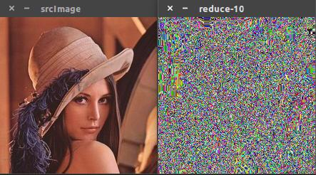 
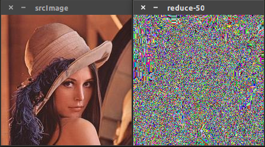 
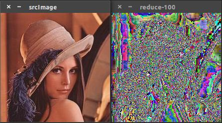


## 4. 像素遍历三种方式

在上一篇文章中介绍了图像颜色空间缩减、查找表等内容。在对图像像素进行遍历时共有三种方法： 

- (1). C操作符[] (指针方式访问) 
- (2). 迭代器iterator 
- (3). 动态地址计算 

这三种像素遍历方式在速度上有所不同，上一篇文章介绍过用C操作符[]是最快的访问方式。下面会通过对同一幅图像进行处理来直观的比较三种访问方式的速度差异。首先介绍一下opencv中提供的计时函数

### **1.计时函数**

opencv中提供两个简便的计时函数getTickCount()和getTickFrequency()，这两个函数配合使用即可计算出程序耗时，这两个函数有点类似于C++中的clock()函数和CLK_TCK（[C\C++中计时、延时函数](http://blog.csdn.net/keith_bb/article/details/53055380)） 

- getTickCount()：返回CPU自某时间开始的时钟周期 
- getTickFrequency()：获取CPU时钟频率 

其用法如下所示：

```
double start,stop,duration;
start = static_cast<double>(getTickCount());    //记录当前时刻CPU时钟周期
/*
...
代码片段
...
*/
stop = static_cast<double>(getTickCount());     //记录程序运行结束CPU时钟周期
duration = ((double)(stop - start))/getTickFrequency(); //计算时间，以秒为单位

//上述代码也可精简
double timeConsume,start;
start = static_cast<double>(getTickCount());    //记录当前时刻CPU时钟周期
/*
...
代码片段
...
*/
timeConsume = ((double)getTickCount() - start) / getTickFrequency();
```

### **2.常用像素存储结构**

在介绍像素遍历之前需要先对opencv中像素的存储方式有一定的了解，不然直接看代码的适合可能不知所云，比较费劲。 
有一些opencv中常见的数据结构使用”<<”操作符进行输出如：

```
#include <iostream>
#include <opencv2/core.hpp>

using namespace std;
using namespace cv;

int main()
{
    //2D Point
    Point2f P(5, 1);
    cout << endl << "Point (2D) = " << P << endl << endl;

    //3D Point
    Point3f P3f(2, 5, 7);
    cout << "Point (3D) = " << P3f << endl << endl;

    //std::vector via cv::Mat
    vector<float> v;
    v.push_back((float)CV_PI);      //将pi的值以float类型存入v,push_back是C++中容器的一种操作方式
    v.push_back(2);
    v.push_back(3.01f);
    cout << "vector of floats via Mat = " << endl << Mat(v) << endl << endl;

    //std::vector of points
    vector<Point2f> vPoints(20);
    for(size_t i = 0; i < vPoints.size(); ++i)
    vPoints[i] = Point2f((float)(i * 5), (float)(i % 7));
    cout << "vector of 2D points = " << endl << vPoints << endl << endl;


    return 0;
}
```

```
root@raspberrypi:~/demo_opencv/t4/build# ./t1 

Point (2D) = [5, 1]

Point (3D) = [2, 5, 7]

vector of floats via Mat = 
[3.1415927;
 2;
 3.01]

vector of 2D points = 
[0, 0;
 5, 1;
 10, 2;
 15, 3;
 20, 4;
 25, 5;
 30, 6;
 35, 0;
 40, 1;
 45, 2;
 50, 3;
 55, 4;
 60, 5;
 65, 6;
 70, 0;
 75, 1;
 80, 2;
 85, 3;
 90, 4;
 95, 5]
```


opencv中有模板类Vec,可以表示一个向量。opencv中使用Vec类预定义了一些小向量，可以用于矩阵元素的表达。

```
typedef Vec<uchar, 2> Vec2b;
typedef Vec<uchar, 3> Vec3b;
typedef Vec<uchar, 4> Vec4b;

typedef Vec<short, 2> Vec2s;
typedef Vec<short, 3> Vec3s;
typedef Vec<short, 4> Vec4s;

typedef Vec<int, 2> Vec2i;
typedef Vec<int, 3> Vec3i;
typedef Vec<int, 4> Vec4i;

typedef Vec<float, 2> Vec2f;
typedef Vec<float, 3> Vec3f;
typedef Vec<float, 4> Vec4f;
typedef Vec<float, 6> Vec6f;

typedef Vec<double, 2> Vec2d;
typedef Vec<double, 3> Vec3d;
typedef Vec<double, 4> Vec4d;
typedef Vec<double, 6> Vec6d;
```

例如8U类型的RGB彩色图像也可以使用Vec3b,3通道float类型的矩阵可以使用Vec3f.对于Vec对象可以使用[]符号如数组一样对其元素进行读写操作。如：

```
Vec3b color;            //用color变量描述一种RGB颜色
color[0] = 255;         //B分量
color[1] = 0;           //G分量
color[2] = 0;           //R分量1234
```

### **3.像素值的读写**

在对图像进行处理时，需要读取某个像素值或者设置某个像素值；在更多的时候需要对图像中所有像素进行遍历。在前面介绍用三种方法可以对图像像素进行遍历。下面逐一介绍。

#### **3.1 at()函数**

可以用函数at()来实现对矩阵中某个像素值进行读取或进行赋值操作，但是前提要知道该像素行列位置。其用法如下：

```
uchar value = img.at<uchar>(i,j);       //读出第i行第j列像素值
img.at<uchar>(i,j) = 128;               //将第i行第j列像素值设置为128
```

如果要对图像进行遍历，可以参照下面的代码：

```
#include <iostream>
#include <opencv2/core.hpp>
#include <opencv2/highgui.hpp>

using namespace std;
using namespace cv;

int main()
{
    double timeConsume = static_cast<double>(getTickCount());
    Mat grayImage(400, 600, CV_8UC1);       //创建一个大小为600x800的单通道灰度图
    Mat colorImage(400, 600, CV_8UC3);      //创建一个大小为600x800的三通道彩色图

    //遍历所有像素并设置像素值
    for(int i = 0; i < grayImage.rows; ++i)         //遍历行
        for(int j = 0; j < grayImage.cols; ++j)     //遍历列
            grayImage.at<uchar>(i, j) = (i + j) % 255;

    //遍历所有像素并设置像素值

    for(int i = 0; i < colorImage.rows; ++i)         //遍历行
        for(int j = 0; j < colorImage.cols; ++j)     //遍历列
        {
            Vec3b pixel;            //定义三通道像素值变量
            pixel[0] = i % 255;     //Blue
            pixel[1] = j % 255;     //Green
            pixel[2] = 0;           //Red

            colorImage.at<Vec3b>(i, j) = pixel;
        }

    //显示简历图像的结果
    namedWindow("grayImage", WINDOW_AUTOSIZE);
    imshow("grayImage", grayImage);

    namedWindow("colorImage", WINDOW_AUTOSIZE);
    imshow("colorImage", colorImage);

    timeConsume = ((double)getTickCount() - timeConsume) / getTickFrequency();
    cout << "程序耗时： " << timeConsume << endl;

    waitKey(0);

    return 0;
}
```

运行结果如下： 
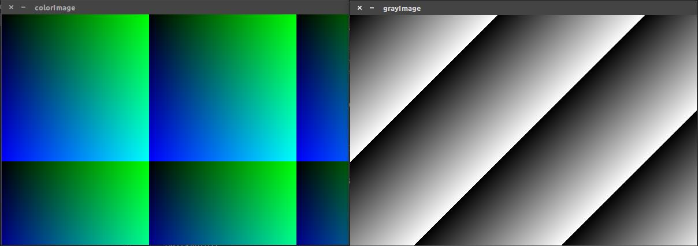
程序中带有计时函数计算程序耗时，程序耗时根据电脑配置不同有所差异。 
如果需要对图像像素进行遍历，不推荐使用at()函数，因为使用这个函数其效率不高，但是其可读性较好。

#### **3.2 使用迭代器iterator**

相信学过C++的同学一定对STL库有印象，其中就包含iterator的使用。迭代器可以很方便的遍历所有元素。Mat类支持迭代器的方式对矩阵元素进行遍历。由于使用迭代器就不需要再使用行列数进行操作。示例如下：

```
#include <iostream>
#include <opencv2/core.hpp>
#include <opencv2/highgui.hpp>

using namespace std;
using namespace cv;

int main()
{
    double timeConsume = static_cast<double>(getTickCount());
    Mat grayImage(400, 600, CV_8UC1);       //创建一个大小为600x800的单通道灰度图
    Mat colorImage(400, 600, CV_8UC3);      //创建一个大小为600x800的三通道彩色图

    //遍历所有像素并设置像素值
    MatIterator_<uchar> grayit, grayend;
    for(grayit = grayImage.begin<uchar>(), grayend = grayImage.end<uchar>(); grayit != grayend; ++grayit)
        *grayit = rand() % 255;

    //遍历所有像素并设置像素值
    MatIterator_<Vec3b> colorit, colorend;
    for(colorit = colorImage.begin<Vec3b>(), colorend = colorImage.end<Vec3b>(); colorit != colorend; ++colorit)
    {
        (*colorit)[0] = rand() % 255;       //Blue
        (*colorit)[1] = rand() % 255;       //Green
        (*colorit)[2] = rand() % 255;       //Red
    }


    //显示简历图像的结果
    namedWindow("grayImage", WINDOW_AUTOSIZE);
    imshow("grayImage", grayImage);

    namedWindow("colorImage", WINDOW_AUTOSIZE);
    imshow("colorImage", colorImage);

    timeConsume = ((double)getTickCount() - timeConsume) / getTickFrequency();
    cout << "程序耗时： " << timeConsume << endl;

    waitKey(0);

    return 0;
}
```

运行结果如下： 

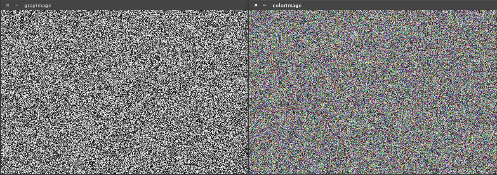


使用迭代器进行像素遍历被认为是一种更安全的方式。使用迭代器只需要求出矩阵的开头和矩阵末尾，接下来使用for循环进行迭代，直到”it == end”.  代码中”colorit = colorImage.begin(), colorend = colorImage.end();” 是求出矩阵起始位置和结束位置。

#### **3.3 使用指针进行访问**

其实在前面已经提到用指针对数据进行访问，虽然使用指针速度最快，但是指针操作不进行类型以及越界检查，所有在程序写好编译没问题，但是运行就有可能出错。而使用at()和iterator()进行遍历时，虽然速度不如指针，但是相对两件比较容易实现，可读性也比较好。示例代码如下：

```
#include <iostream>
#include <opencv2/core.hpp>
#include <opencv2/highgui.hpp>

using namespace std;
using namespace cv;

int main()
{
    double timeConsume = static_cast<double>(getTickCount());
    Mat grayImage(400, 600, CV_8UC1);       //创建一个大小为600x800的单通道灰度图
    Mat colorImage(400, 600, CV_8UC3);      //创建一个大小为600x800的三通道彩色图

    //遍历所有像素并设置像素值
    for(int i = 0; i < grayImage.rows; ++i)
    {
        uchar* p = grayImage.ptr<uchar>(i);     //获取第i行第一个像素的指针
        for(int j = 0; j < grayImage.cols; ++j)
            p[j] = (i + j) % 255;               //对每个i行的所有像素进行赋值操作
    }

    //遍历所有像素并设置像素值

    for(int i = 0; i < colorImage.rows; ++i)
    {
        Vec3b* p = colorImage.ptr<Vec3b>(i);
        for(int j = 0; j < colorImage.cols; ++j)
        {
            p[j][0] = i % 255;      //Blue
            p[j][1] = j % 255;      //Gree
            p[j][2] = 0;            //Red
        }
    }

    //显示简历图像的结果
    namedWindow("grayImage", WINDOW_AUTOSIZE);
    imshow("grayImage", grayImage);

    namedWindow("colorImage", WINDOW_AUTOSIZE);
    imshow("colorImage", colorImage);

    timeConsume = ((double)getTickCount() - timeConsume) / getTickFrequency();
    cout << "程序耗时： " << timeConsume << endl;

    waitKey(0);

    return 0;
}
```

运行结果如下： 

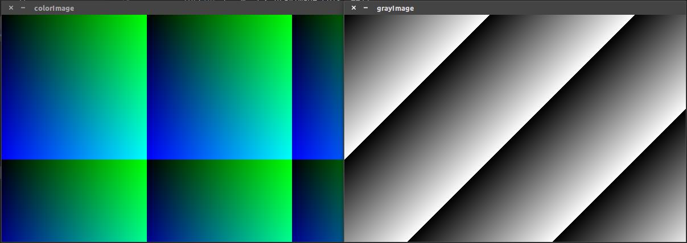

下一篇对三种像素遍历方式进行一个综合比较！！！

## 5. 像素遍历三种方式耗时分析

前面用两篇介绍了像素的颜色空间缩减、查找表、遍历像素的三种方式、程序计时等，也说了一下每种方法的优缺点，现在用一个综合型的程序进行对比。方式是用三种方式对lena图像（220x220）进行处理，使其颜色种类从256中变成64种。在颜色空间缩减方法中讲过这种方式，即每个像素值除以4向下取整然后再乘以4即可将其颜色种类缩减到64种。

```
#include <iostream>
#include <opencv2/core.hpp>
#include <opencv2/highgui.hpp>

using namespace std;
using namespace cv;

void colorReduceAt(Mat& srcImage, Mat& dstImageAt, int div);
void colorReduceIterator(Mat& srcImage, Mat& dstImageIterator, int div);
void colorReducePtr(Mat& srcImage, Mat& dstImagePtr, int div);

int main()
{
    //加载lena图像
    Mat srcImage = imread("..//lena.jpg");

    //判断图像是否加载成功
    if(srcImage.empty())
    {
        cout << "图像加载失败!" << endl << endl;
        return -1;
    }
    else
        cout << "图像加载成功!" << endl << endl;

    imshow("srcImage",srcImage);

    //声明处理后图像变量
    Mat dstImageAt, dstImageIterator, dstImagePtr;
    dstImageAt = srcImage.clone();
    dstImageIterator = srcImage.clone();
    dstImagePtr = srcImage.clone();

    int div = 4;

    //声明时间变量
    double timeAt, timeIterator, timePtr;

    timeAt = static_cast<double>(getTickCount());
    colorReduceAt(srcImage, dstImageAt, div);
    timeAt = ((double)getTickCount() - timeAt) / getTickFrequency();
    imshow("dstImageAt",dstImageAt);
    cout << "使用at()动态地址计算耗时：" << timeAt << endl << endl;

    timeIterator = static_cast<double>(getTickCount());
    colorReduceIterator(srcImage, dstImageIterator, div);
    timeIterator = ((double)getTickCount() - timeIterator) / getTickFrequency();
    imshow("dstImageIterator",dstImageIterator);
    cout << "使用iterator迭代器耗时：" << timeIterator << endl << endl;

    timePtr = static_cast<double>(getTickCount());
    colorReducePtr(srcImage, dstImagePtr, div);
    timePtr = ((double)getTickCount() - timePtr) / getTickFrequency();
    imshow("dstImagePtr",dstImagePtr);
    cout << "使用ptr指针耗时：" << timePtr << endl;


    waitKey(0);

    return 0;
}

//使用at动态地址计算方式
void colorReduceAt(Mat& srcImage, Mat& dstImageAt, int div)
{
    int rowNumber = dstImageAt.rows;      //获取图像行数
    int colNumber = dstImageAt.cols;      //获取图像列数

    //对每个像素进行处理
    for(int i = 0; i < rowNumber; i++)
    {
        for(int j = 0; j < colNumber; j++)
        {
            dstImageAt.at<Vec3b>(i,j)[0] = dstImageAt.at<Vec3b>(i,j)[0]/div*div;    //Blue
            dstImageAt.at<Vec3b>(i,j)[1] = dstImageAt.at<Vec3b>(i,j)[1]/div*div;    //Green
            dstImageAt.at<Vec3b>(i,j)[2] = dstImageAt.at<Vec3b>(i,j)[2]/div*div;    //Red
        }
    }

}

//使用iterator迭代器方式
void colorReduceIterator(Mat& srcImage, Mat& dstImageIterator, int div)
{
    MatIterator_<Vec3b> imageIt = dstImageIterator.begin<Vec3b>();      //获取迭代器初始位置
    MatIterator_<Vec3b> imageEnd = dstImageIterator.end<Vec3b>();       //获取迭代器结束位置

    //对每个像素进行处理
    for(;imageIt != imageEnd; imageIt++)
    {
        (*imageIt)[0] = (*imageIt)[0]/div*div;      //Blue
        (*imageIt)[1] = (*imageIt)[1]/div*div;      //Green
        (*imageIt)[2] = (*imageIt)[2]/div*div;      //Red
    }
}

//使用ptr指针
void colorReducePtr(Mat& srcImage, Mat& dstImagePtr, int div)
{
    int rowNumber = dstImagePtr.rows;                           //获取图像矩阵行数
    int colNumber = dstImagePtr.cols*dstImagePtr.channels();    //三通道图像每行元素个数为列数x通道数

    for(int i = 0; i < rowNumber; i++)
    {
        uchar* pixelPtr = dstImagePtr.ptr<uchar>(i);            //获取矩阵每行首地址指针
        for(int j = 0; j < colNumber; j++)
            pixelPtr[j] = pixelPtr[j] / div * div;
    }
}
```

运行结果如下： 

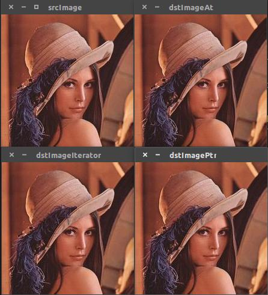 

三种方式在本程序中的耗时情况如下，值得注意的是程序耗时和电脑硬件和编译器等都有关系，在此我用的是cmake 3.5.1 

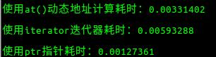 

从上述耗时分析来看使用指针方式是最快的处理方式，而迭代器的方式相对最慢。但是使用迭代器是较为安全的访问方式。 

从上面程序中仔细分析指针式访问和at()动态地址分配访问方式的不同。可以找更大的图像对三种像素遍历方式进行分析，其耗时会由明显差别。 

除了上面三种方式，其官方文档还提到了使用LUT()函数。在进行图像处理时将所给的所有图像值替换成其他的值，opencv中提供的LUT()函数可以批量实现这种功能。其用法如下：

```
Mat lookUpTable(1, 256, CV_8U);
uchar* p = lookUpTable.data;
for(int i = 0; i < 256; ++i)
    p[i] = table[i];

//然后调用函数(I是输入图像，J是输出图像)
LUT(I, lookUpTable, J);1234567
```

官方文档中通过对一幅(2560x1600)图像进行上百次的处理得出如下结论： 

- \1. 如果可能的话尽可能使用opencv中提供的参数 
- \2. 最快的方式是LUT()函数，因为opencv库通过Intel Threaded Building Blocks实现其多线程。 
- \3. 如果写一个简单图像的遍历程序推荐使用指针方式。 
- \4. 迭代器是相对来讲比较安全的访问方式，但其速度也相对较慢。
- \5. 在Debug模式下，动态地址计算方法是最慢的访问方式，但是在Release模式下它有可能比iterator访问方式快

## 6. 掩膜版

可以通过掩模矩阵（通常来讲叫核）对图像的每个图像像素值重新计算。这个掩模板能够调整临近像素包括当前像素对新像素的影响程度。从数学的角度来讲，我们用特殊的值对当前的值做了一个加权平均的操作。举个例子，设想一个图像对比度增强的方法，基本上，我们要将下面的公式应用到每一个像素上： 

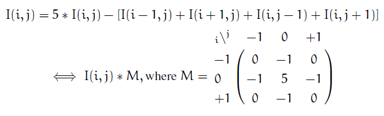 

第一个公式是用数学公式，第二个是用一个掩模板。将掩模板中心放到你想计算像素上，将像素值累加并乘以与重叠矩阵值想成。对于较大的矩阵来看，后一种表达方式更容易理解。

```
#include <iostream>
#include <opencv2/core.hpp>
#include <opencv2/highgui.hpp>
#include <opencv2/imgproc.hpp>

using namespace std;
using namespace cv;

void Sharpen(const Mat& myImage, Mat& Result);

int main()
{
    Mat srcImage = imread("lena.jpg");

    //判断图像是否加载成功
    if(srcImage.data)
        cout << "图像加载成功!" << endl << endl;
    else
    {
        cout << "图像加载失败!" << endl << endl;
        return -1;
    }
    namedWindow("srcImage", WINDOW_AUTOSIZE);
    imshow("srcImage", srcImage);

    Mat dstImage;
    dstImage.create(srcImage.size(), srcImage.type());
    Sharpen(srcImage, dstImage);
    namedWindow("dstImage",WINDOW_AUTOSIZE);
    imshow("dstImage",dstImage);

    waitKey(0);

    return 0;
}

void Sharpen(const Mat& myImage, Mat& Result)
{
    CV_Assert(myImage.depth() == CV_8U);        //判断函数CV_Assert
    const int nChannels = myImage.channels();

    for(int j = 1; j < myImage.rows - 1; ++j)
    {
        const uchar* precious = myImage.ptr<uchar>(j - 1);      //当前像素上一行指针
        const uchar* current = myImage.ptr<uchar>(j);           //当前像素行指针
        const uchar* next = myImage.ptr<uchar>(j + 1);          //当前像素下一行指针

        uchar* output = Result.ptr<uchar>(j);

        //利用公式和上下左右四个像素对当前像素值进行处理
        for(int i = nChannels; i < nChannels * (myImage.cols - 1); ++i)
        {
            *output++ = saturate_cast<uchar>(5 * current[i]
            -current[i-nChannels]-current[i+nChannels]-precious[i]-next[i]);
        }
    }
    Result.row(0).setTo(Scalar(0));                 //设置第一行所有元素值为0
    Result.row(Result.rows-1).setTo(Scalar(0));     //设置最后一行所有元素值为0
    Result.col(0).setTo(Scalar(0));                 //设置第一列所有元素值为0
    Result.col(Result.cols-1).setTo(Scalar(0));     //设置最后一列所有元素值为0
}
```

运行结果如图所示： 

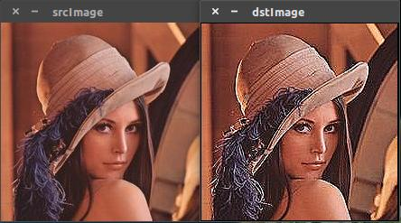 

对上述程序简单做个分析。 

(1). main()函数中加载图像后一定要判断图像是否加载成功，这是良好的编程习惯。判断图像是否加载成功有两种方式如下：

```
//图像为空即加载失败
if(srcImage.empty())
{
    //...处理方法...
}
else        //图像加载成功
{
    //...图像加载成功...
}

//图像是否有数据
if(srtImage.data)
{
    //...处理方法...
}
else        //即图像加载失败
{
    //...处理方法...
}
```

**注意：**在使用empty()函数时其带后面的”()”而使用data判断时不带”()”，这是两者的区别。 

(2). 加载图像成功后使用CV_Assert()函数判断图像是否unsigned char 类型。 

(3). 通过create()函数创建一个和原图像尺寸和类型相同的目标图像。对于create()等函数的用法可以参考[opencv学习（一）之Mat类](http://blog.csdn.net/keith_bb/article/details/52928389)，里面有具体叙述，在此不过多介绍！ 

(4). 此程序是利用上述第一个数学公式对图像像素进行重新计算和处理，通过其上下左右四个邻域像素和其本身像素值通过计算得到新的像素值。在本程序中利用C语言[]操作符来读取像素。因为我们需要同事读取多行，所以提前获取当前行，上一行和下一行的指针(previous、current、next).行指定完后还需要定义一个指针存储计算结果(output). 

(5). 对于列的处理先获取当前图像的通道数，然后对每个像素的每个通道上的数值进行计算: current[i - nChannels]和current[i + nChannels]两个为当前像素左右两个像素相同通道的值，而previous[i]和next[i]为上下两个像素值相同通道的像素值. 

(6). 利用本方法计算时，对于图像的上下左右四条边最外面的像素点无法计算，故在最后利用四行代码对其进行认为赋值为0，这样得到的计算结果与原图像相比，四周会出现黑线！！！


## 7. 图像卷积运算函数filter2D()

接上篇 

在其官方文档中，filter2D()函数在掩模板介绍中一笔带过，我认为该函数应该进行详细介绍。 
对于使用掩模板矩阵(kernel)计算每个像素值，结合函数filter2D()函数，其定义如下：

```
CV_EXPORTS_W void filter2D( InputArray src, OutputArray dst, int ddepth,
                            InputArray kernel, Point anchor=Point(-1,-1),
                            double delta=0, int borderType=BORDER_DEFAULT );123
```

其官方指导文件对filter2D()函数的描述为:Convolves an image with kernel即利用内核实现对图像的卷积运算。参数含义如下：

- InputArray src: 输入图像
- OutputArray dst: 输出图像，和输入图像具有相同的尺寸和通道数量
- int ddepth: 目标图像深度，如果没写将生成与原图像深度相同的图像。

原图像和目标图像支持的图像深度如下：

```
    src.depth() = CV_8U, ddepth = -1/CV_16S/CV_32F/CV_64F
    src.depth() = CV_16U/CV_16S, ddepth = -1/CV_32F/CV_64F
    src.depth() = CV_32F, ddepth = -1/CV_32F/CV_64F
    src.depth() = CV_64F, ddepth = -1/CV_64F
```

当ddepth输入值为-1时，目标图像和原图像深度保持一致。

- InputArray kernel: 卷积核（或者是相关核）,一个单通道浮点型矩阵。如果想在图像不同的通道使用不同的kernel，可以先使用split()函数将图像通道事先分开。
- Point anchor: 内核的基准点(anchor)，其默认值为(-1,-1)说明位于kernel的中心位置。基准点即kernel中与进行处理的像素点重合的点。
- double delta: 在储存目标图像前可选的添加到像素的值，默认值为0
- int borderType: 像素向外逼近的方法，默认值是BORDER_DEFAULT,即对全部边界进行计算。

该函数使用于任意线性滤波器的图像，支持就地操作。当其中心移动到图像外，函数可以根据指定的边界模式进行插值运算。函数实质上是计算kernel与图像的相关性而不是卷积： 

 

也就是说kernel并不是中心点的镜像，如果需要一个正真的卷积，使用函数flip()并将中心点设置为(kernel.cols - anchor.x - 1, kernel.rows - anchor.y -1). 

该函数在大核(11x11或更大)的情况下使用基于DFT的算法，而在小核情况下使用直接算法(使用createLinearFilter()检索得到). 
示例程序如下：

```
#include <iostream>
#include <opencv2/core.hpp>
#include <opencv2/highgui.hpp>
#include <opencv2/imgproc.hpp>

using namespace std;
using namespace cv;

int main()
{
    Mat srcImage = imread("lena.jpg");

    //判断图像是否加载成功
    if(srcImage.data)
        cout << "图像加载成功!" << endl << endl;
    else
    {
        cout << "图像加载失败!" << endl << endl;
        return -1;
    }
    namedWindow("srcImage", WINDOW_AUTOSIZE);
    imshow("srcImage", srcImage);

    Mat kern = (Mat_<char>(3,3) << 0, -1 ,0,
                                   -1, 5, -1,
                                   0, -1, 0);
    Mat dstImage;
    filter2D(srcImage,dstImage,srcImage.depth(),kern);
    namedWindow("dstImage",WINDOW_AUTOSIZE);
    imshow("dstImage",dstImage);


    waitKey(0);

    return 0;
}
```

运行结果如下： 

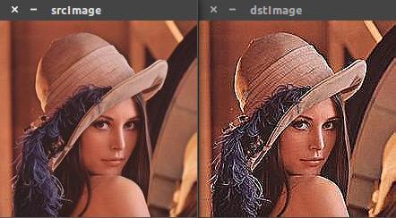 

与上一篇运行结果相比并没有黑边存在！

## 8. ROI区域和图像混合叠加

### **1.图像线性混合叠加**

在进行图像处理时,opencv中提供了addWeighted()实现对两幅图像的叠加。这是一种线性混合操作，其公式如下：


 

通过改变a的值，可以实现两幅图像或视频进行混合时出现不同的效果。 
其函数定义如下：

```
CV_EXPORTS_W void addWeighted(InputArray src1, double alpha, InputArray src2,
                              double beta, double gamma, OutputArray dst, int dtype=-1);12
```

详细参数说明如下： 

- src1: 第一幅输入图像 
- alpha: 线性混合时第一幅图像的权重 
- src2: 第二幅输入图像 
- beta: 第二幅输入图像的权重 
- dst: 图像线性混合后的目标图像 
- gamma: 添加到每一个线性叠加总和的gamma值 
- dtype: 目标图像深度，当两幅图像深度相同时可以将dtype置为-1,这样目标图像的深度将与输入图像相同

其中beta - (1.0 - alpha);

对于每个像素点其计算公式如下： 


示例代码如下：

```
#include <iostream>
#include <opencv2/core.hpp>
#include <opencv2/highgui.hpp>

using namespace std;
using namespace cv;

int main()
{
    Mat srcImage1 = imread("forest.jpg");
    Mat srcImage2 = imread("rain.jpg");
    Mat dstImage;

    //检查文件是否加载成功
    if(srcImage1.empty() || srcImage2.empty())
    {
        cout << "图像加载失败!" << endl << endl;
        return -1;
    }
    else
        cout << "图像加载成功!" << endl << endl;


    double alpha = 0.5;
    double beta;
    double input;

    cout << "Please Input alpha[0-1]: ";
    cin >> input;

    //判断输入的alpha是否符合要求
    if(input >= 0.0 && input <= 1.0)
    {
        alpha = input;
    }

    namedWindow("线性混合", WINDOW_NORMAL);
    beta = (1.0 - alpha);
    addWeighted(srcImage1, alpha, srcImage2, beta, 0.0, dstImage);

    imshow("线性混合", dstImage);
    namedWindow("srcImage1",WINDOW_NORMAL);
    imshow("srcImage1",srcImage1);
    namedWindow("srcImage2",WINDOW_NORMAL);
    imshow("srcImage2",srcImage2);

    waitKey(0);
    return 0;
}
```

运行结果如下所示：

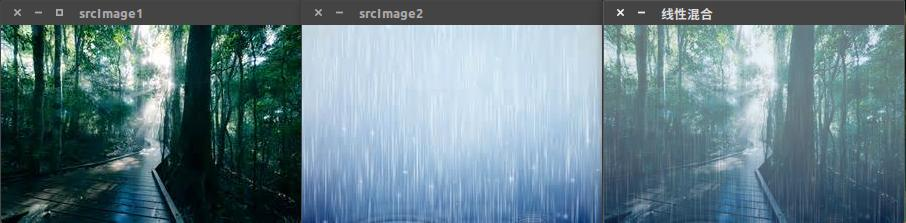

该运行结果输入值为0.5.

**注意：两幅图像混合时必须要求两幅图像的尺寸和类型完全相同。**

通过对图像设置ROI区域可以实现不同尺寸图像的混合。 

在进行图像处理时，常常需要设置感兴趣区域(ROI, region of interest),可以在图像任意位置创建ROI区域，设置ROI区域后可以更有针对性的进行下一步处理。 

定义ROI有两种方法（假定都从图像左上角(100,100)的位置划定ROI）： 

第一种是使用表示矩形区域的Rect。它指定矩形的左上角坐标和矩形的长宽来划定ROI区域。

```
ROIImage = srcImage(Rect(100,100,smallImage.cols,smallImage.rows));1
```

第二种方法是使用Range()指定感兴趣区域的行或列的范围。Range()指定的区域是一个连续的存储序列。

```
ROIImage = srcImage(Range(100,smallImage.rows),Range(100,smallImage.cols));1
```

示例代码如下：

```
#include <iostream>
#include <opencv2/core.hpp>
#include <opencv2/highgui.hpp>
#include <opencv2/imgproc.hpp>

using namespace std;
using namespace cv;

int main()
{
    Mat srcImage = imread("space.jpg");
    Mat addImage = imread("astronautB.jpg");

    //判断文件是否加载成功
    if(srcImage.data && addImage.data)
        cout << "图像加载成功!" << endl << endl;
    else
    {
        cout << "图像加载失败!" << endl << endl;
        return -1;
    }
    imshow("srcImage",srcImage);
    imshow("astronaut",addImage);

    //设置srcImage感兴趣区域
    //第一种方式，使用Rect()函数设置ROI
    Mat imageROI = srcImage(Rect(50,50,addImage.cols,addImage.rows));
    addWeighted(imageROI,0.7,addImage,0.3,0,imageROI);
    imshow("混合后图像",srcImage);

    waitKey(0);

    return 0;
}
```

其运行结果如下所示： 

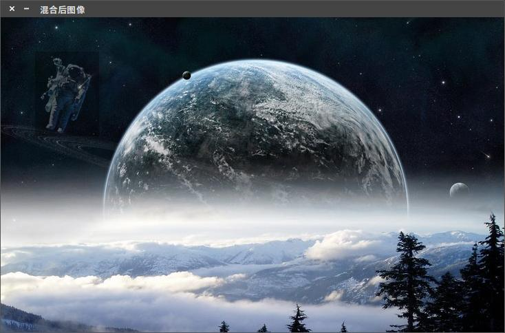


还可以利用copyTo()通过图像掩模板直接将图像复制到ROI区域。但是这种方法要求maskImage必须是灰度图。示例代码如下：

```
#include <iostream>
#include <opencv2/core.hpp>
#include <opencv2/highgui.hpp>

using namespace std;
using namespace cv;

int main()
{
    Mat srcImage = imread("space.jpg");
    Mat addImage = imread("astronautB.jpg");
    Mat maskImage = imread("astronautB.jpg",IMREAD_GRAYSCALE);  //加载其灰度图

    //判断文件是否加载成功
    if(srcImage.data && addImage.data)
        cout << "图像加载成功!" << endl << endl;
    else
    {
        cout << "图像加载失败!" << endl << endl;
        return -1;
    }

    //以第二种方式Range()函数设置其ROI区域
    Mat imageROI = srcImage(Range(50,50+maskImage.rows), Range(50,50+maskImage.cols));
    addImage.copyTo(imageROI,maskImage);
    imshow("混合后图像",srcImage);

    waitKey(0);

    return 0;
}
```


运行结果如下： 

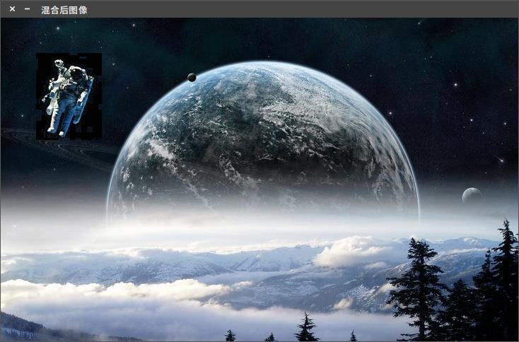


## 9. 轨迹条条创建和使用createTrackbar

上篇介绍图像混合时，需要设置两幅图像的权重，每次改变图像权重只能从代码改变，没有那么直观。opencv提供了一种称为轨迹条或滑动条（Trackbar）的控件工具，能够直观的改变出现处理时的参数，实时看到更改这些参数时对于图像处理结果的影响。

### **1. createTrackbar()函数**

createTrackbar()函数用来创建一个可以调节输入变量值的滑动条，并将改控件依附于指定的窗口上。在使用时需要和一个回调函数配合使用。其原型如下：

```
CV_EXPORTS int createTrackbar(const string& trackbarname, const string& winname,
                              int* value, int count,
                              TrackbarCallback onChange = 0,
                              void* userdata = 0);
```

其各个参数含义如下： 

- . const string& trackname: 滑动条名字 
- . const string& winname: 想要把该滑动条依附到的窗口名字，在程序中可能该窗口名称由namedWindow()声明。 
- . int* value: 创建滑动条时，滑动条的初始值 
- . int count: 滑动条的最大值，即所有滑动条的数据变动都要在0-count之间，滑动条最小值为0 
- . TrackbarCallback onChange = 0: 这是指的回调函数，每次滑动条数据变化时都对该函数进行回调 
- . void* userdata = 0: 这个是用户传给回调函数的数据，用来处理滑动条数值变动。如果在创建滑动条时，输入value实参是全局变量，则本参数userdata可使用默认值0.


```
#include <iostream>
#include <stdio.h>
#include <opencv2/core.hpp>
#include <opencv2/highgui.hpp>

using namespace std;
using namespace cv;

//声明全局变量
const int g_nTrackbarMaxValue = 100;     //滑动条最大值
int g_nTrackbarValue;                    //滑动条对应的值
double g_dAlphaValue;                   //第一幅图权重
double g_dBetaValue;                    //第二幅图权重
Mat g_srcImage1, g_srcImage2, g_distImage;

//声明回调函数
void on_Trackbar(int, void*);          

int main()
{
    g_srcImage1 = imread("forest.jpg");
    g_srcImage2 = imread("rain.jpg");

    //判断图像是否加载成功
    if(g_srcImage1.data && g_srcImage2.data)
        cout << "图像加载成功!" << endl << endl;
    else
    {
        cout << "图像加载失败!" << endl << endl;
        return -1;
    }

    namedWindow("混合后图像",WINDOW_NORMAL);     //滑动条依附的窗口
    g_nTrackbarValue = 20;                      //设置滑动条初始值

    //在创建的窗体中创建滑动条控件并命名
    char trackBarName[100];

    /*Linux下使用sprintf需要添加头文件"stdio.h"
     *在Windows下微软一直在推广其安全函数即后缀加上_s
     *否则会有警告出现
     *所以本段代码将有两个版本*/
    sprintf(trackBarName, "透明度 %d", g_nTrackbarMaxValue);       //Linux版本语句

    //sprintf_s(trackBarName, "透明度 %d", g_nTrackbarMaxValue);     //Windows版本语句

    createTrackbar(trackBarName, "混合后图像", &g_nTrackbarValue, g_nTrackbarMaxValue, on_Trackbar);

    on_Trackbar(g_nTrackbarValue, 0);           //结果在回调函数中显示

    waitKey(0);


    return 0;
}

void on_Trackbar(int, void*)
{
    //图像融合的权重在0-1之间，转换输入值和权重之间的比例
    g_dAlphaValue = (double) g_nTrackbarValue / g_nTrackbarMaxValue;
    g_dBetaValue = 1.0 - g_dAlphaValue;     //第二幅图像权重

    //使用addWeighted函数对图像进行线性混合
    addWeighted(g_srcImage1, g_dAlphaValue, g_srcImage2, g_dBetaValue, 0.0, g_distImage);

    imshow("混合后图像", g_distImage);
}
```

运行结果如下：

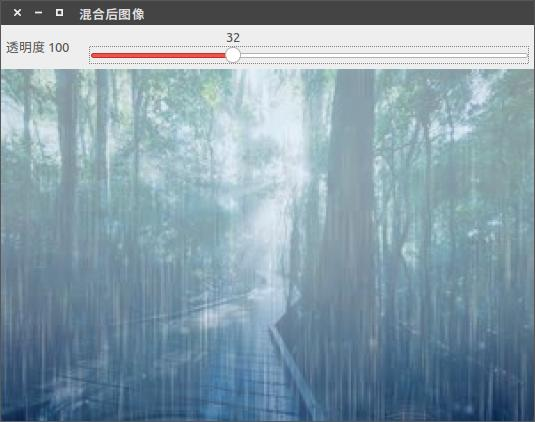

这里需要说明的是滑动条中的回调函数原型必须为：

```
void FunctionName(int, void*);
```

第一个参数是滑动条位置，第二个参数是userdata即用户数据。回调函数是通过函数指针调用的函数，如果回调是NULL指针表示没有回调函数的调用。

### **2. getTrackbarPos()函数**

这个函数用于获取当前轨迹条的位置并返回，与createTrackbar()函数配合使用。其函数原型如下：

```
CV_EXPORTS_W int getTrackbarPos(const string& trackbarname, const string& winname);1
```


- .const string& trackbarname: 滑动条名称 
- .const string& winname: 滑动条所依附窗口的名称

## 10. 调节图像亮度和对比度

在图像处理中，图像像素的值依赖于输入图像的值。可以通过对输入像素值进行数值运算已达到对图像处理的目的。以调节图像对比度和亮度为例，通过结合之前学过的图像像素访问和轨迹条等内容，对图像对比度和亮度进行调节。 
以f(i,j)代表原像素值，g(i,j)为输出像素的值,α和β为两个参数，则可以通过以下公式对图像像素值进行数值运算从而达到调节图像亮度和对比度的目的。

```
g(i,j)= αf(i,j)+ β1
```

其中参数α>0和β常被称为增益和偏置参数，有时这些参数可以调节图像的对比度和亮度。其中i,j分别代表了该像素的行和列。

```
#include <iostream>
#include <stdio.h>
#include <opencv2/core.hpp>
#include <opencv2/highgui.hpp>

using namespace std;
using namespace cv;

//定义全局变量
Mat g_SrcImage, g_DstImage;
const int g_nAlphaTrackbarMaxValue = 30;    //滑动条最大值
const int g_nBetaTrackbarMaxValue = 100;
int g_nAlphaTrackValue;                  //滑动条对比度对应值
int g_nBetaTrackValue;                   //滑动条亮度对应值
double g_dAlpahValue;
//double g_dBetaValue;

//声明回调函数
void on_AlphaTrackbar(int, void*);
void on_BetaTrackbar(int, void*);

int main()
{
    g_SrcImage = imread("lena.jpg");

    //判断图像是否加载成功
    if(g_SrcImage.empty())
    {
        cout << "图像加载失败!" << endl << endl;
        return -1;
    }   
    else
        cout << "图像加载成功!" << endl << endl;

    namedWindow("原图像",WINDOW_AUTOSIZE);
    imshow("原图像",g_SrcImage);

    g_DstImage = Mat::zeros(g_SrcImage.size(),g_SrcImage.type());     

    namedWindow("图像调节",WINDOW_AUTOSIZE);          //声明轨迹条依附的窗口
    g_nAlphaTrackValue = 10;                      //轨迹条中alpha初始值
    g_nBetaTrackValue = 50;                       //轨迹条中beta初始值

    //在创建的窗体中创建轨迹条并命名
    char alphaTrackName[50];
    char betaTrackName[50];
    sprintf(alphaTrackName,"对比度 %d", g_nAlphaTrackbarMaxValue);
    sprintf(betaTrackName,"亮 度 %d",g_nBetaTrackbarMaxValue);

    //创建对比度调节和亮度调节的轨迹条
    createTrackbar(alphaTrackName,"图像调节",&g_nAlphaTrackValue,g_nAlphaTrackbarMaxValue,on_AlphaTrackbar);
    createTrackbar(betaTrackName,"图像调节",&g_nBetaTrackValue,g_nBetaTrackbarMaxValue,on_BetaTrackbar);

    //调用回调函数
    on_AlphaTrackbar(g_nAlphaTrackValue, 0);
    on_BetaTrackbar(g_nBetaTrackValue, 0);

    waitKey(0);

    return 0;
}

void on_AlphaTrackbar(int, void*)
{
    g_dAlpahValue = (double)g_nAlphaTrackValue / 10;
    for(int y = 0; y < g_DstImage.rows; y++)
    {
        for(int x = 0; x < g_DstImage.cols; x++)
        {
            for(int c = 0; c < 3; c++)
            {
                g_DstImage.at<Vec3b>(y, x)[c] = saturate_cast<uchar>(g_dAlpahValue * 
                (g_SrcImage.at<Vec3b>(y, x)[c]));
            }
        }
    }
    imshow("图像调节",g_DstImage);
}

void on_BetaTrackbar(int, void*)
{
    for(int y = 0; y < g_DstImage.rows; y++)
    {
        for(int x = 0; x < g_DstImage.cols; x++)
        {
            for(int c = 0; c < 3; c++)
            {
                g_DstImage.at<Vec3b>(y, x)[c] = saturate_cast<uchar>((g_SrcImage.at<Vec3b>(y, x)[c]) + 
                g_nBetaTrackValue);
            }
        }
    }
    imshow("图像调节",g_DstImage);
}
```

程序运行结果如下所示： 

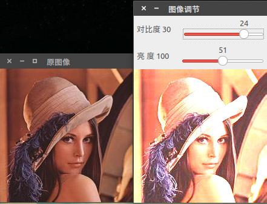

程序分析： 

\* 在上述程序中用alpha和beta分别替代上文中提到的α和β两个参数。 

\* 使用Mat::zeros()方法初始化目标图像矩阵，与原图像大小和类型相同 

\* 使用at()函数对图像像素值进行遍历 

\* 图像为三通道图像，故使用结构存储每个通道所对应的像素值 

\* 在计算像素值时使用saturate_cast来防止计算出来的图像像素值溢出


## 11. 绘图函数

opencv中提供了很多绘图函数，在进行图像处理，对感兴趣区域进行标定时，就需要利用这些绘图函数。现在集中做一个归纳介绍。

### **1. Point** 

Point常用来指定一幅二维图像中的点。如

```
Point pt;
pt.x = 10;
pt.y = 8;
或
Point pt = Point(10,8);
```

其指向的是在图像中(10, 8)位置的一个像素点。 
查找Point引用可以在”core.hpp”文件发现如下语句：

```
typedef Point_<int> Point2i;
typedef Point2i Point;
```

即`Point_`与Point2i和Point是等价的。查看Point_定义出现很多模板如下：

```
template<typename _Tp> inline Point_<_Tp>::Point_(_Tp _x, _Tp _y) : x(_x), y(_y) {}
```

其从`Point_`继承而来，继续查看`Point_`定义如下：

```
template<typename _Tp> class Point_
{
public:
    typedef _Tp value_type;

    // various constructors
    Point_();
    Point_(_Tp _x, _Tp _y);
    Point_(const Point_& pt);
    Point_(const CvPoint& pt);
    Point_(const CvPoint2D32f& pt);
    Point_(const Size_<_Tp>& sz);
    Point_(const Vec<_Tp, 2>& v);

    Point_& operator = (const Point_& pt);
    //! conversion to another data type
    template<typename _Tp2> operator Point_<_Tp2>() const;

    //! conversion to the old-style C structures
    operator CvPoint() const;
    operator CvPoint2D32f() const;
    operator Vec<_Tp, 2>() const;

    //! dot product
    _Tp dot(const Point_& pt) const;
    //! dot product computed in double-precision arithmetics
    double ddot(const Point_& pt) const;
    //! cross-product
    double cross(const Point_& pt) const;
    //! checks whether the point is inside the specified rectangle
    bool inside(const Rect_<_Tp>& r) const;

    _Tp x, y; //< the point coordinates
};
```

整个Point类的定义就很明显了。可以通过制定(x,y)来指定二维图像中的点。

### **2. Scalar** 

表示颜色的类，Scalar代表了一个四元素的vector容器，在opencv中常用来传递像素值。在本篇博客中将主要用来表示BGR三个像素的值。如果不使用则最后一个参数不用设置。如

```
Scalar(a, b, c);
```

其中a,b,c分别代表像素点Blue,Green,Red的值。 

同样查看Scalar类的引用在”core.hpp”头文件发现如下语句：

```
typedef Scalar_<double> Scalar;
```

查看Scalar_定义：

```
template<typename _Tp> class Scalar_ : public Vec<_Tp, 4>{public:    //! various constructors    Scalar_();    Scalar_(_Tp v0, _Tp v1, _Tp v2=0, _Tp v3=0);    Scalar_(const CvScalar& s);    Scalar_(_Tp v0);    //! returns a scalar with all elements set to v0    static Scalar_<_Tp> all(_Tp v0);    //! conversion to the old-style CvScalar    operator CvScalar() const;    //! conversion to another data type    template<typename T2> operator Scalar_<T2>() const;    //! per-element product    Scalar_<_Tp> mul(const Scalar_<_Tp>& t, double scale=1 ) const;    // returns (v0, -v1, -v2, -v3)    Scalar_<_Tp> conj() const;    // returns true iff v1 == v2 == v3 == 0    bool isReal() const;};
```

从定义语句Scalar_(_Tp v0, _Tp v1, _Tp v2=0, _Tp v3=0);中可以看出Scalar最后两个参数都有默认值，故在不适用第四个参数时可以直接忽略。

### **3. Size** 

表示尺寸的类，依旧查看其引用和定义如下：

```
typedef Size_<int> Size2i;typedef Size_<double> Size2d;typedef Size2i Size;
```

所以针对int类型的size参数，其可以直接使用Size类，而对于double类型的size参数，只能使用Size2d。查看Size_定义

```
template<typename _Tp> class Size_{public:    typedef _Tp value_type;    //! various constructors    Size_();    Size_(_Tp _width, _Tp _height);    Size_(const Size_& sz);    Size_(const CvSize& sz);    Size_(const CvSize2D32f& sz);    Size_(const Point_<_Tp>& pt);    Size_& operator = (const Size_& sz);    //! the area (width*height)    _Tp area() const;    //! conversion of another data type.    template<typename _Tp2> operator Size_<_Tp2>() const;    //! conversion to the old-style OpenCV types    operator CvSize() const;    operator CvSize2D32f() const;    _Tp width, height; // the width and the height};
```

里面有很多方法。在本篇博客中将使用Size_(_Tp _width, _Tp _height);直接指定size的宽和高。

### **4. line** 

绘制直线类。其定义如下：

```
CV_EXPORTS_W void line(CV_IN_OUT Mat& img, Point pt1, Point pt2, const Scalar& color,
                     int thickness=1, int lineType=8, int shift=0);12
```

参数解释 

- .Mat& img: 输入输出图像 
- .Point pt1和pt2: 二维Point类的点坐标,由Point指定 
- .Scalar& color: 直线颜色 
- . int thickness = 1: 直线宽度，有默认值1 
- . int lineType = 8: 直线类型，默认值为8


### **5. ellips** 

绘制椭圆。其定义如下：

```
CV_EXPORTS_W void ellipse(CV_IN_OUT Mat& img, Point center, Size axes,
                        double angle, double startAngle, double endAngle,
                        const Scalar& color, int thickness=1,
                        int lineType=8, int shift=0);1234
```

参数解释 

- . Mat& img: 输入输出图像 
- . Point center: 由Point类指定的椭圆中心坐标 
- . Size axes: 由Size类指定的椭圆所在区域矩形 
- . double angle: 椭圆长轴偏离角度 
- . double startAngle: 绘制椭圆起始角度 
- . double endAngle: 绘制椭圆终点角度。如果设置startAngle为0，设置endAngle为360则表示整个椭圆 
- . const Scalar& color: 椭圆颜色 
- . int thickness = 1: 椭圆边的线宽 
- . int lineType = : 椭圆变线的类型 

### **6. rectangle** 

绘制矩形，其定义如下：

```
CV_EXPORTS_W void rectangle(CV_IN_OUT Mat& img, Point pt1, Point pt2,
                          const Scalar& color, int thickness=1,
                          int lineType=8, int shift=0);

//! draws the rectangle outline or a solid rectangle covering rec in the image
CV_EXPORTS void rectangle(CV_IN_OUT Mat& img, Rect rec,
                          const Scalar& color, int thickness=1,
                          int lineType=8, int shift=0);
```

可以看出其有两种参数传入方式。一类是用Point指定点，另一类是用Rect函数指定边长。 

. 针对第一类指定方式，Point类指定的两个点分别为矩形的左上角点坐标和矩形左下角点坐标 

. Rect指定边长，查看其定义有如下语句

```
typedef Rect_<int> Rect;
```

说明Rect是int类型的数据结构，与Rect_等价。查看Rect_定义，看其用法，如下：

```
template<typename _Tp> class Rect_
{
public:
    typedef _Tp value_type;

    //! various constructors
    Rect_();
    Rect_(_Tp _x, _Tp _y, _Tp _width, _Tp _height);
    Rect_(const Rect_& r);
    Rect_(const CvRect& r);
    Rect_(const Point_<_Tp>& org, const Size_<_Tp>& sz);
    Rect_(const Point_<_Tp>& pt1, const Point_<_Tp>& pt2);

    Rect_& operator = ( const Rect_& r );
    //! the top-left corner
    Point_<_Tp> tl() const;
    //! the bottom-right corner
    Point_<_Tp> br() const;

    //! size (width, height) of the rectangle
    Size_<_Tp> size() const;
    //! area (width*height) of the rectangle
    _Tp area() const;

    //! conversion to another data type
    template<typename _Tp2> operator Rect_<_Tp2>() const;
    //! conversion to the old-style CvRect
    operator CvRect() const;

    //! checks whether the rectangle contains the point
    bool contains(const Point_<_Tp>& pt) const;

    _Tp x, y, width, height; //< the top-left corner, as well as width and height of the rectangle
};
```

常用` Rect_(*Tp _x, _Tp _y, _Tp _width, _Tp _height);`来定义一个矩形；也可以使用函数`Rect*(const Point_<*Tp>& pt1, const Point*<_Tp>& pt2);`指定矩形左上角的点和右下角的点。

### **7. circle** 

绘制圆。查看其定义

```
CV_EXPORTS_W void circle(CV_IN_OUT Mat& img, Point center, int radius,
                       const Scalar& color, int thickness=1,
                       int lineType=8, int shift=0);
```

参数解释 

- . Mat& img: 输入输出图像 
- . Point center: Point指定的一个二维点作为圆心 
- . int radius: 圆的半径 
- . const Scalar& color: Scalar指定的绘制圆的颜色 
- . int thickness = 1: 圆边的线宽 
- . int lineType = 8: 圆边线的类型


### **8. filled polygon** 

填充多边形。其定义有两种形式

```
CV_EXPORTS void fillPoly(Mat& img, const Point** pts,
                         const int* npts, int ncontours,
                         const Scalar& color, int lineType=8, int shift=0,
                         Point offset=Point() );

CV_EXPORTS_W void fillPoly(InputOutputArray img, InputArrayOfArrays pts,
                           const Scalar& color, int lineType=8, int shift=0,
                           Point offset=Point() );
```

. 第一种形式定义，有Point** pts，是一个二阶指针，用来指定多边形顶点。多边形顶点不是某个特定点，而是多个点，所以用Point类定义的数组来表示顶点坐标，如下

```
Point points[1][10];        //定义一个Point类数组，大小为一行十列points[0][0] = Point(w / 4.0, 7 * w / 8.0);points[0][1] = Point(w / 4.0,  w / 8.0);...const Point* ppt[1] = { points[0] };    //points[0]为第一行元素指针/*此时定义一个Point* 类型的指针用来存放point[0]的指针，而ppt就是二阶指针*/
```

const int* npts是说明多边形顶点个数，与上述顶点个数保持一致。如

```
int npt[] = { 10 };
```

之后调用函数进行图形绘制


.第二种形式定义同样给出输入点数组。

综合示例： 
结合上面的函数介绍，给出一个综合的示例程序

```
#include <iostream>
#include <opencv2/core.hpp>
#include <opencv2/highgui.hpp>

using namespace std;
using namespace cv;

void MyEllipse(Mat img, double angle);
void MyFilledCircle(Mat img, Point center);
void MyLine(Mat img, Point start, Point end);
void MyPolygon(Mat img);

const int w = 400;

int main()
{
    char atom_window[] = "Drawing 1: Atom";
    char rook_window[] = "Drawing 2: Rook";

    //创建两个空的图像
    Mat atom_image = Mat::zeros(w, w, CV_8UC3);
    Mat rook_image = Mat::zeros(w, w, CV_8UC3);

    //使用ellipse和circle函数绘制一个简单的原子结构
    MyEllipse(atom_image,90);
    MyEllipse(atom_image,0);
    MyEllipse(atom_image,45);
    MyEllipse(atom_image,-45);

    MyFilledCircle(atom_image,Point(w/2.0, w/2.0));

    namedWindow(atom_window,WINDOW_AUTOSIZE);
    imshow(atom_window,atom_image);

    //使用line,rectangle,polygon(多边形)绘制一个rook
    MyPolygon(rook_image);

    //创建一个矩形
    rectangle(rook_image,Point(0, 7*w/8.0),Point(w,w),Scalar(0,255,255),-1, 8);

    //创建直线
    MyLine(rook_image,Point(0,15*w/16),Point(w, 15*w/16));
    MyLine(rook_image,Point(w/4, 7*w/8),Point(w/4,w));
    MyLine(rook_image,Point(w/2, 7*w/8),Point(w/2,w));
    MyLine(rook_image,Point(3*w/4, 7*w/8), Point(3*w/4,w));

    //显示绘制的图像
    namedWindow(rook_window,WINDOW_AUTOSIZE);
    imshow(rook_window,rook_image);

    waitKey(0);

    return 0;
}

void MyEllipse(Mat img, double angle)
{
    int thickness = 2;      //线宽
    int lineType = 8;       //线的类型
    ellipse(img,Point(w/2.0, w/2.0),Size(w/4.0, w/16.0),angle,0,360,Scalar(255,0,0),thickness,lineType);
}

void MyFilledCircle(Mat img, Point center)
{
    int thickness = -1;
    int lineType = 8;

    circle(img,center,w/32.0,Scalar(0,0,255),thickness,lineType);
}

void MyLine(Mat img, Point start, Point end)
{
    int thickness = 2;
    int lineType = 8;
    line(img, start, end, Scalar(0,0,0),thickness,lineType);
}

void MyPolygon(Mat img)
{
    int lineType = 8;

    //生成一些点
    Point rook_points[1][20];
    rook_points[0][0] = Point(w/4.0, 7*w/8.0);
    rook_points[0][1] = Point(3*w/4.0, 7*w/8.0);
    rook_points[0][2] = Point(3*w/4.0, 13*w/16.0);
    rook_points[0][3] = Point(11*w/16.0, 13*w/16.0);
    rook_points[0][4] = Point(19*w/32.0, 3*w/8.0);
    rook_points[0][5] = Point(3*w/4.0, 3*w/8.0);
    rook_points[0][6] = Point(3*w/4.0, w/8.0);
    rook_points[0][7] = Point(26*w/40.0, w/8.0);
    rook_points[0][8] = Point(26*w/40.0, w/4.0);
    rook_points[0][9] = Point(22*w/40.0, w/4.0);
    rook_points[0][10] = Point(22*w/40.0, w/8.0);
    rook_points[0][11] = Point(18*w/40.0, w/8.0);
    rook_points[0][12] = Point(18*w/40.0, w/4.0);
    rook_points[0][13] = Point(14*w/40.0, w/4.0);
    rook_points[0][14] = Point(14*w/40.0, w/8.0);
    rook_points[0][15] = Point(w/4.0, w/8.0);
    rook_points[0][16] = Point(w/4.0, 3*w/8.0);
    rook_points[0][17] = Point(13*w/32.0, 3*w/8.0);
    rook_points[0][18] = Point(5*w/16.0, 13*w/16.0);
    rook_points[0][19] = Point(w/4.0, 13*w/16.0);

    const Point* ppt[1] = {rook_points[0]};
    int npt[] = {20};

    fillPoly(img,ppt,npt,1,Scalar(255,255,255),lineType);
}
```

运行结果如图所示： 

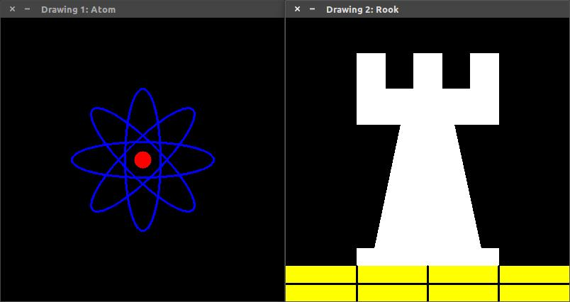


```
#include "opencv2/opencv.hpp"
using namespace cv;

int  main()
{
    Mat src = imread("..//bird.png");
    Rect rect(230, 5, 280, 290);//左上坐标（x,y）和矩形的长(x)宽(y)

   cv::rectangle(src, rect, Scalar(255, 0, 0),1, LINE_8,0);
    //cv::rectangle(src, Point(230, 5), Point(510, 295), Scalar(255, 0, 0), 1, LINE_8, 0);//左上角点的(x,y)，右下角点的(x,y)

   // cv::rectangle(src, rect, Scalar(255, 0, 0),-1, LINE_8,0);//绘制填充矩形


    imwrite("src.png", src);
    imshow("src", src);
    waitKey(0);
	return 0;
}
```

输入图像：


输出图像：

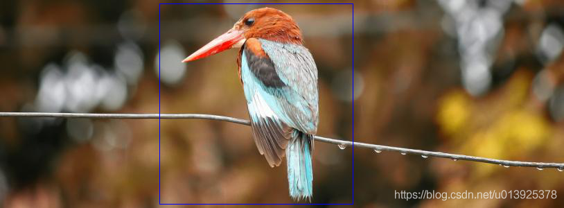

保存的图像src.png，是上面有框的图像，与显示一样。

## 12. 文本文字插入

在进行图形处理时，可能考虑到要对图片部分进行文字标注，也可以对图片进行加水印。本篇将介绍使用opencv函数putText()和getTextSize()函数来实现这些功能。

### **1. putText()函数**

putText()是字符串绘制函数，其定义如下：

```
CV_EXPORTS_W void putText( Mat& img, const string& text, Point org,
                         int fontFace, double fontScale, Scalar color,
                         int thickness=1, int lineType=8,
                         bool bottomLeftOrigin=false );
```

参数解释： 

**. Mat& img:** 要添加备注的图片 

**. const string& text:** 要添加的文字内容 

**. Point org:** 要添加的文字基准点或原点坐标，左上角还是左下角取决于最后一个参数bottomLeftOrigin的取值 

**. int fontFace:** 文字的字体类型（Hershey字体集），可供选择的有 

- FONT_HERSHEY_SIMPLEX：正常大小无衬线字体 
- FONT_HERSHEY_PLAIN：小号无衬线字体 
- FONT_HERSHEY_DUPLEX：正常大小无衬线字体，比FONT_HERSHEY_SIMPLEX更复杂 
- FONT_HERSHEY_COMPLEX：正常大小有衬线字体 
- FONT_HERSHEY_TRIPLEX：正常大小有衬线字体，比FONT_HERSHEY_COMPLEX更复杂 
- FONT_HERSHEY_COMPLEX_SMALL：FONT_HERSHEY_COMPLEX的小译本 
- FONT_HERSHEY_SCRIPT_SIMPLEX：手写风格字体 
- FONT_HERSHEY_SCRIPT_COMPLEX：手写风格字体，比FONT_HERSHEY_SCRIPT_SIMPLEX更复杂 

这些参数和FONT_ITALIC同时使用就会得到相应的斜体字 

**. double fontScale:** 字体相较于最初尺寸的缩放系数。若为1.0f，则字符宽度是最初字符宽度，若为0.5f则为默认字体宽度的一半 

**. Scalar color:** 很熟悉了，字体颜色 

**. int thickness = 1:** 字体笔画的粗细程度，有默认值1 

**. int lineType = 8:** 字体笔画线条类型，有默认值8 

**. bool bottomLeftOrigin = false:** 如果取值为TRUE，则Point org指定的点为插入文字的左上角位置，如果取值为默认值false则指定点为插入文字的左下角位置.


对于字体的解释，请查看官方文档[cvInitFont()](http://docs.opencv.org/2.4/modules/core/doc/drawing_functions.html?highlight=puttext#Size getTextSize(const string& text, int fontFace, double fontScale, int thickness, int* baseLine))

### **2. getTextSize()函数**

计算插入文本文字的宽和高，其定义如下

```
//! returns bounding box of the text string
CV_EXPORTS_W Size getTextSize(const string& text, int fontFace,
                            double fontScale, int thickness,
                            CV_OUT int* baseLine);
```

参数解释： 

. const string& text: 输入的文本文字 

. int fontFace: 文字字体类型 

. double fontScale: 字体缩放系数 

. int thickness: 字体笔画线宽 

. CV_OUT int* baseLine: 文字最底部y坐标


示例程序：

```
#include <iostream>
#include <opencv2/core.hpp>
#include <opencv2/highgui.hpp>

using namespace std;
using namespace cv;

int main()
{
    string text = "Funny text inside the box";
    //int fontFace = FONT_HERSHEY_SCRIPT_SIMPLEX;     //手写风格字体
    int fontFace = FONT_HERSHEY_SCRIPT_COMPLEX;
    double fontScale = 2;       //字体缩放比
    int thickness = 3;

    Mat img(600,800,CV_8UC3, Scalar::all(0));

    int baseline = 0;

    Size textSize = getTextSize(text, fontFace, fontScale, thickness, &baseline);
    baseline += thickness;

    //center the text
    Point textOrg((img.cols - textSize.width)/2,(img.rows + textSize.height)/2);

    //draw the box
    rectangle(img,textOrg + Point(0,baseline),textOrg + Point(textSize.width, -textSize.height),Scalar(0,0,255));

    line(img,textOrg + Point(0,thickness),textOrg + Point(textSize.width,thickness),Scalar(0,0,255));

    putText(img,text,textOrg,fontFace,fontScale,Scalar::all(255),thickness,8);
    imshow("text",img);

    waitKey(0);

    return 0;
}
```

程序解释： 

. int fontFace = FONT_HERSHEY_SCRIPT_COMPLEX;字体为手写风格 

. double fontScale = 2: 字体缩放比，在此处表示是默认字体大小的两倍 

. Point textOrg((img.cols - textSize.width)/2,(img.rows + textSize.height)/2);这句代码可以求出字符串左下角位置坐标 

. rectangle中第一个点：textOrg+Point(0, baseline)矩形框左下角坐标，第二个点：textOrg+Point(textSize.width,-textSize.height)是矩形的右上角 

.Scalar::all(255)即三通道分量BGR均为255，字体为白色

程序运行结果： 

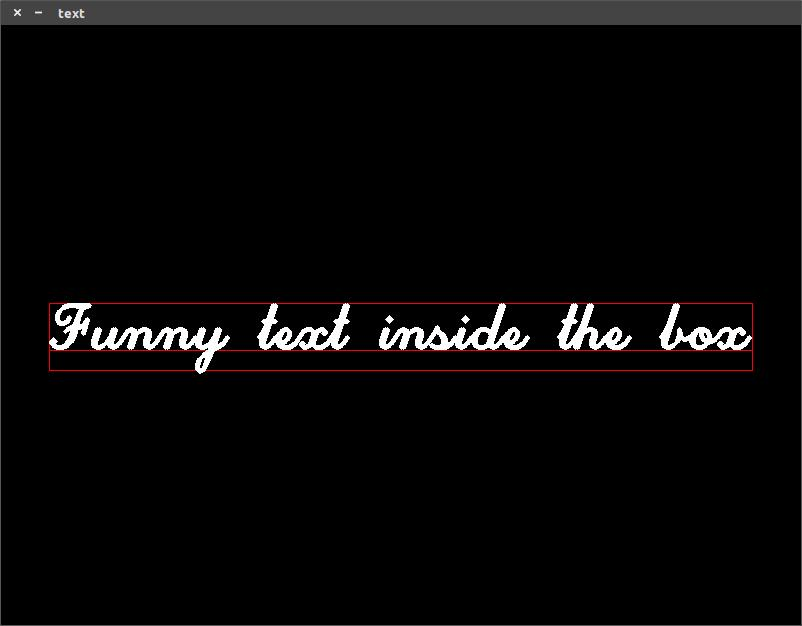


```
#include <iostream>
#include <opencv2/core.hpp>
#include "opencv2/opencv.hpp"
#include <opencv2/highgui.hpp>

using namespace cv;
using namespace std;

int  main()
{
    Mat src = imread("..//bird.png");
    
    Rect rect(230, 5, 280, 290);//左上坐标（x,y）和矩形的长(x)宽(y)
    
    string text = "bird box";
    int fontFace = FONT_HERSHEY_SCRIPT_COMPLEX;
    double fontScale = 1;       //字体缩放比
    int thickness = 1;
    
    int baseline = 0;
    Size textSize = getTextSize(text, fontFace, fontScale, thickness, &baseline);
    baseline += thickness;
    
    //center the text
    //Point textOrg((src.cols - textSize.width)/2,(src.rows + textSize.height)/2);
    Point textOrg(230,(5 + textSize.height));
    
    putText(src,text,textOrg,fontFace,fontScale,Scalar::all(0),thickness,8);
    cv::rectangle(src, rect, Scalar(255, 0, 0),1, LINE_8,0);
   imwrite("src.png", src);
   imshow("src", src);
   waitKey(0);
   return 0;
}
```


## 13. 图像颜色通道分离和融合


在图像处理时，我们接触到的彩色以RGB居多，为了分析图像在某一通道上的特性，需要将图像的颜色通道进行分离，或者是在对某一颜色通道处理后重新进行融合。opencv提供了split()函数来进行颜色通道的分离，提供了merge()函数来进行颜色通道的融合。

### **1.split()函数** 

颜色通道分离函数，其定义如下所示：

```
CV_EXPORTS void split(const Mat& src, Mat* mvbegin);
CV_EXPORTS void split(const Mat& m, vector<Mat>& mv );
```

其有两种定义形式。 

.第一个参数是输入分离通道的图像 

.第二个参数是一个Mat类型的vector容器，用来存放分离后的通道

### **2.merge()函数**

```
CV_EXPORTS void merge(const Mat* mv, size_t count, OutputArray dst);
CV_EXPORTS void merge(const vector<Mat>& mv, OutputArray dst );
```

其定义也有两个定义形式，参数含义与split()函数基本相同。其OutputArray dst可以是一个Mat类型的数据。

示例程序：

```
#include <iostream>
#include <opencv2/core.hpp>
#include <opencv2/highgui.hpp>

using namespace std;
using namespace cv;

void addImage(Mat& image, Mat& logoImage, vector<Mat>channels, Mat imageChannel, String title);

int main()
{
    Mat srcImage = imread("七龙珠.jpg");
    Mat logoImage = imread("七龙珠logo.jpg", IMREAD_GRAYSCALE);

    //判断文件是否加载成功
    if (srcImage.empty() || logoImage.empty())
    {
        cout << "图像加载失败!" << endl;
        return false;
    }
    else
        cout << "图像加载成功!" << endl;

    //对加载的原图像进行通道分离
    vector<Mat>channels;
    split(srcImage, channels);
    Mat imageBlueChannel;
    imageBlueChannel = channels.at(0);  //提取蓝色通道

    //窗口名称，也可以用char数组，传入char*来指定窗口名称
    String imageBlueTitle = "蓝色通道叠加logo融合";     

    addImage(srcImage, logoImage, channels, imageBlueChannel, imageBlueTitle);

    return 0;
}

void addImage(Mat& image, Mat& logoImage, vector<Mat>channels, Mat imageChannel, String title)
{
    //在提取的蓝色通道上，指定ROI区域叠加logoImage
    addWeighted(imageChannel(Rect(50, 50, logoImage.cols, logoImage.rows)), 1.0, logoImage, 0.7,
        0.0, imageChannel(Rect(50, 50, logoImage.cols, logoImage.rows)));

    merge(channels, image); //将叠加logo后的蓝色通道与另外两个颜色通道重新融合
    imshow(title, image);
    waitKey(0);
}
```

程序分析： 

. 通过前面几篇文章的介绍，我们已经了解到在图像中其RGB三通道的排列顺序不是我们所熟知的RGB，而是BGR，所以在得到channels后，可以通过at()函数来指定颜色通道，如在程序中

```
imageBlueChannel = channels.at(0);
```

即将蓝色通道提取出来，同样通过这种方法也可以将绿色和红色通道进行提取


. 在将logo叠加到图片上时用到了函数addWeighted()函数，这个函数在前面的文章有提到，可以[点击](http://blog.csdn.net/keith_bb/article/details/53103403)查看该函数的用法。

程序运行结果 

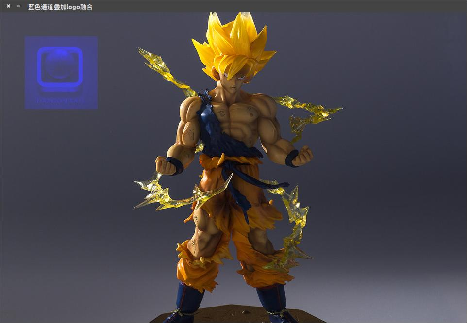


## 14. 图像傅里叶变换dft

https://blog.csdn.net/keith_bb/article/list/2?t=1