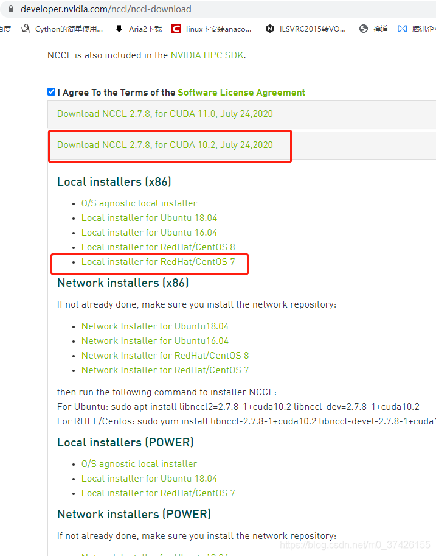
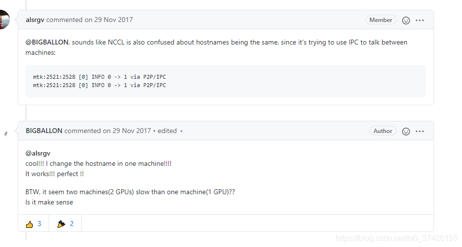

# 多机多卡搭建过程

⌚️: 2020年8月9日

📚参考

- [horovod多机多卡启动指南](http://chaopeng.name/2020/01/03/horovod多机多卡启动指南/)

- [官方教程](https://horovod.readthedocs.io/en/latest/docker.html)

----

## 一～三、安装驱动&CUDA&cuDNN&NCCL

安装详细过程见README中的一至三。

| 主机/版本                                                    | node01        | node02        | 安装链接                                                     |
| ------------------------------------------------------------ | ------------- | ------------- | ------------------------------------------------------------ |
| IP                                                           | 192.168.50.11 | 192.168.50.12 |                                                              |
| [Driver](https://www.nvidia.cn/Download/index.aspx?lang=cn)  | 440.64.00     | 440.64.00     | [NVIDIA驱动](driverinstall.md)                               |
| [CUDA](https://developer.nvidia.com/cuda-toolkit-archive)    | 10.2.89       | 10.2.89       | [安装CUDA，cuDNN](cudainstall.md)                            |
| [cuDNN](https://developer.nvidia.com/rdp/cudnn-archive)      | 7.6.5         | 7.6.5         |                                                              |
| [NCCL](https://developer.nvidia.com/nccl/nccl-legacy-downloads) | 2.7.6         | 2.7.6         | [安装nccl](https://docs.nvidia.com/deeplearning/nccl/install-guide/index.html#debian) |
| GPU                                                          | P40           | P40           |                                                              |
| IB                                                           | 192.168.33.11 | 192.168.33.12 | [装安IB驱动](ib.md)                                          |
|                                                              |               |               |                                                              |

[驱动&CUDA对应关系](https://docs.nvidia.com/deploy/cuda-compatibility/index.html)

装完后，需要进行一下测试。

1. Driver测试：nvidia-smi
2. CUDA测试：CUDA sample
3. cuDNN测试：检测版本
4. NCCL测试：GitHub

## 四、测试pytorch多机多卡程序

### 1. pip list内容

```
root@node02:~# pip list
DEPRECATION: Python 3.5 reached the end of its life on September 13th, 2020. Please upgrade your Python as Python 3.5 is no longer maintained. pip 21.0 will drop support for Python 3.5 in January 2021. pip 21.0 will remove support for this functionality.
Package             Version
------------------- ----------------------
chardet             2.3.0
command-not-found   0.3
language-selector   0.1
numpy               1.18.5
Pillow              7.2.0
pip                 20.2.3
pycurl              7.43.0
pygobject           3.20.0
python-apt          1.1.0b1+ubuntu0.16.4.2
python-debian       0.1.27
python-systemd      231
requests            2.9.1
setuptools          20.7.0
six                 1.10.0
ssh-import-id       5.5
torch               1.2.0
torchvision         0.4.0
ufw                 0.35
unattended-upgrades 0.1
urllib3             1.13.1
wheel               0.29.0

```


### 2. [程序链接](main.py)

```
import argparse
import os
import random
import shutil
import time
import warnings

import torch
import torch.nn as nn
import torch.nn.parallel
import torch.backends.cudnn as cudnn
import torch.distributed as dist
import torch.optim
import torch.multiprocessing as mp
import torch.utils.data
import torch.utils.data.distributed
import torchvision.transforms as transforms
import torchvision.datasets as datasets
import torchvision.models as models

parser = argparse.ArgumentParser(description='PyTorch ImageNet Training')
parser.add_argument('-j', '--workers', default=8, type=int, metavar='N',
                    help='number of data loading workers (default: 4)')
parser.add_argument('--epochs', default=1, type=int, metavar='N',
                    help='number of total epochs to run')
parser.add_argument('--start-epoch', default=0, type=int, metavar='N',
                    help='manual epoch number (useful on restarts)')
parser.add_argument('-b', '--batch-size', default=256, type=int,
                    metavar='N',
                    help='mini-batch size (default: 256), this is the total '
                         'batch size of all GPUs on the current node when '
                         'using Data Parallel or Distributed Data Parallel')
parser.add_argument('--lr', '--learning-rate', default=0.1, type=float,
                    metavar='LR', help='initial learning rate', dest='lr')
parser.add_argument('--momentum', default=0.9, type=float, metavar='M',
                    help='momentum')
parser.add_argument('--wd', '--weight-decay', default=1e-4, type=float,
                    metavar='W', help='weight decay (default: 1e-4)',
                    dest='weight_decay')
parser.add_argument('-p', '--print-freq', default=10, type=int,
                    metavar='N', help='print frequency (default: 10)')
parser.add_argument('--resume', default='', type=str, metavar='PATH',
                    help='path to latest checkpoint (default: none)')
parser.add_argument('-e', '--evaluate', dest='evaluate', action='store_true',
                    help='evaluate model on validation set')
parser.add_argument('--pretrained', dest='pretrained', action='store_true',
                    help='use pre-trained model')
parser.add_argument('--world-size', default=-1, type=int,
                    help='number of nodes for distributed training')
parser.add_argument('--rank', default=-1, type=int,
                    help='node rank for distributed training')
parser.add_argument('--dist-url', default='tcp://224.66.41.62:23456', type=str,
                    help='url used to set up distributed training')
parser.add_argument('--dist-backend', default='nccl', type=str,
                    help='distributed backend')
parser.add_argument('--seed', default=None, type=int,
                    help='seed for initializing training. ')
parser.add_argument('--gpu', default=None, type=int,
                    help='GPU id to use.')
parser.add_argument('--multiprocessing-distributed', action='store_true',
                    help='Use multi-processing distributed training to launch '
                         'N processes per node, which has N GPUs. This is the '
                         'fastest way to use PyTorch for either single node or '
                         'multi node data parallel training')

class Ds(torch.utils.data.Dataset):
    def __init__(self):
        self.roidb = [0 for i in range(100000)]

    def __getitem__(self, index):
        id = self.roidb[index]
        return torch.randn(3,224,224), torch.tensor(1,dtype=torch.long)

    def __len__(self):
        return len(self.roidb)


def main():
    args = parser.parse_args()

    if args.dist_url == "env://" and args.world_size == -1:
        args.world_size = int(os.environ["WORLD_SIZE"])

    args.distributed = args.world_size > 1 or args.multiprocessing_distributed

    ngpus_per_node = torch.cuda.device_count()
    if args.multiprocessing_distributed:
        # Since we have ngpus_per_node processes per node, the total world_size
        # needs to be adjusted accordingly
        args.world_size = ngpus_per_node * args.world_size
        # Use torch.multiprocessing.spawn to launch distributed processes: the
        # main_worker process function
        mp.spawn(main_worker, nprocs=ngpus_per_node, args=(ngpus_per_node, args))
    else:
        # Simply call main_worker function
        main_worker(args.gpu, ngpus_per_node, args)


def main_worker(gpu, ngpus_per_node, args):
    global best_acc1
    args.gpu = gpu

    if args.gpu is not None:
        print("Use GPU: {} for training".format(args.gpu))

    if args.distributed:
        if args.dist_url == "env://" and args.rank == -1:
            args.rank = int(os.environ["RANK"])
        if args.multiprocessing_distributed:
            # For multiprocessing distributed training, rank needs to be the
            # global rank among all the processes
            args.rank = args.rank * ngpus_per_node + gpu
        dist.init_process_group(backend=args.dist_backend, init_method=args.dist_url,
                                world_size=args.world_size, rank=args.rank)
    # create model
    model = models.resnet101()

    if args.distributed:
        # For multiprocessing distributed, DistributedDataParallel constructor
        # should always set the single device scope, otherwise,
        # DistributedDataParallel will use all available devices.
        if args.gpu is not None:
            torch.cuda.set_device(args.gpu)
            model.cuda(args.gpu)
            # When using a single GPU per process and per
            # DistributedDataParallel, we need to divide the batch size
            # ourselves based on the total number of GPUs we have
            args.batch_size = int(args.batch_size / ngpus_per_node)
            args.workers = int((args.workers + ngpus_per_node - 1) / ngpus_per_node)
            model = torch.nn.parallel.DistributedDataParallel(model, device_ids=[args.gpu])
        else:
            model.cuda()
            # DistributedDataParallel will divide and allocate batch_size to all
            # available GPUs if device_ids are not set
            model = torch.nn.parallel.DistributedDataParallel(model)
    elif args.gpu is not None:
        torch.cuda.set_device(args.gpu)
        model = model.cuda(args.gpu)
    else:
        # DataParallel will divide and allocate batch_size to all available GPUs
        if args.arch.startswith('alexnet') or args.arch.startswith('vgg'):
            model.features = torch.nn.DataParallel(model.features)
            model.cuda()
        else:
            model = torch.nn.DataParallel(model).cuda()

    # define loss function (criterion) and optimizer
    criterion = nn.CrossEntropyLoss().cuda(args.gpu)

    optimizer = torch.optim.SGD(model.parameters(), args.lr,
                                momentum=args.momentum,
                                weight_decay=args.weight_decay)

    # optionally resume from a checkpoint
    if args.resume:
        if os.path.isfile(args.resume):
            print("=> loading checkpoint '{}'".format(args.resume))
            if args.gpu is None:
                checkpoint = torch.load(args.resume)
            else:
                # Map model to be loaded to specified single gpu.
                loc = 'cuda:{}'.format(args.gpu)
                checkpoint = torch.load(args.resume, map_location=loc)
            args.start_epoch = checkpoint['epoch']
            best_acc1 = checkpoint['best_acc1']
            if args.gpu is not None:
                # best_acc1 may be from a checkpoint from a different GPU
                best_acc1 = best_acc1.to(args.gpu)
            model.load_state_dict(checkpoint['state_dict'])
            optimizer.load_state_dict(checkpoint['optimizer'])
            print("=> loaded checkpoint '{}' (epoch {})"
                  .format(args.resume, checkpoint['epoch']))
        else:
            print("=> no checkpoint found at '{}'".format(args.resume))

    cudnn.benchmark = True


    train_dataset = Ds()
    if args.distributed:
        train_sampler = torch.utils.data.distributed.DistributedSampler(train_dataset)
    else:
        train_sampler = None

    train_loader = torch.utils.data.DataLoader(
        train_dataset, batch_size=args.batch_size, shuffle=(train_sampler is None),
        num_workers=args.workers, pin_memory=True, sampler=train_sampler)

    if args.evaluate:
        validate(val_loader, model, criterion, args)
        return

    for epoch in range(args.start_epoch, args.epochs):
        begin = time.time()
        if args.distributed:
            train_sampler.set_epoch(epoch)

        # train for one epoch
        train(train_loader, model, criterion, optimizer, epoch, args)
        end = time.time()
        print(end - begin)

        # evaluate on validation set


def train(train_loader, model, criterion, optimizer, epoch, args):
    batch_time = AverageMeter('Time', ':6.3f')
    data_time = AverageMeter('Data', ':6.3f')
    losses = AverageMeter('Loss', ':.4e')
    progress = ProgressMeter(
        len(train_loader),
        [batch_time, data_time, losses],
        prefix="Epoch: [{}]".format(epoch))

    # switch to train mode
    model.train()

    end = time.time()
    for i, (images, target) in enumerate(train_loader):
        # measure data loading time
        data_time.update(time.time() - end)

        if args.gpu is not None:
            images = images.cuda(args.gpu, non_blocking=True)
        target = target.cuda(args.gpu, non_blocking=True)

        # compute output
        output = model(images)
        loss = criterion(output, target)

        # measure accuracy and record loss
        losses.update(loss.item(), images.size(0))

        # compute gradient and do SGD step
        optimizer.zero_grad()
        loss.backward()
        optimizer.step()

        # measure elapsed time
        batch_time.update(time.time() - end)
        end = time.time()

        if i % args.print_freq == 0:
            progress.display(i)


class AverageMeter(object):
    """Computes and stores the average and current value"""
    def __init__(self, name, fmt=':f'):
        self.name = name
        self.fmt = fmt
        self.reset()

    def reset(self):
        self.val = 0
        self.avg = 0
        self.sum = 0
        self.count = 0

    def update(self, val, n=1):
        self.val = val
        self.sum += val * n
        self.count += n
        self.avg = self.sum / self.count

    def __str__(self):
        fmtstr = '{name} {val' + self.fmt + '} ({avg' + self.fmt + '})'
        return fmtstr.format(**self.__dict__)


class ProgressMeter(object):
    def __init__(self, num_batches, meters, prefix=""):
        self.batch_fmtstr = self._get_batch_fmtstr(num_batches)
        self.meters = meters
        self.prefix = prefix

    def display(self, batch):
        entries = [self.prefix + self.batch_fmtstr.format(batch)]
        entries += [str(meter) for meter in self.meters]
        print('\t'.join(entries))

    def _get_batch_fmtstr(self, num_batches):
        num_digits = len(str(num_batches // 1))
        fmt = '{:' + str(num_digits) + 'd}'
        return '[' + fmt + '/' + fmt.format(num_batches) + ']'


def adjust_learning_rate(optimizer, epoch, args):
    """Sets the learning rate to the initial LR decayed by 10 every 30 epochs"""
    lr = args.lr * (0.1 ** (epoch // 30))
    for param_group in optimizer.param_groups:
        param_group['lr'] = lr


if __name__ == '__main__':
    main()

```


### 3. 一台机器（50.11）执行

```
NCCL_IB_DISABLE=1 NCCL_DEBUG=INFO  python main.py -b 160 --dist-url 'tcp://192.168.50.11:3754' --dist-backend 'nccl' --multiprocessing-distributed --epochs 2 --world-size 1 --rank 0
```

**时间：900.99**, 显存利用率 97%

### 4. 两台机器（50.11和50.12）执行

192.168.50.11上执行的命令：

```
CUDA_VISIBLE_DEVICES=0  NCCL_SOCKET_IFNAME=eno1  NCCL_SOCKET_IFNAME=eno1 NCCL_IB_DISABLE=1 NCCL_DEBUG=INFO  python main.py -b 160 --dist-url 'tcp://192.168.50.11:3754' --dist-backend 'nccl' --multiprocessing-distributed --epochs 2 --world-size 2 --rank 0
```

192.168.50.12上执行的命令：

```
CUDA_VISIBLE_DEVICES=0 NCCL_SOCKET_IFNAME=ens9f0 NCCL_IB_DISABLE=1 NCCL_DEBUG=INFO  python main.py -b 160 --dist-url 'tcp://192.168.50.11:3754' --dist-backend 'nccl' --multiprocessing-distributed --epochs 2 --world-size 2 --rank 1
```

时间：675.04, 显存占用率97%


**900.99 / 675.04 = 1.33倍，原有基础上加速（900.99 - 675.04）/ 900.99 = 33.47%**

#### [踩坑1](https://blog.csdn.net/m0_37426155/article/details/108129952)——解决办法来自博客

**报错**

```
root@ubuntu:~# CUDA_VISIBLE_DEVICES=0  NCCL_SOCKET_IFNAME=eno1 NCCL_IB_DISABLE=1 NCCL_DEBUG=INFO  python main.py -b 160 --dist-url 'tcp://192.168.50.11:3754' --dist-backend 'nccl' --multiprocessing-distributed --world-size 2 --rank 1
Use GPU: 0 for training

ubuntu:4775:4775 [0] bootstrap.cc:37 NCCL WARN Bootstrap : no socket interface found
ubuntu:4775:4775 [0] NCCL INFO init.cc:128 -> 3
ubuntu:4775:4803 [0] NCCL INFO Setting affinity for GPU 0 to fc0fc0
ubuntu:4775:4803 [0] NCCL INFO bootstrap.cc:76 -> 3
ubuntu:4775:4803 [0] NCCL INFO bootstrap.cc:312 -> 3
ubuntu:4775:4803 [0] NCCL INFO init.cc:695 -> 3
ubuntu:4775:4803 [0] NCCL INFO init.cc:951 -> 3
ubuntu:4775:4803 [0] NCCL INFO misc/group.cc:69 -> 3 [Async thread]
Traceback (most recent call last):
  File "main.py", line 297, in <module>
    main()
  File "main.py", line 93, in main
    mp.spawn(main_worker, nprocs=ngpus_per_node, args=(ngpus_per_node, args))
  File "/usr/local/lib/python3.5/dist-packages/torch/multiprocessing/spawn.py", line 171, in spawn
    while not spawn_context.join():
  File "/usr/local/lib/python3.5/dist-packages/torch/multiprocessing/spawn.py", line 118, in join
    raise Exception(msg)
Exception: 

-- Process 0 terminated with the following error:
Traceback (most recent call last):
  File "/usr/local/lib/python3.5/dist-packages/torch/multiprocessing/spawn.py", line 19, in _wrap
    fn(i, *args)
  File "/root/main.py", line 130, in main_worker
    model = torch.nn.parallel.DistributedDataParallel(model, device_ids=[args.gpu])
  File "/usr/local/lib/python3.5/dist-packages/torch/nn/parallel/distributed.py", line 298, in __init__
    self.broadcast_bucket_size)
  File "/usr/local/lib/python3.5/dist-packages/torch/nn/parallel/distributed.py", line 480, in _distributed_broadcast_coalesced
    dist._broadcast_coalesced(self.process_group, tensors, buffer_size)
RuntimeError: NCCL error in: /pytorch/torch/lib/c10d/ProcessGroupNCCL.cpp:290, internal error
```


**简介**

简单介绍一下，我这新鲜热乎的坑。真的是太少见的了。本人在做pytorch分布式训练，网上找了个小demo准备先让服务器热一下身。顺手将共享文件传输改成了tcp传输`dist.init_process_group(init_method='file:///home/****/nfstest',backend="gloo",world_size=4,group_name="pytorch_test")`变为`dist.init_process_group(init_method='tcp://192.168.80.156:8080', backend="nccl", rank=1, world_size=2)`
准备好了，小白一枚，也不知道还要加啥，直接把代码扔到服务器上跑去吧。
接下来就是一个大坑，我就开开心心地掉进去了。

**篇章一**

程序一运行就报错

```python
Traceback (most recent call last):
  File "test_dataparallel.py", line 87, in <module>
    model = torch.nn.parallel.DistributedDataParallel(model)
  File "/usr/local/anaconda/anaconda3/envs/py37/lib/python3.7/site-packages/torch/nn/parallel/distributed.py", line 285, in __init__
    self.broadcast_bucket_size)
  File "/usr/local/anaconda/anaconda3/envs/py37/lib/python3.7/site-packages/torch/nn/parallel/distributed.py", line 496, in _distributed_broadcast_coalesced
    dist._broadcast_coalesced(self.process_group, tensors, buffer_size)
RuntimeError: NCCL error in: /pytorch/torch/lib/c10d/ProcessGroupNCCL.cpp:514, unhandled system error, NCCL version 2.4.8
```

想都不想，就知道，这肯定是没安装nccl的问题嘛。[nccl官网](https://developer.nvidia.com/nccl/nccl-download)安装一波。
找到我的系统（centos7，cuda10.2）对应的版本，下载



旁边还有官方[安装文档](https://docs.nvidia.com/deeplearning/nccl/install-guide/index.html)。两步就结束。

```python
rpm -i nccl-repo-rhel7-2.7.8-ga-cuda10.2-1-1.x86_64.rpm
yum install libnccl-2.7.8-1+cuda10.2 libnccl-devel-2.7.8-1+cuda10.2 libnccl-static-2.7.8-1+cuda10.2
```

**篇章二**

兴冲冲跑回去运行代码，结果，duang~~~
依然报之前的错误。
我开始怀疑是自己是不是安装过程中哪一步漏下了。
谷歌了一下，发现有人安装的时候将文件复制到了cuda里，跟cudnn的安装步骤一样。[链接](https://blog.csdn.net/qq_35193947/article/details/83347822)。我也来试一下吧。
搞完了之后还是不好使。

**篇章三**

根据git上的一个跟我相似的问题看到了可以打印nccl的日志。[链接](https://github.com/pytorch/pytorch/issues/23534)（还有一些其他文章，不记得地址了）。随即在环境变量里添加了

```powershell
export NCCL_DEBUG=info
export NCCL_SOCKET_IFNAME=eth0
export NCCL_IB_DISABLE=1
```

全都添加好了重启服务器。
又失败了~~~

**篇章四**

我还以为是不是我安装的有问题，因为他一直都在提示NCCL version 2.4.8，而我安装的是2.7.8，我回到官网有好好研究了一下版本支持列表，结果没看到有啥不对啊。
难道是我的安装方法有问题？
参考了[这篇文章](https://www.cnblogs.com/devilmaycry812839668/p/12384345.html)，我就又安装了一次。并安装了nccl-tests。测试之后没发现啥问题啊。
天啊，我开始怀疑人生了。

**篇章五**

根据nccl打印出来的日志

```powershell
localhost:3401:3401 [0] NCCL INFO Bootstrap : Using [0]enp2s0:192.168.80.156<0>
localhost:3401:3401 [0] NCCL INFO NET/Plugin : No plugin found (libnccl-net.so).
localhost:3401:3401 [0] NCCL INFO NCCL_IB_DISABLE set by environment to 1.
localhost:3401:3401 [0] NCCL INFO NET/Socket : Using [0]enp2s0:192.168.80.156<0>
NCCL version 2.4.8+cuda10.2
localhost:3401:3444 [0] NCCL INFO Setting affinity for GPU 0 to ffff

localhost:3401:3443 [0] include/socket.h:390 NCCL WARN Connect to 192.168.80.157<34630> failed : No route to host
localhost:3401:3443 [0] NCCL INFO bootstrap.cc:100 -> 2
localhost:3401:3443 [0] NCCL INFO bootstrap.cc:226 -> 2

localhost:3401:3444 [0] include/socket.h:390 NCCL WARN Connect to 192.168.80.157<56617> failed : No route to host
localhost:3401:3444 [0] NCCL INFO bootstrap.cc:100 -> 2
localhost:3401:3444 [0] NCCL INFO bootstrap.cc:337 -> 2
localhost:3401:3444 [0] NCCL INFO init.cc:695 -> 2
localhost:3401:3444 [0] NCCL INFO init.cc:951 -> 2
localhost:3401:3444 [0] NCCL INFO misc/group.cc:69 -> 2 [Async thread]
```

我查了一下No route to host，网上很多说是防火墙挡住了不能通消息。但是我两个机器之间可以ping通啊。于是我将我的端口号单独开启了（直接打开防火墙不安全）。

```powershell
firewall-cmd --zone=public --add-port=8080/tcp --permanent
systemctl restart iptables.service
systemctl status firewalld
```

又又又不行~~~

**篇章六**

我已经开始唱忐忑了。
关于这个问题的博客我都看得差不多了（本来也没几个）。
我都有点想试一下horovod了。
我翻着翻着看到了[这个博客](https://github.com/horovod/horovod/issues/110)其中的这个评论


他说他解决了，我就尝试了一下。
结果成功了。
谁能想到，，，谁能想到，居然主机名相同还会出问题。

**永久**

```
hostnamectl set-hostname node01
hostnamectl set-hostname node02
```

**临时**

由于我不行永久修改我的主机名所以我使用的是

```powershell
hostname aaa
```

修改之后的第一次是有效地。但是我重启机器再次修改了主机名之后又报错了。
正在解决中~~~

**篇章七**

我这里出现的问题分为两类：
一类是：

```powershell
NCCL WARN Connect to 192.168.80.156<51890> failed : No route to host
```

这类问题的解决方向是网络问题。查看防火墙以及网络端口。
另一类是：

```powershell
NCCL WARN Bootstrap : no socket interface found
or
NCCL INFO Call to connect returned Connection refused, retrying
```

这类问题的解决方向是NCCL_SOCKET_IFNAME值得问题。解决方法是非虚拟环境可以使用一下设置：`NCCL_SOCKET_IFNAME=en,eth,em,bond`
最后确定了就是防火墙的原因了，把两面的防火墙都关了就不会报错了。

### 5. 日志

#### 单机单卡日志

node01

```
root@node01:~# NCCL_IB_DISABLE=1 NCCL_DEBUG=INFO  python main.py -b 160 --dist-url 'tcp://192.168.50.11:3754' --dist-backend 'nccl' --multiprocessing-distributed --epochs 2 --world-size 1 --rank 0
Use GPU: 0 for training
node01:3384:3384 [0] NCCL INFO Bootstrap : Using [0]eno1:192.168.50.11<0>
node01:3384:3384 [0] NCCL INFO NET/Plugin : No plugin found (libnccl-net.so).

node01:3384:3384 [0] misc/ibvwrap.cc:63 NCCL WARN Failed to open libibverbs.so[.1]
node01:3384:3384 [0] NCCL INFO NET/Socket : Using [0]eno1:192.168.50.11<0>
NCCL version 2.4.8+cuda10.0
node01:3384:3414 [0] NCCL INFO Setting affinity for GPU 0 to 03f03f
node01:3384:3414 [0] NCCL INFO Using 256 threads, Min Comp Cap 6, Trees enabled up to size -2
node01:3384:3414 [0] NCCL INFO comm 0x7fe3d4001980 rank 0 nranks 1 cudaDev 0 nvmlDev 0 - Init COMPLETE
Epoch: [0][  0/625]	Time 12.807 (12.807)	Data  6.147 ( 6.147)	Loss 6.7861e+00 (6.7861e+00)
Epoch: [0][ 10/625]	Time  1.425 ( 2.465)	Data  0.000 ( 0.559)	Loss 0.0000e+00 (6.1692e-01)
Epoch: [0][ 20/625]	Time  1.428 ( 1.972)	Data  0.000 ( 0.293)	Loss 0.0000e+00 (3.2315e-01)
Epoch: [0][ 30/625]	Time  1.428 ( 1.797)	Data  0.000 ( 0.199)	Loss 0.0000e+00 (2.1891e-01)
Epoch: [0][ 40/625]	Time  1.428 ( 1.708)	Data  0.000 ( 0.150)	Loss 0.0000e+00 (1.6552e-01)
Epoch: [0][ 50/625]	Time  1.425 ( 1.653)	Data  0.000 ( 0.121)	Loss 0.0000e+00 (1.3306e-01)
Epoch: [0][ 60/625]	Time  1.425 ( 1.617)	Data  0.000 ( 0.101)	Loss 0.0000e+00 (1.1125e-01)
Epoch: [0][ 70/625]	Time  1.458 ( 1.591)	Data  0.000 ( 0.087)	Loss 0.0000e+00 (9.5579e-02)
Epoch: [0][ 80/625]	Time  1.428 ( 1.571)	Data  0.000 ( 0.076)	Loss 0.0000e+00 (8.3779e-02)
Epoch: [0][ 90/625]	Time  1.427 ( 1.555)	Data  0.000 ( 0.068)	Loss 0.0000e+00 (7.4573e-02)
Epoch: [0][100/625]	Time  1.436 ( 1.543)	Data  0.000 ( 0.061)	Loss 0.0000e+00 (6.7189e-02)
Epoch: [0][110/625]	Time  1.434 ( 1.533)	Data  0.000 ( 0.056)	Loss 0.0000e+00 (6.1136e-02)
Epoch: [0][120/625]	Time  1.446 ( 1.525)	Data  0.000 ( 0.051)	Loss 0.0000e+00 (5.6084e-02)
Epoch: [0][130/625]	Time  1.427 ( 1.517)	Data  0.000 ( 0.047)	Loss 0.0000e+00 (5.1803e-02)
Epoch: [0][140/625]	Time  1.431 ( 1.511)	Data  0.000 ( 0.044)	Loss 0.0000e+00 (4.8129e-02)
Epoch: [0][150/625]	Time  1.434 ( 1.506)	Data  0.000 ( 0.041)	Loss 0.0000e+00 (4.4941e-02)
Epoch: [0][160/625]	Time  1.445 ( 1.502)	Data  0.000 ( 0.038)	Loss 0.0000e+00 (4.2150e-02)
Epoch: [0][170/625]	Time  1.438 ( 1.498)	Data  0.000 ( 0.036)	Loss 0.0000e+00 (3.9685e-02)
Epoch: [0][180/625]	Time  1.437 ( 1.494)	Data  0.000 ( 0.034)	Loss 0.0000e+00 (3.7492e-02)
Epoch: [0][190/625]	Time  1.431 ( 1.491)	Data  0.000 ( 0.033)	Loss 0.0000e+00 (3.5530e-02)
Epoch: [0][200/625]	Time  1.427 ( 1.488)	Data  0.000 ( 0.031)	Loss 0.0000e+00 (3.3762e-02)
Epoch: [0][210/625]	Time  1.430 ( 1.485)	Data  0.000 ( 0.029)	Loss 0.0000e+00 (3.2162e-02)
Epoch: [0][220/625]	Time  1.429 ( 1.483)	Data  0.000 ( 0.028)	Loss 0.0000e+00 (3.0707e-02)
Epoch: [0][230/625]	Time  1.425 ( 1.481)	Data  0.000 ( 0.027)	Loss 0.0000e+00 (2.9377e-02)
Epoch: [0][240/625]	Time  1.427 ( 1.479)	Data  0.000 ( 0.026)	Loss 0.0000e+00 (2.8158e-02)
Epoch: [0][250/625]	Time  1.428 ( 1.477)	Data  0.000 ( 0.025)	Loss 0.0000e+00 (2.7036e-02)
Epoch: [0][260/625]	Time  1.427 ( 1.475)	Data  0.000 ( 0.024)	Loss 0.0000e+00 (2.6001e-02)
Epoch: [0][270/625]	Time  1.434 ( 1.474)	Data  0.001 ( 0.023)	Loss 0.0000e+00 (2.5041e-02)
Epoch: [0][280/625]	Time  1.429 ( 1.472)	Data  0.001 ( 0.022)	Loss 0.0000e+00 (2.4150e-02)
Epoch: [0][290/625]	Time  1.434 ( 1.471)	Data  0.000 ( 0.021)	Loss 0.0000e+00 (2.3320e-02)
Epoch: [0][300/625]	Time  1.433 ( 1.470)	Data  0.000 ( 0.021)	Loss 0.0000e+00 (2.2545e-02)
Epoch: [0][310/625]	Time  1.432 ( 1.468)	Data  0.001 ( 0.020)	Loss 0.0000e+00 (2.1820e-02)
Epoch: [0][320/625]	Time  1.445 ( 1.467)	Data  0.000 ( 0.019)	Loss 0.0000e+00 (2.1141e-02)
Epoch: [0][330/625]	Time  1.470 ( 1.466)	Data  0.000 ( 0.019)	Loss 0.0000e+00 (2.0502e-02)
Epoch: [0][340/625]	Time  1.429 ( 1.465)	Data  0.000 ( 0.018)	Loss 0.0000e+00 (1.9901e-02)
Epoch: [0][350/625]	Time  1.426 ( 1.464)	Data  0.001 ( 0.018)	Loss 0.0000e+00 (1.9334e-02)
Epoch: [0][360/625]	Time  1.430 ( 1.463)	Data  0.000 ( 0.017)	Loss 0.0000e+00 (1.8798e-02)
Epoch: [0][370/625]	Time  1.428 ( 1.463)	Data  0.000 ( 0.017)	Loss 0.0000e+00 (1.8291e-02)
Epoch: [0][380/625]	Time  1.428 ( 1.462)	Data  0.000 ( 0.016)	Loss 0.0000e+00 (1.7811e-02)
Epoch: [0][390/625]	Time  1.428 ( 1.461)	Data  0.000 ( 0.016)	Loss 0.0000e+00 (1.7356e-02)
Epoch: [0][400/625]	Time  1.433 ( 1.460)	Data  0.000 ( 0.016)	Loss 0.0000e+00 (1.6923e-02)
Epoch: [0][410/625]	Time  1.426 ( 1.460)	Data  0.000 ( 0.015)	Loss 0.0000e+00 (1.6511e-02)
Epoch: [0][420/625]	Time  1.428 ( 1.459)	Data  0.000 ( 0.015)	Loss 0.0000e+00 (1.6119e-02)
Epoch: [0][430/625]	Time  1.430 ( 1.458)	Data  0.000 ( 0.015)	Loss 0.0000e+00 (1.5745e-02)
Epoch: [0][440/625]	Time  1.435 ( 1.458)	Data  0.000 ( 0.014)	Loss 0.0000e+00 (1.5388e-02)
Epoch: [0][450/625]	Time  1.427 ( 1.457)	Data  0.000 ( 0.014)	Loss 0.0000e+00 (1.5047e-02)
Epoch: [0][460/625]	Time  1.452 ( 1.457)	Data  0.000 ( 0.014)	Loss 0.0000e+00 (1.4720e-02)
Epoch: [0][470/625]	Time  1.468 ( 1.456)	Data  0.000 ( 0.013)	Loss 0.0000e+00 (1.4408e-02)
Epoch: [0][480/625]	Time  1.427 ( 1.456)	Data  0.000 ( 0.013)	Loss 0.0000e+00 (1.4108e-02)
Epoch: [0][490/625]	Time  1.445 ( 1.456)	Data  0.000 ( 0.013)	Loss 0.0000e+00 (1.3821e-02)
Epoch: [0][500/625]	Time  1.431 ( 1.455)	Data  0.000 ( 0.013)	Loss 0.0000e+00 (1.3545e-02)
Epoch: [0][510/625]	Time  1.426 ( 1.455)	Data  0.000 ( 0.012)	Loss 0.0000e+00 (1.3280e-02)
Epoch: [0][520/625]	Time  1.442 ( 1.454)	Data  0.000 ( 0.012)	Loss 0.0000e+00 (1.3025e-02)
Epoch: [0][530/625]	Time  1.426 ( 1.454)	Data  0.000 ( 0.012)	Loss 0.0000e+00 (1.2780e-02)
Epoch: [0][540/625]	Time  1.426 ( 1.453)	Data  0.000 ( 0.012)	Loss 0.0000e+00 (1.2544e-02)
Epoch: [0][550/625]	Time  1.424 ( 1.453)	Data  0.000 ( 0.011)	Loss 0.0000e+00 (1.2316e-02)
Epoch: [0][560/625]	Time  1.437 ( 1.453)	Data  0.000 ( 0.011)	Loss 0.0000e+00 (1.2097e-02)
Epoch: [0][570/625]	Time  1.425 ( 1.452)	Data  0.000 ( 0.011)	Loss 0.0000e+00 (1.1885e-02)
Epoch: [0][580/625]	Time  1.432 ( 1.452)	Data  0.001 ( 0.011)	Loss 0.0000e+00 (1.1680e-02)
Epoch: [0][590/625]	Time  1.427 ( 1.452)	Data  0.000 ( 0.011)	Loss 0.0000e+00 (1.1482e-02)
Epoch: [0][600/625]	Time  1.438 ( 1.451)	Data  0.001 ( 0.011)	Loss 0.0000e+00 (1.1291e-02)
Epoch: [0][610/625]	Time  1.426 ( 1.451)	Data  0.000 ( 0.010)	Loss 0.0000e+00 (1.1107e-02)
Epoch: [0][620/625]	Time  1.424 ( 1.450)	Data  0.000 ( 0.010)	Loss 0.0000e+00 (1.0928e-02)
906.686981678009
Epoch: [1][  0/625]	Time  6.926 ( 6.926)	Data  5.494 ( 5.494)	Loss 0.0000e+00 (0.0000e+00)
Epoch: [1][ 10/625]	Time  1.433 ( 1.931)	Data  0.000 ( 0.500)	Loss 0.0000e+00 (0.0000e+00)
Epoch: [1][ 20/625]	Time  1.438 ( 1.692)	Data  0.000 ( 0.262)	Loss 0.0000e+00 (0.0000e+00)
Epoch: [1][ 30/625]	Time  1.434 ( 1.607)	Data  0.000 ( 0.177)	Loss 0.0000e+00 (0.0000e+00)
Epoch: [1][ 40/625]	Time  1.432 ( 1.564)	Data  0.000 ( 0.134)	Loss 0.0000e+00 (0.0000e+00)
Epoch: [1][ 50/625]	Time  1.429 ( 1.538)	Data  0.000 ( 0.108)	Loss 0.0000e+00 (0.0000e+00)
Epoch: [1][ 60/625]	Time  1.426 ( 1.520)	Data  0.001 ( 0.090)	Loss 0.0000e+00 (0.0000e+00)
Epoch: [1][ 70/625]	Time  1.431 ( 1.508)	Data  0.000 ( 0.078)	Loss 0.0000e+00 (0.0000e+00)
Epoch: [1][ 80/625]	Time  1.430 ( 1.498)	Data  0.000 ( 0.068)	Loss 0.0000e+00 (0.0000e+00)
Epoch: [1][ 90/625]	Time  1.429 ( 1.491)	Data  0.000 ( 0.061)	Loss 0.0000e+00 (0.0000e+00)
Epoch: [1][100/625]	Time  1.427 ( 1.485)	Data  0.000 ( 0.055)	Loss 0.0000e+00 (0.0000e+00)
Epoch: [1][110/625]	Time  1.429 ( 1.480)	Data  0.001 ( 0.050)	Loss 0.0000e+00 (0.0000e+00)
Epoch: [1][120/625]	Time  1.437 ( 1.476)	Data  0.000 ( 0.046)	Loss 0.0000e+00 (0.0000e+00)
Epoch: [1][130/625]	Time  1.431 ( 1.473)	Data  0.000 ( 0.042)	Loss 0.0000e+00 (0.0000e+00)
Epoch: [1][140/625]	Time  1.425 ( 1.470)	Data  0.000 ( 0.039)	Loss 0.0000e+00 (0.0000e+00)
Epoch: [1][150/625]	Time  1.430 ( 1.467)	Data  0.000 ( 0.037)	Loss 0.0000e+00 (0.0000e+00)
Epoch: [1][160/625]	Time  1.429 ( 1.465)	Data  0.000 ( 0.034)	Loss 0.0000e+00 (0.0000e+00)
Epoch: [1][170/625]	Time  1.433 ( 1.463)	Data  0.000 ( 0.032)	Loss 0.0000e+00 (0.0000e+00)
Epoch: [1][180/625]	Time  1.437 ( 1.461)	Data  0.001 ( 0.031)	Loss 0.0000e+00 (0.0000e+00)
Epoch: [1][190/625]	Time  1.429 ( 1.460)	Data  0.000 ( 0.029)	Loss 0.0000e+00 (0.0000e+00)
Epoch: [1][200/625]	Time  1.428 ( 1.458)	Data  0.000 ( 0.028)	Loss 0.0000e+00 (0.0000e+00)
Epoch: [1][210/625]	Time  1.422 ( 1.457)	Data  0.000 ( 0.026)	Loss 0.0000e+00 (0.0000e+00)
Epoch: [1][220/625]	Time  1.433 ( 1.456)	Data  0.000 ( 0.025)	Loss 0.0000e+00 (0.0000e+00)
Epoch: [1][230/625]	Time  1.432 ( 1.455)	Data  0.000 ( 0.024)	Loss 0.0000e+00 (0.0000e+00)
Epoch: [1][240/625]	Time  1.427 ( 1.454)	Data  0.000 ( 0.023)	Loss 0.0000e+00 (0.0000e+00)
Epoch: [1][250/625]	Time  1.450 ( 1.453)	Data  0.000 ( 0.022)	Loss 0.0000e+00 (0.0000e+00)
Epoch: [1][260/625]	Time  1.426 ( 1.453)	Data  0.001 ( 0.021)	Loss 0.0000e+00 (0.0000e+00)
Epoch: [1][270/625]	Time  1.428 ( 1.452)	Data  0.000 ( 0.021)	Loss 0.0000e+00 (0.0000e+00)
Epoch: [1][280/625]	Time  1.427 ( 1.451)	Data  0.000 ( 0.020)	Loss 0.0000e+00 (0.0000e+00)
Epoch: [1][290/625]	Time  1.439 ( 1.451)	Data  0.001 ( 0.019)	Loss 0.0000e+00 (0.0000e+00)
Epoch: [1][300/625]	Time  1.431 ( 1.450)	Data  0.000 ( 0.019)	Loss 0.0000e+00 (0.0000e+00)
Epoch: [1][310/625]	Time  1.445 ( 1.450)	Data  0.000 ( 0.018)	Loss 0.0000e+00 (0.0000e+00)
Epoch: [1][320/625]	Time  1.449 ( 1.449)	Data  0.000 ( 0.017)	Loss 0.0000e+00 (0.0000e+00)
Epoch: [1][330/625]	Time  1.446 ( 1.449)	Data  0.000 ( 0.017)	Loss 0.0000e+00 (0.0000e+00)
Epoch: [1][340/625]	Time  1.438 ( 1.448)	Data  0.001 ( 0.016)	Loss 0.0000e+00 (0.0000e+00)
Epoch: [1][350/625]	Time  1.472 ( 1.448)	Data  0.000 ( 0.016)	Loss 0.0000e+00 (0.0000e+00)
Epoch: [1][360/625]	Time  1.427 ( 1.448)	Data  0.000 ( 0.016)	Loss 0.0000e+00 (0.0000e+00)
Epoch: [1][370/625]	Time  1.429 ( 1.447)	Data  0.000 ( 0.015)	Loss 0.0000e+00 (0.0000e+00)
Epoch: [1][380/625]	Time  1.440 ( 1.447)	Data  0.000 ( 0.015)	Loss 0.0000e+00 (0.0000e+00)
Epoch: [1][390/625]	Time  1.427 ( 1.446)	Data  0.000 ( 0.014)	Loss 0.0000e+00 (0.0000e+00)
Epoch: [1][400/625]	Time  1.434 ( 1.446)	Data  0.000 ( 0.014)	Loss 0.0000e+00 (0.0000e+00)
Epoch: [1][410/625]	Time  1.428 ( 1.446)	Data  0.001 ( 0.014)	Loss 0.0000e+00 (0.0000e+00)
Epoch: [1][420/625]	Time  1.441 ( 1.445)	Data  0.000 ( 0.013)	Loss 0.0000e+00 (0.0000e+00)
Epoch: [1][430/625]	Time  1.424 ( 1.445)	Data  0.000 ( 0.013)	Loss 0.0000e+00 (0.0000e+00)
Epoch: [1][440/625]	Time  1.434 ( 1.445)	Data  0.000 ( 0.013)	Loss 0.0000e+00 (0.0000e+00)
Epoch: [1][450/625]	Time  1.444 ( 1.445)	Data  0.000 ( 0.013)	Loss 0.0000e+00 (0.0000e+00)
Epoch: [1][460/625]	Time  1.435 ( 1.444)	Data  0.000 ( 0.012)	Loss 0.0000e+00 (0.0000e+00)
Epoch: [1][470/625]	Time  1.429 ( 1.444)	Data  0.001 ( 0.012)	Loss 0.0000e+00 (0.0000e+00)
Epoch: [1][480/625]	Time  1.439 ( 1.444)	Data  0.000 ( 0.012)	Loss 0.0000e+00 (0.0000e+00)
Epoch: [1][490/625]	Time  1.433 ( 1.444)	Data  0.000 ( 0.012)	Loss 0.0000e+00 (0.0000e+00)
Epoch: [1][500/625]	Time  1.437 ( 1.443)	Data  0.000 ( 0.011)	Loss 0.0000e+00 (0.0000e+00)
Epoch: [1][510/625]	Time  1.430 ( 1.443)	Data  0.000 ( 0.011)	Loss 0.0000e+00 (0.0000e+00)
Epoch: [1][520/625]	Time  1.433 ( 1.443)	Data  0.000 ( 0.011)	Loss 0.0000e+00 (0.0000e+00)
Epoch: [1][530/625]	Time  1.447 ( 1.443)	Data  0.000 ( 0.011)	Loss 0.0000e+00 (0.0000e+00)
Epoch: [1][540/625]	Time  1.430 ( 1.443)	Data  0.000 ( 0.010)	Loss 0.0000e+00 (0.0000e+00)
Epoch: [1][550/625]	Time  1.425 ( 1.443)	Data  0.000 ( 0.010)	Loss 0.0000e+00 (0.0000e+00)
Epoch: [1][560/625]	Time  1.437 ( 1.442)	Data  0.000 ( 0.010)	Loss 0.0000e+00 (0.0000e+00)
Epoch: [1][570/625]	Time  1.430 ( 1.442)	Data  0.000 ( 0.010)	Loss 0.0000e+00 (0.0000e+00)
Epoch: [1][580/625]	Time  1.428 ( 1.442)	Data  0.000 ( 0.010)	Loss 0.0000e+00 (0.0000e+00)
Epoch: [1][590/625]	Time  1.436 ( 1.442)	Data  0.000 ( 0.010)	Loss 0.0000e+00 (0.0000e+00)
Epoch: [1][600/625]	Time  1.439 ( 1.442)	Data  0.000 ( 0.009)	Loss 0.0000e+00 (0.0000e+00)
Epoch: [1][610/625]	Time  1.430 ( 1.442)	Data  0.000 ( 0.009)	Loss 0.0000e+00 (0.0000e+00)
Epoch: [1][620/625]	Time  1.428 ( 1.441)	Data  0.000 ( 0.009)	Loss 0.0000e+00 (0.0000e+00)
900.999520778656

```


#### 多机多卡日志

node01

```
root@node01:~# CUDA_VISIBLE_DEVICES=0  NCCL_SOCKET_IFNAME=eno1  NCCL_SOCKET_IFNAME=eno1 NCCL_IB_DISABLE=1 NCCL_DEBUG=INFO  python main.py -b 160 --dist-url 'tcp://192.168.50.11:3754' --dist-backend 'nccl' --multiprocessing-distributed --epochs 2 --world-size 2 --rank 0
Use GPU: 0 for training
node01:2771:2771 [0] NCCL INFO Bootstrap : Using [0]eno1:192.168.50.11<0>
node01:2771:2771 [0] NCCL INFO NET/Plugin : No plugin found (libnccl-net.so).

node01:2771:2771 [0] misc/ibvwrap.cc:63 NCCL WARN Failed to open libibverbs.so[.1]
node01:2771:2771 [0] NCCL INFO NET/Socket : Using [0]eno1:192.168.50.11<0>
NCCL version 2.4.8+cuda10.0
node01:2771:2801 [0] NCCL INFO Setting affinity for GPU 0 to 03f03f
node01:2771:2801 [0] NCCL INFO CUDA Dev 0[0], Socket NIC distance :  SYS
node01:2771:2801 [0] NCCL INFO Channel 00 :    0   1
node01:2771:2801 [0] NCCL INFO Ring 00 : 1 -> 0 [receive] via NET/Socket/0
node01:2771:2801 [0] NCCL INFO NET/Socket: Using 1 threads and 1 sockets per thread
node01:2771:2801 [0] NCCL INFO Ring 00 : 0 -> 1 [send] via NET/Socket/0
node01:2771:2801 [0] NCCL INFO Using 256 threads, Min Comp Cap 6, Trees disabled
node01:2771:2801 [0] NCCL INFO comm 0x7f3fd4001980 rank 0 nranks 2 cudaDev 0 nvmlDev 0 - Init COMPLETE
node01:2771:2771 [0] NCCL INFO Launch mode Parallel
Epoch: [0][  0/313]	Time 13.728 (13.728)	Data  6.050 ( 6.050)	Loss 5.5215e+00 (5.5215e+00)
Epoch: [0][ 10/313]	Time  2.134 ( 3.245)	Data  0.000 ( 0.550)	Loss 0.0000e+00 (5.0195e-01)
Epoch: [0][ 20/313]	Time  2.132 ( 2.712)	Data  0.000 ( 0.288)	Loss 0.0000e+00 (2.6293e-01)
Epoch: [0][ 30/313]	Time  2.127 ( 2.522)	Data  0.000 ( 0.195)	Loss 0.0000e+00 (1.7811e-01)
Epoch: [0][ 40/313]	Time  2.127 ( 2.425)	Data  0.000 ( 0.148)	Loss 0.0000e+00 (1.3467e-01)
Epoch: [0][ 50/313]	Time  2.121 ( 2.367)	Data  0.000 ( 0.119)	Loss 0.0000e+00 (1.0826e-01)
Epoch: [0][ 60/313]	Time  2.129 ( 2.327)	Data  0.000 ( 0.099)	Loss 0.0000e+00 (9.0516e-02)
Epoch: [0][ 70/313]	Time  2.125 ( 2.299)	Data  0.000 ( 0.085)	Loss 0.0000e+00 (7.7767e-02)
Epoch: [0][ 80/313]	Time  2.125 ( 2.284)	Data  0.000 ( 0.075)	Loss 0.0000e+00 (6.8166e-02)
Epoch: [0][ 90/313]	Time  2.119 ( 2.266)	Data  0.000 ( 0.067)	Loss 0.0000e+00 (6.0675e-02)
Epoch: [0][100/313]	Time  2.595 ( 2.317)	Data  0.000 ( 0.060)	Loss 0.0000e+00 (5.4668e-02)
Epoch: [0][110/313]	Time  2.128 ( 2.308)	Data  0.000 ( 0.055)	Loss 0.0000e+00 (4.9743e-02)
Epoch: [0][120/313]	Time  2.968 ( 2.309)	Data  0.000 ( 0.050)	Loss 0.0000e+00 (4.5632e-02)
Epoch: [0][130/313]	Time  2.130 ( 2.327)	Data  0.000 ( 0.046)	Loss 0.0000e+00 (4.2149e-02)
Epoch: [0][140/313]	Time  2.125 ( 2.313)	Data  0.000 ( 0.043)	Loss 0.0000e+00 (3.9159e-02)
Epoch: [0][150/313]	Time  2.147 ( 2.301)	Data  0.000 ( 0.040)	Loss 0.0000e+00 (3.6566e-02)
Epoch: [0][160/313]	Time  2.124 ( 2.290)	Data  0.000 ( 0.038)	Loss 0.0000e+00 (3.4295e-02)
Epoch: [0][170/313]	Time  2.131 ( 2.281)	Data  0.000 ( 0.036)	Loss 0.0000e+00 (3.2289e-02)
Epoch: [0][180/313]	Time  2.138 ( 2.272)	Data  0.000 ( 0.034)	Loss 0.0000e+00 (3.0505e-02)
Epoch: [0][190/313]	Time  2.125 ( 2.264)	Data  0.000 ( 0.032)	Loss 0.0000e+00 (2.8908e-02)
Epoch: [0][200/313]	Time  2.124 ( 2.258)	Data  0.000 ( 0.030)	Loss 0.0000e+00 (2.7470e-02)
Epoch: [0][210/313]	Time  2.123 ( 2.251)	Data  0.000 ( 0.029)	Loss 0.0000e+00 (2.6168e-02)
Epoch: [0][220/313]	Time  2.123 ( 2.246)	Data  0.000 ( 0.028)	Loss 0.0000e+00 (2.4984e-02)
Epoch: [0][230/313]	Time  2.123 ( 2.240)	Data  0.000 ( 0.026)	Loss 0.0000e+00 (2.3902e-02)
Epoch: [0][240/313]	Time  2.120 ( 2.236)	Data  0.000 ( 0.025)	Loss 0.0000e+00 (2.2911e-02)
Epoch: [0][250/313]	Time  2.130 ( 2.231)	Data  0.000 ( 0.024)	Loss 0.0000e+00 (2.1998e-02)
Epoch: [0][260/313]	Time  2.129 ( 2.227)	Data  0.000 ( 0.023)	Loss 0.0000e+00 (2.1155e-02)
Epoch: [0][270/313]	Time  2.127 ( 2.223)	Data  0.000 ( 0.023)	Loss 0.0000e+00 (2.0374e-02)
Epoch: [0][280/313]	Time  2.126 ( 2.220)	Data  0.000 ( 0.022)	Loss 0.0000e+00 (1.9649e-02)
Epoch: [0][290/313]	Time  2.131 ( 2.217)	Data  0.000 ( 0.021)	Loss 0.0000e+00 (1.8974e-02)
Epoch: [0][300/313]	Time  2.113 ( 2.214)	Data  0.000 ( 0.020)	Loss 0.0000e+00 (1.8344e-02)
Epoch: [0][310/313]	Time  2.125 ( 2.211)	Data  0.000 ( 0.020)	Loss 0.0000e+00 (1.7754e-02)
695.4758460521698
Epoch: [1][  0/313]	Time  8.603 ( 8.603)	Data  5.672 ( 5.672)	Loss 0.0000e+00 (0.0000e+00)
Epoch: [1][ 10/313]	Time  2.126 ( 2.713)	Data  0.000 ( 0.516)	Loss 0.0000e+00 (0.0000e+00)
Epoch: [1][ 20/313]	Time  2.120 ( 2.432)	Data  0.000 ( 0.270)	Loss 0.0000e+00 (0.0000e+00)
Epoch: [1][ 30/313]	Time  2.126 ( 2.333)	Data  0.000 ( 0.183)	Loss 0.0000e+00 (0.0000e+00)
Epoch: [1][ 40/313]	Time  2.120 ( 2.283)	Data  0.000 ( 0.139)	Loss 0.0000e+00 (0.0000e+00)
Epoch: [1][ 50/313]	Time  2.121 ( 2.251)	Data  0.000 ( 0.112)	Loss 0.0000e+00 (0.0000e+00)
Epoch: [1][ 60/313]	Time  2.124 ( 2.230)	Data  0.000 ( 0.093)	Loss 0.0000e+00 (0.0000e+00)
Epoch: [1][ 70/313]	Time  2.122 ( 2.215)	Data  0.001 ( 0.080)	Loss 0.0000e+00 (0.0000e+00)
Epoch: [1][ 80/313]	Time  2.131 ( 2.214)	Data  0.001 ( 0.070)	Loss 0.0000e+00 (0.0000e+00)
Epoch: [1][ 90/313]	Time  2.123 ( 2.204)	Data  0.000 ( 0.063)	Loss 0.0000e+00 (0.0000e+00)
Epoch: [1][100/313]	Time  2.125 ( 2.196)	Data  0.000 ( 0.056)	Loss 0.0000e+00 (0.0000e+00)
Epoch: [1][110/313]	Time  2.125 ( 2.190)	Data  0.000 ( 0.051)	Loss 0.0000e+00 (0.0000e+00)
Epoch: [1][120/313]	Time  2.125 ( 2.184)	Data  0.000 ( 0.047)	Loss 0.0000e+00 (0.0000e+00)
Epoch: [1][130/313]	Time  2.123 ( 2.180)	Data  0.000 ( 0.044)	Loss 0.0000e+00 (0.0000e+00)
Epoch: [1][140/313]	Time  2.124 ( 2.176)	Data  0.000 ( 0.041)	Loss 0.0000e+00 (0.0000e+00)
Epoch: [1][150/313]	Time  2.118 ( 2.172)	Data  0.000 ( 0.038)	Loss 0.0000e+00 (0.0000e+00)
Epoch: [1][160/313]	Time  2.127 ( 2.169)	Data  0.000 ( 0.036)	Loss 0.0000e+00 (0.0000e+00)
Epoch: [1][170/313]	Time  2.119 ( 2.166)	Data  0.000 ( 0.033)	Loss 0.0000e+00 (0.0000e+00)
Epoch: [1][180/313]	Time  2.120 ( 2.164)	Data  0.000 ( 0.032)	Loss 0.0000e+00 (0.0000e+00)
Epoch: [1][190/313]	Time  2.134 ( 2.162)	Data  0.000 ( 0.030)	Loss 0.0000e+00 (0.0000e+00)
Epoch: [1][200/313]	Time  2.125 ( 2.161)	Data  0.000 ( 0.028)	Loss 0.0000e+00 (0.0000e+00)
Epoch: [1][210/313]	Time  2.651 ( 2.165)	Data  0.000 ( 0.027)	Loss 0.0000e+00 (0.0000e+00)
Epoch: [1][220/313]	Time  2.124 ( 2.171)	Data  0.000 ( 0.026)	Loss 0.0000e+00 (0.0000e+00)
Epoch: [1][230/313]	Time  2.129 ( 2.169)	Data  0.000 ( 0.025)	Loss 0.0000e+00 (0.0000e+00)
Epoch: [1][240/313]	Time  2.122 ( 2.167)	Data  0.000 ( 0.024)	Loss 0.0000e+00 (0.0000e+00)
Epoch: [1][250/313]	Time  2.126 ( 2.165)	Data  0.000 ( 0.023)	Loss 0.0000e+00 (0.0000e+00)
Epoch: [1][260/313]	Time  2.128 ( 2.163)	Data  0.000 ( 0.022)	Loss 0.0000e+00 (0.0000e+00)
Epoch: [1][270/313]	Time  2.123 ( 2.162)	Data  0.000 ( 0.021)	Loss 0.0000e+00 (0.0000e+00)
Epoch: [1][280/313]	Time  2.123 ( 2.161)	Data  0.000 ( 0.020)	Loss 0.0000e+00 (0.0000e+00)
Epoch: [1][290/313]	Time  2.124 ( 2.159)	Data  0.000 ( 0.020)	Loss 0.0000e+00 (0.0000e+00)
Epoch: [1][300/313]	Time  2.124 ( 2.159)	Data  0.000 ( 0.019)	Loss 0.0000e+00 (0.0000e+00)
Epoch: [1][310/313]	Time  2.121 ( 2.157)	Data  0.000 ( 0.018)	Loss 0.0000e+00 (0.0000e+00)
675.0881822109222

```

node02

```
root@node02:~# CUDA_VISIBLE_DEVICES=0 NCCL_SOCKET_IFNAME=ens9f0 NCCL_IB_DISABLE=1 NCCL_DEBUG=INFO  python main.py -b 160 --dist-url 'tcp://192.168.50.11:3754' --dist-backend 'nccl' --multiprocessing-distributed --epochs 2 --world-size 2 --rank 1
Use GPU: 0 for training
node02:6238:6238 [0] NCCL INFO Bootstrap : Using [0]ens9f0:192.168.50.12<0>
node02:6238:6238 [0] NCCL INFO NET/Plugin : No plugin found (libnccl-net.so).

node02:6238:6238 [0] misc/ibvwrap.cc:63 NCCL WARN Failed to open libibverbs.so[.1]
node02:6238:6238 [0] NCCL INFO NET/Socket : Using [0]ens9f0:192.168.50.12<0>
node02:6238:6266 [0] NCCL INFO Setting affinity for GPU 0 to fc0fc0
node02:6238:6266 [0] NCCL INFO CUDA Dev 0[0], Socket NIC distance :  SYS
node02:6238:6266 [0] NCCL INFO Ring 00 : 0 -> 1 [receive] via NET/Socket/0
node02:6238:6266 [0] NCCL INFO NET/Socket: Using 1 threads and 1 sockets per thread
node02:6238:6266 [0] NCCL INFO Ring 00 : 1 -> 0 [send] via NET/Socket/0
node02:6238:6266 [0] NCCL INFO comm 0x7f6710001980 rank 1 nranks 2 cudaDev 0 nvmlDev 0 - Init COMPLETE
Epoch: [0][  0/313]	Time 13.781 (13.781)	Data  5.857 ( 5.857)	Loss 5.5171e+00 (5.5171e+00)
Epoch: [0][ 10/313]	Time  2.135 ( 3.243)	Data  0.001 ( 0.533)	Loss 0.0000e+00 (5.0156e-01)
Epoch: [0][ 20/313]	Time  2.127 ( 2.711)	Data  0.001 ( 0.279)	Loss 0.0000e+00 (2.6272e-01)
Epoch: [0][ 30/313]	Time  2.127 ( 2.522)	Data  0.001 ( 0.189)	Loss 0.0000e+00 (1.7797e-01)
Epoch: [0][ 40/313]	Time  2.128 ( 2.425)	Data  0.001 ( 0.143)	Loss 0.0000e+00 (1.3456e-01)
Epoch: [0][ 50/313]	Time  2.120 ( 2.366)	Data  0.001 ( 0.115)	Loss 0.0000e+00 (1.0818e-01)
Epoch: [0][ 60/313]	Time  2.129 ( 2.327)	Data  0.001 ( 0.097)	Loss 0.0000e+00 (9.0445e-02)
Epoch: [0][ 70/313]	Time  2.124 ( 2.299)	Data  0.001 ( 0.083)	Loss 0.0000e+00 (7.7706e-02)
Epoch: [0][ 80/313]	Time  2.127 ( 2.283)	Data  0.000 ( 0.073)	Loss 0.0000e+00 (6.8113e-02)
Epoch: [0][ 90/313]	Time  2.120 ( 2.266)	Data  0.000 ( 0.065)	Loss 0.0000e+00 (6.0628e-02)
Epoch: [0][100/313]	Time  2.594 ( 2.316)	Data  0.001 ( 0.059)	Loss 0.0000e+00 (5.4625e-02)
Epoch: [0][110/313]	Time  2.128 ( 2.308)	Data  0.000 ( 0.053)	Loss 0.0000e+00 (4.9704e-02)
Epoch: [0][120/313]	Time  2.967 ( 2.309)	Data  0.001 ( 0.049)	Loss 0.0000e+00 (4.5596e-02)
Epoch: [0][130/313]	Time  2.130 ( 2.327)	Data  0.000 ( 0.045)	Loss 0.0000e+00 (4.2115e-02)
Epoch: [0][140/313]	Time  2.125 ( 2.313)	Data  0.000 ( 0.042)	Loss 0.0000e+00 (3.9128e-02)
Epoch: [0][150/313]	Time  2.147 ( 2.300)	Data  0.000 ( 0.039)	Loss 0.0000e+00 (3.6537e-02)
Epoch: [0][160/313]	Time  2.124 ( 2.290)	Data  0.001 ( 0.037)	Loss 0.0000e+00 (3.4268e-02)
Epoch: [0][170/313]	Time  2.131 ( 2.280)	Data  0.000 ( 0.035)	Loss 0.0000e+00 (3.2264e-02)
Epoch: [0][180/313]	Time  2.138 ( 2.272)	Data  0.001 ( 0.033)	Loss 0.0000e+00 (3.0481e-02)
Epoch: [0][190/313]	Time  2.124 ( 2.264)	Data  0.000 ( 0.031)	Loss 0.0000e+00 (2.8885e-02)
Epoch: [0][200/313]	Time  2.123 ( 2.258)	Data  0.000 ( 0.030)	Loss 0.0000e+00 (2.7448e-02)
Epoch: [0][210/313]	Time  2.125 ( 2.251)	Data  0.000 ( 0.028)	Loss 0.0000e+00 (2.6147e-02)
Epoch: [0][220/313]	Time  2.123 ( 2.246)	Data  0.000 ( 0.027)	Loss 0.0000e+00 (2.4964e-02)
Epoch: [0][230/313]	Time  2.123 ( 2.240)	Data  0.000 ( 0.026)	Loss 0.0000e+00 (2.3884e-02)
Epoch: [0][240/313]	Time  2.120 ( 2.235)	Data  0.000 ( 0.025)	Loss 0.0000e+00 (2.2893e-02)
Epoch: [0][250/313]	Time  2.130 ( 2.231)	Data  0.000 ( 0.024)	Loss 0.0000e+00 (2.1981e-02)
Epoch: [0][260/313]	Time  2.129 ( 2.227)	Data  0.000 ( 0.023)	Loss 0.0000e+00 (2.1138e-02)
Epoch: [0][270/313]	Time  2.128 ( 2.223)	Data  0.001 ( 0.022)	Loss 0.0000e+00 (2.0358e-02)
Epoch: [0][280/313]	Time  2.125 ( 2.220)	Data  0.000 ( 0.021)	Loss 0.0000e+00 (1.9634e-02)
Epoch: [0][290/313]	Time  2.131 ( 2.217)	Data  0.000 ( 0.021)	Loss 0.0000e+00 (1.8959e-02)
Epoch: [0][300/313]	Time  2.112 ( 2.214)	Data  0.000 ( 0.020)	Loss 0.0000e+00 (1.8329e-02)
Epoch: [0][310/313]	Time  2.125 ( 2.211)	Data  0.000 ( 0.019)	Loss 0.0000e+00 (1.7740e-02)
695.4689998626709
Epoch: [1][  0/313]	Time  8.594 ( 8.594)	Data  5.840 ( 5.840)	Loss 0.0000e+00 (0.0000e+00)
Epoch: [1][ 10/313]	Time  2.126 ( 2.712)	Data  0.000 ( 0.531)	Loss 0.0000e+00 (0.0000e+00)
Epoch: [1][ 20/313]	Time  2.120 ( 2.431)	Data  0.000 ( 0.278)	Loss 0.0000e+00 (0.0000e+00)
Epoch: [1][ 30/313]	Time  2.126 ( 2.333)	Data  0.001 ( 0.189)	Loss 0.0000e+00 (0.0000e+00)
Epoch: [1][ 40/313]	Time  2.122 ( 2.283)	Data  0.001 ( 0.143)	Loss 0.0000e+00 (0.0000e+00)
Epoch: [1][ 50/313]	Time  2.120 ( 2.251)	Data  0.001 ( 0.115)	Loss 0.0000e+00 (0.0000e+00)
Epoch: [1][ 60/313]	Time  2.125 ( 2.229)	Data  0.000 ( 0.096)	Loss 0.0000e+00 (0.0000e+00)
Epoch: [1][ 70/313]	Time  2.123 ( 2.215)	Data  0.001 ( 0.083)	Loss 0.0000e+00 (0.0000e+00)
Epoch: [1][ 80/313]	Time  2.131 ( 2.213)	Data  0.000 ( 0.073)	Loss 0.0000e+00 (0.0000e+00)
Epoch: [1][ 90/313]	Time  2.122 ( 2.204)	Data  0.000 ( 0.065)	Loss 0.0000e+00 (0.0000e+00)
Epoch: [1][100/313]	Time  2.125 ( 2.196)	Data  0.000 ( 0.058)	Loss 0.0000e+00 (0.0000e+00)
Epoch: [1][110/313]	Time  2.124 ( 2.190)	Data  0.000 ( 0.053)	Loss 0.0000e+00 (0.0000e+00)
Epoch: [1][120/313]	Time  2.125 ( 2.184)	Data  0.000 ( 0.049)	Loss 0.0000e+00 (0.0000e+00)
Epoch: [1][130/313]	Time  2.123 ( 2.179)	Data  0.000 ( 0.045)	Loss 0.0000e+00 (0.0000e+00)
Epoch: [1][140/313]	Time  2.123 ( 2.176)	Data  0.000 ( 0.042)	Loss 0.0000e+00 (0.0000e+00)
Epoch: [1][150/313]	Time  2.119 ( 2.172)	Data  0.000 ( 0.039)	Loss 0.0000e+00 (0.0000e+00)
Epoch: [1][160/313]	Time  2.126 ( 2.169)	Data  0.001 ( 0.037)	Loss 0.0000e+00 (0.0000e+00)
Epoch: [1][170/313]	Time  2.120 ( 2.166)	Data  0.001 ( 0.035)	Loss 0.0000e+00 (0.0000e+00)
Epoch: [1][180/313]	Time  2.120 ( 2.164)	Data  0.000 ( 0.033)	Loss 0.0000e+00 (0.0000e+00)
Epoch: [1][190/313]	Time  2.133 ( 2.162)	Data  0.000 ( 0.031)	Loss 0.0000e+00 (0.0000e+00)
Epoch: [1][200/313]	Time  2.125 ( 2.161)	Data  0.000 ( 0.029)	Loss 0.0000e+00 (0.0000e+00)
Epoch: [1][210/313]	Time  2.651 ( 2.165)	Data  0.000 ( 0.028)	Loss 0.0000e+00 (0.0000e+00)
Epoch: [1][220/313]	Time  2.124 ( 2.170)	Data  0.000 ( 0.027)	Loss 0.0000e+00 (0.0000e+00)
Epoch: [1][230/313]	Time  2.129 ( 2.169)	Data  0.000 ( 0.026)	Loss 0.0000e+00 (0.0000e+00)
Epoch: [1][240/313]	Time  2.122 ( 2.167)	Data  0.000 ( 0.025)	Loss 0.0000e+00 (0.0000e+00)
Epoch: [1][250/313]	Time  2.126 ( 2.165)	Data  0.000 ( 0.024)	Loss 0.0000e+00 (0.0000e+00)
Epoch: [1][260/313]	Time  2.128 ( 2.163)	Data  0.000 ( 0.023)	Loss 0.0000e+00 (0.0000e+00)
Epoch: [1][270/313]	Time  2.123 ( 2.162)	Data  0.001 ( 0.022)	Loss 0.0000e+00 (0.0000e+00)
Epoch: [1][280/313]	Time  2.123 ( 2.161)	Data  0.000 ( 0.021)	Loss 0.0000e+00 (0.0000e+00)
Epoch: [1][290/313]	Time  2.124 ( 2.159)	Data  0.000 ( 0.020)	Loss 0.0000e+00 (0.0000e+00)
Epoch: [1][300/313]	Time  2.124 ( 2.159)	Data  0.000 ( 0.020)	Loss 0.0000e+00 (0.0000e+00)
Epoch: [1][310/313]	Time  2.121 ( 2.157)	Data  0.000 ( 0.019)	Loss 0.0000e+00 (0.0000e+00)
675.0417449474335

```


## 五、安装IB驱动

[装安IB驱动](ib.md)

| 主机/版本                                                    | node01        | node02        | 安装链接                                                     |
| ------------------------------------------------------------ | ------------- | ------------- | ------------------------------------------------------------ |
| IP                                                           | 192.168.50.11 | 192.168.50.12 |                                                              |
| [Driver](https://www.nvidia.cn/Download/index.aspx?lang=cn)  | 440.64.00     | 440.64.00     | [NVIDIA驱动](driverinstall.md)                               |
| [CUDA](https://developer.nvidia.com/cuda-toolkit-archive)    | 10.2.89       | 10.2.89       | [安装CUDA，cuDNN](cudainstall.md)                            |
| [cuDNN](https://developer.nvidia.com/rdp/cudnn-archive)      | 7.6.5         | 7.6.5         |                                                              |
| [NCCL](https://developer.nvidia.com/nccl/nccl-legacy-downloads) | 2.7.6         | 2.7.6         | [安装nccl](https://docs.nvidia.com/deeplearning/nccl/install-guide/index.html#debian) |
| GPU                                                          | P40           | P40           |                                                              |
| IB                                                           | 192.168.33.11 | 192.168.33.12 | [装安IB驱动](ib.md)                                          |
|                                                              |               |               |                                                              |

## 六、测试pytorh多机多卡程序

#### **两台机器（50.11和50.12）执行**

192.168.50/33.11上执行的命令：

```
CUDA_VISIBLE_DEVICES=0  NCCL_SOCKET_IFNAME=ib0 NCCL_IB_DISABLE=0 NCCL_DEBUG=INFO  python main.py -b 160 --dist-url 'tcp://192.168.33.11:3754' --dist-backend 'nccl' --multiprocessing-distributed --epochs 2 --world-size 2 --rank 0
```

192.168.50/33.12上执行的命令：

```
CUDA_VISIBLE_DEVICES=0 NCCL_SOCKET_IFNAME=ib0 NCCL_IB_DISABLE=0 NCCL_DEBUG=INFO  python main.py -b 160 --dist-url 'tcp://192.168.33.11:3754' --dist-backend 'nccl' --multiprocessing-distributed --epochs 2 --world-size 2 --rank 1
```


单台用时：900.99，      显存占用率97%。

两台，未用IB卡时间：675.04, 显存占用率97%，900.99 / 675.04 = 1.33

两台，用IB卡的时间：515.55,   显存占用率97%，900.99 / 515.55 = 1.75， 675.04 / 515.55 = 1.31


#### 日志

node01

```
root@node01:~# CUDA_VISIBLE_DEVICES=0  NCCL_SOCKET_IFNAME=ib0 NCCL_IB_DISABLE=0 NCCL_DEBUG=INFO  python main.py -b 160 --dist-url 'tcp://192.168.33.11:3754' --dist-backend 'nccl' --multiprocessing-distributed --epochs 2 --world-size 2 --rank 0
Use GPU: 0 for training
node01:21115:21115 [0] NCCL INFO Bootstrap : Using [0]ib0:192.168.33.11<0>
node01:21115:21115 [0] NCCL INFO NET/Plugin : No plugin found (libnccl-net.so).
node01:21115:21115 [0] NCCL INFO NCCL_IB_DISABLE set by environment to 0.
node01:21115:21115 [0] NCCL INFO NET/IB : Using [0]mlx4_0:1/IB ; OOB ib0:192.168.33.11<0>
NCCL version 2.4.8+cuda10.0
node01:21115:21146 [0] NCCL INFO Setting affinity for GPU 0 to 03f03f
node01:21115:21146 [0] NCCL INFO CUDA Dev 0[0], IB NIC distance :  PHB
node01:21115:21146 [0] NCCL INFO Channel 00 :    0   1
node01:21115:21146 [0] NCCL INFO Ring 00 : 1 -> 0 [receive] via NET/IB/0
node01:21115:21146 [0] NCCL INFO Ring 00 : 0 -> 1 [send] via NET/IB/0
node01:21115:21146 [0] NCCL INFO Using 256 threads, Min Comp Cap 6, Trees disabled
node01:21115:21146 [0] NCCL INFO comm 0x7f3ff4001980 rank 0 nranks 2 cudaDev 0 nvmlDev 0 - Init COMPLETE
node01:21115:21115 [0] NCCL INFO Launch mode Parallel
Epoch: [0][  0/313]	Time 12.836 (12.836)	Data  5.977 ( 5.977)	Loss 6.9185e+00 (6.9185e+00)
Epoch: [0][ 10/313]	Time  1.630 ( 2.699)	Data  0.001 ( 0.544)	Loss 0.0000e+00 (6.2895e-01)
Epoch: [0][ 20/313]	Time  1.626 ( 2.189)	Data  0.001 ( 0.285)	Loss 0.0000e+00 (3.2945e-01)
Epoch: [0][ 30/313]	Time  1.625 ( 2.009)	Data  0.000 ( 0.193)	Loss 0.0000e+00 (2.2318e-01)
Epoch: [0][ 40/313]	Time  1.643 ( 1.917)	Data  0.000 ( 0.146)	Loss 0.0000e+00 (1.6874e-01)
Epoch: [0][ 50/313]	Time  1.628 ( 1.861)	Data  0.000 ( 0.118)	Loss 0.0000e+00 (1.3566e-01)
Epoch: [0][ 60/313]	Time  1.639 ( 1.823)	Data  0.000 ( 0.098)	Loss 0.0000e+00 (1.1342e-01)
Epoch: [0][ 70/313]	Time  1.628 ( 1.795)	Data  0.000 ( 0.084)	Loss 0.0000e+00 (9.7443e-02)
Epoch: [0][ 80/313]	Time  1.629 ( 1.774)	Data  0.000 ( 0.074)	Loss 0.0000e+00 (8.5413e-02)
Epoch: [0][ 90/313]	Time  1.631 ( 1.759)	Data  0.000 ( 0.066)	Loss 0.0000e+00 (7.6027e-02)
Epoch: [0][100/313]	Time  1.624 ( 1.746)	Data  0.000 ( 0.059)	Loss 0.0000e+00 (6.8500e-02)
Epoch: [0][110/313]	Time  1.629 ( 1.735)	Data  0.000 ( 0.054)	Loss 0.0000e+00 (6.2329e-02)
Epoch: [0][120/313]	Time  1.629 ( 1.727)	Data  0.000 ( 0.050)	Loss 0.0000e+00 (5.7177e-02)
Epoch: [0][130/313]	Time  1.625 ( 1.719)	Data  0.000 ( 0.046)	Loss 0.0000e+00 (5.2813e-02)
Epoch: [0][140/313]	Time  1.636 ( 1.713)	Data  0.000 ( 0.043)	Loss 0.0000e+00 (4.9067e-02)
Epoch: [0][150/313]	Time  1.622 ( 1.708)	Data  0.000 ( 0.040)	Loss 0.0000e+00 (4.5818e-02)
Epoch: [0][160/313]	Time  1.633 ( 1.703)	Data  0.000 ( 0.037)	Loss 0.0000e+00 (4.2972e-02)
Epoch: [0][170/313]	Time  1.639 ( 1.699)	Data  0.000 ( 0.035)	Loss 0.0000e+00 (4.0459e-02)
Epoch: [0][180/313]	Time  1.632 ( 1.695)	Data  0.000 ( 0.033)	Loss 0.0000e+00 (3.8224e-02)
Epoch: [0][190/313]	Time  1.624 ( 1.691)	Data  0.000 ( 0.032)	Loss 0.0000e+00 (3.6222e-02)
Epoch: [0][200/313]	Time  1.627 ( 1.688)	Data  0.000 ( 0.030)	Loss 0.0000e+00 (3.4420e-02)
Epoch: [0][210/313]	Time  1.632 ( 1.686)	Data  0.000 ( 0.029)	Loss 0.0000e+00 (3.2789e-02)
Epoch: [0][220/313]	Time  1.637 ( 1.683)	Data  0.000 ( 0.027)	Loss 0.0000e+00 (3.1305e-02)
Epoch: [0][230/313]	Time  1.644 ( 1.681)	Data  0.000 ( 0.026)	Loss 0.0000e+00 (2.9950e-02)
Epoch: [0][240/313]	Time  1.632 ( 1.679)	Data  0.000 ( 0.025)	Loss 0.0000e+00 (2.8707e-02)
Epoch: [0][250/313]	Time  1.623 ( 1.677)	Data  0.000 ( 0.024)	Loss 0.0000e+00 (2.7564e-02)
Epoch: [0][260/313]	Time  1.629 ( 1.675)	Data  0.000 ( 0.023)	Loss 0.0000e+00 (2.6508e-02)
Epoch: [0][270/313]	Time  1.628 ( 1.673)	Data  0.000 ( 0.022)	Loss 0.0000e+00 (2.5529e-02)
Epoch: [0][280/313]	Time  1.629 ( 1.672)	Data  0.000 ( 0.022)	Loss 0.0000e+00 (2.4621e-02)
Epoch: [0][290/313]	Time  1.631 ( 1.670)	Data  0.000 ( 0.021)	Loss 0.0000e+00 (2.3775e-02)
Epoch: [0][300/313]	Time  1.621 ( 1.669)	Data  0.000 ( 0.020)	Loss 0.0000e+00 (2.2985e-02)
Epoch: [0][310/313]	Time  1.624 ( 1.667)	Data  0.000 ( 0.019)	Loss 0.0000e+00 (2.2246e-02)
524.7857191562653
Epoch: [1][  0/313]	Time  8.134 ( 8.134)	Data  5.560 ( 5.560)	Loss 0.0000e+00 (0.0000e+00)
Epoch: [1][ 10/313]	Time  1.632 ( 2.221)	Data  0.000 ( 0.506)	Loss 0.0000e+00 (0.0000e+00)
Epoch: [1][ 20/313]	Time  1.637 ( 1.940)	Data  0.000 ( 0.265)	Loss 0.0000e+00 (0.0000e+00)
Epoch: [1][ 30/313]	Time  1.630 ( 1.840)	Data  0.000 ( 0.180)	Loss 0.0000e+00 (0.0000e+00)
Epoch: [1][ 40/313]	Time  1.627 ( 1.788)	Data  0.000 ( 0.136)	Loss 0.0000e+00 (0.0000e+00)
Epoch: [1][ 50/313]	Time  1.636 ( 1.757)	Data  0.000 ( 0.109)	Loss 0.0000e+00 (0.0000e+00)
Epoch: [1][ 60/313]	Time  1.639 ( 1.736)	Data  0.000 ( 0.091)	Loss 0.0000e+00 (0.0000e+00)
Epoch: [1][ 70/313]	Time  1.623 ( 1.721)	Data  0.000 ( 0.079)	Loss 0.0000e+00 (0.0000e+00)
Epoch: [1][ 80/313]	Time  1.628 ( 1.710)	Data  0.000 ( 0.069)	Loss 0.0000e+00 (0.0000e+00)
Epoch: [1][ 90/313]	Time  1.628 ( 1.701)	Data  0.000 ( 0.061)	Loss 0.0000e+00 (0.0000e+00)
Epoch: [1][100/313]	Time  1.622 ( 1.694)	Data  0.000 ( 0.055)	Loss 0.0000e+00 (0.0000e+00)
Epoch: [1][110/313]	Time  1.629 ( 1.688)	Data  0.000 ( 0.050)	Loss 0.0000e+00 (0.0000e+00)
Epoch: [1][120/313]	Time  1.626 ( 1.683)	Data  0.000 ( 0.046)	Loss 0.0000e+00 (0.0000e+00)
Epoch: [1][130/313]	Time  1.625 ( 1.679)	Data  0.000 ( 0.043)	Loss 0.0000e+00 (0.0000e+00)
Epoch: [1][140/313]	Time  1.629 ( 1.676)	Data  0.000 ( 0.040)	Loss 0.0000e+00 (0.0000e+00)
Epoch: [1][150/313]	Time  1.625 ( 1.672)	Data  0.000 ( 0.037)	Loss 0.0000e+00 (0.0000e+00)
Epoch: [1][160/313]	Time  1.624 ( 1.670)	Data  0.000 ( 0.035)	Loss 0.0000e+00 (0.0000e+00)
Epoch: [1][170/313]	Time  1.623 ( 1.667)	Data  0.000 ( 0.033)	Loss 0.0000e+00 (0.0000e+00)
Epoch: [1][180/313]	Time  1.627 ( 1.665)	Data  0.000 ( 0.031)	Loss 0.0000e+00 (0.0000e+00)
Epoch: [1][190/313]	Time  1.629 ( 1.663)	Data  0.000 ( 0.029)	Loss 0.0000e+00 (0.0000e+00)
Epoch: [1][200/313]	Time  1.625 ( 1.661)	Data  0.000 ( 0.028)	Loss 0.0000e+00 (0.0000e+00)
Epoch: [1][210/313]	Time  1.633 ( 1.660)	Data  0.000 ( 0.027)	Loss 0.0000e+00 (0.0000e+00)
Epoch: [1][220/313]	Time  1.624 ( 1.658)	Data  0.000 ( 0.025)	Loss 0.0000e+00 (0.0000e+00)
Epoch: [1][230/313]	Time  1.639 ( 1.657)	Data  0.000 ( 0.024)	Loss 0.0000e+00 (0.0000e+00)
Epoch: [1][240/313]	Time  1.625 ( 1.656)	Data  0.000 ( 0.023)	Loss 0.0000e+00 (0.0000e+00)
Epoch: [1][250/313]	Time  1.624 ( 1.655)	Data  0.000 ( 0.022)	Loss 0.0000e+00 (0.0000e+00)
Epoch: [1][260/313]	Time  1.620 ( 1.654)	Data  0.000 ( 0.022)	Loss 0.0000e+00 (0.0000e+00)
Epoch: [1][270/313]	Time  1.623 ( 1.653)	Data  0.000 ( 0.021)	Loss 0.0000e+00 (0.0000e+00)
Epoch: [1][280/313]	Time  1.623 ( 1.652)	Data  0.000 ( 0.020)	Loss 0.0000e+00 (0.0000e+00)
Epoch: [1][290/313]	Time  1.622 ( 1.651)	Data  0.000 ( 0.019)	Loss 0.0000e+00 (0.0000e+00)
Epoch: [1][300/313]	Time  1.622 ( 1.650)	Data  0.000 ( 0.019)	Loss 0.0000e+00 (0.0000e+00)
Epoch: [1][310/313]	Time  1.623 ( 1.649)	Data  0.000 ( 0.018)	Loss 0.0000e+00 (0.0000e+00)
515.5573620796204
```


node02

```
root@node02:~# CUDA_VISIBLE_DEVICES=0 NCCL_SOCKET_IFNAME=ib0 NCCL_IB_DISABLE=0 NCCL_DEBUG=INFO  python main.py -b 160 --dist-url 'tcp://192.168.33.11:3754' --dist-backend 'nccl' --multiprocessing-distributed --epochs 2 --world-size 2 --rank 1
Use GPU: 0 for training
node02:23587:23587 [0] NCCL INFO Bootstrap : Using [0]ib0:192.168.33.12<0>
node02:23587:23587 [0] NCCL INFO NET/Plugin : No plugin found (libnccl-net.so).
node02:23587:23587 [0] NCCL INFO NCCL_IB_DISABLE set by environment to 0.
node02:23587:23587 [0] NCCL INFO NET/IB : Using [0]mlx4_0:1/IB ; OOB ib0:192.168.33.12<0>
node02:23587:23625 [0] NCCL INFO Setting affinity for GPU 0 to fc0fc0
node02:23587:23625 [0] NCCL INFO CUDA Dev 0[0], IB NIC distance :  SYS
node02:23587:23625 [0] NCCL INFO Ring 00 : 0 -> 1 [receive] via NET/IB/0
node02:23587:23625 [0] NCCL INFO Ring 00 : 1 -> 0 [send] via NET/IB/0
node02:23587:23625 [0] NCCL INFO comm 0x7f1d60001980 rank 1 nranks 2 cudaDev 0 nvmlDev 0 - Init COMPLETE
Epoch: [0][  0/313]	Time 12.953 (12.953)	Data  5.792 ( 5.792)	Loss 6.9148e+00 (6.9148e+00)
Epoch: [0][ 10/313]	Time  1.632 ( 2.698)	Data  0.000 ( 0.527)	Loss 0.0000e+00 (6.2862e-01)
Epoch: [0][ 20/313]	Time  1.638 ( 2.189)	Data  0.000 ( 0.276)	Loss 0.0000e+00 (3.2928e-01)
Epoch: [0][ 30/313]	Time  1.625 ( 2.009)	Data  0.000 ( 0.187)	Loss 0.0000e+00 (2.2306e-01)
Epoch: [0][ 40/313]	Time  1.641 ( 1.917)	Data  0.001 ( 0.142)	Loss 0.0000e+00 (1.6865e-01)
Epoch: [0][ 50/313]	Time  1.629 ( 1.860)	Data  0.000 ( 0.114)	Loss 0.0000e+00 (1.3559e-01)
Epoch: [0][ 60/313]	Time  1.627 ( 1.822)	Data  0.001 ( 0.095)	Loss 0.0000e+00 (1.1336e-01)
Epoch: [0][ 70/313]	Time  1.629 ( 1.795)	Data  0.000 ( 0.082)	Loss 0.0000e+00 (9.7392e-02)
Epoch: [0][ 80/313]	Time  1.641 ( 1.775)	Data  0.001 ( 0.072)	Loss 0.0000e+00 (8.5368e-02)
Epoch: [0][ 90/313]	Time  1.630 ( 1.759)	Data  0.000 ( 0.064)	Loss 0.0000e+00 (7.5987e-02)
Epoch: [0][100/313]	Time  1.624 ( 1.746)	Data  0.001 ( 0.058)	Loss 0.0000e+00 (6.8464e-02)
Epoch: [0][110/313]	Time  1.630 ( 1.735)	Data  0.000 ( 0.053)	Loss 0.0000e+00 (6.2296e-02)
Epoch: [0][120/313]	Time  1.631 ( 1.727)	Data  0.000 ( 0.048)	Loss 0.0000e+00 (5.7147e-02)
Epoch: [0][130/313]	Time  1.626 ( 1.719)	Data  0.000 ( 0.045)	Loss 0.0000e+00 (5.2785e-02)
Epoch: [0][140/313]	Time  1.635 ( 1.713)	Data  0.000 ( 0.042)	Loss 0.0000e+00 (4.9041e-02)
Epoch: [0][150/313]	Time  1.623 ( 1.708)	Data  0.000 ( 0.039)	Loss 0.0000e+00 (4.5794e-02)
Epoch: [0][160/313]	Time  1.632 ( 1.703)	Data  0.001 ( 0.037)	Loss 0.0000e+00 (4.2949e-02)
Epoch: [0][170/313]	Time  1.639 ( 1.698)	Data  0.000 ( 0.034)	Loss 0.0000e+00 (4.0438e-02)
Epoch: [0][180/313]	Time  1.625 ( 1.695)	Data  0.001 ( 0.033)	Loss 0.0000e+00 (3.8204e-02)
Epoch: [0][190/313]	Time  1.625 ( 1.691)	Data  0.000 ( 0.031)	Loss 0.0000e+00 (3.6203e-02)
Epoch: [0][200/313]	Time  1.627 ( 1.688)	Data  0.001 ( 0.029)	Loss 0.0000e+00 (3.4402e-02)
Epoch: [0][210/313]	Time  1.623 ( 1.685)	Data  0.001 ( 0.028)	Loss 0.0000e+00 (3.2772e-02)
Epoch: [0][220/313]	Time  1.639 ( 1.683)	Data  0.001 ( 0.027)	Loss 0.0000e+00 (3.1289e-02)
Epoch: [0][230/313]	Time  1.632 ( 1.681)	Data  0.001 ( 0.026)	Loss 0.0000e+00 (2.9934e-02)
Epoch: [0][240/313]	Time  1.632 ( 1.679)	Data  0.001 ( 0.025)	Loss 0.0000e+00 (2.8692e-02)
Epoch: [0][250/313]	Time  1.623 ( 1.677)	Data  0.001 ( 0.024)	Loss 0.0000e+00 (2.7549e-02)
Epoch: [0][260/313]	Time  1.629 ( 1.675)	Data  0.001 ( 0.023)	Loss 0.0000e+00 (2.6494e-02)
Epoch: [0][270/313]	Time  1.634 ( 1.673)	Data  0.001 ( 0.022)	Loss 0.0000e+00 (2.5516e-02)
Epoch: [0][280/313]	Time  1.626 ( 1.672)	Data  0.001 ( 0.021)	Loss 0.0000e+00 (2.4608e-02)
Epoch: [0][290/313]	Time  1.642 ( 1.670)	Data  0.001 ( 0.020)	Loss 0.0000e+00 (2.3762e-02)
Epoch: [0][300/313]	Time  1.621 ( 1.669)	Data  0.000 ( 0.020)	Loss 0.0000e+00 (2.2973e-02)
Epoch: [0][310/313]	Time  1.624 ( 1.667)	Data  0.000 ( 0.019)	Loss 0.0000e+00 (2.2234e-02)
524.810177564621
Epoch: [1][  0/313]	Time  8.107 ( 8.107)	Data  6.060 ( 6.060)	Loss 0.0000e+00 (0.0000e+00)
Epoch: [1][ 10/313]	Time  1.633 ( 2.219)	Data  0.001 ( 0.551)	Loss 0.0000e+00 (0.0000e+00)
Epoch: [1][ 20/313]	Time  1.638 ( 1.939)	Data  0.001 ( 0.289)	Loss 0.0000e+00 (0.0000e+00)
Epoch: [1][ 30/313]	Time  1.630 ( 1.839)	Data  0.001 ( 0.196)	Loss 0.0000e+00 (0.0000e+00)
Epoch: [1][ 40/313]	Time  1.627 ( 1.787)	Data  0.000 ( 0.148)	Loss 0.0000e+00 (0.0000e+00)
Epoch: [1][ 50/313]	Time  1.637 ( 1.756)	Data  0.000 ( 0.119)	Loss 0.0000e+00 (0.0000e+00)
Epoch: [1][ 60/313]	Time  1.639 ( 1.735)	Data  0.000 ( 0.100)	Loss 0.0000e+00 (0.0000e+00)
Epoch: [1][ 70/313]	Time  1.623 ( 1.721)	Data  0.000 ( 0.086)	Loss 0.0000e+00 (0.0000e+00)
Epoch: [1][ 80/313]	Time  1.628 ( 1.710)	Data  0.001 ( 0.075)	Loss 0.0000e+00 (0.0000e+00)
Epoch: [1][ 90/313]	Time  1.626 ( 1.701)	Data  0.001 ( 0.067)	Loss 0.0000e+00 (0.0000e+00)
Epoch: [1][100/313]	Time  1.621 ( 1.694)	Data  0.001 ( 0.061)	Loss 0.0000e+00 (0.0000e+00)
Epoch: [1][110/313]	Time  1.627 ( 1.688)	Data  0.000 ( 0.055)	Loss 0.0000e+00 (0.0000e+00)
Epoch: [1][120/313]	Time  1.626 ( 1.683)	Data  0.000 ( 0.051)	Loss 0.0000e+00 (0.0000e+00)
Epoch: [1][130/313]	Time  1.626 ( 1.679)	Data  0.000 ( 0.047)	Loss 0.0000e+00 (0.0000e+00)
Epoch: [1][140/313]	Time  1.630 ( 1.675)	Data  0.000 ( 0.044)	Loss 0.0000e+00 (0.0000e+00)
Epoch: [1][150/313]	Time  1.625 ( 1.672)	Data  0.001 ( 0.041)	Loss 0.0000e+00 (0.0000e+00)
Epoch: [1][160/313]	Time  1.624 ( 1.669)	Data  0.001 ( 0.038)	Loss 0.0000e+00 (0.0000e+00)
Epoch: [1][170/313]	Time  1.624 ( 1.667)	Data  0.001 ( 0.036)	Loss 0.0000e+00 (0.0000e+00)
Epoch: [1][180/313]	Time  1.623 ( 1.665)	Data  0.001 ( 0.034)	Loss 0.0000e+00 (0.0000e+00)
Epoch: [1][190/313]	Time  1.628 ( 1.663)	Data  0.001 ( 0.032)	Loss 0.0000e+00 (0.0000e+00)
Epoch: [1][200/313]	Time  1.625 ( 1.661)	Data  0.001 ( 0.031)	Loss 0.0000e+00 (0.0000e+00)
Epoch: [1][210/313]	Time  1.629 ( 1.659)	Data  0.001 ( 0.029)	Loss 0.0000e+00 (0.0000e+00)
Epoch: [1][220/313]	Time  1.624 ( 1.658)	Data  0.001 ( 0.028)	Loss 0.0000e+00 (0.0000e+00)
Epoch: [1][230/313]	Time  1.639 ( 1.657)	Data  0.000 ( 0.027)	Loss 0.0000e+00 (0.0000e+00)
Epoch: [1][240/313]	Time  1.627 ( 1.656)	Data  0.000 ( 0.026)	Loss 0.0000e+00 (0.0000e+00)
Epoch: [1][250/313]	Time  1.626 ( 1.654)	Data  0.001 ( 0.025)	Loss 0.0000e+00 (0.0000e+00)
Epoch: [1][260/313]	Time  1.620 ( 1.654)	Data  0.001 ( 0.024)	Loss 0.0000e+00 (0.0000e+00)
Epoch: [1][270/313]	Time  1.622 ( 1.653)	Data  0.000 ( 0.023)	Loss 0.0000e+00 (0.0000e+00)
Epoch: [1][280/313]	Time  1.623 ( 1.652)	Data  0.001 ( 0.022)	Loss 0.0000e+00 (0.0000e+00)
Epoch: [1][290/313]	Time  1.622 ( 1.651)	Data  0.000 ( 0.021)	Loss 0.0000e+00 (0.0000e+00)
Epoch: [1][300/313]	Time  1.623 ( 1.650)	Data  0.000 ( 0.021)	Loss 0.0000e+00 (0.0000e+00)
Epoch: [1][310/313]	Time  1.623 ( 1.649)	Data  0.000 ( 0.020)	Loss 0.0000e+00 (0.0000e+00)
515.5340104103088
```


## 七、安装nv_peer_memory

[详见](nv_peer_memory.md)【安装1.0.9版本，1.1版本安不上】

| 主机/版本                                                    | node01        | node02        | 安装链接                                                     |
| ------------------------------------------------------------ | ------------- | ------------- | ------------------------------------------------------------ |
| IP                                                           | 192.168.50.11 | 192.168.50.12 |                                                              |
| [Driver](https://www.nvidia.cn/Download/index.aspx?lang=cn)  | 440.64.00     | 440.64.00     | [NVIDIA驱动](driverinstall.md)                               |
| [CUDA](https://developer.nvidia.com/cuda-toolkit-archive)    | 10.2.89       | 10.2.89       | [安装CUDA，cuDNN](cudainstall.md)                            |
| [cuDNN](https://developer.nvidia.com/rdp/cudnn-archive)      | 7.6.5         | 7.6.5         |                                                              |
| [NCCL](https://developer.nvidia.com/nccl/nccl-legacy-downloads) | 2.7.6         | 2.7.6         | [安装nccl](https://docs.nvidia.com/deeplearning/nccl/install-guide/index.html#debian) |
| GPU                                                          | P40           | P40           |                                                              |
| IB                                                           | 192.168.33.11 | 192.168.33.12 | [装安IB驱动](ib.md)                                          |
| nv_peer_memory                                               | 1.0.9         | 1.0.9         | [安装GPURMDA](nv_peer_memory.md)                             |
|                                                              |               |               |                                                              |

## 八、测试pytorch多机多卡

192.168.50/33.11上执行的命令：

```
CUDA_VISIBLE_DEVICES=0  NCCL_SOCKET_IFNAME=ib0 NCCL_IB_DISABLE=0 NCCL_DEBUG=INFO  python main.py -b 160 --dist-url 'tcp://192.168.33.11:3754' --dist-backend 'nccl' --multiprocessing-distributed --epochs 2 --world-size 2 --rank 0
```

192.168.50/33.12上执行的命令：

```
CUDA_VISIBLE_DEVICES=0 NCCL_SOCKET_IFNAME=ib0 NCCL_IB_DISABLE=0 NCCL_DEBUG=INFO  python main.py -b 160 --dist-url 'tcp://192.168.33.11:3754' --dist-backend 'nccl' --multiprocessing-distributed --epochs 2 --world-size 2 --rank 1
```


- 单台，用时：900.99，      显存占用率97%。
- 两台，未用IB卡时间：675.04, 显存占用率97%，900.99 / 675.04 = 1.33
- 两台，用IB卡（开启IB对IB的RDMA）的时间：515.55,   显存占用率97%，900.99 / 515.55 = 1.75， 675.04 / 515.55 = 1.31
- 两台，用IB卡，且开启GPURDMA的时间：516.97，显存占用97%，没有影响，可能是因为卡数太少了

#### 日志

node01

```
root@node01:~# CUDA_VISIBLE_DEVICES=0  NCCL_SOCKET_IFNAME=ib0 NCCL_IB_DISABLE=0 NCCL_DEBUG=INFO  python main.py -b 160 --dist-url 'tcp://192.168.33.11:3754' --dist-backend 'nccl' --multiprocessing-distributed --epochs 2 --world-size 2 --rank 0
Use GPU: 0 for training
node01:25485:25485 [0] NCCL INFO Bootstrap : Using [0]ib0:192.168.33.11<0>
node01:25485:25485 [0] NCCL INFO NET/Plugin : No plugin found (libnccl-net.so).
node01:25485:25485 [0] NCCL INFO NCCL_IB_DISABLE set by environment to 0.
node01:25485:25485 [0] NCCL INFO NET/IB : Using [0]mlx4_0:1/IB ; OOB ib0:192.168.33.11<0>
NCCL version 2.4.8+cuda10.0
node01:25485:25516 [0] NCCL INFO Setting affinity for GPU 0 to 03f03f
node01:25485:25516 [0] NCCL INFO CUDA Dev 0[0], IB NIC distance :  PHB
node01:25485:25516 [0] NCCL INFO Channel 00 :    0   1
node01:25485:25516 [0] NCCL INFO Ring 00 : 1 -> 0 [receive] via NET/IB/0
node01:25485:25516 [0] NCCL INFO Ring 00 : 0 -> 1 [send] via NET/IB/0
node01:25485:25516 [0] NCCL INFO Using 256 threads, Min Comp Cap 6, Trees disabled
node01:25485:25516 [0] NCCL INFO comm 0x7f5050001980 rank 0 nranks 2 cudaDev 0 nvmlDev 0 - Init COMPLETE
node01:25485:25485 [0] NCCL INFO Launch mode Parallel
Epoch: [0][  0/313]	Time 13.134 (13.134)	Data  6.255 ( 6.255)	Loss 7.2243e+00 (7.2243e+00)
Epoch: [0][ 10/313]	Time  1.633 ( 2.725)	Data  0.000 ( 0.569)	Loss 0.0000e+00 (6.5676e-01)
Epoch: [0][ 20/313]	Time  1.632 ( 2.206)	Data  0.000 ( 0.298)	Loss 0.0000e+00 (3.4402e-01)
Epoch: [0][ 30/313]	Time  1.632 ( 2.020)	Data  0.000 ( 0.202)	Loss 0.0000e+00 (2.3304e-01)
Epoch: [0][ 40/313]	Time  1.627 ( 1.925)	Data  0.000 ( 0.153)	Loss 0.0000e+00 (1.7620e-01)
Epoch: [0][ 50/313]	Time  1.629 ( 1.868)	Data  0.000 ( 0.123)	Loss 0.0000e+00 (1.4165e-01)
Epoch: [0][ 60/313]	Time  1.628 ( 1.829)	Data  0.000 ( 0.103)	Loss 0.0000e+00 (1.1843e-01)
Epoch: [0][ 70/313]	Time  1.627 ( 1.801)	Data  0.000 ( 0.088)	Loss 0.0000e+00 (1.0175e-01)
Epoch: [0][ 80/313]	Time  1.628 ( 1.780)	Data  0.000 ( 0.077)	Loss 0.0000e+00 (8.9189e-02)
Epoch: [0][ 90/313]	Time  1.630 ( 1.764)	Data  0.000 ( 0.069)	Loss 0.0000e+00 (7.9388e-02)
Epoch: [0][100/313]	Time  1.631 ( 1.751)	Data  0.000 ( 0.062)	Loss 0.0000e+00 (7.1528e-02)
Epoch: [0][110/313]	Time  1.634 ( 1.741)	Data  0.000 ( 0.057)	Loss 0.0000e+00 (6.5084e-02)
Epoch: [0][120/313]	Time  1.634 ( 1.732)	Data  0.000 ( 0.052)	Loss 0.0000e+00 (5.9705e-02)
Epoch: [0][130/313]	Time  1.631 ( 1.724)	Data  0.000 ( 0.048)	Loss 0.0000e+00 (5.5147e-02)
Epoch: [0][140/313]	Time  1.628 ( 1.718)	Data  0.000 ( 0.045)	Loss 0.0000e+00 (5.1236e-02)
Epoch: [0][150/313]	Time  1.630 ( 1.712)	Data  0.000 ( 0.042)	Loss 0.0000e+00 (4.7843e-02)
Epoch: [0][160/313]	Time  1.627 ( 1.707)	Data  0.000 ( 0.039)	Loss 0.0000e+00 (4.4872e-02)
Epoch: [0][170/313]	Time  1.630 ( 1.703)	Data  0.000 ( 0.037)	Loss 0.0000e+00 (4.2247e-02)
Epoch: [0][180/313]	Time  1.635 ( 1.699)	Data  0.000 ( 0.035)	Loss 0.0000e+00 (3.9913e-02)
Epoch: [0][190/313]	Time  1.630 ( 1.695)	Data  0.000 ( 0.033)	Loss 0.0000e+00 (3.7824e-02)
Epoch: [0][200/313]	Time  1.629 ( 1.692)	Data  0.000 ( 0.031)	Loss 0.0000e+00 (3.5942e-02)
Epoch: [0][210/313]	Time  1.629 ( 1.689)	Data  0.000 ( 0.030)	Loss 0.0000e+00 (3.4238e-02)
Epoch: [0][220/313]	Time  1.626 ( 1.687)	Data  0.000 ( 0.028)	Loss 0.0000e+00 (3.2689e-02)
Epoch: [0][230/313]	Time  1.630 ( 1.684)	Data  0.000 ( 0.027)	Loss 0.0000e+00 (3.1274e-02)
Epoch: [0][240/313]	Time  1.638 ( 1.682)	Data  0.000 ( 0.026)	Loss 0.0000e+00 (2.9976e-02)
Epoch: [0][250/313]	Time  1.629 ( 1.680)	Data  0.000 ( 0.025)	Loss 0.0000e+00 (2.8782e-02)
Epoch: [0][260/313]	Time  1.637 ( 1.679)	Data  0.000 ( 0.024)	Loss 0.0000e+00 (2.7679e-02)
Epoch: [0][270/313]	Time  1.631 ( 1.677)	Data  0.000 ( 0.023)	Loss 0.0000e+00 (2.6658e-02)
Epoch: [0][280/313]	Time  1.632 ( 1.675)	Data  0.000 ( 0.022)	Loss 0.0000e+00 (2.5709e-02)
Epoch: [0][290/313]	Time  1.636 ( 1.674)	Data  0.000 ( 0.022)	Loss 0.0000e+00 (2.4826e-02)
Epoch: [0][300/313]	Time  1.627 ( 1.672)	Data  0.000 ( 0.021)	Loss 0.0000e+00 (2.4001e-02)
Epoch: [0][310/313]	Time  1.625 ( 1.671)	Data  0.000 ( 0.020)	Loss 0.0000e+00 (2.3229e-02)
525.8087449073792
Epoch: [1][  0/313]	Time  8.213 ( 8.213)	Data  6.165 ( 6.165)	Loss 0.0000e+00 (0.0000e+00)
Epoch: [1][ 10/313]	Time  1.637 ( 2.232)	Data  0.000 ( 0.561)	Loss 0.0000e+00 (0.0000e+00)
Epoch: [1][ 20/313]	Time  1.633 ( 1.947)	Data  0.000 ( 0.294)	Loss 0.0000e+00 (0.0000e+00)
Epoch: [1][ 30/313]	Time  1.629 ( 1.845)	Data  0.000 ( 0.199)	Loss 0.0000e+00 (0.0000e+00)
Epoch: [1][ 40/313]	Time  1.626 ( 1.793)	Data  0.000 ( 0.151)	Loss 0.0000e+00 (0.0000e+00)
Epoch: [1][ 50/313]	Time  1.634 ( 1.762)	Data  0.000 ( 0.121)	Loss 0.0000e+00 (0.0000e+00)
Epoch: [1][ 60/313]	Time  1.639 ( 1.740)	Data  0.000 ( 0.101)	Loss 0.0000e+00 (0.0000e+00)
Epoch: [1][ 70/313]	Time  1.629 ( 1.725)	Data  0.000 ( 0.087)	Loss 0.0000e+00 (0.0000e+00)
Epoch: [1][ 80/313]	Time  1.633 ( 1.713)	Data  0.000 ( 0.076)	Loss 0.0000e+00 (0.0000e+00)
Epoch: [1][ 90/313]	Time  1.640 ( 1.705)	Data  0.000 ( 0.068)	Loss 0.0000e+00 (0.0000e+00)
Epoch: [1][100/313]	Time  1.632 ( 1.697)	Data  0.000 ( 0.061)	Loss 0.0000e+00 (0.0000e+00)
Epoch: [1][110/313]	Time  1.643 ( 1.692)	Data  0.000 ( 0.056)	Loss 0.0000e+00 (0.0000e+00)
Epoch: [1][120/313]	Time  1.647 ( 1.687)	Data  0.000 ( 0.051)	Loss 0.0000e+00 (0.0000e+00)
Epoch: [1][130/313]	Time  1.627 ( 1.683)	Data  0.000 ( 0.047)	Loss 0.0000e+00 (0.0000e+00)
Epoch: [1][140/313]	Time  1.635 ( 1.679)	Data  0.000 ( 0.044)	Loss 0.0000e+00 (0.0000e+00)
Epoch: [1][150/313]	Time  1.634 ( 1.676)	Data  0.000 ( 0.041)	Loss 0.0000e+00 (0.0000e+00)
Epoch: [1][160/313]	Time  1.634 ( 1.674)	Data  0.000 ( 0.038)	Loss 0.0000e+00 (0.0000e+00)
Epoch: [1][170/313]	Time  1.634 ( 1.671)	Data  0.000 ( 0.036)	Loss 0.0000e+00 (0.0000e+00)
Epoch: [1][180/313]	Time  1.626 ( 1.669)	Data  0.000 ( 0.034)	Loss 0.0000e+00 (0.0000e+00)
Epoch: [1][190/313]	Time  1.637 ( 1.667)	Data  0.000 ( 0.032)	Loss 0.0000e+00 (0.0000e+00)
Epoch: [1][200/313]	Time  1.637 ( 1.665)	Data  0.000 ( 0.031)	Loss 0.0000e+00 (0.0000e+00)
Epoch: [1][210/313]	Time  1.635 ( 1.664)	Data  0.000 ( 0.029)	Loss 0.0000e+00 (0.0000e+00)
Epoch: [1][220/313]	Time  1.633 ( 1.663)	Data  0.000 ( 0.028)	Loss 0.0000e+00 (0.0000e+00)
Epoch: [1][230/313]	Time  1.632 ( 1.661)	Data  0.000 ( 0.027)	Loss 0.0000e+00 (0.0000e+00)
Epoch: [1][240/313]	Time  1.645 ( 1.660)	Data  0.000 ( 0.026)	Loss 0.0000e+00 (0.0000e+00)
Epoch: [1][250/313]	Time  1.631 ( 1.659)	Data  0.000 ( 0.025)	Loss 0.0000e+00 (0.0000e+00)
Epoch: [1][260/313]	Time  1.646 ( 1.658)	Data  0.000 ( 0.024)	Loss 0.0000e+00 (0.0000e+00)
Epoch: [1][270/313]	Time  1.643 ( 1.657)	Data  0.000 ( 0.023)	Loss 0.0000e+00 (0.0000e+00)
Epoch: [1][280/313]	Time  1.631 ( 1.656)	Data  0.000 ( 0.022)	Loss 0.0000e+00 (0.0000e+00)
Epoch: [1][290/313]	Time  1.635 ( 1.655)	Data  0.000 ( 0.021)	Loss 0.0000e+00 (0.0000e+00)
Epoch: [1][300/313]	Time  1.625 ( 1.655)	Data  0.000 ( 0.021)	Loss 0.0000e+00 (0.0000e+00)
Epoch: [1][310/313]	Time  1.626 ( 1.654)	Data  0.000 ( 0.020)	Loss 0.0000e+00 (0.0000e+00)
516.9667499065399
```


node02

```
root@node02:~# CUDA_VISIBLE_DEVICES=0 NCCL_SOCKET_IFNAME=ib0 NCCL_IB_DISABLE=0 NCCL_DEBUG=INFO  python main.py -b 160 --dist-url 'tcp://192.168.33.11:3754' --dist-backend 'nccl' --multiprocessing-distributed --epochs 2 --world-size 2 --rank 1
Use GPU: 0 for training
node02:17794:17794 [0] NCCL INFO Bootstrap : Using [0]ib0:192.168.33.12<0>
node02:17794:17794 [0] NCCL INFO NET/Plugin : No plugin found (libnccl-net.so).
node02:17794:17794 [0] NCCL INFO NCCL_IB_DISABLE set by environment to 0.
node02:17794:17794 [0] NCCL INFO NET/IB : Using [0]mlx4_0:1/IB ; OOB ib0:192.168.33.12<0>
node02:17794:17823 [0] NCCL INFO Setting affinity for GPU 0 to fc0fc0
node02:17794:17823 [0] NCCL INFO CUDA Dev 0[0], IB NIC distance :  SYS
node02:17794:17823 [0] NCCL INFO Ring 00 : 0 -> 1 [receive] via NET/IB/0
node02:17794:17823 [0] NCCL INFO Ring 00 : 1 -> 0 [send] via NET/IB/0
node02:17794:17823 [0] NCCL INFO comm 0x7f4c4c001980 rank 1 nranks 2 cudaDev 0 nvmlDev 0 - Init COMPLETE
Epoch: [0][  0/313]	Time 13.249 (13.249)	Data  6.080 ( 6.080)	Loss 7.2239e+00 (7.2239e+00)
Epoch: [0][ 10/313]	Time  1.631 ( 2.724)	Data  0.001 ( 0.553)	Loss 0.0000e+00 (6.5672e-01)
Epoch: [0][ 20/313]	Time  1.633 ( 2.205)	Data  0.000 ( 0.290)	Loss 0.0000e+00 (3.4400e-01)
Epoch: [0][ 30/313]	Time  1.631 ( 2.020)	Data  0.001 ( 0.197)	Loss 0.0000e+00 (2.3303e-01)
Epoch: [0][ 40/313]	Time  1.626 ( 1.925)	Data  0.000 ( 0.149)	Loss 0.0000e+00 (1.7619e-01)
Epoch: [0][ 50/313]	Time  1.629 ( 1.868)	Data  0.000 ( 0.120)	Loss 0.0000e+00 (1.4165e-01)
Epoch: [0][ 60/313]	Time  1.629 ( 1.829)	Data  0.000 ( 0.100)	Loss 0.0000e+00 (1.1843e-01)
Epoch: [0][ 70/313]	Time  1.625 ( 1.801)	Data  0.000 ( 0.086)	Loss 0.0000e+00 (1.0175e-01)
Epoch: [0][ 80/313]	Time  1.628 ( 1.780)	Data  0.000 ( 0.075)	Loss 0.0000e+00 (8.9184e-02)
Epoch: [0][ 90/313]	Time  1.632 ( 1.764)	Data  0.000 ( 0.067)	Loss 0.0000e+00 (7.9384e-02)
Epoch: [0][100/313]	Time  1.629 ( 1.751)	Data  0.001 ( 0.061)	Loss 0.0000e+00 (7.1524e-02)
Epoch: [0][110/313]	Time  1.632 ( 1.740)	Data  0.000 ( 0.055)	Loss 0.0000e+00 (6.5081e-02)
Epoch: [0][120/313]	Time  1.634 ( 1.732)	Data  0.000 ( 0.051)	Loss 0.0000e+00 (5.9702e-02)
Epoch: [0][130/313]	Time  1.629 ( 1.724)	Data  0.000 ( 0.047)	Loss 0.0000e+00 (5.5145e-02)
Epoch: [0][140/313]	Time  1.627 ( 1.718)	Data  0.000 ( 0.043)	Loss 0.0000e+00 (5.1234e-02)
Epoch: [0][150/313]	Time  1.629 ( 1.712)	Data  0.000 ( 0.041)	Loss 0.0000e+00 (4.7841e-02)
Epoch: [0][160/313]	Time  1.627 ( 1.707)	Data  0.000 ( 0.038)	Loss 0.0000e+00 (4.4869e-02)
Epoch: [0][170/313]	Time  1.630 ( 1.703)	Data  0.000 ( 0.036)	Loss 0.0000e+00 (4.2245e-02)
Epoch: [0][180/313]	Time  1.634 ( 1.699)	Data  0.000 ( 0.034)	Loss 0.0000e+00 (3.9911e-02)
Epoch: [0][190/313]	Time  1.631 ( 1.695)	Data  0.000 ( 0.032)	Loss 0.0000e+00 (3.7822e-02)
Epoch: [0][200/313]	Time  1.627 ( 1.692)	Data  0.000 ( 0.031)	Loss 0.0000e+00 (3.5940e-02)
Epoch: [0][210/313]	Time  1.629 ( 1.689)	Data  0.000 ( 0.029)	Loss 0.0000e+00 (3.4237e-02)
Epoch: [0][220/313]	Time  1.626 ( 1.687)	Data  0.000 ( 0.028)	Loss 0.0000e+00 (3.2687e-02)
Epoch: [0][230/313]	Time  1.630 ( 1.684)	Data  0.000 ( 0.027)	Loss 0.0000e+00 (3.1272e-02)
Epoch: [0][240/313]	Time  1.639 ( 1.682)	Data  0.000 ( 0.026)	Loss 0.0000e+00 (2.9975e-02)
Epoch: [0][250/313]	Time  1.629 ( 1.680)	Data  0.000 ( 0.025)	Loss 0.0000e+00 (2.8781e-02)
Epoch: [0][260/313]	Time  1.637 ( 1.678)	Data  0.000 ( 0.024)	Loss 0.0000e+00 (2.7678e-02)
Epoch: [0][270/313]	Time  1.629 ( 1.677)	Data  0.000 ( 0.023)	Loss 0.0000e+00 (2.6657e-02)
Epoch: [0][280/313]	Time  1.631 ( 1.675)	Data  0.000 ( 0.022)	Loss 0.0000e+00 (2.5708e-02)
Epoch: [0][290/313]	Time  1.636 ( 1.674)	Data  0.000 ( 0.021)	Loss 0.0000e+00 (2.4825e-02)
Epoch: [0][300/313]	Time  1.627 ( 1.672)	Data  0.000 ( 0.021)	Loss 0.0000e+00 (2.4000e-02)
Epoch: [0][310/313]	Time  1.624 ( 1.671)	Data  0.000 ( 0.020)	Loss 0.0000e+00 (2.3228e-02)
525.8486514091492
Epoch: [1][  0/313]	Time  8.157 ( 8.157)	Data  5.518 ( 5.518)	Loss 0.0000e+00 (0.0000e+00)
Epoch: [1][ 10/313]	Time  1.638 ( 2.227)	Data  0.000 ( 0.502)	Loss 0.0000e+00 (0.0000e+00)
Epoch: [1][ 20/313]	Time  1.635 ( 1.944)	Data  0.000 ( 0.263)	Loss 0.0000e+00 (0.0000e+00)
Epoch: [1][ 30/313]	Time  1.630 ( 1.843)	Data  0.001 ( 0.178)	Loss 0.0000e+00 (0.0000e+00)
Epoch: [1][ 40/313]	Time  1.626 ( 1.792)	Data  0.000 ( 0.135)	Loss 0.0000e+00 (0.0000e+00)
Epoch: [1][ 50/313]	Time  1.634 ( 1.761)	Data  0.000 ( 0.109)	Loss 0.0000e+00 (0.0000e+00)
Epoch: [1][ 60/313]	Time  1.639 ( 1.739)	Data  0.000 ( 0.091)	Loss 0.0000e+00 (0.0000e+00)
Epoch: [1][ 70/313]	Time  1.629 ( 1.724)	Data  0.000 ( 0.078)	Loss 0.0000e+00 (0.0000e+00)
Epoch: [1][ 80/313]	Time  1.634 ( 1.713)	Data  0.000 ( 0.068)	Loss 0.0000e+00 (0.0000e+00)
Epoch: [1][ 90/313]	Time  1.639 ( 1.704)	Data  0.000 ( 0.061)	Loss 0.0000e+00 (0.0000e+00)
Epoch: [1][100/313]	Time  1.632 ( 1.697)	Data  0.000 ( 0.055)	Loss 0.0000e+00 (0.0000e+00)
Epoch: [1][110/313]	Time  1.643 ( 1.691)	Data  0.000 ( 0.050)	Loss 0.0000e+00 (0.0000e+00)
Epoch: [1][120/313]	Time  1.647 ( 1.687)	Data  0.000 ( 0.046)	Loss 0.0000e+00 (0.0000e+00)
Epoch: [1][130/313]	Time  1.627 ( 1.683)	Data  0.000 ( 0.042)	Loss 0.0000e+00 (0.0000e+00)
Epoch: [1][140/313]	Time  1.635 ( 1.679)	Data  0.000 ( 0.039)	Loss 0.0000e+00 (0.0000e+00)
Epoch: [1][150/313]	Time  1.632 ( 1.676)	Data  0.000 ( 0.037)	Loss 0.0000e+00 (0.0000e+00)
Epoch: [1][160/313]	Time  1.635 ( 1.673)	Data  0.000 ( 0.035)	Loss 0.0000e+00 (0.0000e+00)
Epoch: [1][170/313]	Time  1.632 ( 1.671)	Data  0.000 ( 0.033)	Loss 0.0000e+00 (0.0000e+00)
Epoch: [1][180/313]	Time  1.623 ( 1.669)	Data  0.001 ( 0.031)	Loss 0.0000e+00 (0.0000e+00)
Epoch: [1][190/313]	Time  1.636 ( 1.667)	Data  0.000 ( 0.029)	Loss 0.0000e+00 (0.0000e+00)
Epoch: [1][200/313]	Time  1.638 ( 1.665)	Data  0.000 ( 0.028)	Loss 0.0000e+00 (0.0000e+00)
Epoch: [1][210/313]	Time  1.635 ( 1.664)	Data  0.000 ( 0.026)	Loss 0.0000e+00 (0.0000e+00)
Epoch: [1][220/313]	Time  1.633 ( 1.662)	Data  0.000 ( 0.025)	Loss 0.0000e+00 (0.0000e+00)
Epoch: [1][230/313]	Time  1.631 ( 1.661)	Data  0.000 ( 0.024)	Loss 0.0000e+00 (0.0000e+00)
Epoch: [1][240/313]	Time  1.645 ( 1.660)	Data  0.000 ( 0.023)	Loss 0.0000e+00 (0.0000e+00)
Epoch: [1][250/313]	Time  1.629 ( 1.659)	Data  0.000 ( 0.022)	Loss 0.0000e+00 (0.0000e+00)
Epoch: [1][260/313]	Time  1.643 ( 1.658)	Data  0.001 ( 0.021)	Loss 0.0000e+00 (0.0000e+00)
Epoch: [1][270/313]	Time  1.642 ( 1.657)	Data  0.000 ( 0.021)	Loss 0.0000e+00 (0.0000e+00)
Epoch: [1][280/313]	Time  1.631 ( 1.656)	Data  0.000 ( 0.020)	Loss 0.0000e+00 (0.0000e+00)
Epoch: [1][290/313]	Time  1.634 ( 1.655)	Data  0.000 ( 0.019)	Loss 0.0000e+00 (0.0000e+00)
Epoch: [1][300/313]	Time  1.625 ( 1.654)	Data  0.000 ( 0.019)	Loss 0.0000e+00 (0.0000e+00)
Epoch: [1][310/313]	Time  1.627 ( 1.654)	Data  0.000 ( 0.018)	Loss 0.0000e+00 (0.0000e+00)
516.9184985160828
```


## 九、安装OpenMPI

[详见](openmpi.md)

| 主机/版本                                                    | node01        | node02        | 安装链接                                                     |
| ------------------------------------------------------------ | ------------- | ------------- | ------------------------------------------------------------ |
| IP                                                           | 192.168.50.11 | 192.168.50.12 |                                                              |
| [Driver](https://www.nvidia.cn/Download/index.aspx?lang=cn)  | 440.64.00     | 440.64.00     | [NVIDIA驱动](driverinstall.md)                               |
| [CUDA](https://developer.nvidia.com/cuda-toolkit-archive)    | 10.2.89       | 10.2.89       | [安装CUDA，cuDNN](cudainstall.md)                            |
| [cuDNN](https://developer.nvidia.com/rdp/cudnn-archive)      | 7.6.5         | 7.6.5         |                                                              |
| [NCCL](https://developer.nvidia.com/nccl/nccl-legacy-downloads) | 2.7.6         | 2.7.6         | [安装nccl](https://docs.nvidia.com/deeplearning/nccl/install-guide/index.html#debian) |
| GPU                                                          | P40           | P40           |                                                              |
| IB                                                           | 192.168.33.11 | 192.168.33.12 | [装安IB驱动](ib.md)                                          |
| nv_peer_memory                                               | 1.0.9         | 1.0.9         | [安装GPURMDA](nv_peer_memory.md)                             |
| OpenMPI                                                      | 4.0.0         | 4.0.0         | [安装OpenMPI](openmpi.md)                                    |
|                                                              |               |               |                                                              |

## 十、安装Horovod并测试

[详见](horovod.md)

| 主机/版本                                                    | node01        | node02        | 安装链接                                                     |
| ------------------------------------------------------------ | ------------- | ------------- | ------------------------------------------------------------ |
| IP                                                           | 192.168.50.11 | 192.168.50.12 |                                                              |
| [Driver](https://www.nvidia.cn/Download/index.aspx?lang=cn)  | 440.64.00     | 440.64.00     | [NVIDIA驱动](driverinstall.md)                               |
| [CUDA](https://developer.nvidia.com/cuda-toolkit-archive)    | 10.2.89       | 10.2.89       | [安装CUDA，cuDNN](cudainstall.md)                            |
| [cuDNN](https://developer.nvidia.com/rdp/cudnn-archive)      | 7.6.5         | 7.6.5         |                                                              |
| [NCCL](https://developer.nvidia.com/nccl/nccl-legacy-downloads) | 2.7.6         | 2.7.6         | [安装nccl](https://docs.nvidia.com/deeplearning/nccl/install-guide/index.html#debian) |
| GPU                                                          | P40           | P40           |                                                              |
| IB                                                           | 192.168.33.11 | 192.168.33.12 | [装安IB驱动](ib.md)                                          |
| nv_peer_memory                                               | 1.0.9         | 1.0.9         | [安装GPURMDA](nv_peer_memory.md)                             |
| OpenMPI                                                      | 4.0.0         | 4.0.0         | [安装OpenMPI](openmpi.md)                                    |
| Horovod                                                      | 0.19.5        | 0.19.5        | [安装Horovod](horovod.md)                                    |
|                                                              |               |               |                                                              |

### 1. 测试程序

程序在horovod文件夹中，


**单机执行**

```
/usr/local/openmpi/bin/mpirun --allow-run-as-root --tag-output -np 1 -H localhost:1 -bind-to none -map-by slot -mca pml ob1 -mca btl ^openib -mca btl_tcp_if_exclude lo -x NCCL_DEBUG=INFO -x NCCL_SOCKET_IFNAME=ib0  python pytorch_mnist.py --epochs 2 --batch-size 1000

```

使用horovodrun -np 4 -H localhost:4 python train.py不能跑起来。

**多机执行**

node01

```
/usr/local/openmpi/bin/mpirun --allow-run-as-root --tag-output -np 2 -H localhost:1,node02:1 -bind-to none -map-by slot -mca pml ob1 -mca btl ^openib -mca btl_tcp_if_exclude lo -x NCCL_DEBUG=INFO -x NCCL_SOCKET_IFNAME=ib0  python pytorch_mnist.py --epochs 4 --batch-size 1000

```

hordovodrun -np 16 -H server1:4,server2:4,server3:4,server4:4 python train.py 不能使用

node02

```
无命令
```


### 日志

**单机**

```
root@node01:~/data/09horovod# /usr/local/openmpi/bin/mpirun --allow-run-as-root --tag-output -np 1 -H localhost:1 -bind-to none -map-by slot -mca pml ob1 -mca btl ^openib -mca btl_tcp_if_exclude lo -x NCCL_DEBUG=INFO -x NCCL_SOCKET_IFNAME=ib0  python pytorch_mnist.py --epochs 2 --batch-size 1000
[1,0]<stdout>:Train Epoch: 1 [0/60000 (0%)]	Loss: 2.329499
[1,0]<stdout>:Train Epoch: 1 [10000/60000 (17%)]	Loss: 2.299872
[1,0]<stdout>:Train Epoch: 1 [20000/60000 (33%)]	Loss: 2.305151
[1,0]<stdout>:Train Epoch: 1 [30000/60000 (50%)]	Loss: 2.290830
[1,0]<stdout>:Train Epoch: 1 [40000/60000 (67%)]	Loss: 2.290463
[1,0]<stdout>:Train Epoch: 1 [50000/60000 (83%)]	Loss: 2.278285
[1,0]<stderr>:pytorch_mnist.py:50: UserWarning: Implicit dimension choice for log_softmax has been deprecated. Change the call to include dim=X as an argument.
[1,0]<stderr>:  return F.log_softmax(x)
[1,0]<stdout>:
[1,0]<stdout>:Test set: Average loss: 2.2604, Accuracy: 31.54%
[1,0]<stdout>:
[1,0]<stderr>:/usr/local/lib/python3.5/dist-packages/torch/nn/_reduction.py:43: UserWarning: size_average and reduce args will be deprecated, please use reduction='sum' instead.
[1,0]<stderr>:  warnings.warn(warning.format(ret))
[1,0]<stderr>:pytorch_mnist.py:74: UserWarning: To copy construct from a tensor, it is recommended to use sourceTensor.clone().detach() or sourceTensor.clone().detach().requires_grad_(True), rather than torch.tensor(sourceTensor).
[1,0]<stderr>:  tensor = torch.tensor(val)
[1,0]<stdout>:Train Epoch: 2 [0/60000 (0%)]	Loss: 2.272668
[1,0]<stdout>:Train Epoch: 2 [10000/60000 (17%)]	Loss: 2.262912
[1,0]<stdout>:Train Epoch: 2 [20000/60000 (33%)]	Loss: 2.241786
[1,0]<stdout>:Train Epoch: 2 [30000/60000 (50%)]	Loss: 2.227310
[1,0]<stdout>:Train Epoch: 2 [40000/60000 (67%)]	Loss: 2.200916
[1,0]<stdout>:Train Epoch: 2 [50000/60000 (83%)]	Loss: 2.179245
[1,0]<stdout>:
[1,0]<stdout>:Test set: Average loss: 2.0813, Accuracy: 58.48%
[1,0]<stdout>:
root@node01:~/data/09horovod#
```


**多机**

node01

```
root@node01:~/data/09horovod# /usr/local/openmpi/bin/mpirun --allow-run-as-root --tag-output -np 2 -H localhost:1,node02:1 -bind-to none -map-by slot -mca pml ob1 -mca btl ^openib -mca btl_tcp_if_exclude lo -x NCCL_DEBUG=INFO -x NCCL_SOCKET_IFNAME=ib0  python pytorch_mnist.py --epochs 4 --batch-size 1000
[1,0]<stdout>:Train Epoch: 1 [0/30000 (0%)]	Loss: 2.316312
[1,1]<stdout>:Train Epoch: 1 [0/30000 (0%)]	Loss: 2.329319
[1,0]<stdout>:Train Epoch: 1 [10000/30000 (33%)]	Loss: 2.311821
[1,1]<stdout>:Train Epoch: 1 [10000/30000 (33%)]	Loss: 2.303313
[1,0]<stdout>:Train Epoch: 1 [20000/30000 (67%)]	Loss: 2.295274
[1,1]<stdout>:Train Epoch: 1 [20000/30000 (67%)]	Loss: 2.291326
[1,0]<stderr>:pytorch_mnist.py:50: UserWarning: Implicit dimension choice for log_softmax has been deprecated. Change the call to include dim=X as an argument.
[1,0]<stderr>:  return F.log_softmax(x)
[1,1]<stderr>:pytorch_mnist.py:50: UserWarning: Implicit dimension choice for log_softmax has been deprecated. Change the call to include dim=X as an argument.
[1,1]<stderr>:  return F.log_softmax(x)
[1,0]<stdout>:
[1,0]<stdout>:Test set: Average loss: 2.2631, Accuracy: 30.49%
[1,0]<stdout>:
[1,0]<stderr>:/usr/local/lib/python3.5/dist-packages/torch/nn/_reduction.py:43: UserWarning: size_average and reduce args will be deprecated, please use reduction='sum' instead.
[1,0]<stderr>:  warnings.warn(warning.format(ret))
[1,0]<stderr>:pytorch_mnist.py:74: UserWarning: To copy construct from a tensor, it is recommended to use sourceTensor.clone().detach() or sourceTensor.clone().detach().requires_grad_(True), rather than torch.tensor(sourceTensor).
[1,0]<stderr>:  tensor = torch.tensor(val)
[1,1]<stderr>:/usr/local/lib/python3.5/dist-packages/torch/nn/_reduction.py:43: UserWarning: size_average and reduce args will be deprecated, please use reduction='sum' instead.
[1,1]<stderr>:  warnings.warn(warning.format(ret))
[1,1]<stderr>:pytorch_mnist.py:74: UserWarning: To copy construct from a tensor, it is recommended to use sourceTensor.clone().detach() or sourceTensor.clone().detach().requires_grad_(True), rather than torch.tensor(sourceTensor).
[1,1]<stderr>:  tensor = torch.tensor(val)
[1,1]<stdout>:Train Epoch: 2 [0/30000 (0%)]	Loss: 2.272096
[1,0]<stdout>:Train Epoch: 2 [0/30000 (0%)]	Loss: 2.277167
[1,1]<stdout>:Train Epoch: 2 [10000/30000 (33%)]	Loss: 2.246945
[1,0]<stdout>:Train Epoch: 2 [10000/30000 (33%)]	Loss: 2.250588
[1,0]<stdout>:Train Epoch: 2 [20000/30000 (67%)]	Loss: 2.199794
[1,1]<stdout>:Train Epoch: 2 [20000/30000 (67%)]	Loss: 2.210005
[1,0]<stdout>:
[1,0]<stdout>:Test set: Average loss: 2.0962, Accuracy: 57.24%
[1,0]<stdout>:
[1,0]<stdout>:Train Epoch: 3 [0/30000 (0%)]	Loss: 2.176866
[1,1]<stdout>:Train Epoch: 3 [0/30000 (0%)]	Loss: 2.142794
[1,0]<stdout>:Train Epoch: 3 [10000/30000 (33%)]	Loss: 2.044267
[1,1]<stdout>:Train Epoch: 3 [10000/30000 (33%)]	Loss: 2.051164
[1,0]<stdout>:Train Epoch: 3 [20000/30000 (67%)]	Loss: 1.867073
[1,1]<stdout>:Train Epoch: 3 [20000/30000 (67%)]	Loss: 1.889576
[1,0]<stdout>:
[1,0]<stdout>:Test set: Average loss: 1.3786, Accuracy: 79.21%
[1,0]<stdout>:
[1,0]<stdout>:Train Epoch: 4 [0/30000 (0%)]	Loss: 1.639445
[1,1]<stdout>:Train Epoch: 4 [0/30000 (0%)]	Loss: 1.644420
[1,0]<stdout>:Train Epoch: 4 [10000/30000 (33%)]	Loss: 1.425695
[1,1]<stdout>:Train Epoch: 4 [10000/30000 (33%)]	Loss: 1.425773
[1,0]<stdout>:Train Epoch: 4 [20000/30000 (67%)]	Loss: 1.275325
[1,1]<stdout>:Train Epoch: 4 [20000/30000 (67%)]	Loss: 1.257901
[1,0]<stdout>:
[1,0]<stdout>:Test set: Average loss: 0.6851, Accuracy: 85.48%
[1,0]<stdout>:
root@node01:~/data/09horovod#
```

node02

```
无日志
```


- 单台，用时：900.99，      显存占用率97%。
- 两台，未用IB卡时间：675.04, 显存占用率97%，900.99 / 675.04 = 1.33
- 两台，用IB卡（开启IB对IB的RDMA）的时间：515.55,   显存占用率97%，900.99 / 515.55 = 1.75， 675.04 / 515.55 = 1.31
- 两台，用IB卡，且开启GPURDMA的时间：516.97，显存占用97%，没有影响，可能是因为卡数太少了
- 两台，horovod，不是用的同一个程序无法对比

#### 参考

> https://github.com/horovod/horovod/issues/403
>
> https://github.com/horovod/horovod/issues/975
>
> https://github.com/horovod/horovod/issues/971
>
> https://stackoverflow.com/questions/55427042/how-to-fix-horovod-run-common-util-network-novalidaddressesfound
>
> https://zhuanlan.zhihu.com/p/34172340

## 十一/二、Docker&NVDocker

[详见](docker.md)

| 主机/版本                                                    | node01        | node02        | 安装链接                                                     |
| ------------------------------------------------------------ | ------------- | ------------- | ------------------------------------------------------------ |
| IP                                                           | 192.168.50.11 | 192.168.50.12 |                                                              |
| [Driver](https://www.nvidia.cn/Download/index.aspx?lang=cn)  | 440.64.00     | 440.64.00     | [NVIDIA驱动](driverinstall.md)                               |
| [CUDA](https://developer.nvidia.com/cuda-toolkit-archive)    | 10.2.89       | 10.2.89       | [安装CUDA](cudainstall.md)                                   |
| [cuDNN](https://developer.nvidia.com/rdp/cudnn-archive)      | 7.6.5         | 7.6.5         | [安装cuDNN](cudainstall.md)                                  |
| [NCCL](https://developer.nvidia.com/nccl/nccl-legacy-downloads) | 2.7.6         | 2.7.6         | [安装nccl](https://docs.nvidia.com/deeplearning/nccl/install-guide/index.html#debian) |
| GPU                                                          | P40           | P40           |                                                              |
| IB                                                           | 192.168.33.11 | 192.168.33.12 | [装安IB驱动](ib.md)                                          |
| nv_peer_memory                                               | 1.0.9         | 1.0.9         | [安装GPURMDA](nv_peer_memory.md)                             |
| OpenMPI                                                      | 4.0.0         | 4.0.0         | [安装OpenMPI](openmpi.md)                                    |
| Horovod                                                      | 0.19.5        | 0.19.5        | [安装Horovod](horovod.md)                                    |
| Docker                                                       | 19.03.12      | 19.03.12      | [安装Docker](docker.md)                                      |
| NV-Docker                                                    | 2.5.0-1       | 2.5.0-1       | [安装NV Docker](nvdocker.md)                                 |
|                                                              |               |               |                                                              |

## 十三、在Docker中运行Horovod

### 1. 下载镜像

horovod的dockerhub地址：https://hub.docker.com/r/horovod/horovod/tags

### 2. 运行程序

[官方教程](https://horovod.readthedocs.io/en/latest/docker.html)

#### 2.1 单机

```
root@node01:~# docker pull horovod/horovod:0.20.0-tf2.3.0-torch1.6.0-mxnet1.6.0.post0-py3.7-cuda10.1

root@node01:~# docker images
REPOSITORY          TAG                                                         IMAGE ID            CREATED             SIZE
horovod/horovod     0.20.0-tf2.3.0-torch1.6.0-mxnet1.6.0.post0-py3.7-cuda10.1   56f05ec4dcc6        5 weeks ago         9.71GB


root@node01:~# nvidia-docker run -it horovod/horovod:0.20.0-tf2.3.0-torch1.6.0-mxnet1.6.0.post0-py3.7-cuda10.1 bash


root@46c870d02c7a:/examples# horovodrun -np 1 -H localhost:1 python pytorch_mnist.py  --epochs 2 --batch-size 1000     
2020-10-10 09:58:31.926453: I tensorflow/stream_executor/platform/default/dso_loader.cc:48] Successfully opened dynamic library libcudart.so.10.1
[1,0]<stdout>:Downloading http://yann.lecun.com/exdb/mnist/train-images-idx3-ubyte.gz to data-0/MNIST/raw/train-images-idx3-ubyte.gz
100.1%[1,0]<stdout>:Extracting data-0/MNIST/raw/train-images-idx3-ubyte.gz to data-0/MNIST/raw
[1,0]<stdout>:Downloading http://yann.lecun.com/exdb/mnist/train-labels-idx1-ubyte.gz to data-0/MNIST/raw/train-labels-idx1-ubyte.gz
113.5%[1,0]<stdout>:Extracting data-0/MNIST/raw/train-labels-idx1-ubyte.gz to data-0/MNIST/raw
[1,0]<stdout>:Downloading http://yann.lecun.com/exdb/mnist/t10k-images-idx3-ubyte.gz to data-0/MNIST/raw/t10k-images-idx3-ubyte.gz
100.4%[1,0]<stdout>:Extracting data-0/MNIST/raw/t10k-images-idx3-ubyte.gz to data-0/MNIST/raw
[1,0]<stdout>:Downloading http://yann.lecun.com/exdb/mnist/t10k-labels-idx1-ubyte.gz to data-0/MNIST/raw/t10k-labels-idx1-ubyte.gz
180.4%[1,0]<stdout>:Extracting data-0/MNIST/raw/t10k-labels-idx1-ubyte.gz to data-0/MNIST/raw
[1,0]<stdout>:Processing...
[1,0]<stdout>:Done!
[1,0]<stderr>:/usr/local/lib/python3.7/dist-packages/torchvision/datasets/mnist.py:469: UserWarning: The given NumPy array is not writeable, and PyTorch does not support non-writeable tensors. This means you can write to the underlying (supposedly non-writeable) NumPy array using the tensor. You may want to copy the array to protect its data or make it writeable before converting it to a tensor. This type of warning will be suppressed for the rest of this program. (Triggered internally at  /pytorch/torch/csrc/utils/tensor_numpy.cpp:141.)

2020-10-10 09:59:11.309628: I tensorflow/stream_executor/platform/default/dso_loader.cc:48] Successfully opened dynamic library libcudart.so.10.1
[1,0]<stdout>:Train Epoch: 1 [0/60000 (0%)]	Loss: 2.317314
[1,0]<stdout>:Train Epoch: 1 [10000/60000 (17%)]	Loss: 2.300637
[1,0]<stdout>:Train Epoch: 1 [20000/60000 (33%)]	Loss: 2.310155
[1,0]<stdout>:Train Epoch: 1 [30000/60000 (50%)]	Loss: 2.292786
[1,0]<stdout>:Train Epoch: 1 [40000/60000 (67%)]	Loss: 2.292384
[1,0]<stdout>:Train Epoch: 1 [50000/60000 (83%)]	Loss: 2.285198
[1,0]<stderr>:pytorch_mnist.py:52: UserWarning: Implicit dimension choice for log_softmax has been deprecated. Change the call to include dim=X as an argument.
[1,0]<stderr>:  return F.log_softmax(x)
[1,0]<stdout>:
[1,0]<stdout>:Test set: Average loss: 2.2605, Accuracy: 31.41%
[1,0]<stdout>:
[1,0]<stderr>:/usr/local/lib/python3.7/dist-packages/torch/nn/_reduction.py:44: UserWarning: size_average and reduce args will be deprecated, please use reduction='sum' instead.
[1,0]<stderr>:  warnings.warn(warning.format(ret))
[1,0]<stderr>:pytorch_mnist.py:76: UserWarning: To copy construct from a tensor, it is recommended to use sourceTensor.clone().detach() or sourceTensor.clone().detach().requires_grad_(True), rather than torch.tensor(sourceTensor).
[1,0]<stderr>:  tensor = torch.tensor(val)
[1,0]<stdout>:Train Epoch: 2 [0/60000 (0%)]	Loss: 2.271717
[1,0]<stdout>:Train Epoch: 2 [10000/60000 (17%)]	Loss: 2.271208
[1,0]<stdout>:Train Epoch: 2 [20000/60000 (33%)]	Loss: 2.251949
[1,0]<stdout>:Train Epoch: 2 [30000/60000 (50%)]	Loss: 2.228002
[1,0]<stdout>:Train Epoch: 2 [40000/60000 (67%)]	Loss: 2.187219
[1,0]<stdout>:Train Epoch: 2 [50000/60000 (83%)]	Loss: 2.190933
[1,0]<stdout>:
[1,0]<stdout>:Test set: Average loss: 2.0798, Accuracy: 56.69%
[1,0]<stdout>:
root@46c870d02c7a:/examples#
```

#### 2.2 多机 (无IB)

node01

```
一、pull docker
docker pull horovod/horovod:0.20.0-tf2.3.0-torch1.6.0-mxnet1.6.0.post0-py3.7-cuda10.1

二、建立容器
这里需要注意要把上一步的共享目录映射进来，如果需要跑自己的任务的话
nvidia-docker run -itd --net=host -v /root/data:/data --name horovod --shm-size=64g -p 12345:12345 horovod/horovod:0.20.0-tf2.3.0-torch1.6.0-mxnet1.6.0.post0-py3.7-cuda10.1 bash

三、运行容器
docker exec -it horovod bash
```

node02

```
一、pull docker
docker pull horovod/horovod:0.20.0-tf2.3.0-torch1.6.0-mxnet1.6.0.post0-py3.7-cuda10.1

二、建立容器
这里需要注意要把上一步的共享目录映射进来，如果需要跑自己的任务的话
nvidia-docker run -itd --net=host -v /root/data:/data --name horovod --shm-size=64g -p 12345:12345 horovod/horovod:0.20.0-tf2.3.0-torch1.6.0-mxnet1.6.0.post0-py3.7-cuda10.1 bash

三、运行容器
docker exec -it horovod bash
```


node01和node02

```

四、免密登录
此时A和B应分别在horovod容器内。

这里踩了个坑，如果按照horovod的Docker教程, 创建容器时如果添加映射 share/ssh:/root/.ssh，就一直实现不了免密的登录，不添加映射反而可以免密登录了。

A-->B免密登录
先在B服务器上开启ssh
#1. 修改sshd配置
vim /etc/ssh/sshd_config
#2. 改动如下
Port 12345
PermitRootLogin yes
PubkeyAuthentication yes
AuthorizedKeysFile      .ssh/authorized_keys .ssh/authorized_keys2
#3. 保存配置，启动sshd
/usr/sbin/sshd
#4. 查看ssh是否启动
ps -ef | grep ssh
#5. 修改root的密码
passwd

在A服务器上创建秘钥并且免密登录到B
#1. 生成秘钥
ssh-keygen -t rsa

ssh-copy-id  -p 12345  root@192.168.50.12

#测试是否可以免密登录
ssh -p 12345 B


B-->A 免密登录过程相反
先在A服务器上开启ssh
#1. 修改sshd配置
vim /etc/ssh/sshd_config
#2. 改动如下
Port 12345
PermitRootLogin yes
PubkeyAuthentication yes
AuthorizedKeysFile      .ssh/authorized_keys .ssh/authorized_keys2
#3. 保存配置，启动sshd
/usr/sbin/sshd
#4. 查看ssh是否启动
ps -ef | grep ssh
#5. 修改root的密码
passwd

在B服务器上创建秘钥并且免密登录到A
#1. 生成秘钥
ssh-keygen -t rsa

ssh-copy-id  -p 12345  root@192.168.50.11

#测试是否可以免密登录
ssh -p 12345 root@192.168.50.11

```


```
执行代码
在node01的容器中
root@node01:/examples# horovodrun -np 2 -H 192.168.50.11:1,192.168.50.12:1 -p 12345 python pytorch_mnist.py  --epochs 2 --batch-size 1000
2020-10-12 03:48:20.385148: I tensorflow/stream_executor/platform/default/dso_loader.cc:48] Successfully opened dynamic library libcudart.so.10.1
[1,0]<stdout>:Train Epoch: 1 [0/30000 (0%)]	Loss: 2.323001
[1,1]<stdout>:Train Epoch: 1 [0/30000 (0%)]	Loss: 2.324043
[1,0]<stdout>:Train Epoch: 1 [10000/30000 (33%)]	Loss: 2.307951
[1,1]<stdout>:Train Epoch: 1 [10000/30000 (33%)]	Loss: 2.305638
[1,0]<stdout>:Train Epoch: 1 [20000/30000 (67%)]	Loss: 2.292747
[1,1]<stdout>:Train Epoch: 1 [20000/30000 (67%)]	Loss: 2.283674
[1,1]<stderr>:pytorch_mnist.py:52: UserWarning: Implicit dimension choice for log_softmax has been deprecated. Change the call to include dim=X as an argument.
[1,1]<stderr>:  return F.log_softmax(x)
[1,0]<stderr>:pytorch_mnist.py:52: UserWarning: Implicit dimension choice for log_softmax has been deprecated. Change the call to include dim=X as an argument.
[1,0]<stderr>:  return F.log_softmax(x)
[1,0]<stdout>:
[1,0]<stdout>:Test set: Average loss: 2.2623, Accuracy: 30.13%
[1,0]<stdout>:
[1,1]<stderr>:/usr/local/lib/python3.7/dist-packages/torch/nn/_reduction.py:44: UserWarning: size_average and reduce args will be deprecated, please use reduction='sum' instead.
[1,1]<stderr>:  warnings.warn(warning.format(ret))
[1,1]<stderr>:pytorch_mnist.py:76: UserWarning: To copy construct from a tensor, it is recommended to use sourceTensor.clone().detach() or sourceTensor.clone().detach().requires_grad_(True), rather than torch.tensor(sourceTensor).
[1,1]<stderr>:  tensor = torch.tensor(val)
[1,0]<stderr>:/usr/local/lib/python3.7/dist-packages/torch/nn/_reduction.py:44: UserWarning: size_average and reduce args will be deprecated, please use reduction='sum' instead.
[1,0]<stderr>:  warnings.warn(warning.format(ret))
[1,0]<stderr>:pytorch_mnist.py:76: UserWarning: To copy construct from a tensor, it is recommended to use sourceTensor.clone().detach() or sourceTensor.clone().detach().requires_grad_(True), rather than torch.tensor(sourceTensor).
[1,0]<stderr>:  tensor = torch.tensor(val)
[1,0]<stdout>:Train Epoch: 2 [0/30000 (0%)]	Loss: 2.271112
[1,1]<stdout>:Train Epoch: 2 [0/30000 (0%)]	Loss: 2.270766
[1,1]<stdout>:Train Epoch: 2 [10000/30000 (33%)]	Loss: 2.243483
[1,0]<stdout>:Train Epoch: 2 [10000/30000 (33%)]	Loss: 2.248678
[1,0]<stdout>:Train Epoch: 2 [20000/30000 (67%)]	Loss: 2.204532
[1,1]<stdout>:Train Epoch: 2 [20000/30000 (67%)]	Loss: 2.213562
[1,0]<stdout>:
[1,0]<stdout>:Test set: Average loss: 2.0946, Accuracy: 58.02%
[1,0]<stdout>:

node02中的容器什么也不用做
```


#### 2.3 多机+IB

node01

```
一、pull docker
docker pull horovod/horovod:0.20.0-tf2.3.0-torch1.6.0-mxnet1.6.0.post0-py3.7-cuda10.1

二、建立容器
这里需要注意要把上一步的共享目录映射进来，如果需要跑自己的任务的话
nvidia-docker run -itd --net=host -v /root/data:/data --name horovod --shm-size=64g --cap-add=IPC_LOCK --device=/dev/infiniband -p 12345:12345 horovod/horovod:0.20.0-tf2.3.0-torch1.6.0-mxnet1.6.0.post0-py3.7-cuda10.1 bash

三、运行容器
docker exec -it horovod bash
```

node02

```
一、pull docker
docker pull horovod/horovod:0.20.0-tf2.3.0-torch1.6.0-mxnet1.6.0.post0-py3.7-cuda10.1

二、建立容器
这里需要注意要把上一步的共享目录映射进来，如果需要跑自己的任务的话
nvidia-docker run -itd --net=host -v /root/data:/data --name horovod --shm-size=64g --cap-add=IPC_LOCK --device=/dev/infiniband -p 12345:12345 horovod/horovod:0.20.0-tf2.3.0-torch1.6.0-mxnet1.6.0.post0-py3.7-cuda10.1 bash

三、运行容器
docker exec -it horovod bash
```


node01和node02

```
四、免密登录
此时A和B应分别在horovod容器内。

这里踩了个坑，如果按照horovod的Docker教程, 创建容器时如果添加映射 share/ssh:/root/.ssh，就一直实现不了免密的登录，不添加映射反而可以免密登录了。

A-->B免密登录
先在B服务器上开启ssh
#1. 修改sshd配置
vim /etc/ssh/sshd_config
#2. 改动如下
Port 12345
PermitRootLogin yes
PubkeyAuthentication yes
AuthorizedKeysFile      .ssh/authorized_keys .ssh/authorized_keys2
#3. 保存配置，启动sshd
/usr/sbin/sshd
#4. 查看ssh是否启动
ps -ef | grep ssh
#5. 修改root的密码
passwd

在A服务器上创建秘钥并且免密登录到B
#1. 生成秘钥
ssh-keygen -t rsa

ssh-copy-id  -p 12345  root@192.168.33.12

#测试是否可以免密登录
ssh -p 12345 root@192.168.33.12


B-->A 免密登录过程相反
先在A服务器上开启ssh
#1. 修改sshd配置
vim /etc/ssh/sshd_config
#2. 改动如下
Port 12345
PermitRootLogin yes
PubkeyAuthentication yes
AuthorizedKeysFile      .ssh/authorized_keys .ssh/authorized_keys2
#3. 保存配置，启动sshd
/usr/sbin/sshd
#4. 查看ssh是否启动
ps -ef | grep ssh
#5. 修改root的密码
passwd

在B服务器上创建秘钥并且免密登录到A
#1. 生成秘钥
ssh-keygen -t rsa

ssh-copy-id  -p 12345  root@192.168.33.11

#测试是否可以免密登录
ssh -p 12345 root@192.168.33.11

```


```
执行代码——horovod镜像自带代码
在node01的容器中
root@node01:/examples# horovodrun -np 2 -H 192.168.33.11:1,192.168.33.12:1 -p 12345 python pytorch_mnist.p
y  --epochs 2 --batch-size 1000
2020-10-12 04:05:41.719514: I tensorflow/stream_executor/platform/default/dso_loader.cc:48] Successfully opened dynamic library libcudart.so.10.1
[1,0]<stdout>:Downloading http://yann.lecun.com/exdb/mnist/train-images-idx3-ubyte.gz to data-0/MNIST/raw/train-images-idx3-ubyte.gz
[1,1]<stdout>:Downloading http://yann.lecun.com/exdb/mnist/train-images-idx3-ubyte.gz to data-1/MNIST/raw/train-images-idx3-ubyte.gz
100.1%[1,0]<stdout>:Extracting data-0/MNIST/raw/train-images-idx3-ubyte.gz to data-0/MNIST/raw
38.8%[1,0]<stdout>:Downloading http://yann.lecun.com/exdb/mnist/train-labels-idx1-ubyte.gz to data-0/MNIST/raw/train-labels-idx1-ubyte.gz
113.5%[1,0]<stdout>:Extracting data-0/MNIST/raw/train-labels-idx1-ubyte.gz to data-0/MNIST/raw
[1,0]<stdout>:Downloading http://yann.lecun.com/exdb/mnist/t10k-images-idx3-ubyte.gz to data-0/MNIST/raw/t10k-images-idx3-ubyte.gz
100.4%[1,0]<stdout>:Extracting data-0/MNIST/raw/t10k-images-idx3-ubyte.gz to data-0/MNIST/raw
[1,0]<stdout>:Downloading http://yann.lecun.com/exdb/mnist/t10k-labels-idx1-ubyte.gz to data-0/MNIST/raw/t10k-labels-idx1-ubyte.gz
180.4%[1,0]<stdout>:Extracting data-0/MNIST/raw/t10k-labels-idx1-ubyte.gz to data-0/MNIST/raw
[1,0]<stdout>:Processing...
74.5%[1,0]<stdout>:Done!
100.1%[1,1]<stdout>:Extracting data-1/MNIST/raw/train-images-idx3-ubyte.gz to data-1/MNIST/raw
[1,1]<stdout>:Downloading http://yann.lecun.com/exdb/mnist/train-labels-idx1-ubyte.gz to data-1/MNIST/raw/train-labels-idx1-ubyte.gz
113.5%[1,1]<stdout>:Extracting data-1/MNIST/raw/train-labels-idx1-ubyte.gz to data-1/MNIST/raw
[1,1]<stdout>:Downloading http://yann.lecun.com/exdb/mnist/t10k-images-idx3-ubyte.gz to data-1/MNIST/raw/t10k-images-idx3-ubyte.gz
100.4%[1,1]<stdout>:Extracting data-1/MNIST/raw/t10k-images-idx3-ubyte.gz to data-1/MNIST/raw
[1,1]<stdout>:Downloading http://yann.lecun.com/exdb/mnist/t10k-labels-idx1-ubyte.gz to data-1/MNIST/raw/t10k-labels-idx1-ubyte.gz
180.4%[1,1]<stdout>:Extracting data-1/MNIST/raw/t10k-labels-idx1-ubyte.gz to data-1/MNIST/raw
[1,1]<stdout>:Processing...
[1,1]<stdout>:Done!
[1,0]<stderr>:/usr/local/lib/python3.7/dist-packages/torchvision/datasets/mnist.py:469: UserWarning: The given NumPy array is not writeable, and PyTorch does not support non-writeable tensors. This means you can write to the underlying (supposedly non-writeable) NumPy array using the tensor. You may want to copy the array to protect its data or make it writeable before converting it to a tensor. This type of warning will be suppressed for the rest of this program. (Triggered internally at  /pytorch/torch/csrc/utils/tensor_numpy.cpp:141.)
[1,0]<stderr>:  return torch.from_numpy(parsed.astype(m[2], copy=False)).view(*s)
[1,1]<stderr>:/usr/local/lib/python3.7/dist-packages/torchvision/datasets/mnist.py:469: UserWarning: The given NumPy array is not writeable, and PyTorch does not support non-writeable tensors. This means you can write to the underlying (supposedly non-writeable) NumPy array using the tensor. You may want to copy the array to protect its data or make it writeable before converting it to a tensor. This type of warning will be suppressed for the rest of this program. (Triggered internally at  /pytorch/torch/csrc/utils/tensor_numpy.cpp:141.)
[1,1]<stderr>:  return torch.from_numpy(parsed.astype(m[2], copy=False)).view(*s)
[1,0]<stdout>:Train Epoch: 1 [0/30000 (0%)]	Loss: 2.323001
[1,1]<stdout>:Train Epoch: 1 [0/30000 (0%)]	Loss: 2.324043
[1,0]<stdout>:Train Epoch: 1 [10000/30000 (33%)]	Loss: 2.307951
[1,1]<stdout>:Train Epoch: 1 [10000/30000 (33%)]	Loss: 2.305638
[1,0]<stdout>:Train Epoch: 1 [20000/30000 (67%)]	Loss: 2.292747
[1,1]<stdout>:Train Epoch: 1 [20000/30000 (67%)]	Loss: 2.283674
[1,1]<stderr>:pytorch_mnist.py:52: UserWarning: Implicit dimension choice for log_softmax has been deprecated. Change the call to include dim=X as an argument.
[1,1]<stderr>:  return F.log_softmax(x)
[1,0]<stderr>:pytorch_mnist.py:52: UserWarning: Implicit dimension choice for log_softmax has been deprecated. Change the call to include dim=X as an argument.
[1,0]<stderr>:  return F.log_softmax(x)
[1,0]<stdout>:
[1,0]<stdout>:Test set: Average loss: 2.2623, Accuracy: 30.13%
[1,0]<stdout>:
[1,0]<stderr>:/usr/local/lib/python3.7/dist-packages/torch/nn/_reduction.py:44: UserWarning: size_average and reduce args will be deprecated, please use reduction='sum' instead.
[1,0]<stderr>:  warnings.warn(warning.format(ret))
[1,0]<stderr>:pytorch_mnist.py:76: UserWarning: To copy construct from a tensor, it is recommended to use sourceTensor.clone().detach() or sourceTensor.clone().detach().requires_grad_(True), rather than torch.tensor(sourceTensor).
[1,0]<stderr>:  tensor = torch.tensor(val)
[1,1]<stderr>:/usr/local/lib/python3.7/dist-packages/torch/nn/_reduction.py:44: UserWarning: size_average and reduce args will be deprecated, please use reduction='sum' instead.
[1,1]<stderr>:  warnings.warn(warning.format(ret))
[1,1]<stderr>:pytorch_mnist.py:76: UserWarning: To copy construct from a tensor, it is recommended to use sourceTensor.clone().detach() or sourceTensor.clone().detach().requires_grad_(True), rather than torch.tensor(sourceTensor).
[1,1]<stderr>:  tensor = torch.tensor(val)
[1,0]<stdout>:Train Epoch: 2 [0/30000 (0%)]	Loss: 2.271112
[1,1]<stdout>:Train Epoch: 2 [0/30000 (0%)]	Loss: 2.270766
[1,0]<stdout>:Train Epoch: 2 [10000/30000 (33%)]	Loss: 2.248678
[1,1]<stdout>:Train Epoch: 2 [10000/30000 (33%)]	Loss: 2.243483
[1,0]<stdout>:Train Epoch: 2 [20000/30000 (67%)]	Loss: 2.204532
[1,1]<stdout>:Train Epoch: 2 [20000/30000 (67%)]	Loss: 2.213562
[1,0]<stdout>:
[1,0]<stdout>:Test set: Average loss: 2.0946, Accuracy: 58.02%
[1,0]<stdout>:

node02中的容器什么也不用做
```


#### 2.4 多机——自己代码有无IB对比

node01

```
一、pull docker
docker pull horovod/horovod:0.20.0-tf2.3.0-torch1.6.0-mxnet1.6.0.post0-py3.7-cuda10.1

二、建立容器
这里需要注意要把上一步的共享目录映射进来，如果需要跑自己的任务的话
nvidia-docker run -itd --net=host -v /root/data:/data --name horovod --shm-size=64g --cap-add=IPC_LOCK --device=/dev/infiniband -p 12346:12346 -p 12345:12345 horovod/horovod:0.20.0-tf2.3.0-torch1.6.0-mxnet1.6.0.post0-py3.7-cuda10.1 bash

三、运行容器
docker exec -it horovod bash
```

node02

```
一、pull docker
docker pull horovod/horovod:0.20.0-tf2.3.0-torch1.6.0-mxnet1.6.0.post0-py3.7-cuda10.1

二、建立容器
这里需要注意要把上一步的共享目录映射进来，如果需要跑自己的任务的话
nvidia-docker run -itd --net=host -v /root/data:/data --name horovod --shm-size=64g --cap-add=IPC_LOCK --device=/dev/infiniband -p 12346:12346 -p 12345:12345 horovod/horovod:0.20.0-tf2.3.0-torch1.6.0-mxnet1.6.0.post0-py3.7-cuda10.1 bash

三、运行容器
docker exec -it horovod bash
```


node01和node02

```
四、免密登录
此时A和B应分别在horovod容器内。

这里踩了个坑，如果按照horovod的Docker教程, 创建容器时如果添加映射 share/ssh:/root/.ssh，就一直实现不了免密的登录，不添加映射反而可以免密登录了。

A-->B免密登录
先在B服务器上开启ssh
#1. 修改sshd配置
vim /etc/ssh/sshd_config
#2. 改动如下
Port 12345
PermitRootLogin yes
PubkeyAuthentication yes
AuthorizedKeysFile      .ssh/authorized_keys .ssh/authorized_keys2
#3. 保存配置，启动sshd
/usr/sbin/sshd
#4. 查看ssh是否启动
ps -ef | grep ssh
#5. 修改root的密码
passwd

在A服务器上创建秘钥并且免密登录到B
#1. 生成秘钥
ssh-keygen -t rsa

ssh-copy-id  -p 12345  root@192.168.33.12

#测试是否可以免密登录
ssh -p 12345 root@192.168.33.12


B-->A 免密登录过程相反
先在A服务器上开启ssh
#1. 修改sshd配置
vim /etc/ssh/sshd_config
#2. 改动如下
Port 12345
PermitRootLogin yes
PubkeyAuthentication yes
AuthorizedKeysFile      .ssh/authorized_keys .ssh/authorized_keys2
#3. 保存配置，启动sshd
/usr/sbin/sshd
#4. 查看ssh是否启动
ps -ef | grep ssh
#5. 修改root的密码
passwd

在B服务器上创建秘钥并且免密登录到A
#1. 生成秘钥
ssh-keygen -t rsa

ssh-copy-id  -p 12345  root@192.168.33.11

#测试是否可以免密登录
ssh -p 12345 root@192.168.33.11

```


```
执行自己的代码—— 四中的代码

有IB

node01 容器中执行
CUDA_VISIBLE_DEVICES=0  NCCL_SOCKET_IFNAME=ib0 NCCL_IB_DISABLE=0 NCCL_DEBUG=INFO  python main.py -b 160 --dist-url 'tcp://192.168.33.11:12346' --dist-backend 'nccl' --multiprocessing-distributed --epochs 2 --world-size 2 --rank 0

node02容器中执行
CUDA_VISIBLE_DEVICES=0  NCCL_SOCKET_IFNAME=ib0 NCCL_IB_DISABLE=0 NCCL_DEBUG=INFO  python main.py -b 160 --dist-url 'tcp://192.168.33.11:12346' --dist-backend 'nccl' --multiprocessing-distributed --epochs 2 --world-size 2 --rank 1

node01日志
root@node01:/data# CUDA_VISIBLE_DEVICES=0  NCCL_SOCKET_IFNAME=ib0 NCCL_IB_DISABLE=0 NCCL_DEBUG=INFO  python main.py -b 160 --dist-url 'tcp://192.168.33.11:12346' --dist-backend 'nccl' --multiprocessing-distributed --epochs 2 --world-size 2 --rank 0
Use GPU: 0 for training
node01:354:354 [0] NCCL INFO Bootstrap : Using [0]ib0:192.168.33.11<0>
node01:354:354 [0] NCCL INFO NET/Plugin : No plugin found (libnccl-net.so).
node01:354:354 [0] NCCL INFO NCCL_IB_DISABLE set by environment to 0.
node01:354:354 [0] NCCL INFO NET/IB : Using [0]mlx4_0:1/IB ; OOB ib0:192.168.33.11<0>
NCCL version 2.4.8+cuda10.1
node01:354:386 [0] NCCL INFO Setting affinity for GPU 0 to 03f03f
node01:354:386 [0] NCCL INFO CUDA Dev 0[0], IB NIC distance :  PHB
node01:354:386 [0] NCCL INFO Channel 00 :    0   1
node01:354:386 [0] NCCL INFO Ring 00 : 1 -> 0 [receive] via NET/IB/0
node01:354:386 [0] NCCL INFO Ring 00 : 0 -> 1 [send] via NET/IB/0
node01:354:386 [0] NCCL INFO Using 256 threads, Min Comp Cap 6, Trees disabled
node01:354:386 [0] NCCL INFO comm 0x7f3410002270 rank 0 nranks 2 cudaDev 0 nvmlDev 0 - Init COMPLETE
node01:354:354 [0] NCCL INFO Launch mode Parallel
Epoch: [0][  0/313]	Time 12.346 (12.346)	Data  7.001 ( 7.001)	Loss 6.9903e+00 (6.9903e+00)
Epoch: [0][ 10/313]	Time  1.681 ( 2.654)	Data  0.000 ( 0.637)	Loss 0.0000e+00 (6.3548e-01)
Epoch: [0][ 20/313]	Time  1.680 ( 2.192)	Data  0.000 ( 0.334)	Loss 0.0000e+00 (3.3287e-01)
Epoch: [0][ 30/313]	Time  1.687 ( 2.028)	Data  0.000 ( 0.226)	Loss 0.0000e+00 (2.2549e-01)
Epoch: [0][ 40/313]	Time  1.686 ( 1.944)	Data  0.000 ( 0.171)	Loss 0.0000e+00 (1.7050e-01)
Epoch: [0][ 50/313]	Time  1.687 ( 1.893)	Data  0.000 ( 0.137)	Loss 0.0000e+00 (1.3706e-01)
Epoch: [0][ 60/313]	Time  1.685 ( 1.859)	Data  0.000 ( 0.115)	Loss 0.0000e+00 (1.1460e-01)
Epoch: [0][ 70/313]	Time  1.684 ( 1.835)	Data  0.000 ( 0.099)	Loss 0.0000e+00 (9.8455e-02)
Epoch: [0][ 80/313]	Time  1.681 ( 1.816)	Data  0.000 ( 0.087)	Loss 0.0000e+00 (8.6300e-02)
Epoch: [0][ 90/313]	Time  1.680 ( 1.801)	Data  0.000 ( 0.077)	Loss 0.0000e+00 (7.6816e-02)
Epoch: [0][100/313]	Time  1.683 ( 1.790)	Data  0.000 ( 0.070)	Loss 0.0000e+00 (6.9211e-02)
Epoch: [0][110/313]	Time  1.686 ( 1.780)	Data  0.000 ( 0.063)	Loss 0.0000e+00 (6.2976e-02)
Epoch: [0][120/313]	Time  1.691 ( 1.773)	Data  0.000 ( 0.058)	Loss 0.0000e+00 (5.7771e-02)
Epoch: [0][130/313]	Time  1.682 ( 1.766)	Data  0.000 ( 0.054)	Loss 0.0000e+00 (5.3361e-02)
Epoch: [0][140/313]	Time  1.680 ( 1.760)	Data  0.000 ( 0.050)	Loss 0.0000e+00 (4.9577e-02)
Epoch: [0][150/313]	Time  1.683 ( 1.755)	Data  0.000 ( 0.047)	Loss 0.0000e+00 (4.6293e-02)
Epoch: [0][160/313]	Time  1.683 ( 1.751)	Data  0.000 ( 0.044)	Loss 0.0000e+00 (4.3418e-02)
Epoch: [0][170/313]	Time  1.685 ( 1.747)	Data  0.000 ( 0.041)	Loss 0.0000e+00 (4.0879e-02)
Epoch: [0][180/313]	Time  1.693 ( 1.744)	Data  0.000 ( 0.039)	Loss 0.0000e+00 (3.8620e-02)
Epoch: [0][190/313]	Time  1.682 ( 1.740)	Data  0.000 ( 0.037)	Loss 0.0000e+00 (3.6598e-02)
Epoch: [0][200/313]	Time  1.687 ( 1.738)	Data  0.000 ( 0.035)	Loss 0.0000e+00 (3.4778e-02)
Epoch: [0][210/313]	Time  1.687 ( 1.735)	Data  0.000 ( 0.033)	Loss 0.0000e+00 (3.3129e-02)
Epoch: [0][220/313]	Time  1.680 ( 1.733)	Data  0.000 ( 0.032)	Loss 0.0000e+00 (3.1630e-02)
Epoch: [0][230/313]	Time  1.693 ( 1.731)	Data  0.000 ( 0.031)	Loss 0.0000e+00 (3.0261e-02)
Epoch: [0][240/313]	Time  1.683 ( 1.729)	Data  0.000 ( 0.029)	Loss 0.0000e+00 (2.9005e-02)
Epoch: [0][250/313]	Time  1.681 ( 1.727)	Data  0.000 ( 0.028)	Loss 0.0000e+00 (2.7850e-02)
Epoch: [0][260/313]	Time  1.689 ( 1.726)	Data  0.000 ( 0.027)	Loss 0.0000e+00 (2.6783e-02)
Epoch: [0][270/313]	Time  1.690 ( 1.724)	Data  0.000 ( 0.026)	Loss 0.0000e+00 (2.5794e-02)
Epoch: [0][280/313]	Time  1.682 ( 1.723)	Data  0.000 ( 0.025)	Loss 0.0000e+00 (2.4876e-02)
Epoch: [0][290/313]	Time  1.683 ( 1.721)	Data  0.000 ( 0.024)	Loss 0.0000e+00 (2.4022e-02)
Epoch: [0][300/313]	Time  1.690 ( 1.720)	Data  0.000 ( 0.023)	Loss 0.0000e+00 (2.3224e-02)
Epoch: [0][310/313]	Time  1.685 ( 1.719)	Data  0.000 ( 0.023)	Loss 0.0000e+00 (2.2477e-02)
539.5836219787598
Epoch: [1][  0/313]	Time  8.240 ( 8.240)	Data  6.559 ( 6.559)	Loss 0.0000e+00 (0.0000e+00)
Epoch: [1][ 10/313]	Time  1.685 ( 2.279)	Data  0.000 ( 0.596)	Loss 0.0000e+00 (0.0000e+00)
Epoch: [1][ 20/313]	Time  1.683 ( 1.996)	Data  0.000 ( 0.313)	Loss 0.0000e+00 (0.0000e+00)
Epoch: [1][ 30/313]	Time  1.687 ( 1.895)	Data  0.000 ( 0.212)	Loss 0.0000e+00 (0.0000e+00)
Epoch: [1][ 40/313]	Time  1.680 ( 1.844)	Data  0.000 ( 0.160)	Loss 0.0000e+00 (0.0000e+00)
Epoch: [1][ 50/313]	Time  1.681 ( 1.812)	Data  0.000 ( 0.129)	Loss 0.0000e+00 (0.0000e+00)
Epoch: [1][ 60/313]	Time  1.682 ( 1.791)	Data  0.000 ( 0.108)	Loss 0.0000e+00 (0.0000e+00)
Epoch: [1][ 70/313]	Time  1.687 ( 1.776)	Data  0.000 ( 0.093)	Loss 0.0000e+00 (0.0000e+00)
Epoch: [1][ 80/313]	Time  1.682 ( 1.765)	Data  0.000 ( 0.081)	Loss 0.0000e+00 (0.0000e+00)
Epoch: [1][ 90/313]	Time  1.680 ( 1.756)	Data  0.000 ( 0.072)	Loss 0.0000e+00 (0.0000e+00)
Epoch: [1][100/313]	Time  1.688 ( 1.749)	Data  0.000 ( 0.065)	Loss 0.0000e+00 (0.0000e+00)
Epoch: [1][110/313]	Time  1.684 ( 1.743)	Data  0.000 ( 0.059)	Loss 0.0000e+00 (0.0000e+00)
Epoch: [1][120/313]	Time  1.686 ( 1.738)	Data  0.000 ( 0.054)	Loss 0.0000e+00 (0.0000e+00)
Epoch: [1][130/313]	Time  1.683 ( 1.734)	Data  0.000 ( 0.050)	Loss 0.0000e+00 (0.0000e+00)
Epoch: [1][140/313]	Time  1.683 ( 1.730)	Data  0.000 ( 0.047)	Loss 0.0000e+00 (0.0000e+00)
Epoch: [1][150/313]	Time  1.684 ( 1.727)	Data  0.000 ( 0.044)	Loss 0.0000e+00 (0.0000e+00)
Epoch: [1][160/313]	Time  1.680 ( 1.725)	Data  0.000 ( 0.041)	Loss 0.0000e+00 (0.0000e+00)
Epoch: [1][170/313]	Time  1.681 ( 1.722)	Data  0.000 ( 0.039)	Loss 0.0000e+00 (0.0000e+00)
Epoch: [1][180/313]	Time  1.682 ( 1.720)	Data  0.000 ( 0.036)	Loss 0.0000e+00 (0.0000e+00)
Epoch: [1][190/313]	Time  1.681 ( 1.718)	Data  0.000 ( 0.035)	Loss 0.0000e+00 (0.0000e+00)
Epoch: [1][200/313]	Time  1.683 ( 1.716)	Data  0.000 ( 0.033)	Loss 0.0000e+00 (0.0000e+00)
Epoch: [1][210/313]	Time  1.681 ( 1.715)	Data  0.000 ( 0.031)	Loss 0.0000e+00 (0.0000e+00)
Epoch: [1][220/313]	Time  1.689 ( 1.713)	Data  0.000 ( 0.030)	Loss 0.0000e+00 (0.0000e+00)
Epoch: [1][230/313]	Time  1.682 ( 1.712)	Data  0.000 ( 0.029)	Loss 0.0000e+00 (0.0000e+00)
Epoch: [1][240/313]	Time  1.692 ( 1.711)	Data  0.000 ( 0.027)	Loss 0.0000e+00 (0.0000e+00)
Epoch: [1][250/313]	Time  1.684 ( 1.710)	Data  0.000 ( 0.026)	Loss 0.0000e+00 (0.0000e+00)
Epoch: [1][260/313]	Time  1.690 ( 1.709)	Data  0.000 ( 0.025)	Loss 0.0000e+00 (0.0000e+00)
Epoch: [1][270/313]	Time  1.688 ( 1.708)	Data  0.000 ( 0.024)	Loss 0.0000e+00 (0.0000e+00)
Epoch: [1][280/313]	Time  1.681 ( 1.707)	Data  0.000 ( 0.024)	Loss 0.0000e+00 (0.0000e+00)
Epoch: [1][290/313]	Time  1.680 ( 1.706)	Data  0.000 ( 0.023)	Loss 0.0000e+00 (0.0000e+00)
Epoch: [1][300/313]	Time  1.680 ( 1.706)	Data  0.000 ( 0.022)	Loss 0.0000e+00 (0.0000e+00)
Epoch: [1][310/313]	Time  1.685 ( 1.705)	Data  0.000 ( 0.021)	Loss 0.0000e+00 (0.0000e+00)
532.9512767791748

node02日志
root@node02:/data# CUDA_VISIBLE_DEVICES=0  NCCL_SOCKET_IFNAME=ib0 NCCL_IB_DISABLE=0 NCCL_DEBUG=INFO  python main.py -b 160 --dist-url 'tcp://192.168.33.11:12346' --dist-backend 'nccl' --multiprocessing-distributed --epochs 2 --world-size 2 --rank 1
Use GPU: 0 for training
node02:213:213 [0] NCCL INFO Bootstrap : Using [0]ib0:192.168.33.12<0>
node02:213:213 [0] NCCL INFO NET/Plugin : No plugin found (libnccl-net.so).
node02:213:213 [0] NCCL INFO NCCL_IB_DISABLE set by environment to 0.
node02:213:213 [0] NCCL INFO NET/IB : Using [0]mlx4_0:1/IB ; OOB ib0:192.168.33.12<0>
node02:213:243 [0] NCCL INFO Setting affinity for GPU 0 to fc0fc0
node02:213:243 [0] NCCL INFO CUDA Dev 0[0], IB NIC distance :  SYS
node02:213:243 [0] NCCL INFO Ring 00 : 0 -> 1 [receive] via NET/IB/0
node02:213:243 [0] NCCL INFO Ring 00 : 1 -> 0 [send] via NET/IB/0
node02:213:243 [0] NCCL INFO comm 0x7f7404002270 rank 1 nranks 2 cudaDev 0 nvmlDev 0 - Init COMPLETE
Epoch: [0][  0/313]	Time 12.352 (12.352)	Data  6.911 ( 6.911)	Loss 6.9862e+00 (6.9862e+00)
Epoch: [0][ 10/313]	Time  1.681 ( 2.654)	Data  0.000 ( 0.629)	Loss 0.0000e+00 (6.3511e-01)
Epoch: [0][ 20/313]	Time  1.681 ( 2.192)	Data  0.000 ( 0.330)	Loss 0.0000e+00 (3.3268e-01)
Epoch: [0][ 30/313]	Time  1.686 ( 2.028)	Data  0.002 ( 0.224)	Loss 0.0000e+00 (2.2536e-01)
Epoch: [0][ 40/313]	Time  1.686 ( 1.944)	Data  0.001 ( 0.169)	Loss 0.0000e+00 (1.7039e-01)
Epoch: [0][ 50/313]	Time  1.687 ( 1.893)	Data  0.001 ( 0.136)	Loss 0.0000e+00 (1.3698e-01)
Epoch: [0][ 60/313]	Time  1.689 ( 1.859)	Data  0.001 ( 0.114)	Loss 0.0000e+00 (1.1453e-01)
Epoch: [0][ 70/313]	Time  1.684 ( 1.834)	Data  0.001 ( 0.098)	Loss 0.0000e+00 (9.8397e-02)
Epoch: [0][ 80/313]	Time  1.681 ( 1.816)	Data  0.001 ( 0.086)	Loss 0.0000e+00 (8.6249e-02)
Epoch: [0][ 90/313]	Time  1.680 ( 1.801)	Data  0.000 ( 0.077)	Loss 0.0000e+00 (7.6771e-02)
Epoch: [0][100/313]	Time  1.684 ( 1.790)	Data  0.001 ( 0.069)	Loss 0.0000e+00 (6.9170e-02)
Epoch: [0][110/313]	Time  1.685 ( 1.780)	Data  0.001 ( 0.063)	Loss 0.0000e+00 (6.2939e-02)
Epoch: [0][120/313]	Time  1.682 ( 1.773)	Data  0.001 ( 0.058)	Loss 0.0000e+00 (5.7737e-02)
Epoch: [0][130/313]	Time  1.682 ( 1.766)	Data  0.001 ( 0.053)	Loss 0.0000e+00 (5.3330e-02)
Epoch: [0][140/313]	Time  1.680 ( 1.760)	Data  0.001 ( 0.050)	Loss 0.0000e+00 (4.9547e-02)
Epoch: [0][150/313]	Time  1.684 ( 1.755)	Data  0.000 ( 0.046)	Loss 0.0000e+00 (4.6266e-02)
Epoch: [0][160/313]	Time  1.683 ( 1.751)	Data  0.001 ( 0.044)	Loss 0.0000e+00 (4.3393e-02)
Epoch: [0][170/313]	Time  1.689 ( 1.747)	Data  0.001 ( 0.041)	Loss 0.0000e+00 (4.0855e-02)
Epoch: [0][180/313]	Time  1.693 ( 1.744)	Data  0.001 ( 0.039)	Loss 0.0000e+00 (3.8598e-02)
Epoch: [0][190/313]	Time  1.682 ( 1.740)	Data  0.000 ( 0.037)	Loss 0.0000e+00 (3.6577e-02)
Epoch: [0][200/313]	Time  1.687 ( 1.738)	Data  0.000 ( 0.035)	Loss 0.0000e+00 (3.4757e-02)
Epoch: [0][210/313]	Time  1.688 ( 1.735)	Data  0.001 ( 0.033)	Loss 0.0000e+00 (3.3110e-02)
Epoch: [0][220/313]	Time  1.679 ( 1.733)	Data  0.001 ( 0.032)	Loss 0.0000e+00 (3.1612e-02)
Epoch: [0][230/313]	Time  1.696 ( 1.731)	Data  0.001 ( 0.031)	Loss 0.0000e+00 (3.0243e-02)
Epoch: [0][240/313]	Time  1.684 ( 1.729)	Data  0.000 ( 0.029)	Loss 0.0000e+00 (2.8988e-02)
Epoch: [0][250/313]	Time  1.687 ( 1.727)	Data  0.001 ( 0.028)	Loss 0.0000e+00 (2.7833e-02)
Epoch: [0][260/313]	Time  1.691 ( 1.726)	Data  0.001 ( 0.027)	Loss 0.0000e+00 (2.6767e-02)
Epoch: [0][270/313]	Time  1.688 ( 1.724)	Data  0.000 ( 0.026)	Loss 0.0000e+00 (2.5779e-02)
Epoch: [0][280/313]	Time  1.686 ( 1.723)	Data  0.000 ( 0.025)	Loss 0.0000e+00 (2.4862e-02)
Epoch: [0][290/313]	Time  1.681 ( 1.721)	Data  0.000 ( 0.024)	Loss 0.0000e+00 (2.4008e-02)
Epoch: [0][300/313]	Time  1.681 ( 1.720)	Data  0.001 ( 0.024)	Loss 0.0000e+00 (2.3210e-02)
Epoch: [0][310/313]	Time  1.683 ( 1.719)	Data  0.000 ( 0.023)	Loss 0.0000e+00 (2.2464e-02)
539.5735106468201
Epoch: [1][  0/313]	Time  8.252 ( 8.252)	Data  6.096 ( 6.096)	Loss 0.0000e+00 (0.0000e+00)
Epoch: [1][ 10/313]	Time  1.685 ( 2.280)	Data  0.001 ( 0.555)	Loss 0.0000e+00 (0.0000e+00)
Epoch: [1][ 20/313]	Time  1.683 ( 1.996)	Data  0.001 ( 0.291)	Loss 0.0000e+00 (0.0000e+00)
Epoch: [1][ 30/313]	Time  1.687 ( 1.896)	Data  0.001 ( 0.197)	Loss 0.0000e+00 (0.0000e+00)
Epoch: [1][ 40/313]	Time  1.680 ( 1.844)	Data  0.001 ( 0.149)	Loss 0.0000e+00 (0.0000e+00)
Epoch: [1][ 50/313]	Time  1.681 ( 1.813)	Data  0.000 ( 0.120)	Loss 0.0000e+00 (0.0000e+00)
Epoch: [1][ 60/313]	Time  1.682 ( 1.792)	Data  0.001 ( 0.101)	Loss 0.0000e+00 (0.0000e+00)
Epoch: [1][ 70/313]	Time  1.687 ( 1.776)	Data  0.000 ( 0.086)	Loss 0.0000e+00 (0.0000e+00)
Epoch: [1][ 80/313]	Time  1.682 ( 1.765)	Data  0.000 ( 0.076)	Loss 0.0000e+00 (0.0000e+00)
Epoch: [1][ 90/313]	Time  1.680 ( 1.756)	Data  0.000 ( 0.068)	Loss 0.0000e+00 (0.0000e+00)
Epoch: [1][100/313]	Time  1.697 ( 1.749)	Data  0.001 ( 0.061)	Loss 0.0000e+00 (0.0000e+00)
Epoch: [1][110/313]	Time  1.680 ( 1.743)	Data  0.001 ( 0.056)	Loss 0.0000e+00 (0.0000e+00)
Epoch: [1][120/313]	Time  1.684 ( 1.738)	Data  0.001 ( 0.051)	Loss 0.0000e+00 (0.0000e+00)
Epoch: [1][130/313]	Time  1.683 ( 1.734)	Data  0.001 ( 0.047)	Loss 0.0000e+00 (0.0000e+00)
Epoch: [1][140/313]	Time  1.691 ( 1.730)	Data  0.001 ( 0.044)	Loss 0.0000e+00 (0.0000e+00)
Epoch: [1][150/313]	Time  1.684 ( 1.727)	Data  0.001 ( 0.041)	Loss 0.0000e+00 (0.0000e+00)
Epoch: [1][160/313]	Time  1.680 ( 1.725)	Data  0.001 ( 0.038)	Loss 0.0000e+00 (0.0000e+00)
Epoch: [1][170/313]	Time  1.681 ( 1.722)	Data  0.000 ( 0.036)	Loss 0.0000e+00 (0.0000e+00)
Epoch: [1][180/313]	Time  1.681 ( 1.720)	Data  0.001 ( 0.034)	Loss 0.0000e+00 (0.0000e+00)
Epoch: [1][190/313]	Time  1.681 ( 1.718)	Data  0.000 ( 0.033)	Loss 0.0000e+00 (0.0000e+00)
Epoch: [1][200/313]	Time  1.682 ( 1.716)	Data  0.001 ( 0.031)	Loss 0.0000e+00 (0.0000e+00)
Epoch: [1][210/313]	Time  1.680 ( 1.715)	Data  0.001 ( 0.030)	Loss 0.0000e+00 (0.0000e+00)
Epoch: [1][220/313]	Time  1.690 ( 1.714)	Data  0.001 ( 0.028)	Loss 0.0000e+00 (0.0000e+00)
Epoch: [1][230/313]	Time  1.683 ( 1.712)	Data  0.001 ( 0.027)	Loss 0.0000e+00 (0.0000e+00)
Epoch: [1][240/313]	Time  1.681 ( 1.711)	Data  0.001 ( 0.026)	Loss 0.0000e+00 (0.0000e+00)
Epoch: [1][250/313]	Time  1.684 ( 1.710)	Data  0.001 ( 0.025)	Loss 0.0000e+00 (0.0000e+00)
Epoch: [1][260/313]	Time  1.691 ( 1.709)	Data  0.000 ( 0.024)	Loss 0.0000e+00 (0.0000e+00)
Epoch: [1][270/313]	Time  1.686 ( 1.708)	Data  0.001 ( 0.023)	Loss 0.0000e+00 (0.0000e+00)
Epoch: [1][280/313]	Time  1.693 ( 1.707)	Data  0.001 ( 0.022)	Loss 0.0000e+00 (0.0000e+00)
Epoch: [1][290/313]	Time  1.681 ( 1.706)	Data  0.001 ( 0.022)	Loss 0.0000e+00 (0.0000e+00)
Epoch: [1][300/313]	Time  1.678 ( 1.706)	Data  0.000 ( 0.021)	Loss 0.0000e+00 (0.0000e+00)
Epoch: [1][310/313]	Time  1.684 ( 1.705)	Data  0.000 ( 0.020)	Loss 0.0000e+00 (0.0000e+00)
532.9436800479889

```


```
执行自己的代码—— 四中的代码

无IB

node01 容器中执行
CUDA_VISIBLE_DEVICES=0  NCCL_SOCKET_IFNAME=eno1 NCCL_IB_DISABLE=1 NCCL_DEBUG=INFO  python main.py -b 160 --dist-url 'tcp://192.168.50.11:12346' --dist-backend 'nccl' --multiprocessing-distributed --epochs 2 --world-size 2 --rank 0

node02容器中执行
CUDA_VISIBLE_DEVICES=0  NCCL_SOCKET_IFNAME=ens9f0 NCCL_IB_DISABLE=1 NCCL_DEBUG=INFO  python main.py -b 160 --dist-url 'tcp://192.168.50.11:12346' --dist-backend 'nccl' --multiprocessing-distributed --epochs 2 --world-size 2 --rank 1

node01日志
root@node01:/data# CUDA_VISIBLE_DEVICES=0  NCCL_SOCKET_IFNAME=eno1 NCCL_IB_DISABLE=1 NCCL_DEBUG=INFO  python main.py -b 160 --dist-url 'tcp://192.168.50.11:12346' --dist-backend 'nccl' --multiprocessing-distributed --epochs 2 --world-size 2 --rank 0
Use GPU: 0 for training
node01:886:886 [0] NCCL INFO Bootstrap : Using [0]eno1:192.168.50.11<0>
node01:886:886 [0] NCCL INFO NET/Plugin : No plugin found (libnccl-net.so).
node01:886:886 [0] NCCL INFO NCCL_IB_DISABLE set by environment to 1.
node01:886:886 [0] NCCL INFO NET/Socket : Using [0]eno1:192.168.50.11<0>
NCCL version 2.4.8+cuda10.1
node01:886:917 [0] NCCL INFO Setting affinity for GPU 0 to 03f03f
node01:886:917 [0] NCCL INFO CUDA Dev 0[0], Socket NIC distance :  SYS
node01:886:917 [0] NCCL INFO Channel 00 :    0   1
node01:886:917 [0] NCCL INFO Ring 00 : 1 -> 0 [receive] via NET/Socket/0
node01:886:917 [0] NCCL INFO NET/Socket: Using 1 threads and 1 sockets per thread
node01:886:917 [0] NCCL INFO Ring 00 : 0 -> 1 [send] via NET/Socket/0
node01:886:917 [0] NCCL INFO Using 256 threads, Min Comp Cap 6, Trees disabled
node01:886:917 [0] NCCL INFO comm 0x7f04ac002270 rank 0 nranks 2 cudaDev 0 nvmlDev 0 - Init COMPLETE
node01:886:886 [0] NCCL INFO Launch mode Parallel
Epoch: [0][  0/313]	Time 13.391 (13.391)	Data  6.572 ( 6.572)	Loss 6.8988e+00 (6.8988e+00)
Epoch: [0][ 10/313]	Time  2.164 ( 3.347)	Data  0.000 ( 0.598)	Loss 0.0000e+00 (6.2716e-01)
Epoch: [0][ 20/313]	Time  2.164 ( 2.784)	Data  0.000 ( 0.313)	Loss 0.0000e+00 (3.2851e-01)
Epoch: [0][ 30/313]	Time  2.163 ( 2.584)	Data  0.000 ( 0.212)	Loss 0.0000e+00 (2.2254e-01)
Epoch: [0][ 40/313]	Time  2.164 ( 2.481)	Data  0.000 ( 0.161)	Loss 0.0000e+00 (1.6826e-01)
Epoch: [0][ 50/313]	Time  2.165 ( 2.419)	Data  0.000 ( 0.129)	Loss 0.0000e+00 (1.3527e-01)
Epoch: [0][ 60/313]	Time  2.167 ( 2.377)	Data  0.000 ( 0.108)	Loss 0.0000e+00 (1.1310e-01)
Epoch: [0][ 70/313]	Time  2.168 ( 2.347)	Data  0.000 ( 0.093)	Loss 0.0000e+00 (9.7166e-02)
Epoch: [0][ 80/313]	Time  2.164 ( 2.324)	Data  0.000 ( 0.081)	Loss 0.0000e+00 (8.5170e-02)
Epoch: [0][ 90/313]	Time  2.161 ( 2.307)	Data  0.000 ( 0.073)	Loss 0.0000e+00 (7.5811e-02)
Epoch: [0][100/313]	Time  2.161 ( 2.319)	Data  0.000 ( 0.065)	Loss 0.0000e+00 (6.8305e-02)
Epoch: [0][110/313]	Time  2.162 ( 2.305)	Data  0.000 ( 0.059)	Loss 0.0000e+00 (6.2151e-02)
Epoch: [0][120/313]	Time  2.165 ( 2.293)	Data  0.000 ( 0.055)	Loss 0.0000e+00 (5.7015e-02)
Epoch: [0][130/313]	Time  2.164 ( 2.283)	Data  0.000 ( 0.050)	Loss 0.0000e+00 (5.2663e-02)
Epoch: [0][140/313]	Time  2.165 ( 2.275)	Data  0.000 ( 0.047)	Loss 0.0000e+00 (4.8928e-02)
Epoch: [0][150/313]	Time  2.161 ( 2.267)	Data  0.000 ( 0.044)	Loss 0.0000e+00 (4.5687e-02)
Epoch: [0][160/313]	Time  2.166 ( 2.261)	Data  0.000 ( 0.041)	Loss 0.0000e+00 (4.2850e-02)
Epoch: [0][170/313]	Time  2.163 ( 2.255)	Data  0.000 ( 0.039)	Loss 0.0000e+00 (4.0344e-02)
Epoch: [0][180/313]	Time  2.164 ( 2.250)	Data  0.000 ( 0.037)	Loss 0.0000e+00 (3.8115e-02)
Epoch: [0][190/313]	Time  2.165 ( 2.245)	Data  0.000 ( 0.035)	Loss 0.0000e+00 (3.6119e-02)
Epoch: [0][200/313]	Time  2.162 ( 2.241)	Data  0.000 ( 0.033)	Loss 0.0000e+00 (3.4322e-02)
Epoch: [0][210/313]	Time  2.165 ( 2.238)	Data  0.000 ( 0.031)	Loss 0.0000e+00 (3.2696e-02)
Epoch: [0][220/313]	Time  2.448 ( 2.242)	Data  0.000 ( 0.030)	Loss 0.0000e+00 (3.1216e-02)
Epoch: [0][230/313]	Time  2.161 ( 2.242)	Data  0.000 ( 0.029)	Loss 0.0000e+00 (2.9865e-02)
Epoch: [0][240/313]	Time  2.298 ( 2.258)	Data  0.001 ( 0.028)	Loss 0.0000e+00 (2.8626e-02)
Epoch: [0][250/313]	Time  2.336 ( 2.255)	Data  0.000 ( 0.026)	Loss 0.0000e+00 (2.7485e-02)
Epoch: [0][260/313]	Time  2.453 ( 2.258)	Data  0.000 ( 0.025)	Loss 0.0000e+00 (2.6432e-02)
Epoch: [0][270/313]	Time  2.221 ( 2.271)	Data  0.000 ( 0.025)	Loss 0.0000e+00 (2.5457e-02)
Epoch: [0][280/313]	Time  2.162 ( 2.267)	Data  0.001 ( 0.024)	Loss 0.0000e+00 (2.4551e-02)
Epoch: [0][290/313]	Time  2.169 ( 2.268)	Data  0.000 ( 0.023)	Loss 0.0000e+00 (2.3707e-02)
Epoch: [0][300/313]	Time  2.197 ( 2.275)	Data  0.000 ( 0.022)	Loss 0.0000e+00 (2.2920e-02)
Epoch: [0][310/313]	Time  2.161 ( 2.271)	Data  0.000 ( 0.021)	Loss 0.0000e+00 (2.2183e-02)
712.8490884304047
Epoch: [1][  0/313]	Time  8.646 ( 8.646)	Data  6.489 ( 6.489)	Loss 0.0000e+00 (0.0000e+00)
Epoch: [1][ 10/313]	Time  2.162 ( 2.751)	Data  0.000 ( 0.590)	Loss 0.0000e+00 (0.0000e+00)
Epoch: [1][ 20/313]	Time  2.159 ( 2.472)	Data  0.000 ( 0.309)	Loss 0.0000e+00 (0.0000e+00)
Epoch: [1][ 30/313]	Time  3.095 ( 2.411)	Data  0.000 ( 0.210)	Loss 0.0000e+00 (0.0000e+00)
Epoch: [1][ 40/313]	Time  2.162 ( 2.435)	Data  0.000 ( 0.158)	Loss 0.0000e+00 (0.0000e+00)
Epoch: [1][ 50/313]	Time  2.528 ( 2.400)	Data  0.000 ( 0.127)	Loss 0.0000e+00 (0.0000e+00)
Epoch: [1][ 60/313]	Time  3.241 ( 2.391)	Data  0.000 ( 0.107)	Loss 0.0000e+00 (0.0000e+00)
Epoch: [1][ 70/313]	Time  2.487 ( 2.444)	Data  0.000 ( 0.092)	Loss 0.0000e+00 (0.0000e+00)
Epoch: [1][ 80/313]	Time  2.164 ( 2.413)	Data  0.000 ( 0.080)	Loss 0.0000e+00 (0.0000e+00)
Epoch: [1][ 90/313]	Time  2.165 ( 2.386)	Data  0.000 ( 0.071)	Loss 0.0000e+00 (0.0000e+00)
Epoch: [1][100/313]	Time  2.166 ( 2.364)	Data  0.000 ( 0.064)	Loss 0.0000e+00 (0.0000e+00)
Epoch: [1][110/313]	Time  2.163 ( 2.351)	Data  0.000 ( 0.059)	Loss 0.0000e+00 (0.0000e+00)
Epoch: [1][120/313]	Time  2.179 ( 2.335)	Data  0.000 ( 0.054)	Loss 0.0000e+00 (0.0000e+00)
Epoch: [1][130/313]	Time  2.165 ( 2.322)	Data  0.000 ( 0.050)	Loss 0.0000e+00 (0.0000e+00)
Epoch: [1][140/313]	Time  2.162 ( 2.311)	Data  0.000 ( 0.046)	Loss 0.0000e+00 (0.0000e+00)
Epoch: [1][150/313]	Time  2.167 ( 2.301)	Data  0.000 ( 0.043)	Loss 0.0000e+00 (0.0000e+00)
Epoch: [1][160/313]	Time  2.160 ( 2.293)	Data  0.000 ( 0.040)	Loss 0.0000e+00 (0.0000e+00)
Epoch: [1][170/313]	Time  2.161 ( 2.285)	Data  0.000 ( 0.038)	Loss 0.0000e+00 (0.0000e+00)
Epoch: [1][180/313]	Time  2.168 ( 2.279)	Data  0.000 ( 0.036)	Loss 0.0000e+00 (0.0000e+00)
Epoch: [1][190/313]	Time  2.165 ( 2.273)	Data  0.000 ( 0.034)	Loss 0.0000e+00 (0.0000e+00)
Epoch: [1][200/313]	Time  2.166 ( 2.267)	Data  0.000 ( 0.032)	Loss 0.0000e+00 (0.0000e+00)
Epoch: [1][210/313]	Time  2.160 ( 2.269)	Data  0.000 ( 0.031)	Loss 0.0000e+00 (0.0000e+00)
Epoch: [1][220/313]	Time  2.172 ( 2.264)	Data  0.000 ( 0.030)	Loss 0.0000e+00 (0.0000e+00)
Epoch: [1][230/313]	Time  2.163 ( 2.260)	Data  0.000 ( 0.028)	Loss 0.0000e+00 (0.0000e+00)
Epoch: [1][240/313]	Time  2.166 ( 2.256)	Data  0.000 ( 0.027)	Loss 0.0000e+00 (0.0000e+00)
Epoch: [1][250/313]	Time  2.164 ( 2.252)	Data  0.000 ( 0.026)	Loss 0.0000e+00 (0.0000e+00)
Epoch: [1][260/313]	Time  2.165 ( 2.250)	Data  0.000 ( 0.025)	Loss 0.0000e+00 (0.0000e+00)
Epoch: [1][270/313]	Time  2.163 ( 2.247)	Data  0.000 ( 0.024)	Loss 0.0000e+00 (0.0000e+00)
Epoch: [1][280/313]	Time  2.164 ( 2.244)	Data  0.000 ( 0.023)	Loss 0.0000e+00 (0.0000e+00)
Epoch: [1][290/313]	Time  2.166 ( 2.241)	Data  0.000 ( 0.022)	Loss 0.0000e+00 (0.0000e+00)
Epoch: [1][300/313]	Time  2.175 ( 2.238)	Data  0.000 ( 0.022)	Loss 0.0000e+00 (0.0000e+00)
Epoch: [1][310/313]	Time  2.166 ( 2.236)	Data  0.000 ( 0.021)	Loss 0.0000e+00 (0.0000e+00)
699.6082167625427


node02日志
root@node02:/data# CUDA_VISIBLE_DEVICES=0  NCCL_SOCKET_IFNAME=ens9f0 NCCL_IB_DISABLE=1 NCCL_DEBUG=INFO  python main.py -b 160 --dist-url 'tcp://192.168.50.11:12346' --dist-backend 'nccl' --multiprocessing-distributed --epochs 2 --world-size 2 --rank 1
Use GPU: 0 for training
node02:743:743 [0] NCCL INFO Bootstrap : Using [0]ens9f0:192.168.50.12<0>
node02:743:743 [0] NCCL INFO NET/Plugin : No plugin found (libnccl-net.so).
node02:743:743 [0] NCCL INFO NCCL_IB_DISABLE set by environment to 1.
node02:743:743 [0] NCCL INFO NET/Socket : Using [0]ens9f0:192.168.50.12<0>
node02:743:772 [0] NCCL INFO Setting affinity for GPU 0 to fc0fc0
node02:743:772 [0] NCCL INFO CUDA Dev 0[0], Socket NIC distance :  SYS
node02:743:772 [0] NCCL INFO Ring 00 : 0 -> 1 [receive] via NET/Socket/0
node02:743:772 [0] NCCL INFO NET/Socket: Using 1 threads and 1 sockets per thread
node02:743:772 [0] NCCL INFO Ring 00 : 1 -> 0 [send] via NET/Socket/0
node02:743:772 [0] NCCL INFO comm 0x7f41c8002270 rank 1 nranks 2 cudaDev 0 nvmlDev 0 - Init COMPLETE
Epoch: [0][  0/313]	Time 13.335 (13.335)	Data  6.816 ( 6.816)	Loss 6.8945e+00 (6.8945e+00)
Epoch: [0][ 10/313]	Time  2.163 ( 3.342)	Data  0.000 ( 0.620)	Loss 0.0000e+00 (6.2678e-01)
Epoch: [0][ 20/313]	Time  2.164 ( 2.782)	Data  0.000 ( 0.325)	Loss 0.0000e+00 (3.2831e-01)
Epoch: [0][ 30/313]	Time  2.163 ( 2.582)	Data  0.000 ( 0.220)	Loss 0.0000e+00 (2.2240e-01)
Epoch: [0][ 40/313]	Time  2.163 ( 2.480)	Data  0.000 ( 0.167)	Loss 0.0000e+00 (1.6816e-01)
Epoch: [0][ 50/313]	Time  2.157 ( 2.418)	Data  0.001 ( 0.134)	Loss 0.0000e+00 (1.3519e-01)
Epoch: [0][ 60/313]	Time  2.167 ( 2.376)	Data  0.000 ( 0.112)	Loss 0.0000e+00 (1.1303e-01)
Epoch: [0][ 70/313]	Time  2.168 ( 2.346)	Data  0.000 ( 0.096)	Loss 0.0000e+00 (9.7106e-02)
Epoch: [0][ 80/313]	Time  2.164 ( 2.324)	Data  0.000 ( 0.084)	Loss 0.0000e+00 (8.5118e-02)
Epoch: [0][ 90/313]	Time  2.161 ( 2.306)	Data  0.000 ( 0.075)	Loss 0.0000e+00 (7.5764e-02)
Epoch: [0][100/313]	Time  2.162 ( 2.318)	Data  0.000 ( 0.068)	Loss 0.0000e+00 (6.8263e-02)
Epoch: [0][110/313]	Time  2.163 ( 2.304)	Data  0.000 ( 0.062)	Loss 0.0000e+00 (6.2113e-02)
Epoch: [0][120/313]	Time  2.163 ( 2.293)	Data  0.000 ( 0.057)	Loss 0.0000e+00 (5.6980e-02)
Epoch: [0][130/313]	Time  2.164 ( 2.283)	Data  0.000 ( 0.052)	Loss 0.0000e+00 (5.2630e-02)
Epoch: [0][140/313]	Time  2.164 ( 2.274)	Data  0.000 ( 0.049)	Loss 0.0000e+00 (4.8897e-02)
Epoch: [0][150/313]	Time  2.160 ( 2.267)	Data  0.000 ( 0.045)	Loss 0.0000e+00 (4.5659e-02)
Epoch: [0][160/313]	Time  2.166 ( 2.261)	Data  0.000 ( 0.043)	Loss 0.0000e+00 (4.2823e-02)
Epoch: [0][170/313]	Time  2.163 ( 2.255)	Data  0.000 ( 0.040)	Loss 0.0000e+00 (4.0319e-02)
Epoch: [0][180/313]	Time  2.164 ( 2.250)	Data  0.000 ( 0.038)	Loss 0.0000e+00 (3.8091e-02)
Epoch: [0][190/313]	Time  2.165 ( 2.245)	Data  0.000 ( 0.036)	Loss 0.0000e+00 (3.6097e-02)
Epoch: [0][200/313]	Time  2.162 ( 2.241)	Data  0.000 ( 0.034)	Loss 0.0000e+00 (3.4301e-02)
Epoch: [0][210/313]	Time  2.165 ( 2.237)	Data  0.000 ( 0.033)	Loss 0.0000e+00 (3.2676e-02)
Epoch: [0][220/313]	Time  2.448 ( 2.242)	Data  0.000 ( 0.031)	Loss 0.0000e+00 (3.1197e-02)
Epoch: [0][230/313]	Time  2.162 ( 2.242)	Data  0.000 ( 0.030)	Loss 0.0000e+00 (2.9847e-02)
Epoch: [0][240/313]	Time  2.299 ( 2.257)	Data  0.000 ( 0.029)	Loss 0.0000e+00 (2.8608e-02)
Epoch: [0][250/313]	Time  2.337 ( 2.255)	Data  0.000 ( 0.027)	Loss 0.0000e+00 (2.7468e-02)
Epoch: [0][260/313]	Time  2.454 ( 2.258)	Data  0.000 ( 0.026)	Loss 0.0000e+00 (2.6416e-02)
Epoch: [0][270/313]	Time  2.221 ( 2.271)	Data  0.000 ( 0.025)	Loss 0.0000e+00 (2.5441e-02)
Epoch: [0][280/313]	Time  2.162 ( 2.267)	Data  0.000 ( 0.024)	Loss 0.0000e+00 (2.4536e-02)
Epoch: [0][290/313]	Time  2.169 ( 2.268)	Data  0.000 ( 0.024)	Loss 0.0000e+00 (2.3693e-02)
Epoch: [0][300/313]	Time  2.197 ( 2.275)	Data  0.000 ( 0.023)	Loss 0.0000e+00 (2.2905e-02)
Epoch: [0][310/313]	Time  2.161 ( 2.271)	Data  0.000 ( 0.022)	Loss 0.0000e+00 (2.2169e-02)
712.7787353992462
Epoch: [1][  0/313]	Time  8.667 ( 8.667)	Data  6.206 ( 6.206)	Loss 0.0000e+00 (0.0000e+00)
Epoch: [1][ 10/313]	Time  2.162 ( 2.753)	Data  0.000 ( 0.564)	Loss 0.0000e+00 (0.0000e+00)
Epoch: [1][ 20/313]	Time  2.159 ( 2.473)	Data  0.000 ( 0.296)	Loss 0.0000e+00 (0.0000e+00)
Epoch: [1][ 30/313]	Time  3.095 ( 2.411)	Data  0.000 ( 0.200)	Loss 0.0000e+00 (0.0000e+00)
Epoch: [1][ 40/313]	Time  2.161 ( 2.436)	Data  0.000 ( 0.152)	Loss 0.0000e+00 (0.0000e+00)
Epoch: [1][ 50/313]	Time  2.529 ( 2.401)	Data  0.000 ( 0.122)	Loss 0.0000e+00 (0.0000e+00)
Epoch: [1][ 60/313]	Time  3.240 ( 2.391)	Data  0.000 ( 0.102)	Loss 0.0000e+00 (0.0000e+00)
Epoch: [1][ 70/313]	Time  2.486 ( 2.445)	Data  0.000 ( 0.088)	Loss 0.0000e+00 (0.0000e+00)
Epoch: [1][ 80/313]	Time  2.165 ( 2.413)	Data  0.000 ( 0.077)	Loss 0.0000e+00 (0.0000e+00)
Epoch: [1][ 90/313]	Time  2.166 ( 2.386)	Data  0.000 ( 0.068)	Loss 0.0000e+00 (0.0000e+00)
Epoch: [1][100/313]	Time  2.166 ( 2.364)	Data  0.000 ( 0.062)	Loss 0.0000e+00 (0.0000e+00)
Epoch: [1][110/313]	Time  2.163 ( 2.351)	Data  0.000 ( 0.056)	Loss 0.0000e+00 (0.0000e+00)
Epoch: [1][120/313]	Time  2.179 ( 2.336)	Data  0.000 ( 0.052)	Loss 0.0000e+00 (0.0000e+00)
Epoch: [1][130/313]	Time  2.165 ( 2.322)	Data  0.000 ( 0.048)	Loss 0.0000e+00 (0.0000e+00)
Epoch: [1][140/313]	Time  2.162 ( 2.311)	Data  0.000 ( 0.044)	Loss 0.0000e+00 (0.0000e+00)
Epoch: [1][150/313]	Time  2.167 ( 2.302)	Data  0.000 ( 0.041)	Loss 0.0000e+00 (0.0000e+00)
Epoch: [1][160/313]	Time  2.160 ( 2.293)	Data  0.000 ( 0.039)	Loss 0.0000e+00 (0.0000e+00)
Epoch: [1][170/313]	Time  2.161 ( 2.286)	Data  0.000 ( 0.037)	Loss 0.0000e+00 (0.0000e+00)
Epoch: [1][180/313]	Time  2.169 ( 2.279)	Data  0.000 ( 0.035)	Loss 0.0000e+00 (0.0000e+00)
Epoch: [1][190/313]	Time  2.165 ( 2.273)	Data  0.000 ( 0.033)	Loss 0.0000e+00 (0.0000e+00)
Epoch: [1][200/313]	Time  2.166 ( 2.267)	Data  0.000 ( 0.031)	Loss 0.0000e+00 (0.0000e+00)
Epoch: [1][210/313]	Time  2.160 ( 2.269)	Data  0.000 ( 0.030)	Loss 0.0000e+00 (0.0000e+00)
Epoch: [1][220/313]	Time  2.172 ( 2.264)	Data  0.000 ( 0.028)	Loss 0.0000e+00 (0.0000e+00)
Epoch: [1][230/313]	Time  2.163 ( 2.260)	Data  0.000 ( 0.027)	Loss 0.0000e+00 (0.0000e+00)
Epoch: [1][240/313]	Time  2.166 ( 2.256)	Data  0.000 ( 0.026)	Loss 0.0000e+00 (0.0000e+00)
Epoch: [1][250/313]	Time  2.164 ( 2.252)	Data  0.000 ( 0.025)	Loss 0.0000e+00 (0.0000e+00)
Epoch: [1][260/313]	Time  2.165 ( 2.250)	Data  0.000 ( 0.024)	Loss 0.0000e+00 (0.0000e+00)
Epoch: [1][270/313]	Time  2.164 ( 2.247)	Data  0.000 ( 0.023)	Loss 0.0000e+00 (0.0000e+00)
Epoch: [1][280/313]	Time  2.163 ( 2.244)	Data  0.000 ( 0.022)	Loss 0.0000e+00 (0.0000e+00)
Epoch: [1][290/313]	Time  2.166 ( 2.241)	Data  0.000 ( 0.022)	Loss 0.0000e+00 (0.0000e+00)
Epoch: [1][300/313]	Time  2.174 ( 2.238)	Data  0.000 ( 0.021)	Loss 0.0000e+00 (0.0000e+00)
Epoch: [1][310/313]	Time  2.166 ( 2.236)	Data  0.000 ( 0.020)	Loss 0.0000e+00 (0.0000e+00)
699.6246151924133
```


- 单台，用时：900.99，      显存占用率97%。
- 两台，未用IB卡时间：675.04, 显存占用率97%，900.99 / 675.04 = 1.33
- 两台，用IB卡（开启IB对IB的RDMA）的时间：515.55,   显存占用率97%，900.99 / 515.55 = 1.75， 675.04 / 515.55 = 1.31
- 两台，用IB卡，且开启GPURDMA的时间：516.97，显存占用97%，没有影响，可能是因为卡数太少了
- 两台，Docker容器，无IB卡：699.62
- 两台，Docker容器，有IB卡：532.94


