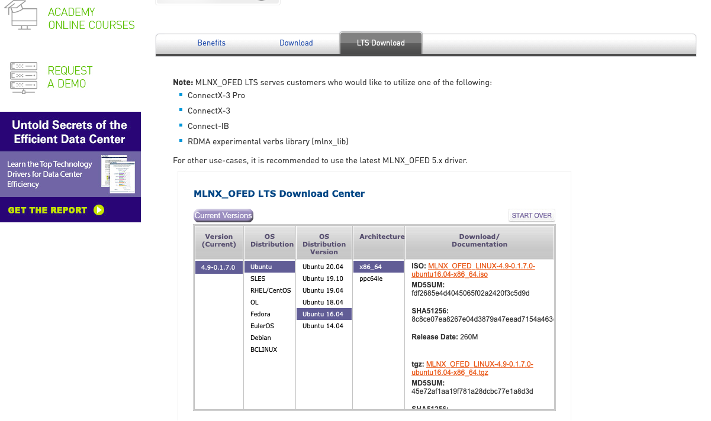
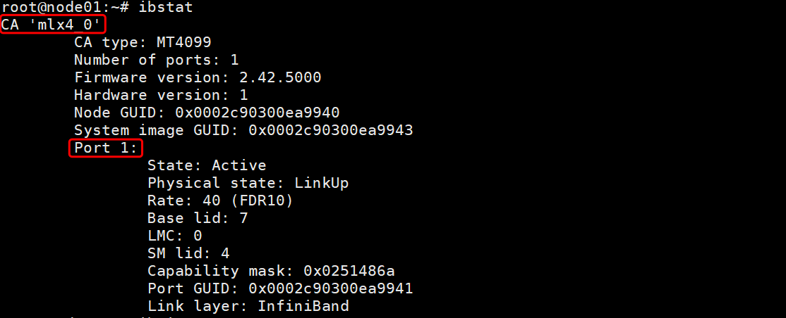
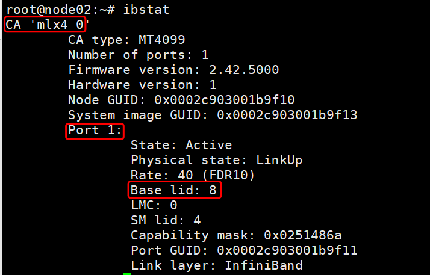

# IB安装

⌚️: 2020年8月9日

📚参考

---

## 1. 下载驱动

首先先确定主机上的IB卡型号。

```
# lspci | grep Mell
01:00.0 Infiniband controller: Mellanox Technologies MT27500 Family [ConnectX-3]

```

然后，去[官方](https://www.mellanox.com/products/infiniband-drivers/linux/mlnx_ofed)下载驱动。



## 2. 安装IB驱动

```
显示
root@node12:~# ls
data  MLNX_OFED_LINUX-5.0-2.1.8.0-ubuntu16.04-x86_64.tar  nccl-tests

解压
root@node12:~# tar xvf MLNX_OFED_LINUX-5.0-2.1.8.0-ubuntu16.04-x86_64.tar
root@node12:~# ls
data  MLNX_OFED_LINUX-5.0-2.1.8.0-ubuntu16.04-x86_64  nccl-tests

显示
root@node12:~# cd MLNX_OFED_LINUX-5.0-2.1.8.0-ubuntu16.04-x86_64/
root@node12:~/MLNX_OFED_LINUX-5.0-2.1.8.0-ubuntu16.04-x86_64# ls
common_installers.pl  create_mlnx_ofed_installers.pl  DEBS_UPSTREAM_LIBS  docs     mlnx_add_kernel_support.sh  RPM-GPG-KEY-Mellanox  uninstall.sh
common.pl             DEBS                            distro              LICENSE  mlnxofedinstall             src


安装
root@node12:~/MLNX_OFED_LINUX-5.0-2.1.8.0-ubuntu16.04-x86_64# ./mlnxofedinstall --all --force
Logs dir: /tmp/MLNX_OFED_LINUX.2501.logs
General log file: /tmp/MLNX_OFED_LINUX.2501.logs/general.log

Below is the list of MLNX_OFED_LINUX packages that you have chosen
(some may have been added by the installer due to package dependencies):

ofed-scripts
mlnx-ofed-kernel-utils
mlnx-ofed-kernel-dkms
rshim-dkms
iser-dkms
isert-dkms
srp-dkms
rdma-core
libibverbs1
ibverbs-utils
ibverbs-providers
libibverbs-dev
libibverbs1-dbg
libibumad3
libibumad-dev
ibacm
librdmacm1
rdmacm-utils
librdmacm-dev
mstflint
ibdump
libibmad5
libibmad-dev
libopensm
opensm
opensm-doc
libopensm-devel
libibnetdisc5
infiniband-diags
mft
kernel-mft-dkms
perftest
ibutils2
libibdm1
ibutils
cc-mgr
ar-mgr
dump-pr
ibsim
ibsim-doc
knem-dkms
knem
mxm
ucx
sharp
hcoll
openmpi
mpitests
libdapl2
dapl2-utils
libdapl-dev
srptools
mlnx-ethtool
mlnx-iproute2

This program will install the MLNX_OFED_LINUX package on your machine.
Note that all other Mellanox, OEM, OFED, RDMA or Distribution IB packages will be removed.
Those packages are removed due to conflicts with MLNX_OFED_LINUX, do not reinstall them.

Checking SW Requirements...
One or more required packages for installing MLNX_OFED_LINUX are missing.
Attempting to install the following missing packages:
swig libgfortran3 m4 automake autoconf tk graphviz flex autotools-dev debhelper tcl libltdl-dev gfortran libnl-route-3-200 bison dpatch libnl-route-3-dev quilt chrpath libnl-3-dev

Removing old packages...
Installing new packages
Installing ofed-scripts-5.0...
Installing mlnx-ofed-kernel-utils-5.0...
Installing mlnx-ofed-kernel-dkms-5.0...
Installing rshim-dkms-1.18...
Installing iser-dkms-5.0...
Installing isert-dkms-5.0...
Installing srp-dkms-5.0...
Installing rdma-core-50mlnx1...
Installing libibverbs1-50mlnx1...
Installing ibverbs-utils-50mlnx1...
Installing ibverbs-providers-50mlnx1...
Installing libibverbs-dev-50mlnx1...
Installing libibverbs1-dbg-50mlnx1...
Installing libibumad3-50mlnx1...
Installing libibumad-dev-50mlnx1...
Installing ibacm-50mlnx1...
Installing librdmacm1-50mlnx1...
Installing rdmacm-utils-50mlnx1...
Installing librdmacm-dev-50mlnx1...
Installing mstflint-4.13.0...
Installing ibdump-6.0.0...
Installing libibmad5-50mlnx1...
Installing libibmad-dev-50mlnx1...
Installing libopensm-5.6.0.MLNX20200217.cedc1e4...
Installing opensm-5.6.0.MLNX20200217.cedc1e4...
Installing opensm-doc-5.6.0.MLNX20200217.cedc1e4...
Installing libopensm-devel-5.6.0.MLNX20200217.cedc1e4...
Installing libibnetdisc5-50mlnx1...
Installing infiniband-diags-50mlnx1...
Installing mft-4.14.0...
Installing kernel-mft-dkms-4.14.0...
Installing perftest-4.4...
Installing ibutils2-2.1.1...
Installing libibdm1-1.5.7.1...
Installing ibutils-1.5.7.1...
Installing cc-mgr-1.0...
Installing ar-mgr-1.0...
Installing dump-pr-1.0...
Installing ibsim-0.9...
Installing ibsim-doc-0.9...
Installing knem-dkms-1.1.3.90mlnx1...
Installing knem-1.1.3.90mlnx1...
Installing mxm-3.7.3112...
Installing ucx-1.8.0...
Installing sharp-2.1.0.MLNX20200223.f63394a9c8...
Installing hcoll-4.5.3045...
Installing openmpi-4.0.3rc4...
Installing mpitests-3.2.20...
Installing libdapl2-2.1.10mlnx...
Installing dapl2-utils-2.1.10mlnx...
Installing libdapl-dev-2.1.10mlnx...
Installing srptools-50mlnx1...
Installing mlnx-ethtool-5.4...
Installing mlnx-iproute2-5.4.0...
Selecting previously unselected package mlnx-fw-updater.
(Reading database ... 112775 files and directories currently installed.)
Preparing to unpack .../mlnx-fw-updater_5.0-2.1.8.0_amd64.deb ...
Unpacking mlnx-fw-updater (5.0-2.1.8.0) ...
Setting up mlnx-fw-updater (5.0-2.1.8.0) ...

Added 'RUN_FW_UPDATER_ONBOOT=no to /etc/infiniband/openib.conf

Attempting to perform Firmware update...
Querying Mellanox devices firmware ...

Device #1:
----------

  Device Type:      ConnectX3
  Part Number:      MCX353A-FCB_A2-A5
  Description:      ConnectX-3 VPI adapter card; single-port QSFP; FDR IB (56Gb/s) and 40GigE; PCIe3.0 x8 8GT/s; RoHS R6
  PSID:             MT_1100120019
  PCI Device Name:  01:00.0
  Port1 GUID:       0002c903001b9f11
  Port2 MAC:        0002c91b9f11
  Versions:         Current        Available     
     FW             2.42.5000      2.42.5000     
     PXE            3.4.0752       3.4.0752      

  Status:           Up to date


Log File: /tmp/MLNX_OFED_LINUX.2501.logs/fw_update.log
Device (01:00.0):
	01:00.0 Infiniband controller: Mellanox Technologies MT27500 Family [ConnectX-3]
	Link Width: x8
	PCI Link Speed: 8GT/s

Installation passed successfully
To load the new driver, run:
/etc/init.d/openibd restart


```


#### ⚠️注意

One or more required packages for installing MLNX_OFED_LINUX are missing.
Attempting to install the following missing packages:
swig libgfortran3 m4 automake autoconf tk graphviz flex autotools-dev debhelper tcl libltdl-dev gfortran libnl-route-3-200 bison dpatch libnl-route-3-dev quilt chrpath libnl-3-dev
看到这个红色不用紧张，他是在卸载久的包，并下载安装所需的包，过程有点慢，需要点时间。

> 该程序将在您的计算机上安装 MLNX_OFED_LINUX 软件包。
> 请注意，将删除所有其他Mellanox，OEM，OFED，RDMA或Distribution IB软件包。
> 这些软件包由于与 MLNX_OFED_LINUX 冲突而被删除，请不要重新安装它们。

> 检查软件要求…
> 缺少用于安装MLNX_OFED_LINUX的一个或多个必需软件包。
> 尝试安装以下缺少的软件包：
>
> libltdl-dev swig libgfortran3 bison gfortran flex libnl-route-3-200 dpatch graphviz autoconf autotools-dev debhelper automake chrpath quilt m4

**安装完成会提示你：**

```shell
Installation passed successfully
To load the new driver, run:
/etc/init.d/openibd restart      # 系统自动提示你，到了重启服务的步骤了
```

## 3. 配置IP（Ubuntu16.04）

**查看网卡信息**

```
查看网卡名
root@node01:~/HorovodInstall/05ib/MLNX_OFED_LINUX-5.0-2.1.8.0-ubuntu16.04-x86_64# ip a
1: lo: <LOOPBACK,UP,LOWER_UP> mtu 65536 qdisc noqueue state UNKNOWN group default qlen 1
    link/loopback 00:00:00:00:00:00 brd 00:00:00:00:00:00
    inet 127.0.0.1/8 scope host lo
       valid_lft forever preferred_lft forever
    inet6 ::1/128 scope host 
       valid_lft forever preferred_lft forever
2: eno1: <BROADCAST,MULTICAST,UP,LOWER_UP> mtu 1500 qdisc mq state UP group default qlen 1000
    link/ether ac:1f:6b:fc:8d:02 brd ff:ff:ff:ff:ff:ff
    inet 192.168.50.11/24 brd 192.168.50.255 scope global eno1
       valid_lft forever preferred_lft forever
    inet6 fe80::ae1f:6bff:fefc:8d02/64 scope link 
       valid_lft forever preferred_lft forever
3: eno2: <BROADCAST,MULTICAST> mtu 1500 qdisc noop state DOWN group default qlen 1000
    link/ether ac:1f:6b:fc:8d:03 brd ff:ff:ff:ff:ff:ff
4: ens11f0: <BROADCAST,MULTICAST> mtu 1500 qdisc noop state DOWN group default qlen 1000
    link/ether 68:91:d0:62:a5:00 brd ff:ff:ff:ff:ff:ff
5: ens11f1: <BROADCAST,MULTICAST> mtu 1500 qdisc noop state DOWN group default qlen 1000
    link/ether 68:91:d0:62:a5:01 brd ff:ff:ff:ff:ff:ff
6: ib0: <BROADCAST,MULTICAST> mtu 4092 qdisc noop state DOWN group default qlen 256
    link/infiniband a0:00:02:20:fe:80:00:00:00:00:00:00:00:02:c9:03:00:ea:99:41 brd 00:ff:ff:ff:ff:12:40:1b:ff:ff:00:00:00:00:00:00:ff:ff:ff:ff
    

将ib卡up  
root@node01:~/HorovodInstall/05ib/MLNX_OFED_LINUX-5.0-2.1.8.0-ubuntu16.04-x86_64# ifconfig ib0 up
root@node01:~/HorovodInstall/05ib/MLNX_OFED_LINUX-5.0-2.1.8.0-ubuntu16.04-x86_64# ifconfig
eno1      Link encap:Ethernet  HWaddr ac:1f:6b:fc:8d:02  
          inet addr:192.168.50.11  Bcast:192.168.50.255  Mask:255.255.255.0
          inet6 addr: fe80::ae1f:6bff:fefc:8d02/64 Scope:Link
          UP BROADCAST RUNNING MULTICAST  MTU:1500  Metric:1
          RX packets:140403092 errors:0 dropped:10333 overruns:0 frame:0
          TX packets:125407262 errors:0 dropped:0 overruns:0 carrier:0
          collisions:0 txqueuelen:1000 
          RX bytes:184108093818 (184.1 GB)  TX bytes:176735757330 (176.7 GB)
          Memory:fbe20000-fbe3ffff 

ib0       Link encap:UNSPEC  HWaddr A0-00-02-20-FE-80-00-00-00-00-00-00-00-00-00-00  
          inet6 addr: fe80::202:c903:ea:9941/64 Scope:Link
          UP BROADCAST RUNNING MULTICAST  MTU:2044  Metric:1
          RX packets:0 errors:0 dropped:0 overruns:0 frame:0
          TX packets:6 errors:0 dropped:0 overruns:0 carrier:0
          collisions:0 txqueuelen:256 
          RX bytes:0 (0.0 B)  TX bytes:464 (464.0 B)

lo        Link encap:Local Loopback  
          inet addr:127.0.0.1  Mask:255.0.0.0
          inet6 addr: ::1/128 Scope:Host
          UP LOOPBACK RUNNING  MTU:65536  Metric:1
          RX packets:89109 errors:0 dropped:0 overruns:0 frame:0
          TX packets:89109 errors:0 dropped:0 overruns:0 carrier:0
          collisions:0 txqueuelen:1 
          RX bytes:5151456 (5.1 MB)  TX bytes:5151456 (5.1 MB)
```


**配置IP**

打开ubuntu的/etc/network/interfaces文件默认的内容如下：

```
# This file describes the network interfaces available on your system
# and how to activate them. For more information, see interfaces(5).

source /etc/network/interfaces.d/*

# The loopback network interface
# 动态获取的配置方法：
auto lo
iface lo inet loopback

# The primary network interface
# 静态分配的配置方法：
auto eno1
iface eno1 inet static
        address 192.168.50.11
        netmask 255.255.255.0
        network 192.168.50.0
        broadcast 192.168.50.255
        gateway 192.168.50.1
        # dns-* options are implemented by the resolvconf package, if installed
        dns-nameservers 114.114.114.114

改成以下内容

# This file describes the network interfaces available on your system
# and how to activate them. For more information, see interfaces(5).

source /etc/network/interfaces.d/*

# The loopback network interface
auto lo
iface lo inet loopback

# The primary network interface
auto eno1
iface eno1 inet static
        address 192.168.50.11
        netmask 255.255.255.0
        network 192.168.50.0
        broadcast 192.168.50.255
        gateway 192.168.50.1
        # dns-* options are implemented by the resolvconf package, if installed
        dns-nameservers 114.114.114.114

auto ib0
iface ib0 inet static
        address 192.168.33.11
        netmask 255.255.255.0
```

**重启网卡**

```
$systemctl restart networking.service
或者
/etc/init.d/networking restart(这条命令是重启网卡)
或者
$ifdown eth0
$ifup eth0（这两条命令是有针对性的重启某个网络接口，因为一个系统可能有多个网络接口）
```

查看网络配置的参数是不是正确（每进行一次操作都可以查看一下是不是修改了网络配置）

```
$ifconfig
```

看看是不是能够ping通

ping不通网关说明网络配置有问题 ping不通域名说明dns有问题

```
查看DNS：cat /etc/resolv.conf   
查看网关：ip route show    
启动网卡：
方式一：ifdown/ifup
# ifdown eth0
# ifup eth0
方式二：
ifconfig
# ifconfig eth0 down
# ifconfig eth0 up
```

## 3.启动服务

#### 重新加载驱动

```shell
root@node01:~# /etc/init.d/openibd restart
libkmod: ERROR ../libkmod/libkmod-config.c:635 kmod_config_parse: /etc/modprobe.d/blacklist.conf line 59: ignoring bad line starting with 'option'
Unloading HCA driver:                                      [  OK  ]
Loading HCA driver and Access Layer:                       [  OK  ]

root@node01:~#  /etc/init.d/opensmd restart
[ ok ] Restarting opensmd (via systemctl): opensmd.service.

```

------

#### 查看及配置 IB

```javascript
# 重启服务器之后，执行 ”ip a | grep ib“ 查看 ib网卡接口 的信息 ：
root@node01:~# ip a | grep ib
7: ib0: <BROADCAST,MULTICAST,UP,LOWER_UP> mtu 2044 qdisc mq state UP group default qlen 256
    link/infiniband a0:00:02:20:fe:80:00:00:00:00:00:00:00:02:c9:03:00:ea:99:41 brd 00:ff:ff:ff:ff:12:40:1b:ff:ff:00:00:00:00:00:00:ff:ff:ff:ff
    inet 192.168.33.11/24 brd 192.168.33.255 scope global ib0


# 使用 ibstat 查看信息：
root@node01:~# ibstat
CA 'mlx4_0'
	CA type: MT4099
	Number of ports: 1
	Firmware version: 2.42.5000
	Hardware version: 1
	Node GUID: 0x0002c90300ea9940
	System image GUID: 0x0002c90300ea9943
	Port 1:
		State: Active
		Physical state: LinkUp
		Rate: 40 (FDR10)
		Base lid: 7
		LMC: 0
		SM lid: 4
		Capability mask: 0x0251486a
		Port GUID: 0x0002c90300ea9941
		Link layer: InfiniBand
		
# 如果你前面的步骤都对，但是在这没有 ib口，服务也都重启了，
那你就执行“ lspci | grep -i mell ” 测试你的服务器有没有 ib卡，
如果没有信息，那就说明没有ib卡，安装ib驱动也没有任何用!
```

#### 当更改了配置的时候要记得重启服务：

```javascript
user@ubuntu:~$ /etc/init.d/openibd restart
user@ubuntu:~$ /etc/init.d/opensmd restart
```

## 4. IB测试

#### 查询IB设备

```
# ibv_devices # 显示系统中目前所有设备
root@node01:~# ibv_devices
    device          	   node GUID
    ------          	----------------
    mlx4_0          	0002c90300ea9940
    

# ibv_devinfo -d mlx4_0 #查看设备具体信息
root@node01:~# ibv_devinfo -d mlx4_0
hca_id:	mlx4_0
	transport:			InfiniBand (0)
	fw_ver:				2.42.5000
	node_guid:			0002:c903:00ea:9940
	sys_image_guid:			0002:c903:00ea:9943
	vendor_id:			0x02c9
	vendor_part_id:			4099
	hw_ver:				0x1
	board_id:			MT_1100120019
	phys_port_cnt:			1
		port:	1
			state:			PORT_ACTIVE (4)
			max_mtu:		4096 (5)
			active_mtu:		4096 (5)
			sm_lid:			4
			port_lid:		7
			port_lmc:		0x00
			link_layer:		InfiniBand

```

#### 连接性测试

使用简单的 ping 程序，比如 infiniband-diags 软件包中的 ibping 测试 RDMA 连接性。ibping（需要root权限） 程序采用客户端/服务器模式。必须首先在一台机器中启动 ibping 服务器，然后再另一台机器中将 ibping 作为客户端运行，并让它与 ibping 服务器相连。

**Server端**

```
ibping -S -C mlx4_0 -P 1      #无任何输出
```

> -S：以服务器端运行
> -C：是CA,来自ibstat的输出
> -P：端口号,来自ibstat的输出



输出内容：

```
root@node01:~# ibping -S -C mlx4_0 -P 1	#一直处于这个状态
```


**Client端**

```bash
ibping -c 10000 -f -C mlx4_0 -P 1 -L 2
```

> -c：发送10000个packet之后停止.
> -f：flood destination
> -C：是CA,来自ibstat的输出
> -P：端口号,来自服务器端运行ibping命令时指定的-P 参数值.
> -L：Base lid,来自服务器端运行ibping命令时指定的端口(-P 参数值)的base lid(参考ibstat)，具体要查看服务端的Base lid，我这里是7。




输出内容：

```
root@node02:~# ibping -c 10000 -f -C mlx4_0 -P 1 -L 7

--- node01.(none) (Lid 7) ibping statistics ---
10000 packets transmitted, 10000 received, 0% packet loss, time 1906 ms
rtt min/avg/max = 0.004/0.190/900.015 ms
```


#### 带宽测试

一、查看两台服务器的IB卡状态

```bash
ibstat #输出ib卡的信息
```

二、两台服务器重启IB服务

```bash
/etc/init.d/openibd restart #重启IB服务
```

三、两台服务器开启子网管理器

```bash
/etc/init.d/opensmd start #开启子网管理器
```

四、第一台执行

```bash
ib_write_bw
```

五、第二台执行

```bash
ib_write_bw 对端的IP地址 #我这里是ib_write_bw 192.168.33.11
```

下图是我的写带宽

```
root@node01:~# ib_write_bw
 Warning: ConnectX-3 and ConnectX-3 Pro don't support WR postsend API!
 Warning: Falling back to ibv_post_send() API

************************************
* Waiting for client to connect... *
************************************
---------------------------------------------------------------------------------------
                    RDMA_Write BW Test
 Dual-port       : OFF		Device         : mlx4_0
 Number of qps   : 1		Transport type : IB
 Connection type : RC		Using SRQ      : OFF
 PCIe relax order: ON
 CQ Moderation   : 1
 Mtu             : 2048[B]
 Link type       : IB
 Max inline data : 0[B]
 rdma_cm QPs	 : OFF
 Data ex. method : Ethernet
---------------------------------------------------------------------------------------
 local address: LID 0x07 QPN 0x0218 PSN 0x62349f RKey 0x010100 VAddr 0x007fd752d92000
 remote address: LID 0x08 QPN 0x0218 PSN 0x72df54 RKey 0x010100 VAddr 0x007f75883c2000
---------------------------------------------------------------------------------------
 #bytes     #iterations    BW peak[MB/sec]    BW average[MB/sec]   MsgRate[Mpps]
 65536      5000             4508.97            4508.79		   0.072141
---------------------------------------------------------------------------------------


root@node02:~# ib_write_bw 192.168.33.11
 Warning: ConnectX-3 and ConnectX-3 Pro don't support WR postsend API!
 Warning: Falling back to ibv_post_send() API
---------------------------------------------------------------------------------------
                    RDMA_Write BW Test
 Dual-port       : OFF		Device         : mlx4_0
 Number of qps   : 1		Transport type : IB
 Connection type : RC		Using SRQ      : OFF
 PCIe relax order: ON
 TX depth        : 128
 CQ Moderation   : 1
 Mtu             : 2048[B]
 Link type       : IB
 Max inline data : 0[B]
 rdma_cm QPs	 : OFF
 Data ex. method : Ethernet
---------------------------------------------------------------------------------------
 local address: LID 0x08 QPN 0x0218 PSN 0x72df54 RKey 0x010100 VAddr 0x007f75883c2000
 remote address: LID 0x07 QPN 0x0218 PSN 0x62349f RKey 0x010100 VAddr 0x007fd752d92000
---------------------------------------------------------------------------------------
 #bytes     #iterations    BW peak[MB/sec]    BW average[MB/sec]   MsgRate[Mpps]
Conflicting CPU frequency values detected: 1283.101000 != 1206.335000. CPU Frequency is not max.
 65536      5000             4508.97            4508.79		   0.072141
---------------------------------------------------------------------------------------

```


六、这里测试的写带宽，如果要测试读带宽把write改成read就可以了。

#### 测试网络延迟

延迟的测试和带宽的测试差不多，只不过在命令上有点不同只要把bw 改成lat 就行了。
一、第一台执行

```bash
ib_write_lat 
或者
ib_read_lat
```

二、第二台执行

```bash
ib_write_lat 对端IP地址 / ib_read_lat 对端IP地址。
```

日志

```
root@node01:~# ib_write_lat 
 Warning: ConnectX-3 and ConnectX-3 Pro don't support WR postsend API!
 Warning: Falling back to ibv_post_send() API

************************************
* Waiting for client to connect... *
************************************
---------------------------------------------------------------------------------------
                    RDMA_Write Latency Test
 Dual-port       : OFF		Device         : mlx4_0
 Number of qps   : 1		Transport type : IB
 Connection type : RC		Using SRQ      : OFF
 PCIe relax order: OFF
 Mtu             : 2048[B]
 Link type       : IB
 Max inline data : 220[B]
 rdma_cm QPs	 : OFF
 Data ex. method : Ethernet
---------------------------------------------------------------------------------------
 local address: LID 0x07 QPN 0x0219 PSN 0xbdca3b RKey 0x8010100 VAddr 0x0000000228c000
 remote address: LID 0x08 QPN 0x0219 PSN 0x309de3 RKey 0x8010100 VAddr 0x00000002035000
---------------------------------------------------------------------------------------
 #bytes #iterations    t_min[usec]    t_max[usec]  t_typical[usec]    t_avg[usec]    t_stdev[usec]   99% percentile[usec]   99.9% percentile[usec] 
Conflicting CPU frequency values detected: 1199.960000 != 1225.593000. CPU Frequency is not max.
Conflicting CPU frequency values detected: 1199.960000 != 3400.000000. CPU Frequency is not max.
 2       1000          0.96           1.25         0.98     	       0.98        	0.01   		1.00    		1.25   
---------------------------------------------------------------------------------------


root@node02:~# ib_write_lat 192.168.33.11
 Warning: ConnectX-3 and ConnectX-3 Pro don't support WR postsend API!
 Warning: Falling back to ibv_post_send() API
---------------------------------------------------------------------------------------
                    RDMA_Write Latency Test
 Dual-port       : OFF		Device         : mlx4_0
 Number of qps   : 1		Transport type : IB
 Connection type : RC		Using SRQ      : OFF
 PCIe relax order: OFF
 TX depth        : 1
 Mtu             : 2048[B]
 Link type       : IB
 Max inline data : 220[B]
 rdma_cm QPs	 : OFF
 Data ex. method : Ethernet
---------------------------------------------------------------------------------------
 local address: LID 0x08 QPN 0x0219 PSN 0x309de3 RKey 0x8010100 VAddr 0x00000002035000
 remote address: LID 0x07 QPN 0x0219 PSN 0xbdca3b RKey 0x8010100 VAddr 0x0000000228c000
---------------------------------------------------------------------------------------
 #bytes #iterations    t_min[usec]    t_max[usec]  t_typical[usec]    t_avg[usec]    t_stdev[usec]   99% percentile[usec]   99.9% percentile[usec] 
Conflicting CPU frequency values detected: 1570.507000 != 1278.585000. CPU Frequency is not max.
Conflicting CPU frequency values detected: 1685.390000 != 1228.382000. CPU Frequency is not max.
 2       1000          0.96           1.02         0.98     	       0.98        	0.01   		1.00    		1.02   
---------------------------------------------------------------------------------------
```


## 5. IB卸载

```
root@node12:~# cd MLNX_OFED_LINUX-5.0-2.1.8.0-ubuntu16.04-x86_64/
root@node12:~/MLNX_OFED_LINUX-5.0-2.1.8.0-ubuntu16.04-x86_64# ./uninstall.sh
```


## 参考

> https://blog.csdn.net/ljlfather/article/details/102833847
>
> https://blog.csdn.net/weixin_42819452/article/details/102588608?utm_medium=distribute.pc_relevant_t0.none-task-blog-BlogCommendFromMachineLearnPai2-1.add_param_isCf&depth_1-utm_source=distribute.pc_relevant_t0.none-task-blog-BlogCommendFromMachineLearnPai2-1.add_param_isCf