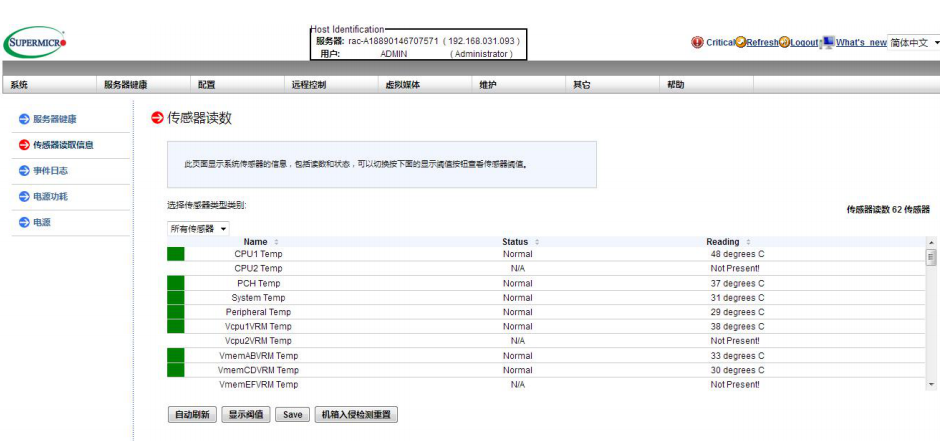
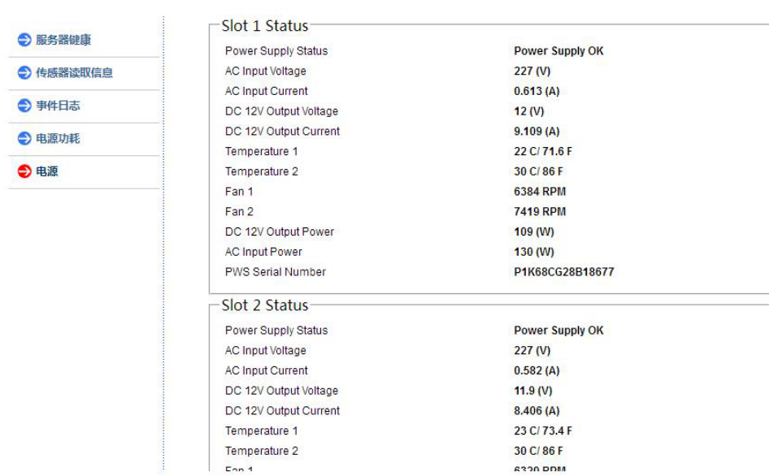

# IPMI 远程管理功能使用介绍

⌚️: 2020年8月9日

📚参考

----

IPMI 远程管理功能使用非常简单、方便，可以大幅降低人工维护和管理成本，本文详细介绍了如何登录 IPMI，如何使用 IPMI 检测机器运转情况，硬件级别的远程开关机，远程桌面，调整风扇转速。 

**本文以思腾 IW4200-8G 为例，详细介绍此功能，其他同类型产品通用。** 

图 1：

 

图 2： 

#### 一.使用步骤简述

A.插网线到 IPMI(RJ45)专用口或 LAN1 (RJ45)口（需 Failover 模式）。 IW4200-8G 如使用集成显卡做显示，开机之后显示器右下角会自动获 取到一个 IP 地址（前提是机器所在网络环境内有 DHCP 服务，如图 1），如果使用独立显卡做显示或者设备所在网络环境不支持 DHCP，就需 要到主板的 BIOS 里找到 IPMI 选项，手动设置一个可用的 IP。 

B.远程管理端的网口与服务器端的 IPMI 口的 IP 地址必须在同一网段；或者直接用网线将两者连接，并确保两端的 IP 是一个网段的即可。

C.打开 IE 浏览器直接输入 IPMI 端口的 IP 地址即可访问（用户名、密码默认是大写的 ADMIN）。 

#### 二.IPMI 三种通讯模式介绍

1.Failover 模式（出厂默认），支持 IPMI 的主板一般有三个 RJ45口，一般情况下两个紧挨着的 RJ45 口是普通网口，我们叫做 LAN1 和LAN2，还有一个独立的 RJ45 口，一般是在 USB 接口的上面，我们叫做专用管理网口（如图 2），在 Failover 模式下专用管理口和 LAN1都可以实现远程管理功能，当两个 RJ45 口其中一个出现问题，可以由另外一个接替工作。 

注：专用管理网口（Dedicated LAN）一般在主板 I/O 后窗 USB 接口上面的网口，共享管理网口（Shared LAN）是主板的第一块网口 LAN1。 

2.Dedicated LAN 模式（专用管理网口）,优点：不占数据通信带宽，在传输信息时速度快。缺点：成本高，多一条网线，交换机多占一个网口。 

3.Shared LAN 模式(主板集成的第一个网口)，优点：节约成本，可以与数据网络是一样的网路; 缺点：在管理时会影响数据通信性能。 

#### 三.详细配置 IPMI 过程： 

开机出现自检画面的时候反复按 Delete 进入主板的 BIOS 配置界面， 找到 IPMI 选项下的 BMC Network Configuration 

如果网络环境是 DHCP 的话进入 BMC Network Configuration 之后就可以看到服务器自动获取到的 IP 地址了

如果客户的网络环境特殊需要手动配置 IPMI 的 IP 地址，或者想用一条网线直连的方式来配置 IP 地址那就需要改成手动模式。 

把 Update IPMI LAN Configuration {NO} 改为｛Yes｝

把 Configuration Address source {DHCP} 改为｛Static｝ 

然后依次输入需要配置的 IP、网关以及掩码即可

IP 配置好之后按 F4 保存并重启，即可生效。 

现在打开远程端的浏览器，输入 IPMI 配置好的 IP 地址出现登录界面（前提一定要保证控制端能 ping 通服务器端），输入用户名和密码都是大写的 ADMIN。 

这样就登录 IPMI 的远程管理 WEB 界面了。

#### 四．IPMI 常用功能介绍 

IW4200-8G 的 IPMI 支持简体中文 

1.在系统菜单下可以看到所有网卡的 MAC 地址，BIOS 以及 BMC 的版本，机箱、电源、主板的型号以及 SN 号， CPU、内存的数量、规格、型号，另外在这个界面下可以实现硬件级别的开、关机，重启。 

2.在服务器健康菜单下的传感器读取信息子菜单里可以看到目前传感器是否检测到有报错，风扇转速、电压、温度、电源是否存在异常 （绿色方块代表正常，红色方块代表异常）。 

在服务器健康菜单下的事件日志子菜单里可以看到服务器有无硬件报错

在服务器健康菜单下的电源子菜单里可以看到目前设备的实时功耗。

3.在配置菜单里我们用的最多的功能是调整风扇转速，找到配置菜单下的风扇模式子菜单即可更改风扇运转模式。 

Full 是全速模式此时散热能力最高，噪音最大。 

Optimal 是最优模式此时散热能力一般，风扇转速会随机箱内部温度实时调节，所以噪音控制的比较好。

HeavyIO 是 GPU 优化模式散热能力和噪音介于 Full 模式和 Optimal模式之间。

4.远程控制功能菜单下用的最多的是远程桌面（需要控制机的 JAVA支持），进入重定向控制台子菜单，点击启用控制台，会提示下载一 个小文件，直接打开该文件即可弹出远程桌面窗口，这个远程桌面不同于 Windows 系统下的远程桌面， Windows 远程桌面是操作系统级别的软件，只有进入操作系统之后才能使用，IPMI 的远程桌面是硬件级别的，不依赖于操作系统，也就是说设备不用进入操作系统，只要设备通着电，IPMI 管理口通着网线，即可实现远程桌面，优势在于开机自检的一些画面都可是实时显示，比如要在 BIOS 或者阵列卡的 WEB BIOS 界面里配置一些参数，无需去机房即可实现远程配置，另外通过 IPMI 的远程桌面可以实现远程安装操作系统.