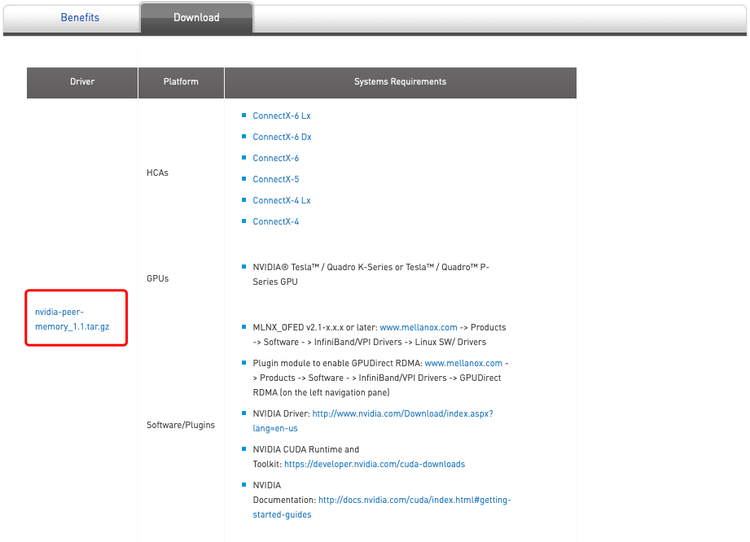

# 安装NV_Peer_Memory

⌚️: 2020年8月9日

📚参考

----

## 1. 下载安装包

https://www.mellanox.com/products/GPUDirect-RDMA

https://github.com/Mellanox/nv_peer_memory




## 2. 安装

```
1.1版本，我装起来有问题
root@node01:~# wget https://github.com/Mellanox/nv_peer_memory/archive/1.0-9.tar.gz


root@node01:~# ls
1.0-9.tar.gz  data  HorovodInstall  main.py  NVIDIA_CUDA-10.2_Samples


root@node01:~# tar zxvf 1.0-9.tar.gz 
root@node01:~# cd nv_peer_memory-1.0-9/
root@node01:~/nv_peer_memory-1.0-9# ls
build_module.sh   create_nv.symvers.sh  Makefile                 nv_peer_mem.c        README.md
build_release.sh  debian                nvidia_peer_memory.spec  nv_peer_mem.conf
compat_nv-p2p.h   dkms.conf             nv_peer_mem              nv_peer_mem.upstart


root@node01:~/nv_peer_memory-1.0-9# ./build_module.sh 

Building debian tarball for nvidia-peer-memory...

Built: /tmp/nvidia-peer-memory_1.0.orig.tar.gz

To install on DEB based OS:
    # cd /tmp
    # tar xzf /tmp/nvidia-peer-memory_1.0.orig.tar.gz
    # cd nvidia-peer-memory-1.0
    # dpkg-buildpackage -us -uc
    # dpkg -i <path to generated deb files>

root@node01:~/nv_peer_memory-1.0-9# cd /tmp/
root@node01:/tmp# tar xzf nvidia-peer-memory_1.0.orig.tar.gz 
root@node01:/tmp# cd nvidia-peer-memory-1.0/

root@node01:/tmp/nvidia-peer-memory-1.0# dpkg-buildpackage -us -uc
dpkg-buildpackage: source package nvidia-peer-memory
dpkg-buildpackage: source version 1.0-9
dpkg-buildpackage: source distribution unstable
dpkg-buildpackage: source changed by Feras Daoud <ferasda@mellanox.com>
dpkg-buildpackage: host architecture amd64
 dpkg-source --before-build nvidia-peer-memory-1.0
dpkg-source: info: applying dkms_name.patch
 debian/rules clean
dh clean --with dkms
   dh_testdir
   dh_clean
 dpkg-source -b nvidia-peer-memory-1.0
dpkg-source: info: using source format '3.0 (quilt)'
dpkg-source: info: building nvidia-peer-memory using existing ./nvidia-peer-memory_1.0.orig.tar.gz
dpkg-source: info: building nvidia-peer-memory in nvidia-peer-memory_1.0-9.debian.tar.xz
dpkg-source: info: building nvidia-peer-memory in nvidia-peer-memory_1.0-9.dsc
 debian/rules build
dh build --with dkms
   dh_testdir
   dh_update_autotools_config
 debian/rules binary
dh binary --with dkms
   dh_testroot
   dh_prep
   debian/rules override_dh_auto_install
make[1]: Entering directory '/tmp/nvidia-peer-memory-1.0'
# For dkms
dh_installdirs -pnvidia-peer-memory-dkms  usr/src/nvidia-peer-memory-1.0
cp -a Makefile             debian/nvidia-peer-memory-dkms/usr/src/nvidia-peer-memory-1.0
cp -a compat_nv-p2p.h             debian/nvidia-peer-memory-dkms/usr/src/nvidia-peer-memory-1.0
cp -a nv_peer_mem.c        debian/nvidia-peer-memory-dkms/usr/src/nvidia-peer-memory-1.0
cp -a create_nv.symvers.sh           debian/nvidia-peer-memory-dkms/usr/src/nvidia-peer-memory-1.0
cp -a dkms.conf            debian/nvidia-peer-memory-dkms/usr/src/nvidia-peer-memory-1.0
# utils
dh_installdirs -pnvidia-peer-memory  /etc/infiniband/
install -m 0644 nv_peer_mem.conf            debian/nvidia-peer-memory/etc/infiniband/nv_peer_mem.conf
dh_installdirs -pnvidia-peer-memory  /etc/init.d/
install -m 0755 nv_peer_mem                 debian/nvidia-peer-memory/etc/init.d/nv_peer_mem
# add info needed to load the module on boot
/tmp/nvidia-peer-memory-1.0/debian/updateInit.sh debian/nvidia-peer-memory/etc/init.d/nv_peer_mem
dh_installdirs -pnvidia-peer-memory  /etc/init/
install -m 0755 nv_peer_mem.upstart         debian/nvidia-peer-memory/etc/init/nv_peer_mem.conf
make[1]: Leaving directory '/tmp/nvidia-peer-memory-1.0'
   dh_installdocs
   dh_installchangelogs
   dh_dkms
   dh_perl
   dh_link
   dh_strip_nondeterminism
   dh_compress
   dh_fixperms
   dh_installdeb
   dh_gencontrol
   dh_md5sums
   dh_builddeb
dpkg-deb: building package 'nvidia-peer-memory' in '../nvidia-peer-memory_1.0-9_all.deb'.
dpkg-deb: building package 'nvidia-peer-memory-dkms' in '../nvidia-peer-memory-dkms_1.0-9_all.deb'.
 dpkg-genchanges  >../nvidia-peer-memory_1.0-9_amd64.changes
dpkg-genchanges: not including original source code in upload
 dpkg-source --after-build nvidia-peer-memory-1.0
dpkg-source: info: unapplying dkms_name.patch
dpkg-buildpackage: binary and diff upload (original source NOT included)


root@node01:/tmp/nvidia-peer-memory-1.0# dpkg -i ../nvidia-peer-memory_1.0-9_all.deb ../nvidia-peer-memory-dkms_1.0-9_all.deb
Selecting previously unselected package nvidia-peer-memory.
(Reading database ... 77471 files and directories currently installed.)
Preparing to unpack .../nvidia-peer-memory_1.0-9_all.deb ...
Unpacking nvidia-peer-memory (1.0-9) ...
Selecting previously unselected package nvidia-peer-memory-dkms.
Preparing to unpack .../nvidia-peer-memory-dkms_1.0-9_all.deb ...
Unpacking nvidia-peer-memory-dkms (1.0-9) ...
Setting up nvidia-peer-memory (1.0-9) ...
Setting up nvidia-peer-memory-dkms (1.0-9) ...
Loading new nvidia-peer-memory-1.0 DKMS files...
First Installation: checking all kernels...
Building only for 4.4.0-142-generic
Building initial module for 4.4.0-142-generic
Done.

nv_peer_mem:
Running module version sanity check.
 - Original module
   - No original module exists within this kernel
 - Installation
   - Installing to /lib/modules/4.4.0-142-generic/updates/dkms/

depmod....

DKMS: install completed.
libkmod: ERROR ../libkmod/libkmod-config.c:635 kmod_config_parse: /etc/modprobe.d/blacklist.conf line 59: ignoring bad line starting with 'option'
Processing triggers for ureadahead (0.100.0-19) ...
Processing triggers for systemd (229-4ubuntu21.16) ...
```


检测安装成功否

```
After successful installation:

nv_peer_mem.ko is installed
service file /etc/init.d/nv_peer_mem to be used for start/stop/status for that kernel module was added.
/etc/infiniband/nv_peer_mem.conf to control whether kernel module will be loaded on boot (default is YES) was added.
```


