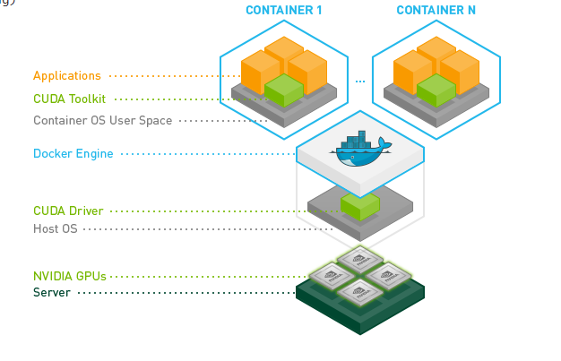

# 安装NVIDIA-Docker

⌚️: 2020年8月9日

📚参考

---



[参考步骤](https://github.com/NVIDIA/nvidia-docker)    

## 1、升级（如果安装nvidia-docker1.0）  
```
$docker volume ls -q -f driver=nvidia-docker | xargs -r -I{} -n1 docker ps -q -a -f volume={} | xargs -r docker rm -f

$sudo apt-get purge -y nvidia-docker
```
## 2、添加仓库
```
$curl -s -L https://nvidia.github.io/nvidia-docker/gpgkey | sudo apt-key add  -

$distribution=$(. /etc/os-release;echo $ID$VERSION_ID)

$curl -s -L https://nvidia.github.io/nvidia-docker/$distribution/nvidia-docker.list |sudo tee /etc/apt/sources.list.d/nvidia-docker.list

$sudo apt-get update
```
## 3、安装nvidia-docker2
```
$sudo apt-get install -y nvidia-docker2
$sudo pkill -SIGHUP dockerd
```
## 4、配置
### （1）、注册服务
```
$sudo mkdir -p /etc/systemd/system/docker.service.d
$cd /etc/systemd/system/docker.service.d
$sudo vim override.conf
```
写入以下内容：
```
[Service]
ExecStart=
ExecStart=/usr/bin/dockerd  --host=fd://  --add-runtime=nvidia=/usr/bin/nvidia-container-runtime --default-runtime=nvidia
```
```
$sudo systemctl daemon-reload
$sudo systemctl restart docker
```
### （2）、Daemon configuration file
```
sudo vim /etc/docker/daemon.json 
#追加写入以下内容：
{    
    "runtimes": 
    {        
    "nvidia": 
        {            
        "path": "/usr/bin/nvidia-container-runtime", "runtimeArgs": []        
        }    
    }
}
```
或者   
是将nvidia-docker设置为默认环境
```
{   
	"default-runtime": "nvidia", 
	"runtimes": {        
		"nvidia": {            
			"path": "/usr/bin/nvidia-container-runtime",            
			"runtimeArgs": []        
		}    
	}	
}
```
```
sudo pkill -SIGHUP dockerd
```
## 5、测试成功否
```
$docker run --runtime=nvidia --rm nvidia/cuda:9.0-base nvidia-smi
```
