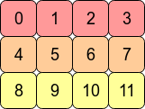

# contiguous

⌚️: 2020年8月9日

📚参考

----

性能：t**ranspose、permute 后使用` contiguous` 方法则会重新开辟一块内存空间保证数据是在逻辑顺序和内存中是一致的，连续内存布局减少了CPU对对内存的请求次数（访问内存比访问寄存器慢100倍[[5\]](https://zhuanlan.zhihu.com/p/64551412#ref_5)），相当于空间换时间**。

本文讲解了pytorch中contiguous的含义、定义、实现，以及contiguous存在的原因，非contiguous时的解决办法。并对比了numpy中的contiguous。

**contiguous** 本身是形容词**，**表示连续的**，**关于 **contiguous，**PyTorch 提供了**`is_contiguous`、`contiguous`**(形容词动用)两个方法 ，分别用于判定Tensor是否是 **contiguous** 的，以及保证Tensor是**contiguous**的。

## PyTorch中的is_contiguous是什么含义？

**`is_contiguous`**直观的解释是**Tensor底层一维数组元素的存储顺序与Tensor按行优先一维展开的元素顺序是否一致**。

Tensor多维数组底层实现是使用一块连续内存的1维数组（[行优先顺序存储](https://link.zhihu.com/?target=http%3A//vra.github.io/2019/03/18/numpy-array-contiguous/)，下文描述），Tensor在元信息里保存了多维数组的形状，在访问元素时，通过多维度索引转化成1维数组相对于数组起始位置的偏移量即可找到对应的数据。某些Tensor操作（[如transpose、permute、narrow、expand](https://link.zhihu.com/?target=https%3A//stackoverflow.com/questions/48915810/pytorch-contiguous)）与原Tensor是共享内存中的数据，不会改变底层数组的存储，但原来在语义上相邻、内存里也相邻的元素在执行这样的操作后，在语义上相邻，但在内存不相邻，即不连续了（*is not contiguous*）。

如果想要变得连续使用`contiguous`方法，如果Tensor不是连续的，则会重新开辟一块内存空间保证数据是在内存中是连续的，如果Tensor是连续的，则`contiguous`无操作。

### **行优先**

行是指多维数组一维展开的方式，对应的是列优先。C/C++中使用的是行优先方式（row major），Matlab、Fortran使用的是列优先方式（column major），PyTorch中Tensor底层实现是C，也是使用行优先顺序。举例说明如下：

```python3
>>> t = torch.arange(12).reshape(3,4)
>>> t
tensor([[ 0,  1,  2,  3],
        [ 4,  5,  6,  7],
        [ 8,  9, 10, 11]])
```

二维数组 t 如图1：



图1. 3X4矩阵行优先存储逻辑结构


数组 t 在内存中实际以一维数组形式存储，通过 **flatten** 方法查看 t 的一维展开形式，实际存储形式与一维展开一致，如图2，

```python3
>>> t.flatten()
tensor([ 0,  1,  2,  3,  4,  5,  6,  7,  8,  9, 10, 11])
```


图2. 3X4矩阵行优先存储物理结构


而列优先的存储逻辑结构如图3。


图3. 3X4矩阵列优先存储逻辑结构


使用列优先存储时，一维数组中元素顺序如图4：


图4. 3X4矩阵列优先存储物理结构


说明：图1、图2、图3、图4来自：[What is the difference between contiguous and non-contiguous arrays?](https://link.zhihu.com/?target=https%3A//stackoverflow.com/a/26999092)

图1、图2、图3、图4 中颜色相同的数据表示在同一行，不论是行优先顺序、或是列优先顺序，如果要访问矩阵中的下一个元素都是通过偏移来实现，这个偏移量称为**步长**(stride[[1\]](https://zhuanlan.zhihu.com/p/64551412#ref_1))。在行优先的存储方式下，访问行中相邻元素物理结构需要偏移1个位置，在列优先存储方式下偏移3个位置。

## 为什么需要 *contiguous* ？

**1. `torch.view`**等方法操作需要连续的Tensor。

transpose、permute 操作虽然没有修改底层一维数组，但是新建了一份Tensor元信息，并在新的元信息中的 重新指定 stride。**`torch.view`** 方法约定了不修改数组本身，只是使用新的形状查看数据。如果我们在 transpose、permute 操作后执行 view，Pytorch 会抛出以下错误：

```text
invalid argument 2: view size is not compatible with input tensor's size and stride (at least one dimension 
spans across two contiguous subspaces). Call .contiguous() before .view(). 
at /Users/soumith/b101_2/2019_02_08/wheel_build_dirs/wheel_3.6/pytorch/aten/src/TH/generic/THTensor.cpp:213
```

为什么 view 方法要求Tensor是连续的[[2\]](https://zhuanlan.zhihu.com/p/64551412#ref_2)？考虑以下操作，

```python3
>>>t = torch.arange(12).reshape(3,4)
>>>t
tensor([[ 0,  1,  2,  3],
        [ 4,  5,  6,  7],
        [ 8,  9, 10, 11]])
>>>t.stride()
(4, 1)
>>>t2 = t.transpose(0,1)
>>>t2
tensor([[ 0,  4,  8],
        [ 1,  5,  9],
        [ 2,  6, 10],
        [ 3,  7, 11]])
>>>t2.stride()
(1, 4)
>>>t.data_ptr() == t2.data_ptr() # 底层数据是同一个一维数组
True
>>>t.is_contiguous(),t2.is_contiguous() # t连续，t2不连续
(True, False)
```

t2 与 t 引用同一份底层数据 **`a`**，如下：

```text
[ 0,  1,  2,  3,  4,  5,  6,  7,  8,  9, 10, 11]
```

，两者仅是stride、shape不同。如果执行 t2.view(-1) ，期望返回以下数据 **`b`**（但实际会报错）：

```text
[ 0,  4,  8,  1,  5,  9,  2,  6, 10,  3,  7, 11]
```

在 **`a`** 的基础上使用一个新的 stride 无法直接得到 **`b`** ，需要先使用 t2 的 stride (1, 4) 转换到 t2 的结构，再基于 t2 的结构使用 stride (1,) 转换为形状为 (12,)的 **`b`** 。**但这不是view工作的方式**，**view 仅在底层数组上使用指定的形状进行变形**，即使 view 不报错，它返回的数据是：

```text
[ 0,  1,  2,  3,  4,  5,  6,  7,  8,  9, 10, 11]
```

这是不满足预期的。使用**`contiguous`**方法后返回新Tensor t3，重新开辟了一块内存，并使用照 t2 的按行优先一维展开的顺序存储底层数据。

```text
>>>t3 = t2.contiguous()
>>>t3
tensor([[ 0,  4,  8],
        [ 1,  5,  9],
        [ 2,  6, 10],
        [ 3,  7, 11]])
>>>t3.data_ptr() == t2.data_ptr() # 底层数据不是同一个一维数组
False
```

可以发现 t与t2 底层数据指针一致，t3 与 t2 底层数据指针不一致，说明确实重新开辟了内存空间。

### 为什么不在`view` 方法中默认调用`contiguous`方法?

因为历史上**`view`**方法已经约定了共享底层数据内存，返回的Tensor底层数据不会使用新的内存，如果在**`view`**中调用了**`contiguous`**方法，则可能在返回Tensor底层数据中使用了新的内存，这样打破了之前的约定，破坏了对之前的代码兼容性。为了解决用户使用便捷性问题，PyTorch在0.4版本以后提供了**`reshape`**方法，实现了类似于 **`tensor.contigous().view(\*args)`**的功能，如果不关心底层数据是否使用了新的内存，则使用**`reshape`**方法更方便。 [[3\]](https://zhuanlan.zhihu.com/p/64551412#ref_3)

**2.** 出于性能考虑

连续的Tensor，语义上相邻的元素，在内存中也是连续的，访问相邻元素是矩阵运算中经常用到的操作，语义和内存顺序的一致性是缓存友好的（[What is a “cache-friendly” code?](https://link.zhihu.com/?target=https%3A//stackoverflow.com/a/16699282)[[4\]](https://zhuanlan.zhihu.com/p/64551412#ref_4)），在内存中连续的数据可以（但不一定）被高速缓存预取，以提升CPU获取操作数据的速度。transpose、permute 后使用**` contiguous`** 方法则会重新开辟一块内存空间保证数据是在逻辑顺序和内存中是一致的，连续内存布局减少了CPU对对内存的请求次数（访问内存比访问寄存器慢100倍[[5\]](https://zhuanlan.zhihu.com/p/64551412#ref_5)），相当于空间换时间。

------

## PyTorch中张量是否连续的定义

对于任意的 *k* 维张量 *t* ,如果满足对于所有 *i*，第 *i* 维相邻元素间隔 = 第 *i*+1 维相邻元素间隔 与 第 *i*+1 维长度的乘积，则 *t* 是连续的。

![[公式]](https://www.zhihu.com/equation?tex=%5Cforall+i%3D0%2C+%5Cdots%2C+k-1+%28i%5Cnot%3Dk-1%29%2C+%5Cspace+stride%5Bi%5D%3Dstride%5Bi%2B1%5D%C3%97size%5Bi%2B1%5D) [[6\]](https://zhuanlan.zhihu.com/p/64551412#ref_6)

- 使用 ![[公式]](https://www.zhihu.com/equation?tex=stride%5Bi%5D) 表示第 *i* 维相邻元素之间间隔的位数，称为步长，可通过 [stride](https://link.zhihu.com/?target=https%3A//pytorch.org/docs/stable/tensors.html%23torch.Tensor.stride) 方法获得。
- 使用![[公式]](https://www.zhihu.com/equation?tex=size%5Bi%5D) 表示固定其他维度时，第 *i* 维元素数量。

## PyTorch中判读张量是否连续的实现

PyTorch中通过调用 **is_contiguous** 方法判断 tensor 是否连续，底层实现为 TH 库中[THTensor.isContiguous](https://link.zhihu.com/?target=https%3A//github.com/pytorch/pytorch/blob/a7f6b0ab4fa4e43a2fa7bcb53825277db88b55f0/torch/lib/TH/generic/THTensor.c%23L639-L654) 方法，为方便加上一些调试信息，翻译为 Python 代码如下：

```text
def isContiguous(tensor):
    """
    判断tensor是否连续    
    :param torch.Tensor tensor: 
    :return: bool
    """

    z = 1
    d = tensor.dim() - 1
    size = tensor.size()
    stride = tensor.stride()
    print("stride={} size={}".format(stride, size))
    while d >= 0:
        if size[d] != 1:
            if stride[d] == z:
                print("dim {} stride is {}, next stride should be {} x {}".format(d, stride[d], z, size[d]))
                z *= size[d]                
            else:
                print("dim {} is not contiguous. stride is {}, but expected {}".format(d, stride[d], z))
                return False
        d -= 1
    return True
```

判定上文中 t、t2 是否连续的输出如下：

```text
>>>isContiguous(t)
stride=(4, 1) size=torch.Size([3, 4])
dim 1 stride is 1, next stride should be 1 x 4
dim 0 stride is 4, next stride should be 4 x 3

True
>>>isContiguous(t2)
stride=(1, 4) size=torch.Size([4, 3])
dim 1 is not contiguous. stride is 4, but expected 1

False
```

从 **isContiguous** 实现可以看出，最后1维的 stride 必须为1（逻辑步长），这是合理的，最后1维即逻辑结构上最内层数组，其相邻元素间隔位数为1，按行优先顺序排列时，最内层数组相邻元素间隔应该为1。

## numpy中张量是否连续的定义

对于任意的 *N* 维张量 *t* ，如果满足第 *k* 维相邻元素间隔 = 第 *K*+1维 至 最后一维的长度的乘积，则 *t* 是连续的。

- 使用 ![[公式]](https://www.zhihu.com/equation?tex=s_%7Bk%7D%5E%7B%5Cmathrm%7Brow%7D%7D) 表示行优先模式下，第 ![[公式]](https://www.zhihu.com/equation?tex=k)维度相邻两个元素之间在内存中间隔的字节数，可通过 [strides](https://link.zhihu.com/?target=https%3A//docs.scipy.org/doc/numpy/reference/generated/numpy.ndarray.strides.html%23numpy.ndarray.strides) 属性获得。
- 使用 ![[公式]](https://www.zhihu.com/equation?tex=itemsize) 表示每个元素的字节数（根据数据类型而定，如PyTorch中 *int32* 类型是 4，*int64* 是8）。
- 使用 ![[公式]](https://www.zhihu.com/equation?tex=d_%7Bj%7D) 表示固定其他维度时，第 ![[公式]](https://www.zhihu.com/equation?tex=j) 维元素的个数，即 t.shape[j]。

![[公式]](https://www.zhihu.com/equation?tex=s_%7Bk%7D%5E%7B%5Cmathrm%7Brow%7D%7D%3D%5Ctext+%7B+itemsize+%7D+%5Cprod_%7Bj%3Dk%2B1%7D%5E%7BN-1%7D+d_%7Bj%7D) [[7\]](https://zhuanlan.zhihu.com/p/64551412#ref_7)

## PyTorch与numpy中contiguous定义的关系

PyTorch和numpy中对于contiguous的定义看起来有差异，本质上是一致的。

首先对于 stride的定义指的都是某维度下，相邻元素之间的间隔，PyTorch中的 stride 是间隔的位数（可看作逻辑步长），而numpy 中的 stride 是间隔的字节数（可看作物理步长），两种 stride 的换算关系为： ![[公式]](https://www.zhihu.com/equation?tex=stride_%7Bnumpy%7D+%3D+itemsize+%5Ccdot+stride_%7Bpytorch%7D+) 。

再看对于 stride 的计算公式，PyTorch 和 numpy 从不同角度给出了公式。PyTorch 给出的是一个递归式定义，描述了两个相邻维度 stride 与 size 之间的关系。numpy 给出的是直接定义，描述了 stride 与 shape 的关系。PyTorch中的 size 与 numpy 中的 shape 含义一致，都是指 tensor 的形状。 ![[公式]](https://www.zhihu.com/equation?tex=size%5Bi%2B1%5D) 、 ![[公式]](https://www.zhihu.com/equation?tex=shape%5Bj%5D) 都是指当固定其他维度时，该维度下元素的数量。