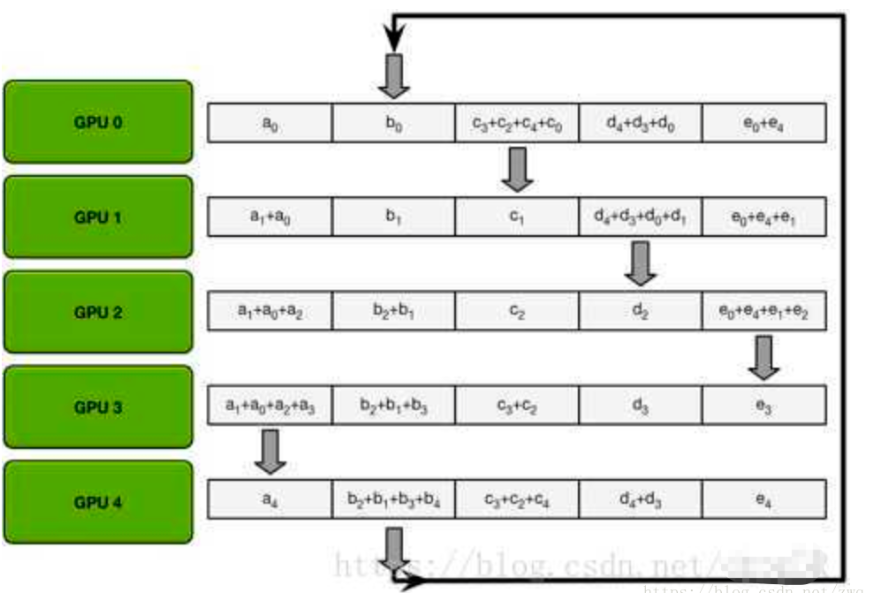

# GPU&CUDA多机通信

⌚️: 2020年8月9日

📚参考

---

## 一、硬件层次

**单机多卡**内存和GPU、GPU和GPU之间互联可通过PCIE、NVLink、NVSwitch；
**多机多卡**GPU之间（不同主机）、CPU与GPU之间互联可通过GPUDirect RDMA、IB/万兆以太网 + TCP/IP；

### 1. PCI总线

PCI是Peripheral Component Interconnect(外设部件互连标准)的缩写，它是目前个人电脑中使用最为广泛的接口，几乎所有的主板产品上都带有这种插槽。PCI插槽也是主板带有最多数量的插槽类型，在目前流行的台式机主板上，ATX结构的主板一般带有5～6个PCI插槽，而小一点的MATX主板也都带有2～3个PCI插槽，可见其应用的广泛性。

PCI-Express(peripheral component interconnect express)是一种高速串行计算机扩展总线标准，它原来的名称为“3GIO”，是由英特尔在2001年提出的，旨在替代旧的PCI，PCI-X和AGP总线标准。**PCIe属于高速串行点对点双通道高带宽传输**，所连接的设备分配独享通道带宽，不共享总线带宽，主要支持主动电源管理，错误报告，端对端的可靠性传输，热插拔以及服务质量(QOS)等功能。PCIe交由PCI-SIG（PCI特殊兴趣组织）认证发布后才改名为“PCI-Express”，简称“PCI-e”。它的主要优势就是数据传输速率高，目前最高的16X 2.0版本可达到10GB/s，而且还有相当大的发展潜力。PCI Express也有多种规格，从PCI Express x1到PCI Express x32，能满足将来一定时间内出现的低速设备和高速设备的需求。PCI-Express最新的接口是PCIe 3.0接口，其比特率为**8Gbps**，约为上一代产品带宽的两倍，并且包含发射器和接收器均衡、PLL改善以及时钟数据恢复等一系列重要的新功能，用以改善数据传输和数据保护性能。PCIe闪存卡的供应商包括：INTEL、IBM、LSI、OCZ、三星(计划中)、SanDisk、STEC、SuperTalent和东芝(计划中)等，而针对海量的数据增长使得用户对规模更大、可扩展性更强的系统所应用，PCIe 3.0技术的加入最新的LSI MegaRAID控制器及HBA产品的出色性能，就可以实现更大的系统设计灵活性。截止2019年1月份，当前主流主板均支持pcie 3.0。

**几个概念：**

传输速率为每秒传输量GT/s，而不是每秒位数Gbps，因为传输量包括不提供额外吞吐量的开销位； 比如 PCIe 1.x和PCIe 2.x使用8b / 10b编码方案，导致占用了20% （= 2/10）的原始信道带宽。

GT/s —— Giga transation per second （千兆传输/秒），即每一秒内传输的次数。重点在于描述物理层通信协议的速率属性，可以不和链路宽度等关联。

Gbps —— Giga Bits Per Second （千兆位/秒）。GT/s 与Gbps 之间不存在成比例的换算关系。

**PCIe 吞吐量（可用带宽）计算方法：**

**吞吐量 = 传输速率 \*  编码方案**

例如：PCI-e2.0 协议支持 5.0 GT/s，即每一条Lane 上支持每秒钟内传输 5G个Bit；但这并不意味着 PCIe 2.0协议的每一条Lane支持 5Gbps 的速率。

为什么这么说呢？因为PCIe 2.0 的物理层协议中使用的是 8b/10b 的编码方案。 即每传输8个Bit，需要发送10个Bit；这多出的2个Bit并不是对上层有意义的信息。

那么， PCIe 2.0协议的每一条Lane支持 5 * 8 / 10 = 4 Gbps = 500 MB/s 的速率。

以一个PCIe 2.0 x8的通道为例，x8的可用带宽为 4 * 8 = 32 Gbps = 4 GB/s。

同理，

PCI-e3.0 协议支持 8.0 GT/s, 即每一条Lane 上支持每秒钟内传输 8G个Bit。

而PCIe 3.0 的物理层协议中使用的是 128b/130b 的编码方案。 即每传输128个Bit，需要发送130个Bit。

那么， PCIe 3.0协议的每一条Lane支持 8 * 128 / 130 = 7.877 Gbps = 984.6 MB/s 的速率。

一个PCIe 3.0 x16的通道，x16 的可用带宽为 7.877 * 16 = 126.031 Gbps = 15.754 GB/s。

由此可计算出上表中的数据

### 2. [NVLink](https://baike.baidu.com/item/NVLink/22658185?fr=aladdin)

NVLink，是英伟达（NVIDIA）开发并推出的一种**总线及其通信协议**。NVLink采用点对点结构、串列传输，**用于中央处理器（CPU）与图形处理器（GPU）之间的连接，也可用于多个图形处理器之间的相互连接**。当前配备并使用NVLink的产品业已发布，多为针对高性能运算应用领域，像是英伟达目前最新的Tesla P100运算卡。

### 3. NVSwitch

在2018GTC上，老黄推出了全新的NVSwitch高速互联技术，通过NVSwitch高速互联技术能够让不同的GPU之间进行高速互联。
根据相关介绍，相比于之前NVSLink能够最多支持8块GPU进行高速互联的成绩，最新推出的NVSwitch技术能够最多支持16块GPU互联。
在使用NVSwitch进行互联的时候，不仅能够达到高速的效果，同时还能够保证每一个GPU和连接GPU之间都能够保持超低延迟的通讯。
此外，NVSwitch还能够支持最新的DGX-2技术，相比于之前的DGX-1技术，DGX-2提速能够达到10倍以上，速率大大提升。

### 4. [InfiniBand](https://baike.baidu.com/item/Infiniband)

InfiniBand（直译为“无限带宽”技术，缩写为IB）是**一个用于高性能计算的计算机网络通信标准**，它具有极高的吞吐量和极低的延迟，用于计算机与计算机之间的数据互连。InfiniBand也用作服务器与存储系统之间的直接或交换互连，以及存储系统之间的互连。
InfiniBand技术不是用于一般网络连接的，它的主要设计目的是针对服务器端的连接问题的。因此，InfiniBand技术将会被应用于服务器与服务器（比如复制，分布式工作等），服务器和存储设备（比如SAN和直接存储附件）以及服务器和网络之间（比如LAN， WANs和the Internet）的通信。

### 5. [PCIE—>NVLink—>NVSwitch](https://www.nvidia.com/zh-tw/data-center/nvlink/)

在2018年gtc会议上，老黄公开了dgx-2，这台售价高达399k美元，重达350磅的怪兽是专门为了加速ai负载而研制的，他被授予了“世界最大的gpu”称号。为什么它被赋予这个名字，它又是如何产生的，我们需要把时间倒退到几年之前。

#### 5.1 PCIE Switch

在nvidia推出目前这个方案之前，为了获得更多的强力计算节点，多个GPU通过PCIe Switch直接与CPU相连。

他们之间的pcie 3.0*16有接近32GB/s的双向带宽，但是当训练数据不停增长的时候，这个互联方案本身却成为了致命的系统瓶颈。如果不改进这个互联带宽，那么新时代GPU带来的额外性能就没法发挥出来，从而无法满足现实需求负载的增长。

使用   `nvidia-smi topo -m`   查看GPU拓扑结构。

#### 5.2 NVLink

为了解决这个问题，nvidia开发了一个全新的互联构架nvlink。单条nvlink是一种双工双路信道，其通过组合32条配线，从而在每个方向上可以产生8对不同的配对（2bi\*8pair\*2wire=32wire），第一版的实现被称为nvlink 1.0，与P100 GPU一同发布。一块P100上，集成了4条nvlink。每条link具备双路共40GB/s的带宽，整个芯片具备整整160GB/s的带宽。 

当然，nvlink不仅仅只是限定在GPU之间互联上。IBM将nvlink 1.0添加到他们基于Power8+微架构的Power处理器上，这一举措使得P100可以直接通过nvlink于CPU相连，而无需通过pcie。通过与最近的power8+ cpu相连，4GPU的节点可以配置成一种全连接的mesh结构。

#### 5.3 DGX-1

第一种nvidia专门为AI加速订制的机器叫做dgx1，它集成了八块p100与两块志强e5 2698v4,但是因为每块GPU只有4路nvlink，这些GPU构成了一种混合的cube-mesh网络拓扑结构，GPU被4块4块分为两组，然后在互相连接。

同时，因为GPU需要的pcie通道数量超过了芯片组所能提供的数量，所以每一对GPU将连接到一组pcie switch上与志强相连，然后两块志强再通过qpi总线连接。

6块P100，每块16GB HBM2显存，总计128GB显存和512GB DDR4-2133系统内存。

#### 5.4.nvlink 2.0

nvlink的第二个版本与gv100一同而来。IBM计划在Power9 cpu上给与支持。nvlink 2.0提升了信号的传输率，从20Gb/s到了25Gb/s，双信道总计50GB/s，pre nvlink。同时进一步提升了nvlink数到6路。这些举措让v100的总带宽从p100的160GB/s提升到了300GB/s。

顺便说下，除了带宽的增长，nvidia还添加了数个新的operational feature到协议本身。其中最有意思的一个特性是引入了coherency operation缓存一致性操作，它允许CPU在读取数据时缓存GPU显存信号，这将极大的降低访问延迟。

去年nvidia将原始dgx-1升级到v100架构。因为主要的cube-mesh拓扑结构并没有变化，所以多出来的link用来倍化一些GPU之间的互联。

#### 5.5 DGX-2

最近的GTC2018发布的dgx-2，其加倍了v100的数量，最终高达16块v100。同时hbm2升级到32GB/块，一共高达512GB，cpu升级为双路2.7G 24核 志强白金8168.

升级到16块GPU，对于系统而言也要做出巨大的改变，特别是更快更大的互联网络带宽。

#### 5.6 NVSwitch

那么dgx-2中装载的是什么呢，是一块新的asic - nvswitch。nvswitch是一块独立的nvlink芯片，其提供了高达18路nvlink的接口。这块芯片据说已经开发了两年之久。其支持nvlink 2.0，也就意味着每个接口均能提供双信道高达50GB/s的带宽，那么这块芯片总计能够提供900GB/s的带宽。这块芯片功率100w，基于台积电12nm FinFet FFN nvidia订制工艺，来源于增强的16nm节点，拥有2b个晶体管。

这块die封装在1940个pin大小为4cm2的BGA芯片中，其中576个针脚专门服务于18路的nvlink，剩下的阵脚则用于电源，或者其他I/O接口，比如用于管理端口的x4 pcie，I2c，GPIO等等。

通过nvswitch提供的18路接口，nvswitch能够让nvidia设计出完全无阻塞的全互联16路GPU系统。每块v100中的6路nvlink将分别连接到6块nvswitch上面。这样8块v100与6块nvsiwtch完全连接，构成一个基板。

dgx2拥有两块基板，这两块基板则是通过nvswitch剩余的另一侧接口完全互联在一起，这就构成了一个16路全连接的GPU构架.

两块基板之间的nvswitch之间都有八路link互联，16块GPU每块有6路nvlink的情况下，其总双路带宽达到2400GB/s。有趣的是，其实nvswitch有18路接口nvidia却只用到了其中16路。一种可能性是nv留下两路用于支持ibm的power9处理器（dgx1和2都是用的志强）。在这个复杂的结构中，power9处理器可能分别接在两块基板的nvsiwtch上，这样GPU也与Power9处于全连接状态。如果CPU直接与nvswitch相连，那么pcie就不再担任cpu与gpu相连的责任。目前nvidia还没有向其他厂商开放nvswitch，如果他们决定开放，将会产生一些新型态的，可能更加规模庞大的结算节点。

在原始的dgx-1中，执行GPU之间的事务处理需要一个额外的hop，这将导致远程访问的不一致性。在很多负载中，这会让利用统一寻址变得困难，产生了一些不确定性。在dgx2中，每一块gpu都可以于另外一块gpu以相同的速度和一致性延迟交流。大型的AI负载能够通过并行化的模型技术得到巨大的提升。回到GTC中，nvidia赋予的名称“世界最大的GPU”。在实践中，因为每块GPU和其他伙伴直接互联，统一寻址也变的简单有效。现在，可以合并512GiB高速带宽的显存，将他虚拟化成一块统一的内存。无论是GPU本身还是nvswitch都有相应的算法用于实现这一统一的内存系统。在程序层面，整台机器将会被当作一块GPU和一个整体的显存，这个显存子系统将会自行管理显存layout，提供最优化的组织架构。

### 6. 浅析GPU通信技术GPUDirect

#### **6.1 背景**

GPU在高性能计算和深度学习加速中扮演着非常重要的角色， GPU的强大的并行计算能力，大大提升了运算性能。随着运算数据量的不断攀升，GPU间需要大量的交换数据，GPU通信性能成为了非常重要的指标。

NVIDIA推出的GPUDirect就是一组提升GPU通信性能的技术。但GPUDirect受限于PCI Expresss总线协议以及拓扑结构的一些限制，无法做到更高的带宽，为了解决这个问题，NVIDIA提出了NVLink总线协议。

这个系列文章会对以上GPU通信技术做详细的介绍，旨在帮助开发者更好的利用这些技术对自己的应用做相应的优化。

本篇文章会先介绍一下GPUDirect技术，并着重介绍GPUDirect Peer-to-Peer(P2P)技术。

**GPUDirect介绍**

#### 6.2 简介

GPUDirect技术有如下几个关键特性：

- 加速与网络和存储设备的通信：
- GPU之间的Peer-to-Peer Transers
- GPU之间的Peer-to-Peer memory access
- RDMA支持
- 针对Video的优化

下面对最主要的几个技术做分别介绍。

#### 6.3 Shared Memory

2010年6月最先引入的是GPUDirect Shared Memory 技术，支持GPU与第三方PCI Express设备通过共享的pin住的host memory实现共享内存访问从而加速通信。

#### 6.4 P2P

2011年，GPUDirect增加了相同PCI Express root complex 下的GPU之间的Peer to Peer(P2P) Direct Access和Direct Transers的支持。

#### 6.5 RDMA

2013年，GPUDirect增加了RDMA支持，使得第三方PCI Express设备可以bypass CPU host memory直接访问GPU。

### 7. GPUDirect P2P

#### 7.1 P2P简介

GPUDirect Peer-to-Peer(P2P) 技术主要用于单机GPU间的高速通信，它使得GPU可以通过PCI Express直接访问目标GPU的显存，避免了通过拷贝到CPU host memory作为中转，大大降低了数据交换的延迟。

以深度学习应用为例，主流的开源深度学习框架如TensorFlow、MXNet都提供了对GPUDirect P2P的支持，NVIDIA开发的NCCL(NVIDIA Collective Communications Library)也提供了针对GPUDirect P2P的特别优化。

通过使用GPUDirect P2P技术可以大大提升深度学习应用单机多卡的扩展性，使得深度学习框架可以获得接近线性的训练性能加速比。

#### 7.2 P2P虚拟化

随着云计算的普及，越来越多技术迁移到云上，在云上使用GPUDirect技术，就要解决GPUDirect虚拟化的问题。

这里我们着重讨论下GPUDirect Peer-to-Peer虚拟化的问题

使用PCI Pass-through虚拟化技术可以将GPU设备的控制权完全授权给VM，使得虚拟机里的GPU driver可以直接控制GPU而不需要Hypervisor参与，性能可以接近物理机。

但是同一个虚拟机内的应用却无法使用P2P技术与其它GPU实现通信。下面分析一下无法使用P2P的原因。

首先我们需要知道一个技术限制，就是不在同一个Intel IOH(IO Hub)芯片组下面PCI-e P2P通信是不支持的，因为Intel CPU之间是QPI协议通信，PCI-e P2P通信是无法跨QPI协议的。所以GPU driver必须要知道GPU的PCI拓信息，同一个IOH芯片组下面的GPU才能使能GPUDiret P2P。

但是在虚拟化环境下，Hypervisor虚拟的PCI Express拓扑结构是扁平的，GPU driver无法判断真实的硬件拓扑所以无法开启GPUDirect P2P。

为了让GPU driver获取到真实的GPU拓扑结构，需要在Hypervisor模拟的GPU PCI配置空间里增加一个PCI Capability，用于标记GPU的P2P亲和性。这样GPU driver就可以根据这个信息来使能P2P。

另外值得一提的是，在PCI Pass-through时，所有的PCI Express通信都会被路由到IOMMU，P2P通信同样也需要路由到IOMMU，所以Pass-through下的P2P路径还是会比物理机P2P长一点，延迟大一点。

#### 7.3 实测

下面是我们在阿里云GN5实例(8卡Tesla P100)上对GPUDirect P2P延迟做的实测数据。

GPU P2P矩阵如下：
`nvidia-smi topo -p2p n`
或者用CUDASample里面的事例。

**使用CUDA Sample中的案例来测试**

通信延迟对比如下：

我们看到：使能GPUDirect P2P后GPU间通信延迟相比CPU拷贝降低近一半。

下图是在GN5实例上使用MXNet对经典卷积神经网络的图像分类任务的训练性能的加速比：

MXNet在支持P2P的GN5实例上有非常好的单机扩展性，训练性能接近线性加速。

### 8.浅析GPU通信技术：NVLink总线技术

#### 8.1 背景

上一篇文章“浅析GPU通信技术：GPUDirect P2P”中我们提到通过GPUDirect P2P技术可以大大提升GPU服务器单机的GPU通信性能，但是受限于PCI Expresss总线协议以及拓扑结构的一些限制，无法做到更高的带宽，为了解决这个问题，NVIDIA提出了NVLink总线协议。

本篇文章我们就来谈谈NVIDIA提出的NVLink总线协议，看看它到底是何方神圣。

#### 8.2. NVlink介绍

#####  发布

NVLink技术是在2014年3月的NVIDIA GTC 2014上发布的。对普通消费者来说，这一届的GTC似乎没有太多的亮点，也没有什么革命性的产品发布。这次GTC上，黄仁勋展示了新一代单卡双芯卡皇GeForce Titan Z，下一代GPU架构Pascal也只是初露峥嵘。在黄仁勋演讲中只用大约五六页PPT介绍的NVLink也很容易被普通消费者忽视，但是有心的专业人士确从此举看到了NVIDIA背后巨大的野心。

首先我们简单看下NVIDIA对NVLink的介绍：NVLink能在多GPU之间和GPU与CPU之间实现非凡的连接带宽。带宽有多大？2016发布的P100是搭载NVLink的第一款产品，单个GPU具有160GB/s的带宽，相当于PCIe Gen3 * 16带宽的5倍。去年GTC 2017上发布的V100搭载的NVLink 2.0更是将GPU带宽提升到了300G/s，差不多是PCIe的10倍了。

好了，这下明白了为什么NVIDIA的NVLink会如此的引人注意了。但是NVLink背后的布局远不只是如此。

##### 解读

我们来看看NVLink出现之前的现状：

**1)PCIe：**

PCIe Gen3每个通道（每个Lane）的双向带宽是2B/s，GPU一般是16个Lane的PCIe连接，所以PCIe连接的GPU通信双向带宽可以达到32GB/s，要知道PCIe总线堪称PC系统中第二快的设备间总线（排名第一的是内存总线）。但是在NVLink 300GB/s的带宽面前，只有被碾压的份儿。

**2)显存带宽：**

上一代卡皇Geforce Titan XP的GDDR5X显存带宽已经达到547.7 GB/s，搭载HBM2显存的V100的带宽甚至达到了900GB/s。显卡核心和显存之间的数据交换通道已经达到如此高的带宽，但是GPU之间以及GPU和CPU之间的数据交换确受到PCIe总线的影响，成为了瓶颈。这当然不是NVIDIA希望看到的，而NVLink的出现，则是NVIDIA想打破这个瓶颈的宣言。

**3）CPU连接：**

实际上，NVLink不但可以实现GPU之间以及GPU和CPU之间的互联，还可以实现CPU之间的互联。从这一点来看，NVLink的野心着实不小。

我们知道，Intel的CPU间互联总线是QPI，20位宽的QPI连接带宽也只有25.6GB/s，在NVLink面前同样差距巨大。可想而知，如果全部采用NVLink总线互联，会对系统数据交换通道的带宽有多大提升。

当然，NVIDIA自己并没有CPU，X86仍然是当今CPU的主流架构，被Intel把持方向和趋势，NVLink绝没有可能进入X86 CPU连接总线的阵营。于是便有了NVIDIA和IBM组成的OpenPower联盟。

NVIDIA是受制于没有CPU，而IBM则恰好相反，IBM有自己的CPU，Power 处理器的性能惊艳，但IBM缺少相应的并行计算芯片，因此仅仅依靠自己的CPU，很难在目前的异构计算中发挥出优秀的性能、规模和性能功耗比优势。从这一点来看，IBM和NVIDIA互补性就非常强了，这也是IBM为什么要和NVIDIA组建OpenPower超级计算联盟的原因了。

考虑到目前POWER生态的逐渐萎缩，要想在人工智能浪潮下趁机抢占X86的市场并不是件容易的事情，但至少给了NVIDIA全面抗衡Intel的平台。

所以有点扯远了，NVLink目前更主要的还是大大提升了GPU间通信的带宽。

##### 结构和拓扑

**NVLink信号与协议**

NVLink控制器由3层组成，即物理层（PHY）、数据链路层（DL）以及交易层（TL）。下图展示了P100 NVLink 1.0的各层和链路：

P100搭载的NVLink 1.0，每个P100有4个NVLink通道，每个拥有40GB/s的双向带宽，每个P100可以最大达到160GB/s带宽。

V100搭载的NVLink 2.0，每个V100增加了50%的NVLink通道达到6个，信号速度提升28%使得每个通道达到50G的双向带宽，因而每个V100可以最大达到300GB/s的带宽。

**拓扑**

下图是HGX-1/DGX-1使用的8个V100的混合立方网格拓扑结构，我们看到虽然V100有6个NVlink通道，但是实际上因为无法做到全连接，2个GPU间最多只能有2个NVLink通道100G/s的双向带宽。而GPU与CPU间通信仍然使用PCIe总线。CPU间通信使用QPI总线。这个拓扑虽然有一定局限性，但依然大幅提升了同一CPU Node和跨CPU Node的GPU间通信带宽。

**NVSwitch**

为了解决混合立方网格拓扑结构的问题，NVIDIA在今年GTC 2018上发布了NVSwitch。

类似于PCIe使用PCIe Switch用于拓扑的扩展，NVIDIA使用NVSwitch实现了NVLink的全连接。NVSwitch作为首款节点交换架构，可支持单个服务器节点中 16 个全互联的 GPU，并可使全部 8 个 GPU 对分别以 300 GB/s 的惊人速度进行同时通信。这 16 个全互联的 GPU （32G显存V100）还可作为单个大型加速器，拥有 0.5 TB 统一显存空间和 2 PetaFLOPS 计算性能。

关于NVSwitch的相关技术细节可以参考NVIDIA官方技术文档。应该说这一技术的引入，使得GPU间通信的带宽又大大上了一个台阶。

#### 8.3 性能

NVIDIA NVLink 将采用相同配置的服务器性能提高 31%。

使用NVSwitch的DGX-2则能够达到2倍以上的深度学习和高性能计算的加速。

### 9.浅析GPU通信技术：GPUDirect RDMA

#### 9.1 背景

前两篇文章我们介绍的GPUDirect P2P和NVLink技术可以大大提升GPU服务器单机的GPU通信性能，当前深度学习模型越来越复杂，计算数据量暴增，对于大规模深度学习训练任务，单机已经无法满足计算要求，多机多卡的分布式训练成为了必要的需求，这个时候多机间的通信成为了分布式训练性能的重要指标。

本篇文章我们就来谈谈GPUDirect RDMA技术，这是用于加速多机间GPU通信的技术。

#### 9.2 RDMA介绍

我们先来看看RDMA技术是什么？RDMA即Remote DMA，是Remote Direct Memory Access的英文缩写。

##### DMA原理

在介绍RDMA之前，我们先来复习下DMA技术。

我们知道DMA（直接内存访问）技术是Offload CPU负载的一项重要技术。DMA的引入，使得原来设备内存与系统内存的数据交换必须要CPU参与，变为交给DMA控制来进行数据传输。

直接内存访问(DMA)方式，是一种完全由硬件执行I/O交换的工作方式。在这种方式中， DMA控制器从CPU完全接管对总线的控制，数据交换不经过CPU，而直接在内存和IO设备之间进行。DMA工作时，由DMA 控制器向内存发出地址和控制信号，进行地址修改，对传送字的个数计数，并且以中断方式向CPU 报告传送操作的结束。

使用DMA方式的目的是减少大批量数据传输时CPU 的开销。采用专用DMA控制器(DMAC) 生成访存地址并控制访存过程。优点有操作均由硬件电路实现，传输速度快；CPU 基本不干预，仅在初始化和结束时参与，CPU与外设并行工作，效率高。

##### RMDA原理

RDMA则是在计算机之间网络数据传输时Offload CPU负载的高吞吐、低延时通信技术。

如上图所示，传统的TCP/IP协议，应用程序需要要经过多层复杂的协议栈解析，才能获取到网卡中的数据包，而使用RDMA协议，应用程序可以直接旁路内核获取到网卡中的数据包。

RDMA可以简单理解为利用相关的硬件和网络技术，服务器1的网卡可以直接读写服务器2的内存，最终达到高带宽、低延迟和低资源利用率的效果。如下图所示，应用程序不需要参与数据传输过程，只需要指定内存读写地址，开启传输并等待传输完成即可。

在实现上，RDMA实际上是一种智能网卡与软件架构充分优化的远端内存直接高速访问技术，通过在网卡上将RDMA协议固化于硬件，以及支持零复制网络技术和内核内存旁路技术这两种途径来达到其高性能的远程直接数据存取的目标。

（1）零复制：零复制网络技术使网卡可以直接与应用内存相互传输数据，从而消除了在应用内存与内核之间复制数据的需要。因此，传输延迟会显著减小。

（2）内核旁路：内核协议栈旁路技术使应用程序无需执行内核内存调用就可向网卡发送命令。在不需要任何内核内存参与的条件下，RDMA请求从用户空间发送到本地网卡并通过网络发送给远程网卡，这就减少了在处理网络传输流时内核内存空间与用户空间之间环境切换的次数。

在具体的远程内存读写中，RDMA操作用于读写操作的远程虚拟内存地址包含在RDMA消息中传送，远程应用程序要做的只是在其本地网卡中注册相应的内存缓冲区。远程节点的CPU除在连接建立、注册调用等之外，在整个RDMA数据传输过程中并不提供服务，因此没有带来任何负载。

#### 9.3 RDMA实现

如下图RMDA软件栈所示，目前RDMA的实现方式主要分为InfiniBand和Ethernet两种传输网络。而在以太网上，又可以根据与以太网融合的协议栈的差异分为iWARP和RoCE（包括RoCEv1和RoCEv2）。

其中，InfiniBand是最早实现RDMA的网络协议，被广泛应用到高性能计算中。但是InfiniBand和传统TCP/IP网络的差别非常大，需要专用的硬件设备，承担昂贵的价格。相比之下RoCE和iWARP的硬件成本则要低的多。

#### 9.4 GPUDirect RDMA介绍

##### **原理**

有了前文RDMA的介绍，从下图我们可以很容易明白，所谓GPUDirect RDMA，就是计算机1的GPU可以直接访问计算机2的GPU内存。而在没有这项技术之前，GPU需要先将数据从GPU内存搬移到系统内存，然后再利用RDMA传输到计算机2，计算机2的GPU还要做一次数据从系统内存到GPU内存的搬移动作。GPUDirect RDMA技术使得进一步减少了GPU通信的数据复制次数，通信延迟进一步降低。

#####  使用

需要注意的是，要想使用GPUDirect RDMA，需要保证GPU卡和RDMA网卡在同一个ROOT COMPLEX下，如下图所示：

##### 性能

Mellanox网卡已经提供了GPUDirect RDMA的支持（既支持InfiniBand传输，也支持RoCE传输）。

下图分别是使用OSU micro-benchmarks在Mellanox的InfiniBand网卡上测试的延时和带宽数据，可以看到使用GPUDirect RDMA技术后延时大大降低，带宽则大幅提升：

下图是一个实际的高性能计算应用的性能数据（使用HOOMD做粒子动态仿真），可以看到随着节点增多，使用GPUDirect RDMA技术的集群的性能有明显提升，最多可以提升至2倍：

## 二、软件（库）层次

**单机多卡**：NCCL；Gloo；
**多机多卡：**NCCL2.x；MPI；TCP/IP；Gloo；

> **MPI、Gloo、NCCL**
>
> 使用PyTorch附带的后端为例来讲解三种方式
>
> 目前PyTorch分发版仅支持Linux。默认情况下，Gloo和NCCL后端构建并包含在PyTorch的分布之中（仅在使用CUDA构建时为NCCL）。MPI是一个可选的后端，只有从源代码构建PyTorch时才能包含它。（例如，在安装了MPI的主机上构建PyTorch）
>
> **哪个后端使用？**
>
> 在过去，我们经常被问到：“我应该使用哪个后端？”。
>
> **经验法则**
>
> - 使用NCCL后端进行分布式 GPU 训练。
> - 使用Gloo后端进行分布式 CPU 训练。
>
> **具有InfiniBand互连的GPU主机**
>
> - 使用NCCL，因为它是目前唯一支持InfiniBand和GPUDirect的后端。
>
> **GPU主机与以太网互连**
>
> - 使用NCCL，因为它目前提供最佳的分布式GPU训练性能，特别是对于多进程单节点或多节点分布式训练。如果您遇到NCCL的任何问题，请使用Gloo作为后备选项。（请注意，Gloo目前运行速度比GPU的NCCL慢。）
>
> **具有InfiniBand互连的CPU主机**
>
> - 如果您的InfiniBand在IB上已启用IP，请使用Gloo，否则请使用MPI。我们计划在即将发布的版本中为Gloo添加InfiniBand支持。
>
> **具有以太网互连的CPU主机**
>
> - 除非您有特殊原因要使用MPI，否则请使用Gloo。

### 1. NCCL

[官网](https://developer.nvidia.com/nccl) || [安装手册](https://docs.nvidia.com/deeplearning/sdk/nccl-install-guide/index.html)||[ GitHub](https://github.com/NVIDIA/nccl)

#### 1.1 概述

NCCL是Nvidia Collective multi-GPU Communication Library的简称，它是一个实现多GPU的collective communication通信（all-gather, reduce, broadcast）库，Nvidia做了很多优化，以在PCIe、Nvlink、InfiniBand上实现较高的通信速度。

深度学习框架的开发人员可以依赖NCCL高度优化的MPI兼容和拓扑感知例程，以充分利用多个节点内和跨多个节点的所有可用GPU。领先的深度学习框架，如来自Caffe，Caffe2，Chainer，MxNet，TensorFlow和PyTorch 集成了NCCL加速在多GPU系统的深度学习培训。

下面分别从以下几个方面来介绍NCCL的特点，包括基本的communication primitive、ring-base collectives、NCCL在单机多卡上以及多机多卡实现、最后分享实际使用NCCL的一些经验。

#### 1.2 .communication primitive

并行任务的通信一般可以分为Point-to-point communication和Collective communication。P2P通信这种模式只有一个sender和一个receiver，实现起来比较简单。第二种Collective communication包含多个sender多个receiver，一般的通信原语包括broadcast，gather,all-gather,scatter,reduce,all-reduce,reduce-scatter,all-to-all等。简单介绍几个常用的操作：

- Reduce
  从多个sender那里接收数据，最终combine到一个节点上。
  
- All-reduce
  从多个sender那里接收数据，最终combine到每一个节点上。
  

而传统Collective communication假设通信节点组成的topology是一颗fat tree，如下图所示，这样通信效率最高。但实际的通信topology可能比较复杂，并不是一个fat tree。因此一般用ring-based Collective communication。

#### 1.3 ring-base collectives

ring-base collectives将所有的通信节点通过首尾连接形成一个单向环，数据在环上依次传输。以broadcast为例， 假设有4个GPU，GPU0为sender将信息发送给剩下的GPU，按照环的方式依次传输，GPU0-->GPU1-->GPU2-->GPU3，若数据量为N，带宽为B，整个传输时间为（K-1）N/B。时间随着节点数线性增长，不是很高效。

下面把要传输的数据分成S份，每次只传N/S的数据量，传输过程如下所示：

GPU1接收到GPU0的一份数据后，也接着传到环的下个节点，这样以此类推，最后花的时间为S*(N/S/B) + (k-2)*(N/S/B) = N(S+K-2)/(SB) --> N/B，条件是S远大于K，即数据的份数大于节点数，这个很容易满足。所以通信时间不随节点数的增加而增加，只和数据总量以及带宽有关。其它通信操作比如reduce、gather以此类推。那么在以GPU为通信节点的场景下，怎么构建通信环呢？如下图所示：
单机4卡通过同一个PCIe switch挂载在一棵CPU的场景：

单机8卡通过两个CPU下不同的PCIe switch挂载的场景：

#### 1.4 NCCL实现

NCCL实现成CUDA C++ kernels，包含3种primitive operations： Copy，Reduce，ReduceAndCopy。目前NCCL 1.0版本只支持单机多卡，卡之间通过PCIe、NVlink、GPU Direct P2P来通信。NCCL 2.0会支持多机多卡，多机间通过Sockets (Ethernet)或者InfiniBand with GPU Direct RDMA通信。
下图所示，单机内多卡通过PCIe以及CPU socket通信，多机通过InfiniBand通信。 

同样，在多机多卡内部，也要构成一个通信环

下面是单机 4卡（Maxwel GPU）上各个操作随着通信量增加的带宽速度变化，可以看到带宽上限能达到10GB/s，接近PCIe的带宽。

下图是Allreduce在单机不同架构下的速度比较：

先不看DGX-1架构，这是Nvidia推出的深度学习平台，带宽能达到60GB/s。前面三个是单机多卡典型的三种连接方式，第三种是四张卡都在一个PCIe switch上，所以带宽较高，能达到>10GB/s PCIe的带宽大小，第二种是两个GPU通过switch相连后再经过CPU连接，速度会稍微低一点，第一种是两个GPU通过CPU然后通过QPI和另一个CPU上的两块卡相连，因此速度最慢，但也能达到>5GB/s。

下图是Allreduce多机下的速度表现，左图两机8卡，机内PCIe，机间InfiniBand能达到>10GB/s的速度，InfiniBand基本上能达到机内的通信速度。

下图是NCCL在CNTK ResNet50上的scalability，32卡基本能达到线性加速比。

#### 1.5 我们的实测经验

首先，在一台K40 GPU的机器上测试了GPU的连接拓扑，如下：

可以看到前四卡和后四卡分别通过不同的CPU组连接，GPU0和GPU1直接通过PCIe switch相连，然后经过CPU与GPU2和GPU3相连。
下面是测试PCIe的带宽，可以看到GPU0和GU1通信能达到10.59GB/s，GPU0同GPU2~~3通信由于要经过CPU，速度稍慢，和GPU4~~7的通信需要经过QPI，所以又慢了一点，但也能达到9.15GB/s。

而通过NVlink连接的GPU通信速度能达到35GB/s：

NCCL在不同的深度学习框架（CNTK/Tensorflow/Torch/Theano/Caffe）中，由于不同的模型大小，计算的batch size大小，会有不同的表现。比如上图中CNTK中Resnet50能达到32卡线性加速比，Facebook之前能一小时训练出ImageNet，而在NMT任务中，可能不会有这么大的加速比。因为影响并行计算效率的因素主要有并行任务数、每个任务的计算量以及通信时间。我们不仅要看绝对的通信量，也要看通信和计算能不能同时进行以及计算/通信比，如果通信占计算的比重越小，那么并行计算的任务会越高效。NMT模型一般较大，多大几十M上百M，不像现在image的模型能做到几M大小，通信所占比重会较高。
下面是NMT模型单机多卡加速的一个简单对比图：

以上就是对NCCL的一些理解，很多资料也是来自于NCCL的官方文档，欢迎交流讨论。

#### 1.6 NCCL 故障排除 

[官方API](https://docs.nvidia.com/deeplearning/sdk/nccl-developer-guide/docs/index.html)    

##### 5. Troubleshooting  NCCL 故障排除

Ensure you are familiar with the following known issues and useful debugging strategies.

**5.1. Errors**

NCCL calls may return a variety of return codes. Ensure that the return codes are always equal to ncclSuccess. If any call fails, and returns a value different from ncclSuccess, setting NCCL_DEBUG to WARN will make NCCL print an explicit warning message before returning the error.   
NCCL调用可能会返回各种返回码。 确保返回码始终等于ncclSuccess。 如果任何调用失败，并返回一个不同于ncclSuccess的值，将NCCL_DEBUG设置为 WARN 将使NCCL在返回错误之前打印一个明确的警告消息。

Errors are grouped into different categories.

* ncclUnhandledCudaError and ncclSystemError indicate that a call to an external library failed.
* ncclInvalidArgument and ncclInvalidUsage indicates there was a programming error in the application using NCCL.

In either case, refer to the NCCL warning message to understand how to resolve the problem.
错误分为不同的类别。

* ncclUnhandledCudaError 和 ncclSystemError 表示对外部库的调用失败。
* ncclInvalidArgument 和 ncclInvalidUsage 指示使用NCCL的应用程序中存在编程错误。

无论哪种情况，请参阅NCCL警告消息以了解如何解决问题。

**5.2. Networking Issues 网络问题**

**5.2.1. IP Network Interfaces IP 网络接口**

NCCL auto-detects which network interfaces to use for inter-node communication. If some interfaces are in state up, however are not able to communicate between nodes, NCCL may try to use them anyway and therefore fail during the init functions or even hang.
For more information about how to specify which interfaces to use, see NCCL Knobs topic, particularly the NCCL_SOCKET_IFNAME knob.   
NCCL自动检测哪些网络接口用于节点间通信。 如果某些接口处于up状态，但是无法在节点之间进行通信，则NCCL可能会尝试使用它们，从而在init函数期间失败甚至挂起。   
有关如何指定要使用哪个接口的更多信息，请参阅 NCCL Knobs 主题，特别是 NCCL_SOCKET_IFNAME 旋钮。   

**5.2.2. InfiniBand**

Before running NCCL on InfiniBand, running low-level InfiniBand tests (and in particular the ib_write_bw test) can help verify which nodes are able to communicate properly.   
在InfiniBand上运行NCCL之前，运行低级InfiniBand测试（尤其是ib_write_bw测试）可以帮助验证哪些节点能够正常通信。

**5.3. Known Issues**

Ensure you are familiar with the following known issues:

**Sharing Data 共享数据**

In order to share data between ranks, NCCL may require shared system memory for IPC and pinned (page-locked) system memory resources. The operating system’s limits on these resources may need to be increased accordingly. Please see your system’s documentation for details. In particular, Docker® containers default to limited shared and pinned memory resources. When using NCCL inside a container, it is recommended that you increase these resources by issuing:    
为了在队列之间共享数据，NCCL可能需要IPC的共享系统内存和固定（页面锁定）系统内存资源。操作系统对这些资源的限制可能需要相应的增加。有关详细信息，请参阅您的系统文档。特别是，Docker®容器默认为使用有限的共享和固定内存资源。在容器内使用NCCL时，建议您通过使用以下命令来增加这些资源：
--shm-size=1g --ulimit memlock=-1
in the command line to
nvidia-docker run

Concurrency between NCCL and CUDA calls (NCCL up to 2.0.5 or CUDA 8) NCCL和CUDA调用之间的并发性（NCCL版本不低于2.0.5或CUDA 8）
NCCL uses CUDA kernels to perform inter-GPU communication. The NCCL kernels synchronize with each other, therefore, each kernel requires other kernels on other GPUs to be also executed in order to complete. The application should therefore make sure that nothing prevents the NCCL kernels from being executed concurrently on the different devices of a NCCL communicator.    
NCCL使用CUDA内核来执行GPU间通信。 NCCL内核彼此同步，因此，每个内核都需要其他GPU上的内核也执行才能完成。因此，应用程序应该确保没有阻止在NCCL通信器的不同设备上同时执行NCCL内核。

For example, let's say you have a process managing multiple CUDA devices, and, also features a thread which calls CUDA functions asynchronously. In this case, CUDA calls could be executed between the enqueuing of two NCCL kernels. The CUDA call may wait for the first NCCL kernel to complete and prevent the second one from being launched, causing a deadlock since the first kernel will not complete until the second one is executed. To avoid this issue, one solution is to have a lock around the NCCL launch on multiple devices (around ncclGroupStart and ncclGroupEnd when using a single thread, around the NCCL launch when using multiple threads, using thread synchronization if necessary) and take this lock when calling CUDA from the asynchronous thread.   
例如，假设您有一个管理多个CUDA设备的进程，并且还具有一个异步调用CUDA函数的线程。在这种情况下，可以在排队的两个NCCL内核之间执行CUDA调用。 CUDA调用可能会等待第一个NCCL内核完成，并阻止第二个内核启动，从而导致死锁，因为直到执行第二个内核，第一个内核才会完成。为了避免这个问题，一个解决方案是锁定多个设备上的NCCL启动（当使用单个线程时围绕ncclGroupStart和ncclGroupEnd，在使用多个线程时围绕NCCL launch，必要时使用线程同步），并在调用异步线程中的CUDA时，使用此锁。

Starting with NCCL 2.1.0, this issue is no longer present when using CUDA 9, unless Cooperative Group Launch is disabled in the NCCL_LAUNCH_MODE = PARALLEL setting.    
从NCCL 2.1.0开始，使用CUDA 9时，此问题不再存在，除非在NCCL_LAUNCH_MODE = PARALLEL设置中禁用了“合作组启动”。

**5.4. NCCL Knobs**

A knob isa type of environment variable that can you can turn on or off by settingspecific values. These environment variables should be set in the context ofrunning NCCL. The following table lists all of the available knobs thatcan be modified in NCCL.    
旋钮是一种环境变量，可以通过设置特定的值来打开或关闭。 这些环境变量应该在运行NCCL的环境中进行设置。 下表列出了所有可在NCCL中修改的可用旋钮。   

Table 1. Knobs available for modification in NCCL

| Environment Variable                    | Description                                                  | Values Accepted                                              |
| :-------------------------------------- | :----------------------------------------------------------- | :----------------------------------------------------------- |
| NCCL_SHM_DISABLE                        | The NCCL_SHM_DISABLE variable disables the Shared Memory (SHM) transports.   SHM is used between devices when peer-to-peer cannot happen, therefore, host memory is used. NCCL uses network (InfiniBand or IP sockets) to communicate between the CPU sockets when SHM is disabled.NCCL_SHM_DISABLE变量禁用共享内存（SHM）传输。在对等不可能发生的情况下在设备之间使用SHM，因此使用主机内存。 当SHM禁用时，NCCL使用网络（InfiniBand或IP sockets）在CPU sockets之间进行通信。 | Define and set to 1 to disable SHM.定义并设置为1以禁用SHM。  |
| NCCL_SOCKET_IFNAME                      | The NCCL_SOCKET_IFNAME variable specifies which IP interface to use for communication.This variable also defines a prefix for the network interfaces to be filtered. NCCL_SOCKET_IFNAME变量指定用于通信的IP接口。该变量还定义了要过滤的网络接口的前缀。 | Define and set to ib or eth. The value searches for all applicable ib* or eth* named interfaces on the system.Another accepted value is ^eth, which searches for interfaces that do not match eth.定义并设置为ib或eth。 该值在系统上搜索所有适用的ib*或eth*命名的接口。另一个可接受的值是^eth，它搜索与eth不匹配的接口。Note: Loopback (lo) is not selected by NCCL unless it is explicitly set in the environment variable.注意：除非在环境变量中明确设置，否则NCCL不会选择Loopback（lo）。 |
| NCCL_DEBUG                              | The NCCL_DEBUG variable controls the debug information that is displayed from NCCL. This variable is commonly used for debugging.NCCL_DEBUG变量控制从NCCL显示的调试信息。 这个变量通常用于调试。 | VERSION Prints the NCCL version at the start of the program.在程序开始时打印NCCL版本。  WARN  Prints an explicit error message whenever any NCCL call errors out.每当出现任何NCCL调用错误时，打印一个明确的错误消息。 |
| NCCL_IB_DISABLE                         | The NCCL_IB_DISABLE variable disables the IB transport that is to be used by NCCL. Instead, NCCL will fallback to using IP sockets. NCCL_IB_DISABLE变量将禁用NCCL要使用的IB传输。NCCL将回退到使用IP sockets 。 | Define and set to 1 to force IP sockets usage.定义并设置为1以强制使用IP sockets 。 |
| NCCL_BUFFSIZE                           | The NCCL_BUFFSIZE variable controls the amount of buffer to share data between two GPUs.Use this variable if you encounter memory constraint issues when using NCCL or you think that a different buffer size would improve performance.NCCL_BUFFSIZE变量控制两个GPU之间共享数据的缓冲区大小。如果在使用NCCL时遇到内存限制问题，或者您认为不同的缓冲区大小会提高性能，请使用此变量。 | Default is 4194304 (4 MB).Values are integers, in bytes. The recommendation is to use powers of 2. For example, 1024 will give a 1K buffer.默认是4194304（4 MB）。值是整数，以字节为单位。 建议使用2的证书幂。例如，1024会给1K缓冲区。 |
| NCCL_NTHREADS                           | The NCCL_NTHREADS variable sets the number of CUDA threads per CUDA block. NCCL will launch one block per communication ring.NCCL_NTHREADS变量设置每个CUDA块的CUDA线程数。 NCCL将为每个通讯环路启动一个模块。Use this variable if you think your GPU clocks are low and you want to increase the number of threads.You can also use this variable to reduce the number of threads to decrease the GPU workload.如果您认为您的GPU时钟不足，并且想要增加线程数，请使用此变量。您也可以使用此变量来减少线程数量，以减少GPU工作负载。 | Default is 512 for Kepler.Default is 256 for Maxwell and Pascal.The values allowed are 128, 256 and 512.Kepler的默认值是512。Maxwell和Pascal的默认值是256。允许的值是128,256和512。 |
| NCCL_RINGS                              | The NCCL_RINGS variable overrides the rings that NCCL forms by default. Rings are sequences of ranks. They can be any permutations of ranks.NCCL filters out any rings that do not contain the number of ranks in the NCCL communicator. In general, the ring formation is dependent on the hardware topology connecting the GPUs in your system.NCCL_RINGS变量覆盖默认情况下NCCL形成的环。环是ranks的序列。 他们可以是ranks的任何排列。NCCL过滤掉任何NCCL通信器中不包含的秩数的环。 一般来说，环的形成取决于系统中连接GPU的硬件拓扑结构。 | Ranks from 0 to n-1, where n is the number of GPUs in your communicator.The ranks can be separated by any non-digit character, for example, " ", "-", except " |
| NCCL_MAX_NRINGS(since 2.0.5)            | The NCCL_MAX_NRINGS variable limits the number of rings NCCL can use. Reducing the number of rings also reduces the number of CUDA blocks used for communication, hence the impact on GPU computing resources.NCCL_MAX_NRINGS变量限制了NCCL可以使用的环的个数。 减少环的数量也减少了用于通信的CUDA块的数量，从而影响GPU计算资源。 | Any value above or equal to 1.任何大于或等于1的值。          |
| NCCL_CHECKS_DISABLE(since 2.0.5)        | Disable argument checks. Checks are useful during development but can increase the latency. They can be disabled to improve performance in production.禁用参数检查。 检查在开发过程中很有用，但会增加延迟。 他们可以被禁用，以提高生产性能。 | Default is 0. Set the value to 1 to disable checks.默认值为0.将值设置为1以禁用检查。 |
| NCCL_LAUNCH_MODE(since 2.1.0)           | Controls how NCCL launches CUDA kernels.控制NCCL如何启动CUDA内核。 | The default value is to use cooperative groups (CUDA 9).Setting it to PARALLEL uses the previous launch system which can be faster but is prone to deadlocks.默认值是使用合作组（CUDA 9）。将其设置为PARALLEL将使用先前的启动系统，该启动系统可能更快，但容易出现死锁。 |
| NCCL_IB_TIMEOUT                         | The NCCL_IB_TIMEOUT variable controls the InfiniBand Verbs Timeout. Refer to the InfiniBand documentation for more information.NCCL_IB_TIMEOUT变量控制InfiniBand Verbs超时。 有关更多信息，请参阅InfiniBand文档。 | The default value used by NCCL is 14.The value depends on the size of your InfiniBand network.NCCL使用的默认值是14。该值取决于您的InfiniBand网络的大小。 |
| NCCL_IB_CUDA_SUPPORT                    | The NCCL_IB_CUDA_SUPPORT variable is used to disable GPU Direct RDMA.NCCL_IB_CUDA_SUPPORT变量用于禁用GPU Direct RDMA。 | By default, NCCL enables GPU Direct RDMA, if the topology permits it. This variable can disable this behavior.Define and set to 0 to disable GPU Direct RDMA.默认情况下，如果拓扑结构允许，NCCL启用GPU Direct RDMA。 此变量可以禁用此行为。定义并设置为0以禁用GPU Direct RDMA。 |
| NCCL_NET_GDR_READ                       | The NCCL_NET_GDR_READ variable enables GPU Direct RDMA when sending data. By default, NCCL uses GPU Direct RDMA to receive data directly in GPU memory. However, when sending data, the data is first stored in CPU memory, then goes to the InfiniBand card.发送数据时，NCCL_NET_GDR_READ变量启用GPU Direct RDMA。 默认情况下，NCCL使用GPU Direct RDMA直接在GPU内存中接收数据。 但是，在发送数据时，首先将数据存储在CPU内存中，然后进入InfiniBand卡。Note: Reading directly GPU memory when sending data is known to be slightly slower than reading from CPU memory.注意：发送数据时直接读取GPU内存比CPU内存读取要慢一些。Default value is 0.Define and set to 1 to use GPU Direct RDMA to send data to the NIC directly (bypassing CPU).默认值是0。定义并设置为1，以使用GPU Direct RDMA将数据直接发送到NIC（绕过CPU）。 |                                                              |
| NCCL_SINGLE_RING_THRESHOLD(since 2.1.0) | Set the limit under which NCCL will only use one ring. This will limit bandwidth but improve latency.设置NCCL只使用一个环的限制。 这会限制带宽，但会提高延迟。 | Default value is 256kB on GPUs with compute capability 7 and above. Otherwise, the default value is 128kB on others.Values are integers, in bytes.在计算能力为7以上的GPU上，默认值为256kB。 否则，其他的默认值是128kB。值是整数，以字节为单位。 |
| NCCL_LL_THRESHOLD(since 2.1.0)          | Set the size limit under which NCCL uses low-latency algorithms.设置NCCL使用低延迟算法的大小限制。 | Default is 16kB.Values are integers, in bytes.默认值是16kB。值是整数，以字节为单位。 |

**5.5. Support**

Register for the NVIDIA Developer Program to report bugs,issues and make requests for feature enhancements. For more information, see:https://developer.nvidia.com/developer-program.

**Reference**

[1] https://blog.csdn.net/s_sunnyy/article/details/79023532    
[2] https://blog.csdn.net/s_sunnyy/article/details/79025262   

## 三、框架

### 1. **架构**

在模型并行、数据并行、模型并行&数据并行的方式选定后，接下来要选择，**多GPU服务器的组织方式**（PS or Ring）和 **参数更新**（同步 or 异步）。

#### 1.1 PS or Ring

**1. 参数服务器架构**

当并行SGD使用参数服务器时，算法首先将模型广播给workers（设备）。在每次训练迭代中，每个worker从mini-batch中读取自己的部分，计算其自己的梯度，并将这些梯度发送到一个或多个参数服务器。参数服务器汇总来自worker的所有梯度，并等到所有workers完成之后，才计算下一次迭代的新模型，然后将其广播给所有workers。数据流如图所示。

*同步随机梯度下降的参数服务器架构 图片由Jim Dowling提供。*

**2. Ring – allreduce架构**

在ring-allreduce架构中，没有中央服务器负责聚合来自workers的梯度。相反，在训练迭代中，每个worker读取它自己的mini-batch部分，计算其梯度，将梯度发送到环上的后继邻居，并从环上的前一个邻居接收梯度。对于具有N个worker的环，所有workers将在每个worker发送和接收N-1个梯度消息之后收到计算更新模型所需的梯度。 Ring-allreduce是带宽最优化的，因为它可以确保每个主机上可用的上传和下载的网络带宽得到充分利用（与参数服务器方式不同）。Ring-allreduce还可以将深层神经网络中较低层的梯度计算与高层梯度的传输重叠，从而进一步缩短训练时间。数据流如图所示。 

相比PS架构，Ring-allreduce架构是带宽优化的，因为集群中每个节点的带宽都被充分利用。此外，在深度学习训练过程中，计算梯度采用BP算法，其特点是后面层的梯度先被计算，而前面层的梯度慢于前面层，Ring-allreduce架构可以充分利用这个特点，在前面层梯度计算的同时进行后面层梯度的传递，从而进一步减少训练时间。在百度的实验中，他们发现训练速度基本上线性正比于GPUs数目（worker数）。

一般的多卡gpu训练有一个很大的缺陷，就是因为每次都需要一个gpu（cpu）从其他gpu上收集训练的梯度，然后将新的模型分发到其他gpu上。这样的模型最大的缺陷是gpu 0的通信时间是随着gpu卡数的增长而线性增长的。

所以就有了ring-allreduce，如下图：

算法的基本思想是取消Reducer，让数据在gpu形成的环内流动，整个ring-allreduce的过程分为两大步，第一步是scatter-reduce，第二步是allgather。

先说第一步：首先我们有n块gpu，那么我们把每个gpu上的数据（均等的）划分成n块，并给每个gpu指定它的左右邻居（图中0号gpu的左邻居是4号，右邻居是1号，1号gpu的左邻居是0号，右邻居是2号……），然后开始执行n-1次操作，在第i次操作时，gpu j会将自己的第(j - i)%n块数据发送给gpu j+1，并接受gpu j-1的(j - i - 1)%n块数据。并将接受来的数据进行reduce操作，示意图如下： 

当n-1次操作完成后，ring-allreduce的第一大步scatter-reduce就已经完成了，此时，第i块gpu的第(i + 1) % n块数据已经收集到了所有n块gpu的第(i + 1) % n块数据，那么，再进行一次allgather就可以完成算法了。

第二步allgather做的事情很简单，就是通过n-1次传递，把第i块gpu的第(i + 1) % n块数据传递给其他gpu，同样也是在i次传递时，gpu j把自己的第(j - i - 1)%n块数据发送给右邻居，接受左邻居的第(j - i - 2) % n数据，但是接受来的数据不需要像第一步那样做reduce，而是直接用接受来的数据代替自己的数据就好了。

最后每个gpu的数据就变成了这样： 

首先是第一步，scatter-reduce：

然后是allgather的例子：

Horovod 是 Uber 开源的又一个深度学习工具，它的发展吸取了 Facebook「一小时训练 ImageNet 论文」(《Accurate, Large Minibatch SGD: Training ImageNet in 1 Hour 》)与百度 Ring Allreduce 的优点，可为用户实现分布式训练提供帮助。本文将简要介绍这一框架的特性。
Deep Learning training说白了是浮点数运算，非常适合以MPI为核心的并行计算。之前Google，百度，以及Facebook那篇ImageNet in one hour也用的是MPI。

### 2. 同步与异步分布式训练

随机梯度下降（SGD）是用于寻找最优值的迭代算法，是AI中最受欢迎的训练算法之一，它涉及多轮训练，每轮的结果都更新到模型中，以备下一轮训练，每轮训练可以在多个设备上同步或异步运行。 

每次SGD迭代运行一个mini-batch的训练样本（Facebook拥有8,092张图像的大尺寸mini-batch）。在同步训练中，所有设备都使用单个（大尺寸）mini-batch数据的不同部分来训练其本地模型，然后将他们本地计算的梯度（直接或间接）传送给其它所有设备，只有在所有设备成功计算并发送了梯度后，模型才会更新。然后将更新后的模型和下一个mini-batch的拆分一起发送到所有节点。也就是说，设备在mini-batch的非重叠分割的子集上进行训练。

虽然并行有很大的加速训练的潜力，但它自然会引入开销，大型模型和慢速网络会增加训练时间。如果有失速（慢速设备或网络连接），训练可能会失速。我们还希望减少训练模型所需的迭代次数，因为每次迭代都需要将更新的模型广播到所有节点。实际上，这意味着尽可能增加mini-batch的尺寸，以免降低训练模型的准确性。

在他们的论文中，Facebook介绍了针对学习率的线性缩放规则，可以用大尺寸mini-batch进行训练，该规则规定“当mini-batch大小乘以k时，将学习率也同样乘以k”，但条件是在达到目标学习率之前，学习率应该在几个epochs内缓慢增加。 在异步训练中，没有设备等待来自任何其他设备的模型更新。这些设备可以独立运行并与对等设备共享结果，或通过一个或多个称为“参数”服务器的中央服务器进行通信。在对等架构中，每个设备运行一个循环，读取数据，计算梯度，将它们（直接或间接）发送到所有设备，并将模型更新为最新版本。在更中心化的架构中，设备以梯度的形式将其输出发送到参数服务器，这些服务器收集和聚合梯度。在同步训练中，参数服务器计算模型最近的最新版本，并将其发送回设备。在异步训练中，参数服务器将梯度发送到本地计算新模型的设备。在这两种架构中，循环重复直到训练结束。图2说明了异步和同步训练之间的区别。

