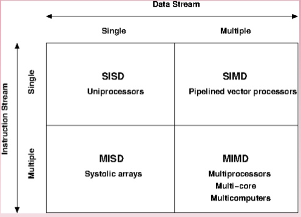
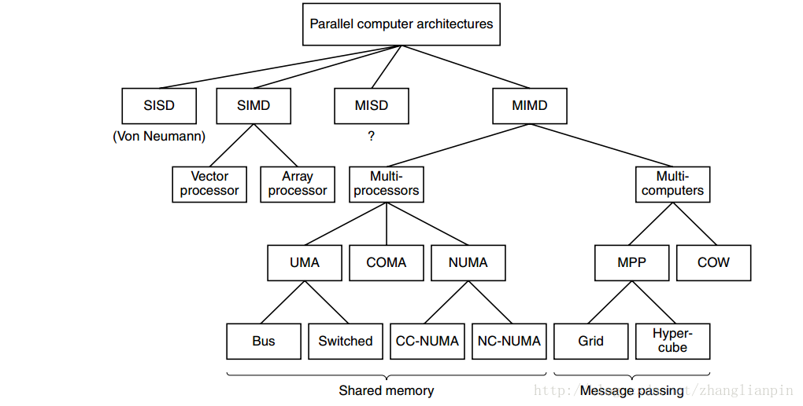
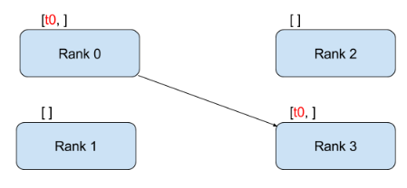
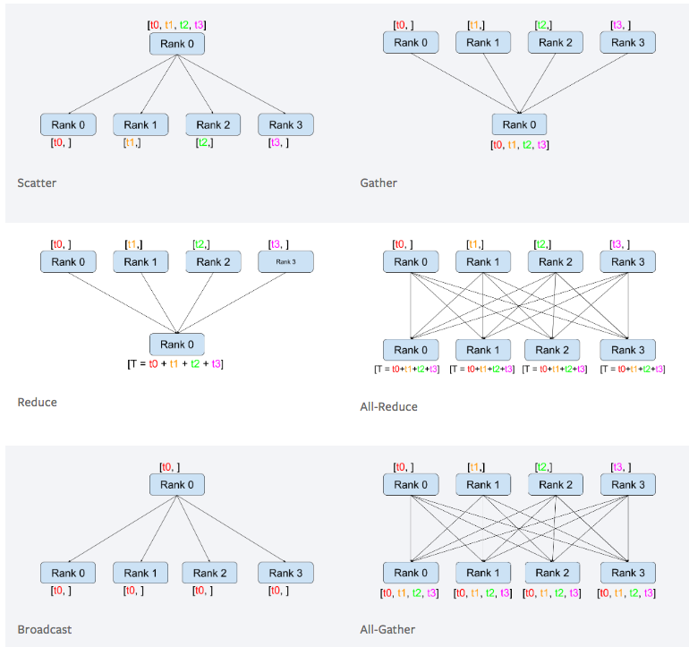

# 分布式

⌚️: 2020年8月9日

📚参考

---

## 一、并行计算介绍

并行计算（Parallel Computing）是指同时使用多种计算资源解决计算问题的过程，是提高计算机系统计算速度和处理能力的一种有效手段。 它的基本思想是用多个处理器来协同求解同一问题，即将被求解的问题分解成若干个部分，各部分均由一个独立的处理机来并行计算。并行计算系统既可以是专门设计的、含有多个处理器的超级计算机，也可以是以某种方式互连的若干台的独立计算机构成的集群。通过并行计算集群完成数据的处理，再将处理的结果返回给用户。　

并行计算或称平行计算是相对于串行计算来说的。所谓并行计算可分为时间上的并行和空间上的并行。 时间上的并行就是指流水线技术，而空间上的并行则是指用多个处理器并发的执行计算。

并行计算科学中主要研究的是空间上的并行问题。从程序和算法设计人员的角度来看，并行计算又可分为数据并行和任务并行。空间上的并行导致了两类并行机的产生，按照Flynn的说法分为：**单指令流多数据流（SIMD）\**和\**多指令流多数据流（MIMD）**。我们常用的串行机也叫做单指令流单数据流（SISD）。

MIMD类的机器又可分为以下常见的五类：并行向量处理机（PVP）、对称多处理机（SMP）、大规模并行处理机（MPP）、工作站机群（COW）、分布式共享存储处理机（DSM）。

目前常见的并行编程技术包括：**MPI**、**OPENMP**、**OPENCL**、**OPENGL**、**CUDA**。下面了解一下这些常见并行编程技术的基础概念：

### 1.MPI

MPI（Message Passing Interface）是一种广泛采用的基于消息传递的并行编程技术。**MPI消息传递接口是一种编程接口标准，而不是一种具体的编程语言**。简而言之，MPI标准定义了一组具有可移植性的编程接口。各个厂商或组织遵循这些标准实现自己的MPI软件包，典型的实现包括开放源代码的MPICH、LAM MPI、OpenMPI以及不开放源代码的Intel MPI。由于MPI提供了统一的编程接口，程序员只需要设计好并行算法，使用相应的MPI库就可以实现基于消息传递的并行计算。MPI支持多种操作系统，包括大多数的类UNIX和Windows系统。

### 2.OPENMP

OpenMP是由OpenMP Architecture Review Board牵头提出的，并已被广泛接受的，用于共享内存并行系统的多线程程序设计的一套指导性的编译处理方案（Compiler Directive）。OpenMP支持的编程语言包括C语言、C++和Fortran；而支持OpenMp的编译器包括Sun Compiler，GNU Compiler和Intel Compiler等。OpenMp提供了对并行算法的高层的抽象描述，程序员通过在源代码中加入专用的#pragma来指明自己的意图，由此编译器可以自动将程序进行并行化，并在必要之处加入同步互斥以及通信。当选择忽略这些#pragma，或者编译器不支持OpenMP时，程序又可退化为通常的程序（一般为串行），代码仍然可以正常运作，只是不能利用多线程来加速程序执行。

### 3.OPENCL

OpenCL（Open Computing Language，开放运算语言）是第一个面向异构系统通用目的并行编程的开放式、免费标准，也是一个统一的编程环境，便于软件开发人员为高性能计算服务器、桌面计算系统、手持设备编写高效轻便的代码，而且广泛适用于多核心处理器（CPU）、图形处理器（GPU）、Cell类型架构以及数字信号处理器（DSP）等其他并行处理器，在游戏、娱乐、科研、医疗等各种领域都有广阔的发展前景。

OpenCL是一个为异构平台编写程序的框架，此异构平台可由CPU，GPU或其他类型的处理器组成。OpenCL由一门用于编写kernels （在OpenCL设备上运行的函数）的语言（基于C99）和一组用于定义并控制平台的API组成。OpenCL提供了基于任务分割和数据分割的并行计算机制。OpenCL类似于另外两个开放的工业标准OpenGL和OpenAL，这两个标准分别用于三维图形和计算机音频方面。OpenCL扩展了GPU用于图形生成之外的能力。OpenCL由非盈利性技术组织Khronos Group掌管。

### 4.OPENGL

OpenGL（Open Graphics Library）是个定义了一个跨编程语言、跨平台的编程接口规格的专业的图形程序接口。它用于三维图象（二维的亦可），是一个功能强大，调用方便的底层图形库。

### 5.CUDA

CUDA(Compute Unified Device Architecture)是一种由显卡厂商NVIDIA推出的通用并行计算架构，该架构使GPU能够解决复杂的计算问题。 它包含了CUDA指令集架构（ISA）以及GPU内部的并行计算引擎。 开发人员现在可以使用C语言来为CUDA™架构编写程序，C语言是应用最广泛的一种高级编程语言。所编写出的程序于是就可以在支持CUDA™的处理器上以超高性能运行。CUDA3.0已经开始支持C++和FORTRAN。

## 二、 MPI

### MPI 基础概念

MPI是分布式计算的基础接口架构，他有很多实现，比如intelMPI openMPI等等，而这些具体实现了这些接口里面的内容，比如一些通信协议。

MPI有几个很重要的概念**rank**, **group**, **communicator**, **type**, **pack**, **spawn**, **window**, 理解了这些概念MPI就算入门了。

**1.group**

group是MPI一个很重要的概念，一台电脑可以属于多个group，group的正真强大体现在可以随时随地的组合任意group，然后利用gourp内，和group间的communicator，可以很容易实现复杂科学计算的中间过程，比如奇数rank一个group，偶数另一个group，或者拓扑结构的group，这样可以解决很多复杂问题，另外MPI还有一个默认的全局的group，他就是comm world，一般简单的应用有了这一个group已经足够了。

**2.rank**

rank就是任意group内的一个计算单元，利用rank我们可以很轻松的实现client server的架构，比如rank＝0是server其他就是client。

**3.communicator**

communicator就是各种通信，比如一对一，一对多，多对一，其中多往往代表着一个group, 在传输过程中tag还是很有用的可以用来区别不同的任务类型，一般都是先解析tag，然后再解析具体的数据内容， 这里要有一个信封和信内容的差别的概念，理解了这样的差别，可以很好的扩展程序。

**4.type**

type是MPI的自定义类型，由于通常编程的时候常用struct 数组 和离散的变量，这些东西不能直接进行通信， 然后MPI同样有一套这样的定义，我们可以转化成MPI的格式，这样就可以很自由的通信了。

**5.pack**

Pack，就是把离散的数据打包起来，方便传送，其实这个作用和type很类似，如果你不想很麻烦的定义type直接打包发送。

**6.spawn**

spawn是区分MPI一代和二代的一个重要的标志，有了spawn，就可以在运行过程中自动的改变process的数量，可能复杂的软件才有这样的需求。

**7.window**

window远程的控制同一个文件，只有在网络条件很好的时候用这个才有意义，否则会让软件效率变得很糟糕。、

最后要有一个思想就是同一份代码可能会被很多电脑同时执行到，注意区分个个部分代码的角色。

### MPI 通信

**1. MPI**

MPI(Message Passing Interface)是一种消息传递接口，是一个消息传递汉书库的标准说明。在基于MPI编程模型中，计算是由一个或多个彼此通过调用库函数进行消息收、发通信的进程所组成。MPI为程序员提供一个并行环境库，程序员通过调用MPI的库程序来达到程序员所要达到的并行目的。

**2.同步/异步**

二者区别主要在于：发送操作是否要等 “接收进程接收消息完成” 才完成

同步发送操作： 只有等消息被接收进程安全接收后才算完成。（数据发出去了，而且被接收进程安全接收了，才完成）

异步发送操作：  操作完成后，消息不一定被接收进程接收。（只要把消息发出去就算完成，不管有没有接收）

**3.阻塞/非阻塞通讯**

二者区别主要在于：调用完成是否依靠某些“事件”

阻塞通讯：调用完成要依赖某些“事件”。（阻塞发送或接收的 函数内部 会等待这个“事件“：”事件“没发生，函数就阻塞在那里；”事件“发生了，函数才返回）

​       阻塞发送：数据必须成功的发送或被拷贝到系统缓冲区，使得该数据缓冲区可被重新使用。这个“事件”发生，函数才返回，发送操作才完成。          

​       阻塞接收：数据必须保证接收到本地缓冲区。这个“事件“发生，函数才返回，接收操作才完成。

非阻塞通讯：不等任何“事件”，就可完成，不保证数据已正确发送或接收。（发完或接收操作发起后，不等”事件“，直接返回。但是，如果要想知道数据有没有被正确发送或接收，要使用wait(), test()查询）

**4.同步阻塞发送/同步无阻塞发送（异步都是非阻塞）**

同步阻塞发送：发送操作要等消息被安全接收才算完成。发送操作本身使阻塞，要等某“事件”，发送操作才返回。（发送返回了，说明“事件“肯定发生了。不需要再用wait() test() 查询）

同步非阻塞发送：发送操作要等消息被安全接收才算完成。但是，要想知道数据被正确接收，要用wait()，test这些函数查询。

**5.集合通信**

通信因子包含一个相互之间通信的进程组。

集合通信是包含在通信因子中的所有进程都参加操作。

集合操作的三种类型：

- 同步：集合中所有进程都到达后，每个进程再接着运行；
- 数据传递： 广播(Broadcast),  分散(Scatter), 收集(Gather)，全部到全部(Alltoall)。
- 规约：集合中的一个进程收集说有进程的数据并计算（如：求最大值，最小值，加，乘）

集合操作是阻塞的。

(1)广播（Broadcast）
(2) 分散(Scatter)
(3) 收集(Gather)
(4)全部到全部(Alltoall)
(5)allgather
注：本文参考神威1计算机系统 MPI培训手册

**Point-to-Point Communication**

**Collective Communication**

