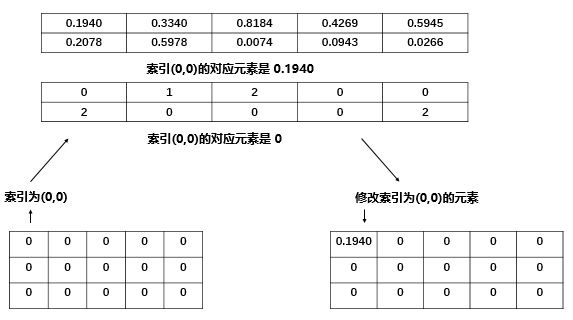
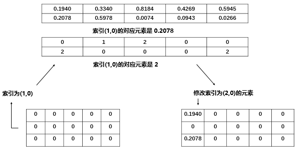
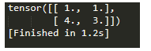

# PyTorch笔记之 scatter() 函数

⌚️: 2020年8月9日

📚参考

---


**scatter()** 和 **scatter_()** 的作用是一样的，只不过 scatter() 不会直接修改原来的 Tensor，而 scatter_() 会

> PyTorch 中，一般函数加**下划线**代表直接在原来的 Tensor 上修改

scatter(dim, index, src) 的参数有 3 个

- **dim：**沿着哪个维度进行索引
- **index：**用来 scatter 的元素索引
- **src：**用来 scatter 的源元素，可以是一个标量或一个张量

> 这个 scatter 可以理解成放置元素或者修改元素

简单说就是通过一个张量 src 来修改另一个张量，哪个元素需要修改、用 src 中的哪个元素来修改由 dim 和 index 决定

官方文档给出了 3维张量 的具体操作说明，如下所示

```
self[index[i][j][k]][j][k] = src[i][j][k]  # if dim == 0
self[i][index[i][j][k]][k] = src[i][j][k]  # if dim == 1
self[i][j][index[i][j][k]] = src[i][j][k]  # if dim == 2
```

**exmaple：**

```
x = torch.rand(2, 5)

#tensor([[0.1940, 0.3340, 0.8184, 0.4269, 0.5945],
#        [0.2078, 0.5978, 0.0074, 0.0943, 0.0266]])

torch.zeros(3, 5).scatter_(0, torch.tensor([[0, 1, 2, 0, 0], [2, 0, 0, 1, 2]]), x)

#tensor([[0.1940, 0.5978, 0.0074, 0.4269, 0.5945],
#        [0.0000, 0.3340, 0.0000, 0.0943, 0.0000],
#        [0.2078, 0.0000, 0.8184, 0.0000, 0.0266]])
```

具体地说，我们的 index 是 torch.tensor([[0, 1, 2, 0, 0], [2, 0, 0, 1, 2]])，一个二维张量，下面用图简单说明

我们是 2维 张量，一开始进行 `𝑠𝑒𝑙𝑓[𝑖𝑛𝑑𝑒𝑥[0][0]][0]`，其中` 𝑖𝑛𝑑𝑒𝑥[0][0] `的值是0，所以执行 `𝑠𝑒𝑙𝑓[0][0]=𝑥[0][0]=0.1940 `

> `𝑠𝑒𝑙𝑓[𝑖𝑛𝑑𝑒𝑥[𝑖][𝑗]][𝑗]=𝑠𝑟𝑐[𝑖][𝑗]`

scatter(dim, index, src)



再比如`𝑠𝑒𝑙𝑓[𝑖𝑛𝑑𝑒𝑥[1][0]][0]`，其中` 𝑖𝑛𝑑𝑒𝑥[1][0] `的值是2，所以执行 `𝑠𝑒𝑙𝑓[2][0]=𝑥[1][0]=0.2078` 



**src 除了可以是张量外，也可以是一个标量**

**example：**

```
torch.zeros(3, 5).scatter_(0, torch.tensor([[0, 1, 2, 0, 0], [2, 0, 0, 1, 2]]), 7)

#tensor([[7., 7., 7., 7., 7.],
#        [0., 7., 0., 7., 0.],
#        [7., 0., 7., 0., 7.]]
```

scatter() **一般可以用来对标签进行 one-hot 编码**，这就是一个典型的用标量来修改张量的一个例子

**example：**

```
class_num = 10
batch_size = 4
label = torch.LongTensor(batch_size, 1).random_() % class_num
#tensor([[6],
#        [0],
#        [3],
#        [2]])
torch.zeros(batch_size, class_num).scatter_(1, label, 1)
#tensor([[0., 0., 0., 0., 0., 0., 1., 0., 0., 0.],
#        [1., 0., 0., 0., 0., 0., 0., 0., 0., 0.],
#        [0., 0., 0., 1., 0., 0., 0., 0., 0., 0.],
#        [0., 0., 1., 0., 0., 0., 0., 0., 0., 0.]])javascript:void(0))
```


用法：output=torch.gather(*input*, *dim*, *index)*

```python
a = torch.Tensor([[1,2],[3,4]])
b = torch.gather(a, 1, torch.LongTensor([[0,0],[1,0]]))
print(b) 
```

