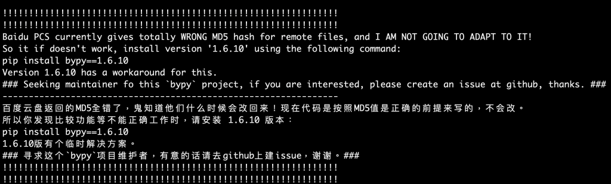
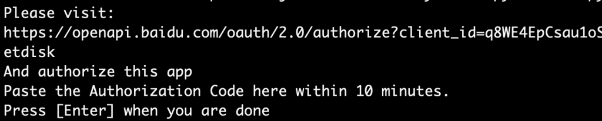
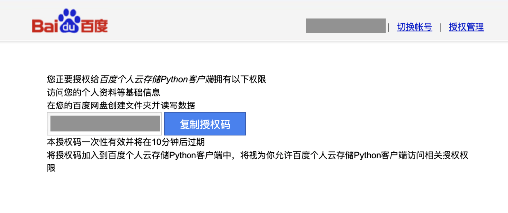
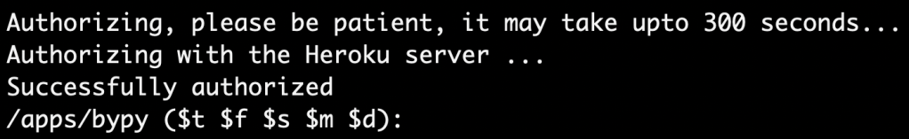

# 使用 bypy 下載檔案

⌚️: 2020年10月21日

📚参考

- https://github.com/houtianze/bypy
- https://pypi.org/project/bypy/
- [原文](https://clay-atlas.com/blog/2020/10/22/python-cn-bypy-download-baidu-yun-files/)
- [命令行模式](https://tsukkomi.org/post/download-baidu-pan-with-bypy)

---

有時候在找一些中文的資源時，會經常找到中國有些網友好心分享了一些文件、模型在**百度雲端**上。這時候，如果要在遠端的伺服器上下載這些好心分享的文件，就必須通過 command line 來下達指令。

今天，我就有了需要下載預訓練模型的需求，所以找了許多可以透過終端機下載的方法，最終選擇了 **bypy**，看起來只要固定在版本 1.6.10，是能夠下載文件的。

以下就簡單介紹該如合使用此一套件。

## Step 1. 安裝 bypy

bypy 適用於 Python 2.7+ 和 Python 3.3+，可以使用以下指令下載：

```
pip3 install bypy==1.6.10
```

這裡得做個說明，如果使用更新的版本的話，會在下載時遇到以下報錯：



總之，先乖乖窩在 1.6.10 吧！


## Step 2. 驗證帳戶、授權

第一次使用（比方說我想使用以下程式碼列出百度雲端的資料夾），則需要驗證帳戶資訊。

```
from bypy import ByPy


def main():
    bp = ByPy()
    bp.list()


if __name__ == '__main__':
    main()
```

Output:



前往驗證網址，輸入百度帳戶的帳號密碼，應該就會出現驗證碼了。



將驗證碼貼回終端機，並按下 Enter 鍵。



就會看到授權成功。


## Step 3. 下載檔案

還記得剛才我們所看到的 **/apps/bypy** 資料夾嗎？它在你的百度雲端中，應該是叫什麼『**應用程式/bypy**』的 ......，總之，把你要下載的檔案放在裡面，才能正常下載。

比如說我將資料夾 **GPT-2** 放在該目錄底下，可以使用以下指令查看：

```
from bypy import ByPy


def main():
    bp = ByPy()
    bp.list()


if __name__ == '__main__':
    main()
```

Output:

```
/apps/bypy ($t $f $s $m $d):
D GPT2 0 2020-10-22, 06:53:45
```

確認有此資料夾後，就能使用以下程式下載：

```
from bypy import ByPy


def main():
    bp = ByPy()
    bp.download('GPT-2')


if __name__ == '__main__':
    main()
```


```
# # -*- coding:utf-8 -*-
# # author:
# from bypy import ByPy
# # 获取一个bypy对象，封装了所有百度云文件操作的方法
# bp = ByPy()
# # 百度网盘创建文件夹zhoulong
# # bp.mkdir(remotepath = 'zhoulong')
# #上传文件至文件夹
# # upload中参数代表复制文件，默认值为'overwrite'，指定'newcopy'不会覆盖重复文件
# # bp.upload(localpath= r'上传文件绝对路径', remotepath= 'zhoulong', ondup='newcopy')
# # print('上传完成！！')
# bp.download(remotepath = 'zhoulong', localpath = r'下载文件输出文件夹')
# print('下载完成！！')

from bypy import ByPy


def main():
    bp = ByPy()
    bp.list()
    bp.download(remotepath="ssd.onnx", localpath=r'./ssd.onnx')


if __name__ == '__main__':
    main()
```

