# [使用Clion优雅的完全远程自动同步和远程调试c++](https://www.cnblogs.com/xueqiuqiu/articles/12957230.html)

⌚️: 2020年10月21日

📚参考

---

摘要：在linux上用vim写C++的时候，通常用gdb进行调试，不能随心所欲的看代码和跳转代码以及加watch（也有可能是因为我还没有get正确的使用方法）。为此我发现Clion可以做到自动同步本场代码或自己下载远程代码同步到本地，以及调试在远程机器上运行的代码，为此记录下来。

## 1. 简介

> CLion 是一款专为开发 C 及 C++ 所设计的跨平台 IDE。 它是以 IntelliJ 为基础设计的，包含了许多智能功能来提高开发人员的生产力，从而提升工作效率 。

## 2. 环境准备

- 操作系统： macOS / Windows
- IDE: CLion
- 源码路径： Node Master

## 3. 自动同步

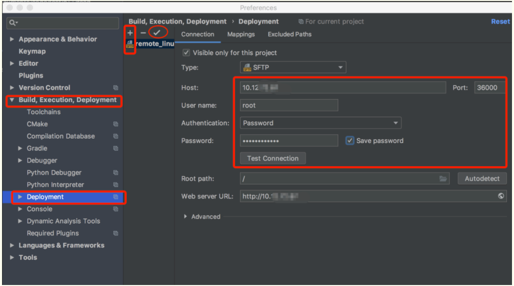

**设置远程链接**

- 打开CLion的设置，进入到 Preferences | Build, Execution, Deployment | Deployment
- 点加号，添加一个远程配置
- 设置为SFTP协议，设置远程ip、port、pass然后点击Test Connection，确认是否连接成功


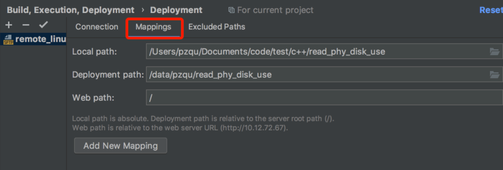

**设置本地与远程的连接映射**

- 切换到Mappings
- 设置本地的代码根目录Local path
- 设置远程的代码根目录 Deployment path


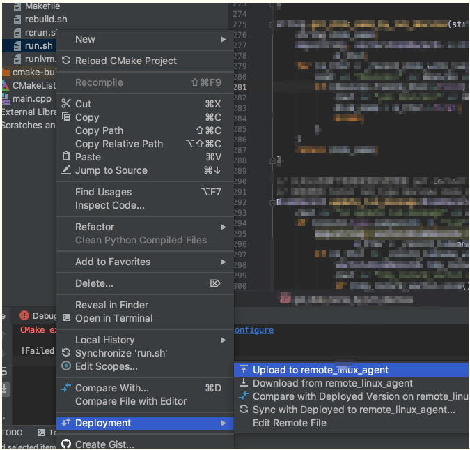

**上传一个文件**

- 上传一个文件
- Upload是上传，Download是下载，本地与远程所映射的目录我们在上面设置过了


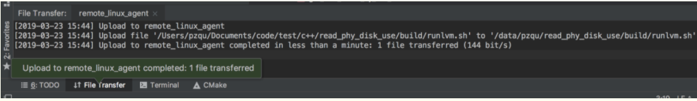

**上传效果**

- 上传成功


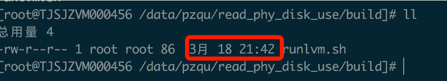

**查看更新的文件**

- runlvm.sh文件更新成功，现在的时间是3月18 21：42


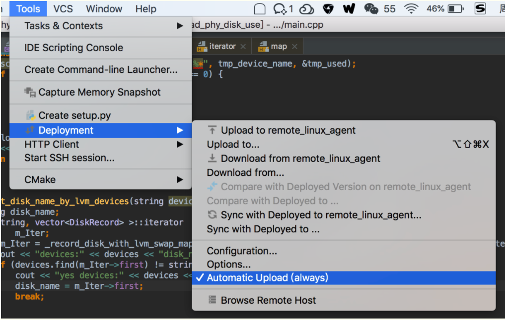

**设置自己同步**

- 在Tool - Deployment - Automatic Upload(always) 设置为自动同步
- 自动同步的话可以在每次在本地改动代码的时候自己同步了
- Sync with Deployed to 就是自动下载远程代码到本地


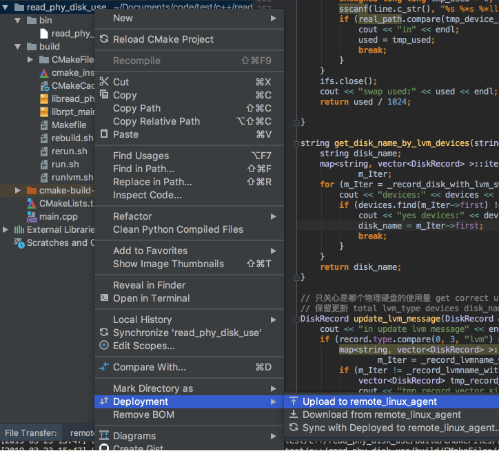

**上传整个项目**

- 手动上传整个项目
- 上传成功，上传了100个文件
- 查看远程目录，确实成功了

好了，现在只要在本地有任何的改动都会自动同步到远程了。

## 4. 远程调试

**CentOS的依赖依赖**

```js
# cmake
yum install cmake -y

# gcc & gdb
yum install gcc-c++ -y
yum install gdb -y

#gdbserver
yum install gdb-gdbserver -y
```

Ubunt依赖

```
# cmake
apt install cmake -y

# gcc & gdb
apt install gcc-c++ -y
apt install gdb -y

#gdbserver
apt install gdbserver -y
```

### 4.1 添加GDB Remote Debug

#### 4.1.1 本地配置

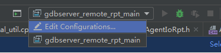

**添加远程调试设置**


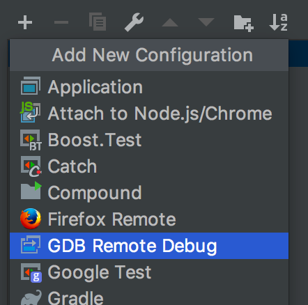

**添加GDB Remote Debug**


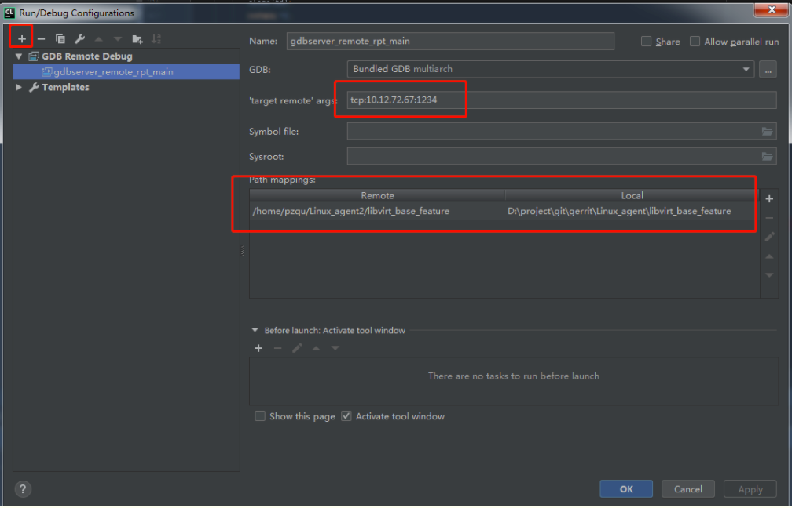

**设置gdb remote配置**

- 添加一个GDB远程调试的配置 GDB Remote Debug
- 设置远程访问参数（target remote args）： tcp:xx.xx.xx.xx:1234
- 设置远程路径和本地路径的映射（Path mappings）
- 远程调试连接成功后，像本地调试一样，可以设置断点，单步跟踪等
- 调试需要本地和远程的代码一致


#### 4.1.2 两个方法设置远程配置

**方法一、** 远程gdbserver的启动

远程调试依赖gdbserver的来支持，通过gdbserver的启动的程序，会先等待远程调试的连接，连接成功后再启动进程。

假设代码的根目录：`/data/pzqu/read_phy_disk_use/`,执行以下代码以后编译

```js
cd /data/pzqu/read_phy_disk_use/build
cmake .. -DCMAKE_BUILD_TYPE=Debug
make
gdbserver :1234 ./read_phy_disk_use
```

注意：cmake的指定需要-DCMAKE_BUILD_TYPE=Debug来请获取调试

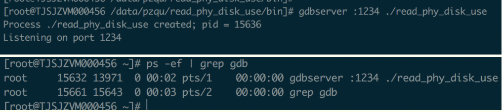


**方法二** 远程gdbserver的动态连接

gdbserver的还支持动态绑定到已经启动的进程

```js
gdbserver :1234 --attach <PID>
```

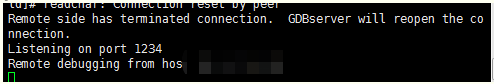

attash成功后

#### 4.1.3 打断点开始调试

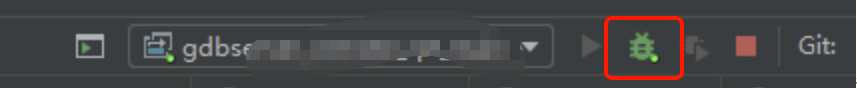

开始调试

- 点击小虫子开始调试


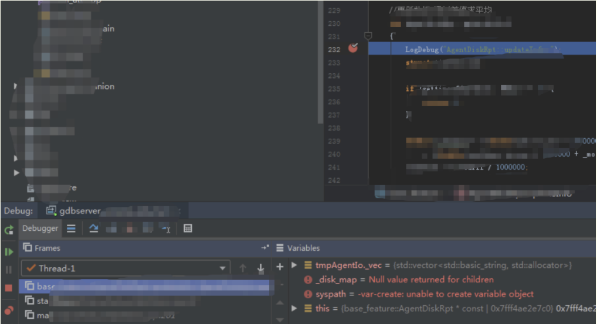

打断点

- 我们可以看到代码停止到了断点处
- Variables 是可以自己设置的watch
- 和正常调试方式一样啦

### 4.2 用CLion完全的在远程工作

这是一个非常非常爽的操作，以后就可以完全的用IDE来写代码了，虽然使用命令行显得比较专业，但是使用工具可以有效的提高工作效率，何乐而不为呢？

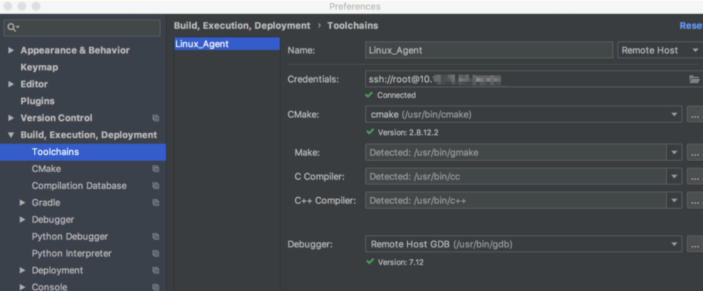设置Toolchains工具链

- 进入 Preferences | Build, Execution, Deployment | Toolchains
- 设置远程连接信息，CLion会自动监测CMake gcc g++ gdb的信息


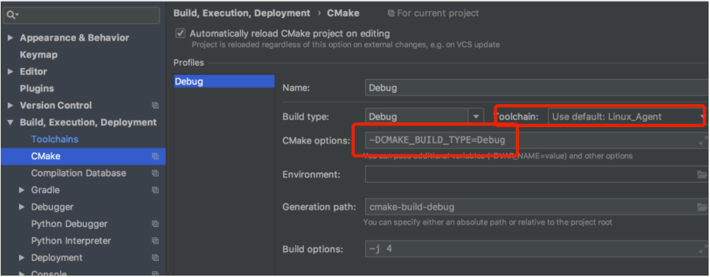

设置cmake

- 进入Preferences | Build, Execution, Deployment | CMake
- Toolchain 选择我们刚刚设置的
- 上面的`Automatically reload CMake project on editing` 的设置勾上的时候，只要代码有修改就会自动编译


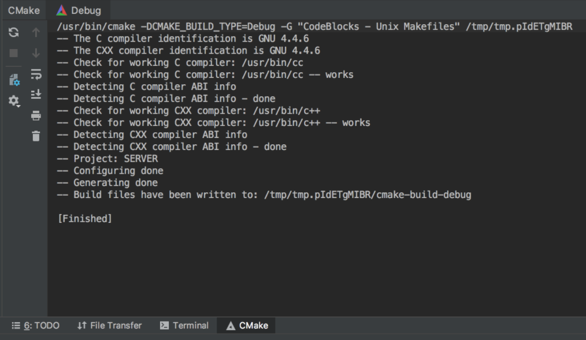

编译成功

- 现在已经配置了远程Toolchains工具链并配置了相应的CMake配置文件

- 上图是自动编译和上传到的目录`/tmp/tmp.pIdETgMIBR`，然后我们只要设置为自动同步目录就成了，如下图

  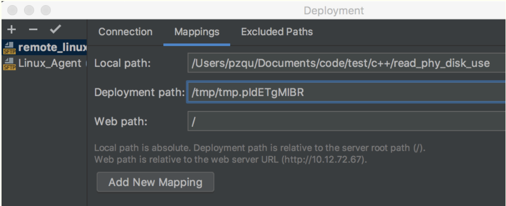设置为自动同步目录

- 现在已经设置成了自动同步目录，只需在运行/调试配置切换器中选择正确的CMake配置文件，即可以完全远程的方式构建，运行和调试应用程序和测试。


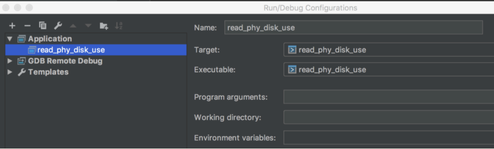

添加Application

- 添加Application来跑我们的程序

  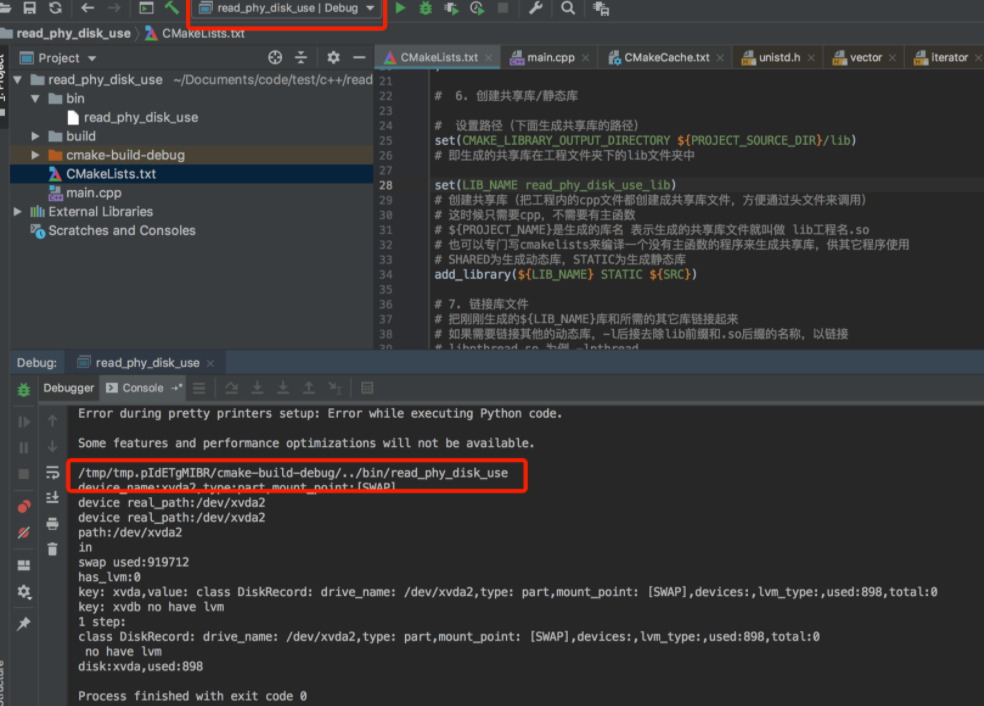

  远程运行

- 远程运行，本地输出结果

  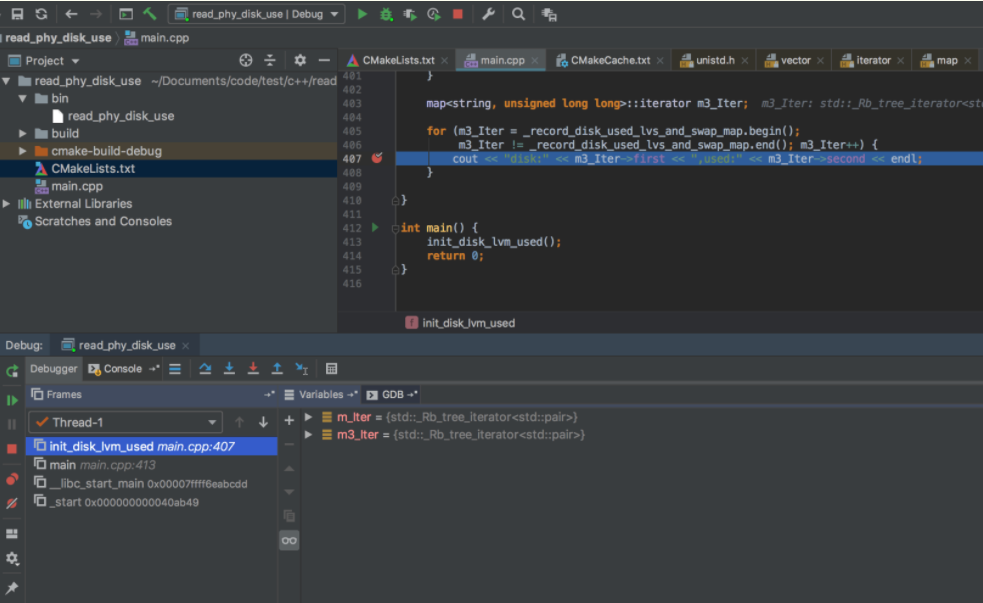

  远程调试

- 远程运行，本地自动调试

## 总结

- 配置CLion中的同步信息：同步到哪台机器的哪个目录。
- 使用 Deployment 让本地和远程可以自动同步和自动下载，手动同步和手动下载代码
- 配置GDB remote Debug设置
- 使用gdbserver来启动程序进行调试
- 使用gdbserver attach依附已经启动的程序进行调试
- 完全在本地进行远程代码调试

## 其他

- 这种方式是不是非常的优雅，这样我们只要不断的添加工具链（Toolchains）就可以在本地应对数不清的远程环境了。
- 这种方式应该适用于JetBrain全家桶