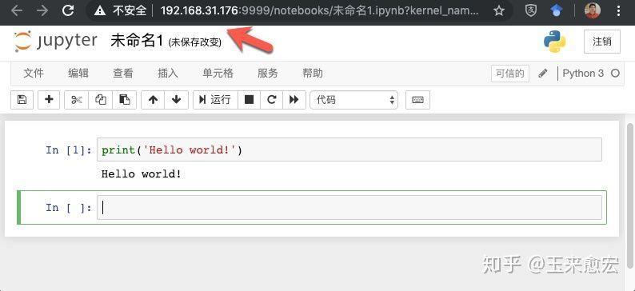

# 远程访问JupyterLab服务器

⌚️: 2020年10月21日

📚参考

---

## 1、远程访问JupyterLab需要关键的两步：

- 安装jupyterlab : `pip install jupyterlab`
- 配置文件`jupyter_notebook_config.py`的配置

## 2、如何配置`jupyter_notebook_config.py`

#### 2.1 创建配置文件

```tsx
[jpnb@centos-7 ~]$ jupyter notebook --generate-config
Writing default config to: /home/jpnb/.jupyter/jupyter_notebook_config.py
```

其实，直接在`~/`下，手动创建隐藏文件夹`.jupyter`，并在其中创建配置文件`jupyter_notebook_config.py`，是一样的。

⚠️如果服务器端有两个jupyterlab，则需要两个不同的配置文件，那么在`.jupyter`再创建一个不同的配置文件即可，例如`jupyter_notebook_config_2.py`，只不过在启动jupyterlab时候，需要如下命令：

```python
jupyter notebook --config jupyter_notebook_config_2.py
```

`jupyter_notebook_config.py`是默认的配置文件，所以其对应的jupyter在启动时候，直接使用如下命令即可

```python
jupyter notebook
```

#### 2.2 修改配置文件

1）创建一个访问密码，后面需要、通过网页登陆时也需要

```python
[jpnb@centos-7 ~]$ jupyter notebook password
Enter password: ****
Verify password: ****
[NotebookPasswordApp] Wrote hashed password to /home/jpnb/.jupyter/jupyter_notebook_config.json
```

2）获取hash密码
IPython中运行

```python
In [1]: from notebook.auth import passwd
In [2]: passwd()
Enter password:
Verify password:
Out[2]: 'sha1:67c9e60bb8b6:9ffede0825894254b2e042ea597d771089e11aed'
```

3）修改配置文件

```python
c.NotebookApp.password=u'sha1:67c9e60bb8b6:9ffede0825894254b2e042ea597d771089e11aed'
c.NotebookApp.port = 9999
```

其中，hash密码就是上面生成的；端口号自由设置，不冲突即可

```php
c.NotebookApp.allow_remote_access = True
c.NotebookApp.ip='*'
c.NotebookApp.open_browser = False
```

注意：`u'sha1:...`开头的 `u` 不可省略

## 3、运行

#### 3.1 服务端启动

方式一：使用默认的配置文件

```ruby
[jpnb@centos-7 ~]$ jupyter notebook 
```

方式二：使用指定的配置文件

```ruby
[jpnb@centos-7 ~]$ jupyter notebook --config jupyter_notebook_config_2.py
```

方式三：服务端挂起，这种情况能保证，即使服务端的终端关闭，jupyter也不会断掉

```ruby
[jpnb@centos-7 ~]$ nohup jupyter notebook &
```

#### 3.2 客户端使用

我们在地址栏中输入远程服务器的IP和端口号：“[http://192.168.31.176:9999/](https://links.jianshu.com/go?to=https%3A%2F%2Flink.zhihu.com%2F%3Ftarget%3Dhttp%3A%2F%2F192.168.31.176%3A9999%2F)”


输入设置的密码后，



OK！