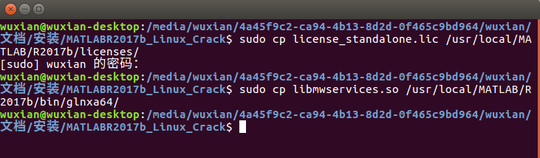

# ubuntu16.04安装MATLAB R2017b

⌚️: 2020年10月21日

📚参考

---

摘要：介绍在ubuntu16.04中从下载到安装成功的完整步骤。本文给出MATLAB R2017b（Linux系统）的完整安装包百度云盘下载地址，逐步介绍一种简单易行的安装方法，在桌面创建快捷方式，最终完整运行。

## 1. 前言

最近由于项目原因，需要在ubuntu上安装MATLAB，在网上找了很久发现一些教程大多步骤繁杂且叙述不够完整。和Windows安装软件的方式有所不同，从找文件包到安装完成，刚刚接触Linux的初学者在这上可能没少耗费时间，特此整理了这篇博文供大家参考。（这里安装版本为MATLAB R2017b,操作系统为ubuntu16.04。）

## 2. 安装步骤(桌面)

### 2.1 下载安装包

目前网上已经有MATLAB R2017b的Linux安装版，真心感谢那些资源提供者，但有些资源有点不厚道了，说是完整版压缩包里面却缺少部分关键文件、install key等等。我在安装时就遇到了这样的问题，在网上找寻良久终于找到了缺少的crack文件，这里将所有文件重新整理打包上传到百度云盘供大家下载，因为链接容易失效问题，请大家关注本人公众号“AI技术研究与分享”（搜索或扫描如下二维码）回复“ubuntu版MATLAB”，即可获取安装包资源网盘链接与密码。（特别申明：网上下载方式很多，这一步为非必须步骤，公众号获取仅做学习推荐，大家凭喜好关注即可！）


点击链接下载MATLAB安装包，下载完成如下图所示


上图为Windows下的文件保存情况，ubuntu下类似。全部准备就绪，进行下一步。

### 2.2 开始安装

（1）文件解压

将文件下R2017b_glnxa64以及MATLABR2017b_Linux_Crack两压缩包解压，建议先在Windows下解压好然后直接将全部文件拷到ubuntu中（压缩包R2017b_glnxa64解压后的iso文件大小在10G左右，需要用移动硬盘拷贝），这样省去一些输代码的操作。

全部解压后在ubuntu下的文件显示如下


当然也可以在ubuntu下解压，ubuntu16中可以通过选中压缩包后右击选择‘提取到此处’，便可实现解压。不过这可能会出错，原因可能是没有安装相应的解压工具，在文件所在目录下右击选择‘在终端打开’打开终端，在终端输入以下代码

```shell
sudo apt-get update
sudo apt-get install unrar
sudo unrar x MATLABR2017b_Linux_Crack.rar
```

便可完成MATLABR2017b_Linux_Crack压缩包的解压了，解压后的文件在相同文件夹下。接下来解压R2017b_glnxa64，同样在文件所在目录下右击选择‘在终端打开’打开终端，在终端输入以下代码

```shell
sudo apt-get install unzip
sudo unzip R2017b_glnxa64.zip
```

解压任务完成。

（2）挂载镜像文件
首先需要挂载iso文件，在解压完成的那个文件夹下右击打开终端输入以下代码，注意代码中的username是安装系统时个人设置的，每台电脑有所不同，我这里是wuxian，注意要改成自己的文件名（打开home文件夹后出现一个文件夹就是它啦）。


```shell
mkdir /home/username/temp
sudo mount -t auto -o loop R2017b_glnxa64.iso /home/username/temp
```

（3）进入文件夹安装
现在需要进入挂载的文件夹下运行安装文件了，继续输入以下代码


```shell
cd /home/username/temp 
sudo /home/username/temp/install
```

这时会运行MATLAB的安装文件，出现以下界面


选择‘使用文件安装密钥’，然后点击‘下一步’。出现以下界面，选择‘是’，点击‘下一步’。


这时进入密钥输入界面，选择‘我已有我的许可证的文件安装密钥’，需要输入的密钥前面已经准备好了


打开先前解压文件目录下的install_key文本文件，复制文件里面的密钥粘贴到输入框，点击‘下一步’。


下面需要设置安装路径，系统会自动默认填好路径，为方便后面安装这里不做修改，直接下一步


选择安装的产品，保持默认的全选，选择‘下一步’


选择安装选项，继续下一步


确认安装，点击‘安装’


开始正式安装，进度条走起


耐心等待一会进度条走到100%，出现以下界面，继续‘下一步’


最后点击完成，完成安装


（4）复制证书文件
万事具备，只欠东风，要想能运行还得做好证书复制这一步，这几个证书文件前面也已经准备好啦，就在前面解压好的MATLABR2017b_Linux_Crack文件夹中，打开文件夹如下


在该文件夹下右击打开终端，在终端输入如下代码

```shell
sudo cp license_standalone.lic /usr/local/MATLAB/R2017b/licenses/ 
sudo cp libmwservices.so /usr/local/MATLAB/R2017b/bin/glnxa64/
```



复制完成，安装也就结束了

（5）取消挂载
安装完成，这时可以取消前面的文件挂载了，在终端输入以下代码取消挂载（注意修改username哦）

```shell
sudo umount /home/username/temp
```


（6）运行MATLAB
这时进入MATLAB目录打开MATLAB，输入以下代码


```shell
cd /usr/local/MATLAB/R2017b/bin
./matlab
```

这时出现MATLAB启动界面，如此大功告成


### 2.3 优化

（1）为了访问matlab时不用加路径，添加环境变量可在 /etc/profile中添加以下代码

```shell
#set matlab evvironment 
export PATH=$PATH:/usr/local/matlab/bin
```

（2）为了防止可能的错误，安装MATLAB的支持包，在终端输入以下代码

```shell
sudo apt-get install matlab-support
```


在提示的MATLAB所在安装目录输入框中输入：/usr/local/matlab/bin，完成支持包的安装


（3）虽然上面的终端启动能打开，但关闭终端后MATLAB也一起关闭，下次要打开还得输一串代码，这里用个简单的方法创建快捷方式。输入如下代码后，打开MATLAB，右击软件图标选择‘锁定在启动器’。

```shell
cd /usr/local/MATLAB/R2017b/bin
./matlab
```

这时打开/usr/share/applications/目录，可以看到如下的图标


找到MATLAB那个经典图标，把软件的图标拖到启动器上，这样快捷方式创建完毕，下次点击图标就能启动MATLAB了。


## 3. 安装步骤(命令行)

### 0.下载

下载镜像文件R2016b_glnxa64_dvd1.iso和R2016b_glnxa64_dvd2.iso及Crack.zip至某目录~/xxx下，并解压Crack.zip

### 1.挂载镜像

```
cd ~/xxx
sudo mkdir /media/matlab
sudo mount -o loop R2016b_glnxa64_dvd1.iso /media/matlab/123
```

### 2.安装

```
sudo mkdir /usr/local/MATLAB
cd /media/matlab
sudo /media/matlab//install -mode silent -fileInstallationKey 09806-07443-53955-64350-21751-41297 -agreeToLicense yes -activationPropertiesFilehome ~/xxx/Crack/license_standalone.lic -destinationFolderhome /usr/local/MATLAB123
```

<注意> 
a) 09806-07443-53955-64350-21751-41297注册号直接将Crack/readme.txt中第一串数字粘贴过来替换即可 
b) 安装到一半出现 
**Info: 弹出 DVD 1 并插入 DVD 2 以继续。** 
这时新打开另一个终端，输入：

```
cd ~/xxx  
sudo mount -o loop R2016b_glnxa64_dvd2.iso /media/matlab/12
```

### 3.破解

```
sudo cp ~/xxx/Crack/R2016b/bin/glnxa64/* /usr/local/MATLAB/R2016b/bin/glnxa64
sudo mkdir /usr/local/MATLAB/R2016b/licenses
sudo cp ~/XXX/Crack/license_standalone.lic /usr/local/MATLAB/R2016b/licenses
cd /usr/local/MATLAB/R2016b/bin
./matlab -chome /usr/local/MATLAB/R2016b/licenses/license_standalone.lic12345
```

此时已进入matlab工作环境，破解成功 


### 4.设置环境变量

```
sudo vim ~/.bashrc
# added by matlab2016b
export PATH=/usr/local/MATLAB/R2016b/bin:$PATH
source ~/.bashrc1234
```

之后启动matlab，可直接输入：

```
matlab1
```

即进入matlab工作环境

### 5.卸载镜像

```
sudo umount /media/matlab1
```

### 6.参考教程

> http://blog.csdn.net/minione_2016/article/details/53313271 
> https://www.2cto.com/kf/201708/671460.html

## 4. 测试程序

GPU (graphic processing units) 的出現和普及，可說是近年來科學計算的最大變革，由於 GPU 具有大量平行處理的能力，所以對於某一些適合平行運算的應用，GPU 可說是最是適合不過了。

但是 GPU 的程式設計，若以 C 或 C++ 來進行，會比一般程式設計複雜一些，你必須要瞭解 GPU 本身的設計概念以及硬體結構，才能夠充分發揮 GPU 的計算能力。但若要在 MATLAB 來使用 GPU 加速各種運算，則是相當容易，因為相關的複雜細節都已經被包含在 MATLAB 簡單的指令內了。

MATLAB 與 GPU 最相相關的兩個基本指令如下：內測試你的機器有幾張

- gpuDeviceCount: 可以回傳你的機器上面有幾張 GPU 卡（或顯卡）。
- gpuDevice: 可以回傳你的預設 GPU 卡的相關訊息。

例如，以下範例可以顯示你的機器上有幾張 GPU 卡，以及預設之 GPU 卡的相關資訊：


Example 1: [02-程式碼與記憶體之最佳化/gpuDevice01.m](http://mirlab.org/jang/books/matlabProgramming4guru/example/02-程式碼與記憶體之最佳化/gpuDevice01.m)

```
d = gpuDeviceCount
g = gpuDevice

d =

     1


g = 

  <a href="matlab:helpPopup parallel.gpu.CUDADevice" style="font-weight:bold">CUDADevice</a> with properties:

                      Name: 'GeForce GTX 970M'
                     Index: 1
         ComputeCapability: '5.2'
            SupportsDouble: 1
             DriverVersion: 7
            ToolkitVersion: 6.5000
        MaxThreadsPerBlock: 1024
          MaxShmemPerBlock: 49152
        MaxThreadBlockSize: [1024 1024 64]
               MaxGridSize: [2.1475e+09 65535 65535]
                 SIMDWidth: 32
               TotalMemory: 3.2212e+09
           AvailableMemory: 2.9349e+09
       MultiprocessorCount: 10
              ClockRateKHz: 1038000
               ComputeMode: 'Default'
      GPUOverlapsTransfers: 1
    KernelExecutionTimeout: 1
          CanMapHostMemory: 1
           DeviceSupported: 1
            DeviceSelected: 1

```


在上述範例中，顯示了我的機器只有一張顯卡，並顯示此顯卡的各種相關性質。


在使用顯卡進行運算時，我們通常必須遵循下列基本步驟：

1. 使用 gpuArray 指令，將 MATLAB 工作空間的變數搬移到 GPU 的記憶體中。
2. 使用 GPU 記憶體中的變數來執行各種在 GPU 的運算。
3. 使用 gather 指令，將存放在 GPU 的變數搬移至 MATLAB 工作空間中。

在以下範例中，我們以簡單的矩陣相乘來說明如何操作以上這幾個步驟：


Example 2: [02-程式碼與記憶體之最佳化/gpuStep01.m](http://mirlab.org/jang/books/matlabProgramming4guru/example/02-程式碼與記憶體之最佳化/gpuStep01.m)

```
a=rand(100, 10000);
b=rand(100, 10000)';
tic
c=a*b;
fprintf('CPU time = %g sec\n', toc);
A=gpuArray(a);		% Put a to GPU's memory
B=gpuArray(b);		% Put b to GPU's memory
tic
C=A*B;				% Multiplication via GPU
fprintf('GPU time = %g sec\n', toc);
c2=gather(C);		% Put C to MATLAB's workspace
fprintf('isequal(c, c2) = %g\n', isequal(c, c2));
fprintf('Mean deviation = %g\n', mean(mean(abs(c-c2))));

```

```
CPU time = 0.00463387 sec
GPU time = 0.000350486 sec
isequal(c, c2) = 0
Mean deviation = 5.55428e-13
```

在上述範例中，我們可以觀察到下列現象：

1. GPU 的計算時間（不包含資料搬移的時間）大約只有 CPU 計算時間的 1/20。
2. GPU 計算結果和 CPU 不完全相同，但兩者的差異性極小。

特別要注意的是，上述 GPU 的計算時間，並不包含資料搬移時間。一般而言，我們應該盡量減少資料搬移，並盡量在 GPU 進行平行運算，否則反而會得不償失。

在前一個範例中，計算加速的幅度和矩陣的維度有很大的關係，下面這個範例將探討這個關係：


Example 3: [02-程式碼與記憶體之最佳化/gpuSpeedup01.m](http://mirlab.org/jang/books/matlabProgramming4guru/example/02-程式碼與記憶體之最佳化/gpuSpeedup01.m)

```
fprintf('computer = %s\n', computer);
fprintf('version = %s\n', version);
% Speed test
step=10000;
colCounts=step*(1:1:20);
for i=1:length(colCounts)
	fprintf('%d/%d\n', i, length(colCounts));
	n=colCounts(i);
	a=rand(100, n);
	b=rand(100, n)';
	myTic=tic; c=a*b; cpuTime(i)=toc(myTic);
	A=gpuArray(a);
	B=gpuArray(b);
	myTic=tic; C=A*B; gpuTime(i)=toc(myTic);
end
subplot(211); plot(colCounts, cpuTime, '.-', colCounts, gpuTime, '.-');
legend('CPU time', 'GPU time', 'location', 'northwest');
title('CPU & GPU time');
ylabel('Time (sec)');
subplot(212); plot(colCounts, cpuTime./gpuTime, 'o-');
title('GPU speedup ratio');
ylabel('Ratios');
xlabel('No. of columns');
```

```
computer = PCWIN64
version = 9.3.0.651671 (R2017b) Prerelease
1/20
2/20
3/20
4/20
5/20
6/20
7/20
8/20
9/20
10/20
11/20
12/20
13/20
14/20
15/20
16/20
17/20
18/20
19/20
20/20
```


在上述範例中，加速幅度很大，GPU 速度可達 CPU 速度的 500 倍以上。但請注意，上述範例的計算並不包含資料搬移所需的時間。