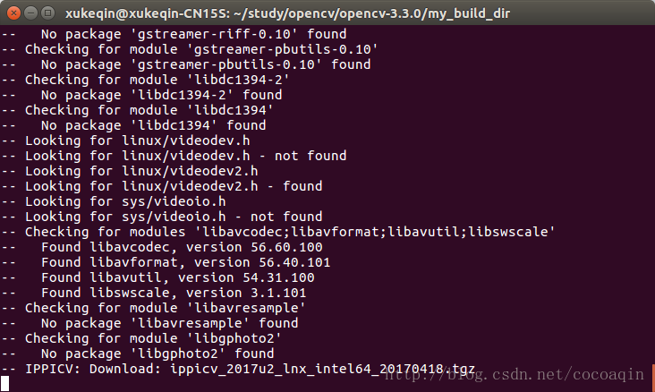
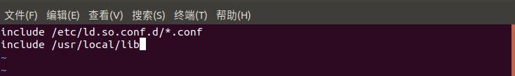
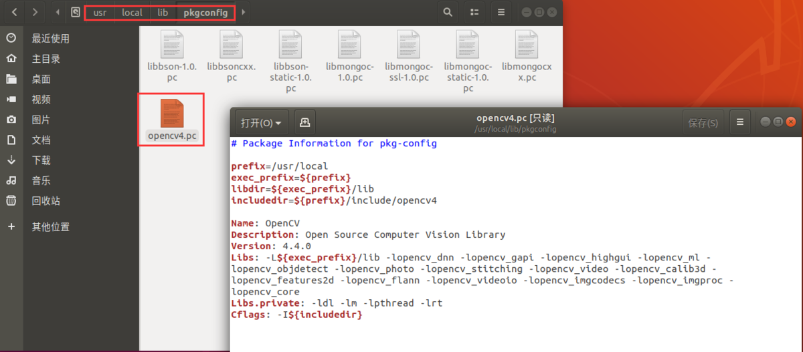
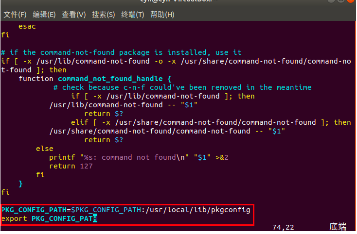
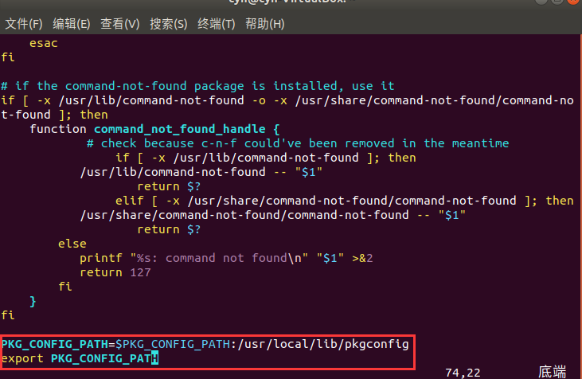

# 安装OpenCV3与python-opencv

⌚️: 2021年5月1日

📚参考

- [参考-1](https://www.jianshu.com/p/59608e83becb) 
- [参考-2](https://blog.csdn.net/weixin_44278406/article/details/103619191)

---

## 1. 前言

OpenCV提供开源图像算法和机器学习算法，是计算机视觉中使用极广的图像处理算法库。OpenCV最早由Intel创建，OpenCV实际上表示Intel® Open Source Computer Vision Library，之后由Willow Garage（2014年关闭）和Itseez（2016年被Intel收购）支持和维护。OpenCV可以应用于各个平台，如Mac, Windows, Linux (Terminal environment)。本文主要介绍如何在Ubuntu系统下，从源代码编译安装OpenCV。

## 2. 编译安装

### **2.1 安装cmake**

OpenCV需要使用cmake进行编译

```csharp
sudo apt-get install cmake
```

### **2.2 安装依赖**

```csharp
sudo apt-get install build-essential pkg-config libgtk2.0-dev libavcodec-dev libavformat-dev libjpeg-dev libswscale-dev libtiff5-dev
```

> 依赖项，视情况而定。事实上，OpenCV的依赖项很多，缺少某些依赖项会影响OpenCV部分功能。OpenCV会在make阶段检测依赖项是否会安装，并自我调整功能。
>
> ```bash
> $ sudo apt-get install build-essential cmake git libgtk2.0-dev pkg-config libavcodec-dev libavformat-dev libswscale-dev 
> $ sudo apt-get install libjpeg-dev libpng-dev libtiff5-dev libjasper-dev libdc1394-22-dev libeigen3-dev libtheora-dev libvorbis-dev libxvidcore-dev libx264-dev sphinx-common libtbb-dev yasm libfaac-dev libopencore-amrnb-dev libopencore-amrwb-dev libopenexr-dev libgstreamer-plugins-base1.0-dev libavutil-dev libavfilter-dev libavresample-dev
> ```
>
> **某依赖项安装有问题时，请自行搜索解决。如依赖包，libjasper-dev**
>
> ```bash
> sudo apt-get install libjaster-dev
> errorE: unable to locate libjasper-dev
> ```
>
> 解决办法，复制到这里
>
> ```bash
> sudo add-apt-repository "deb http://security.ubuntu.com/ubuntu xenial-security main"
> sudo apt update
> sudo apt install libjasper1 libjasper-dev
> ```
>
> ## 

### **2.3 [下载](http://opencv.org/releases.html)&解压**

OpenCV除了主库外还有一个扩展模块，叫opencv-contrib，可以**视情况选择安装与否**。需要注意的是，这两个库（模块）的版本号要统一，如opencv-3.4.5和opencv_contrib-3.4.5。可以选择自行[登录官网下载](https://opencv.org/releases/)；也可到github下载，[opencv的releases](https://github.com/opencv/opencv/releases)，[opencv_contrib的releases](https://github.com/opencv/opencv_contrib/releases)；也可以使用git下载，代码如下。

```
sudo su # change to root
cd /opt # 3rd party software install dir, not necessary
git clone https://github.com/opencv/opencv.git
cd opencv 
git checkout 4.4.0
cd ..

git clone https://github.com/opencv/opencv_contrib.git
cd opencv_contrib
git checkout 4.4.0
cd ..
```


### **2.4 进入文件目录，创建build目录并进入**

```bash
cd opencv-4.4.0/
mkdir build
cd build
```

### **2.5 使用cmake生成makefile文件**

```objectivec
cmake -D CMAKE_BUILD_TYPE=RELEASE -D CMAKE_INSTALL_PREFIX=/usr/local -D WITH_GTK=ON -D OPENCV_GENERATE_PKGCONFIG=YES ..
```

`CMAKE_BUILD_TYPE=RELEASE`：表示编译发布版本
`CMAKE_INSTALL_PREFIX`：表示生成动态库的安装路径，可以自定义
`WITH_GTK=ON`：这个配置是为了防止GTK配置失败：即安装了`libgtk2.0-dev`依赖，还是报错未安装
`OPENCV_GENERATE_PKGCONFIG=YES`：表示自动生成OpenCV的pkgconfig文件，否则需要自己手动生成。


> ```
> cmake -D CMAKE_BUILD_TYPE=Release -D CMAKE_INSTALL_PREFIX=/usr/local ..
> /opt$ cd opencv
> /opt/opencv$ mkdir release
> /opt/opencv$ cd release
> /opt/opencv/release$ cmake -D BUILD_TIFF=ON -D WITH_CUDA=OFF -D ENABLE_AVX=OFF -D WITH_OPENGL=OFF -D WITH_OPENCL=OFF -D WITH_IPP=OFF -D WITH_TBB=ON -D BUILD_TBB=ON -D WITH_EIGEN=OFF -D WITH_V4L=OFF -D WITH_VTK=OFF -D BUILD_TESTS=OFF -D BUILD_PERF_TESTS=OFF -D CMAKE_BUILD_TYPE=RELEASE -D CMAKE_INSTALL_PREFIX=/usr/local -D OPENCV_EXTRA_MODULES_PATH=/opt/opencv_contrib/modules /opt/opencv/
> /opt/opencv/release$ make -j4 # multi task
> /opt/opencv/release$ make install
> /opt/opencv/release$ ldconfig
> /opt/opencv/release$ exit # exit root
> /opt/opencv/release$ cd ~
> ```
>
> 如果不修改CMakeLists文件，则Opencv默认的安装位置
>
> ```
> /usr/local/include/opencv2/  #新版Opencv核心头文件
> /usr/local/include/opencv/   #旧Opencv核心头文件
> /usr/local/share/OpenCV/     #一些Opencv其他安装信息
> /usr/local/lib/              #Opencv中的动态链接库存放位置
> ```
>
> 

> 
>
> Cmake一下
>
> ```
> $cmake -D CMAKE_BUILD_TYPE=Release -D CMAKE_INSTALL_PREFIX=/usr/local ..
> ```
>
> 
>
> ```
> 可能这里需要很长时间，所以要提前下载下来：
> —————— start
> 1、下载　ippicv_2019_lnx_intel64_general_20180723.tgz文件,以存到iCloud。
> 2、修改配置文件
> 修改opencv里相关配置文件
> 打开终端，输入
>  gedit ~/DownLoad/opencv_source/opencv/3rdparty/ippicv/ippicv.cmake #就是这个文件的路径
> 将47行的
>   "https://raw.githubusercontent.com/opencv/opencv_3rdparty/${IPPICV_COMMIT}/ippicv/"
> 改为步骤1中手动下载的文件的本地路径：
>  "file:~/Downloads/" #（仅供参考，根据自己的路径填写）
> 编辑完成保存退出。
> ——————— end
> ```
>
> 

### **2.6 编译**

```go
make -j8
```

`-j8`表示使用多个系统内核进行编译，从而提高编译速度，不清楚自己系统内核数的，可以使用`make -j$(nproc)`
如果编译时报错，可以尝试不使用多个内核编译，虽然需要更长的编译时间，但是可以避免一些奇怪的报错

### **2.7 安装**

```go
sudo make install
```

**注：**如果需要重新cmake，请先将build目录下的文件清空，再重新cmake，以免发生错误


## 3. 环境配置

### **3.1 将OpenCV的库添加到系统路径**

方法一：配置ld.so.conf文件

```undefined
sudo vim /etc/ld.so.conf
```

在文件中加上一行 `include /usr/loacal/lib`，这个路径是cmake编译时填的动态库安装路径加上/lib



配置ld.so.conf文件

方法二：手动生成opencv.conf文件

```undefined
sudo vim /etc/ld.so.conf.d/opencv.conf
```

是一个新建的空文件，直接添加路径，同理这个路径是cmake编译时填的动态库安装路径加上/lib

```bash
/usr/local/lib
```

以上两种方法配置好后，执行如下命令使得配置的路径生效

```undefined
sudo ldconfig
```

### **3.2 配置系统bash**

因为在cmake时，选择了自动生成OpenCV的pkgconfig文件，在`/usr/local/lib/pkgconfig`路径可以看到文件



opencv4.pc

确保文件存在，执行如下命令

```undefined
sudo vim /etc/bash.bashrc
```

在文末添加

```ruby
PKG_CONFIG_PATH=$PKG_CONFIG_PATH:/usr/local/lib/pkgconfig
export PKG_CONFIG_PATH
```

如下：



bash.bashrc

保存退出，然后执行如下命令使配置生效


```bash
source /etc/bash.bashrc
```

至此，Linux\Ubuntu18.04环境下OpenCV的安装以及配置已经全部完成，可以使用以下命令查看是否安装和配置成功


```undefined
pkg-config --modversion opencv4
pkg-config --cflags opencv4
pkg-config --libs opencv4
```



结果


## 4. 测试

### 4.1 CPP测试1

新建一个`demo.cpp`文件，代码如下

```cpp
#include <iostream>
#include <opencv2/opencv.hpp>
 
using namespace std;
using namespace cv;

int main()
{
    Mat srcImage = imread("opencv.jpg");
    imshow("Display Image window",srcImage);
    waitKey(0);
    return 0;
}
```

同级目录放一张图片，名为`opencv.jpg`，编译

```go
g++ `pkg-config opencv4 --cflags` demo.cpp  -o demo `pkg-config opencv4 --libs`
```

运行

```undefined
./demo
```


### 4.2 CPP测试2

需要在有一个测试图片“test.jpg”，图片的格式可以是jpg，png，bmp等，取决于第二步依赖项所支持的格式。

```cpp
#include <opencv2/highgui.hpp>
#include <iostream>
int main( int argc, char** argv ) {
    cv::Mat image;
    image = cv::imread("test.jpg" , CV_LOAD_IMAGE_COLOR);	      
    if(! image.data ) {
        std::cout <<  "Could not open or find the image" << std::endl ;
	    return -1;
    }

    std::cout << "image wide: "<< image.cols << ",image high: " << image.rows << ",image channels: "<< image.channels() << std::endl;
    /* display image
    cv::namedWindow( "Display window", cv::WINDOW_AUTOSIZE );
    cv::imshow( "Display window", image );		    
    cv::waitKey(0);
    */
    size_t y,x;// y is row, x is col
    int c;     // c is channel
    y = x = 250;
    c = 2;
    // row_ptr is the head point of y row
    unsigned char *row_ptr = image.ptr<unsigned char>(y);
    // data_ptr points to pixel data
    unsigned char *data_ptr = &row_ptr[x * image.channels()]; 
    unsigned char data =  data_ptr[c];

    // use cv::Mat::at() to get the pixel value
    // unsigned char is not printable
    // std::cout << std::isprint(data)<<std::isprint(image.at<cv::Vec3b>(y,x)[c]) << std::endl;
    std::cout << "pixel value at y, x ,c"<<static_cast<unsigned>(image.at<cv::Vec3b>(y,x)[c]) << std::endl;
    return 0;
}

```

编译运行

```bash
g++ demo2.cpp -o output `pkg-config --cflags --libs opencv` 会报错g++ `pkg-config opencv4 --cflags` demo2.cpp  -o demo2 `pkg-config opencv4 --libs`./demo2
```

### 4.3 python测试

**安装python-Opencv**

可直接使用apt安装

```
sudo apt-get install python-opencvsudo apt-get install python-numpy
```

**安装**

```
pip install -i https://pypi.tuna.tsinghua.edu.cn/simple opencv-python pip install -i https://pypi.tuna.tsinghua.edu.cn/simple opencv-contrib-python
```

**测试**

打开python，importcv模块成功即可。

```
import cv2
```