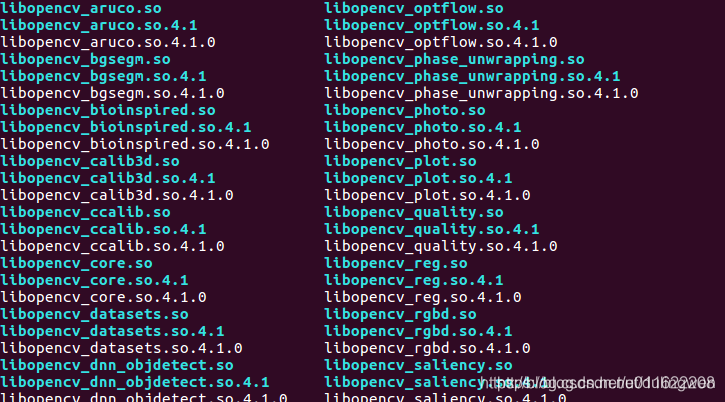

# 【opencv】ubuntu安装opencv4.2.0（支持cuda加速）

⌚️: 2021年5月1日

📚参考

- https://bbs.huaweicloud.com/blogs/186239

- https://blog.csdn.net/YuYunTan/article/details/85017065


---

## 一、下载opencv

网址：https://github.com/opencv

可以进入github下载，也可使用如下命令下载：

```bash
git clone https://github.com/Itseez/opencv.git
git clone https://github.com/Itseez/opencv_contrib.git      # gpu加速支持
```

下载后，将opencv_contrib文件夹移动到opencv中去。

## 二、安装opencv所需要的依赖库：

```bash
sudo apt-get install build-essential
sudo apt-get install cmake git libgtk2.0-dev pkg-config libavcodec-dev libavformat-dev libswscale-dev
sudo apt-get install python-dev python-numpy libtbb2 libtbb-dev libjpeg-dev libpng-dev libtiff-dev libjasper-dev libdc1394-22-dev
```

里面有些东西诸如cmake、git、python-dec、python-numpy一般早都安装好了，确定的话可以直接去掉。

> OpenCV安装libjasper-dev依赖包错误：E: Unable to locate package libjasper-dev
>
>
> OpenCV安装libjasper-dev依赖包出现如下错误：
>
> XXX@XXX:~/Files/opencv-3.1.0$ sudo apt-get install libjasper-dev
> Reading package lists... Done
> Building dependency tree       
> Reading state information... Done
> E: Unable to locate package libjasper-dev
>
> 解决方法：
>
> apt-get install software-properties-common
>
> sudo add-apt-repository "deb http://security.ubuntu.com/ubuntu xenial-security main"
> sudo apt update
> sudo apt install libjasper1 libjasper-dev
>
> 再次运行：
>
> sudo apt install libjasper1 libjasper-dev

## 三、编译opencv

**1.opencv目录下，创建build文件夹**
`mkdir build`

**2.进入build目录，执行cmake命令：**
参考第二篇文章不加opencv_contrib的编译

```bash
cmake -D CMAKE_INSTALL_PREFIX=/usr/local -D CMAKE_BUILD_TYPE=Release -D OPENCV_GENERATE_PKGCONFIG=ON -D ENABLE_CXX11=1 -D OPENCV_ENABLE_NONFREE=True ..

```

- 编译生成libopencv_world.so
  `-D BUILD_opencv_world=ON`

不要GPU加速支持

```bash
cmake -D CMAKE_INSTALL_PREFIX=/usr/local -D CMAKE_BUILD_TYPE=Release -D OPENCV_GENERATE_PKGCONFIG=ON -D ENABLE_CXX11=1 -D OPENCV_EXTRA_MODULES_PATH=../opencv_contrib/modules -D OPENCV_ENABLE_NONFREE=True ..
```

需要支持GPU加速：

**Opencv 4.5**

```bash
cmake -D CMAKE_INSTALL_PREFIX=/usr/local -D CMAKE_BUILD_TYPE=Release -D OPENCV_GENERATE_PKGCONFIG=ON -D ENABLE_CXX11=1 -D OPENCV_EXTRA_MODULES_PATH=../opencv_contrib/modules -D OPENCV_ENABLE_NONFREE=True -D INSTALL_PYTHON_EXAMPLES=ON -D INSTALL_C_EXAMPLES=ON -D WITH_CUDA=ON -D WITH_TBB=ON -D ENABLE_FAST_MATH=1 -D WITH_OPENMP=ON -D WITH_CUFFT=ON -D WITH_CUBLAS=ON ..
```

下面是我使用的

```shell
cmake -D CMAKE_INSTALL_PREFIX=/usr/local -D CMAKE_BUILD_TYPE=Release -D OPENCV_GENERATE_PKGCONFIG=ON -D ENABLE_CXX11=1 -D OPENCV_EXTRA_MODULES_PATH=../opencv_contrib/modules -D OPENCV_ENABLE_NONFREE=True -D INSTALL_PYTHON_EXAMPLES=ON -D INSTALL_C_EXAMPLES=ON -D WITH_CUDA=ON -D WITH_TBB=ON -D ENABLE_FAST_MATH=1 -D WITH_OPENMP=ON -D WITH_CUDNN=ON   -D WITH_CUFFT=ON -D WITH_CUBLAS=ON -DCUDA_ARCH_BIN=5.3,6.0,6.1,7.0,7.5 -DCUDA_ARCH_PTX=6.1 -D CUDNN_VERSION='8.2' -D CUDNN_INCLUDE_DIR='/usr/include/' -D WITH_GSTREAMER=ON  -D WITH_LIBV4L=ON -D BUILD_opencv_python2=ON -D BUILD_opencv_python3=ON -D BUILD_TESTS=OFF -D BUILD_PERF_TESTS=OFF -D BUILD_EXAMPLES=OFF -D OPENCV_DNN_CUDA=ON ..
```

注意：上面的cmake命令必须按照我的执行。

**Opencv 4.2**

```
cmake -D CMAKE_INSTALL_PREFIX=/usr/local -D CMAKE_BUILD_TYPE=Release -D OPENCV_GENERATE_PKGCONFIG=ON -D ENABLE_CXX11=1 -D OPENCV_EXTRA_MODULES_PATH=../opencv_contrib/modules -D OPENCV_ENABLE_NONFREE=True -D INSTALL_PYTHON_EXAMPLES=ON -D INSTALL_C_EXAMPLES=ON -D WITH_CUDA=ON -D WITH_TBB=ON -D ENABLE_FAST_MATH=1 -D WITH_OPENMP=ON -D WITH_CUFFT=ON -D WITH_CUBLAS=ON -DCUDA_ARCH_BIN=5.3,6.0,6.1,7.0,7.5 -DCUDA_ARCH_PTX=6.1 ..
```

> cudnn 8+ 、opencv4.2 会报错，需要将opencv升到4.4以上，或者将cudnn降低到7.x

```
cmake -D CMAKE_INSTALL_PREFIX=/usr/local -D CMAKE_BUILD_TYPE=Release -D OPENCV_GENERATE_PKGCONFIG=ON -D ENABLE_CXX11=1 -D OPENCV_EXTRA_MODULES_PATH=../opencv_contrib/modules -D OPENCV_ENABLE_NONFREE=True -D INSTALL_PYTHON_EXAMPLES=ON -D INSTALL_C_EXAMPLES=ON -D WITH_CUDA=ON -D WITH_TBB=ON -D ENABLE_FAST_MATH=1 -D WITH_OPENMP=ON -D WITH_CUDNN=ON   -D WITH_CUFFT=ON -D WITH_CUBLAS=ON -DCUDA_ARCH_BIN=5.3,6.0,6.1,7.0,7.5 -DCUDA_ARCH_PTX=6.1 -D CUDNN_VERSION=7.6 -D CUDNN_INCLUDE_DIR='/usr/include/' -D WITH_GSTREAMER=ON  -D WITH_LIBV4L=ON -D BUILD_opencv_python2=ON -D BUILD_opencv_python3=ON -D BUILD_TESTS=OFF -D BUILD_PERF_TESTS=OFF -D BUILD_EXAMPLES=OFF -D OPENCV_DNN_CUDA=ON ..

```

> 出现的问题
>
> Could NOT find CUDNN: Found unsuitable version "..", but required is at least "7.5" (found /usr/local/cuda/lib64/libcudnn.so)
>
> 解决：
>
> 检查一下系统是否正常安装好了cuDNN：dpkg -l | grep -i cudnn
>
> ```
> root@cbd2d316feeb:/# dpkg -l | grep -i cudnn
> hi  libcudnn8                            8.2.0.53-1+cuda10.2                 amd64        cuDNN runtime libraries
> ii  libcudnn8-dev                        8.2.0.53-1+cuda10.2                 amd64        cuDNN development libraries and headers
> ```
>
> cuDNN是有正常安装的，且版本为8.0，满足opencv安装使用的 at least "7.5"的需求。参考NVIDIA开发者论坛的一个帖子，声明cuDNN的版本进行安装，帖子的传送门如下：https://forums.developer.nvidia.com/t/opencv-4-2-0-and-cudnn-for-jetson-nano/112281/32，Oh，It’s worked。
>
> ```
> cmake -D WITH_CUDA=ON -D CUDA_ARCH_BIN="5.3"-D WITH_CUDNN=ON -D OPENCV_DNN_CUDA=ON  -D CUDNN_VERSION='8.0' -D CUDNN_INCLUDE_DIR='/usr/include/' -D CUDA_ARCH_PTX="" -D OPENCV_EXTRA_MODULES_PATH=../../opencv_contrib-4.3.0/modules -D WITH_GSTREAMER=ON -D WITH_LIBV4L=ON -D BUILD_opencv_python2=ON -D BUILD_opencv_python3=ON -D BUILD_TESTS=OFF -D BUILD_PERF_TESTS=OFF -D BUILD_EXAMPLES=OFF -D CMAKE_BUILD_TYPE=RELEASE -D CMAKE_INSTALL_PREFIX=/usr/local ..          
> ```

```
cmake -D CMAKE_BUILD_TYPE=RELEASE -D OPENCV_GENERATE_PKGCONFIG=ON -D ENABLE_CXX11=1 -D OPENCV_EXTRA_MODULES_PATH=../opencv_contrib/modules -D CMAKE_INSTALL_PREFIX=/usr/local -D INSTALL_PYTHON_EXAMPLES=ON -D INSTALL_C_EXAMPLES=OFF -D OPENCV_ENABLE_NONFREE=ON -D OPENCV_DNN_CUDA=ON -D WITH_CUDA=ON -D WITH_CUDNN=ON -D WITH_TBB=ON -D WITH_OPENMP=ON -D WITH_CUBLAS=1 -D WITH_CUFFT=ON -D WITH_LIBV4L=ON -D CUDA_FAST_MATH=1 -D CUDA_ARCH_BIN=6.1 -D CUDA_ARCH_PTX=6.1 -D CUDNN_VERSION=7.6 -D CUDNN_INCLUDE_DIR='/usr/include/' -D ENABLE_FAST_MATH=1 -D BUILD_opencv_python2=ON -D HAVE_opencv_python3=ON -D INSTALL_PYTHON_EXAMPLES=ON -D INSTALL_C_EXAMPLES=ON -D WITH_WEBP=OFF -D BUILD_TESTS=OFF -D BUILD_EXAMPLES=off ..
```

```
cmake -D CMAKE_BUILD_TYPE=RELEASE \
-D OPENCV_GENERATE_PKGCONFIG=ON \
-D ENABLE_CXX11=1 \
-D OPENCV_EXTRA_MODULES_PATH=../opencv_contrib/modules \
-D CMAKE_INSTALL_PREFIX=/usr/local \
-D INSTALL_PYTHON_EXAMPLES=ON \
-D INSTALL_C_EXAMPLES=OFF \
-D OPENCV_ENABLE_NONFREE=ON \
-D OPENCV_DNN_CUDA=ON \
-D WITH_CUDA=ON \ 
-D WITH_CUDNN=ON \
-D WITH_TBB=ON \
-D WITH_OPENMP=ON \
-D WITH_CUBLAS=1 \
-D WITH_CUFFT=ON \
-D WITH_LIBV4L=ON \
-D CUDA_FAST_MATH=1 \
-D CUDA_ARCH_BIN=6.1 \
-D CUDA_ARCH_PTX=6.1 \
-D CUDNN_VERSION=7.6 \
-D CUDNN_INCLUDE_DIR='/usr/include/' \
-D ENABLE_FAST_MATH=1 \
-D BUILD_opencv_python2=ON \
-D HAVE_opencv_python3=ON \
-D INSTALL_PYTHON_EXAMPLES=ON \
-D INSTALL_C_EXAMPLES=ON \
-D WITH_WEBP=OFF \
-D BUILD_TESTS=OFF \
-D BUILD_EXAMPLES=off ..
```


```
cmake -D CMAKE_BUILD_TYPE=RELEASE -D CMAKE_INSTALL_PREFIX=/usr/local -D INSTALL_PYTHON_EXAMPLES=ON -D INSTALL_C_EXAMPLES=OFF -D OPENCV_ENABLE_NONFREE=ON -D WITH_CUDA=ON -D WITH_CUDNN=ON -D OPENCV_DNN_CUDA=ON -D ENABLE_FAST_MATH=1 -D CUDA_FAST_MATH=1 -D CUDA_ARCH_BIN=6.1 -D WITH_CUBLAS=1 -D OPENCV_EXTRA_MODULES_PATH=../opencv_contrib/modules -D HAVE_opencv_python3=ON -D WITH_WEBP=OFF -D BUILD_EXAMPLES=off ..
```


**3.使用make开始编译**
`make -j8`
-j8是同时使用8核CPU来执行编译过程，这样速度比较快，具体需要根据自己的电脑情况修改。

> 可能报错：
> error：calling a constexpr **host** function(“abs”) from a **device** function(“abs”) is not allowed. The experimental flag ‘–expt-relaxed-constexpr’ can be used to allow this.
>
> **解决**
>
> 这可能和显卡的型号有关，我是1070.
>
> cmake时，添加编译选项-D CUDA_NVCC_FLAGS=–expt-relaxed-constexpr
>
> 
>
> ​       

**4.编译install**
`sudo make install`

然后在/usr/local/lib下可以看到编译的结果。

**5.卸载opencv**
`sudo make uninstall`

**6.手动卸载opencv**

```bash
sudo rm -r /usr/local/include/opencv4 
sudo rm -r /usr/local/include/opencv 
sudo rm -r /usr/include/opencv 
sudo rm -r /usr/include/opencv4 
sudo rm -r /usr/local/share/opencv 
sudo rm -r /usr/local/share/OpenCV 
sudo rm -r /usr/share/opencv 
sudo rm -r /usr/share/OpenCV 
sudo rm -r /usr/local/bin/opencv* 
sudo rm -r /usr/local/lib/libopencv*
sudo rm -r /usr/local/lib/pkgconfig/opencv4.pc
sudo rm -r /usr/local/lib/cmake/opencv4
```

## 四、配置环境

**1.配置pkg-config路經**

经过上面的步骤后，在/usr/local/lib/pkgconfig下生成了opencv4.pc文件，这个文件很重要，里面记录了OpenCV头文件、库文件的路經。需要进行如下配置：

```python
#进入 bash.bashrc
sudo gedit /etc/bash.bashrc
 
#在文件最后添加如下内容
PKG_CONFIG_PATH=$PKG_CONFIG_PATH:/usr/local/lib/pkgconfig
export PKG_CONFIG_PATH
 
#更新
sudo updatedb
```

可参考:[linux下编译安装opencv生成opencv.pc](https://blog.csdn.net/s15810751918/article/details/107705387) ，**pkg-config**的设置

> 1. 针对linux系统
>    执行`apt-get install mlocate`
>    安装完成`sudo updatedb`
> 2. 如果当前用户权限不够
>    遇到权限问题需要进入root
>    执行 `su root`
>    执行`apt-get unstall mlocate`

**2.配置库路經**

```python
#打开下列文件
sudo gedit /etc/ld.so.conf.d/opencv.conf 
 
# 添加lib路經
/usr/local/lib
 
# 更新
sudo ldconfig
```

NOTE：一切有关” cannot open shared object file: No such file or directory “的问题基本都可以通过上面的方式来解决（除非是操作系统里确实没有包含该共享库(lib*.so.*文件)或者共享库版本不对）

查看opencv版本号：

```
pkg-config --modversion opencv4
```

## 五、程序测试

**1. 在一个文件夹下，编写一个main.cpp文件，内容如下：**

```cpp
#include <iostream>
#include <opencv2/opencv.hpp>

using namespace std;
using namespace cv;

int main() {
    Mat img = imread("/home/yangna/deepblue/32_face_detect/centerface/readme/test.png");
    imshow("mat", img);
    waitKey(5000);
    std::cout << "Hello, World!" << std::endl;
    return 0;
}
```

**2. 编写CMakeLists.txt文件**
这个步骤，最简单的方式是去opencv的文件夹里直接复制一份过来，位置：/opencv/samples/cpp/example_cmake下，在里面修改部分内容如下所示：

```bash
#cmake_minimum_required(VERSION 3.14)
#project(4_test_opencv)
#
#set(CMAKE_CXX_STANDARD 11)
#
#add_executable(4_test_opencv main.cpp)

# cmake needs this line
cmake_minimum_required(VERSION 3.1)

# Enable C++11
set(CMAKE_CXX_STANDARD 11)
set(CMAKE_CXX_STANDARD_REQUIRED TRUE)

# Define project name
project(4_test_opencv)

# Find OpenCV, you may need to set OpenCV_DIR variable
# to the absolute path to the directory containing OpenCVConfig.cmake file
# via the command line or GUI
find_package(OpenCV REQUIRED)

# If the package has been found, several variables will
# be set, you can find the full list with descriptions
# in the OpenCVConfig.cmake file.
# Print some message showing some of them
message(STATUS "OpenCV library status:")
message(STATUS "    config: ${OpenCV_DIR}")
message(STATUS "    version: ${OpenCV_VERSION}")
message(STATUS "    libraries: ${OpenCV_LIBS}")
message(STATUS "    include path: ${OpenCV_INCLUDE_DIRS}")

# Declare the executable target built from your sources
add_executable(4_test_opencv main.cpp)

# Link your application with OpenCV libraries
target_link_libraries(4_test_opencv LINK_PRIVATE ${OpenCV_LIBS})
```

**3. 编译和运行**
进入刚才的文件，执行以下命令

```
cmake .
make
./4_test_opencv
```

然后会显示一张图片5秒钟
