# TensorRT源码编译+ONNX部署+CMake实战

⌚️: 2021年5月1日

📚参考

- 原文：https://zhuanlan.zhihu.com/p/346307138


---

**相关环境说明**

系统： Ubuntu16.04;
显卡： GTX 2080Ti;
CUDA： 10.2;
CUDNN： 8.0;
Cmake: 3.13.4;
TensorRT: 7.2.1.6;

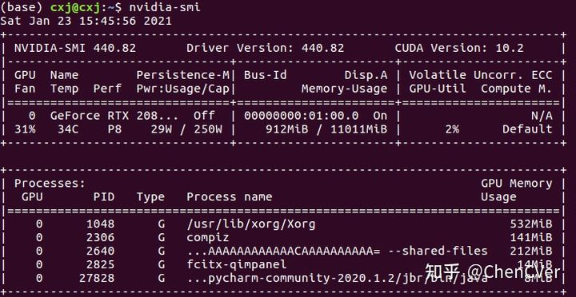


**相关库说明：**

**核心库1:** [https://github.com/NVIDIA/TensorRT](https://link.zhihu.com/?target=https%3A//github.com/NVIDIA/TensorRT)

说明：这是github上tensorrt的一个项目库。其介绍为：这个存储库包含了NVIDIA TensorRT的开源软件(OSS)组件。包括TensorRT插件和解析器(Caffe和ONNX)的源代码，以及演示TensorRT平台的用法和功能的样例应用程序。这些开放源码软件组件是TensorRT通用可用性(GA)发行版的一个子集，带有一些扩展和错误修复。简单来说，该仓库就是tensorrt GA的子集+拓展+例子，不能脱离 tensorrt GA

**核心库2**. [https://developer.nvidia.com/nvidia-tensorrt-7x-download](https://link.zhihu.com/?target=https%3A//developer.nvidia.com/nvidia-tensorrt-7x-download)

说明：TensorRT的核心库文件，所以上面github上的库，需要他才能编译

**核心库3**. [onnx/onnx-tensorrt](https://link.zhihu.com/?target=https%3A//github.com/onnx/onnx-tensorrt)

说明：将onnx模型转换成tensorrt的模型的一个库，需要上面的 tensorrt GA 才能编译，不需要上文的第一个。

## 一、安装

### 1. 下载TensorRT源码（核心库1）

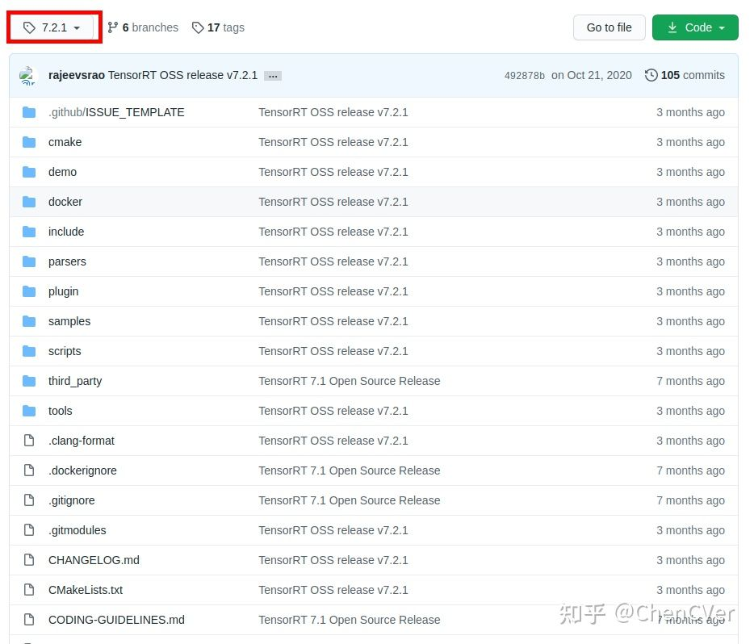

下载好源码后，进入到源码根目录(cd TensorRT/)，然后执行如下步骤：

export https_proxy=http://192.168.1.145:7890 http_proxy=http://192.168.1.145:7890 all_proxy=socks5://192.168.1.145:7890

**git submodule update --init --recursive**

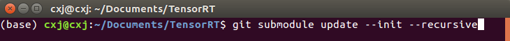

上述这一步主要是下载各种依赖库到TensorRT文件夹中，属于git操作.

### 2. 下载TensorRT的核心库（核心库2）

这个需要根据对应的系统平台和CUDA版本下载对应的库即可，我下载的是如下图所示：

网址：[https://developer.nvidia.com/nvidia-tensorrt-7x-download](https://link.zhihu.com/?target=https%3A//developer.nvidia.com/nvidia-tensorrt-7x-download)

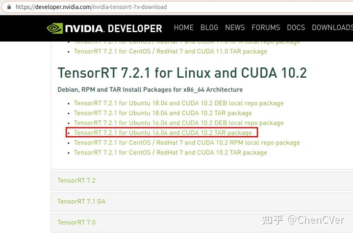

下载好之后，这里需要将整个文件夹复制到**核心库1文件夹**中，如下文件夹图所示：

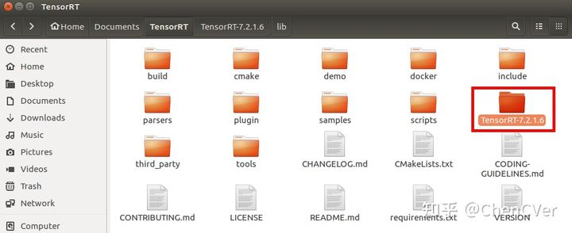

### 3. 编译TensorRT：

在TensorRT的根目录下敲入如下一系列命令（**主要是设置环境变量**）：

我给放到了`~/.bashrc`中

```text
export TRT_SOURCE='pwd'
export TRT_RELEASE='pwd'/TensorRT-7.2.2.3
export TENSORRT_LIBRARY_INFER=$TRT_RELEASE/targets/x86_64-linux-gnu/lib/libnvinfer.so.7
export TENSORRT_LIBRARY_INFER_PLUGIN=$TRT_RELEASE/targets/x86_64-linux-gnu/lib/libnvinfer_plugin.so.7
export TENSORRT_LIBRARY_MYELIN=$TRT_RELEASE/targets/x86_64-linux-gnu/lib/libmyelin.so
```

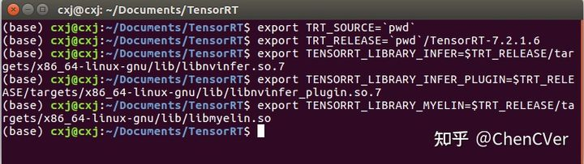

在正式编译之前，需要更改TensorRT/Cmakelist.txt的一些东西，需要将默认的CUDA和CUDNN版本换掉：

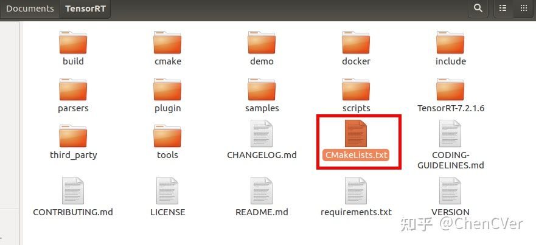

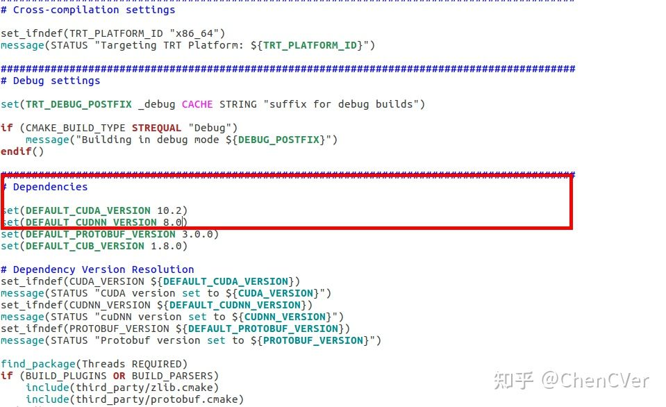

现在开始编译，继续在终端中敲入如下指令集(**同样是在：~/Documents/TensorRT**)：

```text
mkdir -p build && cd build
cmake .. -DTRT_LIB_DIR=$TRT_RELEASE/lib -DTRT_OUT_DIR='pwd'/out
make -j$(nproc)
```

不要以为万事大吉，接下来会有一大堆奇怪的报错，报错1：

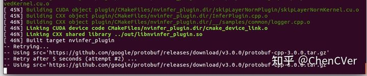

解决办法：
第一步：首先，手动将所需要的这个包给下载下来，放到指定文件夹中：
对应的下载地址为：[https://github.com/google/protobuf/releases/download/v3.0.0/protobuf-cpp-3.0.0.tar.gz](https://link.zhihu.com/?target=https%3A//github.com/google/protobuf/releases/download/v3.0.0/protobuf-cpp-3.0.0.tar.gz)
第二步：将下载好的压缩包放到如下文件路径下：
/home/cxj/Documents/TensorRT/build/third_party.protobuf/src/

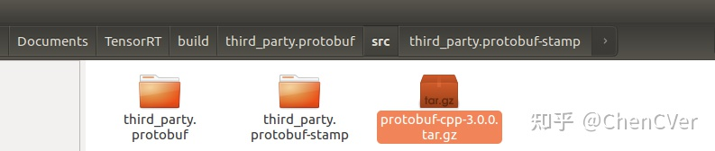

其实错误信息已经提示的很详细了！
第三步(**这步很重要**)：根据错误提示，我们这里还需要对cmake文件进行修改，这个文件是：
/home/cxj/Documents/TensorRT/build/third_party.protobuf/src/third_party.protobuf-stamp/download-third_party.protobuf.cmake

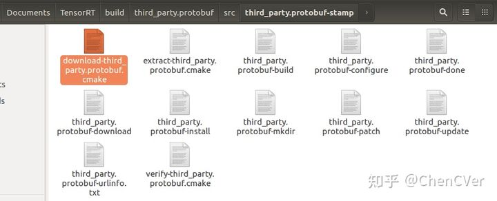

打开之后，把下述部分直接删掉（我这里没办法全部显示出来，反正就是从这个if(EXISTS)一直到该文件最后一行全部给他删掉）：

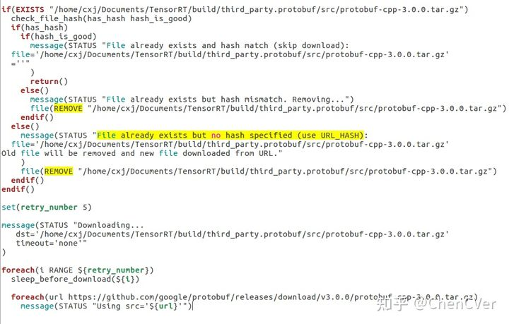

进行完上述三步之后，重新执行命令：**make -j$(nproc)**，继续开始编译，如果顺畅的话应该能全部编译完成，但是，如果你的cudnn版本不对，则在编译过程中会出现如下报错：

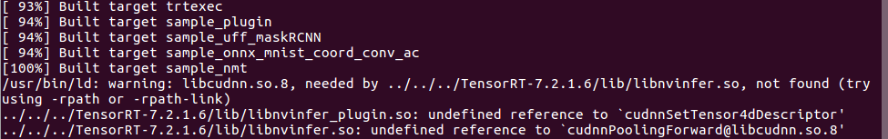

根据上述报提示，其实你发现编译过程已经到了[100%]，基本上已经完成了，现在在开始编译一些sample示例而已，这里错误提示是需要libcudnn.so.8文件，也就是CUDNN文件。如果你安装了CUNDD，可以在路径：**/usr/local/cuda/lib64**，找到libcudnn.so和libcudnn.so.8这两个库文件(因为我们正常安装CUDA后，再安装cudnn，是下载cudnn文件压缩包，然后解压将lib64文件夹下的libcudnn.so和libcudnn.so.8两个文件复制到上述cuda对应的路径中(/usr/local/cuda/lib64)即可)。提示一下，如果你没有安装CUDNN，那就需要去NVIDIA官网下载对应的CUDNN文件，然后安装上述步骤执行即可。怎么解决这个bug呢，我是将libcudnn.so和libcudnn.so.8这两个文件我直接复制到：**~/Documents/TensorRT/TensorRT-7.2.1.6/lib/**下即可，然后再重新进行编译，即可完成编译。

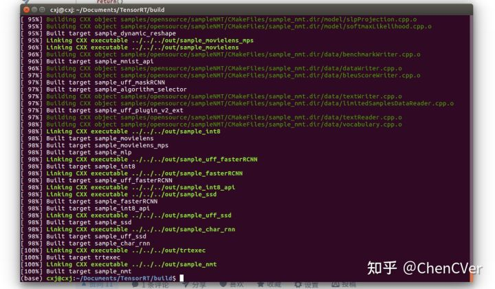

## 二、Cmake(IDE: CLion)实战

在Clion中新建一个Cmake工程，工程目录如下：

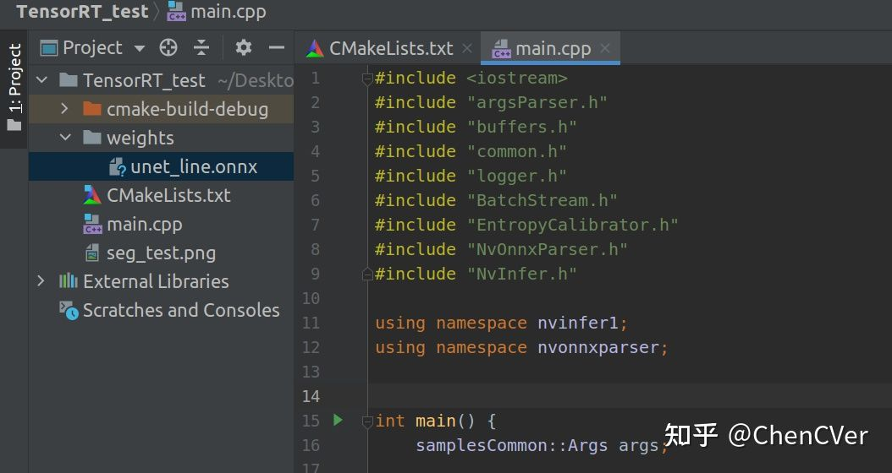

其中CmakeList.txt文件内容如下所示：

```cmake
cmake_minimum_required(VERSION 3.13)
project(TensorRT_test)
set(CMAKE_CXX_STANDARD 11)
add_executable(TensorRT_test main.cpp)
# add OpenCV
# set(OpenCV_DIR /home/cxj/Documents/opencv-3.4.2/build/CMakeFiles)
# find_package(OpenCV)
# target_link_libraries(TensorRT_test ${OpenCV_LIBS})
# add TensorRT7
# https://blog.csdn.net/dengwanyu/article/details/86710735
include_directories(/home/cxj/Documents/TensorRT/TensorRT-7.2.1.6/include)
include_directories(/home/cxj/Documents/TensorRT/TensorRT-7.2.1.6/samples/common)
set(TENSORRT_LIB_PATH “/home/cxj/Documents/TensorRT/TensorRT-7.2.1.6/lib”)
file(GLOB LIBS “${TENSORRT_LIB_PATH}/*.so”)
# add CUDA
find_package(CUDA 10.2 REQUIRED)
message(“CUDA_LIBRARIES:${CUDA_LIBRARIES}”)
message(“CUDA_INCLUDE_DIRS:${CUDA_INCLUDE_DIRS}”)
include_directories(${CUDA_INCLUDE_DIRS})
# 和文件连在一起
target_link_libraries(TensorRT_test ${LIBS} ${CUDA_LIBRARIES})
```

如果你写完CmakeList.txt之后，更新，其Clion的下面提示：

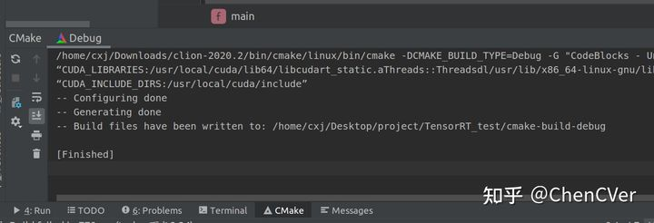

说明我们就可以正常用TensorRT库了。

其中main.cpp中的内容我是直接复制TensorRT提供的官方demo，其代码位于：/home/cxj/Documents/TensorRT/samples/opensource/sampleOnnxMNIST/sampleOnnxMNIST.cpp，大家可以直接copy就行了。


**【小知识】**：我们知道C/C++文件编译后在win系统中生成.dll和.lib文件，别人想调用你的代码，你只需要给他提供一个.lib或者.dll文件即可，其中.lib是静态链接库，.dll是动态链接库，他们都是.h和.c/.cpp的集成，通常都是放在lib文件夹中。怎么区分呢？这里说一下，一般还有个include文件夹用来专门放头文件的，一般我们设置链接库的路径包含别人的include文件夹路径即可，这样代码调用时候，他会自动进入lib文件夹中追溯到对应的实现。

比如我在写代码的时候需要#include别人的东西，这个时候，我就需要别人的.lib文件了，我需要知道别人include文件夹路径即可，就可以正常的#include你的代码了，在我开始编译代码生成.lib和.dll的时候，别人的.lib就被我全部包含了。还有一张情况，就是我编译好代码生成一个.exe后，我再要去调用别人的代码，那这时候时候需要将别人的.dll文件和我的.exe文件放在同级目录下，就可以调用了。
在ubuntu系统下，其.dll和.lib文件变为.so文件，也会有专门的lib文件夹来存放，还有个include文件夹用来存放头文件。

> Make install
>
> Install the project...
>
> -- Install configuration: "Release"
>
> -- Installing: /usr/local/TensorRT/TensorRT-7.0.0.11/lib/../lib/libnvinfer_plugin.so.7.0.0.1
>
> -- Installing: /usr/local/TensorRT/TensorRT-7.0.0.11/lib/../lib/libnvinfer_plugin.so.7.0.0
>
> -- Up-to-date: /usr/local/TensorRT/TensorRT-7.0.0.11/lib/../lib/libnvinfer_plugin.so
>
> -- Installing: /usr/local/TensorRT/TensorRT-7.0.0.11/lib/../lib/libnvcaffeparser.so.7.0.0.1
>
> -- Installing: /usr/local/TensorRT/TensorRT-7.0.0.11/lib/../lib/libnvcaffeparser.so.7.0.0
>
> -- Installing: /usr/local/TensorRT/TensorRT-7.0.0.11/lib/../lib/libnvcaffeparser.so
>
> -- Installing: /usr/local/TensorRT/TensorRT-7.0.0.11/lib/../bin/onnx2trt
>
> -- Installing: /usr/local/TensorRT/TensorRT-7.0.0.11/lib/../lib/libnvonnxparser.so.7.0.0
>
> -- Up-to-date: /usr/local/TensorRT/TensorRT-7.0.0.11/lib/../lib/libnvonnxparser.so.7
>
> -- Up-to-date: /usr/local/TensorRT/TensorRT-7.0.0.11/lib/../lib/libnvonnxparser.so
>
> -- Installing: /usr/local/TensorRT/TensorRT-7.0.0.11/lib/../lib/libnvonnxparser_static.a
>
> -- Installing: /usr/local/TensorRT/TensorRT-7.0.0.11/lib/../include/NvOnnxParser.h
>
> -- Installing: /usr/local/TensorRT/TensorRT-7.0.0.11/lib/../bin/sample_char_rnn
>
> -- Installing: /usr/local/TensorRT/TensorRT-7.0.0.11/lib/../bin/sample_dynamic_reshape
>
> -- Installing: /usr/local/TensorRT/TensorRT-7.0.0.11/lib/../bin/sample_fasterRCNN
>
> -- Installing: /usr/local/TensorRT/TensorRT-7.0.0.11/lib/../bin/sample_googlenet
>
> -- Installing: /usr/local/TensorRT/TensorRT-7.0.0.11/lib/../bin/sample_int8
>
> -- Installing: /usr/local/TensorRT/TensorRT-7.0.0.11/lib/../bin/sample_int8_api
>
> -- Installing: /usr/local/TensorRT/TensorRT-7.0.0.11/lib/../bin/sample_mlp
>
> -- Installing: /usr/local/TensorRT/TensorRT-7.0.0.11/lib/../bin/sample_mnist
>
> -- Installing: /usr/local/TensorRT/TensorRT-7.0.0.11/lib/../bin/sample_mnist_api
>
> -- Installing: /usr/local/TensorRT/TensorRT-7.0.0.11/lib/../bin/sample_movielens
>
> -- Installing: /usr/local/TensorRT/TensorRT-7.0.0.11/lib/../bin/sample_movielens_mps
>
> -- Installing: /usr/local/TensorRT/TensorRT-7.0.0.11/lib/../bin/sample_nmt
>
> -- Installing: /usr/local/TensorRT/TensorRT-7.0.0.11/lib/../bin/sample_onnx_mnist
>
> -- Installing: /usr/local/TensorRT/TensorRT-7.0.0.11/lib/../bin/sample_plugin
>
> -- Installing: /usr/local/TensorRT/TensorRT-7.0.0.11/lib/../bin/sample_reformat_free_io
>
> -- Installing: /usr/local/TensorRT/TensorRT-7.0.0.11/lib/../bin/sample_ssd
>
> -- Installing: /usr/local/TensorRT/TensorRT-7.0.0.11/lib/../bin/sample_uff_fasterRCNN
>
> -- Installing: /usr/local/TensorRT/TensorRT-7.0.0.11/lib/../bin/sample_uff_maskRCNN
>
> -- Installing: /usr/local/TensorRT/TensorRT-7.0.0.11/lib/../bin/sample_uff_mnist
>
> -- Installing: /usr/local/TensorRT/TensorRT-7.0.0.11/lib/../bin/sample_uff_plugin_v2_ext
>
> -- Installing: /usr/local/TensorRT/TensorRT-7.0.0.11/lib/../bin/sample_uff_ssd
>
> -- Installing: /usr/local/TensorRT/TensorRT-7.0.0.11/lib/../bin/trtexec
