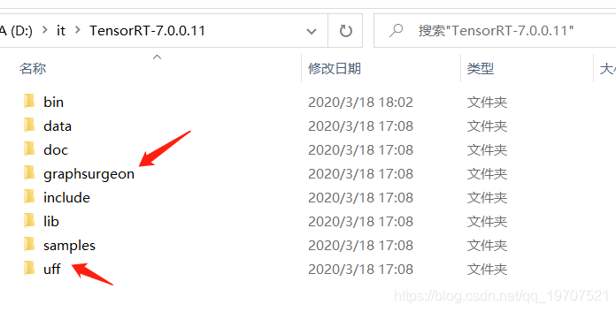
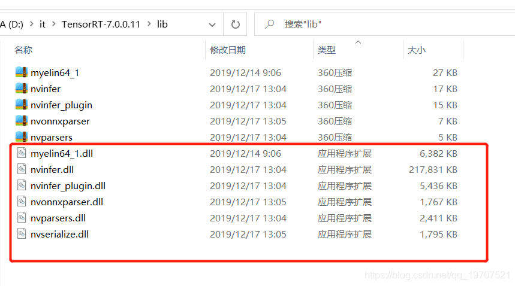
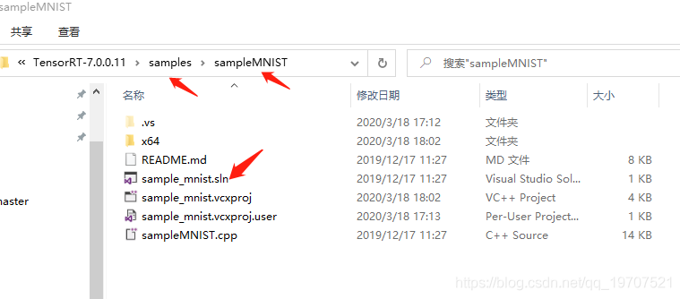
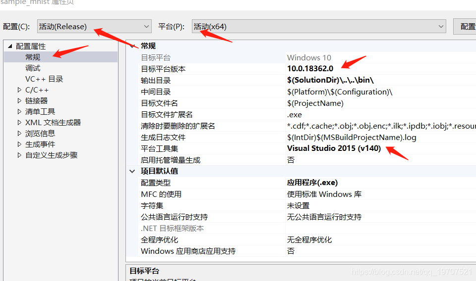
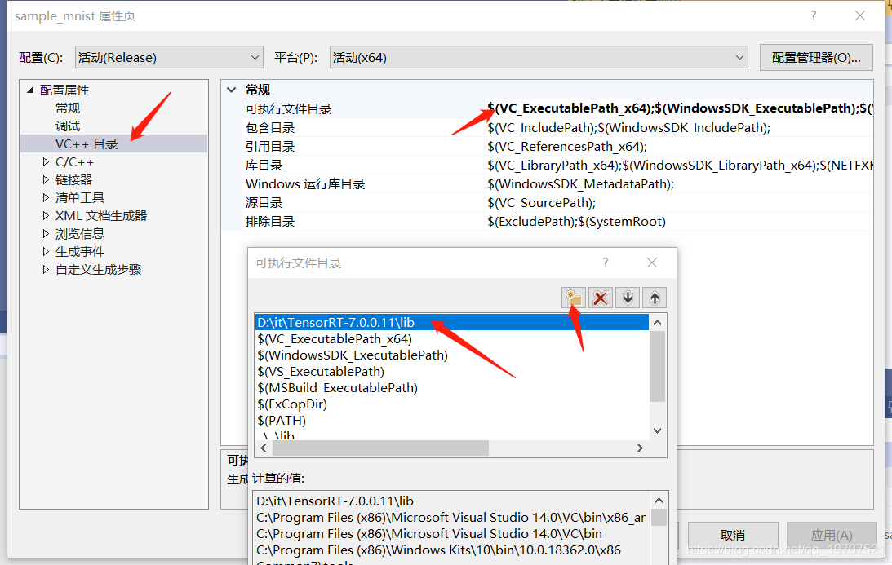
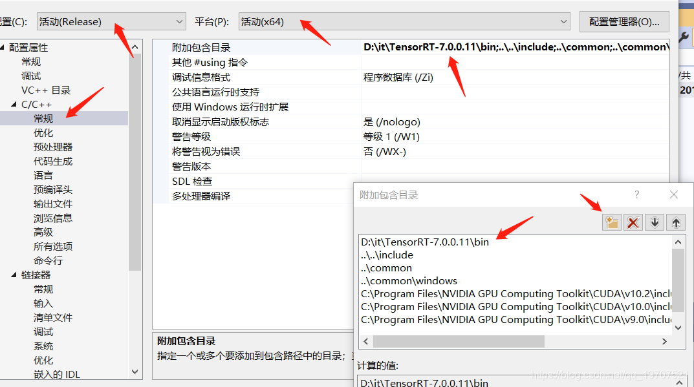
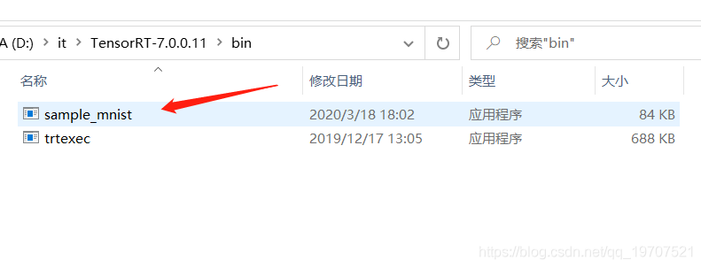
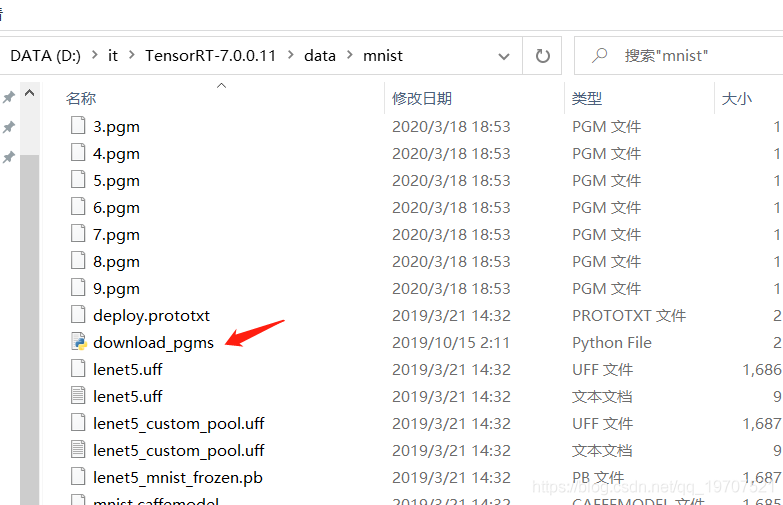
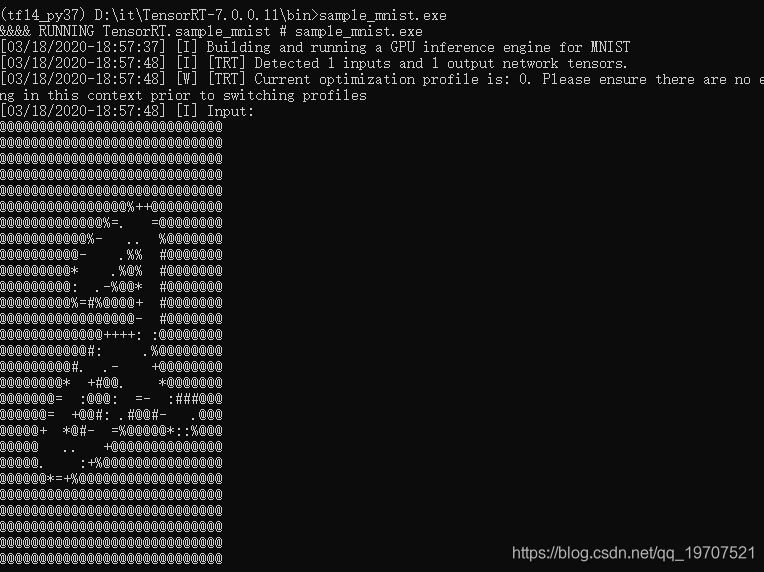

# windows 下安装tensorRT

⌚️: 2021年5月1日

📚参考

---

> \1. 去这个地方下载对应的版本[https://developer.nvidia.com/nvidia-tensorrt-7x-download](https://link.zhihu.com/?target=https%3A//developer.nvidia.com/nvidia-tensorrt-7x-download)
> \2. 下载完成后，解压。
> \3. 将 TensorRT-7.0.0.11\include中头文件 copy 到C:\Program Files\NVIDIA GPU Computing Toolkit\CUDA\v10.0\include
> \4. 将TensorRT-7.0.0.11\lib 中所有lib文件 copy 到C:\Program Files\NVIDIA GPU Computing Toolkit\CUDA\v10.0\lib\x64
> \5. 将TensorRT-7.0.0.11\lib 中所有dll文件copy 到C:\Program Files\NVIDIA GPU Computing Toolkit\CUDA\v10.0\bin
> \6. 用VS2015 打开 TensorRT-7.0.0.11\samples\sampleMNIST\sample_mnist.sln
> \7. 在VS2015中，右键工程，选择属性-》配置属性-》常规-》目标平台版本-》8.1
> \8. 在VS2015中，右键工程，选择属性-》配置属性-》常规-》平台工具集-》vs2015(v140)
> \9. 右键工程-》重新生成
> \10. 用anaconda 进入TensorRT-7.0.0.11\data\mnist 目录，执行python download_pgms.py
> \11. 如果提示没有PIL，执行conda install pillow
> \12. 进入TensorRT-7.0.0.11\bin，用cmd执行，sample_mnist.exe --datadir=d:\path\to\TensorRT-7.0.0.11\data\mnist\
> \13. 执行成功则说明tensorRT 配置成功

## 一、下载TensorRT

TensorRT 官方下载： [地址](https://developer.nvidia.com/nvidia-tensorrt-7x-download)


## 二、添加环境变量

PATH：D:\it\ TensorRT-7.0.0.11\lib （这是我的）


## 三、安装uff和graphsurgeon



分别找到： **graphsurgeon-0.4.1-py2.py3-none-any.whl** 与 **uff-0.6.5-py2.py3-none-any.whl**

```bash
pip install graphsurgeon-0.4.1-py2.py3-none-any.whl
pip install uff-0.6.5-py2.py3-none-any.whl
```


## 四、复制dll文件到cuda安装目录



把上面 的 dll 拷贝到： C:\Program Files\ NVIDIA GPU Computing Toolkit\CUDA\v10.0\bin （这是我的地址啦）


## 五、测试

**VS2019 打开-》 sample_mnist.sln**




**右键-》属性**








**右键-》生成**


**生成后文件的目录：**




**下载 mnist 数据：( python 运行即可)**




**运行 sample_mnist.exe**

