## Visual Studio2019安装与使用步骤

 ⌚️: 2020年10月21日

📚参考

----

## 1. 安装

学校使用的版本是2012版本，而现在讲的版本是2019版本，差别不大，个人认为2019更能胜任学习任务。

另外VS2019是完全免费的，版本越高越好了！毕竟C++都出了C++20对吧。

**Step 1：**

访问网站：[https://visualstudio.microsoft.com/zh-hans/downloads](https://visualstudio.microsoft.com/zh-hans/downloads/?rr=https%3A%2F%2Fwww.baidu.com%2Flink%3Furl%3DgQI79WFRhodN-7896MSdpsvkTL7D0LAblcqkBRlgMo72RQLvSx_DfKI7c3HkFqhAXYA6RqPZqw-ZEBKal4a4n_%26wd%3D%26eqid%3Db76d5d6b00386b00000000035d35d99e)[

](https://visualstudio.microsoft.com/zh-hans/downloads/?rr=https%3A%2F%2Fwww.baidu.com%2Flink%3Furl%3DgQI79WFRhodN-7896MSdpsvkTL7D0LAblcqkBRlgMo72RQLvSx_DfKI7c3HkFqhAXYA6RqPZqw-ZEBKal4a4n_%26wd%3D%26eqid%3Db76d5d6b00386b00000000035d35d99e)

如图：

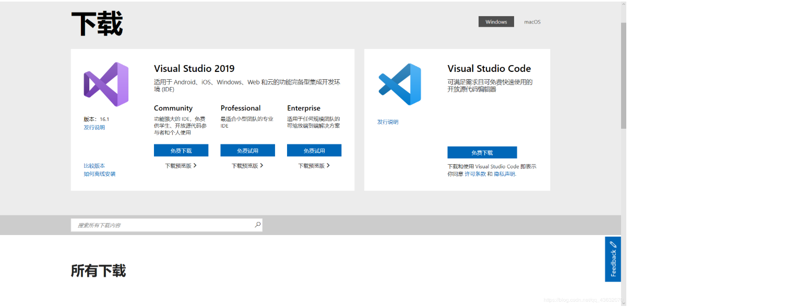

 

 


**Step 2：**

点击免费下载：（community版本）


 

 


**Step 3：**

安装：如图：

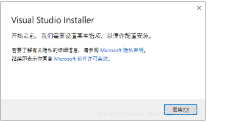

 

 


点击继续：

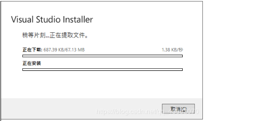

 

 


提取文件正常安装ing。

安装完成之后进入这个界面：

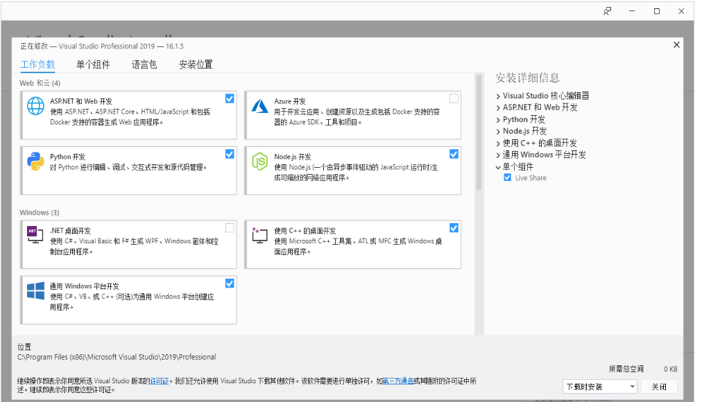

 

 


 主要选择这三个，其余为可选项，选不选都行：


 

 


**Step 4：**

点击下载时安装：


 

 


这个根据个人电脑的性能不同可以消耗的时间也不同，我的电脑大概需要1个小时所有，在安装的过程中是需要全程联网的，安装结束后，会提示重启电脑，然后我们点击“立刻重启”。

安装完成：

 

 

 

 


这个就是我们的Visual studio

**Step 5：**

现在我们来写一个Hello word！（也就是我们第一个程序）

打开visual studio


 

 

 


点击创建新项目：

 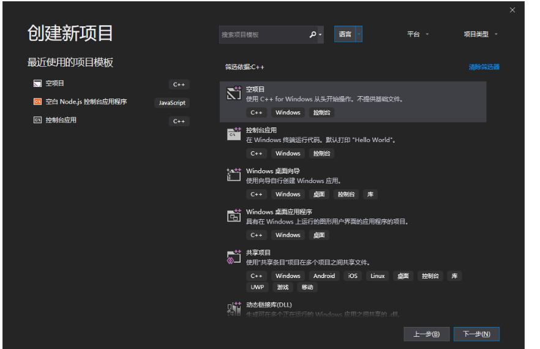

 

 


在语言选择C++语言：

 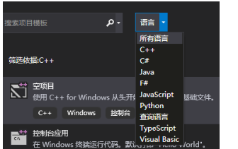

 

 


点击空项目：

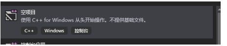

 

 


选择下一步：

‘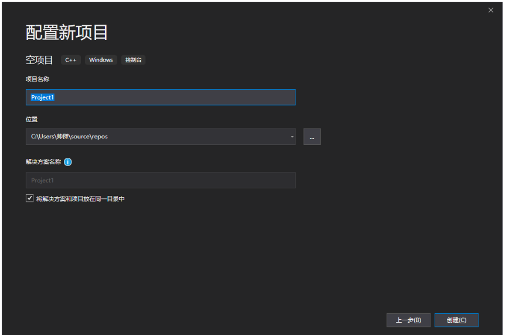

 

 


起名称选位置点击创建即创建成功。

**Step 6：**

点击文件，新建，项目：

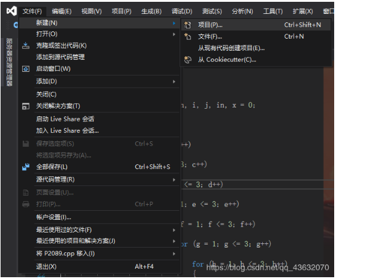

 

 


起名字，位置不用变，注意，齐=起名的时候后缀要保留（.cpp）

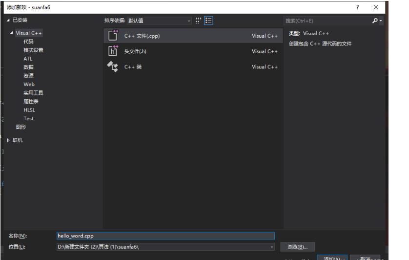

 

 


在当前方框中输入代码：

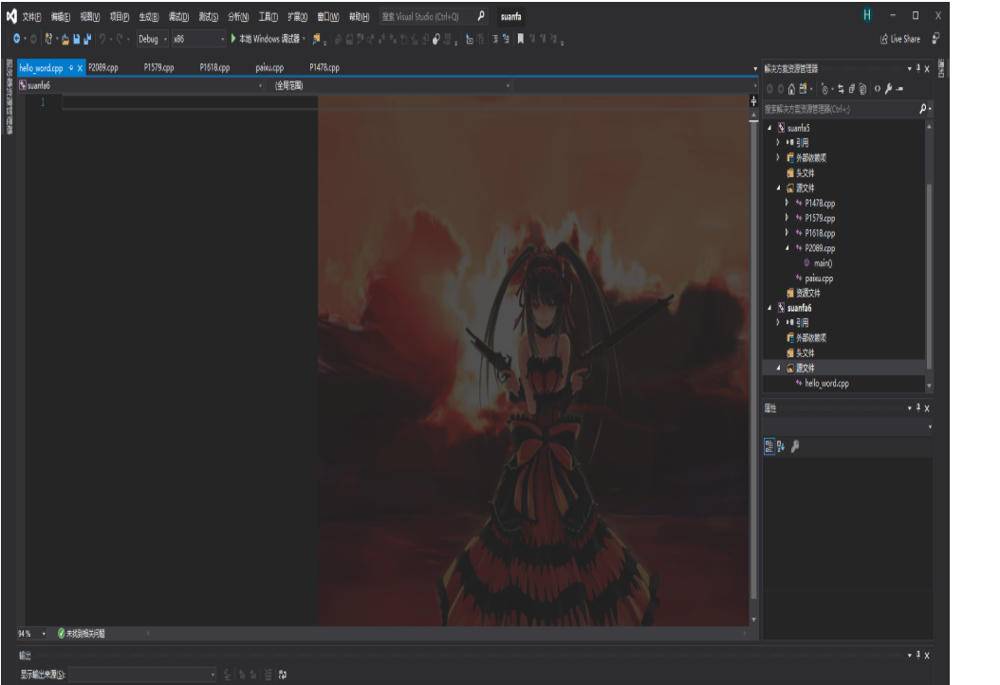

 

 


代码如下： 

```
#include<windows.h>
#include<iostream>
int main(void) {
	using namespace std;
	int x;
	x = MessageBox(GetForegroundWindow(), "Hello_Word!", "这是我的第一个程序", 1);
	cout << "留意弹窗哦！" << endl;
	cout << x;
	return 0;
}
```


 效果如图：

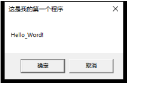

 

 


点击确定后：

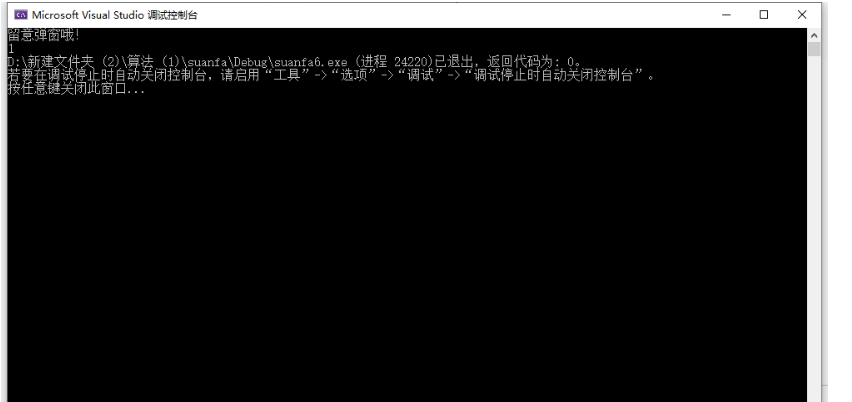

 

## 2. 添加静态库与动态库