## VS Code 安装与使用步骤

 ⌚️: 2021年8月1日

📚参考

- [在 vscode 中使用 cmake 一键运行 c++ 项目](https://zhuanlan.zhihu.com/p/144376188)
- [【宇宙最强编辑器VS Code】（十）使用VS Code + SSH进行远程开发](https://blog.csdn.net/Mculover666/article/details/90439669)

---

## 一、Mac + VS Code + CMake + C++

### 1.插件介绍

- C/C++ : 提供c++调试功能和一些智能提示


- C++ Intellisense: 智能提示

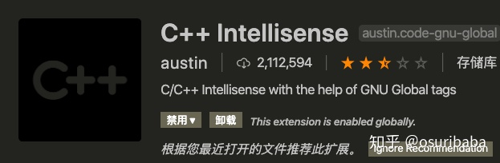

- CMake : 提供CMake支持的


- CMake Tools : 拓展CMake功能的

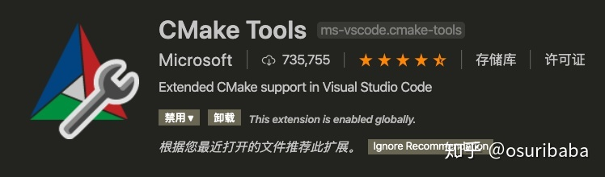

- macro-commander: 组合vscode命令的插件，可能用不上

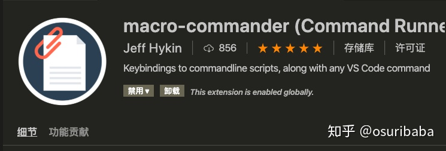

### 2. Demo

#### 2.1 编写代码

安装完插件之后，可以尝试随便创建一个c++项目。然后流畅地在里面写下 hello world !!!

CMakeLists.txt

```
cmake_minimum_required(VERSION 3.14)
project(Test)

set(CMAKE_CXX_STANDARD 14)
set(CMAKE_CXX_FLAGS "${CMAKE_CXX_FLAGS} -std=c++14 -ldl -pthread")

add_executable(demo main.cpp)

```

main.cpp

```
#include <stdio.h>
#include <vector>
#include <stdlib.h> 
#include <iostream> 
#include <string>
#include <assert.h>

int main(){
    int a = 9;
    float b = 1.0;
    std::cout<< "hello world!!"<<std::endl;
    std::cout<< "hello world!!"<<std::endl;
    std::cout<< "hello world!!"<<std::endl;

    return 0;
}
```


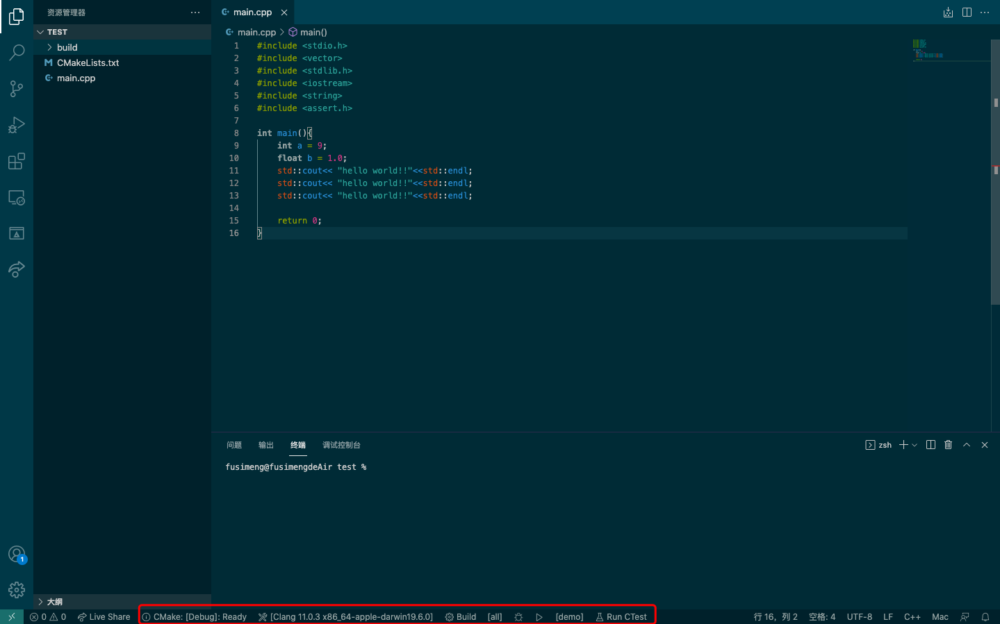

#### 2.2 cmake、make、debug

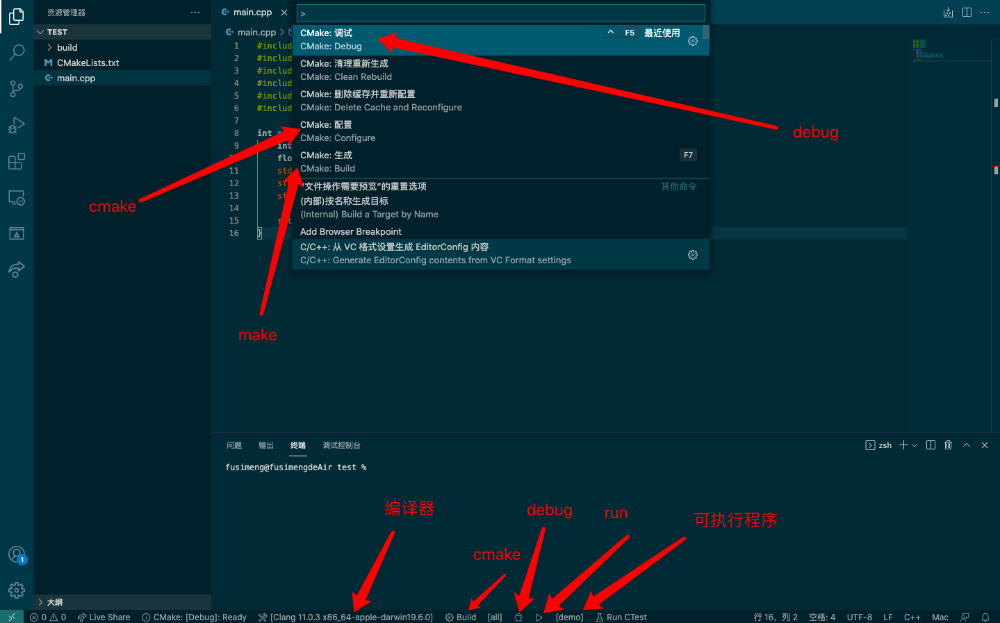

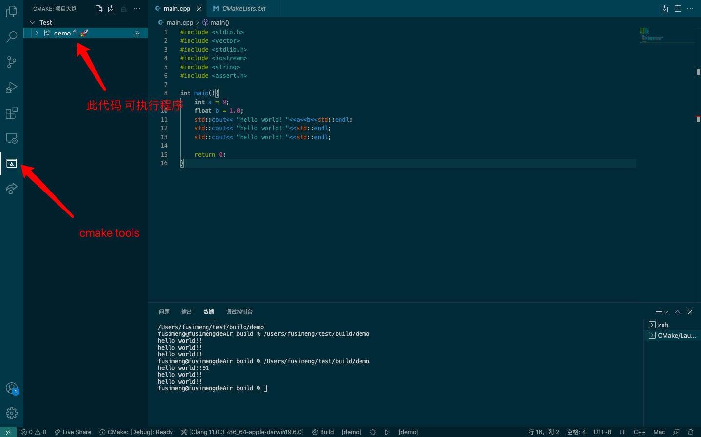

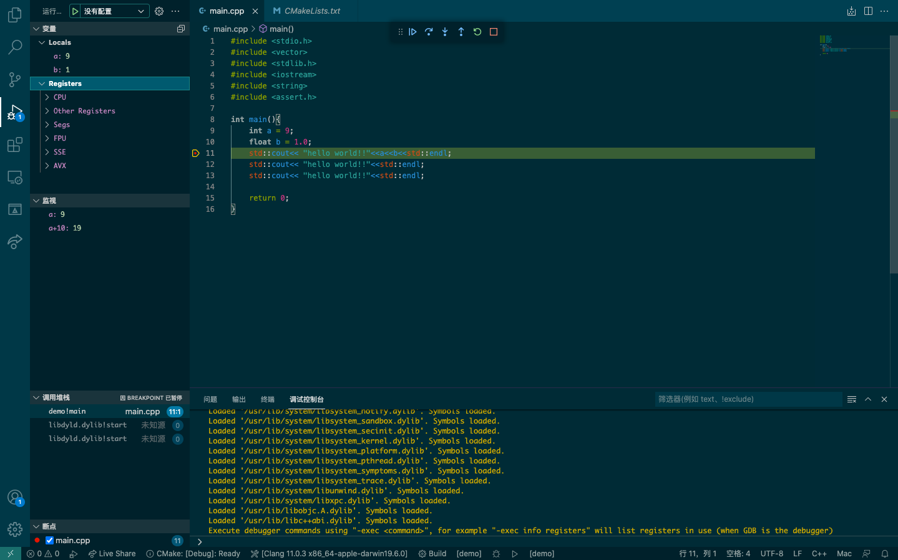

在cmake过程中需要指定解析器，我一开始用g++，但是不能debug，也许是mac系统的原因

## 二、Mac + VS Code + Python

### 1. 插件介绍

- Python扩展

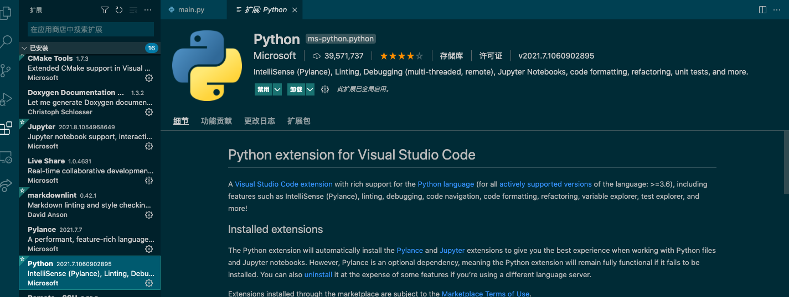

### 2. Demo

#### 2.1 编写代码

```
import os

for path in os.listdir("./"):
    print(path)

a = 99

b = 100

print("hello world")
```

#### 2.2 选择解析器

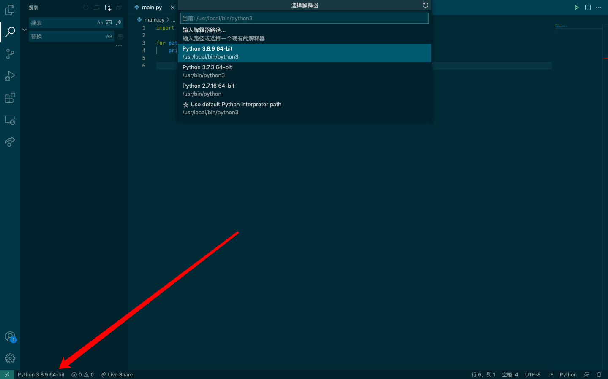

#### 2.3 debug

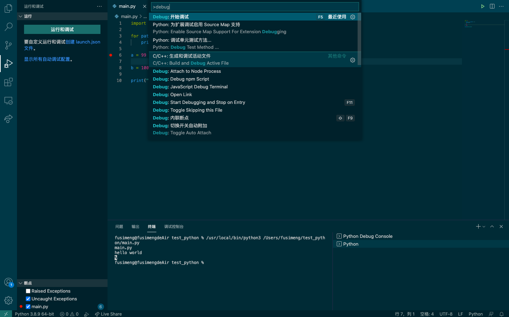

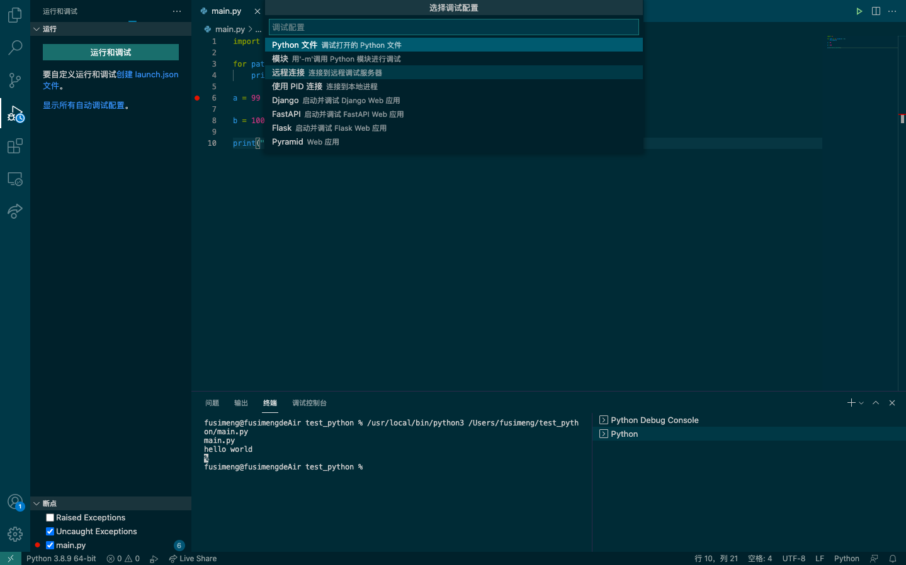

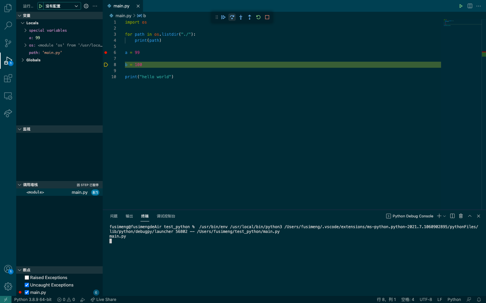

#### 2.4 运行

## 三、Mac + VS Code + Python + 远程调试

**注意，在远程开发的时候扩展分为本地扩展和远程扩展：**

### 1. 远程服务器

**确保远程主机安装了ssh-server**

特别注意：**SSH扩展只能连接64位的Linux操作系统。**


### 2. 插件介绍

#### 2.1 remote development介绍

**使用remote development插件进行远程访问**

remote development 插件提供功能：

- 远程连接服务器
- 直接访问远程的文件夹
- 能够远程运行环境
- 能够远程debug
- 可以为远程安装vscode插件

remote development插件的优点：

- 功能比较齐全，能够远程完成所有操作，不需要本地文件的复制 
- 远程debug比较厉害
- 提供终端，不需要额外软件开一个终端

remote development插件的缺点：

- 占用内存，cpu量比较大。8G内存，开一个chrome开一个vscode直接到85%+
- 他会有两个附属的插件，你不得不下，其实还蛮有用的
- 每次进入需要输入密码，可以进行配置，但是嫌麻烦，没有配置，这样也稍微安全一点。
- 需要安装open-ssh,进行配置，配置过程比sftp麻烦一点。

搜索remote development插件，并进行安装，安装的时候会将其他两个插件一并安装的。

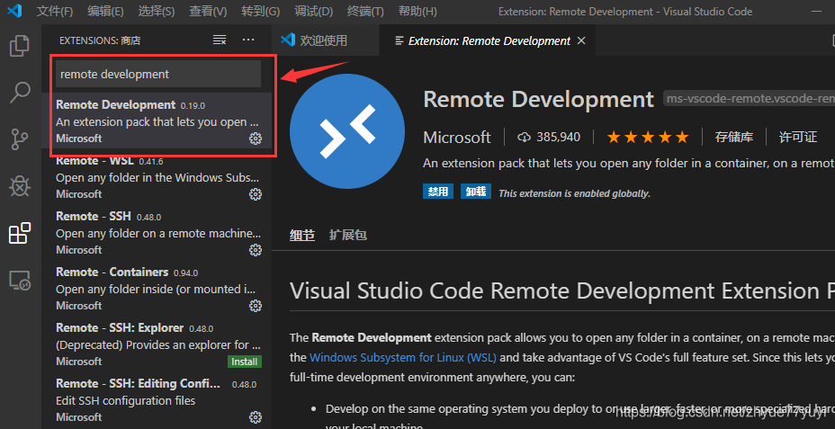

#### 2.2 remote development配置


##### **设置SSH扩展显示登录终端**

打开命令面板，输入`ssh`，选择设置：
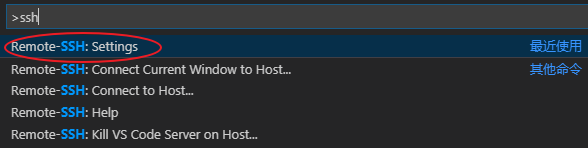

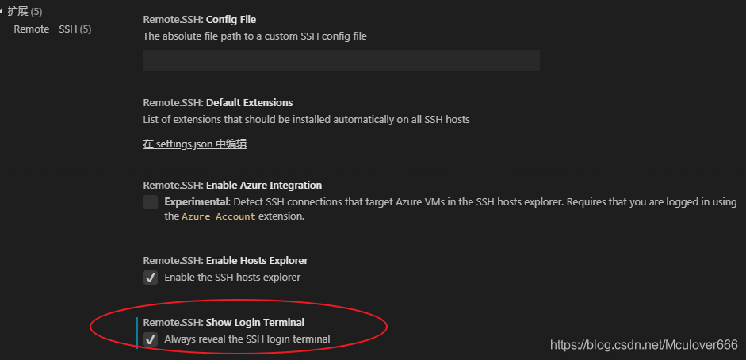


##### **启动SSH连接远程主机**

SSH启动的方式有两种：

- 使用`Ctrl+Shift+P`打开命令面板，输入`ssh`，选择`Connect to Host`：
  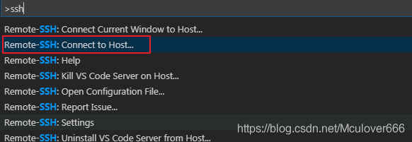
- 直接点击左下角的ssh图标：
  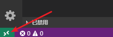


启动之后输入远程主机的用户名和ip地址，按回车进行连接：
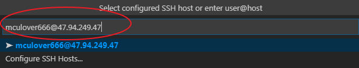

所以会显示出SSH登录终端，输入用户的密码即可：
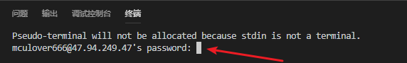

首次登录后，VS Code会自动弹出一个新的窗口用于远程工作，并且会自动在远程主机上安装VS Code server：
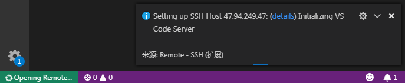

**在登录过程中需要不断的输入密码**，只要弹出就输入密码即可，如图：

登录成功后如图：
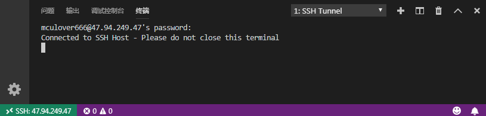

> 修改配置
>
> 点击左下角绿色的ssh图标：
>
> 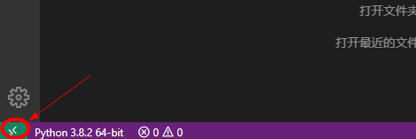
>
> 选择Connect to host：
>
> 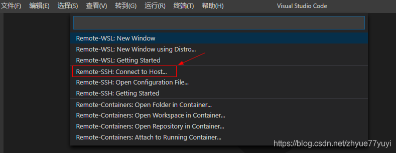
>
> 也可使用`Ctrl+Shift+P`打开命令面板，输入`ssh进行搜索到`：
>
> 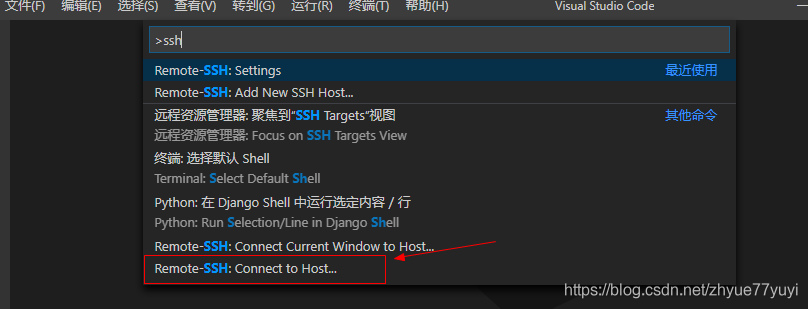
>
> 启动之后输入远程主机的用户名和ip地址，按回车进行连接，比如root@111.44.254.168：
>
> 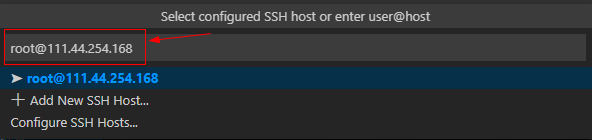
>
> 如果经常登录这个主机，需要将其保存在配置文件中：
>
> 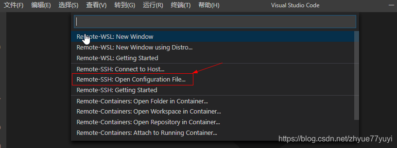
>
> 然后这里我选择第一个，然后会打开一个config文件：
>
> 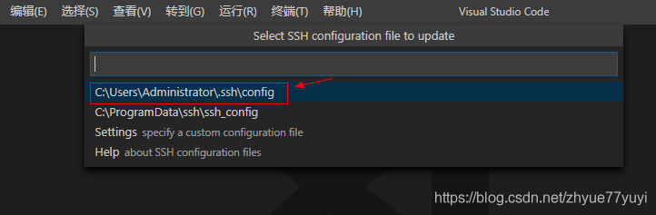
>
> 将对应的信息填入其中，保存：
>
> 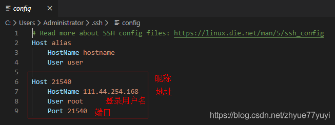
>
> 以后连接host的时候就有该主机了，直接点击就好，不用像上面那样再次输入【用户名@地址】了。
>
> 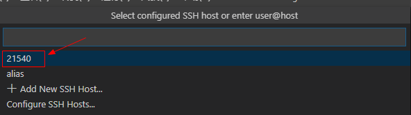
>
> 

#### 2.3.打开远程目录作为工作区

接下来可以点击资源管理器打开远程目录了：

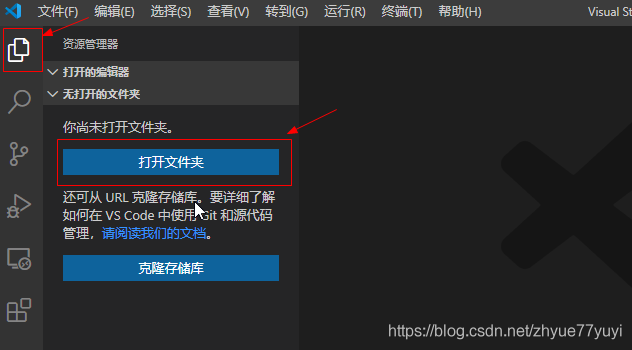

最后，成功运行界面如下：

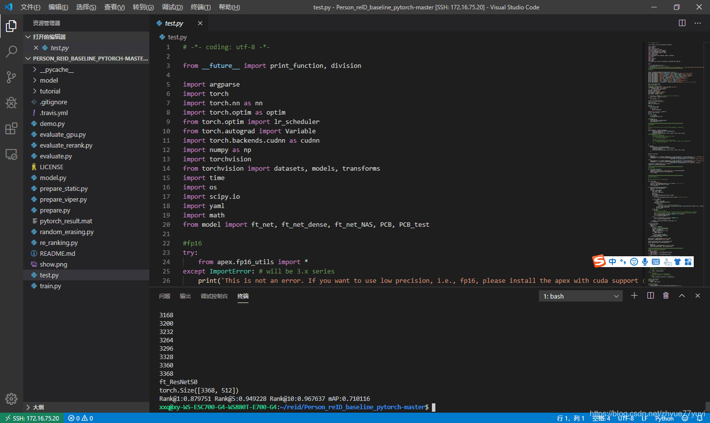

## 四、Mac + VS Code + C++ +远程调试

C++与Python类似，主要是在远程也要添加个c++内容，现在vscode用起来很方便。不需要配置太多内容