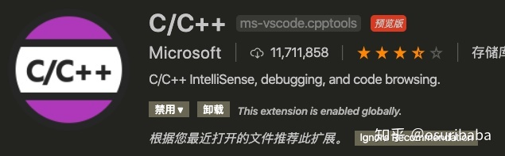

## VS Code 安装与使用步骤

 ⌚️: 2021年8月1日

📚参考

- [在 vscode 中使用 cmake 一键运行 c++ 项目](https://zhuanlan.zhihu.com/p/144376188)
- [【宇宙最强编辑器VS Code】（十）使用VS Code + SSH进行远程开发](https://blog.csdn.net/Mculover666/article/details/90439669)
- https://zhuanlan.zhihu.com/p/141344165

---

## 一、Mac + VS Code + CMake + C++

### 1.插件介绍

- C/C++ : 提供c++调试功能和一些智能提示



- C++ Intellisense: 智能提示


- CMake : 提供CMake支持的


- CMake Tools : 拓展CMake功能的


- macro-commander: 组合vscode命令的插件，可能用不上


### 2. Demo

#### 2.1 编写代码

安装完插件之后，可以尝试随便创建一个c++项目。然后流畅地在里面写下 hello world !!!

CMakeLists.txt

```
cmake_minimum_required(VERSION 3.14)
project(Test)

set(CMAKE_CXX_STANDARD 14)
set(CMAKE_CXX_FLAGS "${CMAKE_CXX_FLAGS} -std=c++14 -ldl -pthread")

add_executable(demo main.cpp)

```

main.cpp

```
#include <stdio.h>
#include <vector>
#include <stdlib.h> 
#include <iostream> 
#include <string>
#include <assert.h>

int main(){
    int a = 9;
    float b = 1.0;
    std::cout<< "hello world!!"<<std::endl;
    std::cout<< "hello world!!"<<std::endl;
    std::cout<< "hello world!!"<<std::endl;

    return 0;
}
```


#### 2.2 cmake、make、debug


在cmake过程中需要指定解析器，我一开始用g++，但是不能debug，也许是mac系统的原因

## 二、Mac + VS Code + Python

### 1. 插件介绍

- Python扩展


### 2. Demo

#### 2.1 编写代码

```
import os

for path in os.listdir("./"):
    print(path)

a = 99

b = 100

print("hello world")
```

#### 2.2 选择解析器


#### 2.3 debug


#### 2.4 运行

## 三、Mac + VS Code + Python + 远程调试

**注意，在远程开发的时候扩展分为本地扩展和远程扩展：**

### 1. 远程服务器

**确保远程主机安装了ssh-server**

特别注意：**SSH扩展只能连接64位的Linux操作系统。**


### 2. 插件介绍

#### 2.1 remote development介绍

**使用remote development插件进行远程访问**

remote development 插件提供功能：

- 远程连接服务器
- 直接访问远程的文件夹
- 能够远程运行环境
- 能够远程debug
- 可以为远程安装vscode插件

remote development插件的优点：

- 功能比较齐全，能够远程完成所有操作，不需要本地文件的复制 
- 远程debug比较厉害
- 提供终端，不需要额外软件开一个终端

remote development插件的缺点：

- 占用内存，cpu量比较大。8G内存，开一个chrome开一个vscode直接到85%+
- 他会有两个附属的插件，你不得不下，其实还蛮有用的
- 每次进入需要输入密码，可以进行配置，但是嫌麻烦，没有配置，这样也稍微安全一点。
- 需要安装open-ssh,进行配置，配置过程比sftp麻烦一点。

搜索remote development插件，并进行安装，安装的时候会将其他两个插件一并安装的。


#### 2.2 remote development配置


##### **设置SSH扩展显示登录终端**

打开命令面板，输入`ssh`，选择设置：


##### **启动SSH连接远程主机**

SSH启动的方式有两种：

- 使用`Ctrl+Shift+P`打开命令面板，输入`ssh`，选择`Connect to Host`：
  
- 直接点击左下角的ssh图标：
  


启动之后输入远程主机的用户名和ip地址，按回车进行连接：


所以会显示出SSH登录终端，输入用户的密码即可：


首次登录后，VS Code会自动弹出一个新的窗口用于远程工作，并且会自动在远程主机上安装VS Code server：


**在登录过程中需要不断的输入密码**，只要弹出就输入密码即可，如图：

登录成功后如图：


> 修改配置
>
> 点击左下角绿色的ssh图标：
>
> 
>
> 选择Connect to host：
>
> 
>
> 也可使用`Ctrl+Shift+P`打开命令面板，输入`ssh进行搜索到`：
>
> 
>
> 启动之后输入远程主机的用户名和ip地址，按回车进行连接，比如root@111.44.254.168：
>
> 
>
> 如果经常登录这个主机，需要将其保存在配置文件中：
>
> 
>
> 然后这里我选择第一个，然后会打开一个config文件：
>
> 
>
> 将对应的信息填入其中，保存：
>
> 
>
> 以后连接host的时候就有该主机了，直接点击就好，不用像上面那样再次输入【用户名@地址】了。
>
> 
>
> 

#### 2.3.打开远程目录作为工作区

接下来可以点击资源管理器打开远程目录了：


最后，成功运行界面如下：


## 四、Mac + VS Code + C++ +远程调试

C++与Python类似，主要是在远程也要添加个c++内容，现在vscode用起来很方便。不需要配置太多内容


## 五、VS Code配置文件说明

VScode对C/C++程序的编译、允许和调试都只是做了一层包装，底层都是基于GCC编译器、GDB调试器来完成，所以使用VScode操作C/C++之前，请确保操作系统中已下载GCC/GDB。

```bash
# install GCC/GDB
sudo apt-get update
sudo apt-get install build-essential gdb

# check if GCC/GDB installed
gcc -v
```

VScode通过C/C++ Extension支持C/C++程序，所以需要在左侧工具栏的Extensions里下载该包；

VScode通过CMake Extension支持cmake，若需要使用camke集成编译过程，需要下载该包和cmake命令；

### **1, 配置文件**

每个项目都有一套配置文件集合，放置在.vscode目录下，其中有：

```haxeml
tasks.json：编译相关配置
launch.json：debug相关配置
c_cpp_properties.json：c/c++程序相关配置
```

若希望把一个项目的配置拷贝过来，直接复制.vscode目录即可。

### **2, 自定义c_cpp_properties.json**

```json
{
  //env自定义变量，通过${variableName}来复用
  "env": {
    "myDefaultIncludePath": ["${workspaceFolder}", "${workspaceFolder}/include"],
    "myCompilerPath": "/usr/local/bin/gcc-7"
  },
  //自定义一些公共配置，覆盖默认配置C_Cpp.default.*
  "configurations": [
    {
      "name": "Linux/Max/Win32",
      //编译器的路径，当设置后，会生成includePath和默认的intelliSenseMode
      "compilerPath": "/usr/bin/clang",
      //编译参数
      "compilerArgs": "",
      //不同操作系统的默认值不同，maxOs为clang-x64、Linux为gcc-x64、Windows为msvc-x64
      "intelliSenseMode": "clang-x64",
      //检索头文件的目录，不会递归搜索，除非路径里含有**
      "includePath": ["${myDefaultIncludePath}", "/another/path"],
      //预处理器定义列表
      "defines": ["FOO", "BAR=100"],
      //c语言的版本
      "cStandard": "c11",
      //c++语言的版本
      "cppStandard": "c++17"
    }
  ],
  //c_cpp_properties.json的版本，用于匹配configurations里的配置，不建议更改
  "version": 4
}
```

### **3, 编辑C/C++程序**

```todotxt
1. 头文件
默认只会去该目录和其子目录下搜索头文件[1]，若需要额外指定头文件目录，可以修改c_cpp_properties.json。

2. 自动补全和quick info
下载C/C++ Extension后就会自动补全和提示一些对象的quick info[2]。

3. 代码格式化
C/C++ Extension自带clang-format[3]。
Ctrl+Shift+I可以格式化整个文件;
Ctrl+K Ctrl+F可以格式化选中的代码;
editor.formatOnSave参数支持在保存文件时自动格式化文件;
editor.formatOnType参数支持输入完分号后自动格式化文件；
clang-format的配置默认使用c_cpp_properties.json里的，若需要自定义clang-format，可以建.clang-format文件覆盖；

4.快速查看定义
F12/Ctrl+左击：跳到定义处
Ctrl+鼠标指向/Ctrl+Shift+F10：不用跳转直接在本页面创建一个子窗口显示定义
Ctrl+Alt+左击：打开一个多窗口显示定义文件

5.概阅源码
C/C++ Extension支持搜索所有源码，快速查阅已有的类、方法，不同的命令搜索范围不一样，Ctrl+Shift+O可以查本文件内的，Ctrl+T可以查工作空间内的，Ctrl+P后加@查本件内的，Ctrl+P后加#查工作空间内的。
```

### **4，编译源文件和运行**

点击**Terminal**栏里的**Configure Default Build Task**选项会自动生成tasks.json文件[[4\]](https://zhuanlan.zhihu.com/p/367909032#ref_4)，用于配置如何把源文件编译成可执行文件，举例：

```json
{
  "version": "2.0.0",
  "tasks": [
    {
      "type": "cppbuild",
      //自定义任意字符串
      "label": "g++ build active file",
      //编译器路径，这里用的g++
      "command": "/usr/bin/g++",
      //编译参数，这里是把${file}里的源文件编译到${fileDirname}目录里
      "args": ["-g", "${file}", "-o", "${fileDirname}/${fileBasenameNoExtension}"],
      "group": {
        "kind": "build",
         //设置为true时，可以通过Ctrl+Shift+B命令快速编译
        "isDefault": true
      }
    }
  ]
}
其他可自定义的参数：
workspaceFolder：打开Vscode的目录
workspaceFolderBasename：workspaceFolder的根目录，即没有/
file：当前VScode打开的文件，若想编译多个文件，可以自定义为"${workspaceFolder}:/*.cpp"
fileDirname：当前VScode打开文件的目录
fileBasenameNoExtension：file里每个文件不带后缀
```

通过**Ctrl+Shift+B**命令快速编译或者点击**Terminal**栏里的**Run Build Task**触发编译，编译完之后在**Terminal**面板里生成编译结果，然后在**TERMINAL**面板里选择bash允许可执行文件。

### **5，debug源文件**

点击**Run**栏里的**Add Configuration**选项，自动生成**launch.json**文件，用于配置VScode如何使用GDB/LLDB来debug C/C++可执行程序，举例：

```json
{
  "version": "0.2.0",
  "configurations": [
    {
      "name": "g++ build and debug active file",
      "type": "cppdbg",
      //debug的模式，分位launch和attch两种
      "request": "launch",
      //指定debug的可执行程序
      "program": "${fileDirname}/${fileBasenameNoExtension}",
      //在windows上debug时必须设置为gdb可执行文件的路径
      "miDebuggerPath": "/usr/bin/gdb"
      //debug时传给可执行程序的参数
      "args": [],
      //debug时传给可执行程序的环境变量
      "environment": [],
      //发生内存dump的linux目录，若是windows则为dumpPath
      "coreDumpPath": "",
      //GDB的可执行文件所在目录
      "cwd": "${workspaceFolder}",
      //是否另开窗口输出debug信息
      "externalConsole": false,
      //是否在main函数处打断点
      "stopAtEntry": false,
      //默认根据操作系统选择，也可以自定义为gdb或lldb
      "MIMode": "gdb"
    }
  ]
}
```

点击**Run**栏里的**Start Debugging**选项开始debug，会在断点处停止[[5\]](https://zhuanlan.zhihu.com/p/367909032#ref_5)，可以在左侧**Run**工具栏里查看断点时刻一些debug信息，在底部的**DEBUG CONSOLE**面板里输入需确认的表达式的值。

除了最基本的断点，还可以通过点击断点给断电设置条件，仅在条件满足时才在断电处停止，即设置条件断点，在VScode中普通断点和条件断点的区别是后者中间有等号。

设置Watch点，通过左侧**Run**工具栏里的**WATCH**框里给特定表达式设置watch，每当遇到断点停止后，就会输出watch点的值。

除此之外**Run**工具栏里的**Call Stack**框还可以在多线程时显示各个线程的情况。

### **7，cmake**

1. CMakeLists.txt
   通过**CMake: Quick Start**命令自动生成CMakeLists.txt或者自创建。

2. 选择Kit
   Kit是涵盖编译器、链接器等所有用于构建程序的工具的集成，通过**CMake: Select a Kit**命令选择需要的编译器，若没有想要的，可以自建cmake-tools-kits.json来生成自己需要的编译器，cmake-tools-kits.json文件可以通过**CMake: Edit User-Local CMake Kits**命令自动生成，一旦选择成功，在底部的状态栏里会有选择的编译器信息。

3. 选择variant
   variant决定如何构建cmake，通过**CMake: Select Variant**命令来选择，构建模式分为:

4. 1. Debug:不优化但可调试
   2. Release:优化但不可调试
   3. MinRelSize:优化大小但不可调试
   4. RelWithDebInfo:优化速度且可调试

5. camke命令构建
   通过**CMake: Configure**命令完成cmake的构建。

6. 编译
   通过**CMake: Build**命令完成所有target的编译，若只想定向选择target，可以使用**CMake: Set Build Target**命令来选择特定的target。

7. debug
   通过**CMake: Debug**命令实现debug模式运行可执行程序。