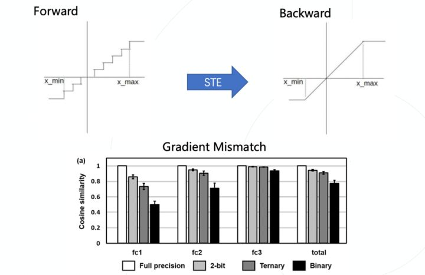

# 嵌入式Linux平台部署AI神经网络模型Inference的方案

⌚️:2020年11月30日

📚参考

-  [原文地址](https://zhuanlan.zhihu.com/p/132561405)

---

## 1. 模型量化

模型量化了解一下？

编者按：随着深度学习的发展，神经网络被广泛应用于各种领域，模型性能的提高同时也引入了巨大的参数量和计算量。模型量化是一种将浮点计算转成低比特定点计算的技术，可以有效的降低模型计算强度、参数大小和内存消耗，但往往带来巨大的精度损失。尤其是在极低比特(<4bit)、二值网络(1bit)、甚至将梯度进行量化时，带来的精度挑战更大。

4月9日，由商汤研究院“链接与编译”团队的两位研究员线上直播分享了：团队在模型量化方面的的一系列研究工作，其中包含CVPR 2020、ICCV 2019等多篇与北航刘祥龙老师团队合作的论文成果。小编为大家整理了这次直播的干货如下：

------

### **Part 1 量化综述**

**什么是模型量化？为什么要进行模型量化？**

模型量化是由模型、量化两个词组成。我们要准确理解模型量化，要看这两个词分别是什么意思。

在计算机视觉、深度学习的语境下，模型特指卷积神经网络，用于提取图像/视频视觉特征。

量化是指将信号的连续取值近似为有限多个离散值的过程。可理解成一种信息压缩的方法。在计算机系统上考虑这个概念，一般用“低比特”来表示。也有人称量化为“定点化”，但是严格来讲所表示的范围是缩小的。定点化特指scale为2的幂次的线性量化，是一种更加实用的量化方法。

卷积神经网络具有很好的精度，甚至在一些任务上比如人脸识别、图像分类，已经超越了人类精度。但其缺点也比较明显，具有较大的参数量，计算量，以及内存占用。而模型量化可以缓解现有卷积神经网络参数量大、计算量大、内存占用多等问题，具有为神经网络压缩参数、提升速度、降低内存占用等“潜在”优势。为什么“潜在”是加引号的呢？因为想同时达到这三个特性并不容易，在实际应用过程中存在诸多限制和前提条件。

另外，由于模型量化是一种近似算法方法，精度损失是一个严峻的问题，大部分的研究都在关注这一问题。作为一个在公司支撑很多业务线的团队，我们会在关注精度的同时，注重部署最终的速度和资源占用情况。

#### **压缩参数**

模型量化在最初的定义里是为了压缩模型参数，比如韩松在ICLR2016上获得best paper的论文，首次提出了参数量化方法。其使用k-mean聚类，让相近的数值聚类到同一个聚类中心，复用同一个数值，从而达到用更少的数值表示更多的数，这是量化操作的一种方案。反过来，从量化数变到原始数的过程，称之为反量化，反量化操作完之后，模型就可以按照原来的方式进行正常的计算。

我们认为绝大部分的模型量化算法都能压缩参数，因此压缩参数的实用性不存在问题。

#### **提升速度**

量化是否一定能加速计算？回答是否定的，许多量化算法都无法带来实质性加速。

引入一个概念：理论计算峰值。在高性能计算领域，这概念一般被定义为：单位时钟周期内能完成的计算个数 乘上 芯片频率。

什么样的量化方法可以带来潜在、可落地的速度提升呢？我们总结需要满足两个条件：

1、量化数值的计算在部署硬件上的峰值性能更高 。

2、量化算法引入的额外计算（overhead）少 。

要准确理解上述条件，需要有一定的高性能计算基础知识，限于篇幅就不展开讨论了。现直接给出如下结论：已知提速概率较大的量化方法主要有如下三类，

1、**二值化**，其可以用简单的位运算来同时计算大量的数。对比从nvdia gpu到x86平台，1bit计算分别有5到128倍的理论性能提升。且其只会引入一个额外的量化操作，该操作可以享受到SIMD（单指令多数据流）的加速收益。

2、**线性量化**，又可细分为非对称，对称和ristretto几种。在nvdia gpu，x86和arm平台上，均支持8bit的计算，效率提升从1倍到16倍不等，其中tensor core甚至支持4bit计算，这也是非常有潜力的方向。由于线性量化引入的额外量化/反量化计算都是标准的向量操作，也可以使用SIMD进行加速，带来的额外计算耗时不大。

3、**对数量化**，一个比较特殊的量化方法。可以想象一下，两个同底的幂指数进行相乘，那么等价于其指数相加，降低了计算强度。同时加法也被转变为索引计算。但没有看到有在三大平台上实现对数量化的加速库，可能其实现的加速效果不明显。只有一些专用芯片上使用了对数量化。

简单看一下二值化和线性量化两种方式，分别是右上角的图和右下角的图。

总结一下，要使用量化技术来提升模型运行速度，需要满足两个条件：

1、选择适合部署的量化方案。

2、在部署平台上使用经过深度优化的量化计算库（必要的时候，可能需要撸起袖子自己上）。

首先保证你实现的低比特计算效率超过原先浮点计算，否则为何要承担精度损失的风险而使用并不加速的量化模型呢。但低比特计算效率超过浮点计算其实并不容易，因为大家在浮点的计算库上已经做了非常多细致的优化比如winograd，间接卷积等等。

为了最大限度保证实用性，后面的论文所有工作都是基于二值化、线性量化两种前提来做的，并且绝大部分工作都报告最终实际的加速效果。这也是链接与编译团队做研究的一个风格。

#### **降低内存**

模型量化还有一个潜在的好处是降低运行时内存占用，这个特性无论是在移动端还是云端都是具有现实意义的。如果降低内存占用，可以得到如下好处：

1、降低访存量，存在提升速度的可能 。

2、在同样硬件环境下，同时处理更多视频或者视频路数 。

3、训练更大的模型。

我们分析下运行时内存都是被什么东西占用的，大家关心的参数weight只占很少一部分， 大部分内存占用来自激活值activation。如果你做低比特量化只关注卷积的话（很多论文其实也是只量化了卷积），那么是无法带来内存占用降低的。

如何才能用量化降低内存占用，只有一个方式: 将尽可能多的layer的激活值都进行量化 。在这个方向上之前商汤的一位实习生李润东也有一个工作，做了除了卷积之外更多层的量化。但是这样做会带来更多的精度损失，这可能也是大家需要关心的。

#### **生产量化模型**

生产一个量化模型的有以下几种方法，借鉴了ICCV2019上一篇data-free量化论文的定义。

L1：直接将一个浮点参数直接转化成量化数，一般会带来很大的精度损失，但使用上非常简单。

L2：基于数据校准的方案，很多芯片都会提供这样的功能，比如tensorRT，高通，寒武纪等。它需要转模型的时候提供一些真实的计算数据。

L3：基于训练finetune的方案，有很多论文都是使用这种方法，它的好处是可以带来更大的精度提升，缺点是需要修改训练代码，实施周期比较长。

上图描述了一种实用的pipeline流程，一般会优先使用不进行finetune的offline方法，也就是离线方案。当离线方案精度损失过于严重，我们才会进行基于finetune的方法，来做进一步的抢救。

#### **量化模型的落地**

最后聊聊阻碍模型量化算法落地的几个问题，核心当然是精度问题。我们发现虽然学术界大家很早就开始做量化，但现在算法还无法大规模落地。主要存在几个Gap：

1、可落地的线性量化方案无法很好的刻画一些分布，比如高斯分布

2、比特数越低，精度损失就越大，实用性就越差

3、任务越难，精度损失越大，比如识别任务，就比分类任务要难非常多

4、小模型会比大模型更难量化

5、某些特定结构，如depthwise，对量化精度十分不友好

6、常见的对部署友好的方法比如merge BN，全量化，都会给精度带来更大的挑战

除了精度外，软硬件支持不好也是一个阻碍：不同的硬件支持的低比特指令是不一样的，同样训练得到的低比特模型，无法直接部署在所有硬件上。除了硬件之外，不同软件库实现的量化方案和细节也不一样，量化细节里包括量化位置、是否支持perchannel、是否混合精度等等。即使硬件支持了量化，但你会发现不是所有硬件可以在低比特上提供更好的速度提升， 造成这个状况的主要原因有多个，一方面是指令集峰值提升可能本身就并不多，而要引入较多的额外计算，另一方面也取决于软件工程师优化指令的水平，同时由于网络结构灵活多样，不一定能在不同网络结构上达到同样好的加速比，需要优化足够多的的corner case才可以解决。

相信大家对模型量化的概念和落地难点有了一个系统性的认识。我的部分就到这里结束了，下面是大家最期待的论文解读时间。

### **Part 2 论文解读**

#### **低比特量化：**

**Differentiable Soft Quantization: Bridging Full-Precision and Low-Bit Neural Networks** 

**（ICCV 2019）**

由于量化函数本身是离散不可导的，导致其无法像标准神经网络一样使用反向传播计算梯度，一个常用的做法是使用梯度直通估计器（STE），即在反向过程中忽略量化这一步骤产生的影响，而这也就自然的带来了梯度不准确的问题。权重经过STE拿到的梯度跟它应该拿到的梯度是不匹配的。ICLR 2020年有一篇论文通过实验具体的分析了这一现象，发现随着比特数的降低，不匹配的现象更加明显。

这让低比特量化网络很难高效训练，针对这个问题，该文章提出了一个可微分的软量化函数DSQ，引入了可求导的量化函数，缓解了不可求导带来的梯度不匹配问题。同时，这个函数随着训练的进行可以逐步趋近标准量化，因此可以在部署时直接利用高效的线性低比特量化函数进行推理，此外，由于这个函数是可以求导的，因此截断值也能够直接被优化，在训练过程中平衡截断误差和取整误差间的关系。

通过可视化分析，我们发现经过DSQ函数后，参数的分布更加接近于量化后的分布，减小了浮点参数和量化参数的鸿沟。为了验证这套方法的效率，我们基于ARM NEON中的SADDW和MLA指令实现了高效的低比特卷积，并在树莓派上以ResNet-18为基础进行测试，相比腾讯开源的高性能推理库NCNN有1.6倍左右的提速。

论文地址：[https://arxiv.org/abs/1908.05033](https://link.zhihu.com/?target=https%3A//arxiv.org/abs/1908.05033)

#### **模型二值化：**

**IR-Net: Forward and Backward Information Retention for Highly Accurate Binary Neural Networks**

**（CVPR 2020）**

模型二值化在模型的激活值和参数上只有两个值（0和1）表示，可以预见的是这样量化肯定会带来较大的精度和信息损失。该文章引入了信息熵，以量化参数和浮点参数的信息熵作为模型的评判标准。

除了前向信息损失，二值化模型在反向过程中面临的挑战更大，标准的恒等映射梯度近似会导致较大的梯度误差，而包含截断建模的梯度近似会使得大量被截断的数值不能得到更新，损失了更新能力。该文章提出了两阶段近似梯度估计器，让模型优化在前期保持比较高的更新能力，后期梯度的误差更低。

同样在树莓派上进行了速度验证，借助京东开源的daBNN推理库，测试了IR-Net的性能，相比daBNN中的全精度模型，大约有5.6倍左右的速度提升。

论文地址：[https://arxiv.org/abs/1909.10788](https://link.zhihu.com/?target=https%3A//arxiv.org/abs/1909.10788)

项目地址：[https://github.com/htqin/IR-Net](https://link.zhihu.com/?target=https%3A//github.com/htqin/IR-Net)

**8bit训练加速：**

**Towards Unified INT8 Training for Convolutional Neural Network**

**（CVPR 2020）**

除了使用量化技术加速前向推理过程，是否能够进一步加速包含反向传播在内的梯度计算过程呢？分析发现反向传播在训练过程中占用了一半的时间，如果能减少这个时间，那么就能大大增加训练效率。一个直接的想法就是量化梯度，但这样做会导致训练不收敛。经过统计，我们发现梯度的分布与激活值和参数值有很大不同，大量参数出现在0附近，同时存在较大的极端值，如果对其进行量化会带来非常大的量化误差。

发现了梯度的特征后，我们从理论角度进行了分析，借鉴了优化理论中的后悔值分析。推导出了引入梯度量化之后的收敛性上界：

该上界包含三项，其中第一项随更新迭代的进行会趋向于零，因此主要由后两项决定，分别对应量化误差的大小和学习率。只有确保该上界尽可能小，收敛性才能得到保证。

因此针对第二项和第三项，通过使量化梯度与实际梯度的cosine距离更加接近，降低量化误差，然后根据误差的大小减小学习率，使得尽可能在更加正确的方向上进行更新，并且不会在错误的方向上更新过多，可以保证在收敛边界内更新，确保正常收敛。论文在分类和目标检测任务上都进行了精度验证，损失在1%左右。

借助高性能团队提供的初步优化实现，该方法可以在NVIDIA GTX 1080TI上带来22%的加速。

论文地址：[https://arxiv.org/abs/1912.12607](https://link.zhihu.com/?target=https%3A//arxiv.org/abs/1912.12607)

#### **低比特人脸识别：**

**Rotation Consistent Margin Loss for Efficient Low-bit Face Recognition**

**（CVPR 2020）**

由于开集问题里测试集中存在训练集不存在的类别，因此识别任务比分类任务更难，评价指标也更加严格。而引入量化之后，也就面临着更大的挑战。为了深入分析人脸识别受量化的影响，论文首先基于人脸特征使用夹角度量作为相似度衡量的共识定义了量化误差，并定义量化后的类中心为属于该类所有样本特征进行量化后的均值。对量化误差进行分析，发现引入量化后每个类的中心都有所偏移，但类之间的夹角保持住了，类内的距离保持的较差。可以理解成各类在量化后产生了一个整体的旋转，每个类的紧凑性有所下降。

因此文章将量化误差分解成类偏差和个体偏差。文章提出了旋转一致损失函数，使得样本具有与类中心有同样的偏移，抵消量化带来的影响，让特征更加保序。

论文在不同数据集上进行了实验，在简单的数据集上3/4bit基本能够保持精度，在更有挑战的数据集上相比基线方法也能够有1-2%的精度提升。

#### **量化友好网络结构：**

**DMS: Differentiable diMension Search for Binary Neural Networks**

**（ICLR 2020 Workshop）**

对量化和网络结构的探索，许多论文都会对网络结构进行微调：增加通道数量，修改跨层连接等。对于二值化模型来说这些改动能带来比全精度模型更大的收益。

这启发了我们，是否存在一些模型结构，他们对于量化更加友好呢？本文从卷积核output channel的角度进行了探索，将量化背景下的channel探索转换为网络结构搜索（NAS）问题。Channel的搜索空间一般较大，直接使用已有的NAS会面临非常高的搜索复杂度，为了解决这个问题，本文提出了搜索空间聚类方法。首先将channel的变换参数r建模为服从Logistic分布的随机变量，广义的搜索空间可以认为是从该分布中进行采样，我们将采样限制为三个点：()，由于Logistic分布的分布函数可以进行求导，和能够进行优化，同时我们将进行衰减，即可最终收敛到上，作为最优的channel放缩系数。

对搜索空间进行建模，对网络结构进行探索。

实验表明，搜索得到的结构具有较大的精度潜力，使用ResNet-18拓扑，通过寻找最优的channel设置，在参数量比标准BNN少的情况下，可以实现7%左右的精度提升。

论文地址：

[https://drive.google.com/file/d/1DgD1mIBv7MHwM27Vjvb-g8IwlUOv6UJF/view?usp=sharing](https://link.zhihu.com/?target=https%3A//drive.google.com/file/d/1DgD1mIBv7MHwM27Vjvb-g8IwlUOv6UJF/view%3Fusp%3Dsharing)

项目地址：

[https://github.com/yhhhli/DMS_for_BNN](https://link.zhihu.com/?target=https%3A//github.com/yhhhli/DMS_for_BNN)

### **Part 3 Q&A**

**Q：主流训练框架是否支持finetune方法的INT8量化？**

A：finetune 方法的INT8量化在现在的tensorflow里是支持得比较好的，可以看到google的量化白皮书中就介绍了finetune。Pytorch正在补齐这方面的功能，在1.3版本中加入了finetune 的量化功能，但还在实验阶段。所以现在的PyTorch框架做的比较一般，但公司内部会提供完善的finetune方案和开源算法。

**Q：不同量化任务难度有差异的原因是什么？哪些任务作为INT8量化损失会比较大？**

A：例如分类任务，只要保证最终的预测概率的相对大小，是保持关系即可，但回归任务，比如检测任务偏一点都会影响到检测出框的准确性，所以会比分类任务的难度更高。刚才提到的人脸识别的任务是出feature的，feature的方向以及本身衡量的难度使其比分类任务更加困难，以及一些low level的任务因为输出的各个像素点都要顾及到，所以也会比分类任务更困难。另外从分布方面，量化需要做分布的考虑，如果一些任务对分布不友好，量化的部署也会更加困难。

**Q：在对网络结构友好型的量化过程中 对于channel分配上有什么经验？**

A：可以看到我们的论文补充材料中展示了最终的channel数，总结来看如果层中本身计算量较小，那么它的channel就需要更大一些，不同网络结构的规律也有所不同。

**Q：INT8 Training是从头开始训练的时候就采用8bit定点吗？还是说先全FP32精度进行训练一段时间，再进行量化？是仅对卷积层进行了8比特定点量化吗？**

A：从头开始训练的时候就采用8bit定点。第二种方法会更稳定一些，但无法达到较好的加速效果。当前我们的方案里只对卷积层进行量化，并且没有关心全连接层和第一层的卷积，这是一个比较标准的setting，所以目前达到的加速效果还没有很好，如何做得更快是需要其他层都需要量化的。

**Q：当模型在真正部署，需要模型压缩的时候，量化、剪枝、知识蒸馏等压缩方法一般会使用哪些呢？**

A：量化是一个大部分硬件平台都会支持的，因此比较常用；知识蒸馏有利于获得小模型，还可以进一步提升量化模型的精度，所以这个技巧也会使用，尤其是在有已经训好比较强的大模型的基础上会非常有用。剪枝用的会相对较少，因为可以被网络结构搜索覆盖。

## 2. 框架

### ONNX

- 简述
  ONNX是一种AI神经网络模型的通用中间文件保存方法(可以理解成AI世界的XML)，各种AI框架，Inference引擎，甚至OpenCV里面的dnn onnx相关的模块都可以解析ONNX文件并生成特定平台和运行框架所支持的神经网络模型。ONNX本身不是AI神经网络运行框架，只是AI神经网络模型通用中间描述文件格式
- GitHub链接
  [https://github.com/onnx/onnx](https://links.jianshu.com/go?to=https%3A%2F%2Fgithub.com%2Fonnx%2Fonnx)
- 编程语言
  C++ / Python
- 热度
  5星

### TensorRT

- 简述
  TensorRT是NVIDIA家的开源AI神经网络Inference引擎，支持解析和转换ONNX格式的神经网络模型部署到支持CUDA的GPU上运行。目前TensorRT仅支持在NVIDIA家的产品部署AI神经网络模型，支持的平台有NVIDIA各种支持CUDA 9.0以上的显卡，嵌入式SOC平台(Jetson TX1/TX2/Nano/Xavier 等)
- GitHub链接
  [https://github.com/NVIDIA/TensorRT](https://links.jianshu.com/go?to=https%3A%2F%2Fgithub.com%2FNVIDIA%2FTensorRT)
- 编程语言
  C++
- 热度
  3星

### MNN

- 简述
  MNN是阿里家开源的一款嵌入式Linux/Android平台的嵌入式AI神经网络Inference引擎。它在系统底层对ARM CPU代码进行系统级优化，可以调配ARM CPU + GPU的算力资源进行AI神经网络Inference运算。由于后发优势，加上贾扬清大神入职阿里的加成，目前业界评价MNN对很多AI神经网络在性能上的优化目前要优于ncnn, 这是后发优势，也许ncnn会进一步升级赶上。目前由于MNN开源时间还不长，star数目小于ncnn
- GitHub链接
  [https://github.com/alibaba/MNN](https://links.jianshu.com/go?to=https%3A%2F%2Fgithub.com%2Falibaba%2FMNN)
- 编程语言
  C++ / 少量 C语言
- 热度
  4星

### ncnn

- 简述
  ncnn是腾讯家开源的一款嵌入式跨平台平台的嵌入式AI神经网络Inference引擎。它在系统底层对ARM CPU代码进行系统级优化，可以调配ARM CPU + GPU的算力资源进行AI神经网络Inference运算。ncnn比MNN开源更早，不过它看起来更专注于Android平台，对Android系统平台优化得更好
- GitHub链接
  [https://github.com/Tencent/ncnn](https://links.jianshu.com/go?to=https%3A%2F%2Fgithub.com%2FTencent%2Fncnn)
- 编程语言
  三分之二 C++ / 三分之一 C语言
- 热度
  5星

### TVM

- 简述
  TVM是青年学者陈天奇主导的跨平台基于编译方法部署的AI神经网络部署的方法。TVM项目的想法是做AI神经网络界的LLVM神经网络编译器，通过跨平台交叉编译的方法，将AI神经网络编译成目标平台的运行库，然后在tvm runtime运行。tvm runtime本身不依赖其它第三方库。
- GitHub链接
  [https://github.com/dmlc/tvm](https://links.jianshu.com/go?to=https%3A%2F%2Fgithub.com%2Fdmlc%2Ftvm)
- 编程语言
  C++ / Python
- 热度
  4星半

### TensorFlow Lite

- 简述
  TensorFlow Lite是一款用于部署在移动设备上基于TensorFlow框架训练的的AI神经网络模型的一个工具。由于Android TensorFlow TensorFlow Lite都是Google家的产品，所以TensorFlow对Google家的Android设备有天然兼容性和生态，目前在Android平台使用比较多
- 链接
  [https://www.tensorflow.org/lite](https://links.jianshu.com/go?to=https%3A%2F%2Fwww.tensorflow.org%2Flite)
  [https://github.com/tensorflow/tensorflow/tree/master/tensorflow/lite](https://links.jianshu.com/go?to=https%3A%2F%2Fgithub.com%2Ftensorflow%2Ftensorflow%2Ftree%2Fmaster%2Ftensorflow%2Flite)
- 编程语言
  C++ / Python
- 热度
  6星

### ArmNN

- 简述
  ArmNN是Arm公司开源的基于arm嵌入式设备的inference框架，在Arm Cortex-A CPUs、Arm Mali GPUs、Arm Machine Learning processor都可以达到很高的加速效果。不过可惜的是，由于缺乏文档及教程，该框架在国内推广的程度不高，目前Github的更新迭代速度也不快。相对于其他AI神经网络Inference框架如NCNN、Tengine、MNN等等，ArmNN的知名度显得很小。不过有用户反馈ArmNN对ARM芯片上的算力进行统一管理和加速的效果很好，是一个被低估的框架
- GitHub链接
  [https://github.com/ARM-software/armnn](https://links.jianshu.com/go?to=https%3A%2F%2Fgithub.com%2FARM-software%2Farmnn)
- 编程语言
  C++
- 热度
  2星

### Tengine

- 简述
  Tengine 是OPEN AI LAB公司开发的针对ARM公司中高端应用级CPU Cortex-A系列(参考CPU Cortex-A72) 开发的AI神经网络Inference引擎。同时支持Linux和Android系统，目前项目更新迭代速度并不快
- GitHub链接
  [https://github.com/OAID/Tengine](https://links.jianshu.com/go?to=https%3A%2F%2Fgithub.com%2FOAID%2FTengine)
- 编程语言
  C++ / 少量 C语言
- 热度
  2星半

### Tengine-lite

- 简述
  Tengine 是OPEN AI LAB公司开发的针对ARM公司中低端实时控制级 Cortex-M 开发的AI神经网络Inference引擎，纯C语言打造，支持RTOS系统，是目前少有的支持嵌入式裸机和RTOS系统的AI神经网络Inference引擎
- GitHub链接
  [https://github.com/OAID/Tengine-lite](https://links.jianshu.com/go?to=https%3A%2F%2Fgithub.com%2FOAID%2FTengine-lite)
- 编程语言
  C语言
- 热度
  1星

### Mace

- 简述
  Mace是小米公司开发的一款支持ARM Cortex-A 系列手机级CPU的神经网络AI Inference引擎。能够同时管理调度CPU 和 GPU的算力，支持Windows, Linux, Android等多个系统，对高通手机开发平台的支持和优化做得比较出色。
- 编程语言
  C++ / 少量 Python和C语言
- GitHub链接
  [https://github.com/XiaoMi/mace](https://links.jianshu.com/go?to=https%3A%2F%2Fgithub.com%2FXiaoMi%2Fmace)
- 热度
  3星半

### Paddle-Mobile

- 简述
  Paddle-Mobile是百度家的一款嵌入式AI神经网络Infrence框架， 中文名叫飞桨，高性能支持ARM CPU，支持Mali GPU， 支持Andreno GPU， 支持苹果设备的GPU Metal实现，支持ZU5、ZU9等FPGA开发板，支持树莓派等arm-linux开发板。目前在中文开源资料比较丰富
- GitHub链接
  [https://github.com/PaddlePaddle/paddle-mobile](https://links.jianshu.com/go?to=https%3A%2F%2Fgithub.com%2FPaddlePaddle%2Fpaddle-mobile)
- 编程语言
  C++ / 少量 C语言
- 热度
  4星

### OpenCV dnn

- 简述
  dnn 是opencv里面用于deep learning AI神经网络inference的一个模块(据说有training的功能，但是一般不用)。dnn模块从opencv 3.1开始就在opencv_contrib库里面，在3.3版中，它被提到了主仓库中。新版OpenCV dnn模块目前支持Caffe、TensorFlow、Torch、PyTorch等深度学习框架。从3.4开始，dnn模块开始支持onnx格式的AI神经网络模型部署。
  opencv dnn模块相比于其它AI神经网络 Inference引擎优点在于它依托于Opencv这个传统的计算机视觉库，有大量的传统视觉，图像预处理和后处理相关的api函数可以用，并且格式兼容。另外dnn只依赖于opencv, 不依赖其它的库，所以可以和opencv一起部署的嵌入式Linux(不是Ubuntu, Debian, Android这种发行版系统)最小系统上，可以运用到各种更细分的领域。
  当然opencv dnn赶上时代潮流，进入opencv主仓库的时间比较晚，支持的AI神经网络模型并不算多，速度和计算精度性能优化不是特别好，版本迭代速度也不快，相比于其它家互联网公司主推的AI Inference引擎，其对gpu, cpu统一计算资源管理优化程度可能也不算特别好。不过从Opencv 4.x以后的版本看，dnn模块越来越受官方重视，建议大家尝试4.x以后的版本。
- GitHub链接
  [https://github.com/opencv/opencv/tree/master/modules/dnn](https://links.jianshu.com/go?to=https%3A%2F%2Fgithub.com%2Fopencv%2Fopencv%2Ftree%2Fmaster%2Fmodules%2Fdnn)
- 编程语言
  C++ / 少量 C语言
- 热度
  3星半

### Dlib

- 简述
  Dlib是一个现代C++语言编写的工具包，包含机器学习算法和工具，用于用C++创建复杂的软件来解决现实世界中的问题。它被广泛应用于工业和学术界，包括机器人、嵌入式设备、移动电话和大型高性能计算环境。
  Dlib 在传统机器学习领域的算法库非常丰富，但是深度学习领域进入比较晚，支持的模型不算最新。不过Dlib在人脸识别领域，关键点识别做得还是不错，并且可以和OpenCV的Mat格式进行转换兼容，这样配合Opencv做人脸识别应该是不错的选择。不过Dlib的中文资料略少。
- GitHub链接
  [https://github.com/davisking/dlib](https://links.jianshu.com/go?to=https%3A%2F%2Fgithub.com%2Fdavisking%2Fdlib)
- 编程语言
  C++
- 热度
  3星半

