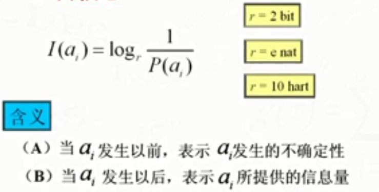

# 绪论

⌚️:2020年11月30日

📚参考

---

信息论为传输和处理（存储）的科学。
## 思维
* 1.物质、能量和信息的关系？
* 2.信息论，控制论和系统论是现代信息科学的三大基石。
## TREE
* 1.信息的定义
* 2.信息测度基本概念
* 3.信息论发展概况
## 一、信息定义
### 1.统计信息的概念（针对信息传输过程中的定义）
信息不等同于情报、知识、消息和信号。  
信息需要**参照物**，是一种对某个个体的增量。传递之前是不知道是消息和信息的，只有传播到后才知道。    
区别信息和消息。  

信息是事物运动状态或存在方式的不确定性的描述。（香浓定义）。   

**信息与消息**   
* 通信系统中传输的形式是消息——消息是信息的载体。  
* 通信的实质是通过消息的传递，消除不确定性，获得消息——信息是抽象的传输主体。   
  

把消息变换适合信道传输的物理量，这种物理量就称为**信号**。   

### 2.全信息的概念
人们对客观世界运动规律和存在状态的认识结果。  
  
  
* 语义信息：事物运动状态及方式的具体含义。
* 语法信息：事物运动状态及变化方式的形式。（各种信息要素出现的可能性及各信息要素之间的相互关系）
* 语用信息：事物运动状态及方式及其含义对观察者的效用。

## 二、信息测度
### 1.自信息
自信息表示事件不确定大小。事件本身所携带的信息量。    
  

**自信息的函数表示、单位、含义**  
   

### 2.联合自信息
   

### 3.条件自信息
   

## 三、信息论的发展概况
统计数学家+通信工程师共同发展。   

### 1.古代信息传播
### 2.电气表示信息
主要问题：如何获得信息的电气表现形式及进行远程距离传输。   

1832年J.Henry发明电报；  
1838年F.B.Morse发明电码；  
1876年Bell发明电话；   
1895——1896年Marconi和popov发明了无线电通信；   
1904年Fleming发明二极管，1906年Forest发明三极管放大器；   
### 3.20世纪30年代以前
主要问题：如何提高信道利用率。   

1917年G.A.Campbell申请了第一个关于滤波器的专利（为频分复用奠定了基础）；   
1922年J.R.Carson对振幅调制信号进行了研究；   
1924年H.Nvquist开始分析电报信号传输中脉冲速度与信道带宽的关系，建立限带信号的采样定理（为时分复用奠定了基础）；   
1928年R.V.Hartlev发表“信息的传输”，对信息量做了定义；   
### 4.20世纪30年代~40年代
主要问题： 通信中的噪声和抗干扰问题。   

1930年N.Wiener开始把Fourier分析方法全面一如随机信号的研究中。   
1936年V.D.London发表有关噪声的论文，E.H.Armstrong提出频率调制；  
1929年H.Dudley发明声码器，H.Reevet提出脉冲编码调制；  
1944~1945年S.O.Rice发表“Mathematical analysis of random  noise”，对噪声的研究做了全面的总结；   
1948年N.Wiener发表《控制论》；C.E.Shannon发表构思了八年的”AMathematical Theory of Communication“ ，奠定信息论的基础。   
### 5.编码  
#### （1）无失真信源编码

#### (2)信道编码
   
#### （3）限失真信源编码
   
#### (4)保密编码
   
### 6.信息论在近代的发展趋势
* 1.网络信息论的兴起
  
* 2.MIMO技术的提出
  
* 3.协同通信的提出
  
* 4.物理层安全途径的兴起
   
  
