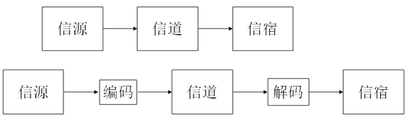

# 第3章 信息论基础 

⌚️:2020年11月30日

📚参考

---

### 1. 通信系统的组成 
* 信源：产生消息    
* 信道：传输消息    
* 信宿：接收消息    
   
### 2. 基本概念 
通信中对信息的表达分为三个层次：信号，消息，信息。 
* 信号：是信息的物理层表达，可测量，可描述，可显示。如电信号，光信号。 
* 消息：是信息的载体，以文字，语言，图像等人类可以认知的形式表示。 
* 信息：不确定的内容。   

3. 信息熵 
信息的特点 