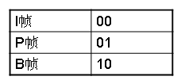
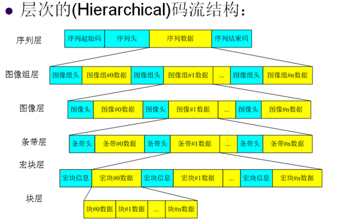
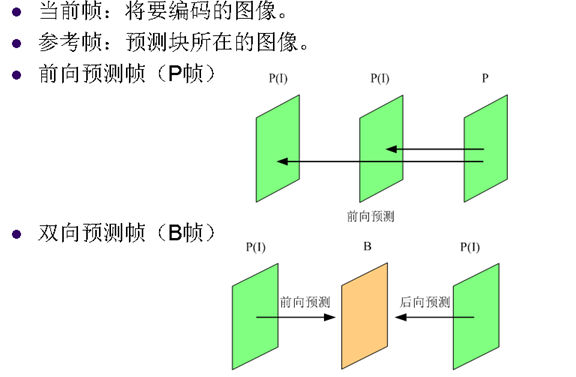
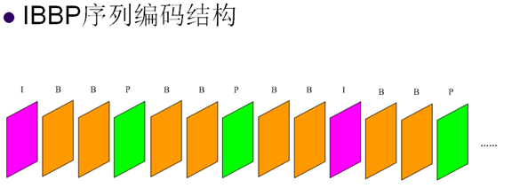

# 第四章 视频编码基础

⌚️:2020年11月30日

📚参考

---

### 1. 压缩码流
* 语法：码流中各个元素的位置关系   
01001001…   
图像编码类型(01)，宏块类型(00)，编码系数1001等
* 语义：每个语法元素所表达的意义。   
例如：图像编码类型   
   
### 2. 编码层次
·序列（Sequence）   
·图像组（Group of Pictures，GOP）   
·图像（Picture）   
·条带（Slice）   
·宏块（Macroblock，MB）    
·块(Block)    
### 3. 码流结构
   
### 4. PB帧编码
  
### 5. 序列编码对象
（1）IBBP序列   
   
* 序列：一段连续编码的并具有相同参数的视频图像。
* 序列起始码：专有的一段比特串，标识一个序列的压缩数据的开始
MPEG-2的序列起始码为十六进制数000001(B3)。
* 序列头：记录序列信息
档次（Profile），级别（Level），宽度，高度，是否是逐行序列，帧率等。
* 序列结束码：专有的一段比特串，标识该序列的压缩数据的结束
MPEG-2的序列结束码为十六进制数000001(B7)。