# 第2章 数字视频   

⌚️:2020年11月30日

📚参考

---

### 1.图像与视频   
* 图像：是人对视觉感知的物质再现。   
* 三维自然场景的对象包括：深度，纹理和亮度信息   
* 二维图像：纹理和亮度信息     
* 视频：连续的图像。   
* 视频由多幅图像构成，包含对象的运动信息，又称为运动图像。   
### 2. 数字视频   
数字视频：自然场景空间和时间的数字采样表示。   
* 空间采样- 解析度（Resolution）     
* 时间采样- 帧率：帧/秒  
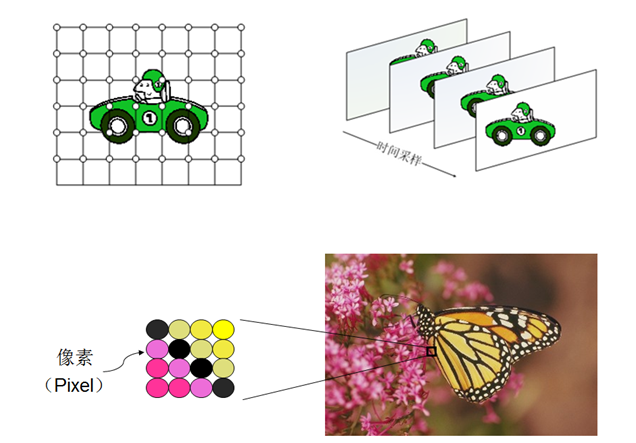    

### 3. 数字视频系统   
* 采集 :照相机，摄像机 
* 处理 :编解码器，传输设备   
* 显示 :显示器   
  
### 4. 人类视觉系统HVS   
HVS   
* 眼睛   
* 神经   
* 大脑   
  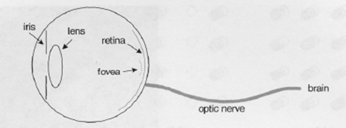  
  

HVS特点：   
* 对高频信息不敏感   
* 对高对比度更敏感   
* 对亮度信息比色度信息更敏感   
* 对运动的信息更敏感  
  
### 5. 数字视频系统的设计应该考虑HVS的特点  
* 丢弃高频信息，只编码低频信息   
* 提高边缘信息的主观质量   
* 降低色度的解析度   
* 对感兴趣区域（Region of Interesting，ROI）进行特殊处理   
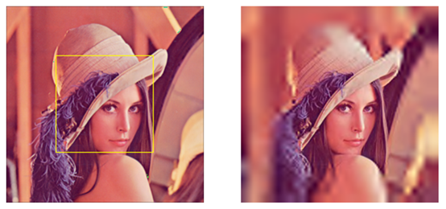  
### 6. RGB色彩空间   
三原色：红（R），绿（G），蓝（B）。任何颜色都可以通过按一定比例混合三原色产生。   
RGB色度空间   
* 由RGB三原色组成   
* 广泛用于BMP，TIFF，PPM等   
* 每个色度成分通常用8bit表示[0,255]  
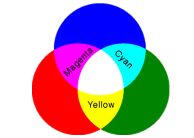   
### 7. YUV色彩空间   
YUV色彩空间：   
* Y：亮度分量   
* UV：两个色度分量   
* YUV更好的反映HVS特点   
  
### 8. RGB转化到YUV空间   
亮度分量Y与三原色有如下关系：$Y = k_rR + k_gG + k_bB$    
经过大量实验后ITU-R给出了,$k_r = 0.299$，$k_r = 0.587$ ，$k_r = 0.114$   
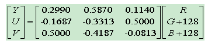  
**主流的编解码标准的压缩对象都是YUV图像**   
### 9. YUV图像分量采样   
* YUV图像可以根据HVS的特点，对色度分量下采样，可以降低视频数据量。   
* 根据亮度和色度分量的采样比率，YUV图像通常有以下几种格式：   
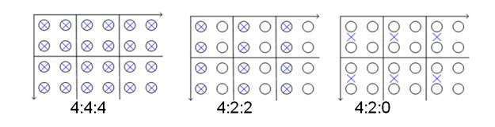  
### 10. 通用 的YUV图像格式   
根据YUV图像的亮度分辨率定义图像格式   
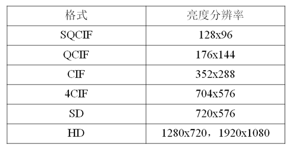  
### 11. 帧和场图像   
一帧图像包括两场——顶场，底场 
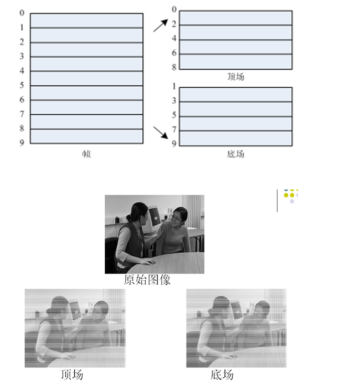   
### 12. 逐行与隔行图像   
* 逐行图像：一帧图像的两场在同一时间得到，ttop=tbot。   
* 隔行图像：一帧图像的两场在不同时间得到， ttop≠tbot。   
  
### 13. 视频质量评价   
* 有损视频压缩使编解码图像不同，需要一种手段来评价解码图像的质量。   
    质量评价：   
    * 客观质量评价     
    * 主观质量评价   
    * 基于视觉的视频质量客观评价   
   
* 客观质量评价：通过数学方法测量图像质量评价的方式。   
    优点：    
    * 可量化   
    * 测量结果可重复   
    *  测量简单 
    
    缺点：  
    * 不完全符合人的主观感知 

### 14. 客观评价的方法   
常用的客观评价方法： 
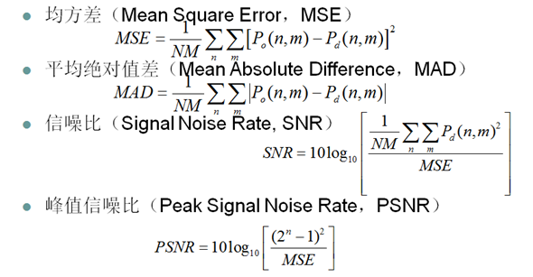  
### 15. 主观评价方法   
* 主观质量评价：用人的主观感知直接测量的方式。  
    优点： 
    * 符合人的主观感知 
      
  
  缺点：   
    * 不容易量化   
    * 受不确定因素影响，测量结果一般不可重复   
    * 测量代价高   
      

常用主观评价方法 
* 双刺激连续质量评价（Dual Stimulate Continuous Quality Metric，DSCQM）  
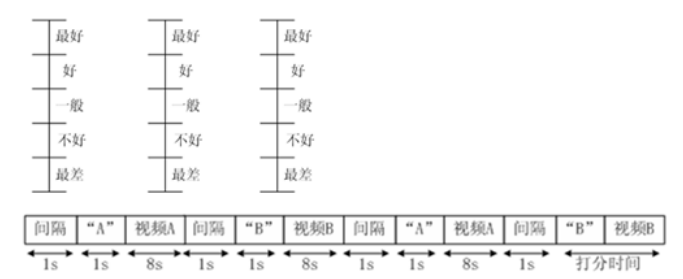   
* DSCQM测试系统  
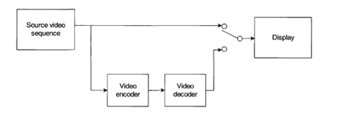  
### 16. 基于视觉的视频质量客观评价方法   
* 基于视觉的视频质量客观评价：将人的视觉特性用数学方法描述并用于视频质量评价的方式。   
* 结合了主观质量评价和客观质量评价两方面优点。   
* 常用方法：结构相似度（Structural SIMilarity，SSIM）方法。    
* 将HVS的特征用数学模型表达出来。   
* 未来重要的研究方向   