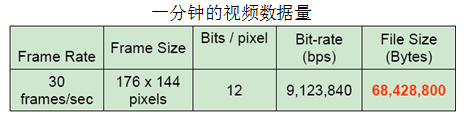
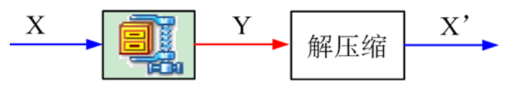

# 第1章、介绍   

⌚️:2020年11月30日

📚参考

- 参考网站：http://www.cnblogs.com/xkfz007/archive/2012/08/12/2613690.html   

---

### 1. 为什么要进行视频压缩？   
未经压缩的数字视频的数据量巨大   
**存储困难**:一张DVD只能存储几秒钟的未压缩数字视频。   
**传输困难** :1兆的带宽传输一秒的数字电视视频需要大约4分钟。
   

### 2. 为什么可以压缩 
去除冗余信息   
* 空间冗余：图像相邻像素之间有较强的相关性   
* 时间冗余：视频序列的相邻图像之间内容相似   
* 编码冗余：不同像素值出现的概率不同   
* 视觉冗余：人的视觉系统对某些细节不敏感   
* 知识冗余：规律性的结构可由先验知识和背景知识得到  

### 3. 数据压缩分类   
无损压缩（Lossless）   
* 压缩前解压缩后图像完全一致X=X'   
* 压缩比低(2:1~3:1)   
* 例如：Winzip，JPEG-LS  
  

有损压缩（Lossy）   
* 压缩前解压缩后图像不一致X≠X'   
* 压缩比高(10:1~20:1)   
* 利用人的视觉系统的特性   
* 例如：MPEG-2，H.264/AVC，AVS   

   
### 4. 编解码器 
编码器（Encoder） :压缩信号的设备或程序   
解码器（Decoder） :解压缩信号的设备或程序   
编解码器(Codec) : 编解码器对   
### 5. 压缩系统的组成   
(1) 编码器中的关键技术  
  
(2) 编解码中的关键技术   
  

### 6. 编解码器实现    
编解码器的实现平台：     
* 超大规模集成电路VLSI ：ASIC， FPGA    
* 数字信号处理器DSP   
* 软件     
  

编解码器产品：   
* 机顶盒     
* 数字电视     
* 摄像机     
* 监控器     
  
### 7. 视频编码标准     
编码标准作用：     
* 兼容：不同厂家生产的编码器压缩的码流能够被不同厂家的解码器解码   
* 高效： 标准编解码器可以进行批量生产，节约成本。   
  

主流的视频编码标准：     
* MPEG-2    
* MPEG-4 Simple Profile    
* H.264/AVC    
* AVS    
* VC-1    
  

标准化组织：    
* ITU：International Telecommunications Union ——VECG：Video Coding Experts Group    
* ISO：International Standards Organization ——MPEG：Motion Picture Experts Group    
  
### 8. 视频传输    
* 视频传输：通过传输系统将压缩的视频码流从编码端传输到解码端   
* 传输系统：互联网，地面无线广播，卫星   
  
### 9. 视频传输面临的问题   
传输系统不可靠   
* 带宽限制   
* 信号衰减   
* 噪声干扰   
* 传输延迟   
  

视频传输出现的问题   
* 不能解码出正确的视频   
* 视频播放延迟   
  
### 10. 视频传输差错控制   
差错控制（Error Control）解决视频传输过程中由于数据丢失或延迟导致的问题     
差错控制技术：  
* 信道编码差错控制技术   
* 编码器差错恢复   
* 解码器差错隐藏   
  
### 11. 视频传输的QoS参数    
* 数据包的端到端的延迟   
* 带宽：比特/秒   
* 数据包的流失率   
* 数据包的延迟时间的波动   