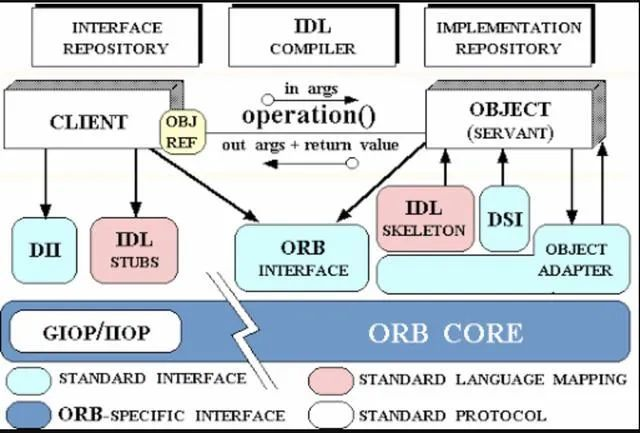
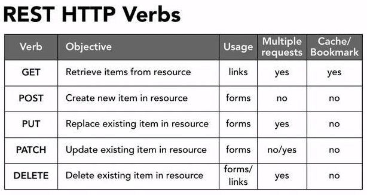
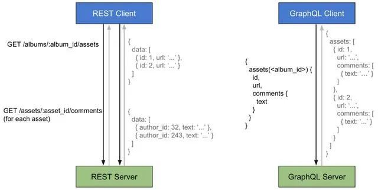
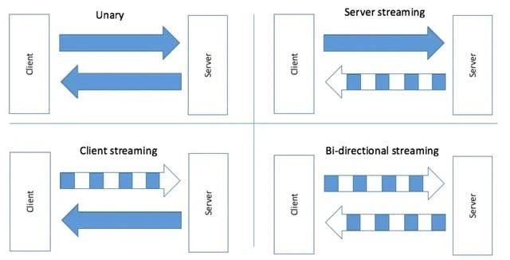
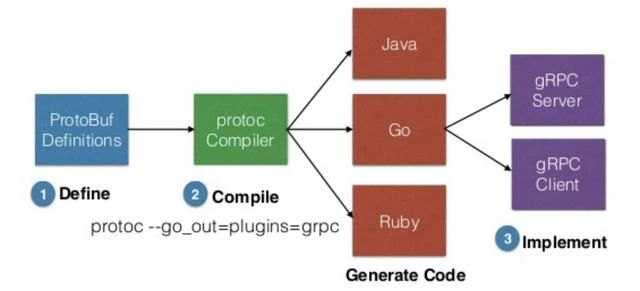

# 精读《REST，GraphQL，Webhooks & gRPC 如何选型》

⌚️:2020年11月30日

📚参考

- [原文地址](https://www.shangmayuan.com/a/0f82597d39184700957fce0f.html)
- [英文地址](https://nordicapis.com/when-to-use-what-rest-graphql-webhooks-grpc/)

----

这篇文章主要向大家介绍精读《REST，GraphQL，Webhooks & gRPC 如何选型》,主要内容包括基础应用、实用技巧、原理机制等方面，希望对大家有所帮助。

## 引言

每当项目进入联调阶段，或者提早约定接口时，先后端就会聚在一块儿热火朝天的讨论起来。可能 99% 的场景都在约定 Http 接口，讨论 URL 是什么，入参是什么，出参是什么。程序员

有的团队先后端接口约定更加高效，后端会拿出接口定义代码，前端会转换成（或自动转成）Typescript 定义文件。github

但这些工做都针对于 Http 接口，今天经过 when-to-use-what-rest-graphql-webhooks-grpc 一文，抛开联调时千遍一概的 Http 接口，一块儿看看接口还能够怎么约定，分别适用于哪些场景，你如今处于哪一个场景。web


架构师的主要活动是做出正确的技术决策。选择合适的API是一项重要的技术决策。那么今天就看看API的选择问题。

*应用程序编程接口（API）是一种计算接口，它定义了多个软件中介之间的交互。它定义了可以进行的调用或请求的类型，如何进行调用，应使用的数据格式，遵循的约定等。它还可以提供扩展机制，以便用户可以以各种方式扩展现有功能。在不同程度上。API可以是完全定制的，特定于组件，也可以基于行业标准进行设计以确保互操作性。有些API必须记录在案，而其它API则经过设计，以便可以“查询”它们以确定支持的功能。由于其他组件/系统仅依赖于API，因此提供API的系统可以（理想地）在API的“后面”更改其内部详细信息，而不会影响其用户。*

正如上述的定义所述，API提供了多个软件之间的交互。所以我们这里强调的是交互性。我们在使用任何的语言开发一个应用的时候，都会提供内部的基于该语言的API，这种内部的API不是我们今天要讨论的内容，因为这种内部的交互不涉及到软件之间。我们今天要讨论的API主要要涉及到系统之间的交互。对于具体应用而言，更多是进程之间（本机），主机之间（本网络），服务之间（可能跨域广域网）的交互。

## 1. 概述

本文主要讲了四种接口设计方案，分别是：REST、gRPC、GraphQL、Webhooks，下面分别介绍一下。json

### 1.1 REST

REST 也许是最通用，也是最经常使用的接口设计方案，它是 **无状态的**，以资源为核心，针对如何操做资源定义了一系列 URL 约定，而操做类型经过 `GET` `POST` `PUT` `DELETE` 等 HTTP Methods 表示。segmentfault

REST 基于原生 HTTP 接口，所以改形成本很小，并且其无状态的特性，下降了先后端耦合程度，利于快速迭代。后端

随着将来发展，REST 可能更适合提供微服务 API。api

使用举例：

```
1. `curl -v -X GET https://api.sandbox.paypal.com/v1/activities/activities?start_time=2012-01-01T00:00:01.000Z&end_time=2014-10-01T23:59:59.999Z&page_size=10 \`
2. `-H "Content-Type: application/json" \`
3. `-H "Authorization: Bearer Access-Token"`
```

### 1.2 gRPC

gRPC 是对 RPC 的一个新尝试，最大特色是使用 protobufs 语言格式化数据。

RPC 主要用来作服务器之间的方法调用，影响其性能最重要因素就是 序列化/反序列化 效率。RPC 的目的是打造一个高效率、低消耗的服务调用方式，所以比较适合 IOT 等对资源、带宽、性能敏感的场景。而 gRPC 利用 protobufs 进一步提升了序列化速度，下降了数据包大小。

使用举例：

gRPC 主要用于服务之间传输，这里拿 Nodejs 举例：

#### 1.**定义接口**

因为 gRPC 使用 protobufs，因此接口定义文件就是 `helloword.proto`：

```
1. `// The greeting service definition.`
2. `service Greeter {`
3. ` // Sends a greeting`
4. ` rpc SayHello (HelloRequest) returns (HelloReply) {}`
5. ` // Sends another greeting`
6. ` rpc SayHelloAgain (HelloRequest) returns (HelloReply) {}`
7. `}`
8. ``
9. `// The request message containing the user's name.`
10. `message HelloRequest {`
11. ` string name = 1;`
12. `}`
13. ``
14. `// The response message containing the greetings`
15. `message HelloReply {`
16. ` string message = 1;`
17. `}`
```

这里定义了服务 `Greeter`，拥有两个方法： `SayHello` 与 `SayHelloAgain`，经过 `message` 关键字定义了入参与出参的结构。

事实上利用 protobufs，传输数据时仅传送不多的内容，做为代价，双方都要知道接口定义规则才能序列化/反序列化。

#### 2.定义服务器：

```
1. `function sayHello(call, callback) {`
2. ` callback(null, { message: "Hello " + call.request.name });`
3. `}`
4. ``
5. `function sayHelloAgain(call, callback) {`
6. ` callback(null, { message: "Hello again, " + call.request.name });`
7. `}`
8. ``
9. `function main() {`
10. ` var server = new grpc.Server();`
11. ` server.addProtoService(hello_proto.Greeter.service, {`
12. `  sayHello: sayHello,`
13. `  sayHelloAgain: sayHelloAgain`
14. ` });`
15. ` server.bind("0.0.0.0:50051", grpc.ServerCredentials.createInsecure());`
16. ` server.start();`
17. `}`
```

咱们在 `50051` 端口支持了 gRPC 服务，并注册了服务 `Greeter`，并对 `sayHello` `sayHelloAgain` 方法作了一些业务处理，并返回给调用方一些数据。

#### 3.定义客户端：

```
1. `function main() {`
2. ` var client = new hello_proto.Greeter(`
3. `  "localhost:50051",`
4. `  grpc.credentials.createInsecure()`
5. ` );`
6. ` client.sayHello({ name: "you" }, function(err, response) {`
7. `  console.log("Greeting:", response.message);`
8. ` });`
9. ` client.sayHelloAgain({ name: "you" }, function(err, response) {`
10. `  console.log("Greeting:", response.message);`
11. ` });`
12. `}`
```

能够看到，客户端和服务端同时须要拿到 proto 结构，客户端数据发送也要依赖 proto 包提供的方法，框架会内置作掉序列化/反序列化的工做。

> 也有一些额外手段将 gRPC 转换为 http 服务，让网页端也享受到其高效、低耗的好处。可是不要忘了，RPC 最经常使用的场景是 IOT 等硬件领域，网页场景也许不会在意节省几 KB 的流量。

### 1.3 GraphQL

GraphQL 不是 REST 的替代品，而是另外一种交互形式：前端决定后端的返回结果。

GraphQL 带来的最大好处是精简请求响应内容，不会出现冗余字段，前端能够决定后端返回什么数据。但要注意的是，前端的决定权取决于后端支持什么数据，所以 GraphQL 更像是精简了返回值的 REST，然后端接口也能够一次性定义完全部功能，而不须要逐个开发。

再次强调，相比 REST 和 gRPC，GraphQL 是由前端决定返回结果的反模式。

使用举例：

原文推荐参考 GitHub GraphQL API

好比查询某个组织下的成员，REST 风格接口多是：

```
1. `curl -v https://api.github.com/orgs/:org/members`
```


含义很明确，但问题是返回结果不明确，必须实际调试才知道。换成等价的 GraphQL 是这样的：

```
1. `query {`
2. ` organization(login: "github") {`
3. `  members(first: 100) {`
4. `   edges {`
5. `    node {`
6. `     name`
7. `     avatarUrl`
8. `    }`
9. `   }`
10. `  }`
11. ` }`
12. `}`
```


返回的结果和约定的格式结构一致，且不会有多余的字段：

```
1. `{`
2. ` "data": {`
3. `  "organization": {`
4. `   "members": {`
5. `    "edges": [`
6. `     {`
7. `      "node": {`
8. `       "name": "Chris Wanstrath",`
9. `       "avatarUrl": "https://avatars0.githubusercontent.com/u/2?v=4"`
10. `      }`
11. `     },`
12. `     {`
13. `      "node": {`
14. `       "name": "Justin Palmer",`
15. `       "avatarUrl": "https://avatars3.githubusercontent.com/u/25?v=4"`
16. `      }`
17. `     }`
18. `    ]`
19. `   }`
20. `  }`
21. ` }`
22. `}`
```

可是能看出来，这样作须要一个系统帮助你写 `query`，不少框架都提供这个功能，好比 apollo-client。

### 1.4 Webhooks

若是说 GraphQL 颠覆了先后端交互模式，那 Webhooks 能够说是彻头彻尾的反模式了，由于其定义就是，前端不主动发送请求，彻底由后端推送。

它最适合解决轮询问题。或者说轮询就是一种妥协的行为，当后端不支持 Webhooks 模式时。

使用举例：

Webhooks 自己也能够由 REST 或者 gRPC 实现，因此就不贴代码了。举个经常使用例子，好比你的好友发了一条朋友圈，后端将这条消息推送给全部其余好友的客户端，就是 Webhooks 的典型场景。

### 1.5 总结

最后做者给出的结论是，这四个场景各有不一样使用场景，没法相互替代：

- REST：无状态的数据传输结构，适用于通用、快速迭代和标准化语义的场景。
- gRPC：轻量的传输方式，特殊适合对性能高要求或者环境苛刻的场景，好比 IOT。
- GraphQL: 请求者能够自定义返回格式，某些程度上能够减小先后端联调成本。
- Webhooks: 推送服务，主要用于服务器主动更新客户端资源的场景。

## 2. 精读

### 2.1 REST 并不是适用全部场景

本文给了咱们一个更大的视角看待平常开发中的接口问题，对于奋战在一线的前端同窗，接触到 90% 的接口都是非 REST 规则的 Http 接口，能真正落实 REST 的团队其实很是少。这其实暴露了一个重要问题，就是 REST 所带来的好处，在整套业务流程中到底占多大的比重？

不只接口设计方案的使用要分场景，针对某个接口方案的重要性也要再继续细分：在作一个开放接口的项目，提供 Http 接口给第三方使用，这时必须好好规划接口的语义，因此更容易让你们达成一导致用 REST 约定；而开发一个产品时，其实先后端不关心接口格式是否规范，甚至在开发内网产品时，性能和冗余都不会考虑，效率放在了第一位。因此第一点启示是，不要埋冤当前团队业务为何没有使用某个更好的接口约定，由于接口约定极可能是业务形态决定的，而不是凭空作技术对比从而决定的。

### 2.2 gRPC 是服务端交互的首选

前端同窗转 node 开发时，很喜欢用 Http 方式进行服务器间通信，但可能会疑惑，为何公司内部 Java 或者 C++ 写的服务都不提供 Http 方式调用，而是另一个名字。了解 gRPC 后，能够认识到这些平台都是对 RPC 方式的封装，服务器间通讯对性能和延时要求很是高，因此比较适合专门为性能优化的 gRPC 等服务。

### 2.3 GraphQL 须要配套

GraphQL 不是 REST 的替代品，因此不要想着团队从 Http 接口迁移到 GraphQL 就能提高 X% 的开发效率。GraphQL 方案是一种新的先后端交互约定，因此上手成本会比较高，同时，为了方便前端同窗拼 query，等于把一部分后端工做量转移给了前端，若是此时没有一个足够好用的平台快速查阅、生成、维护这些定义，开发效率可能不升反降。

总的来讲，对外开放 API 或者拥有完整配套的场景，使用 GraphQL 是比较理想的，但对于快速迭代，平台又不够成熟的团队，继续使用标准 Http 接口能够更快完成项目。

### 2.4 Webhooks 解决特殊场景问题

对于第三方平台验权、登录等 **没有前端界面作中转的场景，或者强安全要求的支付场景等**，适合用 Webhooks 作数据主动推送。说白了就是在前端无从参与，或者由于前端安全问题不适合参与时，就是 Webhooks 的场景。很显然 Webhooks 也不是 Http 的替代品，不过的确是一种新的先后端交互方式。

对于慢查询等场景，前端广泛使用轮询完成，这和 Socket 相比体验更弱，但无状态的特性反而会下降服务器负担，因此慢查询和即时通信要区分对待，用户对消息及时性的敏感程度决定了使用哪一种方案。

## 3. 历史发展

最早在Unix/Linux的编程领域，提供了进程间通信的手段，例如：管道，信号量，[消息队列](https://cloud.tencent.com/product/cmq?from=10680)，套接字（Socket）等。如果你的应用是由不同语言编写的，那么这里只能选择Socket通信作为应用之间的API手段。但是Socket通信是一种非常低Level的通信手段，它以底层的数据包作为抽象和通信内容，很难维护和使用。当然还有一些其它的系统间通信的手段例如通过共享文件或者FTP的方式，同样面临着各种不便。我们希望提供一种更高级的交互手段，直接和我的应用的抽象交互，这些抽象可能是方法，函数和对象。于是就有了各种支撑这些需求的API技术。

**早期的进程间通信技术包括**：

- **DCOM** （ Distributed Component Object Model ）分布式组件对象模型，这个是微软的技术，只能用于Windows平台， 通过网络实现远程对象间的通信
- **RMI** （ Remote Method Call) Java的远程方法调用，这个是Java自己的RPC，只能用于Java应用之间的远程调用。
- **JNI** Java的本地接口， 支持Java应用调用本地方法，这个是跨越语言障碍的，但是仅仅局限于Java应用调用其它的本地应用，不具备互操作性，是个单向通道。

### 3.1 CORBA

在1991年一种名叫**CORBA （ Common Object Request Broker Architecture ）** 的技术出现了，我记得我的第一份工作是一个电信网管系统的开发，我们就是利用CORBA来实现不同的系统之间的通信。主要涉及C++和Java。




CORBA和之前提到的DCOM和RMI类似，都提供了远程的对象/方法调用，但是CORBA是一种与语言和实现无关的技术，我记得我们当时的测试脚本使用了TCL，也有CORBA的实现，也就是说CORBA定了与语言解耦的系统间通信的标准。这个是它的最大的优势。那个年代的应用，采用CORBA作为系统间的通信手段非常普遍。

开发CORAB的过程从IDL的定义开始，用户通过IDL定义了对象，然后在Server端实现该对象的应用逻辑，在Client端调用该对象。

但是CORBA并非没有**缺点**，否则我们也不会很少再看见今天的应用用CORAB作为API的了。他的主要问题是：

- 对象的生命周期管理比较复杂。远程对象的发现，创建和销毁都会带来问题
- 整个CORAB的架构比较复杂，看看它的架构图就知道了

总之，今天你要开发一个引用，除非要个已有系统交互，你应该不会选择CORBA。

### 3.2 XML-RPC / SOAP

XML-RPC发表于1998年，由UserLand Software（UserLand Software）的Dave Winer及Microsoft共同发表。后来在新的功能不断被引入下，这个标准慢慢演变成为今日的SOAP协议

下面是一个 XML-RPC的请求/响应的例子：

```javascript
<?xml version="1.0"?>
<methodCall>
 <methodName>examples.getStateName</methodName>
 <params>
   <param>
       <value><i4>40</i4></value>
   </param>
 </params>
</methodCall>
<?xml version="1.0"?>
<methodResponse>
 <params>
   <param>
       <value><string>South Dakota</string></value>
   </param>
 </params>
</methodResponse>
```


SOAP是 **Simple Object Access Protocol** 的缩写。SOAP为Web服务提供了Web服务协议栈的Messaging Protocol层。它是一个基于XML的协议，由三部分组成：

1. 一个信封，它定义了消息结构以及如何处理它
2. 一组用于表达应用程序定义的数据类型实例的编码规则
3. 表示过程调用和响应的约定

SOAP具有三个**主要特征**：

1. 可扩展性（安全性和WS-Addressing在开发中）
2. 中立性（SOAP可以通过HTTP，SMTP，TCP，UDP等任何协议进行操作）
3. 独立性（SOAP允许任何编程语言）

作为SOAP过程可以执行的操作的示例，应用程序可以将SOAP请求发送到启用了带有搜索参数的Web服务的服务器（例如，房地产价格数据库）。然后，服务器返回SOAP响应（包含结果数据的XML格式的文档），例如价格，位置，功能。由于生成的数据采用标准化的机器可解析格式，因此发出请求的应用程序可以直接将其集成。

SOAP体系结构**由以下几层规范组成**：

- 讯息格式
- 邮件交换模式（MEP）
- 底层传输协议绑定
- 消息处理模型
- 协议可扩展性

这里是一个SOAP消息的例子：

```javascript
POST /InStock HTTP/1.1
Host: www.example.org
Content-Type: application/soap+xml; charset=utf-8
Content-Length: 299
SOAPAction: "http://www.w3.org/2003/05/soap-envelope"
<?xml version="1.0"?>
<soap:Envelope xmlns:soap="http://www.w3.org/2003/05/soap-envelope" xmlns:m="http://www.example.org">
 <soap:Header>
 </soap:Header>
 <soap:Body>
   <m:GetStockPrice>
     <m:StockName>T</m:StockName>
   </m:GetStockPrice>
 </soap:Body>
</soap:Envelope>
```


相比较XML-RPC，它的功能更多，当然消息结构也更复杂。

SOAP是W3C推荐的Webservice标准，一度也是非常的流行，但是我们看到基于XML的消息比较复杂，消息本身因为XML的原因，有相当多的开销。于是后面又有了基于JSON的RPC格式。但总的来说，SOAP也已经是昨日黄花，当今的应用构建，你选它的概率应该也不大了。

### 3.3 REST

REST是当今最为流行的API。因为大量的Web应用采用REST作为其API的选择。REST是 **Representational State Transfer** 的缩写。是Roy Thomas Fielding博士于2000年在他的博士论文中提出来的一种万维网软件架构风格。

目的是便于不同软件/程序在网络（例如互联网）中互相传递信息。表现层状态转换是根基于超文本传输协议（HTTP）之上而确定的一组约束和属性，是一种设计提供万维网络服务的软件构建风格。符合或兼容于这种架构风格（简称为 REST 或 RESTful）的网络服务，允许客户端发出以统一资源标识符访问和操作网络资源的请求，而与预先定义好的无状态操作集一致化。因此表现层状态转换提供了在互联网络的计算系统之间，彼此资源可交互使用的协作性质（interoperability）。

相对于其它种类的网络服务，例如SOAP服务，则是以本身所定义的操作集，来访问网络上的资源。目前在三种主流的Web服务实现方案中，因为REST模式与复杂的SOAP和XML-RPC相比更加简洁，越来越多的Web服务开始采用REST风格设计和实现。所以我们可以看到软件的发展，大体是从复杂变得简单，只有简单的东西才会变得更有生命力。



为了使任何应用程序真正**实现RESTful，必须遵循六个体系结构约束**：

- **统一接口**：意味着必须向Web应用程序中的API使用者提供API接口。
- **客户端服务器**：客户端和服务器必须彼此独立，并且客户端应仅知道资源的URI。
- **无状态**：服务器不得存储与客户端请求相关的任何内容。客户端负责维护应用程序的状态。
- **可缓存的**：资源必须可缓存。
- **分层系统**：体系结构必须是分层的，这意味着体系结构的组件可以位于多个服务器中。
- **按需代码**：客户端必须能够获取可执行代码作为响应。这是一个可选约束。

基于REST的Web服务被称为RESTful Web服务。在这些应用程序中，每个组件都是一种资源，可以使用HTTP标准方法通过公共接口访问这些资源。以下**四种HTTP方法**通常用于基于REST的体系结构中：

- GET-对资源的只读访问。
- POST —创建一个新资源。
- DELETE—删除资源。
- PUT-更新现有资源/创建新资源。

RESTFul风格API所有的操作都是一个动词，对应HTTP请求的一种类型。每一个操作都定义了对操作的资源的某种行为。这种抽象，特别适合相当多的Web应用，后台是一个数据库，每一个REST的端点对应了一张数据库的表，很自然的利用REST操作来实现表的增删查改。

当然RESTFul的风格也有它的**不足**：

- 不是所有的应用操作都可以用资源的增删查改来对应，在实际的开发中经常会需要把一个操作映射为一个资源这种不伦不类的行为。
- REST是同步服务，如果需要可能要引入回调机制。例如Webhook。
- REST只提供客户端调用服务器的选项，不支持服务器端发起请求。

于是新的API类型会出现来解决这些问题。

### 3.4 GraphQL

GraphQL是一个开源的API数据查询和操作语言及实现为了实现上述操作的相应运行环境。2012年，GraphQL由Facebook内部开发，2015年公开公布。2018年11月7日，Facebook将GraphQL项目转移到新成立的GraphQL基金会 。

GraphQL规范概述了5条设计原则，这使其成为现代前端开发的精心设计的解决方案。让我们研究一下**GraphQL的设计原则**。

- 查询是分层结构的，具有分层和嵌套字段，查询与响应数据一对一匹配。查询和响应的形状像树，可以查询每个项目的其他嵌套字段。
- 该结构以产品为中心，着重于前端希望如何接收数据，并构建交付所需的运行时。这样一来，就可以向后端请求一个所需的所有数据，然后让服务器根据GraphQL的规范从不同的端点获取数据。
- 它使用特定于应用程序的类型系统，使开发人员能够确保查询使用有效类型，并且在执行之前在语法上正确。
- GraphQL查询是在客户端指定的，因此客户端确切知道它将以什么格式接收数据。
- 带有GraphQL的服务器结构必须是自包含的，或者可由GraphQL本身查询。这将启用功能强大的开发人员工具，例如GraphiQL或GraphQL Playground，这两种工具都将使开发人员能够准确查看哪些查询和字段可供他们在服务器中使用。

像RESTful API一样，GraphQL API旨在处理HTTP请求并提供对这些请求的响应。但是，相似之处到此结束。在REST API建立在请求方法和端点之间的连接上的情况下，GraphQL API设计为仅使用一个始终通过POST请求查询的端点，通常使用URL yourdomain.com/graphql。

达到GraphQL端点后，客户端请求的负担将完全在请求主体内处理。该请求主体必须遵守GraphQL规范，并且API必须具有适当的服务器端逻辑来处理这些请求并提供适当的响应。与RESTful API相比，这提供了更流畅的客户端体验，后者可能要求客户端对多个数据进行多次请求，并在数据返回后进行操作。



如上图的例子，用户通过RESTFul的API来请求数据，需要两个GET请求，先获取Assets，再通过AssetID获取comments。而通过GraphQL，用户只需要描述需要请求的数据的结构和条件，就可以通过一个请求获取全部所需要的数据，简化了客户端与服务器的交互。

GraphQL提供的性能优于REST API，可以为前端开发人员带来回报。使用GraphQL规范创建服务器可能需要更多设置和编写预测性服务器端逻辑来解析和处理请求。尽管GraphQL的安装成本可能会高于传统的REST架构，但更具可维护性的代码，强大的开发工具以及简化的客户端查询，这些都是不错的收益。

**除了灵活性**这个最大的优点外，GraphQL**还有以下的优点**：

- 声明性的数据获取，避免了客户端和服务器端的额外交互
- 优秀的开发体验，不需要版本控制，因为引入新的字段不会影响到API查询。同时客户端和服务器端的团队可以并行的独立工作。
- 强类型的GraphQL模式使得代码可预测，并及早发现错误。

当然，GraphQL也不是没有**缺点**：

- 使用GraphQL，如果您需要查找有关列表或记录集合的信息，则处理起来会很棘手。例如，如果您想获取包含其地址的用户列表的详细信息，则它将执行n + 1个查询。一个用于用户列表，然后n查询每个用户的地址。现在它会严重影响性能，因此必须非常小心地处理它。
- 很难缓存，缓存API响应的目的主要是为了更快地从将来的请求中获取响应。与GraphQL不同，RESTful API可以利用HTTP规范中内置的缓存。正如前面提到的，GraphQL查询可以请求资源的任何字段，因此缓存本质上是困难的。

### 3.5 gRPC

gRPC是一个开源的远程过程调用框架，用于在服务之间进行高性能的通信。这是将以不同语言编写的服务与可插拔支持（用于负载平衡，跟踪，运行状况检查和身份验证）相连接的有效方法。默认情况下，gRPC使用Protobuf（协议缓冲区）序列化结构化数据。通常，对于微服务体系结构，gRPC被认为是REST协议的更好替代方案。gRPC中的" g"可以归因于最初开发该技术的Google。

**gRPC**是对传统RPC框架的改编。那么，它**与现有的RPC框架有何不同？**

最重要的区别是gRPC使用protobuf 协议缓冲区作为接口定义语言进行序列化和通信，而不是JSON / XML。协议缓冲区可以描述数据的结构，并且可以从该描述中生成代码，以生成或解析表示结构化数据的字节流。这就是为什么gRPC首选多语言（使用不同技术实现）的Web应用程序的原因。二进制数据格式使通信更轻松。gRPC也可以与其他数据格式一起使用，但是首选的是protobuf。

同样，gRPC建立在HTTP / 2之上，它支持双向通信以及传统的请求/响应。gRPC允许服务器和客户端之间的松散耦合。在实践中，客户端打开与gRPC服务器的长期连接，并且将为每个RPC调用打开一个新的HTTP / 2流。


如上图所示，gRPC支持不同模式的客户端和服务器端的通信方式，极大的方便了不同的互操作能力。

与使用JSON（主要是JSON）的REST不同，gRPC使用Protobuf，这是编码数据的更好方法。由于JSON是基于文本的格式，因此它比protobuf格式的压缩数据要重得多。与REST相比，gRPC的另一个显著改进是它使用HTTP 2作为其传输协议。REST使用的HTTP 1.1基本上是一个请求-响应模型。gRPC利用HTTP 2的双向通信功能以及传统的响应请求结构。在HTTP 1.1中，当多个请求来自多个客户端时，它们将被一一处理。这会降低系统速度。HTTP 2允许多路复用，因此可以同时处理多个请求和响应。

gRPC的开发模式和之前提到的CORBA有些类似。Protobuf充当了IDL的角色，然后利用工具生成各种语言的代码，最后在生成的代码上实现服务器端和客户端的逻辑。



gRPC的**优点**是：

- 出色的性能，因为采用protobuf编码和http/2
- 支持服务器端和客户端的双向通信
- 易用，相比REST开发，需要更少的代码

**缺点**：

- 更陡峭的学习曲线
- 支持的语言的种类没有REST多，当然它还在发展中
- 因为需要Protobuf的编译，这带来了服务器和客户端一定的耦合，因为接口变动的时候需要重新编译生成代码。对于REST，基于不同的工具链可能有不同的解决方案

因为其高性能，gRPC更适合被用于系统内部组件的通信选择。在下图的微服务架构中，对外的服务采用了REST或者GraphQL的API，而内部微服务之间使用的是gRPC。




### 3.6 .总结

好了，看了这么多的API选择之后，我们做一个小结。

系统间的API选项经过多年的发展，现阶段的主流是RESTful API，gRPC 和GraphQL。**具体怎么选择，要结合你的业务上下文**，我的推荐是：

1. 对外提供的公开服务，首选RESTFul API，因为它非常成熟稳定和流行，语言和工具链的支持都很好。
2. 如果你希望加速应用的客户端开发，GraphQL是个不错的选择，提供良好的性能和灵活性
3. 如果你的应用特别看重性能，而且主要是内部系统之间的交互，建议考虑gRPC

