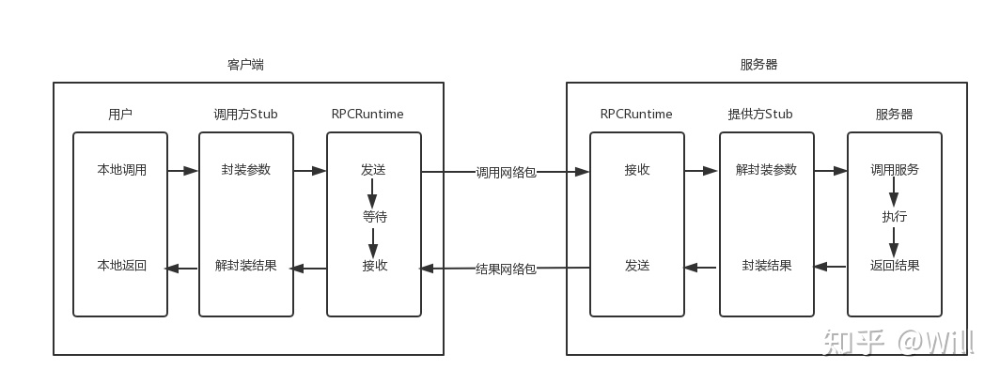
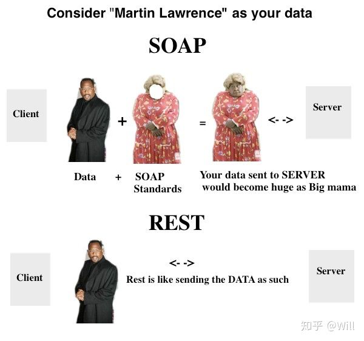

# 浅谈 RPC 和 REST: SOAP, gRPC, REST

⌚️:2020年11月30日

📚参考

---

首先，第一个问题应该是 为什么会将 SOAP 和 REST 进行对比？为了搞清楚这个问题，这篇文章会先介绍 SOAP 基于的模式 RPC，然后依次介绍 RPC 框架 ONC RPC、SOAP、gRPC，最后讲讲 REST ，以及他们的对比。

## **1. RPC**

在网络世界里，不同机器要怎么互相通信？最基础的方法是基于 TCP/IP 通过 Socket 编程去实现调用方和被调用方。但是 Socket 编程的难度大，需要比较强的专业性，实现又复杂，如果每一次机器之间要通信时，程序员都要手动去处理这么多，这就让新手能做的，变成了要精通网络的老师傅才能完成。有没有什么更好的办法呢？

在 1984 年，Bruce Jay Nelson 发表了奠定基础性的论文 [Implementing Remote Procedure Call](https://link.zhihu.com/?target=http%3A//www.cs.cmu.edu/~dga/15-712/F07/papers/birrell842.pdf)，定义了机器之间互通这种远程调用的标准。RPC (Remote Procedure Call) 即远程过程调用，有了它，客户端可以像调用本地接口一样调用远程的服务端。





怎么实现远程调用像本地调用一样呢？RPC 模式分为三层，**RPCRuntime** 负责最底层的网络传输，**Stub** 处理客户端和服务端约定好的语法、语义的封装和解封装，这些调用远程的细节都被这两层搞定了，**用户和服务器**这层就只要负责处理业务逻辑，调用本地 Stub 就可以调用远程。

做个比较通俗的类比，你要叫朋友打游戏，如果你和朋友在同一个地方，面对面，你直接跟他说就行了，但是如果你们不在同一个地方，你可以打个电话，你说的和面对面时说的还是一样的，只是通过了电话把这个消息远程的传递给了对方。

### 1.1 RPC 框架要解决的三个问题

基于上述 RPC 模式，一个 RPC 框架基本需要解决 协议约定、网络传输、服务发现 这三个问题。

**协议约定问题** 指的是怎么规定远程调用的语法，怎么传参数等。用上面的类比，你怎么告诉你的朋友要玩什么游戏？是直接说游戏的名字，王者荣耀，绝地求生，还是说简称，王者，吃鸡，或者用 1 代表王者，2 代表吃鸡，只说 1 或 2。

**传输协议问题** 指的是在网络发生错误、重传、丢包或者有性能问题时怎么办？用上面的类比，你打电话时，刚说了打什么游戏，但是还没有收到对方回复，电话信号不好断了，这时候怎么处理？

**服务发现问题** 指的是如果知道服务端有哪些服务可以调用，从哪个端口访问？服务端可能实现多个远程调用，在不同的进程上，随机监听端口，客户端要怎么才能知道这些端口呢？

接下来，对比几个 RPC 框架是如何解决这几个问题的。

## **2. ONC RPC**

ONC RPC 算是最早 RPC 的一种实现方式，由 Sun 公司开发，在 NFS (Network File System) 中使用。

### 2.1 协议约定

ONC RPC 协议用的是 XDR (External Data Representation)，是一个标准的**数据压缩格式**，所有的请求和回复都有严格的格式要求，并且不能随意更改。

### 2.2 传输协议

ONC RPC 传输方面主要是通过一个状态机来实现。

### 2.3 服务发现

ONC RPC 通过服务端的一个 portmapper 来实现服务发现。服务端在启动时向 portmapper 注册，portmapper 的端口是大家都知道的，所以客户端可以通过 portmapper 找到服务端。

ONC RPC 作为最早的 RPC 框架，还是有很多问题的

1. 协议格式要求严格：需要客户端和服务端的压缩格式**完全一致**。
2. 协议修改不灵活：客户端和服务端都要做修改，如果只有一方做了修改， 那 RPC 就会有错误。这导致版本更新的问题，每一次的版本更新，客户端和服务端基本是耦合的，必须同时作出更改，这就要求开发客户端和服务端的需要是同一批人，或者至少要有密切的交流。
3. 面向函数：随着发展，面向对象是业务逻辑设计的主流，面向函数的 RPC 模式难用。

有没有比 ONC RPC 更好，能广泛应用到各个方面的框架？

## **3. SOAP**

1998 年 XML 1.0 发布，被 W3C (World Wide Web Consortium) 推荐为标准的描述语言。同年，SOAP 也完成了初版设计。SOAP (Simple Object Access Protocol) 简单对象访问协议，在 1998 年因为微软 XML-RPC 的原因，还没有公之于众，一直到 2003 年 6 月的 SOAP 1.2 版本发布，才被 W3C 推荐。

SOAP 是基于**文本 XML** 的 一种应用协议。随着当年 SOA (Service Oriented Architecture) 的走红，提倡将一个大的软件拆分成多个不同的小的服务，SOAP 在服务之间的远程调用大有用武之地。

### 3.1 协议约定

SOAP 的协议约定用的是 WSDL (Web Service Description Language) ，这是一种 Web 服务描述语言，在服务的客户端和服务端开发者不用面对面交流，只要用的是 WSDL 定义的格式，客户端知道了 WSDL 文件，就知道怎么去封装请求，调用服务。

```text
<wsdl:types>
 <xsd:schema targetNamespace="http://www.task.io/management">
  <xsd:complexType name="task">
   <xsd:element name="name" type="xsd:string"></xsd:element>
  <xsd:element name="type" type="xsd:string"></xsd:element>
   <xsd:element name="priority" type="xsd:int"></xsd:element>
  </xsd:complexType>
 </xsd:schema>
</wsdl:types>
```

这只是一个对象类型的定义，一套完整的 WSDL 还会有消息结构体的定义，然后将信息绑定到 SOAP 请求的 body 里，然后编写成 service，具体这里就不展开了。

WSDL 有可以自动生成 Stub 的工具，客户端可以直接通过自动生成的 Stub 去调用服务端。

### 3.2 传输协议

SOAP 是用 HTTP 进行传输的，有个信封的概念，信息就像是一封信，有 Header 和 Body，SOAP 的请求和回复都放在信封里，进行传递。

```text
POST /addTask HTTP/1.1
Host: www.task.io
Content-Type: application/soap+xml; charset=utf-8
Content-Length: nnn
```


```text
<?xml version="1.0"?>
<soap:Envelope xmlns:soap="http://www.w3.org/2001/12/soap-envelope"
soap:encodingStyle="http://www.w3.org/2001/12/soap-encoding">
    <soap:Header>
        <m:Trans xmlns:m="http://www.w3schools.com/transaction/"
          soap:mustUnderstand="1">1234
        </m:Trans>
    </soap:Header>
    <soap:Body xmlns:m="http://www.task.io/management">
        <m:addTask">
            <task>
                <name>Write a blog article</name>
                <type>Writing</type>
                <priority>1</priority>
            </task>
        </m:addTask>
    </soap:Body>
</soap:Envelope>
```

### 3.3 服务发现

SOAP 的服务发现用的是 **UDDI**（Universal Description, Discovery, Integration) 统一描述发现集成，相当于一个注册中心，服务提供方将 WSDL 文件发布到注册中心，使用方可以到这个注册中心查找。

SOAP 在当时也是风靡一时，主要有这些**优点**：

1. 协议约定面向对象，更贴合业务逻辑的应用场景。
2. 服务定义清楚，在 WSDL 能清楚了解到所有服务。
3. 格式不用完全一致，比如上面那个请求里 name, type, priority 的顺序不用完全跟服务端的 WSDL 对应。版本更新上，客户端可以先增加新的项，服务端可以之后再更新。
4. 使用 WS Security 所为安全标准，安全性较高。
5. SOAP 是 **面向动作** 的，支持比较复杂的动作，可以在 XML 里放热和动作，比如 ADD，MINUS

当然，现在新的软件开发，用到 SOAP 的越来越少了，可见 SOAP 也有很多**不足**：

1. 远程调用速度慢，效率低。因为以 XML 作为数据格式，除了主要传输的数据之外，有较多冗余用在定义格式上，占用带宽，并且对于 XML 的序列化和解析的速度也比较慢
2. 协议约定 WSDL 比较复杂，要经过好几个环节才能搞定。
3. SOAP 多数用的是 POST，而 HTTP 有 GET， DELETE，PUT 等很多别的方法，通常是 POST 加上动作，比如 POST CreateTask, POST DeleteTask。而多数用 POST 的原因是 GET 请求最大长度限制较多，而 SOAP 需要把数据加上 SOAP 标准化的格式，请求数据比较大，超过 GET 的限制。
4. SOAP 的业务状态大多是维护在服务端的，比如说分页，服务端会记住用户在哪个页面上，在企业软件中，客户端和服务端比较平衡的情况下是没有问题的，但是在失衡情况下，比如说客户端请求大大超过服务端时，服务端维护所有状态的成本太高，影响并发量。

针对 SOAP 速度慢的缺点，直接的有两种解决方案，一是使用简单一点的文本方式，比如 JSON，二是采用二进制调用。

## **4. gRPC**

像 SOAP 这类基于文本类的 RPC 框架，速度上都是有先天不足的。为了有比较好的性能，还是得用二进制的方式进行远程调用。gRPC 是现在最流行的二进制 RPC 框架之一。2015 年由 Google 开源，在发布后迅速得到广泛关注。

### 4.1 协议约定

gRPC 的协议是 Protocol Buffers，是一种压缩率极高的序列化协议，效率甩 XML，JSON 好几条街。Google 在 2008 年开源了 Protocol Buffers，支持多种编程语言，所以 gRPC 支持客户端与服务端可以用不同语言实现。

### 4.2 传输协议

在 JAVA 技术栈中，gRPC 的数据传输用的是 Netty Channel， **Netty** 是一个高效的基于异步 IO 的网络传输架构。Netty Channel 中，每个 gRPC 请求封装成 HTTP 2.0 的 Stream。

基于 HTTP 2.0 是 gRPC 一个很大的优势，可以定义四种不同的服务方法：单向 RPC，客户端流式 RPC，服务端流式 RPC，双向流式 RPC。

### 4.3 服务发现

gRPC 本身没有提供服务发现的机制，需要通过其他组件。一个比较高性能的服务发现和负载均衡器是 **Envoy**，可以灵活配置转发规则，有兴趣的可以去了解下。

gRPC 是分布式微服务之间通信很好的一个选择，总结起来是因为有这些优点：

1. Protocol Buffers 压缩性高，速度快
2. HTTP 2.0 流传输
3. 支持多语言

gRPC 更多的是用在微服务集群内部，服务与服务之间的通信，服务与客户端之间的通信，REST 可以说是现在的主流。

## **5. REST**

REST (Representational State Transfer) 表述状态转移，是由 Roy Thomas Fielding 在 2000 年提出的，发表在论文 [《架构风格与基于网络的软件架构设计》](https://link.zhihu.com/?target=https%3A//www.ics.uci.edu/~fielding/pubs/dissertation/fielding_dissertation.pdf)。和之前提到的 ONC RPC，SOAP，gRPC 不同，REST 不是一种 RPC 架构，也不是一种协议，而是一种 **架构风格**，基于这种风格也能实现客户端与服务端之间的通信，因为 REST API 的简单直接，基本成为了互联网应用的标准接口。

### 5.1 协议约定

REST 没有严格规定的标准。与 SOAP 对比，更加侧重的是服务端的**资源**，而不是状态。拿刚刚 SOAP 分页的例子来说，SOAP 服务端会储存所有的分页状态，而 REST 的分页请求可能是这样的 `/tasks?page=1&per=50` ，（每页50条，访问第一页），REST 将分页状态这部分的责任交由客户端来维护，服务端只需要维护**资源状态**，而不用去维护与客户端之间的**会话状态**。

### 5.2 传输协议

REST 是基于 HTTP 的文本类传输方式，与 SOAP 的 XML 相比，REST 用的是 Json，格式更加简单易懂。

### 5.3 服务发现

RESTful API 的服务发现有很多组件，比如说 Eureka，可以作为服务注册中心，也能用来做负载均衡和容错。

详细介绍 REST 的文章一搜一大把，这里就不赘述了。

## **6. SOAP 与 REST 对比**

前面的长篇大伦，介绍了 RPC 的介绍和各种不同 RPC 框架的演变和优劣。我们回到最开始提出的那个问题 `SOAP` 和 `REST` 之间的区别是什么？

首先，他们都是实现了客户端与服务端的分离，客户端能远程调用服务端。

SOAP 是一种 RPC 框架，HTTP 是承载协议，本身是一种应用协议，实现了调用远程就像调用本地接口一样。而 REST 是一种架构风格，客户端需要通过 URL 去调用服务端，HTTP 本身即是承载协议，也是应用协议。

REST 的性能比 SOAP 更好。两者都是基于文本类的传输，REST 用的 Json 比 SOAP 的 XML 格式更加简单轻巧（参考下图），因此 REST 的性能会更好些。





SOAP 适合企业应用，REST 更适合高并发场景。 SOAP 的业务状态大多是维护在服务端的，而 REST 是无状态的操作，维护的是**资源状态**，将会话状态交由客户端维护。因此，SOAP 更适合企业软件中客户端与服务端比较平衡的情况，REST 更适合互联网应用中，多客户端的高并发场景，利于横向扩展。（分页的例子）

REST 更适合**缓存**，因为 REST 是无状态操作，信息可以被缓存。

SOAP 是「面向动作」的，多数用的是 POST，可以支持多步操作，或者各种动作，比如 ADD，MINUS 等。REST 是「面向资源」的，通过 GET, POST, DELETE, PUT 来调取和维护服务端的资源。

SOAP 相比于 REST 有许多安全标准，相对来说安全性更高。

这篇文章介绍了 RPC 和几种不同的 RPC 框架，最后对 SOAP 和 REST 进行了直接对比，算是最近看这些东西的一个总结梳理。当然还可以有很多延伸内容，比如说 有兴趣的朋友可以对比一下 REST 与 gRPC 。

## 