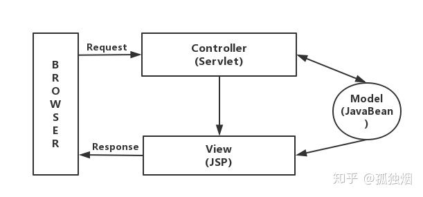
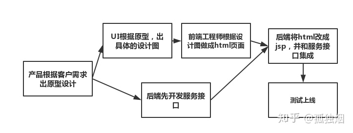
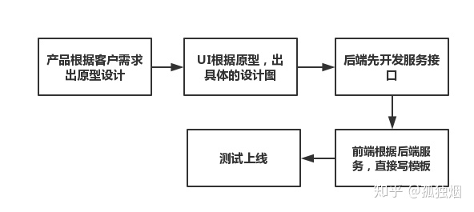
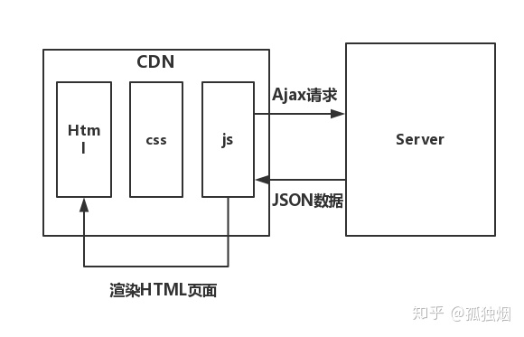
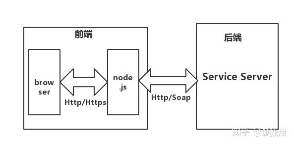
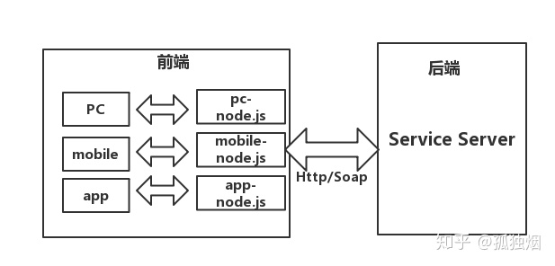

# 为什么前后端分离？

⌚️:2020年11月30日

📚参考

----

## 引言

由于近期前端抽不出资源，博主最近接手一个前端项目的代码维护工作。拿到手一看，一脸懵逼，和博主当年所学的jsp开发方式、利用ajax来请求数据的单页面开发方式完全不同。然而火坑已经跳下，只能硬着头皮啃，博主只能默默告诉自己:"**冲冲冲，四驱战士在行动！**"

博主勉强算是经历了前端开发的几个时期吧。本文以一种循序渐进的方法，讲前后端分离架构的必要性。不过不得不说一点，目前前后端分离架构的文章一搜一大把，博主毕竟不是专业搞前端的，如果文章有什么理解不到位的地方，请及时指出，不胜感激。

以博主的资历，没有经历过更早的时期了，一出山SpringMVC和struts2等架构已经很成熟，所以博主最早接触的开发方式就是从MVC开发方式开始的，博主将**开发方式分为未分离，半分离和分离三个时期**。

## 1. 未分离时期

MVC，博主就不多做解释了，在早期JSP+SERVLET中的结构图如下 



大致就是所有的请求都被发送给作为控制器的Servlet，它接受请求，并根据请求信息将它们分发给适当的JSP来响应。同时，Servlet还根据JSP的需求生成JavaBeans的实例并输出给JSP环境。JSP可以通过直接调用方法或使用UseBean的自定义标签得到JAVABeans中的数据。需要说明的是，这个View还可以采用 Velocity、Freemaker 等模板引擎。使用了这些模板引擎，可以使得开发过程中的人员分工更加明确，还能提高开发效率。 那么，在这个时期，开发方式有如下两种 

方式一: 



方式二: 



先说明一下，方式二已经逐渐淘汰。主要原因有两点: 

- (1)前端在开发过程中严重依赖后端，在后端没有完成的情况下，前端根本无法干活。 
- (2)由于趋势问题，会JSP,懂velocity,freemarker的前端越来越少。

因此，方式二逐渐不被采用。然而，不得不说一点，方式一，其实很多小型传统软件公司至今还在使用。那么，方式一和方式二具有哪些共同的缺点呢?

### 1.1 前端无法单独调试

在项目上线后，遇到一些问题。比如样式出问题了，由于前端不具备项目开发环境，那么就有可能出现如下对话

```text
前端:"我这里没问题啊。后端，你那里正常么？"
后端:"我这里不正常啊。要不你过来看一下吧?"
前端:"一时我也看不出问题，我也没环境，怎么办？"
后端:"你没环境，坐我这边调吧。"
然后，前端就满脸不爽的在你那调代码了。更有些情商低的后端就直接在旁边开摁手机，实在是。。。。。
```

总结，因为前端无法单独调试。一方面开发效率降低。另一方面，还有可能引发公司内部人员上的矛盾。

### 1.2 前端不可避免会遇到后台代码

比如前端可能碰到如下结构的代码

```text
<body>
<%
request.setCharacterEncoding("utf-8")
String name=request.getParameter("username");
out.print(name);
%>
</body>
```

身为前端，在页面里看到了后台代码，必然内心是十分不快的，这种方式耦合性太强。那么，就算你用了freemarker等模板引擎，不能写JAVA代码。那前端也不可避免的要去重新学习该模板引擎的模板语法，无谓增加了前端的学习成本。 正如我们后端开发不想写前端一样，你想想如果你的后台代码里嵌入前端代码，你是什么感受？因此，这种方式十分不妥。

### 1.3 JSP本身所导致的一些其他问题

比如，JSP第一次运行的时候比较缓慢，因为里头包含一个翻译为Servlet的步骤。再比如因为同步加载的原因，在jsp中有很多内容的情况下，页面响应会很慢。

## 2. 半分离时期

前后端半分离，前端负责开发页面，通过接口（Ajax）获取数据，采用dom操作对页面进行数据绑定，最终是由前端把页面渲染出来。这也就是其他博客里说的，Ajax与SPA应用（单页应用）结合的方式。其结构图如下 



步骤如下: 

- (1)浏览器请求，cdn返回html页面 
- (2)html中的js代码以ajax方式请求后台的restful接口
- (3)接口返回json数据，页面解析json数据，通过dom操作渲染页面 ps：博主早期就是用jquery的ajax请求，然后这么做的。 

**为什么说是半分离的？**

因为不是所有页面都是单页面应用，在多页面应用的情况下，前端因为没有掌握controller层，前端需要跟后端讨论，我们这个页面是要同步输出呢，还是异步json渲染呢？因此，在这一阶段，只能算半分离。

**这种方式的优缺点有哪些呢？**

首先，这种方式的优点是很明显的。前端不会嵌入任何后台代码，前端专注于html、css、js的开发，不依赖于后端。自己还能够模拟json数据来渲染页面。发现bug，也能迅速定位出是谁的问题，不会出现互相推脱的现象。 然而，在这种架构下，还是存在明显的弊端的。最明显的有如下几点：

- (1)js存在大量冗余，在业务复杂的情况下，页面的渲染部分的代码，非常复杂。
- (2)在json返回的数据比较大的情况下，渲染的十分缓慢，会出现页面卡顿的情况 
- (3)seo非常不方便，由于搜索引擎的爬虫无法爬下js异步渲染的数据，导致这样的页面，SEO会存在一定的问题。
- (4)资源消耗严重，在业务复杂的情况下，一个页面可能要发起多次http请求才能将页面渲染完毕。可能有人不服，觉得pc端建立多次http请求也没啥。那你考虑过移动端么，知道移动端建立一次http请求需要消耗多少资源么？ 正是因为如上缺点，真正的前后端分离架构诞生了

## 3. 分离时期

在这一时期，扩展了前端的范围。认为controller层也属于前端的一部分。在这一时期 前端：负责View和Controller层。 后端：只负责Model层，业务处理/数据等。 **可是前端不懂后台代码呀？controller层如何实现呢？** 

这就是node.js的妙用了，node.js适合运用在高并发、I/O密集、少量业务逻辑的场景。最重要的一点是，前端不用再学一门其他的语言了，对前端来说，上手度大大提高。 于是，这一时期架构图如下 



**增加node.js作为中间层，具体有哪些好处呢？**

### 3.1 好处

#### 适配性提升

我们其实在开发过程中，经常会给pc端、mobile、app端各自研发一套前端。其实对于这三端来说，大部分端业务逻辑是一样的。**唯一区别**就是交互展现逻辑不同。如果controller层在后端手里，后端为了这些不同端页面展示逻辑，自己维护这些controller，徒增和前端沟通端成本。 如果增加了node.js层，此时架构图如下 



在该结构下，每种前端的界面展示逻辑由node层自己维护。如果产品经理中途想要改动界面什么的，可以由前端自己专职维护，后端无需操心。前后端各司其职，后端专注自己的业务逻辑开发，前端专注产品效果开发。

#### 响应速度提升

我们有时候，会遇到后端返回给前端的数据太简单了，前端需要对这些数据进行逻辑运算。那么在数据量比较小的时候，对其做运算分组等操作，并无影响。但是当数据量大的时候，会有明显的卡顿效果。这时候，node中间层其实可以将很多这样的代码放入node层处理、也可以替后端分担一些简单的逻辑、又可以用模板引擎自己掌握前台的输出。这样做灵活度、响应度都大大提升。

#### 性能得到提升

大家应该都知道单一职责原则。从该角度来看，我们请求一个页面，可能要响应很多看后端接口，请求变多了，自然速度就变慢了，这种现象在mobile端更加严重。采用node作为中间层，将页面所需要的多个后端数据，直接在内网阶段就拼装好，再统一返回给前端，会得到更好的性能。

### 3.2 分离所带来的缺点

在分析缺点之前，容博主先自责一下。博主拿着底层程序员的工资，想着架构师，甚至是部门leader该考虑的问题了。博主有罪！ok，说重点。 先上结论，**中小型软件公司，慎用前后端分离架构！慎用！**

#### 人员问题

大家自己留意一下宣传这种架构的是什么级别的公司，中小型公司一般没有这样的前端资源来支撑这样的架构。如果强推这样的分离架构会导致一个后果，后端被硬逼着去学vue.js，node.js这些，白白增加后端的负担。最后处理不好，会出现一个后端纷纷离职的场面，

####  产品迭代周期问题

中小型软件公司，一般需要一个比较快的软件迭代周期。采用分离架构，增加了一个接口制定流程和前后端联调流程。从本质上来说，放慢了迭代周期。

#### 前端需要学习业务

本来前端只需要掌管视觉交互的部分。现在因为controller层也归前端管了，前端必须对公司的业务流程有深入的了解，才能准确的写出显示逻辑。不过这样会让后端觉得，前端夺权，前端在混KPI。前端也必须要去学无聊的业务，不过正所谓有得必有失，前端因此也能够站稳脚跟。或许正是因为前后端分离架构的出现，前端可以朝着架构师进军吧。

## 结语

本文讨论了前后端未分离、半分离、分离的架构、以及各自架构演进的原因。博主前端也只能算是半吊子水平吧。其实大家发现了么，靠着前端进BAT，比靠后端进BAT难度小的多，博主也曾经动摇过，不过还是坚持在后端继续深造。


