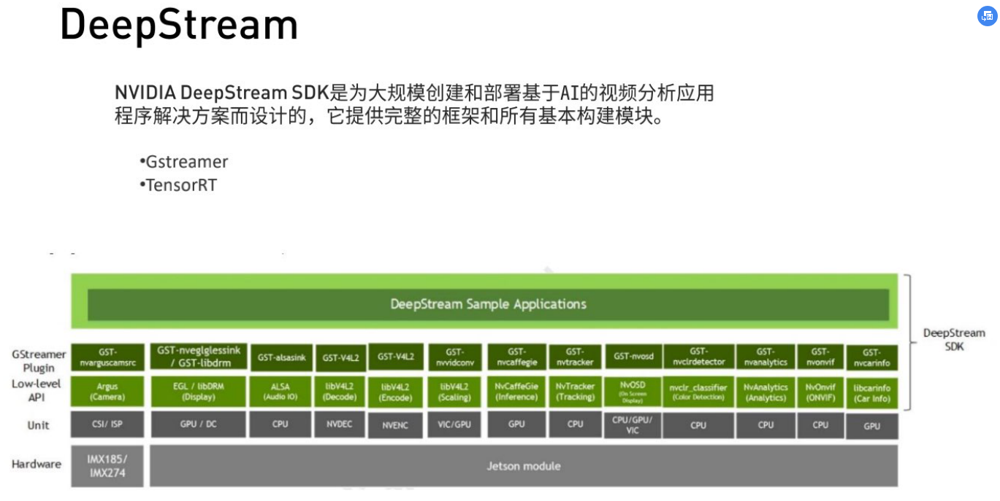
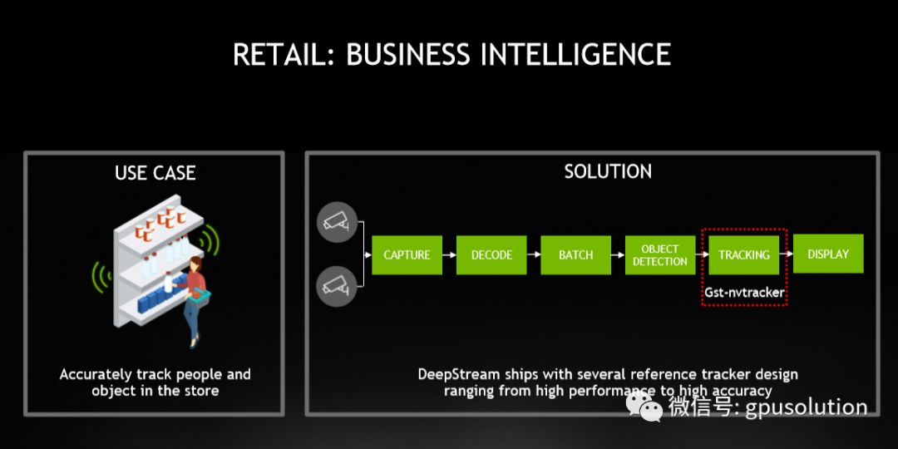

# NVIDIA Deepstream 4.0笔记

⌚️: 2019年8月27日

📚参考

-  [原文](https://cloud.tencent.com/developer/article/1494234)

---

## 一、加速基于实时AI的视频和图像分析

本次笔记整理自NVIDIA 8月20日在线研讨会，原讲座标题：DEEPSTREAM SDK – ACCELERATING REAL-TIME AI BASED VIDEO AND IMAGE ANALYTICS

目录：

智能视频分析的应用场景：

应用程序的类型可能不同，但从视频像素到分析的流程在所有用例中仍然很常见。某些应用程序可能需要在边缘设备（如NVIDIA Jetson或Prem服务器）上进行处理。边缘的使用范围从安全到监控施工现场到制造。对于小型企业而言，ON-Prem Server（本地服务器）可以像基于人工智能的VR网络录像机一样简单。于其他应用程序，所有处理都可能在云上进行。DeepStream提供在边缘或云上的灵活部署。对于其他应用程序，所有处理都可能在云上进行.DeepStream提供在边缘或云上的灵活部署。Deesptream还集成了Nvidia的迁移学习工具包（TLT），您可以使用TLT为您的应用程序训练预训练模型。经过预先训练的模型可在NGC上获得。 您可以从NGC中取出所有内容，使用TLT重新训练并在deepStream上部署。

这是应用级别的整个deepsteam软件堆栈。顶部是应用程序。在应用程序层下面是SDK。Deepstream是一个流分析工具包，由各种硬件加速插件组成，可为任何计算机视觉和I VA应用程序提供最高吞吐量。配置方面，开发者可以利用NVIDIA容器runtime来配置自己的Deepatream应用。NVIDIA docter runtime可以启用[GPU](https://cloud.tencent.com/product/gpu?from=10680)。整个应用都可以在一个Docker Contrainer里面打包。另外NVIDIA还提供了reference application和 orchestration recipes可以帮助你启动任何创意项目。最后就是跟云相连，DeepStream支持使用Azure lOT运行时与Microsoft Azure lOT[云通信](https://cloud.tencent.com/product/im?from=10680)。这允许与云的无缝连接来运行分析和管理设备。

堆栈的下一级是CUDA X，它列出了Deepstream插件使用的各种NVIDIA软件技术。 

在最底部列出了完整硬件堆栈。未来的应用程序可以在NVIDIA Jetson平台或数据中心上运行

Deepstream 4.0代表了功能可扩展性和可移植性的重大改变。

Deep stream 4.0的灵魂是支持NVIDIA Unified SDK的所有平台，从新推出的Jetson Nano到数据中心GPU，开发人员可以在一个平台上开始开发，然后将其移植到同一代码库不同平台上。

Deepstream 4.0提供交钥匙集成以连接到Microsoft Azure loT hub，我们有消息代理插件。Microsoft Azure loT帮助可用于连接管理和监视IOT边缘设备。

NVIDIA 为Deepstream 3.0的GPU产品发布了部署容器，到了DeepStream 4.0,NVIDIA 提供了对Jetson平台的容器化部署.

 4.0还为工业和零售用例发布了新的模型和功能。有新的模型支持单色或灰度图像的图像分割。此外，NVIDIA正在添加硬件加速的PEG解码和编码。

最后，我们第一次开源了几个主要的插件源代码。这为我们的开发人员提供了更大的灵活性和控制性。 目前正在开源的是推理、解码和消息插件。

这是从像素到视频分析的典型构思图形的高级视图。摄像机上的像素在预处理后被捕获解码并进行预处理。我们将其应用于深度学习或AI以从视频中获得一些见解， 这个内部可以在屏幕上查看，或者可以发送到数据中心或云以进行进一步分析。 

这个用于处理和理解视频或图像的pipline是工业的，不同行业之间可能存在一些细微差别。但总的来说，工作流程仍然非常相似。

DeepStream SDK是一个流分析工具包。基于开源Gstreamer平台的即插即用架构。这使得开发人员不仅可以灵活地使用NVIDIA自带的插件，还可以使用其他开源插件或创建自己的插件并在管道中使用它。

这是一个典型的Ivy管道，由deepstream插件构建，在底部，它显示了插件使用的底层硬件。第一步是捕获流数据。这可能来自RTSP流文件或USB或CSI摄像机。捕获之后，下一步是解码流。解码器插件使用NVIDIA的硬件加速解码引擎。与GPU上的CUDA内核不同。解码帧之后，可能需要进行一些预处理。这可以是图像转换、图像缩放、裁剪或如果流是来自一个360度摄像头，然后你需要转移图像。对于这个操作有各种各样的加速器。接下来的操作是推理，它执行对象检测分类和分割。这是运行在GPU或Jetson AGX Xavier的DLA上。 

在进行推理之后，您可能需要跟踪对象以获得深入的了解，最后一步是使用附加元数据在屏幕上查看视频，或者仅将元数据发送到云中进行分析。

这是deepstream SDK中包含的插件列表。

第一个是NVIDIA4linux2，视频和图像解码和编码插件。

第二个是nvinfer，这是一个推理插件，在各种推理加速器上使用tensorRT，这样就可以对目标检测图像进行分类和分割.

第三个是nvtracker，部署几个参考跟踪器，比如KLT、IOU和NvDCF

第四是nvmsgbroker，这允许使用各种协议向云发送消息。

有关如何使用此插件的更多信息，请参考文档中的Plugins菜单。

这是在不同NVIDIA平台上利用Deepstream达到的实时性能。更详细的信息可以参考NVIDIA Deepstream开发者手册

下一部分我们将一起来看几个利用Deepstream SDK的工业案例，敬请大家关注本次话题。

## 二、智能零售场景应用

我们已经整理了第一点和第二点：

[NVIDIA Deepstream 4.0笔记（一）：加速基于实时AI的视频和图像分析](http://mp.weixin.qq.com/s?__biz=MjM5NTE3Nzk4MQ==&mid=2651235324&idx=1&sn=31ea6401e66456a2c347c30cedae3724&chksm=bd0e776e8a79fe78c8ac2b3699f7b9de3d6e893e9d7962a0b8d64a145db490fb73a056cc92f9&scene=21#wechat_redirect)

接下来的几篇我们从几个实际的案例来讲解如何构建Deepstream

今天讲第三点中的Smart Retail

智能提取商业信息对于今天的零售业来说是至关重要的，它可以帮助零售商更好地管理库存，改善客户体验，减少损失。

摄像头提供了丰富的情报来源。其中一个零售用例就是跟踪。得到准确的内部客户,它需要准确地追踪人们在商店的更多信息。

Pipline中列出的插件都是在SDK中提供的。Deeptream可以帮助零售商使用深度学习和人工智能来理解视频中的内容。SDK中的一个插件叫Tracking插件。跟踪器为每个检测到的对象分配ID。此唯一ID将保存在相关人员身上，直到该人员离开视野。跟踪器可以准确的计算出在任何指定地点购物里面的人数，以及他们在每条过道上花了多长时间。Deepstream提供了多种跟踪器的参考设计，从高性能到高精度不等。

这是NVTRACKER插件的一个框架。插件的输入是视频缓冲区，加上一些关于对象的元数据。这将是检测到的对象的边界框位置。这个插件的结果是缓冲区加上对象ID修改后的元数据。跟踪器跟踪对象的方法是为每个对象分配唯一的对象ID。这将添加到元数据字段中，以区别于其他对象。可用的各种跟踪器有NvDCF、KLT和IOU。开发人员还可以选择在跟踪器插件中添加自定义跟踪器。开发人员可以配置各种参数,如跟踪器宽度和高度,追踪类型。和基于GPU的跟踪器的GPU ID。

现在让我们比较一下提供3种跟踪器。

IOU跟踪器非常轻便。基于CPU的跟踪器，提供最高的性能。缺点是它很容易频繁切换ID，不适合快速移动的场景。IOU跟踪器的用例是跟踪分布在不同大小范围内的对象。

接着是基于CPU的KLT跟踪器。这对于简单的场景非常有效，但是使用CPU的成本很高。由于噪音或阴影等干扰，它也非常容易受到视觉外观变化的影响。

第三个也是最后一个跟踪器是GPU基础NVDCF跟踪器。这是一个高度鲁棒的跟踪器，对部分闭塞的工作相当好。这样就不太容易发生ID切换。NVDCF跟踪器的缺点是它比KLT的IOU慢,y因为计算复杂度增加。由于它是一个基于GPU的跟踪器，它将减少处理的流的总数。

总的来说，有了三个跟踪器，开发人员可以在提供最高性能的跟踪器和提供高精度和鲁棒性性的跟踪器之间进行选择。

下一节将讲解智慧城市的场景，敬请大家关注

## 三、智能交通场景应用

今天我们讲解智能交通系统

使用大量相机的另一个地方是城市。您需要分析数以千计的相机。从这些相机中获取洞察力可以帮助减少我们城市的交通拥堵，并使我们的道路更安全。道路上的异常可以立即被警报机构检测到。此外，由于带宽限制，将数TB的视频数据传输到云可能是不可行的。因此，您需要一种分析边缘像素的解决方案，并仅将重要元数据传输到云或分析服务器以获得进一步的见解。右边是智能城市的解决方案，它可以实现边缘感知，而且只需要元数据到云端，DeepStream及其消息代理插件，提供从边缘设备无缝连接到云的能力。

NVmsgconv和nvmsgbroker插件允许感知图通过消息缓存连接到分析服务器或云。它接收输入元数据并创建通过此支持的协议发送的消息。首先，消息Converter插件很少解析基本元数据格式并生成schema。schema可以是deepsteam中的预定义模式之一，也可以完全自定义。有效负载（payload）数据采用JSON格式。消息代理插件使用其中一个定义的协议将此有效负载从消息转换器发送到服务器。很少有参考应用程序可以帮助您开始使用消息代理在外部与云或服务器进行通信。

让我们深入研究Deepstream 4.0中可用的不同协议。NVIDIA意识到连接到云服务对于IOT应用程序来说非常重要。在Deepstream3.0中有提供Kafka协议，  4.0后重新添加对特定于框架的客户端（如Microsoft Azure lOT）的支持，这是使用MQTT协议，为Deepstream应用程序提供自动框功能，以将消息发布到Azure lOT Central。

NVIDIA支持的第三个协议是AMQP。

请参阅插件菜单中有关消息代理的完整章节。

这是一个智能交通系统的应用程序。在感知pipline里，像素在边缘设备内部进行转换，然后，分析工作流将获取此元数据并创建可搜索的分析，并显示在Web浏览器上以进行可视化。

在Trajectory 处理部分中，使用道路网络和摄像机校准将图像坐标映射到地理坐标。摄像机校准在分析引擎外部提供。 ROI（感兴趣的区域）将重点关注分析只有在路上的汽车。 道路网络还可以帮助计算路段的速度。实现了几种异常检测。一些是基于规则的，一些是来自LSTM模型。规则可能是超速违规或意外停止。基于规则可能是加速违规或意外停止。 基于LSTM的，可能是汽车驾驶方向错误。 它查看序列的顺序，任何偏离标准的东西都被归类为异常。但搜索索引器可以搜索任何事件或异常。您将在演示中看到整个Pipline。相机上的元数据机器被发送到VMS。这用于记录视图或搜索任何流。最后，可以使用Web浏览器访问所有信息。

让我们探索分析应用程序的体系结构。分析的部署可以在云或Kubernetes集群中进行。Kafka消息代理从边缘设备读取消息并将其发送到Apache spark引擎和Logstash。Apache spark将分析流数据并构建汽车轨迹同时检测异常情况。用于ETL的Logstash处理原始数据并将其发送到搜索索引器。搜索索引器使用弹性搜索实现。PMS将记录来自摄像机的实时流以播放异常并将其显示在屏幕上。此API将显示在给定道路之间行驶的汽车的速度数。Kibana用于创建此分析仪表板，从而为浏览器提供易于使用的界面。

我们系统性地看一下DEMO视频

