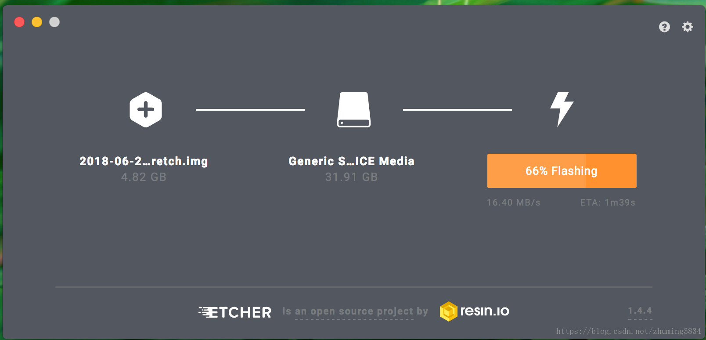
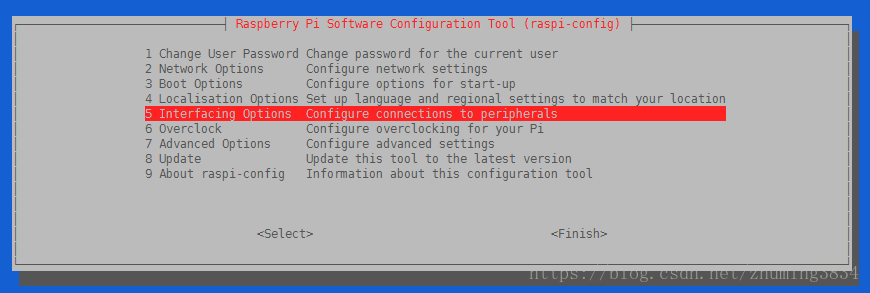
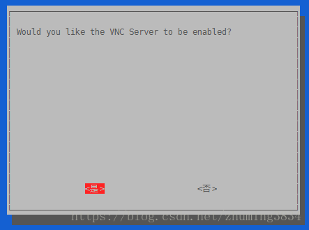
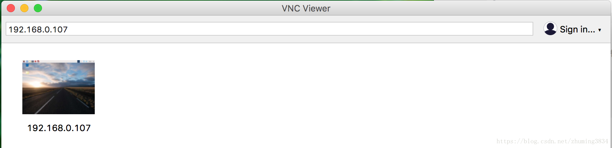
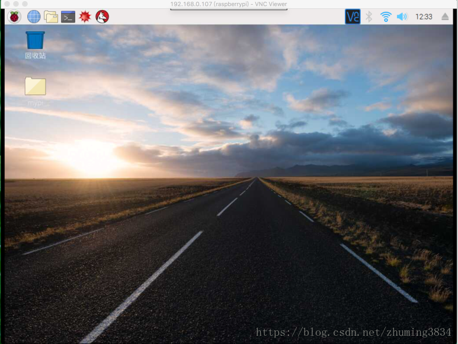

# 树莓派3B+ Mac安装树莓派系统

⌚️: 2021年4月1日

📚参考

----

## 1. 下载树莓派系统(桌面版本)

下载地址：https://www.raspberrypi.org/downloads/raspbian/

## 2. 下载ETCHER软件

下载地址：https://www.balena.io/etcher/

## 3. 烧写系统

烧写系统这个就是把刚才下载的系统zip格式文件先解压初img格式文件，再打开`ETCHER`烧写即可。 

等待烧写完成即可，最后进入内存卡在boot目录下面新建一个`ssh`文件，这个和windows下安装是一样的，方便第一次连接树莓派使用。

## 4. 树莓派开机启动

把内存卡插入树莓派，上电启动。 

第一次默认用户和密码 

用户名：pi 

密码：raspberry 

通过ssh就可以连接上树莓派了。

## 5. 设置树莓派

1.ssh连接树莓派之后，执行`sudo su`切换到root用户; 

2.执行`raspi-config`调出配置页面： 

 

(1)用户设置 

(2)网络设置 

(3)boot启动项设置 

(4)本地化设置，语言，wifi等 

(5)链接接口设置 

…… 

这里我在截图之前就配置好了的，下面会出现中文的。

这里是打开VNC连接。一路点击是或者确定即可。至于其他设置，我想只要不是英文很差的，基本一看就会。

## 6.VNC连接树莓派

VNC Viewer下载地址：https://www.realvnc.com/en/connect/download/viewer/ 

由于我已经连接过，所以下面会存在。 

VNC连接进入桌面之后，剩下的都是界面操作就简单做了。分辨率，语言，键盘，wifi，IIC，SPI等都可以图形化的设置了。

