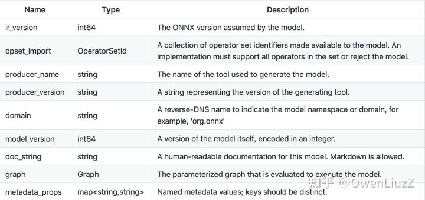
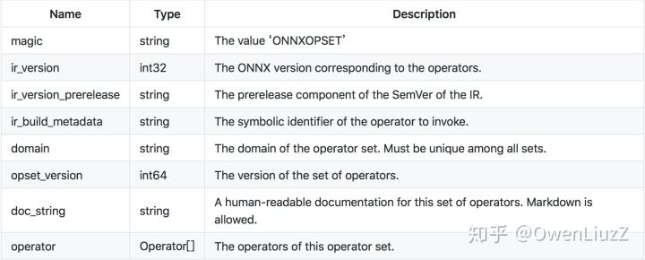
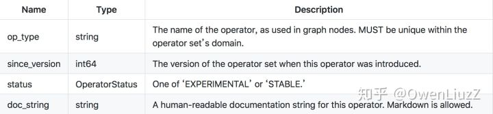
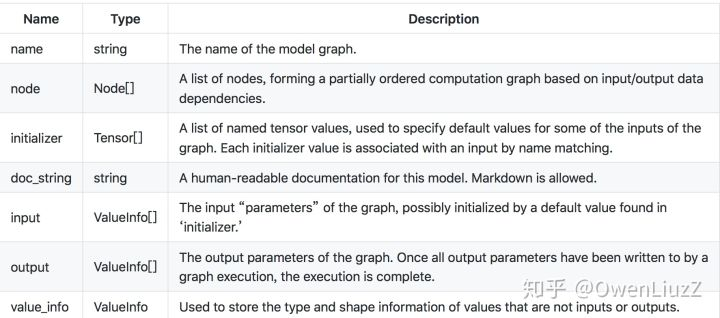
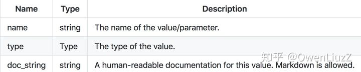
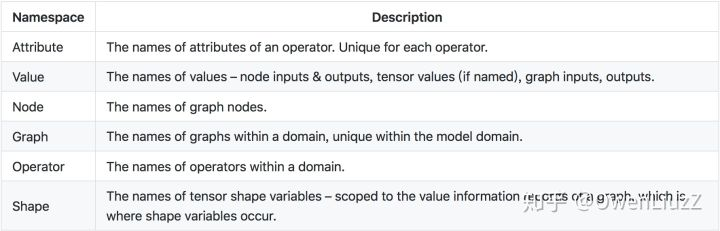
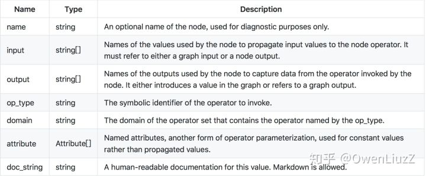
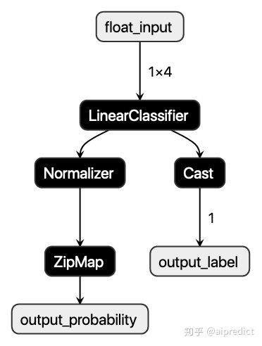
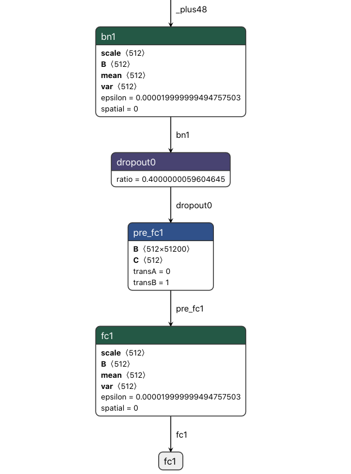
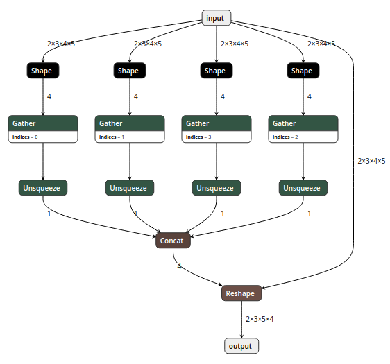

# ONNX介绍

⌚️: 2020年10月23日

📚参考

- ONNX官网：[https://onnx.ai/](https://link.zhihu.com/?target=https%3A//onnx.ai/)
- AutoDeployAI官网：[https://www.autodeploy.ai/](https://link.zhihu.com/?target=https%3A//www.autodeploy.ai/)
- ONNX Github：[https://github.com/onnx/onnx](https://link.zhihu.com/?target=https%3A//github.com/onnx/onnx)
- ONNX Runtime：[https://github.com/microsoft/onnxruntime](https://link.zhihu.com/?target=https%3A//github.com/microsoft/onnxruntime)
- https://zhuanlan.zhihu.com/p/86867138
- https://bindog.github.io/blog/2020/03/13/deep-learning-model-convert-and-depoly/

---

## 1. ONNX简介

### 1.1 背景

现如今，各大主流深度学习框架都有着自己独有的特点与魅力，吸引着广大科研与开发人员，例如：

- [Caffe2](https://link.zhihu.com/?target=http%3A//caffe2.ai/)：方便机器学习算法和模型大规模部署在移动设备
- [PyTorch](https://link.zhihu.com/?target=http%3A//pytorch.org/)：PyTorch是一个快速便于实验深度学习框架。但是由于其高度封装，导致部分function不够灵活
- [TensorFlow](https://link.zhihu.com/?target=https%3A//www.tensorflow.org/)：TensorFlow 是一个开放源代码软件库，是很多主流框架的基础或者依赖。几乎能满足所有机器学习开发的功能，但是也有由于其功能代码过于底层，学习成本高，代码冗繁，编程逻辑与常规不同等缺点。

此外还有：[Cognitive Toolkit (CNTK)](https://link.zhihu.com/?target=https%3A//www.microsoft.com/en-us/cognitive-toolkit/)，[Apache MXNet](https://link.zhihu.com/?target=http%3A//mxnet.incubator.apache.org/)，[Chainer](https://link.zhihu.com/?target=https%3A//chainer.org/)，[Apple CoreML](https://link.zhihu.com/?target=https%3A//developer.apple.com/documentation/coreml)，[SciKit-Learn](https://link.zhihu.com/?target=http%3A//scikit-learn.org/)，[ML.NET](https://link.zhihu.com/?target=https%3A//github.com/dotnet/machinelearning/)

深度学习算法大多通过计算数据流图来完成神经网络的深度学习过程。 一些框架（例如CNTK，Caffe2，Theano和TensorFlow）使用静态图形，而其他框架（例如PyTorch和Chainer）使用动态图形。 但是这些框架都提供了接口，使开发人员可以轻松构建计算图和运行时，以优化的方式处理图。 这些图用作中间表示（IR），捕获开发人员源代码的特定意图，有助于优化和转换在特定设备（CPU，GPU，FPGA等）上运行。

假设一个场景：现在某组织因为主要开发用TensorFlow为基础的框架，现在有一个深度算法，需要将其部署在移动设备上，以观测变现。传统地我们需要用caffe2重新将模型写好，然后再训练参数；试想下这将是一个多么耗时耗力的过程。

此时，ONNX便应运而生，Caffe2，PyTorch，Microsoft Cognitive Toolkit，Apache MXNet等主流框架都对ONNX有着不同程度的支持。这就便于了我们的算法及模型在不同的框架之间的迁移。

> 典型的几个线路：
>
> - Pytorch -> ONNX -> TensorRT
> - Pytorch -> ONNX -> TVM
> - TF – ONNX – ncnn

### 1.2 ONNX出现

开放神经网络交换ONNX（Open Neural Network Exchange）是一套表示深度神经网络模型的开放格式，由微软和Facebook于2017推出，然后迅速得到了各大厂商和框架的支持。通过短短几年的发展，已经成为表示深度学习模型的实际标准，并且通过`ONNX-ML`，可以支持传统非神经网络机器学习模型，大有一统整个AI模型交换标准。

ONNX定义了一组与环境和平台无关的标准格式，为AI模型的互操作性提供了基础，使AI模型可以在不同框架和环境下交互使用。硬件和软件厂商可以基于ONNX标准优化模型性能，让所有兼容ONNX标准的框架受益。目前，ONNX主要关注在模型预测方面（inferring），使用不同框架训练的模型，转化为ONNX格式后，可以很容易的部署在兼容ONNX的运行环境中。

## 2. ONNX标准介绍

ONNX规范由以下几个部分组成： 

- 一个可扩展的**计算图模型**：定义了通用的计算图中间表示法（Intermediate Representation）。 
- 内置**操作符集**：`ai.onnx`和`ai.onnx.ml`，`ai.onnx`是默认的操作符集，主要针对神经网络模型，`ai.onnx.ml`主要适用于传统非神经网络机器学习模型。 
- **标准数据类型**。包括张量（tensors）、序列（sequences）和映射（maps）。

目前，ONNX规范有两个官方变体，主要区别在与支持的类型和默认的操作符集。ONNX神经网络变体只使用张量作为输入和输出；而作为支持传统机器学习模型的`ONNX-ML`，还可以识别序列和映射，`ONNX-ML`为支持非神经网络算法扩展了ONNX操作符集。

ONNX使用protobuf序列化AI模型，顶层是一个模型（Model）结构，主要由关联的元数据和一个图（Graph）组成；图由元数据、模型参数、输入输出、和计算节点（`Node`）序列组成，这些节点构成了一个计算无环图，每一个计算节点代表了一次操作符的调用，主要由节点名称、操作符、输入列表、输出列表和属性列表组成，属性列表主要记录了一些运行时常量，比如模型训练时生成的系数值。

好吧，如果光看前面的话，可能第一次接触ONNX的童鞋们可能会有点懵。那我们干脆直接一点。假如我们利用Pytorch训练好一个模型，然后我们将其保存为.pt文件：比如就叫做`model.pt`，这个我们应该很熟悉吧，二进制的模型权重文件，我们可以读取这个文件，相当于预加载了权重信息。

那ONNX呢，利用Pytorch我们可以将`model.pt`转化为`model.onnx`格式的权重，在这里onnx充当一个后缀名称，`model.onnx`就代表ONNX格式的权重文件，这个权重文件不仅包含了权重值，也包含了神经网络的网络流动信息以及每一层网络的输入输出信息和一些其他的辅助信息。

简单拿netron这个工具来可视化(读取ONNX文件)一下：


如图，ONNX中的一些信息都被可视化展示了出来，例如文件格式`ONNX v3`，该文件的导出方`pytorch 0.4`等等，这些信息都保存在ONNX格式的文件中。

### 2.1  **ONNX model**

The top-level ONNX construct is a ‘Model.’

模型结构的主要目的是将元数据(meta data)与图形(graph)相关联，图形包含所有可执行元素。 首先，读取模型文件时使用元数据，为实现提供所需的信息，以确定它是否能够：执行模型，生成日志消息，错误报告等功能。此外元数据对工具很有用，例如IDE和模型库，它需要它来告知用户给定模型的目的和特征。

每个model具有以下组件：



### **2.2 ONNX Operator Sets:**

每个模型必须明确命名它依赖于其功能的运算符集。 操作员集定义可用的操作符，其版本和状态。 每个模型按其域定义导入的运算符集。 所有模型都隐式导入默认的ONNX运算符集。

运算符集的属性是：



### **2.3 ONNX Operator**

图(graph)中使用的每个运算符必须由模型(model)导入的一个运算符集明确声明。

运算符定义的属性是**：**



### **2.4 ONNX Graph**

序列化图由一组元数据字段(metadata)，模型参数列表(a list of model parameters,)和计算节点列表组成(a list of computation nodes)。

每个计算数据流图被构造为拓扑排序的节点列表，这些节点形成图形，其必须没有周期。 每个节点代表对运营商的呼叫。 每个节点具有零个或多个输入以及一个或多个输出。

图表具有以下属性：



Each graph MUST define the names and types of its inputs and outputs, which are specified as ‘value info’ structures, having the following properties:



### **2.5 Names Within a Graph**

所有名称必须遵守C标识符语法规则。

节点，输入，输出，初始化器和属性的名称被组织到多个名称空间中。 在命名空间内，每个给定图形的每个名称必须是唯一的。

The namespaces are:



### **2.6 Node**

计算节点由名称，它调用的运算符的名称，命名输入列表，命名输出列表和属性列表组成。输入和输出在位置上与operator输入和输出相关联。 属性按名称与运算符属性相关联。

它们具有以下属性：



计算图中的边缘由后续节点的输入中由名称引用的一个节点的输出建立。

给定节点的输出将新名称引入图中。 节点输出的值由节点的运算符计算。 节点输入可以指定节点输出，图形输入和图形初始化器。 当节点输出的名称与图形输出的名称一致时，图形输出的值是该节点计算的相应输出值。


### 2.2 ML例子

为了更直观的了解ONNX格式内容，下面，我们训练一个简单的Logistic Regression模型，然后导出ONNX。仍然使用常用的分类数据集`iris`：

```python
from sklearn.datasets import load_iris
from sklearn.model_selection import train_test_split
from sklearn.linear_model import LogisticRegression

iris = load_iris()
X, y = iris.data, iris.target
X_train, X_test, y_train, y_test = train_test_split(X, y)

clr = LogisticRegression()
clr.fit(X_train, y_train)
```

使用`skl2onnx`把Scikit-learn模型序列化为ONNX格式：

```python
from skl2onnx import convert_sklearn
from skl2onnx.common.data_types import FloatTensorType

initial_type = [('float_input', FloatTensorType([1, 4]))]
onx = convert_sklearn(clr, initial_types=initial_type)
with open("logreg_iris.onnx", "wb") as f:
    f.write(onx.SerializeToString())
```

使用ONNX Python API查看和验证模型：

```python
import onnx

model = onnx.load('logreg_iris.onnx')
print(model)
```

输出模型信息如下：

```text
ir_version: 5
producer_name: "skl2onnx"
producer_version: "1.5.1"
domain: "ai.onnx"
model_version: 0
doc_string: ""
graph {
  node {
    input: "float_input"
    output: "label"
    output: "probability_tensor"
    name: "LinearClassifier"
    op_type: "LinearClassifier"
    attribute {
      name: "classlabels_ints"
      ints: 0
      ints: 1
      ints: 2
      type: INTS
    }
    attribute {
      name: "coefficients"
      floats: 0.375753253698349
      floats: 1.3907358646392822
      floats: -2.127762794494629
      floats: -0.9207873344421387
      floats: 0.47902926802635193
      floats: -1.5524250268936157
      floats: 0.46959221363067627
      floats: -1.2708674669265747
      floats: -1.5656673908233643
      floats: -1.256540060043335
      floats: 2.18996000289917
      floats: 2.2694246768951416
      type: FLOATS
    }
    attribute {
      name: "intercepts"
      floats: 0.24828049540519714
      floats: 0.8415762782096863
      floats: -1.0461325645446777
      type: FLOATS
    }
    attribute {
      name: "multi_class"
      i: 1
      type: INT
    }
    attribute {
      name: "post_transform"
      s: "LOGISTIC"
      type: STRING
    }
    domain: "ai.onnx.ml"
  }
  node {
    input: "probability_tensor"
    output: "probabilities"
    name: "Normalizer"
    op_type: "Normalizer"
    attribute {
      name: "norm"
      s: "L1"
      type: STRING
    }
    domain: "ai.onnx.ml"
  }
  node {
    input: "label"
    output: "output_label"
    name: "Cast"
    op_type: "Cast"
    attribute {
      name: "to"
      i: 7
      type: INT
    }
    domain: ""
  }
  node {
    input: "probabilities"
    output: "output_probability"
    name: "ZipMap"
    op_type: "ZipMap"
    attribute {
      name: "classlabels_int64s"
      ints: 0
      ints: 1
      ints: 2
      type: INTS
    }
    domain: "ai.onnx.ml"
  }
  name: "deedadd605a34d41ac95746c4feeec1f"
  input {
    name: "float_input"
    type {
      tensor_type {
        elem_type: 1
        shape {
          dim {
            dim_value: 1
          }
          dim {
            dim_value: 4
          }
        }
      }
    }
  }
  output {
    name: "output_label"
    type {
      tensor_type {
        elem_type: 7
        shape {
          dim {
            dim_value: 1
          }
        }
      }
    }
  }
  output {
    name: "output_probability"
    type {
      sequence_type {
        elem_type {
          map_type {
            key_type: 7
            value_type {
              tensor_type {
                elem_type: 1
              }
            }
          }
        }
      }
    }
  }
}
opset_import {
  domain: ""
  version: 9
}
opset_import {
  domain: "ai.onnx.ml"
  version: 1
}
```

我们可以看到顶层字段记录了一些模型的元数据信息，代表的含义都比较直观，字段详细解释可以参考文档 [Open Neural Network Exchange - ONNX](https://link.zhihu.com/?target=https%3A//github.com/onnx/onnx/blob/master/docs/IR.md)。`opset_import`记录了该模型引入的操作符集。空的`domain`操作符集表示引入ONNX默认的操作符集`ai.onnx`。`ai.onnx.ml`代表支持传统非神经网络模型操作符集，比如以上模型中的`LinearClassifier`、`Normalizer`和`ZipMap`。图（graph）中定义了以下元素：

- 四个计算节点（node）。
- 一个输入变量`float_input`，类型为1*4的张量，`elem_type`是一个DataType枚举型变量，1代表FLOAT。
- 两个输出变量`output_label`和`output_probability`，`output_label`类型为维数为1的INT64（elem_type: 7）张量，代表预测目标分类； `output_probability`类型是映射的序列，映射的键是INT64（key_type: 7），值为维数为1的FLOAT，代表每一个目标分类的概率。

可以使用[netron](https://link.zhihu.com/?target=https%3A//lutzroeder.github.io/netron/)，图像化显示ONNX模型的计算拓扑图，以上模型如下图：



下面我们使用ONNX Runtime Python API预测该ONNX模型，当前仅使用了测试数据集中的第一条数据：

```python
import onnxruntime as rt
import numpy
sess = rt.InferenceSession("logreg_iris.onnx")
input_name = sess.get_inputs()[0].name
label_name = sess.get_outputs()[0].name
probability_name = sess.get_outputs()[1].name
pred_onx = sess.run([label_name, probability_name], {input_name: X_test[0].astype(numpy.float32)})

# print info
print('input_name: ' + input_name)
print('label_name: ' + label_name)
print('probability_name: ' + probability_name)
print(X_test[0])
print(pred_onx)
```

打印的模型信息和预测值如下：

```text
input_name: float_input
label_name: output_label
probability_name: output_probability
[5.5 2.6 4.4 1.2]
[array([1], dtype=int64), [{0: 0.012208569794893265, 1: 0.5704444646835327, 2: 0.4173469841480255}]]
```

完整的程序，可以参考以下Notebook：[onnx.ipynb](https://link.zhihu.com/?target=https%3A//github.com/aipredict/ai-deployment/blob/master/deploy-ml-dl-using-onnx/onnx.ipynb)

## 3. ONNX与PMML

ONNX和PMML都是与平台和环境无关的模型表示标准，可以让模型部署脱离模型训练环境，简化了部署流程，加速模型快速上线到生产环境中。这两个标准都得到了各大厂商和框架的支持，具有广泛的应用。

- PMML是一个比较成熟的标准，在ONNX诞生之前，可以说是模型表示的实际标准，对传统数据挖掘模型有丰富的支持，最新 [PMML4.4](https://link.zhihu.com/?target=http%3A//dmg.org/pmml/v4-4/GeneralStructure.html) 可以支持多达19种模型类型。但是，目前PMML缺乏对深度学习模型的支持，下一版本5.0有可能会添加对深度神经网络的支持，但是因为PMML是基于老式的XML格式，使用文本格式来存储深度神经网络模型结构和参数会带来模型大小和性能的问题，目前该问题还没有一个完美的解决方案。关于PMML的详细介绍，可以参考文章[《使用PMML部署机器学习模型》](https://zhuanlan.zhihu.com/p/79197337)。
- ONNX作为一个新的标准，刚开始主要提供对深度神经网络模型的支持，解决模型在不同框架下互操作和交换的问题。目前通过`ONNX-ML`，ONNX已经可以支持传统非神经网络机器学习模型，但是目前模型类型还不够丰富。ONNX使用protobuf二进制格式来序列化模型，可以提供更好的传输性能。

ONNX和PMML这两种格式都有成熟的开源类库和框架支持，PMML有[JPMML](https://link.zhihu.com/?target=https%3A//github.com/jpmml)，[PMML4S](https://link.zhihu.com/?target=https%3A//github.com/autodeployai/pmml4s)，[PyPMML](https://link.zhihu.com/?target=https%3A//github.com/autodeployai/pypmml)等。ONNX有微软的[ONNX runtime](https://link.zhihu.com/?target=https%3A//github.com/microsoft/onnxruntime)，[NVIDIA TensorRT](https://link.zhihu.com/?target=https%3A//github.com/NVIDIA/TensorRT)等。用户可以根据自己的实际情况选择合适的跨平台格式来部署AI模型。

## 4. 模型转换与部署

深度学习模型在训练完成之后，部署并应用在生产环境的这一步至关重要，毕竟训练出来的模型不能只接受一些公开数据集和榜单的检验，还需要在真正的业务场景下创造价值，不能只是为了PR而躺在实验机器上

在现有条件下，一般涉及到模型的部署就要涉及到模型的转换，而转换的过程也是随着对应平台的不同而不同，一般工程师接触到的平台分为GPU云平台、手机和其他嵌入式设备

对于GPU云平台来说，在上面部署本应该是最轻松的事情，但是实际情况往往比较复杂。有历史遗留问题，比如说3年前的古董级的模型因为效率和推理速度问题需要进行优化，也有算法团队使用了一些比较小众或者自定义的OP的问题。其实解决这类问题有非常直接的方式，例如直接用最新的框架重新训练，或者算法团队对模型做一些妥协，替换掉一些骚操作，那么对部署工程师来说问题就简单了很多。但是有些情况下（算法团队很忙或者必须效果优先），我们只能自己从框架的层面来解决这个问题，包括但不限于：实现新OP、修改不兼容的属性、修改不兼容的权重形状

当然这里无论是模型转换还是模型部署，我个人比较推荐的做法是都是使用ONNX作为中间媒介。所以我们有必要对ONNX做一个比较透彻的了解

### 4.1 ONNX结构分析与修改工具

#### ONNX结构分析

对于ONNX的了解，很多人可能仅仅停留在它是一个开源的深度学习模型标准，能够用于模型转换及部署但是对于其内部是如何定义这个标准，如何实现和组织的，却并不十分了解，所以在转换模型到ONNX的过程中，对于出现的不兼容不支持的问题有些茫然。

ONNX结构的定义基本都在这一个[onnx.proto](https://github.com/onnx/onnx/blob/master/onnx/onnx.proto)文件里面了，如何你对protobuf不太熟悉的话，可以先简单了解一下再回来看这个文件。当然我们也不必把这个文件每一行都看明白，只需要了解其大概组成即可，有一些部分几乎不会使用到可以忽略。

这里我把需要重点了解的对象列出来

- ModelProto
- GraphProto
- NodeProto
- AttributeProto
- ValueInfoProto
- TensorProto

我用尽可能简短的语言描述清楚上述几个Proto之间的关系：当我们将ONNX模型load进来之后，得到的是一个`ModelProto`，它包含了一些版本信息，生产者信息和一个非常重要的`GraphProto`；在`GraphProto`中包含了四个关键的repeated数组，分别是`node`(`NodeProto`类型)，`input`(`ValueInfoProto`类型)，`output`(`ValueInfoProto`类型)和`initializer`(`TensorProto`类型)，其中`node`中存放着模型中的所有计算节点，`input`中存放着模型所有的输入节点，`output`存放着模型所有的输出节点，`initializer`存放着模型所有的权重；那么节点与节点之间的拓扑是如何定义的呢？非常简单，每个计算节点都同样会有`input`和`output`这样的两个数组(不过都是普通的string类型)，通过`input`和`output`的指向关系，我们就能够利用上述信息快速构建出一个深度学习模型的拓扑图。最后每个计算节点当中还包含了一个`AttributeProto`数组，用于描述该节点的属性，例如`Conv`层的属性包含`group`，`pads`和`strides`等等，具体每个计算节点的属性、输入和输出可以参考这个[Operators.md](https://github.com/onnx/onnx/blob/master/docs/Operators.md)文档。

需要注意的是，刚才我们所说的`GraphProto`中的`input`输入数组不仅仅包含我们一般理解中的图片输入的那个节点，还包含了模型当中所有权重。举个例子，`Conv`层中的`W`权重实体是保存在`initializer`当中的，那么相应的会有一个同名的输入在`input`当中，其背后的逻辑应该是把权重也看作是模型的输入，并通过`initializer`中的权重实体来对这个输入做初始化(也就是把值填充进来)

#### ONNX的兼容性问题

为什么要修改ONNX模型？因为ONNX版本迭代以及框架之间对OP定义的不兼容，导致转换出来的ONNX模型千奇百怪，会有一些莫名奇妙的错误。

比如在MXNet框架下有一个非常灵活的写法，可以在BatchNormalization后面直接跟FC层，如下图所示(请忽略其中的dropout，我也不知道算法同学是如何在inference/eval模式下把dropout层导出到ONNX模型里面来的)：



使用`onnxruntime`进行inference的时候，报错提示`FAIL : Node (pre_fc1) Op (Gemm) [ShapeInferenceError] First input does not have rank 2`，那么为什么这个在MXNet下正常的模型转换成ONNX之后就出错了呢？严格来说，BatchNormalization出来output的维度为4，而FC层所接受的输入维度是2，这两者之间差了一个Flatten操作，但是MXNet（可能不限于MXNet）隐含的帮我们完成了这个步骤，所以说灵活性背后是有代价的。

这还仅仅是冰山一角，事实上你只要翻一翻`onnxruntime`这个repo的issue，还能看到不少类似的不兼容问题，例如BatchNormalization中的spatial属性引发的问题：

- https://github.com/onnx/models/issues/156
- https://github.com/microsoft/onnxruntime/issues/2175

此外还有PyTorch模型转换到ONNX模型中非常常见的reshape的问题：



一个简单的PyTorch中的view操作，期待出来的就是一个简单的reshape操作，但是如果你的形状参数用的是形如`x.size(0)`这样的话就会出现上图的问题，必须做一个强制类型转换`int(x.size(0)`，或者用[onnx-simplifier](https://github.com/daquexian/onnx-simplifier)来处理一下模型

#### 修改ONNX模型

解决问题的最好办法是从根源入手，也就是从算法同学那边的模型代码入手，我们需要告诉他们问题出在哪里，如何修改。但是也有一些情况是无法通过修改模型代码解决的，或者与其浪费那个时间，不如我们部署工程师直接在ONNX模型上动刀解决问题。

还有一种更dirty的工作是，我们需要debug原模型和转换后的ONNX模型输出结果是否一致(误差小于某个阈值)，如果不一致问题出现在哪一层，现有的深度学习框架我们有很多办法能够输出中间层的结果用于对比，而据我所知，ONNX中并没有提供这样的功能；这就导致了我们的debug工作极为繁琐

所以如果有办法能够随心所欲的修改ONNX模型就好了。要做到这一点，就需要了解上文所介绍的ONNX结构知识了。

比如说我们要在网络中添加一个节点，那么就需要先创建相应的`NodeProto`，参照文档设定其的属性，指定该节点的输入与输出，如果该节点带有权重那还需要创建相应的`ValueInfoProto`和`TensorProto`分别放入graph中的`input`和`initializer`中，以上步骤缺一不可。

经过一段时间的摸索和熟悉，我写了一个小工具[onnx-surgery](https://github.com/bindog/onnx-surgery)并集成了一些常用的功能进去，实现的逻辑非常简单，也非常容易拓展。代码比较简陋，但是足以完成一些常见的修改操作

### 4.2 各大深度学习框架如何转换到ONNX？

（需要说明的是，由于深度学习领域发展迅速，本文提到的几个框架也在快速的迭代过程中，所以希望本文提到的一些坑和bug在未来的版本当中能够逐一解决，也希望大家永远不要踩本文所提到的那些坑）

#### MXNet转换ONNX

MXNet官方文档给出了一个非常简单的例子展示如何转换

```
import mxnet as mx
import numpy as np
from mxnet.contrib import onnx as onnx_mxnet
import logging
logging.basicConfig(level=logging.INFO)

# Download pre-trained resnet model - json and params by running following code.
path='http://data.mxnet.io/models/imagenet/'
[mx.test_utils.download(path+'resnet/18-layers/resnet-18-0000.params'),
 mx.test_utils.download(path+'resnet/18-layers/resnet-18-symbol.json'),
 mx.test_utils.download(path+'synset.txt')]

# Downloaded input symbol and params files
sym = './resnet-18-symbol.json'
params = './resnet-18-0000.params'

# Standard Imagenet input - 3 channels, 224*224
input_shape = (1,3,224,224)

# Path of the output file
onnx_file = './mxnet_exported_resnet50.onnx'

# Invoke export model API. It returns path of the converted onnx model
converted_model_path = onnx_mxnet.export_model(sym, params, [input_shape], np.float32, onnx_file)
```

这个重点提一下MXNet转换ONNX模型可能会遇到的一些问题，不排除在未来版本MXNet修复了相关问题，也不排除未来ONNX版本更新又出现新的不兼容问题。

第一个问题与MXNet的BatchNorm层中的fix_gamma参数有关，当fix_gamma参数为True时，其含义是将gamma这个参数固定为1，即(x-mean)/var * gamma + beta；但是这里就出现了不兼容的问题，因为在ONNX当中是没有fix_gamma这个属性的，如果fix_gamma为False不会有问题，如果fix_gamma为True就会出现两者计算结果不一致问题。解决方法很直观，当fix_gamma参数为True时，我们必须手动将ONNX当中的gamma参数全部置为1

第二个问题与MXNet的Pooling层中的count_include_pad属性有关，这个问题应该是MXNet贡献者的疏忽，当Pooling层的类型为’avg’时，忘记了在生成ONNX节点时设置该属性。解决方法就是在_op_translation.py文件里增加一个分支，将这个遗漏属性补上。

```
count_include_pad = 1 if attrs.get("count_include_pad", "True") in ["True", "1"] else 0
# ...
# ...
# ...
elif pool_type == "avg":
  node = onnx.helper.make_node(
    pool_types[pool_type],
    input_nodes,  # input
    [name],
    count_include_pad=count_include_pad,
    kernel_shape=kernel,
    pads=pad_dims,
    strides=stride,
    name=name
  )
```

当然，如果你不想直接修改MXNet的导出代码，也可以直接修改ONNX模型达到同样的目的，方法可以参考上一篇文章中我写的小工具

#### TensorFlow模型转ONNX

tf的模型转换ONNX已经有现成的转换工具，https://github.com/onnx/tensorflow-onnx，先将tf的模型freeze_graph之后得到pb文件，再利用该转换工具即可转换为onnx模型

freeze_graph的方式网上有很多版本，我这里用的是一个老版本的方法(tensorflow==1.8.0)

```
# your network def
import network

input_size = (224, 224)
ckpt_model_path = "./model.ckpt"
pb_model_path = "./model.pb"
output_node_name = "your model output name"

graph = tf.Graph()
with graph.as_default():
    placeholder = tf.placeholder(
        dtype=tf.float32, shape=[None, input_size[0], input_size[1], 3], name="pb_input"
    )
    output = network(placeholder)
		
    # your can get all the tensor names if you do not know your input and output name in your ckpt with this code
    # nl = [n.name for n in tf.get_default_graph().as_graph_def().node]
    # for n in nl:
    #     print(n)

    saver = tf.train.Saver()
    sess = tf.Session(
        config=tf.ConfigProto(
            gpu_options=tf.GPUOptions(
                allow_growth=True, per_process_gpu_memory_fraction=1.0),
            allow_soft_placement=True
        )
    )
    saver.restore(sess, ckpt_model_path)

    output_graph_def = graph_util.convert_variables_to_constants(
        sess, sess.graph_def, [output_node_name]
    )
    with tf.gfile.FastGFile(pb_model_path, mode="wb") as f:
        f.write(output_graph_def.SerializeToString())
		
    # you can get the input and output name of your model.pb file
    # maybe a "import/" is needed to append before the name if you
    # get some error
    # gf = tf.GraphDef()
    # gf.ParseFromString(open('./model.pb', 'rb').read())
    # nl2 = [n.name + '=>' +  n.op for n in gf.node if n.op in ('Softmax', 'Placeholder')]
    # for n in nl2:
    #     print(n)
```

需要指出的是大部分tf模型的输入layout都是NHWC，而ONNX模型的输入layout为NCHW，因此建议在转换的时候加上`--inputs-as-nchw`这个选项，其他选项可以参考文档，非常详细

典型的转换命令如下所示：

```
python3 -m tf2onnx.convert --input xxxx.pb --inputs pb_input:0 --inputs-as-nchw pb_input:0 --outputs resnet_v2_101/predictions/Softmax:0 --output xxxx.onnx
```

注意，由于tensorflow的模型输入一般会比较灵活，输入的batch_size可以留空，可以在运行时传入不同大小的batch_size数据。但是一般在ONNX和TensorRT这些框架中，我们习惯于指定一个固定的batch_size，那如何修改呢，可以参考上一篇文章中我写的那个小工具，有一个例子展示如何修改ONNX模型的batch_size

#### PyTorch模型转ONNX

在PyTorch推出jit之后，很多情况下我们直接用torch scirpt来做inference会更加方便快捷，并不需要转换成ONNX格式了，当然如果你追求的是极致的效率，想使用TensorRT的话，那么还是建议先转换成ONNX的。

```
import torch
import torchvision

dummy_input = torch.randn(10, 3, 224, 224, device='cuda')
model = torchvision.models.alexnet(pretrained=True).cuda()

# Providing input and output names sets the display names for values
# within the model's graph. Setting these does not change the semantics
# of the graph; it is only for readability.
#
# The inputs to the network consist of the flat list of inputs (i.e.
# the values you would pass to the forward() method) followed by the
# flat list of parameters. You can partially specify names, i.e. provide
# a list here shorter than the number of inputs to the model, and we will
# only set that subset of names, starting from the beginning.
input_names = [ "actual_input_1" ] + [ "learned_%d" % i for i in range(16) ]
output_names = [ "output1" ]

torch.onnx.export(model, dummy_input, "alexnet.onnx", verbose=True, input_names=input_names, output_names=output_names)
```

注意上面的input_names和output_names不是必需的参数，省略也是可以的

## 4.3 ONNX到目标平台

ONNX实际只是一套标准，里面只不过存储了网络的拓扑结构和权重（其实每个深度学习框架最后固化的模型都是类似的），脱离开框架是没有办法直接进行inference的。大部分框架（除了tensorflow）基本都做了ONNX模型inference的支持，这里就不进行展开了。

那么如果你想直接使用ONNX模型来做部署的话，有下列几种情况：第一种情况，目标平台是CUDA或者X86的话，又怕环境配置麻烦采坑，比较推荐使用的是微软的[onnxruntime](https://microsoft.github.io/onnxruntime/)，毕竟是微软亲儿子；第二种情况，而如果目标平台是CUDA又追求极致的效率的话，可以考虑转换成TensorRT；第三种情况，如果目标平台是ARM或者其他IoT设备，那么就要考虑使用端侧推理框架了，例如NCNN、MNN和MACE等等。

第一种情况应该是坑最少的一种了，但要注意的是官方的onnxruntime安装包只支持CUDA 10和Python 3，如果是其他环境可能需要自行编译。安装完成之后推理部署的代码可以直接参考官方文档。

第二种情况要稍微麻烦一点，你需要先搭建好TensorRT的环境，然后可以直接使用TensorRT对ONNX模型进行推理；然后更为推荐的做法是将ONNX模型转换为TensorRT的engine文件，这样可以获得最优的性能。关于ONNX parser部分的[代码](https://github.com/onnx/onnx-tensorrt)，NVIDIA是开源出来了的（当然也包括其他parser比如caffe的），不过这一块如果你所使用的模型中包括一些比较少见的OP，可能是会存在一些坑的，比如我们的模型中包含了一个IBN结构，引入了InstanceNormalization这个OP，解决的过程可谓是一波三折；好在NVIDIA有一个论坛，有什么问题或者bug可以在上面进行反馈，专门有NVIDIA的工程师在上面解决大家的问题，不过从我两次反馈bug的响应速度来看NVIDIA还是把TensorRT开源最好，这样方便大家自己去定位bug

第三种情况的话一般问题也不大，由于是在端上执行，计算力有限，所以确保你的模型是经过精简和剪枝过的能够适配移动端的。几个端侧推理框架的性能到底如何并没有定论，由于大家都是手写汇编优化，以卷积为例，有的框架针对不同尺寸的卷积都各写了一种汇编实现，因此不同的模型、不同的端侧推理框架，不同的ARM芯片都有可能导致推理的性能有好有坏，这都是正常情况。
