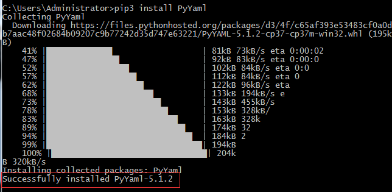

# 一文读懂 YAML

⌚️:2020年11月30日

📚参考

- [一文读懂 YAML](https://juejin.im/post/6844903709097345037)
- [YAML 官方网站](https://yaml.org/)

- [YAML 1.2 官方文档](https://yaml.org/spec/1.2/spec.html)

- [YAML - 维基百科](https://zh.wikipedia.org/wiki/YAML)

- [YAML to JSON （格式在线转换）](https://www.json2yaml.com/convert-yaml-to-json)

---

## 前言

YAML 并不是一种新奇的语言，YAML 首次发表于 2001 年，距离现在已经过去差不多 20 个年头。YAML 虽然不如 JSON、XML 之类的语言流行，应用也没有那么广泛，但是 YAML 也有它的优势。

互联网上的关于 YAML 的文章虽然不多，但也足以让人了解这一款语言，**那我为什么还要写这一片入门文章呢？**

**我认为现有的文章有以下几点不足：**

- 内容碎片化，阅读起来不够流畅
- 讲解较为生硬，阅读起来比较费劲
- 缺少对比，难以让人快速理解

**所以本篇文章的主要目的就是让读者能够快速并准确地了解这款语言，事不宜迟，让我们开始吧！**

> 为了帮助理解，我将在文中穿插相对应的 JSON 格式的内容作为对比。
>
> 可能是东半球最通俗易懂的 YAML 中文讲解之一（手动狗头）

------

## 1. 简介

**YAML** 是一种较为人性化的**数据序列化语言**，可以配合目前大多数编程语言使用。

YAML 的语法比较简洁直观，特点是使用空格来表达层次结构，其最大优势在于**数据结构**方面的表达，所以 YAML 更多应用于**编写配置文件**，其文件一般以 **.yml** 为后缀。

> **YAML** 目前的官方全称为 “**YAML Ain't Markup Language**（YAML 不是标记语言）”，但有意思的是，其实 YAML 最初的含义是 “**Yet Another Markup Language**（还是一种标记语言）”。
>
> 目前 YAML 的最新版本为 1.2（第三个版本），本文将以 **YAML 1.2** 的标准进行讲解。

## 2. 基本语法

### 2.1 大小写敏感

- 就是字面上的意思

```
One: 1
one: 2
```

### 2.2 用缩进表示层级关系

- 缩进**只能使用空格**，不能用 TAB 字符
- 缩进的**空格数量不重要**，但是**同一层级的元素左侧必须对齐**

```
# YAML
one:
  two: 2
  three:
    four: 4
    five: 5

// 以上的内容转成 JSON 后
"one": {
  "two": 2,
  "three": {
    "four": 4,
    "five": 5 
  }
}
```

### 2.3 用 # 表示注释

- 只支持单行注释

```
# 我是注释
# 我也是注释
```

### 2.4 一个文件中可以包含多个文件的内容

- 用“ **---** ”即**三个破折号**表示一份内容的**开始**
- 用“ **...** ”即**三个小数点**表示一份内容的**结束**（非必需）

```
---
# 这是第一份内容
one: 1
# 其他内容...
...

---
# 这是第二份内容
two: 2
# 其他内容...
```

## 3.数据结构与类型

### 3.1 对象（Mapping）

表示以键值对（key: value）形式出现的数据

- 使用“**冒号+空格**”来分开**键**与**值**

```
# YAML
key: value

// JSON
"key": "value"
```

- 支持多层嵌套（**用缩进表示层级关系**）

```
# YAML
key:
  child-key1: value1
  child-key2: value2

// JSON
"key": {
  "child-key1": "value1",
  "child-key2": "value2",
}
```

- 支持 **流式风格（ Flow style）** 的语法（用花括号包裹，用逗号加空格分隔，类似 JSON）

```
# YAML
key: { child-key1: value1, child-key2: value2 }

// JSON
"key": { "child-key1": "value1", "child-key2": "value2" }
```

- 使用 **问号“?”** 声明一个复杂对象，允许你使用多个词汇（数组）来组成键

```
# YAML
?
  - keypart1
  - keypart2
:
  - value1
  - value2
```

### 3.2 数组（Sequence）

- 一组以 **区块格式（Block Format）（即“破折号+空格”）** 开头的数据组成一个数组

```
# YAML
values:
  - value1
  - value2
  - value3

// JSON
"values": [ "value1", "value2", "value3" ]
```

- 同时也支持 **内联格式（Inline Format）** 来表达（用方括号包裹，逗号加空格分隔，类似 JSON）

```
# YAML
values: [value1, value2, value3]

// JSON
"values": [ "value1", "value2", "value3" ]
```

- 支持多维数组（**用缩进表示层级关系**）

```
# YAML
values:
  -
    - value1
    - value2
  -
    - value3
    - value4

// JSON
"values": [ [ "value1", "value2"], ["value3", "value4"] ]
```

### 3.2 标量（Scalars）

表示 YAML 中最基本的数据类型

#### 字符串（String）

- 字符串**一般不需要用引号包裹**，但是如果字符串中**使用了反斜杠“\”开头的转义字符就必须使用引号包裹**

```
# YAML
strings:
  - Hello without quote # 不用引号包裹
  - Hello
   world # 拆成多行后会自动在中间添加空格
  - 'Hello with single quotes' # 单引号包裹
  - "Hello with double quotes" # 双引号包裹
  - "I am fine. \u263A" # 使用双引号包裹时支持 Unicode 编码
  - "\x0d\x0a is \r\n" # 使用双引号包裹时还支持 Hex 编码
  - 'He said: "Hello!"' # 单双引号支持嵌套"

// JSON
"strings":
  [ "Hello without quote",
    "Hello world",
    "Hello with single quotes",
    "Hello with double quotes",
    "I am fine. ☺",
    "\r\n is \r\n",
    "He said: 'Hello!'" ]
```

- 对于多行的文字，YAML 提供了两种特殊的语法支持

**保留换行(Newlines preserved)**

> 使用 **竖线符“ | ”** 来表示该语法，每行的缩进和行尾空白都会被去掉，而额外的缩进会被保留

```
# YAML
lines: |
  我是第一行
  我是第二行
    我是吴彦祖
      我是第四行
  我是第五行

// JSON
"lines": "我是第一行\n我是第二行\n  我是吴彦祖\n     我是第四行\n我是第五行"
复制代码
```

**折叠换行(Newlines folded)**

> 使用 **右尖括号“ > ”** 来表示该语法，只有空白行才会被识别为换行，原来的换行符都会被转换成空格

```
# YAML
lines: >
  我是第一行
  我也是第一行
  我仍是第一行
  我依旧是第一行
  
  我是第二行
  这么巧我也是第二行

// JSON
"lines": "我是第一行 我也是第一行 我仍是第一行 我依旧是第一行\n我是第二行 这么巧我也是第二行"
复制代码
```

#### 布尔值（Boolean）

- “true”、“True”、“TRUE”、“yes”、“Yes”和“YES”皆为**真**
- “false”、“False”、“FALSE”、“no”、“No”和“NO”皆为**假**

```
# YAML
boolean:
  - true # True、TRUE
  - yes # Yes、YES
  - false # False、FALSE
  - no # No、NO

// JSON
"boolean": [ true, true, false, false ]
```

#### 整数（Integer）

- 支持二进制表示

```
# YAML
int:
  - 666
  - 0001_0000 # 二进制表示

// JSON
"int": [ 666, 4096 ]
```

#### 浮点数（Floating Point）

- 支持科学计数法

```
# YAML
float:
  - 3.14
  - 6.8523015e+5 # 使用科学计数法

// JSON
"float": [ 3.14, 685230.15 ]
```

#### 空（Null）

- “null”、“Null”和“~”都是空，不指定值默认也是空

```
# YAML
nulls:
  - null
  - Null
  - ~
  -

// JSON
"nulls": [ null, null, null, null ]
```

### 3.3 时间戳（Timestamp）

- YAML 也支持 **ISO 8601** 格式的时间数据

> 这里使用 JavaScript 对象进行对比

```
# YAML
date1: 2020-05-26
date2: 2020-05-26T01:00:00+08:00
dete3: 2020-05-26T02:00:00.10+08:00
date4: 2020-05-26 03:00:00.10 +8

// JavaScript
date1: Tue May 26 2020 08:00:00 GMT+0800 (中国标准时间),
date2: Tue May 26 2020 01:00:00 GMT+0800 (中国标准时间),
dete3: Tue May 26 2020 02:00:00 GMT+0800 (中国标准时间),
date4: Tue May 26 2020 03:00:00 GMT+0800 (中国标准时间)
```

### 3.4 类型转换

- YAML 支持使用**严格类型标签“!!”**（双感叹号+目标类型）来强制转换类型

```
# YAML
a: !!float '666' # !! 为严格类型标签
b: '666' # 其实双引号也算是类型转换符
c: !!str 666 # 整数转为字符串
d: !!str 666.66 # 浮点数转为字符串
e: !!str true # 布尔值转为字符串
f: !!str yes # 布尔值转为字符串

// JSON
"a": 666,
"b": "666",
"c": "666",
"d": "666.66",
"e": "true"
"f": "yes"
```

### 3.5 其他高级类型

YAML 也可以使用一些更高级的类型，但是并不一定兼容所有解析器，包括**集合（Sets）**、**有序映射（Ordered Map）**、**十六进制数据（Hexdecimal）\**和\**二进制数据（Binary）。**

**本文将不会对这几种类型进行讲解，感兴趣的读者可以自行搜索研究。**

## 4. 数据重用与合并

- 为了保持内容的简洁，避免过多重复的定义，YAML 提供了由 **锚点标签“&”** 和 **引用标签“\*”**组成的语法，利用这套语法可以快速引用相同的一些数据...

```
// YAML
a: &anchor # 设置锚点
  one: 1
  two: 2
  three: 3
b: *anchor # 引用锚点

// JSON
"a": {
  "one": 1,
  "two": 2,
  "three": 3
},
"b": {
  "one": 1,
  "two": 2,
  "three": 3
}
```

- 配合 **合并标签“<<”** 使用可以与任意数据进行合并，你可以把这套操作想象成面向对象语言中的继承...

```
# YAML
human: &base # 添加名为 base 的锚点
    body: 1
    hair: 999
singer:
    <<: *base # 引用 base 锚点，实例化时会自动展开
    skill: sing # 添加额外的属性
programer:
    <<: *base # 引用 base 锚点，实例化时会自动展开
    hair: 6 # 覆写 base 中的属性
    skill: code # 添加额外的属性

// JSON
"human": { "body": 1, "hair": 999 },
"singer": { "body": 1, "hair": 999, "skill": "sing" },
"programer": { "body": 1, "hair": 6, "skill": "code" }
```


## 5. PyYaml安装

yaml文件处理需要借助python的第三方库，因此我们第一步需要安装

打开CMD执行命令: pip install PyYaml 注意：不要把Yaml写成Ymal



## 6. 读yaml文件

### 6.1 yaml存字典并读取

config.yaml

```
cnblog: linux超
address: BeiJing
Company: petrochina
age: 18
now: 8.14
empty1: null
empty2: ~
```

parseyaml.py

```
"""
------------------------------------
@Time : 2019/8/14 20:37
@Auth : linux超
@File : parseYaml.py
@IDE  : PyCharm
@Motto: Real warriors,dare to face the bleak warning,dare to face the incisive error!
@QQ   : 28174043@qq.com
@GROUP: 878565760
------------------------------------
"""
import yaml


with open("config.yml", "r", encoding="utf8") as f:
    context = yaml.load(f, Loader=yaml.FullLoader)
print("读取内容", context, type(context))
print(context["cnblog"], type(context["cnblog"]))
print(context["age"], type(context["age"]))
print(context["now"], type(context["now"]))
print(context["empty1"], type(context["empty1"]))
```

输出

```
读取内容 {'cnblog': 'linux超', 'address': 'BeiJing', 'Company': 'petrochina', 'age': 18, 'now': 8.14, 'empty1': None, 'empty2': None} <class 'dict'>
linux超 <class 'str'>
18 <class 'int'>
8.14 <class 'float'>
None <class 'NoneType'>

Process finished with exit code 0
```

从输出结果及yaml文件内容你可以看到，当前输出的内容是一个字典类型，yaml文件中存储的字符串输出仍是字符串类型，int型仍是int型等，存储None类型可以使用null，~符号以及None，这也是区别ini配置文件的地方，且文件内容使用[key：value]的形式定义，当然key和value也可以使用双引号修饰；上面的yaml文件只存储了一组数据，你也可以存放多组数据，看下面的实例

### 6.2 yaml存多组数据并读取

config.yaml

```
cnblog: linux超
address: BeiJing
Company: petrochina
age: 18
now: 8.14
---
name: linux超
gender: 男
```

parseyaml.py

```
"""
------------------------------------
@Time : 2019/8/14 20:37
@Auth : linux超
@File : parseYaml.py
@IDE  : PyCharm
@Motto: Real warriors,dare to face the bleak warning,dare to face the incisive error!
@QQ   : 28174043@qq.com
@GROUP: 878565760
------------------------------------
"""
import yaml


with open("config.yml", "r", encoding="utf8") as f:
    context = yaml.load_all(f, Loader=yaml.FullLoader)
    print(context)
    for i in context:
        print(i)
```

输出

```
我是一个生成器 <generator object load_all at 0x01DDDAB0>
{'cnblog': 'linux超', 'address': 'BeiJing', 'Company': 'petrochina', 'age': 18, 'now': 8.14}
{'name': 'linux超', 'gender': '男'}

Process finished with exit code 0
```

通过输出结果及yaml存储内容可以看出，当yaml文件存储多组数据在一个yaml文件中时，需要使用3个横杆分割，读取数据时需要使用load_all方法，而且此方法返回一个生成器，需要使用for循环迭代读取每一组数据下面再看一下yaml如何存储列表类型数据

### 6.3 yaml存储列表并读取

config.yaml

```
- linux超
- BeiJing
- petrochina
- 18
- 8.14
```

parseyaml.py

```
"""
------------------------------------
@Time : 2019/8/14 20:37
@Auth : linux超
@File : parseYaml.py
@IDE  : PyCharm
@Motto: Real warriors,dare to face the bleak warning,dare to face the incisive error!
@QQ   : 28174043@qq.com
@GROUP: 878565760
------------------------------------
"""
import yaml


with open("config.yml", "r", encoding="utf8") as f:
    context = yaml.load(f, Loader=yaml.FullLoader)
print("读取内容", context, type(context))
```

输出

```
读取内容 ['linux超', 'BeiJing', 'petrochina', 18, 8.14] <class 'list'>

Process finished with exit code 0
```

当yaml文件存储列表数据时，需要使用一个横杠[- 元素]表示为列表的一个元素，除了列表以外还可以存储元组，或者说支持强制类型转换

### 6.4 yaml存储元组并读取

config.yml

```
--- !!python/tuple # 列表转成元组
- 1
- 2
- 3
---
age: !!str 18 # int 类型转换为str
```

 parseyaml.py

```
"""
------------------------------------
@Time : 2019/8/14 19:46
@Auth : linux超
@File : parseYaml.py
@IDE  : PyCharm
@Motto: Real warriors,dare to face the bleak warning,dare to face the incisive error!
@QQ   : 28174043@qq.com
@GROUP: 878565760
------------------------------------
"""
import yaml

with open("./config.yml", "r", encoding="utf-8") as f:
    context = yaml.load_all(f, Loader=yaml.FullLoader)
    for i in context:
        print(i)
```

输出

```
(1, 2, 3)
{'age': '18'}

Process finished with exit code 0
```

yaml文件使用两个！！号可以对数据进行类型转换，但是在我看来感觉没有用，当然可能我没遇见过需要做类型转化的情况；你还可以像下面这样存放更加复杂的数据，比如字典嵌套字典及列表

config.yaml

```
info:
  - user:
      username: linux超
      password: linuxxiaochao
company:
  first: petrochina
  second: lemon teacher
```

parseyaml.py

```
"""
------------------------------------
@Time : 2019/8/14 20:37
@Auth : linux超
@File : parseYaml.py
@IDE  : PyCharm
@Motto: Real warriors,dare to face the bleak warning,dare to face the incisive error!
@QQ   : 28174043@qq.com
@GROUP: 878565760
------------------------------------
"""
import yaml


with open("config.yml", "r", encoding="utf8") as f:
    context = yaml.load(f, Loader=yaml.FullLoader)
print("读取内容\n", context, type(context))
```

输出

```
读取内容
 {'info': [{'user': {'username': 'linux超', 'password': 'linuxxiaochao'}}], 'company': {'first': 'petrochina', 'second': 'lemon teacher'}} <class 'dict'>

Process finished with exit code 0
```

### 6.5 小结

实际工作中大概就是存储字典，列表，或者相互嵌套的数据较常见，那么在存储和读取时需要掌握以下几点

1.存储字典时，以[key：value]的形式定义

2.存储列表时，需要使用[- 元素]表示列表

3.存储多组数据时，需要每组数据之间使用3个横杠-分割分割

4.数据嵌套时，需要注意缩进，和编写python代码的缩进规则相同，唯一不同是，yaml中的缩进只要统一即可不需要指定缩进多少

5.读取一组数据时，直接使用load(stream, loader)方法， 读取多组数据时需要使用load_all(stream, loader)方法，此方法返回的是一个生成器，需要使用for循环读取每一组数据，还需要注意两个方法中的最好像我代码中一样传递loader参数为FullLoader，否则会报Warnning

## 7. 写yaml文件

向yaml文件中写数据就比较简单了，直接使用dump方法和dump_all方法即可，无论多复杂的数据都可以直接写入，看实例

### 7.1 dump写入一组数据

```
"""
------------------------------------
@Time : 2019/8/14 19:46
@Auth : linux超
@File : parseYaml.py
@IDE  : PyCharm
@Motto: Real warriors,dare to face the bleak warning,dare to face the incisive error!
@QQ   : 28174043@qq.com
@GROUP: 878565760
------------------------------------
"""
import yaml

response = {
    "status": 1,
    "code": "1001",
    "data": [
        {
            "id": 80,
            "regname": "toml",
            "pwd": "QW&@JBK!#&#($*@HLNN",
            "mobilephone": "13691579846",
            "leavemount": "0.00",
            "type": "1",
            "regtime": "2019-08-14 20:24:45.0"
        },
        {
            "id": 81,
            "regname": "toml",
            "pwd": "QW&@JBK!#&#($*@HLNN",
            "mobilephone": "13691579846",
            "leavemount": "0.00",
            "type": "1",
            "regtime": "2019-08-14 20:24:45.0"
        }
    ],
    "msg": "获取用户列表成功"
}

try:
    with open("./config.yml", "w", encoding="utf-8") as f:
        yaml.dump(data=response, stream=f, allow_unicode=True)
except Exception as e:
    print("写入yaml文件内容失败")
    raise e
else:
    print("写入yaml文件内容成功")
```

生成的yaml文件内容

```
code: '1001'
data:
- id: 80
  leavemount: '0.00'
  mobilephone: '13691579846'
  pwd: QW&@JBK!#&#($*@HLNN
  regname: toml
  regtime: '2019-08-14 20:24:45.0'
  type: '1'
- id: 81
  leavemount: '0.00'
  mobilephone: '13691579846'
  pwd: QW&@JBK!#&#($*@HLNN
  regname: toml
  regtime: '2019-08-14 20:24:45.0'
  type: '1'
msg: 获取用户列表成功
status: 1
```

### 7.2 dump_all写入多组数据

```
"""
------------------------------------
@Time : 2019/8/14 19:46
@Auth : linux超
@File : parseYaml.py
@IDE  : PyCharm
@Motto: Real warriors,dare to face the bleak warning,dare to face the incisive error!
@QQ   : 28174043@qq.com
@GROUP: 878565760
------------------------------------
"""
import yaml

response = {
    "status": 1,
    "code": "1001",
    "data": [
        {
            "id": 80,
            "regname": "toml",
            "pwd": "QW&@JBK!#&#($*@HLNN",
            "mobilephone": "13691579846",
            "leavemount": "0.00",
            "type": "1",
            "regtime": "2019-08-14 20:24:45.0"
        },
        {
            "id": 81,
            "regname": "toml",
            "pwd": "QW&@JBK!#&#($*@HLNN",
            "mobilephone": "13691579846",
            "leavemount": "0.00",
            "type": "1",
            "regtime": "2019-08-14 20:24:45.0"
        }
    ],
    "msg": "获取用户列表成功"
}

info = {
    "name": "linux超",
    "age": 18
}

try:
    with open("./config.yml", "w", encoding="utf-8") as f:
        yaml.dump_all(documents=[response, info], stream=f, allow_unicode=True)
except Exception as e:
    print("写入yaml文件内容失败")
    raise e
else:
    print("写入yaml文件内容成功")
```

生成的yaml文件内容

```
code: '1001'
data:
- id: 80
  leavemount: '0.00'
  mobilephone: '13691579846'
  pwd: QW&@JBK!#&#($*@HLNN
  regname: toml
  regtime: '2019-08-14 20:24:45.0'
  type: '1'
- id: 81
  leavemount: '0.00'
  mobilephone: '13691579846'
  pwd: QW&@JBK!#&#($*@HLNN
  regname: toml
  regtime: '2019-08-14 20:24:45.0'
  type: '1'
msg: 获取用户列表成功
status: 1
---
age: 18
name: linux超
```

### 7.3 小结

1.写入一组数据直接使用dump方法或者dump_all方法也可

2.写入多组数据只能使用dump_all方法

3.写入数据时最重要的一点需要注意：如果你的数据包含中文，dump和dump_all 方法需要添加allow_unicode=True参数，否则中文写入后不会正常显示

## 8. 总结

1.yaml存储数据规则-多组数据使用---分割，数据嵌套时注意缩进，存储字典使用[key: value]的形式，存储列表使用[- 元素]的形式，使用load读一组数据，使用load_all 可以读多组数据

2.yaml文件写入一组数据直接使用dump方法，写入多组数据使用dump_all方法，注意写入数据带中文，需要指定参数allow_unicode=True