# TensorRT介绍

⌚️:2020年11月30日

📚参考

- [TensorRT_Document](http://blog.ijunyu.top/2019/02/27/TensorRT-Document/)
- [TensorRT学习](https://blog.csdn.net/yangjf91/article/details/88842022)
- [INT8校准原理](https://arleyzhang.github.io/articles/923e2c40/)
- [TensorRT官方Github](https://github.com/NVIDIA/TensorRT),里面有samples
- [ONNX2TensorRT工具](https://github.com/onnx/onnx-tensorrt)
- [IOT，torch2TensorRT工具](https://github.com/NVIDIA-AI-IOT/torch2trt)
- [TensorRT官方手册](https://docs.nvidia.com/deeplearning/tensorrt/api/python_api/index.html) ｜ [用户手册](https://docs.nvidia.com/deeplearning/tensorrt/index.html)
- [TensorRT官网](https://developer.nvidia.com/zh-cn/tensorrt)
- [TensorRT C++ API](https://docs.nvidia.com/deeplearning/tensorrt/api/c_api/index.html)
- [官方案例学习](https://github.com/NVIDIA/TensorRT/tree/master/samples)
- [NVIDIA官网](https://developer.nvidia.com/tensorrt)| [TensorRT 支持矩阵](https://docs.nvidia.com/deeplearning/sdk/tensorrt-support-matrix/index.html) | [TensorRT SDK](https://docs.nvidia.com/deeplearning/sdk/tensorrt-developer-guide/index.html)|[Get Started With TensorRT](https://docs.nvidia.com/deeplearning/sdk/tensorrt-api/python_api/gettingStarted.html)   
- [俊宇的博客](http://blog.ijunyu.top/2019/02/27/TensorRT-Document/)|[ONNX-TensorRT GitHub](https://github.com/onnx/onnx-tensorrt)|[tensorrt-yolov3](https://github.com/Cw-zero/TensorRT_yolo3)|   

---


## 1.什么是TensorRT？

TensorRT源程序是一个能提高英伟达GPU（Griphics processing units）推理性能的C++库。它与TensorFlow、Caffe、PyTorch、MXNet等训练框架相辅相成。它更加关注在GPU上快速高效地运行一个已经存在的学习网络，这个学习网络的目标是生成一个结果（在许多地方也称为得分、检测、回归或推理的过程）。

> 从TensorRT这个名字上开始解释，一般一维数组叫做Vector（即向量），二维数组叫做Matrix，再高纬度的就叫Tensor，Matrix其实是二维的Tensor。在TensorRT中，所有的数据都被组成最高四维的数组，如果对应到CNN中其实就是{N, C, H, W}。RT表示的是Runtime，即TensorRT是专门针对部署端进行优化的。
>
> 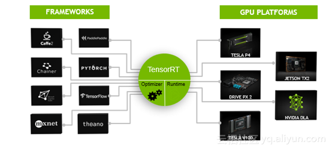
>
> NVIDIA TENSORRT的可编程推理加速器可分为四个部分，分别是输入网络框架、输入接口方式、输出支持系统平台以及输出支持系统平台。每个部分又有许多选择性，例如，TensorRT支持常见的深度学习输入网络框架有Caffe、Chainer、CNTK、MXnet、PaddlePaddle、Pytorch、TensorFlow、Theano等，TensorRT支持的模型输入接口方式有C++ API、Python API、NvCaffeParser, NvUffParser、NvONNx Parser等，TensorRT支持的输出支持系统平台有Linux x86、Linux aarch64、Android aarch64、QNX aarch64等，TensorRT支持的输出硬件平台有Tesla P4/V100、自动驾驶、嵌入式平台的DrivePX、TX1/TX2等。

一些训练框架类似于tensorflow已经集成了TensorRT，所以TensorRT能够被用来加速框架中的推理过程。作为一种选择，TensorRT可以用作用户应用程序中的库。它包含了很多解析器，这些解析器可以从Caffe、ONNX或者tensorflow中解析已经存在的模型，还可以用于以编程方式构建模型的c++和Python api。


​											图1：TensorRT是用于产品部署的高性能神经网络推理优化器和运行时引擎

TensorRT通过合并层和优化核选择来优化网络结构，以达到改善延迟、吞吐量、功率效率和内存消耗。如果应用程序指定，TensorRT还将优化网络以降低运行精度，进一步提高性能和减少内存需求。

下面的图展示了TensorRT被定义为部分高性能推理优化器和部分运行时引擎。它可以接收在这些流行框架上训练的神经网络，优化神经网络计算，生成一个轻量级运行时引擎（你唯一需要部署到你产品环境中的东西）。然后它还会最大化在这些GPU平台上的吞吐量、降低延迟、增强表现。

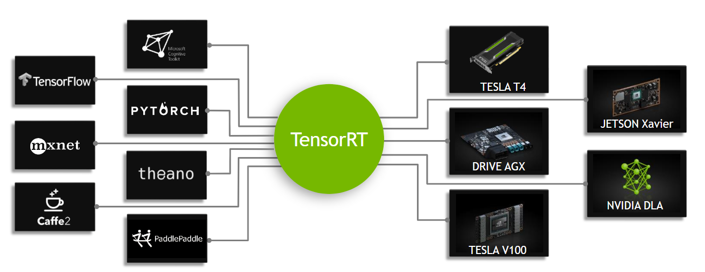

​																图2：TensorRT是一个可编码的推理加速器

TensorRT API包含了最通用的深度学习层的实现。关于层的更多信息，请参阅[TensorRT Layers](https://docs.nvidia.com/deeplearning/sdk/tensorrt-developer-guide/index.html#layers).你也可以使用[C++ Plugin API](https://docs.nvidia.com/deeplearning/sdk/tensorrt-api/c_api/classnvinfer1_1_1_i_plugin.html)或者[Python Plugin API](https://docs.nvidia.com/deeplearning/sdk/tensorrt-api/python_api/infer/Plugin/pyPlugin.html)来实现不常用或者最新的层，这些层暂时还不被TensorRT所支持。

### 1.1 TensorRT的优势

当神经网络被训练完成后，TensorRT可以压缩、优化这些网络，还可以部署成一个运行环境而不用承担整个框架的总开销。

**TensorRT组合各个层，优化内核选择，还根据指定的精度（FP32、FP16或INT8）执行规范化和优化矩阵转换来改善延迟、吞吐量和效率。**

对于深度学习推理，有5个用于衡量软件的关键指标**（记忆）**： 

- 吞吐量（Throuthput）： 指定时间区间内的输出量，通常用inference/second 或者samples/second来度量； 
- 效率（Efficiency）：单位功率的吞吐量，通常用performance/watt来度量；
- 延迟（Latency）：运行推理的时间，通常用ms度量；
- 精确度（Accuracy）：训练过的神经网络给出正确结果的能力；
- 内存占用（Memory usage）：主机和设备内存决定于所用的神经网络算法需要申请多少内存空间进行推理； 

使用TensorRT的可选方案包括：

- 使用训练框架本身进行推理；
- 写一个使用低层库和数学操作的专门用来执行特定网络的自定义应用程序；

使用训练框架执行推理很容易，但是在给定的额GPU上，与使用推理优化方案相比，性能会低很多。训练框架倾向于实现更加通用的代码，当优化时，优化往往集中在有效的训练上；
自定义程序编写可以获得更高的效率，但是对开发人员知识技能要求非常高，而且针对一个GPU的优化无法完全转移到另一个型号不同的GPU上，因而开发成本非常高；
而TensorRT通过将API与特定硬件细节的高级抽象结合来解决这些问题，可以提高吞吐量、降低延迟、并尽可能降低内存占用。

### 1.2 谁能够从TensorRT中获益？

TensorRT的目标用户是负责基于新的或现有的深度学习模型构建特征和应用程序，或将模型部署到生产环境中的工程师。这些部署可能部署到数据中心或云中的服务器、嵌入式设备、机器人或车辆中，或将在用户工作站上运行的应用程序软件中。

TensorRT已经成功地应用于各种场景，包括:

- Robots：公司销售的机器人使用TensorRT运行各种计算机视觉模型，在动态环境中自动引导无人机系统飞行；
- Autonomous Vehicles：TensorRT被用于为NVIDIA驱动产品的计算机视觉提供支持；
- Scientific and Technical Computing：一种流行的技术计算包嵌入TensorRT以支持神经网络模型的高吞吐量执行；
- Deep Learning Training and Deployment Frameworks：TensorRT在几个有名的深度学习框架比如[TensorFlow](https://www.nvidia.com/en-us/data-center/gpu-accelerated-applications/tensorflow/)和[MXNet](https://www.nvidia.com/en-us/data-center/gpu-accelerated-applications/mxnet/)中都被包含；
- Video Analytics：TensorRT被应用于英伟达的[DeepStream](https://developer.nvidia.com/deepstream-sdk)产品中，为复杂的视频分析提供解决方案；
- Automatic Speech Recognition：TensorRT用于小型桌面设备上的语音识别。该设备支持有限的词汇量，云计算中提供了更大的词汇量语音识别系统。

### 1.3 TensorRT适用于哪里？

通常情况下，开发和部署深度学习模型的工作流经历三个阶段：

- 阶段1：训练；
- 阶段2：提出部署方案；
- 阶段3：执行部署方案；

>  深度学习模型一般包含训练（Training）和推断（Inference），两者的差异主要在于：
>
> - **推断（Inference）的网络权值已经固定下来，无后向传播过程。** 这是因为1） 模型固定，可以对计算图进行优化；2）输入输出大小固定，可以做memory优化，也因此TensorRT没有fine-tuning；
> - **推断（Inference）的batch size要小很多，** 吞吐降低，没有办法很好地利用GPU；
> - **推断（Inference）可以使用低精度的技术，** 一方面可以减少计算量，另一方面是模型需要的空间减少，不管是权值的存储还是中间值的存储；
> - **推断（Inference）不能用各种框架，** 训练（Training）过程中可以使用不同的框架，灵活性和性能是一种trade-off的关系。

#### 阶段1：训练

在整个训练阶段，数据科学家和开发者根据他们想解决的问题选择精确的输入输出和损失函数。他们还将收集、管理、扩充、甚至可能标记培训、测试和验证数据集。他们会设计网络结构并且训练模型。在训练过程中，他们将监控学习过程，学习过程可能会提供反馈，从而使他们修正损失函数，获取或增加培训数据。在这个流程的最后，他们会验证模型表现并保存模型。训练和验证通常使用Titan或者Tesla datacenter GPU。在这一阶段通常不会用到TensorRT。

#### 阶段2：提出部署方案

在第二个阶段，数据科学家和开发人员将从训练过的模型开始，并使用这个训练过的模型创建和验证部署解决方案。把这个阶段分解成几个步骤，如下：

1.考虑神经网络是如何在它所处的大系统中工作的，并设计和实现一个合适的解决方案，可能包含神经网络的系统的范围非常广泛。例如：

- 交通工具中的自动驾驶系统；
- 公共场所或公司校园的视频安全系统；
- 消费者设备的语音接口；
- 工业生产线自动化质量保证系统；
- 提供产品推荐的在线零售系统；
- 提供娱乐过滤器的消费者web服务；

决定好你的优先级，考虑到可以实现的不同系统的多样性，在设计和实现部署体系结构时可能需要考虑很多事情：

- 你有一个单独的网络还是许多网络？例如，你是否基于一个单一的网络（人脸识别）开发一个特征或系统？你的系统会不会由混合的、附加的或者不同的模型组成？也许是提供最终用户可能提供的集合模型的更通用的工具?
- 你使用什么设备或者计算工具来运行网络？是CPU/GPU还是其他，或者二者结合？是不是只有一种类型的GPU？是否需要设计一个应用程序可以运行在不同种类的GPU上？
- 数据怎样加载到模型？什么是数据管道？数据是来自相机、传感器还是一系列的文件？
- 需要怎样的延迟和吞吐量？
- 你能把很多需求进行批处理吗？
- 你需要单个网络的多个实例来实现所需的总体系统吞吐量和延迟吗?
- 你会如何处理网络输出？
- 需要哪些后处理步骤？

TensorRT提供了一个快速、模块化、紧凑、健壮、可靠的推理引擎，可以支持部署体系结构中的推理需求。

2.数据科学家和开发者定义完推理解决方案的结构，也就是决定了他们的优先级之后，接下来他们使用TensorRT从已保存的模型中创建一个推理引擎。根据所使用的培训框架和网络体系结构，有许多方法可以做到这一点。通常来说，这意味着你需要拿到训练过的神经网络并且使用ONNX解析器、Caffe解析器或者TensorFlow/UFF解析器将原格式解析为TensorRT支持的格式。如下图： 


​																					**图三：ONNX 工作流 V1**

 

> TensorRT整个过程可以分三个步骤，即模型的解析（Parser），Engine优化和执行（Execution），Parser目前有自定义层管理、C++/Python接口、caffe Parser/uff/onnx三个类型。

3.当网络被解析以后，你就需要考虑优化选项——batch size，workspace size，mixed precision。选择并指定这些选项作为TensorRT构建步骤的一部分，在该步骤中，您将实际构建基于网络的优化推理引擎。本指南的后续部分提供了关于工作流这一部分的详细说明和大量示例，将您的模型解析为TensorRT并选择优化参数，如图4所示：

 									


图四：TensorRT优化训练过的神经网络模型，以生成可部署的运行时推理引擎。

4.当你已经使用TensorRT创建好一个推理引擎之后，你会想验证一下推理结果和训练中的结果是否一致。如果你选择了FP32或FP16，那么结果应该非常接近。如果你选择了INT8，那么在训练中获得的准确率和推理准确率之间可能会有一个小的差距。

5.以序列化格式写出推理引擎，这也称为计划文件。

#### 阶段3：执行部署方案

TensorRT库链接到部署的应用程序，该应用程序在需要推理结果时调用库。为了初始化推理引擎，应用程序首先要将模型从计划文件反序列化为推理引擎。

TensorRT通常情况下是异步使用的，所以，当输入数据到达时，程序调用enqueue函数并传入输入缓冲区和输出缓冲区的指针地址。

### 1.4 TensorRT是如何工作的？

为了优化推理引擎，TensorRT会接收你的网络定义，执行包括特定平台优化在内的优化然后生成推理引擎，这个过程称为构建阶段。构建阶段可能需要相当长的时间，尤其是在嵌入式平台上运行的时候。因此，典型的应用程序将构建一次引擎，然后将其序列化为计划文件供以后使用。

NOTE:生成的计划文件不能跨平台或TensorRT版本移植。计划是特定于它们所构建的精确GPU模型的(除了平台和TensorRT版本之外)，如果您想在不同的GPU上运行它们，则必须针对特定的GPU重新制定计划。

构建阶段对层图执行以下优化:

- 消除输出未被使用的层；
- 融合convolution，bias和ReLU operations；
- 聚合具有足够相似参数和相同源张量的operations，例如在GoogleNet v5中初始模块中的1*1卷积；
- 通过非拷贝方式将层输出定向到正确的最终地址来合并连接层；

如有必要，构建过程也可以改变权重的精度。当生成8-bit整数精度的网络时，TensorRT使用一个叫做calibration的进程来决定中间激活的动态范围，并因此确定用于量化的适当缩放因子。 

另外，构建阶段还在虚拟数据上运行层，以便从其内核目录中选择最快的层，并在适当的情况下执行权重预格式化和内存优化。

### 1.5 TensorRT核心API

TensorRT让开发者们能够import/calibrate/generate and deploy optimized networks。网络结构能直接通过Caffe导入，也可以通过uff或ONNX等格式从其他框架导入。 

TensorRT核心库中的**关键接口**是：

- 网络定义（Network Definition）：网络定义接口提供了应用程序指定网络定义的方法。可以指定输入输出张量，可以添加层，还有用于配置每种支持的层类型的接口。除了层类型（例如卷积层或循环层）之外，插件层类型还可以使应用程序实现TensorRT本身并不支持的功能。 
- 生成器（Builder）：生成器接口允许通过网络定义建立优化引擎。它允许应用程序指定最大批次大小、工作空间大小、最低可接受精度级别、自动调整的校准迭代次数，以及用于INT8量化的接口。
- 引擎（Engine)：引擎接口允许应用程序执行推理，支持同步和异步支持、分析、枚举和查询绑定缓冲区信息，即引擎输入和输出。单个引擎可以具有多个执行上下文，允许一组训练参数用于同时执行多个批次。

同时，TensorRT还提供解析器，用于导入经过训练的网络来创建网络定义：

- Caffe Parser：此解析器可用于解析在BVLV Caffe或NVCaffe中创建的Caffe网络；
- Uff Parser：此解析器用于UFF格式的解析网络；
- ONNX Parser：此解析器可用于解析ONNX模型；

## 2. TensorRT 优化原理介绍

1.4 TensorRT是如何工作的？——详细介绍

TensorRT的部署分为两个部分，两部分的计算流程图的具体解释如下：

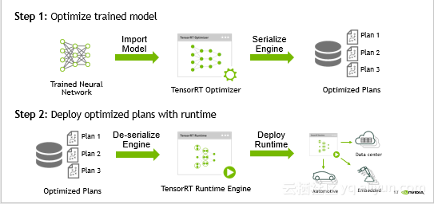


- 优化训练好的模型并生成计算流图。
  优化训练模型就是将优化的文件存储到计算机上，首先将训练神经网络优化生成最优的TensorRT控制器，其次是将TensorRT控制器进行串行化引擎，最后得出最优化的方案。
- 使用TensorRT Runtime部署计算流图。
  首先将优化方案去掉串行化引擎，其次是得出运行时的引擎，最后将其部署并运行到云上。

若想要TensorRT部署流程很自然还需要解决许多问题，例如TensorRT训练出的网络模型需要支持什么样的框架、TensorRT支持的网络结构是什么样的、TensorRT优化器需要做哪些优化、TensorRT优化好的计算流图可以运行在什么设备上等问题。

### 2.1 TensorRT的图像优化

TensorRT在获得网络计算流图后会针对计算流图进行优化，这部分优化不会改变图中最底层的计算内容，而是会重构计算图来获得更快、更高效的执行方式，即计算不变优化计算方法。 TensorRT的优化可以分为三个层次的优化，分别是垂直层融合、水平层融合以及消除级联层，三个层次的具体介绍如下：


#### 垂直层融合

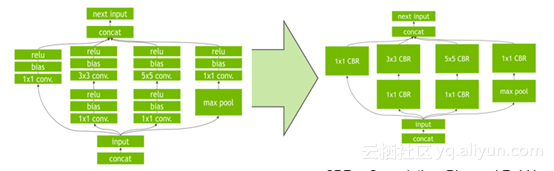


如上图所示，通过垂直层融合相同顺序的操作来减少Kernel Launch的消耗以及避免层与层之间的显存读写操作。Concolution、Bias和ReLU层融合成一个Kernel，Kernel称之为CBR，即CBR = Convolution+Bias+ReLU。


#### 水平层融合

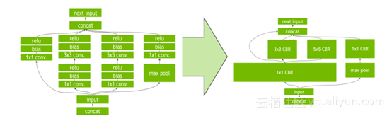


如上图超宽的1x1 CBR所示，TensorRT去挖掘输入数据层，数据层具有filter大小相同、weights不同的特点，此时需要通过水平层融合的优化方法使得这些层使用同一个Kernel来提高效率


#### 消除级联层


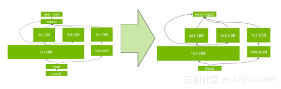


消除级联层指消除没有必要的层，例如concatenation层等，从而减少不必要的工作量以及运行时间，有效的提高了效率。

通过垂直层融合、水平层融合以及消除级联层三个层次的优化，TensorRT可以获得更小、更快、更高效的计算流图，优化过的TensorRT具有更少层网络结构以及Kernel Launch次数。总而言之，TensorRT可以有效的优化网络结构、减少网络层数，从而带来性能的提升。


### 2.2 量化的方法

本次讲一下 tensorRT 的 INT8 低精度推理模式。主要参考 [GTC 2017，Szymon Migacz 的PPT](http://on-demand.gputechconf.com/gtc/2017/presentation/s7310-8-bit-inference-with-tensorrt.pdf) 。

#### 2.2.1  Low Precision Inference

现有的深度学习框架 比如：TensorFlow，Caffe， MixNet等，在训练一个深度神经网络时，往往都会使用 float 32（Full Precise ，简称FP32）的数据精度来表示，权值、偏置、激活值等。但是如果一个网络很深的话，比如像VGG，ResNet这种，网络参数是极其多的，计算量就更多了（比如VGG 19.6 billion FLOPS, ResNet-152 11.3 billion FLOPS）。如此多的计算量，如果中间值都使用 FP 32的精度来计算的话，势必会很费时间。而这对于嵌入式设备或者移动设备来说，简直就是噩梦，因为他们的计算能力和内存数量是不能与PC相比的。

因此解决此问题的方法之一就是在部署推理时（inference）使用低精度数据，比如INT8。除此之外，当然还有模型压缩之类的方法，不过此处不做探究。注意此处只是针对 推理阶段，训练时仍然使用 FP32的精度。

**从经验上来分析一下低精度推理的可行性：**

实际上有些人认为，即便在推理时使用低精度的数据（比如INT8），在提升速度的同时，也并不会造成太大的精度损失，比如 [Why are Eight Bits Enough for Deep Neural Networks?](https://petewarden.com/2015/05/23/why-are-eight-bits-enough-for-deep-neural-networks/) 以及[Low Precision Inference with TensorRT](https://towardsdatascience.com/low-precision-inference-with-tensorrt-6eb3cda0730b) 这两篇博文。

文章的作者认为网络在训练的过程中学习到了数据样本的模式可分性，同时由于数据中存在的噪声，使得网络具有较强的鲁棒性，也就是说在输入样本中做轻微的变动并不会过多的影响结果性能。与图像上目标间的位置，姿态，角度等的变化程度相比，这些噪声引进的变动只是很少的一部分，但实际上这些噪声引进的变动同样会使各个层的激活值输出发生变动，然而却对结果影响不大，也就是说训练好的网络对这些噪声具有一定的容忍度（tolerance ）。

正是由于在训练过程中使用高精度（FP32）的数值表示，才使得网络具有一定的容忍度。训练时使用高精度的数值表示，可以使得网络以很小的计算量修正参数，这在网络最后收敛的时候是很重要的，因为收敛的时候要求修正量很小很小（一般训练初始 阶段学习率稍大，越往后学习率越小）。

那么如果使用低精度的数据来表示网络参数以及中间值的话，势必会存在误差，这个误差某种程度上可以认为是一种噪声。那也就是说，使用低精度数据引进的差异是在网络的容忍度之内的，所以对结果不会产生太大影响。

以上分析都是基于经验的，理论上的分析比较少，不过文章提到了两篇 paper，如下：

- [Improving the speed of neural networks on CPUs](http://static.googleusercontent.com/media/research.google.com/en/us/pubs/archive/37631.pdf)
- [Training deep neural networks with low precision multiplications](https://arxiv.org/abs/1412.7024)

这里不对这两篇paper做探究。

TensorRT 的INT8模式只支持计算能力为6.1的GPU（Compute Capability 6.1 ），比如： GP102 (Tesla P40 and NVIDIA Titan X), GP104 ([Tesla P4](https://devblogs.nvidia.com/parallelforall/new-pascal-gpus-accelerate-inference-in-the-data-center/)), and GP106 GPUs，主要根源是这些GPU支持 DP4A硬件指令。DP4A下面会稍微介绍一下。

#### 2.2.2 TensorRT INT8 Inference

首先看一下不同精度的动态范围：


|      | 动态范围                               | 最小正数           |
| :--- | :------------------------------------- | :----------------- |
| FP32 | −3.4×1038 +3.4×1038−3.4×1038 +3.4×1038 | 1.4×10−451.4×10−45 |
| FP16 | −65504 +65504−65504 +65504             | 5.96×10−85.96×10−8 |
| INT8 | −128 +127−128 +127                     | 11                 |


实际上将FP32的精度降为INT8还是比较具有挑战性的。

#### 2.2.3 Quantization（量化）

将FP32降为INT8的过程相当于信息再编码（re-encoding information ），就是原来使用32bit来表示一个tensor，现在使用8bit来表示一个tensor，还要求精度不能下降太多。

将FP32转换为 INT8的操作需要针对每一层的输入张量（tensor）和 网络学习到的参数（learned parameters）进行。

首先能想到的最简单的映射方式就是线性映射（或称线性量化，linear quantization）, 就是说映射前后的关系满足下式：
$$
FP32\ Tensor (T) = scale\_factor(sf) * 8-bit Tensor(t) + FP32\_bias (b)
$$


试验证明，偏置实际上是不需要的，因此去掉偏置，也就是
$$
T=sf∗tT=sf∗t
$$
sf 是每一层上每一个tensor的换算系数或称比例因子（scaling factor），因此现在的问题就变成了如何确定比例因子。然后最简单的方法是下图这样的：


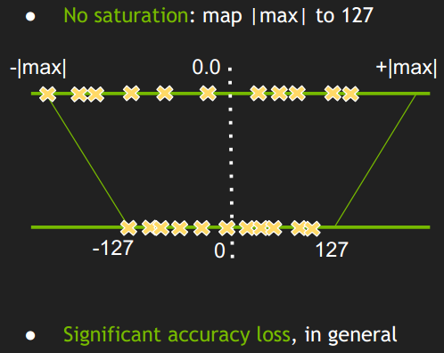

- 简单的将一个tensor 中的 -|max| 和 |max| FP32 value 映射为 -127 和 127 ，中间值按照线性关系进行映射。
- 称这种映射关系为不饱和的（No saturation ），对称的。

但是试验结果显示这样做会导致比较大的精度损失。

下面这张图展示的是不同网络结构的不同layer的激活值分布，有卷积层，有池化层，他们之间的分布很不一样，因此合理的 量化方式 应该适用于不同的激活值分布，并且减小 信息损失。因为从FP32到INT8其实就是一种信息再编码的过程。


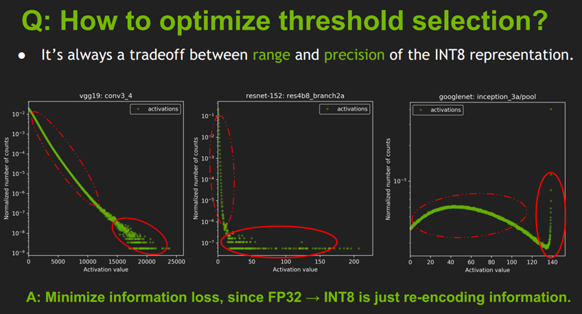


我个人理解的直接使用线性量化的方式导致精度损失比较大的原因是：

- 上图是一些网络模型中间层的 激活值统计，横坐标是激活值，纵坐标是统计数量的归一化表示，这里是归一化表示，不是绝对数值统计；
- 这个激活值统计 针对的是一批图片，不同的图片输出的激活值不完全相同。所以图上并不是一条曲线而是多条曲线（一张图片对应一条曲线，或者称为散点图更好一点），只不过前面一部分重复在一块了（红色虚线圈起来的部分），说明对于不同图片生成的大部分激活值其分布是相似的；但是在激活值比较大时（红色实线圈起来的部分），曲线不重复了，一个激活值对应多个不同的统计量，这时的激活值分布就比较乱了。
- 后面这一部分在整个层中是占少数的（占比很小，比如10^-9, 10^-7, 10^-3），因此后面这一段完全可以不考虑到映射关系中去，保留激活值分布的主方向。开始我以为网络之所以能把不同类别的图片分开是由于后面实线部分的差异导致的，后来想了一下：这个并不包含空间位置的分布，只是数值上的分布，所以后面的应该对结果影响不大。

因此TensorRT的做法是：


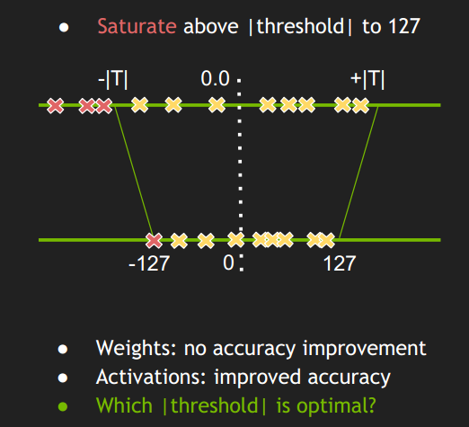


- 这种做法不是将 ±|max| 映射为 ±127，而是存在一个 阈值 |T| ，将 ±|T| 映射为±127，显然这里 |T|<|max|。
- 超出 阈值 ±|T| 外的直接映射为阈值 ±127。比如上图中的三个红色点，直接映射为-127。
- 称这种映射关系为饱和的（Saturate ），不对称的。
- 只要 阈值 选取得当，就能将分布散乱的较大的激活值舍弃掉，也就有可能使精度损失不至于降低太多。

网络的前向计算涉及到两部分数值：权值和激活值（weights 和activation，二者要做乘法运算），Szymon Migacz 也提到他们曾经做过实验，说对weights 做saturation 没有什么变化，因此 对于weights的int8量化就使用的是不饱和的方式；而对activation做saturation就有比较显著的性能提升，因此对activation使用的是饱和的量化方式。

那现在的问题是 如何确定|T|？我们来思考一下，现在有一个FP32的tensor，FP32肯定是能够表达这个tensor的最佳分布。现在我们要用一个不同的分布（INT8）来表达这个tensor，这个 INT8 分布不是一个最佳的分布。饱和的INT8分布由于阈值 |T|的取值会有很多种情况（128−|max|），其中肯定有一种情况是相对其他最接近FP32的，我们就是要把这种情况找出来。

既然如此，我们就需要一个衡量指标来衡量不同的 INT8 分布与原来的FP3F2分布之间的差异程度。这个衡量指标就是 **相对熵**（relative entropy），又称为**KL散度**（**Kullback–Leibler divergence**，简称**KLD**），信息散度（information divergence），信息增益（information gain）。叫法实在太多了，最常见的就是相对熵。跟交叉熵也是有关系的。

- 假设我们要给一个信息进行完美编码，那么最短平均编码长度就是信息熵。

- 如果编码方案不一定完美（由于对概率分布的估计不一定正确），这时的平均编码长度就是交叉熵。 

  平均编码长度 = 最短平均编码长度 + 一个增量

  交叉熵在深度学习中广泛使用，衡量了测试集标签分布和模型预测分布之间的差异程度。

- 编码方法不一定完美时，平均编码长度相对于最小值的增加量（即上面那个增量）是相对熵。

即 **交叉熵=信息熵+相对熵**

通俗的理解 信息熵，交叉熵，相对熵，参考：[知乎：如何通俗的解释交叉熵与相对熵?](https://www.zhihu.com/question/41252833)

如何理解信息熵用来表示最短平均编码长度，参考： [如何理解用信息熵来表示最短的平均编码长度](http://blog.csdn.net/hearthougan/article/details/77774948)

详细的不说了，请看参考链接。

在这里，FP32的tensor就是我们要表达的信息量，FP32也是最佳分布（可以认为最短编码长度32bit），现在要做的是使用INT8 来编码FP32的信息，同时要求INT8编码后差异尽可能最小。考虑两个分布 P（FP32）、Q（INT8）KL散度计算如下：
$$
KL_{divergence}(P,Q):= SUM(P[i] * log(P[i] / Q[i] ), i)
$$

P，Q分别称为 reference_distribution、 quantize _distribution 

实际上这里也说明了每一层的tensor 的 |T| 值都是不一样的。

确定每一层的 |T|值的过程称为 校准（Calibration ）。

#### 2.2.4 Calibration

上面已经说了 KL散度越小代表 INT8编码后的信息损失越少。这一节来看看如何根据KL散度寻找最佳INT8分布。其实前面我们也已经提到了，如果要让最后的精度损失不大，是要考虑一些先验知识的，这个先验知识就是每一层在 FP32精度下的激活值分布，只有根据这个才能找到更加合理的 阈值|T|。也就是说首先得有一个以FP32精度训练好的模型。基本上现有的深度学习框架都是默认 FP32精度的，有些模型还支持FP16精度训练，貌似 Caffe2和MXNet是支持FP16的，其他的不太清楚。所以基本上只要没有特别设定，训练出来的模型肯定是 FP32 的。

那激活值分布如何得到？难道我们要将FP32的模型先在所有的测试集（或验证集）上跑一边记录下每一层的FP32激活值，然后再去推断 |T|?

这里的做法是 从验证集 选取一个子集作为校准集（Calibration Dataset ），校准集应该具有代表性，多样性，最好是验证集的一个子集，不应该只是分类类别的一小部分。激活值分布就是从校准集中得到的。

按照[NVIDIA 官方的说法](http://docs.nvidia.com/deeplearning/sdk/tensorrt-developer-guide/index.html#calibrationset)：

> Note: The calibration set must be representative of the input provided to TensorRT at runtime; for example, for image classification networks, it should not consist of images from just a small subset of categories. For ImageNet networks, around 500 calibration images is adequate.

对于ImageNet 数据集来说 校准集大小一般500张图片就够了（Szymon Migacz的演讲说用1000张），这里有点怀疑也有点震惊，没想到 ImageNet 1000个分类，100多万张图片，500张就够了，不过从2.5节的图表中的结果可以看出500张确实够了。

然后要做的是：

- 首先在 校准集上 进行 FP32 inference 推理；
- 对于网络的每一层（遍历）：
  - 收集这一层的激活值，并做 直方图（histograms ），分成几个组别（bins）（官方给的一个说明使用的是2048组），分组是为了下面遍历 |T| 时，减少遍历次数；
  - 对于不同的 阈值 |T| 进行遍历，因为这里 |T|的取值肯定在 第128-2047 组之间，所以就选取每组的中间值进行遍历；
    - 选取使得 KL_divergence(ref_distr, quant_distr) 取得最小值的 |T|。
- 返回一系列 |T|值，每一层都有一个 |T|。创建 **CalibrationTable** 。

上面解释一下：假设 最后 使得 KL散度最小的|T|值是第200组的中间值，那么就把原来 第 0-200组的 数值线性映射到 0-128之间，超出范围的直接映射到128。

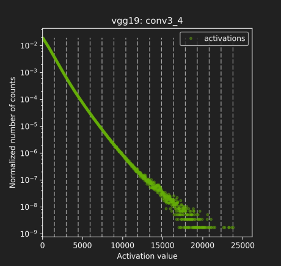

校准的过程可以参考一下这个：https://www.jianshu.com/p/43318a3dc715，这篇文章提供了一个详细的根据KL散度来将原始信息进行编码的例子，包括直方图的使用。跟这里的校准过程极为相像。

下面是一个官方 [GTC2017 PPT](http://on-demand.gputechconf.com/gtc/2017/presentation/s7310-8-bit-inference-with-tensorrt.pdf) 中给的校准的伪代码：

```python
//首先分成 2048个组，每组包含多个数值（基本都是小数）
Input: FP32 histogram H with 2048 bins: bin[ 0 ], …, bin[ 2047 ] 
  
For i in range( 128 , 2048 ): // |T|的取值肯定在 第128-2047 组之间,取每组的中点
	reference_distribution_P = [ bin[ 0 ] , ..., bin[ i-1 ] ] // 选取前 i 组构成P，i>=128
	outliers_count = sum( bin[ i ] , bin[ i+1 ] , … , bin[ 2047 ] ) //边界外的组
	reference_distribution_P[ i-1 ] += outliers_count //边界外的组加到边界P[i-1]上，没有直接丢掉
	P /= sum(P) // 归一化
      
    // 将前面的P（包含i个组，i>=128），映射到 0-128 上，映射后的称为Q，Q包含128个组，
    // 一个整数是一组
	candidate_distribution_Q = quantize [ bin[ 0 ], …, bin[ i-1 ] ] into 128 levels
	
	//这时的P（包含i个组，i>=128）和Q向量（包含128个组）的大小是不一样的，无法直接计算二者的KL散度
	//因此需要将Q扩展为 i 个组，以保证跟P大小一样
	expand candidate_distribution_Q to ‘ i ’ bins 
	
	Q /= sum(Q) // 归一化
	//计算P和Q的KL散度
	divergence[ i ] = KL_divergence( reference_distribution_P, candidate_distribution_Q)
End For

//找出 divergence[ i ] 最小的数值，假设 divergence[m] 最小，
//那么|T|=( m + 0.5 ) * ( width of a bin )
Find index ‘m’ for which divergence[ m ] is minimal

threshold = ( m + 0.5 ) * ( width of a bin )
```

解释一下第16行：

- 计算KL散度 KL_divergence(P, Q) 时，要求序列P和Q的长度一致，即 len(P) == len(Q)；
- Candidate_distribution_Q 是将 P 线性映射到 128个bins得到的，长度为128。而reference_distribution_P 包含 i （i>=128）个 bins （bin[0] - bin[i-1] ），二者长度不等；
- 需要将 candidate_distribution_Q 扩展回 i 个bins 然后才能与 i个bins 的 reference_distribution_P计算KL散度。

举个简单的栗子：

- 假设reference_distribution_P 包含 8 个bins（这里一个bin就只包含一个数据）:

  P = [ 1, 0, 2, 3, 5, 3, 1, 7]

- 我们想把它映射为 2 个bins，于是 4个一组合并：

  [1 + 0 + 2 + 3 , 5 + 3 + 1 + 7] = [6, 16]

- 然后要成比例的 扩展回到 8个组，保留原来是0的组：

  Q = [ 6/3, 0, 6/3, 6/3, 16/4, 16/4, 16/4, 16/4] = [ 2, 0, 2, 2, 4, 4, 4, 4]

- 然后对 P和Q进行标准化：

  P /= sum(P) 、Q /= sum(Q)

- 最后计算散度：

  result = KL_divergence(P, Q) 

我们来看看 ResNet-152中 res4b30层校准前后的结果对比：

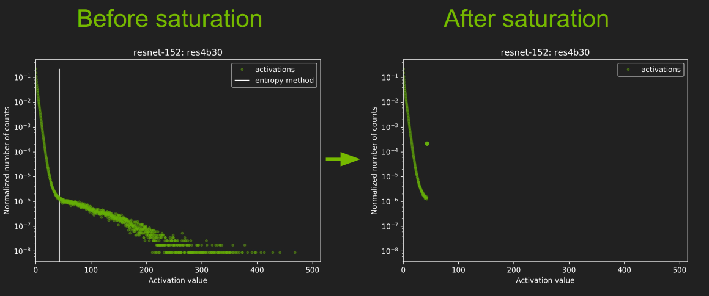

- 图中那个白线就是 |T|的取值，不过怎么还小于128了，有点没搞明白。

再看看其他几种网络的校准情况：

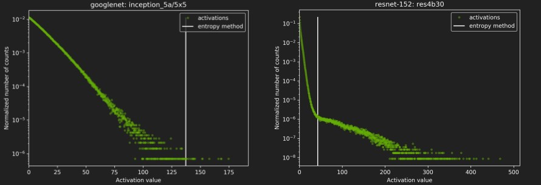


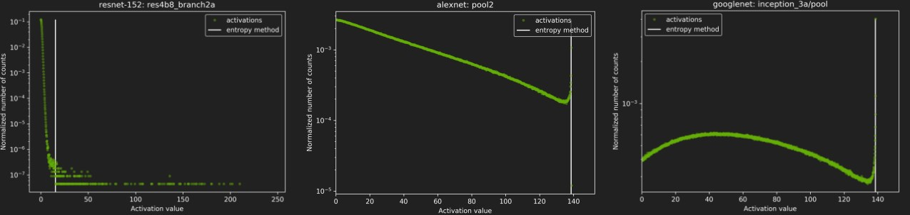

#### 2.2.4 DP4A(**D**ot **P**roduct of **4** 8-bits **A**ccumulated to a 32-bit)

TensorRT 进行优化的方式是 DP4A (**D**ot **P**roduct of **4** 8-bits **A**ccumulated to a 32-bit)，如下图：

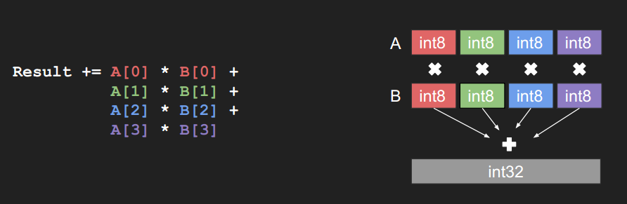


这是PASCAL 系列GPU的硬件指令，INT8卷积就是使用这种方式进行的卷积计算。

这个没搞太明白是怎么回事，参考这篇博客获取详细信息[Mixed-Precision Programming with CUDA 8](https://devblogs.nvidia.com/mixed-precision-programming-cuda-8/)

下面是 官方 [GTC2017 PPT](http://on-demand.gputechconf.com/gtc/2017/presentation/s7310-8-bit-inference-with-tensorrt.pdf) 中给的INT8卷积计算的伪代码：

```python
// I8 input tensors: I8_input, I8_weights, INT8输入tensor
// I8 output tensors: I8_output， INT8输出tensor
// F32 bias (original bias from the F32 model),FP32的偏置
// F32 scaling factors: input_scale, output_scale, weights_scale[K], 这个是前面说的缩放因子sf
I32_gemm_out = I8_input * I8_weights // Compute INT8 GEMM (DP4A)，卷积计算，INT32输出
F32_gemm_out = (float)I32_gemm_out // Cast I32 GEMM output to F32 float，强制转换为FP32

//前面计算I8_input * I8_weights时，总的缩放系数为 input_scale * weights_scale[K]
//但是输出的缩放系数为output_scale，所以为了保证缩放程度匹配，要将F32_gemm_out乘以 
//output_scale / (input_scale * weights_scale[ i ] )
  
// At this point we have F32_gemm_out which is scaled by ( input_scale * weights_scale[K] ),
// but to store the final result in int8 we need to have scale equal to "output_scale", so we have to rescale:
// (this multiplication is done in F32, *_gemm_out arrays are in NCHW format)
For i in 0, ... K-1:
rescaled_F32_gemm_out[ :, i, :, :] = F32_gemm_out[ :, i, :, :] * [ output_scale /(input_scale * weights_scale[ i ] ) ]
  
//将FP32精度的偏置 乘上缩放因子，加到前面的计算结果中
// Add bias, to perform addition we have to rescale original F32 bias so that it's scaled with "output_scale"
rescaled_F32_gemm_out _with_bias = rescaled_F32_gemm_out + output_scale * bias

//ReLU 激活
// Perform ReLU (in F32)
F32_result = ReLU(rescaled_F32_gemm_out _with_bias)

//重新转换为 INT8
// Convert to INT8 and save to global
I8_output = Saturate( Round_to_nearest_integer( F32_result ) )
```

它这个INT8卷积的计算是这样的，虽然输入的tensor已经降为 INT8，但是在卷积计算的时候用了DP4A的计算模式，卷积计算完之后是INT32的，然后又要转成 FP32，然后激活，最后再将FP32的转为INT8.

只知道这么计算会快很多，但不知道为什么，详情还是看[Mixed-Precision Programming with CUDA 8](https://devblogs.nvidia.com/mixed-precision-programming-cuda-8/) 这个吧，我看的也是糊里糊涂的。

不过这个对于tensorRT的使用没啥影响，这个是很底层的东西，涉及到硬件优化。

#### 2.2.5 Typical workflow in TensorRT

典型的工作流还是直接使用 [GTC2017 PPT](http://on-demand.gputechconf.com/gtc/2017/presentation/s7310-8-bit-inference-with-tensorrt.pdf) 原文说法吧：

- You will need:
  - Model trained in FP32.
  - Calibration dataset.
- TensorRT will:
  - Run inference in FP32 on calibration dataset.
  - Collect required statistics.
  - Run calibration algorithm → optimal scaling factors.
  - Quantize FP32 weights → INT8.
  - Generate “CalibrationTable” and INT8 execution engine. 

#### 2.2.6 Results - Accuracy & Performance

**精度并没有损失太多**

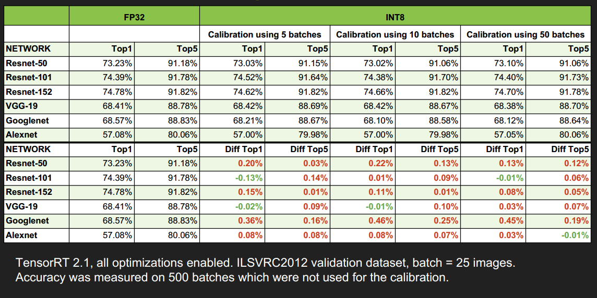


**速度提升还蛮多的，尤其是当 batch_size 大于1时，提升更明显**


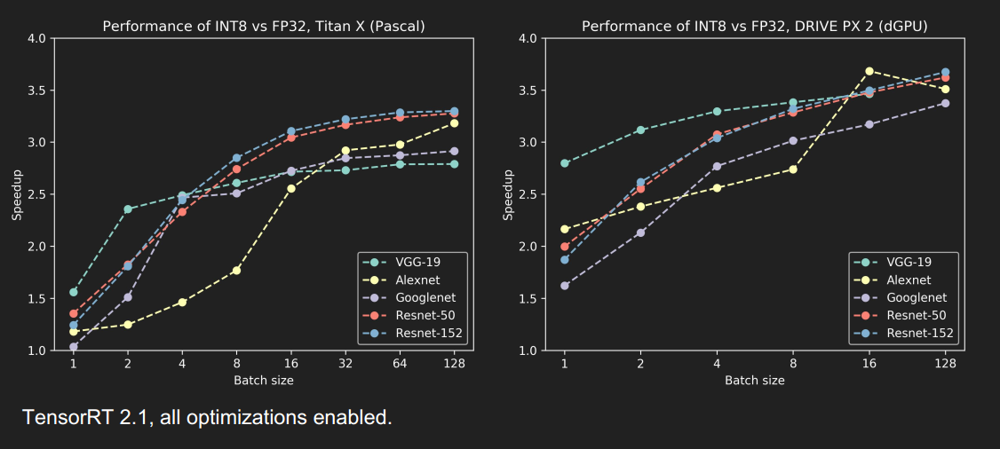

**TITAN X GPU优化效果**


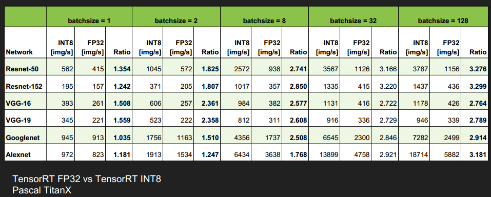


**DRIVE PX 2, dGPU 优化效果**

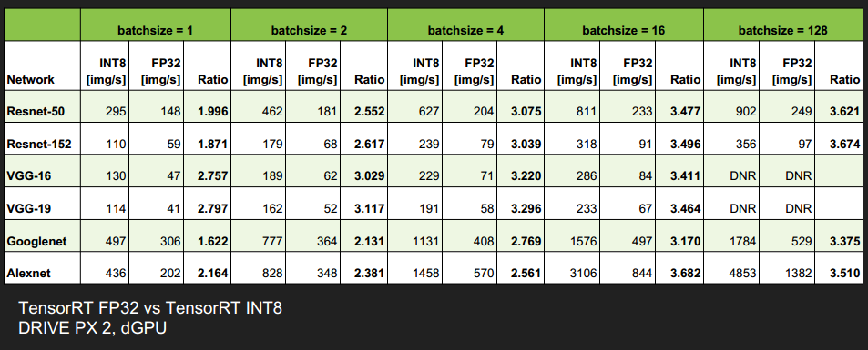

