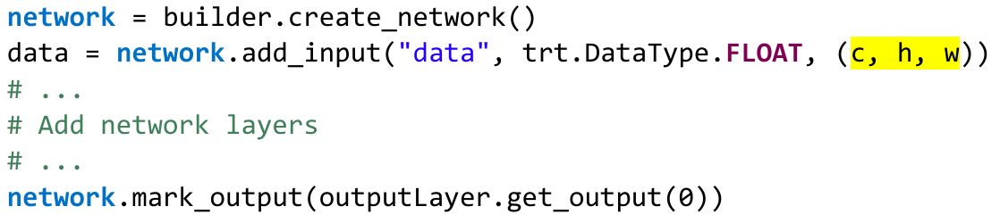

# API学习

⌚️:2021年09月23日

📚参考


---

## 一、概念梳理

- (https://www.cnblogs.com/mrlonely2018/p/14842107.html)
- https://docs.nvidia.com/deeplearning/tensorrt/developer-guide/index.html

### 1、Logger, Context, Engine, Builder, Network, Parser 知识梳理

先来看一下官方文档的api简介：

> TensorRT provides a C++ implementation on all supported platforms, and a Python implementation on Linux. Python is not currently supported on Windows or QNX.
>
> The key interfaces in the TensorRT core library are:
> **Network Definition**
> The Network Definition interface provides methods for the application to define a network. Input and output tensors can be specified, and layers can be added and configured. As well as layer types, such as convolutional and recurrent layers, a Plugin layer type allows the application to implement functionality not natively supported by TensorRT.
>
> **Optimization Profile**
> An optimization profile specifies constraints on dynamic dimensions.
>
> **Builder Configuration**
> The Builder Configuration interface specifies details for creating an engine. It allows the application to specify optimization profiles, maximum workspace size, the minimum acceptable level of precision, timing iteration counts for autotuning, and an interface for quantizing networks to run in 8-bit precision.
>
> **Builder**
> The Builder interface allows the creation of an optimized engine from a network definition and a builder configuration.
>
> **Engine**
> The Engine interface allows the application to execute inference. It supports synchronous and asynchronous execution, profiling, and enumeration and querying of the bindings for the engine inputs and outputs. A single-engine can have multiple execution contexts, allowing a single set of trained parameters to be used for the simultaneous execution of multiple inferences.
>
> **ONNX Parser**
> This parser can be used to parse an ONNX model.
>
> **C++ API vs Python API**
> In theory, the C++ API and the Python API should be close to identical in supporting your needs. The C++ API should be used in any performance-critical scenarios, as well as in situations where safety is important, for example, in automotive.
> The main benefit of the Python API is that data preprocessing and postprocessing are easy to use because you’re able to use a variety of libraries like NumPy and SciPy.

谷歌翻译：

> TensorRT 在所有支持的平台上提供 C++ 实现，在 Linux 上提供 Python 实现。 Windows 或 QNX 目前不支持 Python。
>
> TensorRT 核心库中的关键接口是：
> **网络定义 Network Definition**
> 网络定义接口为应用程序提供了定义网络的方法。可以指定输入和输出张量，并且可以添加和配置层。除了层类型，例如卷积层和循环层，插件层类型还允许应用程序实现 TensorRT 本身不支持的功能。
>
> **优化配置文件 Optimization Profile**
> 优化配置文件指定对动态维度的约束。
>
> **构建器配置 Builder Configuration**
> 构建器配置接口指定了创建引擎的详细信息。它允许应用程序指定优化配置文件、最大工作空间大小、最小可接受精度水平、自动调整的时序迭代计数以及用于量化网络以 8 位精度运行的接口。
>
> **构建器Builder**
> Builder 接口允许根据网络定义和构建器配置创建优化引擎。
>
> **引擎**
> Engine 接口允许应用程序执行推理。它支持同步和异步执行、分析、枚举和查询引擎输入和输出的绑定。单个引擎可以有多个执行上下文（execution contexts），允许使用一组经过训练的参数同时执行多个推理。
>
> **ONNX解析器**
> 此解析器可用于解析 ONNX 模型。
>
> **C++ API 与 Python API**
> 理论上，C++ API 和 Python API 在支持您的需求方面应该接近相同。 C++ API 应该用于任何对性能至关重要的场景，以及安全很重要的情况，例如在汽车中。
> Python API 的主要好处是数据预处理和后处理易于使用，因为您可以使用各种库，如 NumPy 和 SciPy。

https://docs.nvidia.com/deeplearning/tensorrt/developer-guide/index.html#api

————————————————————————————————————————————————————————————————

#### 什么是**Logger** ？ 

顾名思义，这是日志组件，用于管理builder, engine 和 runtime 的日志信息。

根据 tensorrt logging.h 头文件中对 Logger类 的注释：

> This class provides a common interface for TensorRT tools and samples to log information to the console, and supports logging two types of messages:
> \- Debugging messages with an associated severity (info, warning, error, or internal error/fatal)
> \- Test pass/fail messages
> The advantage of having all samples use this class for logging as opposed to emitting directly to stdout/stderr is that the logic for controlling the verbosity and formatting of sample output is centralized in one location.
> In the future, this class could be extended to support dumping test results to a file in some standard format(for example, JUnit XML), and providing additional metadata (e.g. timing the duration of a test run).

谷歌翻译：

> 该类为 TensorRT 工具和示例提供了一个通用接口来将信息记录到控制台，并支持记录两种类型的消息：
> \- 具有相关严重性（信息、警告、错误或内部错误/致命）的调试消息
> \- 测试通过/失败消息
> 与直接发送到 stdout/stderr 相比，让所有样本都使用此类进行日志记录的优势在于，控制样本输出的详细程度和格式的逻辑集中在一个位置。
> 将来，可以扩展此类以支持将测试结果转储到某种标准格式（例如，JUnit XML）的文件中，并提供额外的元数据（例如，对测试运行的持续时间进行计时）。

通常来说，logger 会作为一个必须的参数传递给 builder runtime parser的实例化接口：

```
IBuilder* builder = createInferBuilder(gLogger);
IRuntime* runtime = createInferRuntime(gLogger);
auto parser = nvonnxparser::createParser(*network, gLogger);
```

Logger在内部被视为单例，因此 IRuntime 和/或 IBuilder 的多个实例必须都使用相同的Logger。

参考：

https://docs.nvidia.com/deeplearning/tensorrt/api/c_api/classnvinfer1_1_1_i_logger.html#details

https://docs.nvidia.com/deeplearning/tensorrt/developer-guide/index.html#initialize_library

logging.h

————————————————————————————————————————————————————————————————

————————————————————————————————————————————————————————————————

#### **Context 执行上下文**

类 IExecutionContext 定义在 [NvInferRuntime.h](https://docs.nvidia.com/deeplearning/tensorrt/api/c_api/_nv_infer_runtime_8h_source.html) 头文件中：

> Context for executing inference using an engine, with functionally unsafe features.
>
> Multiple execution contexts may exist for one [ICudaEngine](https://docs.nvidia.com/deeplearning/tensorrt/api/c_api/classnvinfer1_1_1_i_cuda_engine.html) instance, allowing the same engine to be used for the execution of multiple batches simultaneously. If the engine supports dynamic shapes, each execution context in concurrent use must use a separate optimization profile.
>
> - Warning
>
>   Do not inherit from this class, as doing so will break forward-compatibility of the API and ABI.

谷歌翻译：

> 使用引擎执行推理的上下文，具有功能不安全的特性。
>
> 一个 ICudaEngine 实例可能存在多个执行上下文，允许使用同一个引擎同时执行多个批处理。 如果引擎支持动态形状，则并发使用的每个执行上下文必须使用单独的优化配置文件。
>
> 警告
> 不要从此类继承，因为这样做会破坏 API 和 ABI 的向前兼容性。

一般的使用方法：

> In order to run inference, use the interface IExecutionContext. In order to create an object of type IExecutionContext, first create an object of type ICudaEngine (the engine).
>
> The builder or runtime will be created with the GPU context associated with the creating thread.Even though it is possible to avoid creating the CUDA context, (the default context will be created for you), it is not advisable. It is recommended to create and configure the CUDA context before creating a runtime or builder object.

谷歌翻译：

> 为了运行推理，请使用接口 IExecutionContext。 为了创建一个 IExecutionContext 类型的对象，首先创建一个 ICudaEngine（引擎）类型的对象。
>
> 构建器或运行时将使用与创建线程关联的 GPU 上下文创建。即使可以避免创建 CUDA 上下文（将为您创建默认上下文），但不建议这样做。 建议在创建运行时或构建器对象之前创建和配置 CUDA 上下文。

常见用法：

```
const ICudaEngine& engine = context.getEngine();
IExecutionContext* context = engine->createExecutionContext();
context->destroy();
context.enqueue(batchSize, buffers, stream, nullptr);
//TensorRT execution is typically asynchronous, so enqueue the kernels on a CUDA stream.
//It is common to enqueue asynchronous memcpy() before and after the kernels to move data from the GPU if it is not already there. 
//The final argument to enqueueV2() is an optional CUDA event which will be signaled when the input buffers have been consumed and their memory may be safely reused.
//For more information, refer to enqueue() for implicit batch networks and enqueueV2() for explicit batch networks. 
//In the event that asynchronous is not wanted, see execute() and executeV2().
//The IExecutionContext contains shared resources, therefore, calling enqueue or enqueueV2 in from the same IExecutionContext object with different CUDA streams concurrently results in undefined behavior. 
//To perform inference concurrently in multiple CUDA streams, use one IExecutionContext per CUDA stream.
```

 使用引擎进行推理需要用到执行上下文。

```
IExecutionContext *context = engine->createExecutionContext();
```

> Create some space to store intermediate activation values. Since the engine holds the network definition and trained parameters, additional space is necessary. These are held in an execution context.
>
> An engine can have multiple execution contexts, allowing one set of weights to be used for multiple overlapping inference tasks. For example, you can process images in parallel CUDA streams using one engine and one context per stream. Each context will be created on the same GPU as the engine.

 

> 创建一些空间来存储中间激活值。 由于引擎保存网络定义和训练参数，因此需要额外的空间。 这些保存在执行上下文中。
>
> 一个引擎可以有多个执行上下文，允许一组权重用于多个重叠的推理任务。 例如，您可以使用一个引擎和每个流一个上下文处理并行 CUDA 流中的图像。 每个上下文都将在与引擎相同的 GPU 上创建。

参考：

https://docs.nvidia.com/deeplearning/tensorrt/developer-guide/index.html#perform_inference_c

https://docs.nvidia.com/deeplearning/tensorrt/developer-guide/index.html#initialize_library

https://docs.nvidia.com/deeplearning/tensorrt/api/c_api/classnvinfer1_1_1_i_execution_context.html#details

——————————————————————————————————————————————————————————————————

——————————————————————————————————————————————————————————————————

#### **Engine** 

类 ICudaEngine 定义在 [NvInferRuntime.h](https://docs.nvidia.com/deeplearning/tensorrt/api/c_api/_nv_infer_runtime_8h_source.html) 头文件中：

> An engine for executing inference on a built network, with functionally unsafe features.
>
> - Warning
>
>   Do not inherit from this class, as doing so will break forward-compatibility of the API and ABI.

 

> 用于在构建的网络上执行推理的引擎，具有功能不安全的特性。
>
> 警告
> 不要从此类继承，因为这样做会破坏 API 和 ABI 的向前兼容性。

使用builder创建engine：

```
IBuilderConfig* config = builder->createBuilderConfig();
config->setMaxWorkspaceSize(1 << 20);
ICudaEngine* engine = builder->buildEngineWithConfig(*network, *config);
```

当然，在此之前需要搭建完整的网络：



参考：

https://docs.nvidia.com/deeplearning/tensorrt/api/c_api/classnvinfer1_1_1_i_cuda_engine.html#details

https://docs.nvidia.com/deeplearning/tensorrt/developer-guide/index.html#build_engine_c

——————————————————————————————————————————————————————————————————

——————————————————————————————————————————————————————————————————

#### **Network**

类 [INetworkDefinition](https://docs.nvidia.com/deeplearning/tensorrt/api/c_api/classnvinfer1_1_1_i_network_definition.html) 定义在 NvInfer.h 头文件中：

> A network definition for input to the builder.
>
> A network definition defines the structure of the network, and combined with a [IBuilderConfig](https://docs.nvidia.com/deeplearning/tensorrt/api/c_api/classnvinfer1_1_1_i_builder_config.html), is built into an engine using an [IBuilder](https://docs.nvidia.com/deeplearning/tensorrt/api/c_api/classnvinfer1_1_1_i_builder.html). An [INetworkDefinition](https://docs.nvidia.com/deeplearning/tensorrt/api/c_api/classnvinfer1_1_1_i_network_definition.html) can either have an implicit batch dimensions, specified at runtime, or all dimensions explicit, full dims mode, in the network definition. When a network has been created using createNetwork(), only implicit batch size mode is supported. The function [hasImplicitBatchDimension()](https://docs.nvidia.com/deeplearning/tensorrt/api/c_api/classnvinfer1_1_1_i_network_definition.html#a728af2da798dcda6cc859d05e1989724) is used to query the mode of the network.
>
> A network with implicit batch dimensions returns the dimensions of a layer without the implicit dimension, and instead the batch is specified at execute/enqueue time. If the network has all dimensions specified, then the first dimension follows elementwise broadcast rules: if it is 1 for some inputs and is some value N for all other inputs, then the first dimension of each outut is N, and the inputs with 1 for the first dimension are broadcast. Having divergent batch sizes across inputs to a layer is not supported.

 

> 作为构建器输入的网络定义。
>
> 网络定义定义了网络的结构，与 IBuilderConfig 结合使用 IBuilder 构建到引擎中。 INetworkDefinition 可以具有在运行时指定的隐式批处理维度，或所有维度显式、完全维度模式。使用 createNetwork() 创建网络后，仅支持隐式批量大小模式。函数 hasImplicitBatchDimension() 用于查询网络的模式。
>
> 具有隐式批处理维度的网络返回没有隐式维度的层的维度，而是在execute/enqueue 时指定批处理大小。如果网络指定了所有维度，则第一个维度遵循元素广播规则：如果某些输入为 1，所有其他输入为某个值 N，则每个输出的第一个维度为 N，输入为 1第一个维度是广播。不支持跨层的输入具有不同的批次大小。

网络搭建示例：（C++接口，第一个是实际用例，第二个是官方文档示例）

Use method IBuilder::createNetworkV2 to create an object of type INetworkDefinition.

```
INetworkDefinition* network = builder->createNetworkV2(0U);
IBuilder* builder = createInferBuilder(gLogger);
INetworkDefinition* network = builder->createNetworkV2(1U << static_cast<uint32_t>(NetworkDefinitionCreationFlag::kEXPLICIT_BATCH));
```

Add the Input layer to the network, with the input dimensions, including dynamic batch.

```
ITensor* data = network->addInput(INPUT_BLOB_NAME, dt, Dims3{1, INPUT_H, INPUT_W});
auto data = network->addInput(INPUT_BLOB_NAME, dt, Dims3{-1, 1, INPUT_H, INPUT_W});
```

Add the Convolution layer

```
IConvolutionLayer* conv1 = network->addConvolutionNd(*data, 6, DimsHW{5, 5}, weightMap["conv1.weight"], weightMap["conv1.bias"]);
conv1->setStrideNd(DimsHW{1, 1});
auto conv1 = network->addConvolution(*data->getOutput(0), 20, DimsHW{5, 5}, weightMap["conv1filter"], weightMap["conv1bias"]);
conv1->setStride(DimsHW{1, 1});
```

Note: Weights passed to TensorRT layers are in host memory.

Add the Pooling layer

```
IPoolingLayer* pool1 = network->addPoolingNd(*relu1->getOutput(0), PoolingType::kAVERAGE, DimsHW{2, 2});
pool1->setStrideNd(DimsHW{2, 2});
auto pool1 = network->addPooling(*conv1->getOutput(0), PoolingType::kMAX, DimsHW{2, 2});
pool1->setStride(DimsHW{2, 2});
```

Add activation layer using the ReLU algorithm

```
IActivationLayer* relu1 = network->addActivation(*conv1->getOutput(0), ActivationType::kRELU);
auto relu1 = network->addActivation(*ip1->getOutput(0), ActivationType::kRELU);
```

 Add fully connected layer

```
IFullyConnectedLayer* fc1 = network->addFullyConnected(*pool2->getOutput(0), 120, weightMap["fc1.weight"], weightMap["fc1.bias"]);
auto ip1 = network->addFullyConnected(*pool1->getOutput(0), 500, weightMap["ip1filter"], weightMap["ip1bias"]);
```

Add the SoftMax layer to calculate the final probabilities and set it as the output:

```
ISoftMaxLayer* prob = network->addSoftMax(*fc3->getOutput(0));
prob->getOutput(0)->setName(OUTPUT_BLOB_NAME);
network->markOutput(*prob->getOutput(0));
auto prob = network->addSoftMax(*relu1->getOutput(0));
prob->getOutput(0)->setName(OUTPUT_BLOB_NAME);
network->markOutput(*prob->getOutput(0));
```

参考：

https://docs.nvidia.com/deeplearning/tensorrt/developer-guide/index.html#create_network_c

https://docs.nvidia.com/deeplearning/tensorrt/api/c_api/classnvinfer1_1_1_i_network_definition.html#details

——————————————————————————————————————————————————————————————————

——————————————————————————————————————————————————————————————————

#### **parser**

解析器主要用于解析ONNX模型并将其转换为tensorrt模型。类IParser 定义在[NvOnnxParser.h](https://docs.nvidia.com/deeplearning/tensorrt/api/c_api/_nv_onnx_parser_8h_source.html) 头文件中：

> an object for parsing ONNX models into a TensorRT network definition

 Create an ONNX parser using the INetwork definition as the input:

```
auto parser = nvonnxparser::createParser(*network, gLogger);
```

参考：

https://docs.nvidia.com/deeplearning/tensorrt/developer-guide/index.html#initialize_library

https://docs.nvidia.com/deeplearning/tensorrt/api/c_api/classnvonnxparser_1_1_i_parser.html#details

—————————————————————————————————————————————————————————————————

—————————————————————————————————————————————————————————————————

###  2、TensorRT多GPU的使用

- https://blog.csdn.net/qq_29007291/article/details/110551881


Q: How do I use TensorRT on multiple GPUs?
如何在多GPU环境中使用TensorRT

A: Each ICudaEngine object is bound to a specific GPU when it is instantiated, either
by the builder or on deserialization. To select the GPU, use cudaSetDevice() before
calling the builder or deserializing the engine. Each IExecutionContext is bound
to the same GPU as the engine from which it was created. When calling execute()
or enqueue(), ensure that the thread is associated with the correct device by calling
cudaSetDevice() if necessary

每个ICudaEngine对象被实例化的时候（builder 或者deserialization）都会绑定在指定的GPU上。如果要选择GPU, 则应该在创建engine或者反序列化engine的时候使用cudaSetDevice（）进行设定。每一个IExecutionContext都被绑定在了engine被创建的那个GPU上。当使用execute()或者enqueue() 需要明确与当前显卡有关的线程

### 3、onnx转TensorRT模型报错


报错信息：

```
[2021-07-26 07:16:07   ERROR] 2: [ltWrapper.cpp::setupHeuristic::327] Error Code 2: Internal Error (Assertion cublasStatus == CUBLAS_STATUS_SUCCESS failed.)
terminate called after throwing an instance of 'std::runtime_error'
  what():  Failed to create object
已放弃 (核心已转储)
```


解决办法：
此处报错使用的是cuda10.2
在此下载补丁1并安装即可

### 4、TensorRT 官方手册介绍

- [官方英文](https://docs.nvidia.com/deeplearning/tensorrt/index.html)
- [中文](https://blog.csdn.net/irving512/article/details/114019280)

### 5、TensorRT dynamic batch（python）

- https://github.com/TD-4/Tensorrt-CV

### 6、