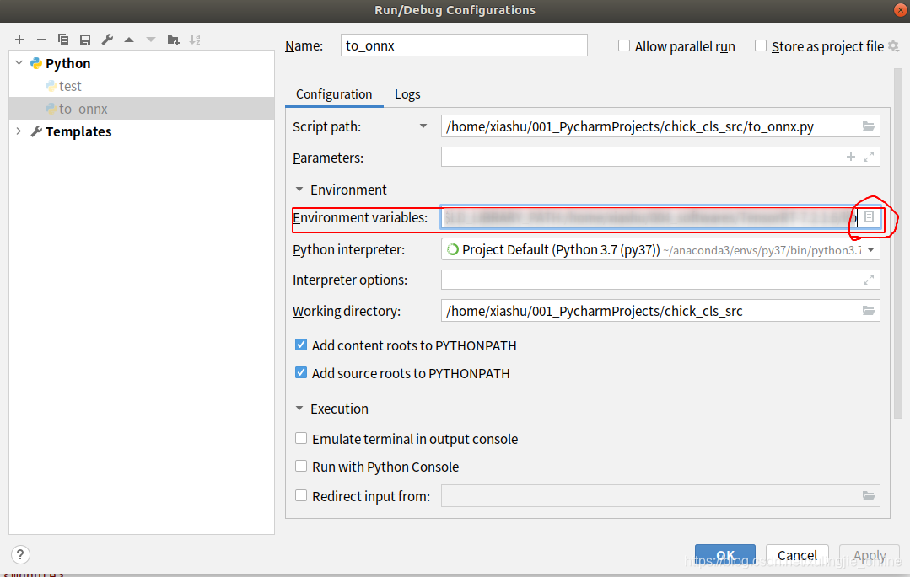
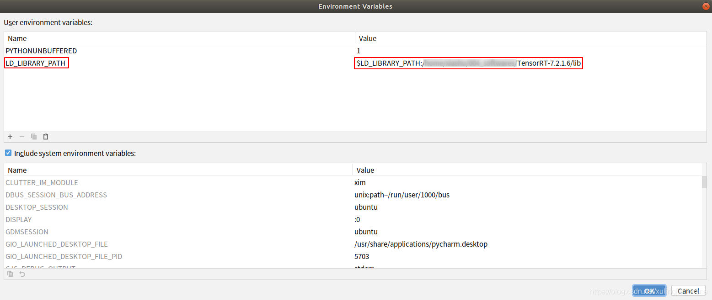

# 遇到的问题

⌚️:2021-03-12

📚参考

---

## 问题1

**ImportError: libnvinfer.so.7: cannot open shared object file: No such file or directory**

### 问题描述

ubuntu18.04 安装完tensorrt7.2.1后，要在~/.bashrc中添加环境变量：

#tensorrt
export LD_LIBRARY_PATH=$LD_LIBRARY_PATH:your trt path/TensorRT-7.2.1.6/lib
否则会报标题中显示的错误。

奇怪的是，我在终端调用tensorrt没有问题，但在pycharm里运行时，还是提示我找不到libnvinfer.so.7，几经查找后，恍然发现应该是设置在bashrc中的环境变量没有对pycharm起到作用（非常疑惑这是为什么，因为之前装过一次tensorrt，能在pycharm中正常使用，有知道的小伙伴希望能在评论区解答），退而求其次，在pycharm中设置环境变量：

### 解决

1. 在pycharm上方工具栏找到Run---Edit Configurations---Environment variables，点击右边的小页面图标

2. 如下图添加tensorrt依赖路径，马赛克里面填自己的tensorrt解压的路径即可

