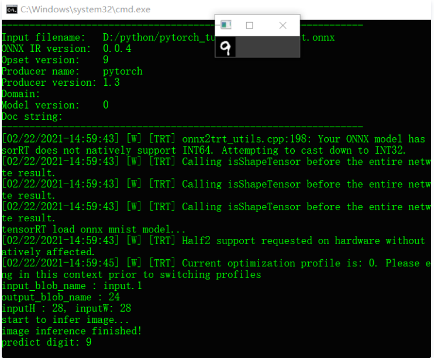

## 1、推理演示 | 八步助你搞定tensorRT C++ SDK调用！

⌚️:2021-03-12

📚参考

- [原文](https://cloud.tencent.com/developer/article/1800743)

---


### 背景

Hello，2020年底我安装配置好了TensorRT7，写了一篇文章总结了在Widnows10系统中如何配置与运行代码实现TensorRT开发环境的搭建。文章中详细介绍了配置的流程与步骤，文章的链接如下：

[五分钟搞定VS2017+TensorRT环境搭建](http://mp.weixin.qq.com/s?__biz=MzA4MDExMDEyMw==&mid=2247491109&idx=1&sn=2a69c87f78e0c330163de913d0e81944&chksm=9fa86961a8dfe0775bbaacf4acad833766f32b80606859a56ed79e57b3a58772c70cbbeeba0a&scene=21#wechat_redirect)

当时还录了一个视频，我上传到了B站，觉得看文章麻烦，就看**B站视频**吧！地址在这里：

```javascript
https://www.bilibili.com/video/BV1Bf4y167Ty
```

今天给大家分享一下，我跑的第一个Pytorch + TensorRT的模型训练与部署例子。不久以前我写过一个系列文章叫做《轻松学Pytorch系列》，其中有一篇CNN入门的文章，是讲如何通过CNN训练mnist数据集，然后导出模型ONNX格式，在OpenCV DNN中调用的。今天我就还继续用我导出的ONNX模型，实现它在TensorRT7中的调用，完成一个TensorRT版本的手写数字识别模型的部署。

配置

要想运行这个例子，还需要配置一波开发环境，在之前的配置的基础上，分别倒入安装好的CUDA的include目录，lib目录，然后把lib目录里面的*.lib文件统统扔到链接器中去。这样就完成了开发配置。我的CUDA安装路径如下：

```javascript
C:\Program Files\NVIDIA GPU Computing Toolkit\CUDA\v10.0
include目录为：
C:\Program Files\NVIDIA GPU Computing Toolkit\CUDA\v10.0\include
Lib目录为：
C:\Program Files\NVIDIA GPU Computing Toolkit\CUDA\v10.0\lib
```

推理与演示

TensorRT的加载模型执行推理的步骤基本上跟OpenVINO与OpenCV DNN很相似，唯一区别的地方在于使用tensorRT做推理，首先需要把数据从内存搬到显存，处理完之后再重新搬回内存，然后解析输出。基本步骤与代码如下：

### **创建网络**

```javascript
IBuilder* builder = createInferBuilder(gLogger);
nvinfer1::INetworkDefinition* network = builder->createNetworkV2(1U << static_cast<uint32_t>(NetworkDefinitionCreationFlag::kEXPLICIT_BATCH));
auto parser = nvonnxparser::createParser(*network, gLogger);
```

### **解析ONNX格式模型文件**

```javascript
// 解析ONNX模型
parser->parseFromFile(onnx_filename.c_str(), 2);
for (int i = 0; i < parser->getNbErrors(); ++i)
{
    std::cout << parser->getError(i)->desc() << std::endl;
}
printf("tensorRT load onnx mnist model...\n");
```

### **创建推理引擎**

```javascript
// 创建推理引擎
IBuilderConfig* config = builder->createBuilderConfig();
config->setMaxWorkspaceSize(1 << 20);
config->setFlag(nvinfer1::BuilderFlag::kFP16);
ICudaEngine* engine = builder->buildEngineWithConfig(*network, *config);
IExecutionContext *context = engine->createExecutionContext();
```

### **获取输入输出格式与名称**

```javascript
// 获取输入与输出名称，格式
const char* input_blob_name = network->getInput(0)->getName();
const char* output_blob_name = network->getOutput(0)->getName();
printf("input_blob_name : %s \n", input_blob_name);
printf("output_blob_name : %s \n", output_blob_name);

const int inputH = network->getInput(0)->getDimensions().d[2];
const int inputW = network->getInput(0)->getDimensions().d[3];
printf("inputH : %d, inputW: %d \n", inputH, inputW);
```

### **设置输入数据**

```javascript
// 预处理输入数据
Mat image = imread("D:/images/9_99.png", IMREAD_GRAYSCALE);
imshow("输入图像", image);
Mat img2;
image.convertTo(img2, CV_32F);
img2 = (img2 / 255 - 0.5) / 0.5;
```

### **创建输入/输出 显存缓冲区**

```javascript
// 创建GPU显存输入/输出缓冲区
void* buffers[2] = { NULL, NULL };
int nBatchSize = 1;
int nOutputSize = 10;
cudaMalloc(&buffers[0], nBatchSize * inputH * inputW * sizeof(float));
cudaMalloc(&buffers[1], nBatchSize * nOutputSize * sizeof(float));

// 创建cuda流
cudaStream_t stream;
cudaStreamCreate(&stream);
void *data = malloc(nBatchSize * inputH * inputW * sizeof(float));
memcpy(data, img2.ptr<float>(0), inputH * inputW * sizeof(float));
```

### 执行推理

```javascript
// 内存到GPU显存
cudaMemcpyAsync(buffers[0], data, \
nBatchSize * inputH * inputW * sizeof(float), cudaMemcpyHostToDevice, stream);
std::cout << "start to infer image..." << std::endl;

// 推理
context->enqueueV2(buffers, stream, nullptr);

// 显存到内存
float prob[10];
cudaMemcpyAsync(prob, buffers[1], 1 * nOutputSize * sizeof(float), cudaMemcpyDeviceToHost, stream);

// 同步结束，释放资源
cudaStreamSynchronize(stream);
cudaStreamDestroy(stream);
```

### **解析输出与打印**

```javascript
// 解析输出
std::cout << "image inference finished!" << std::endl;
Mat result = Mat(1, 10, CV_32F, (float*)prob);
float max = result.at<float>(0, 0);
int index = 0;
for (int i = 0; i < 10; i++)
{
    if (max < result.at<float>(0,i)) {
        max = result.at<float>(0, i);
        index = i;
    }
}
std::cout << "predict digit: " << index << std::end
```

运行结果如下：



## 2、TensorRT 源码简介

http://zengzeyu.com/2020/07/09/tensorrt_02_introduction/

NVIDIA TensorRT是一种高性能神经网络推理(Inference)引擎，用于在生产环境中部署深度学习应用程序，应用有图像分类、分割和目标检测等，可提供最大的推理吞吐量和效率。TensorRT是第一款可编程推理加速器，能加速现有和未来的网络架构。

### TensorRT 库构成

以编译后源码压缩包安装方式进行安装的TensorRT库主要有以下文件夹：

```
├── data
├── doc
├── include  # 所有头文件，可以查看所有函数的接口和说明
├── lib      # 所有动态链接库.so文件
├── python   # python API 例子
└── samples  # c++ 例子
```

### include文件夹

`include`文件夹内部包含文件如下：

```
├── include
│   ├── NvCaffeParser.h
│   ├── NvInfer.h
│   ├── NvInferPlugin.h
│   ├── NvInferPluginUtils.h
│   ├── NvInferRuntimeCommon.h
│   ├── NvInferRuntime.h
│   ├── NvInferVersion.h
│   ├── NvOnnxConfig.h
│   ├── NvOnnxParser.h
│   ├── NvOnnxParserRuntime.h
│   ├── NvUffParser.h
│   └── NvUtils.h
```

下面按照文件之间依赖关系，大致介绍上述头文件。

- `NvInferRuntimeCommon.h` ：定义了 TRT 运行时所需的基础数据结构（如`Dims`，`PluginField`）和大部分基类（`class ILogger`， `class IPluginV2`）
- `NvInferRuntime.h`: 继承`NvInferRuntimeCommon.h`中的基类，定义了runtime时的拓展功能子类
- `NvInfer.h`：继承`NvInferRuntime.h`中的基类，定义了大部分可以直接加入的神经网络层（如`class IConvolutionLayer`，`class IPoolingLayer`，`class IPoolingLayer`）
- `NvInferPluginUtils.h`：定义`plugin layer`所需的基础数据结构
- `NvInferPlugin.h`：初始化注册所有苦衷包含`plugin layer`
- 其他的从文件名即可看出时分别Caffe，ONNX，UFF 的解析器parser，分别对应训练后的Caffe，Pytorch，TensorFlow网络


## 3. TensorRT 的 C++ API 使用详解

2019-04-24 20:06:09 

https://blog.csdn.net/u010552731/article/details/89501819

### 1. TensorRT 的 C++ API 使用示例

进行推理，需要先创建IExecutionContext对象，要创建这个对象，就需要先创建一个ICudaEngine的对象（engine）。


两种创建engine的方式：


1. 使用模型文件创建engine，并可把创建的engine序列化后存储到硬盘以便后面直接使用；
2. 使用之前已经序列化存储的engine，这种方式比较高效些，因为解析模型并生成engine还是挺慢的。

无论哪种方式，都需要创建一个全局的iLogger对象，并被用来作为很多TensorRT API方法的参数使用。如下是一个logger创建示例：

```
class Logger : public ILogger           
 {
     void log(Severity severity, const char* msg) override
     {
         // suppress info-level messages
         if (severity != Severity::kINFO)
             std::cout << msg << std::endl;
     }
 } gLogger;
```

### 2. 用 C++ API 创建TensorRT网络

#### 2.1 使用 C++ 的 parser API 导入模型

**1.创建TensorRT builder和network**

```
IBuilder* builder = createInferBuilder(gLogger);
nvinfer1::INetworkDefinition* network = builder->createNetwork();
```

**2. 针对特定格式创建TensorRT parser**

```
// ONNX
auto parser = nvonnxparser::createParser(*network,
        gLogger);
// UFF
auto parser = createUffParser();
// NVCaffe
ICaffeParser* parser = createCaffeParser();
```

**3.使用parser解析导入的模型并填充network**

`parser->parse(args);`


具体的args要看使用什么格式的parser。

必须在网络之前创建构建器，因为它充当网络的工厂。 不同的解析器在标记网络输出时有不同的机制。

#### 2.2 使用 C++ Parser API 导入 Caffe 模型

**1.创建builder和network**

```
IBuilder* builder = createInferBuilder(gLogger);
INetworkDefinition* network = builder->createNetwork();
```


2.创建caffe parser

`ICaffeParser* parser = createCaffeParser();`


3.解析导入的模型

```
const IBlobNameToTensor* blobNameToTensor = parser->parse("deploy_file", 
              "modelFile", 
              *network, 
              DataType::kFLOAT);
```


这将把Caffe模型填充到TensorRT的network。最后一个参数指示解析器生成权重为32位浮点数的网络。使用DataType :: kHALF将生成具有16位权重的模型。

除了填充网络定义之外，parser还返回一个字典，该字典是从 Caffe 的 blob names 到 TensorRT 的 tensors 的映射。与Caffe不同，TensorRT网络定义没有in-place的概念。当Caffe模型使用in-place操作时，字典中返回的相应的TensorRT tensors是对那个blob的最后一次写入。例如，如果是一个卷积写入到了blob并且后面跟的是ReLU，则该blob的名字映射到TensorRT tensors就是ReLU的输出。


4.给network分配输出

```
for (auto& s : outputs)
    network->markOutput(*blobNameToTensor->find(s.c_str()));
```


#### 2.3. 使用 C++ Parser API 导入 TensorFlow 模型

对于一个新的工程，推荐使用集成的TensorFlow-TensorRT作为转换TensorFlow network到TensorRT的方法来进行推理。具体可参考：Integrating TensorFlow With TensorRT

从TensorFlow框架导入，需要先将TensorFlow模型转换为中间格式：UFF（Universal Framework Format）。相关转换可参考Coverting A Frozen Graph to UFF

更多关于UFF导入的信息可以参考：https://docs.nvidia.com/deeplearning/sdk/tensorrt-sample-support-guide/index.html#mnist_uff_sample

先来看下如何用C++ Parser API来导入TensorFlow模型。


1.创建builder和network

```
IBuilder* builder = createInferBuilder(gLogger);
INetworkDefinition* network = builder->createNetwork();
```


2.创建UFF parser

`IUFFParser* parser = createUffParser();`

3.向UFF parser声明network的输入和输出

```
parser->registerInput("Input_0", DimsCHW(1, 28, 28), UffInputOrder::kNCHW);
parser->registerOutput("Binary_3");
```


注意：TensorRT期望的输入tensor是CHW顺序的。从TensorFlow导入时务必确保这一点，如不是CHW，那就先转换成CHW顺序的。


4.解析已导入的模型到network

`parser->parse(uffFile, *network, nvinfer1::DataType::kFLOAT);`


#### 2.4. 使用 C++ Parser API 导入 ONNX 模型

使用限制：注意版本问题，TensorRT5.1 附带的 ONNX Parser支持的ONNX IR版本是0.0.3，opset版本是9。通常，较新的ONNX parser是后向兼容的。更多信息可参考：ONNX Model Opset Version Converter 和 onnx-tensorrt。

更多关于ONNX导入的信息也可参考：
https://docs.nvidia.com/deeplearning/sdk/tensorrt-sample-support-guide/index.html#onnx_mnist_sample


1.创建ONNX parser，parser使用辅助配置管理SampleConfig对象将输入参数从示例的可执行文件传递到parser对象

```
nvonnxparser::IOnnxConfig* config = nvonnxparser::createONNXConfig();
//Create Parser
nvonnxparser::IONNXParser* parser = nvonnxparser::createONNXParser(*config);
```


2.填充模型

`parser->parse(onnx_filename, DataType::kFLOAT);`

3.转换模型到TensorRT的network

`parser->convertToTRTNetwork();`

4.从模型获取network

`nvinfer1::INetworkDefinition* trtNetwork = parser->getTRTNetwork();`

### 3. 用 C++ API 构建 engine

下一步是调用TensorRT的builder来创建优化的runtime。 builder的其中一个功能是搜索其CUDA内核目录以获得最快的实现，因此用来构建优化的engine的GPU设备和实际跑的GPU设备一定要是相同的才行。

builder具有许多属性，可以通过设置这些属性来控制网络运行的精度，以及自动调整参数。还可以查询builder以找出硬件本身支持的降低的精度类型。

有两个特别重要的属性：最大batch size和最大workspace size。

- 最大batch size指定TensorRT将要优化的batch大小。在运行时，只能选择比这个值小的batch。
- 各种layer算法通常需要临时工作空间。这个参数限制了网络中所有的层可以使用的最大的workspace空间大小。 如果分配的空间不足，TensorRT可能无法找到给定层的实现。


1.用builder对象创建构建engine

```
builder->setMaxBatchSize(maxBatchSize);
builder->setMaxWorkspaceSize(1 << 20);
ICudaEngine* engine = builder->buildCudaEngine(*network);
```


2.用完分配过的network，builder和parser记得解析

```
parser->destroy();
network->destroy();
builder->destroy();
```


### 4.用 C++ API 序列化一个模型

序列化模型，即把engine转换为可存储的格式以备后用。推理时，再简单的反序列化一下这个engine即可直接用来做推理。通常创建一个engine还是比较花时间的，可以使用这种序列化的方法避免每次重新创建engine。

注意：序列化的engine不能跨平台或在不同版本的TensorRT间移植使用。因为其生成是根据特定版本的TensorRT和GPU的。

1.序列化

```
IHostMemory *serializedModel = engine->serialize();
// store model to disk
// <…>
serializedModel->destroy();
```


2.创建一个runtime并用来反序列化

```
IRuntime* runtime = createInferRuntime(gLogger);
ICudaEngine* engine = runtime->deserializeCudaEngine(modelData, modelSize, nullptr);
```


### 5.用 C++ API 执行推理

1.创建一个Context用来存储中间激活值

`IExecutionContext *context = engine->createExecutionContext();`

一个engine可以有多个execution context，并允许将同一套weights用于多个推理任务。可以在并行的CUDA streams流中按每个stream流一个engine和一个context来处理图像。每个context在engine相同的GPU上创建。


2.用input和output的blob名字获取对应的input和output的index

`int inputIndex = engine.getBindingIndex(INPUT_BLOB_NAME);`

`int outputIndex = engine.getBindingIndex(OUTPUT_BLOB_NAME);`

3.使用上面的indices，在GPU上创建一个指向input和output缓冲区的buffer数组

```
void* buffers[2];
buffers[inputIndex] = inputbuffer;
buffers[outputIndex] = outputBuffer;
```


4.通常TensorRT的执行是异步的，因此将kernels加入队列放在CUDA stream流上

`context.enqueue(batchSize, buffers, stream, nullptr);`

通常在kernels之前和之后来enquque异步memcpy()以从GPU移动数据（如果尚未存在）。

enqueue()的最后一个参数是一个可选的CUDA事件，当输入缓冲区被消耗且它们的内存可以安全地重用时这个事件便会被信号触发。

为了确定kernels（或可能存在的memcpy()）何时完成，请使用标准CUDA同步机制（如事件）或等待流。


### 6.C++ API 的内存管理

TensorRT提供了两种机制来允许应用程序对设备内存进行更多的控制。

默认情况下，在创建IExecutionContext时，会分配持久设备内存来保存激活数据。为避免这个分配，请调用createExecutionContextWithoutDeviceMemory。然后应用程序会调用IExecutionContext :: setDeviceMemory()来提供运行网络所需的内存。内存块的大小由ICudaEngine :: getDeviceMemorySize()返回。

此外，应用程序可以通过实现IGpuAllocator接口来提供在构建和运行时使用的自定义分配器。实现接口后，请调用：

`setGpuAllocator(&allocator);`

在IBuilder或IRuntime接口上。所有的设备内存都将通过这个接口来分配和释放。

### 7.调整engine

TensorRT可以为一个engine装填新的weights，而不用重新build。

1.在build之前申请一个可refittable的engine

```
...
builder->setRefittable(true); 
builder->buildCudaEngine(network);
```


2.创建一个refitter对象

`ICudaEngine* engine = ...;`

`IRefitter* refitter = createInferRefitter(*engine,gLogger)`

3.更新你想更新的weights
如：为一个叫MyLayer的卷积层更新kernel weights

`Weights newWeights = ...;`

`refitter.setWeights("MyLayer",WeightsRole::kKERNEL,
                    newWeights);`


这个新的weights要和原始用来build engine的weights具有相同的数量。
setWeights出错时会返回false。


4.找出哪些weights需要提供。
这通常需要调用两次IRefitter::getMissing，第一次调用得到Weights对象的数目，第二次得到他们的layers和roles。

```
const int n = refitter->getMissing(0, nullptr, nullptr);
std::vector<const char*> layerNames(n);
std::vector<WeightsRole> weightsRoles(n);
refitter->getMissing(n, layerNames.data(), 
                        weightsRoles.data());
```


5.提供missing的weights（顺序无所谓）

```
for (int i = 0; i < n; ++i)
    refitter->setWeights(layerNames[i], weightsRoles[i],
                         Weights{...});
```


只需提供missing的weights即可，如果提供了额外的weights可能会触发更多weights的需要。


6.更新engine

```
bool success = refitter->refitCudaEngine();
assert(success);
```


如果success的值为false，可以检查一下diagnostic log，也许有些weights还是missing的。


7.销毁refitter

`refitter->destroy();`
如果想要查看engine中所有可重新调整的权重，可以使用refitter-> getAll(...)，类似于步骤4中的如何使用getMissing。

## 4. 如何提供性能

http://yeahflash.com/programming/tensorrt/tensorrt_tutorials_5.html#_3-2-%E5%A6%82%E4%BD%95%E6%8F%90%E9%AB%98tensorrt%E6%80%A7%E8%83%BD

### 3.1. 如何评估性能

- 指标
  - Latency，inference时间，
  - Throughout，吞吐量，固定时间内执行了多少次推理
- 如何选择时间点（性能都有时间，时间的起止时间点选择非常重要）
  - 整体系统的性能一般会计算所有时间（包括数据预处理与后处理等）
  - 但不同任务的数据预处理、后处理等时间差距太大，所以本文只考虑模型推理时间。
  - 另外一种测试方式是，确定latency的最大值（猜测超过最大值就结束本次推理），计算固定时间内的inference次数。这种方法是 `quality-of-service measurement`，可以很好的比较用户体验与系统性能。
- 工具：
  - `trtexec`提供了相关工具
  - 也可以通过NVIDIA Triton Inference Server来测试并行推理性能。
- CPU时间测试，有一段测试代码
- CUDA Events：由于存在 host/device 同步问题，不能通过直接的方法获取时间。这可以通过CUDA Events来实现
- TensorRT内置Profile
- CUDA Profiling：说有俩工具[NVIDIA Nsight Compute (opens new window)](https://developer.nvidia.com/nsight-compute)和[NVIDIA Nsight Systems (opens new window)](https://developer.nvidia.com/nsight-systems)，没细看。
- 内存：说是通过a simple custom GPU allocator来监控，但也没细说。

### 3.2. 如何提高TensorRT性能

- 说白了，就是为了提高性能，TensorRT提供了哪些功能
  - 文档里还说了一句，CUDA程序员看这些很合适，其他菜鸡（比如我）可能就看不懂了
- Mixed Precision
  - 混合精度，也就是权重的数据类型，支持FP32/FP16/INT8
  - 默认是FP32，如果选择FP16模式则使用FP16或FP32，如果选择INT8模式则使用INT8或FP32
  - 为了获得更好的性能，可以同时指定FP16和INT8模式，三种精度混用。
  - 还可以使用`trtexec`中的`--best`选项
- Batching
  - 一个Batch就是一组输入。
  - 这种策略增加了每个输入的latency，但提高了总体吞吐量
- Streaming
  - CUDA 中的streams是处理同步任务的一种方式，即同步命令放到一个stream中，其中的命令会按顺序依次执行。同一个stream中是确定同步执行的，多个streams则是异步的。
  - 使用多个stream提高并行度从而提高性能。
  - 使用流程大概是：
    - Identify the batches of inferences that are independent.
    - Create a single engine for the network.
    - Create a CUDA stream using cudaStreamCreate for each independent batch and an IExecutionContext for each independent batch.
    - Launch inference work by requesting asynchronous results using IExecutionContext::enqueue from the appropriate IExecutionContext and passing in the appropriate stream.
    - After all the work has been launched, synchronize with all the streams to wait for results. The execution contexts and streams can be reused for later batches of independent work.
- Thread Safety
  - 一个TesnorRT builder只能被一个线程使用，如果要多线程就需要创建多个builder
  - 只要每个object使用不同的execution context，那么TensorRT runtime就可以被多个线程同时使用
- Initializing The Engine
  - 初始化Engine的时候会进行很多优化，并进行测试
- Enabling Fusion：使用Fusion操作，其实就是合并操作

## 5.案例

代码：https://github.com/FelixFu-TD/Win10_TensorRT_Pytorch_ONNX

博客：https://arleyzhang.github.io/articles/7f4b25ce/

