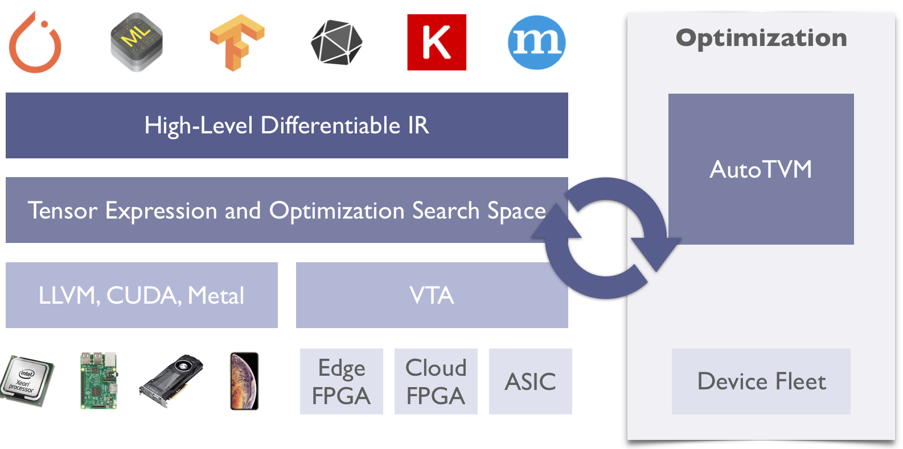
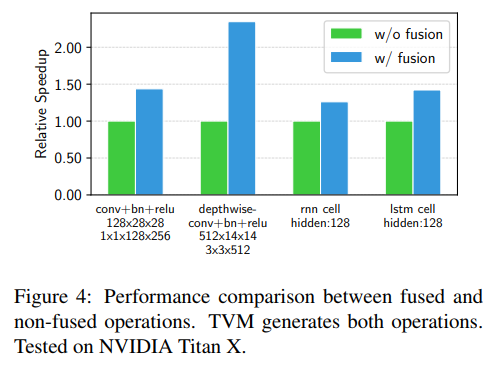
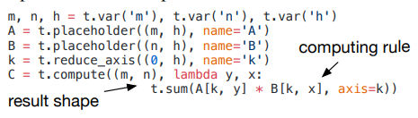
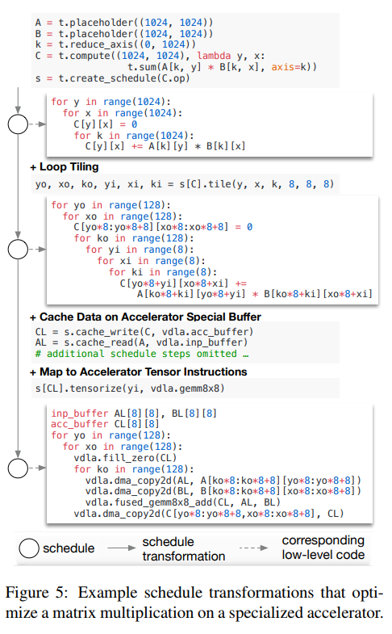
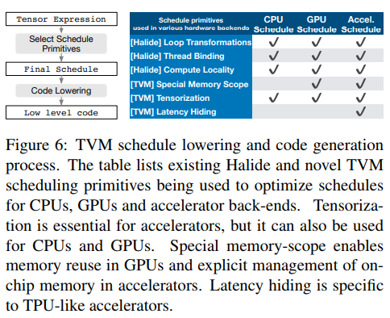
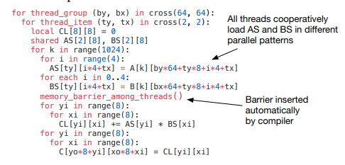
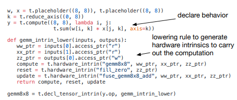
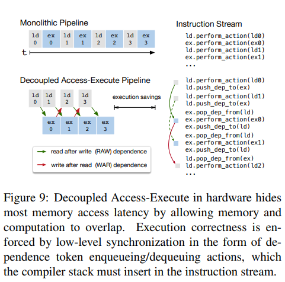
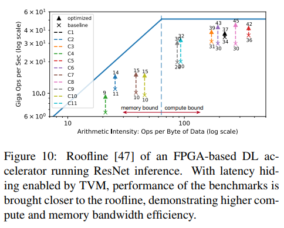
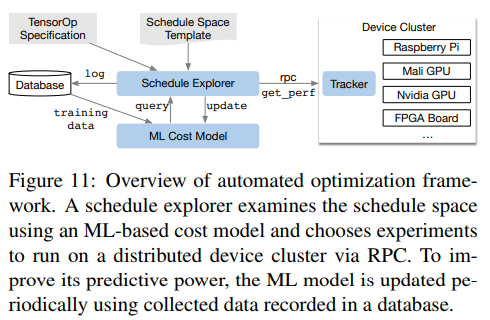

# TVM

⌚️:2020年11月30日

📚参考

* [TVM简介](#about-tvm)

---

<b>TVM简介</b>

TVM 是一个开源的用于CPU、GPU的编译工具栈和专业的加速器。它旨在消除以生产力为中心的深度学习框架和以性能、效率为导向的硬件后端之间的不适配。TVM提供两个主要的特性：
* 将 Keras、MXNet、PyTorch、Tensorflow、CoreML、DarkNet模型编译为不同硬件后端的最小可部署模块。
* 自动优化和生成多种后端的张量操作以获得更好的性能。

TVM栈始于华盛顿大学保罗艾伦计算机科学与工程学院的[SAMPL group](https://sampl.cs.washington.edu/)的一个研究项目。这个项目现在由涉及多个行业和学术机构的开源社区推动。遵循Apache协议，Apache-style merit based governace model[https://docs.tvm.ai/contribute/community.html]。

TVM提供下图所示两种层级的优化。计算图优化执行比如高级运算符优化、布局转换、和内存管理。张量操作优化和代码生成层用来优化张量操作。

<b>操作符融合</b>

操作符融合将多个操作合并到一个kernel中而不用在内存中存储中间结果。这个操作可以极大地减少运行时间,尤其是在GPU或者专业的加速器上。特别地，我们将图操作分为四种：
（1）injective（单射，比如相加）
（2）reduction（缩减（维度上），比如加法）
（3）complex-out-fusable（不知道怎么翻译， 可融合，比如2D卷积）
（4）opaque（不可融合的，比如排序）
我们提供通用的规则取融合这些操作，如下所述。多个injective操作可以被融合为另一个injective操作。一个reduction操作可以和输入injective操作融合（比如 scale和sum）。像conv2d这样的操作符属于 complex-out-fusable，我们融合element-wise操作作为它的输入。我们可以使用这些规则去融合一个计算图。Figure 4描述了在不同负载上的优化效果。我们发现操作符融合通过减少内存访问能提供给1.2倍到2倍的加速。

<b>数据布局转换</b>

在计算图中保存一个张量的方式有多种。最常用的数据布局（layout）方式是列主序和行主序。实践中，我们可能更喜欢使用复杂一点的数据布局。比如，一个DL加速器可能使用4x4矩阵操作，需要将数据转换成4x4的块去优化访问。
数据布局优化将一个计算图转换成可以在目标设备上更好地使用内部数据布局的计算图。它首先根据内存层次结构所规定的约束为每个运算符指定首选数据布局。然后，如果生产者和消费者的首选数据布局不匹配，我们将进行适当的布局转换。
虽然高级图优化可以极大地提升DL负载的效率，它们仍受限于操作符库的实现。目前，少数支持运算符融合的DL框架需要运算符库提供融合模式的实现。随着更多的网络运算符被提出，可能的融合kernel数量会急剧增长。当硬件后端不断增多时，这种方法不再适用，因为所需数量的融合模式实现会随着数据布局、数据类型、加速器内联函数的数量组合增长，而这些都是必不可少的。为程序和各个后端手工编写运算符时不可行的。为此，我们接下来提出了一种代码生成方法，该方法可以为给定模型的运算符生成各种可能的实现。

<b>生成张量运算符</b>

TVM为每个运算符的各个硬件后端生成多个实现并从中选出最佳的，以此来产生高效的代码。这个过程建立在Halide关于将描述从计算规则中解耦的思想之上[32],并将其扩展为支持新的优化（嵌套并行性、张量化和延迟隐藏）和各种硬件后端。我们现在重点介绍TVM特有的功能。

<b>张量表示和调度空间</b>

我们引入一个张量表达语言去支持自动代码生成。与高级计算图表示不同，张量运算的实现是不透明的，每个运算都用一个索引式表示语言。下面的代码展示了一个计算转置矩阵乘法的张量表示。

每个运算都指定输出张量的形状和一个描述如何计算的表达式。我们的张量表示语言支持常用算法和数学运算并且覆盖常用DL运算模式。该语言没有指定循环结构和其他执行细节，它提供了为各种后端添加硬件优化的灵活性。采用Halide[32]中的计算/调度（schedule，定义怎样执行）解耦的原理，我们使用调度来表示从张量表达式到低级代码的特定映射。许多可能的调度可以执行这个功能。
我们通过逐步应用保持程序逻辑等效性的基本转换（调度原语）来构建调度。Figure 5展示了一个在专业加速器上的矩阵乘法调度示例。

在内部，TVM使用数据结构来跟踪循环结构和其他信息，因为我们使用了调度转换。然后，这个信息可以帮助生成给定最终调度的低级代码。
我们的张量表达式参考 Halide[32],Darkroom[17],和TACO[23]。它的主要增强包括支持下面讨论的新调度优化。为了在众多后端上达到高性能，我们必须支持足够多的调度原语去覆盖不同硬件后端的优化。Figure 6总结总结了TVM支持的运算代码生成过程和调度原语。

我们重用了有用的原语和来自Halide的低级循环程序AST。我们引入新的原因来优化GPU和加速器的性能。新原语对达到最优的GPU性能和加速器是必要和有效的。CPU，GPU，类TPU加速器是深度学习的三个重要硬件类型。这部分描述用于CPU，GPU和类TPU加速器的新原语。第5章如何自动生成有效的调度。

<b>嵌套并行</b>

并行是提高DL负载中计算密集型kernel的关键。现代GPU提供大规模并行能力，要求我们将并行模式整合到调度转换中。大多数现有解决方案采用叫做嵌套并行的模型，是一种fork-join形式。该模型需要一个并行调度原语去并行化一个数据并行任务；每个任务可以被进一步递归地分为子任务以利用目标架构的多级线程（例如，，GPU中的线程组）。我们将此模型成为无共享嵌套并行，因为一个工作线程不能在同一并行计算阶段查看看其兄弟线程的数据。
无共享方法的替代方案是协同获取数据。具体而言，线程组可以协同获取它们都需要的数据并将其放入共享内存空间。此优化可以利用GPU内存层次结构，并通过共享内存实现数据重用。TVM使用调度原语支持这种众所周知的GPU优化，已达到最佳性能。以下GPU代码示例优化了矩阵乘法。

图7展示了此优化的影响。我们将内存范围（memory scopes）的概念引入调度空间以便将计算阶段（代码中的AS和BS段）标记为共享。没有明确的内存范围，自动范围推理会将计算阶段标记为线程局部（thread-local）。共享任务必须计算组中所有工作线程的依赖关系。此外，内存同步界线（memory synchronization barriers）必须被正确地插入以保证消费和可以看到已加载的共享数据。最后，除了对GPU有用之外，内存范围还允许我们标记特殊的内存缓冲区，并在面向专业的DL加速器时创建特殊的lowering规则。

<b>张量化</b>

DL负载具有高算术强度，通常可以将其分解为张量运算符，比如矩阵-矩阵乘法或1D卷积。这些自然分解导致了最近添加张量计算原语的趋势[1,12,21]。这些新的原语为基于调度的编译创造了机会和挑战；虽然使用它们可以提高性能，但是编译器必须无缝集成它们。我们称此为张量化：它类似于SIMD架构的矢量化，但是有很大差异。指令输入时多维的，具有固定或可变长度，并且每个都有不同的数据布局。更重要的是，我们无法支持一组固定的原语，因为新的加速器正在出现自身的张量指令变化。因此，我们需要一个可扩展的方案。
我们通过使用tensor-intrinsic声明机制将目标硬件intrinsic与调度分离来使张量化可扩展。我们使用相同的张量表示语言来声明每个每个新硬件的intrinsic行为和与之相关的lowering规则。下面的代码展示了如何声明8x8的张量硬件intrinsic.

另外，我们引入了一个张量化调度原语来用相应的intrinsics替换计算单元。编译器将计算模式与硬件声明匹配，并lowers it to the corresponding hardware intrinsic.
张量化将调度与特定的硬件原语解耦，从而可以轻松扩展TVM以支持新的硬件体系结构。生成的张量调度代码与高性能计算中的时间保持一致：将复杂操作分解为一系列微kernel调用。我们还可以使用张量化原语来利用人工微kernel，这在某些平台上可能是有益的。例如，我们通过使用位串行矩阵向量乘法微内核，为手机CPU实现超低精度运算符，这些运算符在一位或两位款的数据类型上运行。该微内核将结果累积为逐渐变大的数据类型，以最小化内存占用。将微内核呈现为TVM固有的张量，可以比非张量版本提高1.5倍的速度。

<b>显式内存延迟隐藏</b>

延迟隐藏是指通过计算重叠内存操作以最大化内存和计算资源利用率的过程。它需要不同的策略，具体取决于目标硬件后端。在CPU上，内存延迟隐藏铜鼓同步多线程[14]或硬件预取[10,20]实现的。GPU依赖于许多线程的快速上下切换[44]。相比之下，专业的DL加速器更倾向于使用解耦访问执行（DAE）架构进行更精简控制[35]，并将细粒度同步问题放到软件中。

Figure 9 展示了一个减少运行时延迟的DAE硬件管道。与单片硬件设计相比，管道可以隐藏大多数内存访问开销并几乎充分利用计算资源。为了实现更高的利用率，必须使用细粒度的同步操作来扩充指令流。没有它们，就无法强制执行依赖关系，从而导致执行错误。因此，DAE因该能流水线需要在流水线阶段进行细粒度的依赖性排队/出队操作，以保证正确执行。如 Figure 9 的指令流所示。
编程需要显式低级同步的DAE加速器是困难的。为了减少编程负担，我们引入了一个虚拟线程调度原语，它允许程序员指定一个高级数据并行程序，就像硬件后端支持多线程一样。TVM然后自动将程序降低到具有低级显式同步的单个指令流，如图8所示。该算法以高级多线程程序调度开始，然后插入必要的低级同步操作以保证在每个线程内部正确执行。接下来，它将所有虚拟线程的操作组织成单个指令流。最后，硬件回复由指令流中的低级同步指示的可用pipleline并行性。

**延迟隐藏的硬件评估**

我们现在证明延迟隐藏在基于FPGA的定制加速器设计上的有效性，我们将在6.4小节中深入论述。我们在加速器上运行ResNet的每一层，并使用TVM生成两个调度：一个具有延迟隐藏，一个没有。具有延迟隐藏的调度将程序与虚拟线程并行化以暴露管道并行性，从而隐藏存储器访问延迟。

结果如图10的轮廓图所示[47]。通过轮廓线图可以深入了解给定系统对不同基准的计算和内存资源使用情况。总体来说，延迟隐藏改善了所有ResNet层的性能。峰值计算利用率从没有延迟隐藏的70%增加到有延迟隐藏的88%。

<b>自动优化</b>

给定丰富的调度原语，我们的问题是为DL模型的每一层找到最佳运算符实现。在这里，TVM为与每层相关的特定输入和布局生成了一个专用的运算符。这种专用化提供了显著的性能提升（与针对更小的多种形状和布局的手工编码相比），但它同时也带来了自动化挑战。系统需要去选择调度优化——比如修改循环顺序或者优化内存层次——以及特定调度的参数，比如平铺大小和循环展开因子。这种组合选择为每个硬件后端产生了很大的运算符实现搜索空间。为了应对整个挑战，我们构建了一个自动调度优化器，其中包含两个主要组件：一个提议新配置的调度搜索器，一个预测给定配置性能的机器学习模型。本节介绍这些组件和TVM的自动优化流程（图 11）。

<b>调度空间详述</b>

我们构建了一个调度模板详述 API ，让开发人员在调度空间中声明 knobs 。在指定可能的调度时，模板详述允许在必要时结合开发人员的特定领域的知识。我们还为每个硬件后端创建了一个通用主模板，该模板基于使用张量表达式语言表示的计算描述自动提取可能的 knobs。在较高的层面上，我们希望考虑尽可能多的配置，让优化器管理选择负担。因此，优化器必须搜索数十亿个可能的配置，以用于我们实验中使用的真实DL工作负载。

<b>基于ML的成本模型</b>

从大型配置空间中找到最佳配置的一种方法是通过黑盒优化，即自动调整。该方法用于调优高性能计算库[15,46]。然而，自动调优需要许多实验来鉴别好的配置。

另一种方法是构建预定义的成本模型，以指导搜索特定的硬件后端，而不是运行所有可能的运算符并测量其性能。理想情况下，完美的成本模型会考虑所有影响性能的因素：内存访问模式，数据重用，管道依赖性，和线程模式，以及其他。遗憾的是，由于现代硬件的复杂性日益增加，这种方法很麻烦。此外，每个新硬件都需要新的（预定义的）成本模型。

我们采用统计方法来解决成本建模问题。这种方法，调度搜索器提出可能提升运算符性能的配置。对每一个调度配置，我们使用ML模型预测lowered loop 程序在给定硬件后端的运行时间。
