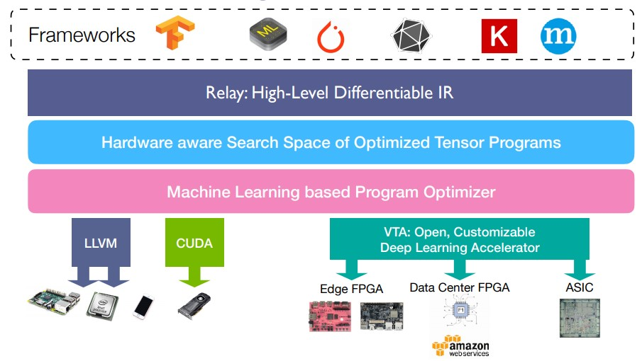
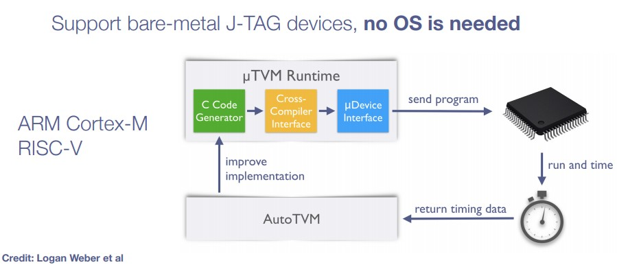
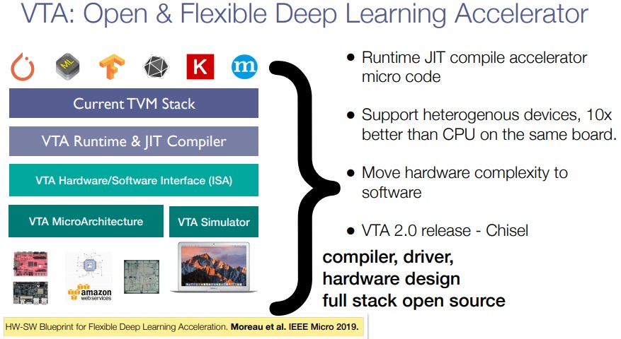
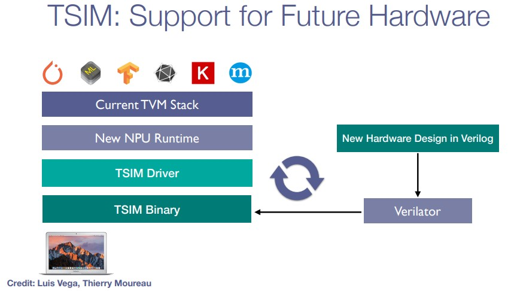
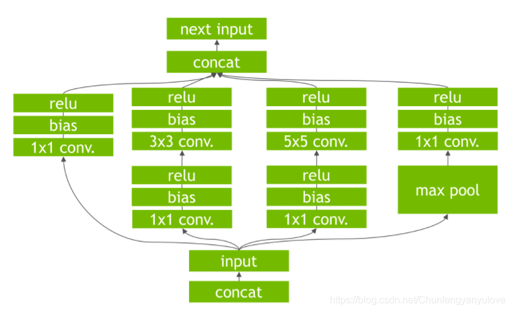
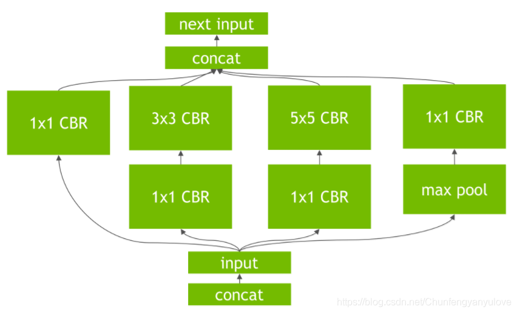
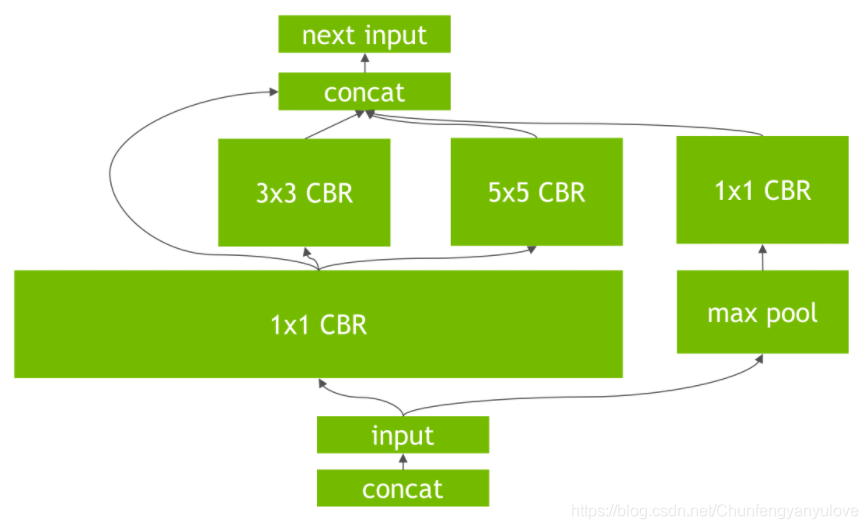

# TVM Overview

⌚️:2020年11月30日

📚参考

-  [原文](https://chhzh123.github.io/blogs/2020-03-26-tvm-overview/)

- [CSDN](https://blog.csdn.net/sinat_31425585/article/details/89395680) [需要修改，这个是第一代TVM]


---

> - 深度学习编译器学习笔记和实践体会 https://zhuanlan.zhihu.com/c_1169609848697663488
> - 蓝色的味道 https://zhuanlan.zhihu.com/frozengene
> - TVM官方专栏 https://zhuanlan.zhihu.com/tvmai

# 1. 初识 TVM

时隔一年再回来看TVM，诸多感受。

在这一年我做其他方面工作的时间里，某种意义上已经错失了做深度学习编译器的良机。TVM的坑早早挖出来，第一批研究的学者已经在自动调度[FlexTensor ASPLOS’20]、CPU推断[NeoCPU ATC’19]、异构计算平台[HeteroCL FPGA’19]等方面做出了一定的成果，所以现在入坑似乎已经有点晚了。但看看TVM这一年的飞速发展，现在v0.7版本将要发布，Relay IR的提出、VTA编译的更多支持、异构图划分，各大[厂商](https://tvm.apache.org/community)（亚马逊、阿里巴巴、华为、Intel等）及高校（UW、Cornell、UCB、UCLA等）的支持，Apache基金会的加持，[Github项目](https://github.com/apache/incubator-tvm/)的持续更新，开源社区的不断壮大，两次[TVM Conference](https://tvmconf.org/)的举办，都意味着TVM这个平台的愈发成熟，而不是一个demo project轻易就会消亡。因此，从这个角度上来说，在项目发展中期入坑依然可以探索出很多工作，而且文档逐步完善也避免了走大量弯路。未来TVM很有可能成为深度学习时代一个不可获取的工具，不管是将其作为一个工具使用，或是将其作为研究对象都是不错的选择。


第一代的TVM以NNVM作为前端编译器，将不同框架编写的模型以统一的格式映射到NNVM的计算图上，然后再对计算图进行优化进入到TVM，最后经由TVM输出后端代码，整体流程如下图所示。


而第二代的NNVM则是将Relay IR作为前端，提供了更为简洁的文本形式，强类型系统，增添了对控制流的支持，同时支持自动微分(automatic differentiation, AD)及异构编译（需要手动划分）。




总体编译流程可见[TVM-代码生成流程](https://chhzh123.github.io/blogs/2020-03-26-tvm-flow/)。简而言之分为以下几个步骤：

1. Relay将不同框架读入的模型转换为Relay IR
2. **计算图层面**(graph-level)的优化（比如整个神经网络）
3. 生成优化后的计算图送入TVM
4. **算子层面**(operator-level)的优化（比如一个卷积算子）
5. 对每一算子lower，生成后端代码

传统的深度学习框架如PyTorch和TensorFlow往往只在计算图层面进行优化，很难做到适配不同硬件的优化（计算图结点并没有告知该算子如何实施）。而TVM则是更深入到算子层面，因此优化粒度更细，可以针对不同硬件特性来做优化（比如说在CPU上用AVX做并行），这也是TVM这种深度学习**编译器**能够胜过之前深度学习**框架**的原因。

另一方面，在算子层面TVM还引入了AutoTVM进行自动调参，虽然还没达到AutoSchedule的级别，但是已经能够很好地针对不同硬件进行schedule的**参数**调整了。这也相当于TVM将ML和system双向打通，既是system for ML，也用到了ML for system来做优化，两者相辅相成，最终才能达到这么好的效果。

再看一下天奇在第二届TVM Conf的报告[*TVM: Where are we going*](https://tvmconf.org/slides/2019/tvmconf-keynote-dec19.pdf)，就会发现TVM的全栈真的不是开玩笑的，应该整个UW CS系都投入其中了，现在他们着手在以下几个点：

- Relay虚拟机：用来处理动态计算图（如有递归和循环的图结构）
- μTVM：在边缘端无需OS的运行时系统，自动与AutoTVM进行交互



- VTA：第二代已经用Chisel进行实现



- TSIM：自研硬件模拟器



- 大一统运行时：不同设备的runtime都可以用Python直接call，所以所有工作都可以在直接TVM内完成（似乎现在已经实现了大半）
- 大一统的IR：类似谷歌[MLIR](https://mlir.llvm.org/)的工作，弥合高层和低层的IR表示，也即现在的Relay IR和底层TVM用的Tensor Expression
- 全栈自动化：现在AutoTVM只是在TVM算子的实现部分对schedule的参数进行搜索，希望做到对IR本身或者Schedule本身也进行自动化搜索
- 其他：量化、低精度、训练支持、自动微分等

所以事实上TVM给了很多科研人员大量的研究空间，为深度学习系统架构的研究铺平了道路。最关键是它的所有代码都是开源的，因此从源代码入手也可以着手很多底层的工作。

## Related Posts

- [深度学习高层次综合(HLS)系统 ](https://chhzh123.github.io/blogs/2020-10-15-dnn-hls/)15 Oct 2020

- [Binary Neural Network (BNN) ](https://chhzh123.github.io/blogs/2020-05-01-bnn/)01 May 2020

- [TVM - Relay IR Pass ](https://chhzh123.github.io/blogs/2020-04-02-relay-ir-pass/)02 Apr 2020


## 2. TVM 安装

不同环境的安装方法可以参考tvm的官网：https://docs.tvm.ai/install/index.html

对于安装环境，我还是强烈推荐docker的,会少很多坑。


## 3. TVM 使用

TVM的使用可以阅读一下tvm提供的tutorials：https://docs.tvm.ai/tutorials/

主要推荐两部分：

- compile deep learning models
- auto tuning

其实简单的使用主要就是这两块内容，如果不想细研究其代码，可以将其当成一个工具使用，通过compile deep learning models,无论你使用什么样的框架，都可以生成统一的模型，一般会生成3个东西如下：


这里一般会做一些层的融合等操作，速度会有一定的提升的，但是不是特别大。这时如果你需要进一步提速可以试试**auto tuning**,这部分可以参考tutorials以及下面的例子代码，auto-tune的时间一般比较长，但是效果还是比较显著的，本地测试，resnet在nvidia 1080ti上可以提高3倍左右。

#### Demo代码

TVM的原理很复杂但是使用起来还是比较方便的，下面是使用MXNet进行TVM转换的demo。

**代码一：生成TVM模型。**

```python
import tvm
from tvm import relay
from tvm.relay import testing
from tvm.contrib import graph_runtime
import mxnet as mx
from tvm.contrib.download import download_testdata
import numpy as np
import time

## load mxnet model
prefix = '/Models/resnetv1d-101'
epoch = 13
mx_sym, arg_params, aux_params = mx.model.load_checkpoint(prefix, epoch)
shape_dict = {'data': (1, 3, 224, 224)}

relay_func, relay_params = relay.frontend.from_mxnet(mx_sym, shape_dict,
        arg_params=arg_params, aux_params=aux_params)


target = 'cuda'
with relay.build_config(opt_level=3):
    graph, lib, params = relay.build(relay_func, target, params=relay_params)
# run forward


from PIL import Image
image = Image.open('test.jpg').resize((224, 224))
def transform_image(im):
    im = np.array(im).astype(np.float32)
    im = np.transpose(im, [2, 0, 1])
    im = im[np.newaxis, :]
    return im
x = transform_image(image)
# let's go
ctx = tvm.gpu(0)
dtype = 'float32'

m = graph_runtime.create(graph, lib, ctx)
## set input data
m.set_input('data', tvm.nd.array(x.astype(dtype)))
## set input params
m.set_input(**params)
t1 = time.time()
m.run()
t2 = time.time()
# get output
outputs = m.get_output(0)
top1 = np.argmax(outputs.asnumpy()[0])
print(outputs, str(t2-t1))

### evaluate inference time

ftimer = m.module.time_evaluator('run', ctx, number=1, repeat=100)
prof_res = np.array(ftimer().results) * 1000
print('time cost : mean:{}'.format(np.mean(prof_res)))


# save model

path_lib = '/Outputs/tvm/deploy_resnet101_v1d_lib.tar'
lib.export_library(path_lib)

with open('/Outputs/tvm/deploy_resnet101_v1d_graph.json', 'w') as f:
    f.write(graph)
with open('/Outputs/tvm/deploy_params', 'wb') as f:
    f.write(relay.save_param_dict(params))
    
    
# load model back

loaded_json = open('/Outputs/tvm/deploy_resnet101_v1d_graph.json').read()
loaded_lib = tvm.module.load(path_lib)
loaded_params = bytearray(open('/Outputs/tvm/deploy_params', 'rb').read())
module = graph_runtime.create(loaded_json, loaded_lib, ctx)
module.load_params(loaded_params)

tvm_data = tvm.nd.array(x.astype(dtype))
module.run(data=tvm_data)
outputs = module.get_output(0)
print(outputs)

```

**代码二：auto-tuning**

这部分耗时较长，一个resnet101模型，在1080ti上面可能要tune1到2天的时间。

```python
import os

import numpy as np
import mxnet as mx
import tvm
from tvm import autotvm
from tvm import relay
import tvm.relay.testing
from tvm.autotvm.tuner import XGBTuner, GATuner, RandomTuner, GridSearchTuner
from tvm.contrib.util import tempdir
import tvm.contrib.graph_runtime as runtime
import argparse

def get_network(dtype, args):
    """Get the symbol definition and random weight of a network"""
    input_shape = (args.batch_size, 3, 224, 224)

    # if "resnet" in name:
    #     n_layer = int(name.split('-')[1])
    #     mod, params = relay.testing.resnet.get_workload(num_layers=n_layer, batch_size=batch_size, dtype=dtype)
    # elif "vgg" in name:
    #     n_layer = int(name.split('-')[1])
    #     mod, params = relay.testing.vgg.get_workload(num_layers=n_layer, batch_size=batch_size, dtype=dtype)
    # elif name == 'mobilenet':
    #     mod, params = relay.testing.mobilenet.get_workload(batch_size=batch_size, dtype=dtype)
    # elif name == 'squeezenet_v1.1':
    #     mod, params = relay.testing.squeezenet.get_workload(batch_size=batch_size, version='1.1', dtype=dtype)
    # elif name == 'inception_v3':
    #     input_shape = (1, 3, 299, 299)
    #     mod, params = relay.testing.inception_v3.get_workload(batch_size=batch_size, dtype=dtype)
    # elif name == 'mxnet':
        # an example for mxnet model
        # from mxnet.gluon.model_zoo.vision import get_model
        # block = get_model('resnet18_v1', pretrained=True)
    # else:
    #     raise ValueError("Unsupported network: " + name)

    prefix = '/Models/{}/{}'.format(args.version, args.model_name)
    epoch = args.model_index
    mx_sym, arg_params, aux_params = mx.model.load_checkpoint(prefix, epoch)

    mod, params = relay.frontend.from_mxnet(mx_sym, shape={'data': input_shape}, dtype=dtype, arg_params=arg_params,
                                            aux_params=aux_params)
    net = mod["main"]
    net = relay.Function(net.params, relay.nn.softmax(net.body), None, net.type_params, net.attrs)
    mod = relay.Module.from_expr(net)
    return mod, params, input_shape


# You can skip the implementation of this function for this tutorial.
def tune_tasks(tasks,
               measure_option,
               tuner='xgb',
               n_trial=1000,
               early_stopping=None,
               log_filename='tuning.log',
               use_transfer_learning=True,
               try_winograd=True):
    if try_winograd:
        for i in range(len(tasks)):
            try:  # try winograd template
                tsk = autotvm.task.create(tasks[i].name, tasks[i].args,
                                          tasks[i].target, tasks[i].target_host, 'winograd')
                input_channel = tsk.workload[1][1]
                if input_channel >= 64:
                    tasks[i] = tsk
            except Exception:
                pass

    # create tmp log file
    tmp_log_file = log_filename + ".tmp"
    if os.path.exists(tmp_log_file):
        os.remove(tmp_log_file)

    for i, tsk in enumerate(reversed(tasks)):
        prefix = "[Task %2d/%2d] " %(i+1, len(tasks))

        # create tuner
        if tuner == 'xgb' or tuner == 'xgb-rank':
            tuner_obj = XGBTuner(tsk, loss_type='rank')
        elif tuner == 'ga':
            tuner_obj = GATuner(tsk, pop_size=100)
        elif tuner == 'random':
            tuner_obj = RandomTuner(tsk)
        elif tuner == 'gridsearch':
            tuner_obj = GridSearchTuner(tsk)
        else:
            raise ValueError("Invalid tuner: " + tuner)

        if use_transfer_learning:
            if os.path.isfile(tmp_log_file):
                tuner_obj.load_history(autotvm.record.load_from_file(tmp_log_file))

        # do tuning
        n_trial = min(n_trial, len(tsk.config_space))
        tuner_obj.tune(n_trial=n_trial,
                       early_stopping=early_stopping,
                       measure_option=measure_option,
                       callbacks=[
                           autotvm.callback.progress_bar(n_trial, prefix=prefix),
                           autotvm.callback.log_to_file(tmp_log_file)])

    # pick best records to a cache file
    autotvm.record.pick_best(tmp_log_file, log_filename)
    os.remove(tmp_log_file)


def tune_and_evaluate(tuning_opt, target, log_file, dtype, args):
    # extract workloads from relay program
    print("Extract tasks...")
    mod, params, input_shape = get_network(dtype, args)
    tasks = autotvm.task.extract_from_program(mod["main"], target=target,
                                              params=params, ops=(relay.op.nn.conv2d,))

    # run tuning tasks
    print("Tuning...")
    tune_tasks(tasks, **tuning_opt)

    # compile kernels with history best records
    with autotvm.apply_history_best(log_file):
        print("Compile...")
        with relay.build_config(opt_level=3):
            graph, lib, params = relay.build_module.build(
                mod, target=target, params=params)

        # export library
        tmp = tempdir()
        filename = "/Outputs/tvm_autotuning/{}/{}_auto_tune_deploy_batch_{}_lib.tar".format(args.version,args.model_name, args.batch_size)
        lib.export_library(tmp.relpath(filename))

        with open('/Outputs/tvm_autotuning/{}/{}_auto_tune_deploy_batch_{}_graph.json'.format(args.version,args.model_name,args.batch_size) , 'w') as f:
            f.write(graph)
        with open('/Outputs/tvm_autotuning/{}/{}_auto_tune_deploy_batch_{}_params.params'.format(args.version,args.model_name,args.batch_size) , 'wb') as f:
            f.write(relay.save_param_dict(params))

        # load parameters
        ctx = tvm.context(str(target), 0)
        module = runtime.create(graph, lib, ctx)
        data_tvm = tvm.nd.array((np.random.uniform(size=input_shape)).astype(dtype))
        module.set_input('data', data_tvm)
        module.set_input(**params)

        # evaluate
        print("Evaluate inference time cost...")
        ftimer = module.module.time_evaluator("run", ctx, number=1, repeat=600)
        prof_res = np.array(ftimer().results) * 1000  # convert to millisecond
        print("Mean inference time (std dev): %.2f ms (%.2f ms)" %
              (np.mean(prof_res), np.std(prof_res)))

# We do not run the tuning in our webpage server since it takes too long.
# Uncomment the following line to run it by yourself.

if __name__ == '__main__':
    parser = argparse.ArgumentParser(description='score a model on a dataset')
    parser.add_argument('--version', type=str, default='porno')
    parser.add_argument('--model-name', type=str, default='resnetv1d-101-320x320')
    parser.add_argument('--model-index', type=int, default=16)
    parser.add_argument('--batch-size', type=int, default=1)
    parser.add_argument('--tag', type=str, default='')

    args = parser.parse_args()

    if not os.path.exists(os.path.join('/Outputs/tvm_autotuning/{}'.format(args.version))):
        os.mkdir(os.path.join('/Outputs/tvm_autotuning/{}'.format(args.version)))

    #### DEVICE CONFIG ####
    target = tvm.target.cuda()

    #### TUNING OPTION ####
    log_file = '/Outputs/tvm_autotuning/{}/{}_batch_{}.log'.format(args.version, args.model_name, args.batch_size)
    dtype = 'float32'

    tuning_option = {
        'log_filename': log_file,

        'tuner': 'xgb',
        'n_trial': 2000,
        'early_stopping': 600,

        'measure_option': autotvm.measure_option(
            builder=autotvm.LocalBuilder(timeout=10),
            runner=autotvm.LocalRunner(number=20, repeat=3, timeout=4, min_repeat_ms=150),
            # runner=autotvm.RPCRunner(
            #     '1080ti',  # change the device key to your key
            #     '0.0.0.0', 9190,
            #     number=20, repeat=3, timeout=4, min_repeat_ms=150)
        ),
    }


tune_and_evaluate(tuning_option, target, log_file, dtype, args)

```

#### TensorRT

这里简单介绍一下TensorRT,也是模型加速的利器，并且tvm和tensorRT做的对与模型图的优化都差不多，可以参考。

TensorRT是Nvidia出品的用于将不同框架训练的模型部署到GPU的加速引擎，可以自动将不同框架的模型转换为TensorRT模型，并进行模型加速。

TensorRT进行模型加速主要有两点：

- TensorRT支持int8以及FP16计算
- TensorRT对网络进行重构以及优化:

> 去掉网络中的无用层

> 网络结构的垂直整合

> 网络结构的水平融合



原始网络




纵向融合




横向融合

#### 参考资料

[TVM官网： https://tvm.ai/](https://tvm.ai/)

[TVM论文：arxiv: https://arxiv.org/abs/1802.04799](https://arxiv.org/abs/1802.04799)

[tensorRT加速参考文献：https://blog.csdn.net/xh_hit/article/details/79769599](https://blog.csdn.net/xh_hit/article/details/79769599)

[Nvidia参考文献：https://devblogs.nvidia.com/production-deep-learning-nvidia-gpu-inference-engine/](https://devblogs.nvidia.com/production-deep-learning-nvidia-gpu-inference-engine/)

