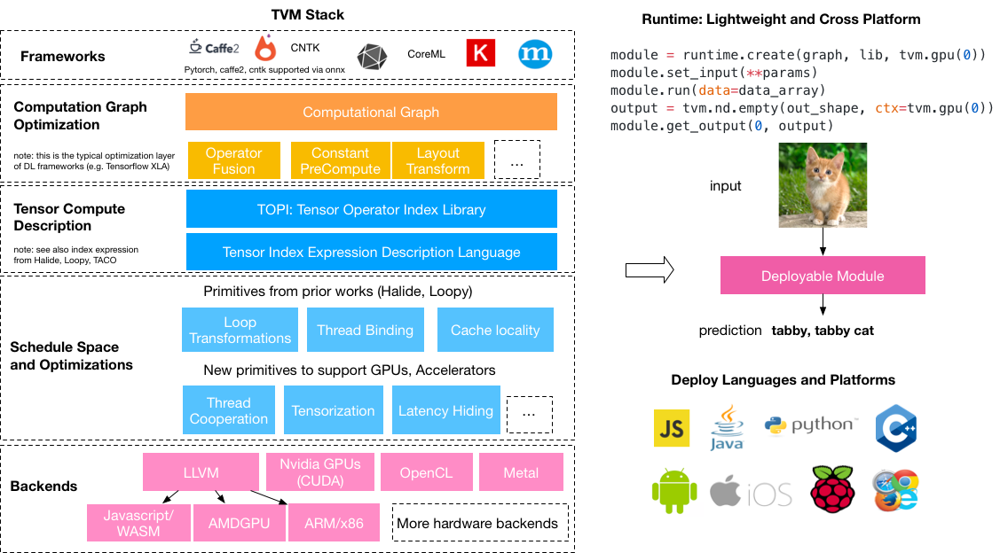
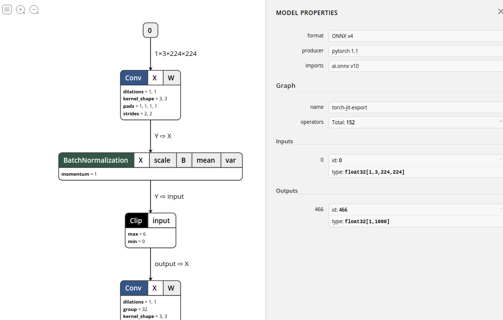
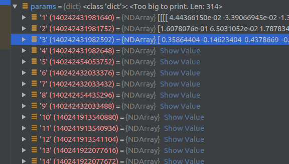
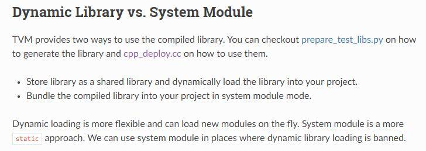

# Pytorch2ONNX2TVM

⌚️:2020年11月30日

📚参考

- [参考-1](https://oldpan.me/archives/the-first-step-towards-tvm-1) ｜ [参考-2](https://oldpan.me/archives/the-first-step-towards-tvm-2)|[参考-3](http://whitelok.github.io/2019/06/25/tvm-tutorials-lesson-1/) ｜ [参考-4](https://xmfbit.github.io/2019/06/29/tvm-helloworld/)
- https://github.com/szad670401/tvm_mobilefacenet
- https://github.com/liueo/TVM-deploy  *****
- https://github.com/markson14/Face-Recognition-Cpp
- https://github.com/whitelok/tvm-lesson *****

---

| 时间(4000次) | pytorch | TVM(python) | TVM(c++/cpu) | TVM(c++/gpu) | TVM(c++/rasp) |
| ------------ | ------- | ----------- | ------------ | ------------ | ------------- |
| 单位s/ms     | 1m23s   | 35s         | 35ms         | TODO         | 2ms(10次)     |


## 1. 前言

这是一个TVM教程系列，讲解从**pytorch模型** 到 **ONNX模型** 到**TVM部署**的使用说明。


那啥是TVM？

简单来说，TVM可以称为许多工具集的集合，其中这些工具可以组合起来使用，来实现我们的一些神经网络的加速和部署功能。这也是为什么叫做**TVM Stack**了。TVM的使用途径很广，几乎可以支持市面上大部分的神经网络权重框架(ONNX、TF、Caffe2等)，也几乎可以部署在任何的平台，例如Windows、Linux、Mac、ARM等等。

以下面一张图来形容一下：




乍看这么多感觉非常地复杂，但我们只需要知道TVM的核心功能就可以：**TVM可以优化的训练好的模型，并将你的模型打包好，然后你可以将这个优化好的模型放在任何平台去运行**，可以说是与落地应用息息相关。

TVM包含的东西和知识概念都有很多，不仅有神经网络优化量化op融合等一系列步骤，还有其他更多细节技术的支持(Halide、LLVM)，从而使TVM拥有很强大的功能…好了废话不说了，再说就憋不出来了，如果想多了解TVM的可以在知乎上直接搜索TVM关键字，那些大佬有很多关于TVM的介绍文章，大家可以去看看。

其实做模型优化这一步骤的库已经出现很多了，不论是Nvidia自家的TensorRT还是Pytorch自家的`torch.jit`模块，都在做一些模型优化的工作，这里就不多说了，感兴趣的可以看看以下文章：

[利用Pytorch的C++前端(libtorch)读取预训练权重并进行预测](https://oldpan.me/archives/pytorch-c-libtorch-inference)

[利用TensorRT实现神经网络提速(读取ONNX模型并运行)](https://oldpan.me/archives/tensorrt-code-toturial-1)

[利用TensorRT对深度学习进行加速](https://oldpan.me/archives/use-tensorrt-speed-up-deep-learning-1)

## 2. 环境准备

| 软件包              | 版本          |
| ------------------- | ------------- |
| 系统                | ubuntu 18.04  |
| GPU Driver          | 440.64        |
| CUDA&cuDNN          | 10.2 & 7.6    |
| Python              | 3.6.9         |
| cmake               | 3.14.4        |
| opencv              | 4.4.0         |
| tvm                 | 0.8           |
| pytorch&torchvision | 1.7.0 & 0.8.1 |
| onnx                | 1.7.0         |

```
root@567059b7080d:~/deploy_cpp/build# pip list  
Package                Version
---------------------- ---------------
antlr4-python3-runtime 4.9
argon2-cffi            20.1.0
asn1crypto             0.24.0
async-generator        1.10
attrs                  20.3.0
autocfg                0.0.6
autogluon.core         0.0.16b20201210
autograd               1.3
backcall               0.2.0
bcrypt                 3.2.0
bleach                 3.2.1
boto3                  1.16.34
botocore               1.19.34
certifi                2020.11.8
cffi                   1.14.4
chardet                3.0.4
click                  7.1.2
cloudpickle            1.6.0
ConfigSpace            0.4.16
contextvars            2.4
cryptography           3.3.1
cycler                 0.10.0
Cython                 0.29.21
dask                   2020.12.0
dataclasses            0.8
decorator              4.4.2
decord                 0.4.2
defusedxml             0.6.0
dgl                    0.5.3
dill                   0.3.3
distributed            2020.12.0
entrypoints            0.3
future                 0.18.2
gluoncv                0.9.0
graphviz               0.8.4
HeapDict               1.0.1
idna                   2.6
immutables             0.14
importlib-metadata     3.1.0
iniconfig              1.1.1
ipykernel              5.3.4
ipython                7.16.1
ipython-genutils       0.2.0
jedi                   0.17.2
Jinja2                 2.11.2
jmespath               0.10.0
joblib                 0.17.0
json5                  0.9.5
jsonschema             3.2.0
jupyter-client         6.1.7
jupyter-core           4.7.0
jupyterlab             2.2.9
jupyterlab-pygments    0.1.2
jupyterlab-server      1.2.0
keyring                10.6.0
keyrings.alt           3.0
kiwisolver             1.3.1
MarkupSafe             1.1.1
matplotlib             3.3.3
mistune                0.8.4
mlxtend                0.18.0
msgpack                1.0.0
mxnet                  1.6.0
mypy                   0.790
mypy-extensions        0.4.3
nbclient               0.5.1
nbconvert              6.0.7
nbformat               5.0.8
nest-asyncio           1.4.3
networkx               2.5
notebook               6.1.5
numpy                  1.19.4
onnx                   1.7.0
opencv-python          4.4.0.46
orderedset             2.0.3
packaging              20.4
pandas                 1.1.5
pandocfilters          1.4.3
paramiko               2.7.2
parso                  0.7.1
pexpect                4.8.0
pickleshare            0.7.5
Pillow                 8.0.1
pip                    20.3.1
pluggy                 0.13.1
portalocker            2.0.0
prometheus-client      0.9.0
prompt-toolkit         3.0.8
protobuf               3.14.0
psutil                 5.7.3
ptyprocess             0.6.0
py                     1.9.0
pyaml                  20.4.0
pycparser              2.20
pycrypto               2.6.1
Pygments               2.7.2
pygobject              3.26.1
PyNaCl                 1.4.0
pyparsing              2.4.7
pyrsistent             0.17.3
pytest                 6.1.2
python-apt             1.6.5+ubuntu0.4
python-dateutil        2.8.1
pytz                   2020.4
pyxdg                  0.25
PyYAML                 5.3.1
pyzmq                  20.0.0
requests               2.25.0
s3transfer             0.3.3
scikit-learn           0.23.2
scikit-optimize        0.8.1
scipy                  1.4.1
SecretStorage          2.3.1
Send2Trash             1.5.0
setuptools             39.0.1
six                    1.11.0
sklearn                0.0
sortedcontainers       2.3.0
tblib                  1.7.0
tensorboardX           2.1
terminado              0.9.1
testpath               0.4.4
threadpoolctl          2.1.0
toml                   0.10.2
toolz                  0.11.1
torch                  1.7.0
torchvision            0.8.1
tornado                6.1
tqdm                   4.54.1
traitlets              4.3.3
typed-ast              1.4.1
typing-extensions      3.7.4.3
unattended-upgrades    0.1
urllib3                1.26.2
wcwidth                0.2.5
webencodings           0.5.1
wheel                  0.30.0
xgboost                0.7.post4
yacs                   0.1.8
zict                   2.0.0
zipp                   3.4.0
WARNING: You are using pip version 20.3.1; however, version 20.3.3 is available.
You should consider upgrading via the '/usr/bin/python3 -m pip install --upgrade pip' command.

```


## 3 利用Pytorch导出Onnx模型

### 3.1 导出模型

首先我们要做的是，得到一个已经训练好的模型，这里我选择这个[github](https://github.com/FelixFu520/pytorch2onnx2tvm)仓库中的**mobilenet-v2**，model代码和在ImageNet上训练好的权重都已经提供。好，我们将github中的模型代码移植到本地，然后调用并加载已经训练好的权重：

```python
import torch
import time
from MobileNetV2 import mobilenet_v2


model = mobilenet_v2(pretrained=True)
example = torch.rand(1, 3, 224, 224)   

with torch.no_grad():
    model.eval()
    since = time.time()
    for i in range(4000):
        model(example)
    time_elapsed = time.time() - since
    print('Time elapsed is {:.0f}m {:.0f}s'.
          format(time_elapsed // 60, time_elapsed % 60))
```

这里我们加载训练好的模型权重，并设定了输入，在python端连续运行了4000次，这里我们所花的时间为：1m 24s。

然后我们将Pytorch模型导出为ONNX模型：

```python
import torch
from MobileNetV2 import mobilenet_v2


model = mobilenet_v2(pretrained=True)
example = torch.rand(1, 3, 224, 224)   

torch_out = torch.onnx.export(model,
                              example,
                              "mobilenetv2.onnx",
                              verbose=True,
                              export_params=True   # 带参数输出
                              )
```

这样我们就得到了`mobilenetv2.onnx`这个onnx格式的模型权重。注意这里我们要带参数输出，因为我们之后要直接读取ONNX模型进行预测。

导出来之后，建议使用[Netron](https://github.com/lutzroeder/netron)来查看我们模型的结构，可以看到这个模型由Pytorch导出，共有152个op，以及输入id和输入格式等等信息，我们可以拖动鼠标查看到更详细的信息:



好了，至此我们的**mobilenet-v2**模型已经顺利导出了。

### 3.2 利用TVM读取并预测ONNX模型

在我们成功编译并且可以在Python端正常引用TVM后，我们首先导入我们的onnx格式的模型。这里我们准备了一张飞机的图像：


这个图像在ImageNet分类中属于`404: 'airliner'`，也就是航空客机。

下面我们将利用TVM部署onnx模型并对这张图像进行预测。

```python
import onnx
import time
import tvm
import numpy as np
import tvm.relay as relay
from PIL import Image

onnx_model = onnx.load('mobilenetv2.onnx')  # 导入模型

mean = [123., 117., 104.]                   # 在ImageNet上训练数据集的mean和std
std = [58.395, 57.12, 57.375]


def transform_image(image):                # 定义转化函数，将PIL格式的图像转化为格式维度的numpy格式数组
    image = image - np.array(mean)
    image /= np.array(std)
    image = np.array(image).transpose((2, 0, 1))
    image = image[np.newaxis, :].astype('float32')
    return image

img = Image.open('./plane.jpg').resize((224, 224)) # 这里我们将图像resize为特定大小
x = transform_image(img)
```

这样我们得到的`x`为`[1,3,224,224]`维度的`ndarray`。这个符合NCHW格式标准，也是我们通用的张量格式。

接下来我们设置目标端口`llvm`，也就是部署到CPU端，而这里我们使用的是TVM中的[Relay IR](https://docs.tvm.ai/dev/relay_intro.html)，这个IR简单来说就是可以读取我们的模型并按照模型的顺序搭建出一个可以执行的计算图出来，当然，我们可以对这个计算图进行一系列优化。(现在TVM主推Relay而不是NNVM，Relay可以称为二代NNVM)。

```python
target = 'llvm'

input_name = '0'  # 注意这里为之前导出onnx模型中的模型的输入id，这里为0
shape_dict = {input_name: x.shape}
# 利用Relay中的onnx前端读取我们导出的onnx模型
sym, params = relay.frontend.from_onnx(onnx_model, shape_dict)
```

上述代码中导出的`sym`和`params`是我们接下来要使用的核心的东西，其中params就是导出模型中的权重信息，在python中用dic表示：




而`sym`就是表示计算图结构的功能函数，这个函数中包含了计算图的流动过程，以及一些计算中需要的各种参数信息，Relay IR之后对网络进行优化就是主要对这个`sym`进行优化的过程：

```c
fn (%v0: Tensor[(1, 3, 224, 224), float32],
    %v1: Tensor[(32, 3, 3, 3), float32],
    %v2: Tensor[(32,), float32],
    %v3: Tensor[(32,), float32],
    %v4: Tensor[(32,), float32],
    %v5: Tensor[(32,), float32],
    ...
    %v307: Tensor[(1280, 320, 1, 1), float32],
    %v308: Tensor[(1280,), float32],
    %v309: Tensor[(1280,), float32],
    %v310: Tensor[(1280,), float32],
    %v311: Tensor[(1280,), float32],
    %v313: Tensor[(1000, 1280), float32],
    %v314: Tensor[(1000,), float32]) {
  %0 = nn.conv2d(%v0, %v1, strides=[2, 2], padding=[1, 1], kernel_size=[3, 3])
  %1 = nn.batch_norm(%0, %v2, %v3, %v4, %v5, epsilon=1e-05)
  %2 = %1.0
  %3 = clip(%2, a_min=0, a_max=6)
  %4 = nn.conv2d(%3, %v7, padding=[1, 1], groups=32, kernel_size=[3, 3])
  ...
  %200 = clip(%199, a_min=0, a_max=6)
  %201 = mean(%200, axis=[3])
  %202 = mean(%201, axis=[2])
  %203 = nn.batch_flatten(%202)
  %204 = multiply(1f, %203)
  %205 = nn.dense(%204, %v313, units=1000)
  %206 = multiply(1f, %v314)
  %207 = nn.bias_add(%205, %206)
  %207
}
```

好了，接下来我们需要对这个计算图模型进行优化，这里我们选择优化的等级为3：

```python
with relay.build_config(opt_level=3):
    intrp = relay.build_module.create_executor('graph', sym, tvm.cpu(0), target)

dtype = 'float32'
func = intrp.evaluate(sym)
```

最后我们得到可以直接运行的`func`。

其中优化的等级分这几种：

```python
OPT_PASS_LEVEL = {
    "SimplifyInference": 0,
    "OpFusion": 1,
    "FoldConstant": 2,
    "CombineParallelConv2D": 3,
    "FoldScaleAxis": 3,
    "AlterOpLayout": 3,
    "CanonicalizeOps": 3,
}
```

最后，我们将之前已经转化格式后的图像`x`数组和模型的参数输入到这个`func`中，并且返回这个输出数组中的最大值

```python
output = func(tvm.nd.array(x.astype(dtype)), **params).asnumpy()
print(output.argmax())
```

这里我们得到的输出为`404`，与前文描述图像在ImageNet中的分类标记一致，说明我们的TVM正确读取onnx模型并将其应用于预测阶段。

我们另外单独测试一下模型优化后运行的速度和之前直接利用pytorch运行速度之间比较一下，可以发现最后的运行时间为：3m20s，相较之前的6m2s快了将近一倍。

```python
since = time.time()
for i in range(10000):
    output = func(tvm.nd.array(x.astype(dtype)), **params).asnumpy()
time_elapsed = time.time() - since
print('Time elapsed is {:.0f}m {:.0f}s'.
      format(time_elapsed // 60, time_elapsed % 60))  # 打印出来时间
```

当然，这个比较并不是很规范，不过我们可以大概分析出TVM的一些可用之处了。

整体日志

```
root@0e8554287189:~/pytorch2onnx2tvm# python pytorch2onnx2tvm.py 
Time elapsed is 3m 28s
graph(%input.1 : Float(1:150528, 3:50176, 224:224, 224:1, requires_grad=0, device=cpu),
      %classifier.weight : Float(1000:1280, 1280:1, requires_grad=1, device=cpu),
      %classifier.bias : Float(1000:1, requires_grad=1, device=cpu),
      %468 : Float(32:27, 3:9, 3:3, 3:1, requires_grad=0, device=cpu),
      %469 : Float(32:1, requires_grad=0, device=cpu),
      %471 : Float(32:9, 1:9, 3:3, 3:1, requires_grad=0, device=cpu),
      %472 : Float(32:1, requires_grad=0, device=cpu),
      %474 : Float(16:32, 32:1, 1:1, 1:1, requires_grad=0, device=cpu),
      %475 : Float(16:1, requires_grad=0, device=cpu),
      %477 : Float(96:16, 16:1, 1:1, 1:1, requires_grad=0, device=cpu),
      %478 : Float(96:1, requires_grad=0, device=cpu),
      %480 : Float(96:9, 1:9, 3:3, 3:1, requires_grad=0, device=cpu),
      %481 : Float(96:1, requires_grad=0, device=cpu),
      %483 : Float(24:96, 96:1, 1:1, 1:1, requires_grad=0, device=cpu),
      %484 : Float(24:1, requires_grad=0, device=cpu),
      %486 : Float(144:24, 24:1, 1:1, 1:1, requires_grad=0, device=cpu),
      %487 : Float(144:1, requires_grad=0, device=cpu),
      %489 : Float(144:9, 1:9, 3:3, 3:1, requires_grad=0, device=cpu),
      %490 : Float(144:1, requires_grad=0, device=cpu),
      %492 : Float(24:144, 144:1, 1:1, 1:1, requires_grad=0, device=cpu),
      %493 : Float(24:1, requires_grad=0, device=cpu),
      %495 : Float(144:24, 24:1, 1:1, 1:1, requires_grad=0, device=cpu),
      %496 : Float(144:1, requires_grad=0, device=cpu),
      %498 : Float(144:9, 1:9, 3:3, 3:1, requires_grad=0, device=cpu),
      %499 : Float(144:1, requires_grad=0, device=cpu),
      %501 : Float(32:144, 144:1, 1:1, 1:1, requires_grad=0, device=cpu),
      %502 : Float(32:1, requires_grad=0, device=cpu),
      %504 : Float(192:32, 32:1, 1:1, 1:1, requires_grad=0, device=cpu),
      %505 : Float(192:1, requires_grad=0, device=cpu),
      %507 : Float(192:9, 1:9, 3:3, 3:1, requires_grad=0, device=cpu),
      %508 : Float(192:1, requires_grad=0, device=cpu),
      %510 : Float(32:192, 192:1, 1:1, 1:1, requires_grad=0, device=cpu),
      %511 : Float(32:1, requires_grad=0, device=cpu),
      %513 : Float(192:32, 32:1, 1:1, 1:1, requires_grad=0, device=cpu),
      %514 : Float(192:1, requires_grad=0, device=cpu),
      %516 : Float(192:9, 1:9, 3:3, 3:1, requires_grad=0, device=cpu),
      %517 : Float(192:1, requires_grad=0, device=cpu),
      %519 : Float(32:192, 192:1, 1:1, 1:1, requires_grad=0, device=cpu),
      %520 : Float(32:1, requires_grad=0, device=cpu),
      %522 : Float(192:32, 32:1, 1:1, 1:1, requires_grad=0, device=cpu),
      %523 : Float(192:1, requires_grad=0, device=cpu),
      %525 : Float(192:9, 1:9, 3:3, 3:1, requires_grad=0, device=cpu),
      %526 : Float(192:1, requires_grad=0, device=cpu),
      %528 : Float(64:192, 192:1, 1:1, 1:1, requires_grad=0, device=cpu),
      %529 : Float(64:1, requires_grad=0, device=cpu),
      %531 : Float(384:64, 64:1, 1:1, 1:1, requires_grad=0, device=cpu),
      %532 : Float(384:1, requires_grad=0, device=cpu),
      %534 : Float(384:9, 1:9, 3:3, 3:1, requires_grad=0, device=cpu),
      %535 : Float(384:1, requires_grad=0, device=cpu),
      %537 : Float(64:384, 384:1, 1:1, 1:1, requires_grad=0, device=cpu),
      %538 : Float(64:1, requires_grad=0, device=cpu),
      %540 : Float(384:64, 64:1, 1:1, 1:1, requires_grad=0, device=cpu),
      %541 : Float(384:1, requires_grad=0, device=cpu),
      %543 : Float(384:9, 1:9, 3:3, 3:1, requires_grad=0, device=cpu),
      %544 : Float(384:1, requires_grad=0, device=cpu),
      %546 : Float(64:384, 384:1, 1:1, 1:1, requires_grad=0, device=cpu),
      %547 : Float(64:1, requires_grad=0, device=cpu),
      %549 : Float(384:64, 64:1, 1:1, 1:1, requires_grad=0, device=cpu),
      %550 : Float(384:1, requires_grad=0, device=cpu),
      %552 : Float(384:9, 1:9, 3:3, 3:1, requires_grad=0, device=cpu),
      %553 : Float(384:1, requires_grad=0, device=cpu),
      %555 : Float(64:384, 384:1, 1:1, 1:1, requires_grad=0, device=cpu),
      %556 : Float(64:1, requires_grad=0, device=cpu),
      %558 : Float(384:64, 64:1, 1:1, 1:1, requires_grad=0, device=cpu),
      %559 : Float(384:1, requires_grad=0, device=cpu),
      %561 : Float(384:9, 1:9, 3:3, 3:1, requires_grad=0, device=cpu),
      %562 : Float(384:1, requires_grad=0, device=cpu),
      %564 : Float(96:384, 384:1, 1:1, 1:1, requires_grad=0, device=cpu),
      %565 : Float(96:1, requires_grad=0, device=cpu),
      %567 : Float(576:96, 96:1, 1:1, 1:1, requires_grad=0, device=cpu),
      %568 : Float(576:1, requires_grad=0, device=cpu),
      %570 : Float(576:9, 1:9, 3:3, 3:1, requires_grad=0, device=cpu),
      %571 : Float(576:1, requires_grad=0, device=cpu),
      %573 : Float(96:576, 576:1, 1:1, 1:1, requires_grad=0, device=cpu),
      %574 : Float(96:1, requires_grad=0, device=cpu),
      %576 : Float(576:96, 96:1, 1:1, 1:1, requires_grad=0, device=cpu),
      %577 : Float(576:1, requires_grad=0, device=cpu),
      %579 : Float(576:9, 1:9, 3:3, 3:1, requires_grad=0, device=cpu),
      %580 : Float(576:1, requires_grad=0, device=cpu),
      %582 : Float(96:576, 576:1, 1:1, 1:1, requires_grad=0, device=cpu),
      %583 : Float(96:1, requires_grad=0, device=cpu),
      %585 : Float(576:96, 96:1, 1:1, 1:1, requires_grad=0, device=cpu),
      %586 : Float(576:1, requires_grad=0, device=cpu),
      %588 : Float(576:9, 1:9, 3:3, 3:1, requires_grad=0, device=cpu),
      %589 : Float(576:1, requires_grad=0, device=cpu),
      %591 : Float(160:576, 576:1, 1:1, 1:1, requires_grad=0, device=cpu),
      %592 : Float(160:1, requires_grad=0, device=cpu),
      %594 : Float(960:160, 160:1, 1:1, 1:1, requires_grad=0, device=cpu),
      %595 : Float(960:1, requires_grad=0, device=cpu),
      %597 : Float(960:9, 1:9, 3:3, 3:1, requires_grad=0, device=cpu),
      %598 : Float(960:1, requires_grad=0, device=cpu),
      %600 : Float(160:960, 960:1, 1:1, 1:1, requires_grad=0, device=cpu),
      %601 : Float(160:1, requires_grad=0, device=cpu),
      %603 : Float(960:160, 160:1, 1:1, 1:1, requires_grad=0, device=cpu),
      %604 : Float(960:1, requires_grad=0, device=cpu),
      %606 : Float(960:9, 1:9, 3:3, 3:1, requires_grad=0, device=cpu),
      %607 : Float(960:1, requires_grad=0, device=cpu),
      %609 : Float(160:960, 960:1, 1:1, 1:1, requires_grad=0, device=cpu),
      %610 : Float(160:1, requires_grad=0, device=cpu),
      %612 : Float(960:160, 160:1, 1:1, 1:1, requires_grad=0, device=cpu),
      %613 : Float(960:1, requires_grad=0, device=cpu),
      %615 : Float(960:9, 1:9, 3:3, 3:1, requires_grad=0, device=cpu),
      %616 : Float(960:1, requires_grad=0, device=cpu),
      %618 : Float(320:960, 960:1, 1:1, 1:1, requires_grad=0, device=cpu),
      %619 : Float(320:1, requires_grad=0, device=cpu),
      %621 : Float(1280:320, 320:1, 1:1, 1:1, requires_grad=0, device=cpu),
      %622 : Float(1280:1, requires_grad=0, device=cpu)):
  %467 : Float(1:401408, 32:12544, 112:112, 112:1, requires_grad=1, device=cpu) = onnx::Conv[dilations=[1, 1], group=1, kernel_shape=[3, 3], pads=[1, 1, 1, 1], strides=[2, 2]](%input.1, %468, %469)
  %317 : Float(1:401408, 32:12544, 112:112, 112:1, requires_grad=1, device=cpu) = onnx::Clip[max=6., min=0.](%467) # /usr/local/lib/python3.6/dist-packages/torch/nn/functional.py:1186:0
  %470 : Float(1:401408, 32:12544, 112:112, 112:1, requires_grad=1, device=cpu) = onnx::Conv[dilations=[1, 1], group=32, kernel_shape=[3, 3], pads=[1, 1, 1, 1], strides=[1, 1]](%317, %471, %472)
  %320 : Float(1:401408, 32:12544, 112:112, 112:1, requires_grad=1, device=cpu) = onnx::Clip[max=6., min=0.](%470) # /usr/local/lib/python3.6/dist-packages/torch/nn/functional.py:1186:0
  %473 : Float(1:200704, 16:12544, 112:112, 112:1, requires_grad=1, device=cpu) = onnx::Conv[dilations=[1, 1], group=1, kernel_shape=[1, 1], pads=[0, 0, 0, 0], strides=[1, 1]](%320, %474, %475)
  %476 : Float(1:1204224, 96:12544, 112:112, 112:1, requires_grad=1, device=cpu) = onnx::Conv[dilations=[1, 1], group=1, kernel_shape=[1, 1], pads=[0, 0, 0, 0], strides=[1, 1]](%473, %477, %478)
  %325 : Float(1:1204224, 96:12544, 112:112, 112:1, requires_grad=1, device=cpu) = onnx::Clip[max=6., min=0.](%476) # /usr/local/lib/python3.6/dist-packages/torch/nn/functional.py:1186:0
  %479 : Float(1:301056, 96:3136, 56:56, 56:1, requires_grad=1, device=cpu) = onnx::Conv[dilations=[1, 1], group=96, kernel_shape=[3, 3], pads=[1, 1, 1, 1], strides=[2, 2]](%325, %480, %481)
  %328 : Float(1:301056, 96:3136, 56:56, 56:1, requires_grad=1, device=cpu) = onnx::Clip[max=6., min=0.](%479) # /usr/local/lib/python3.6/dist-packages/torch/nn/functional.py:1186:0
  %482 : Float(1:75264, 24:3136, 56:56, 56:1, requires_grad=1, device=cpu) = onnx::Conv[dilations=[1, 1], group=1, kernel_shape=[1, 1], pads=[0, 0, 0, 0], strides=[1, 1]](%328, %483, %484)
  %485 : Float(1:451584, 144:3136, 56:56, 56:1, requires_grad=1, device=cpu) = onnx::Conv[dilations=[1, 1], group=1, kernel_shape=[1, 1], pads=[0, 0, 0, 0], strides=[1, 1]](%482, %486, %487)
  %333 : Float(1:451584, 144:3136, 56:56, 56:1, requires_grad=1, device=cpu) = onnx::Clip[max=6., min=0.](%485) # /usr/local/lib/python3.6/dist-packages/torch/nn/functional.py:1186:0
  %488 : Float(1:451584, 144:3136, 56:56, 56:1, requires_grad=1, device=cpu) = onnx::Conv[dilations=[1, 1], group=144, kernel_shape=[3, 3], pads=[1, 1, 1, 1], strides=[1, 1]](%333, %489, %490)
  %336 : Float(1:451584, 144:3136, 56:56, 56:1, requires_grad=1, device=cpu) = onnx::Clip[max=6., min=0.](%488) # /usr/local/lib/python3.6/dist-packages/torch/nn/functional.py:1186:0
  %491 : Float(1:75264, 24:3136, 56:56, 56:1, requires_grad=1, device=cpu) = onnx::Conv[dilations=[1, 1], group=1, kernel_shape=[1, 1], pads=[0, 0, 0, 0], strides=[1, 1]](%336, %492, %493)
  %339 : Float(1:75264, 24:3136, 56:56, 56:1, requires_grad=1, device=cpu) = onnx::Add(%482, %491) # /root/pytorch2onnx2tvm/MobileNetV2.py:62:0
  %494 : Float(1:451584, 144:3136, 56:56, 56:1, requires_grad=1, device=cpu) = onnx::Conv[dilations=[1, 1], group=1, kernel_shape=[1, 1], pads=[0, 0, 0, 0], strides=[1, 1]](%339, %495, %496)
  %342 : Float(1:451584, 144:3136, 56:56, 56:1, requires_grad=1, device=cpu) = onnx::Clip[max=6., min=0.](%494) # /usr/local/lib/python3.6/dist-packages/torch/nn/functional.py:1186:0
  %497 : Float(1:112896, 144:784, 28:28, 28:1, requires_grad=1, device=cpu) = onnx::Conv[dilations=[1, 1], group=144, kernel_shape=[3, 3], pads=[1, 1, 1, 1], strides=[2, 2]](%342, %498, %499)
  %345 : Float(1:112896, 144:784, 28:28, 28:1, requires_grad=1, device=cpu) = onnx::Clip[max=6., min=0.](%497) # /usr/local/lib/python3.6/dist-packages/torch/nn/functional.py:1186:0
  %500 : Float(1:25088, 32:784, 28:28, 28:1, requires_grad=1, device=cpu) = onnx::Conv[dilations=[1, 1], group=1, kernel_shape=[1, 1], pads=[0, 0, 0, 0], strides=[1, 1]](%345, %501, %502)
  %503 : Float(1:150528, 192:784, 28:28, 28:1, requires_grad=1, device=cpu) = onnx::Conv[dilations=[1, 1], group=1, kernel_shape=[1, 1], pads=[0, 0, 0, 0], strides=[1, 1]](%500, %504, %505)
  %350 : Float(1:150528, 192:784, 28:28, 28:1, requires_grad=1, device=cpu) = onnx::Clip[max=6., min=0.](%503) # /usr/local/lib/python3.6/dist-packages/torch/nn/functional.py:1186:0
  %506 : Float(1:150528, 192:784, 28:28, 28:1, requires_grad=1, device=cpu) = onnx::Conv[dilations=[1, 1], group=192, kernel_shape=[3, 3], pads=[1, 1, 1, 1], strides=[1, 1]](%350, %507, %508)
  %353 : Float(1:150528, 192:784, 28:28, 28:1, requires_grad=1, device=cpu) = onnx::Clip[max=6., min=0.](%506) # /usr/local/lib/python3.6/dist-packages/torch/nn/functional.py:1186:0
  %509 : Float(1:25088, 32:784, 28:28, 28:1, requires_grad=1, device=cpu) = onnx::Conv[dilations=[1, 1], group=1, kernel_shape=[1, 1], pads=[0, 0, 0, 0], strides=[1, 1]](%353, %510, %511)
  %356 : Float(1:25088, 32:784, 28:28, 28:1, requires_grad=1, device=cpu) = onnx::Add(%500, %509) # /root/pytorch2onnx2tvm/MobileNetV2.py:62:0
  %512 : Float(1:150528, 192:784, 28:28, 28:1, requires_grad=1, device=cpu) = onnx::Conv[dilations=[1, 1], group=1, kernel_shape=[1, 1], pads=[0, 0, 0, 0], strides=[1, 1]](%356, %513, %514)
  %359 : Float(1:150528, 192:784, 28:28, 28:1, requires_grad=1, device=cpu) = onnx::Clip[max=6., min=0.](%512) # /usr/local/lib/python3.6/dist-packages/torch/nn/functional.py:1186:0
  %515 : Float(1:150528, 192:784, 28:28, 28:1, requires_grad=1, device=cpu) = onnx::Conv[dilations=[1, 1], group=192, kernel_shape=[3, 3], pads=[1, 1, 1, 1], strides=[1, 1]](%359, %516, %517)
  %362 : Float(1:150528, 192:784, 28:28, 28:1, requires_grad=1, device=cpu) = onnx::Clip[max=6., min=0.](%515) # /usr/local/lib/python3.6/dist-packages/torch/nn/functional.py:1186:0
  %518 : Float(1:25088, 32:784, 28:28, 28:1, requires_grad=1, device=cpu) = onnx::Conv[dilations=[1, 1], group=1, kernel_shape=[1, 1], pads=[0, 0, 0, 0], strides=[1, 1]](%362, %519, %520)
  %365 : Float(1:25088, 32:784, 28:28, 28:1, requires_grad=1, device=cpu) = onnx::Add(%356, %518) # /root/pytorch2onnx2tvm/MobileNetV2.py:62:0
  %521 : Float(1:150528, 192:784, 28:28, 28:1, requires_grad=1, device=cpu) = onnx::Conv[dilations=[1, 1], group=1, kernel_shape=[1, 1], pads=[0, 0, 0, 0], strides=[1, 1]](%365, %522, %523)
  %368 : Float(1:150528, 192:784, 28:28, 28:1, requires_grad=1, device=cpu) = onnx::Clip[max=6., min=0.](%521) # /usr/local/lib/python3.6/dist-packages/torch/nn/functional.py:1186:0
  %524 : Float(1:37632, 192:196, 14:14, 14:1, requires_grad=1, device=cpu) = onnx::Conv[dilations=[1, 1], group=192, kernel_shape=[3, 3], pads=[1, 1, 1, 1], strides=[2, 2]](%368, %525, %526)
  %371 : Float(1:37632, 192:196, 14:14, 14:1, requires_grad=1, device=cpu) = onnx::Clip[max=6., min=0.](%524) # /usr/local/lib/python3.6/dist-packages/torch/nn/functional.py:1186:0
  %527 : Float(1:12544, 64:196, 14:14, 14:1, requires_grad=1, device=cpu) = onnx::Conv[dilations=[1, 1], group=1, kernel_shape=[1, 1], pads=[0, 0, 0, 0], strides=[1, 1]](%371, %528, %529)
  %530 : Float(1:75264, 384:196, 14:14, 14:1, requires_grad=1, device=cpu) = onnx::Conv[dilations=[1, 1], group=1, kernel_shape=[1, 1], pads=[0, 0, 0, 0], strides=[1, 1]](%527, %531, %532)
  %376 : Float(1:75264, 384:196, 14:14, 14:1, requires_grad=1, device=cpu) = onnx::Clip[max=6., min=0.](%530) # /usr/local/lib/python3.6/dist-packages/torch/nn/functional.py:1186:0
  %533 : Float(1:75264, 384:196, 14:14, 14:1, requires_grad=1, device=cpu) = onnx::Conv[dilations=[1, 1], group=384, kernel_shape=[3, 3], pads=[1, 1, 1, 1], strides=[1, 1]](%376, %534, %535)
  %379 : Float(1:75264, 384:196, 14:14, 14:1, requires_grad=1, device=cpu) = onnx::Clip[max=6., min=0.](%533) # /usr/local/lib/python3.6/dist-packages/torch/nn/functional.py:1186:0
  %536 : Float(1:12544, 64:196, 14:14, 14:1, requires_grad=1, device=cpu) = onnx::Conv[dilations=[1, 1], group=1, kernel_shape=[1, 1], pads=[0, 0, 0, 0], strides=[1, 1]](%379, %537, %538)
  %382 : Float(1:12544, 64:196, 14:14, 14:1, requires_grad=1, device=cpu) = onnx::Add(%527, %536) # /root/pytorch2onnx2tvm/MobileNetV2.py:62:0
  %539 : Float(1:75264, 384:196, 14:14, 14:1, requires_grad=1, device=cpu) = onnx::Conv[dilations=[1, 1], group=1, kernel_shape=[1, 1], pads=[0, 0, 0, 0], strides=[1, 1]](%382, %540, %541)
  %385 : Float(1:75264, 384:196, 14:14, 14:1, requires_grad=1, device=cpu) = onnx::Clip[max=6., min=0.](%539) # /usr/local/lib/python3.6/dist-packages/torch/nn/functional.py:1186:0
  %542 : Float(1:75264, 384:196, 14:14, 14:1, requires_grad=1, device=cpu) = onnx::Conv[dilations=[1, 1], group=384, kernel_shape=[3, 3], pads=[1, 1, 1, 1], strides=[1, 1]](%385, %543, %544)
  %388 : Float(1:75264, 384:196, 14:14, 14:1, requires_grad=1, device=cpu) = onnx::Clip[max=6., min=0.](%542) # /usr/local/lib/python3.6/dist-packages/torch/nn/functional.py:1186:0
  %545 : Float(1:12544, 64:196, 14:14, 14:1, requires_grad=1, device=cpu) = onnx::Conv[dilations=[1, 1], group=1, kernel_shape=[1, 1], pads=[0, 0, 0, 0], strides=[1, 1]](%388, %546, %547)
  %391 : Float(1:12544, 64:196, 14:14, 14:1, requires_grad=1, device=cpu) = onnx::Add(%382, %545) # /root/pytorch2onnx2tvm/MobileNetV2.py:62:0
  %548 : Float(1:75264, 384:196, 14:14, 14:1, requires_grad=1, device=cpu) = onnx::Conv[dilations=[1, 1], group=1, kernel_shape=[1, 1], pads=[0, 0, 0, 0], strides=[1, 1]](%391, %549, %550)
  %394 : Float(1:75264, 384:196, 14:14, 14:1, requires_grad=1, device=cpu) = onnx::Clip[max=6., min=0.](%548) # /usr/local/lib/python3.6/dist-packages/torch/nn/functional.py:1186:0
  %551 : Float(1:75264, 384:196, 14:14, 14:1, requires_grad=1, device=cpu) = onnx::Conv[dilations=[1, 1], group=384, kernel_shape=[3, 3], pads=[1, 1, 1, 1], strides=[1, 1]](%394, %552, %553)
  %397 : Float(1:75264, 384:196, 14:14, 14:1, requires_grad=1, device=cpu) = onnx::Clip[max=6., min=0.](%551) # /usr/local/lib/python3.6/dist-packages/torch/nn/functional.py:1186:0
  %554 : Float(1:12544, 64:196, 14:14, 14:1, requires_grad=1, device=cpu) = onnx::Conv[dilations=[1, 1], group=1, kernel_shape=[1, 1], pads=[0, 0, 0, 0], strides=[1, 1]](%397, %555, %556)
  %400 : Float(1:12544, 64:196, 14:14, 14:1, requires_grad=1, device=cpu) = onnx::Add(%391, %554) # /root/pytorch2onnx2tvm/MobileNetV2.py:62:0
  %557 : Float(1:75264, 384:196, 14:14, 14:1, requires_grad=1, device=cpu) = onnx::Conv[dilations=[1, 1], group=1, kernel_shape=[1, 1], pads=[0, 0, 0, 0], strides=[1, 1]](%400, %558, %559)
  %403 : Float(1:75264, 384:196, 14:14, 14:1, requires_grad=1, device=cpu) = onnx::Clip[max=6., min=0.](%557) # /usr/local/lib/python3.6/dist-packages/torch/nn/functional.py:1186:0
  %560 : Float(1:75264, 384:196, 14:14, 14:1, requires_grad=1, device=cpu) = onnx::Conv[dilations=[1, 1], group=384, kernel_shape=[3, 3], pads=[1, 1, 1, 1], strides=[1, 1]](%403, %561, %562)
  %406 : Float(1:75264, 384:196, 14:14, 14:1, requires_grad=1, device=cpu) = onnx::Clip[max=6., min=0.](%560) # /usr/local/lib/python3.6/dist-packages/torch/nn/functional.py:1186:0
  %563 : Float(1:18816, 96:196, 14:14, 14:1, requires_grad=1, device=cpu) = onnx::Conv[dilations=[1, 1], group=1, kernel_shape=[1, 1], pads=[0, 0, 0, 0], strides=[1, 1]](%406, %564, %565)
  %566 : Float(1:112896, 576:196, 14:14, 14:1, requires_grad=1, device=cpu) = onnx::Conv[dilations=[1, 1], group=1, kernel_shape=[1, 1], pads=[0, 0, 0, 0], strides=[1, 1]](%563, %567, %568)
  %411 : Float(1:112896, 576:196, 14:14, 14:1, requires_grad=1, device=cpu) = onnx::Clip[max=6., min=0.](%566) # /usr/local/lib/python3.6/dist-packages/torch/nn/functional.py:1186:0
  %569 : Float(1:112896, 576:196, 14:14, 14:1, requires_grad=1, device=cpu) = onnx::Conv[dilations=[1, 1], group=576, kernel_shape=[3, 3], pads=[1, 1, 1, 1], strides=[1, 1]](%411, %570, %571)
  %414 : Float(1:112896, 576:196, 14:14, 14:1, requires_grad=1, device=cpu) = onnx::Clip[max=6., min=0.](%569) # /usr/local/lib/python3.6/dist-packages/torch/nn/functional.py:1186:0
  %572 : Float(1:18816, 96:196, 14:14, 14:1, requires_grad=1, device=cpu) = onnx::Conv[dilations=[1, 1], group=1, kernel_shape=[1, 1], pads=[0, 0, 0, 0], strides=[1, 1]](%414, %573, %574)
  %417 : Float(1:18816, 96:196, 14:14, 14:1, requires_grad=1, device=cpu) = onnx::Add(%563, %572) # /root/pytorch2onnx2tvm/MobileNetV2.py:62:0
  %575 : Float(1:112896, 576:196, 14:14, 14:1, requires_grad=1, device=cpu) = onnx::Conv[dilations=[1, 1], group=1, kernel_shape=[1, 1], pads=[0, 0, 0, 0], strides=[1, 1]](%417, %576, %577)
  %420 : Float(1:112896, 576:196, 14:14, 14:1, requires_grad=1, device=cpu) = onnx::Clip[max=6., min=0.](%575) # /usr/local/lib/python3.6/dist-packages/torch/nn/functional.py:1186:0
  %578 : Float(1:112896, 576:196, 14:14, 14:1, requires_grad=1, device=cpu) = onnx::Conv[dilations=[1, 1], group=576, kernel_shape=[3, 3], pads=[1, 1, 1, 1], strides=[1, 1]](%420, %579, %580)
  %423 : Float(1:112896, 576:196, 14:14, 14:1, requires_grad=1, device=cpu) = onnx::Clip[max=6., min=0.](%578) # /usr/local/lib/python3.6/dist-packages/torch/nn/functional.py:1186:0
  %581 : Float(1:18816, 96:196, 14:14, 14:1, requires_grad=1, device=cpu) = onnx::Conv[dilations=[1, 1], group=1, kernel_shape=[1, 1], pads=[0, 0, 0, 0], strides=[1, 1]](%423, %582, %583)
  %426 : Float(1:18816, 96:196, 14:14, 14:1, requires_grad=1, device=cpu) = onnx::Add(%417, %581) # /root/pytorch2onnx2tvm/MobileNetV2.py:62:0
  %584 : Float(1:112896, 576:196, 14:14, 14:1, requires_grad=1, device=cpu) = onnx::Conv[dilations=[1, 1], group=1, kernel_shape=[1, 1], pads=[0, 0, 0, 0], strides=[1, 1]](%426, %585, %586)
  %429 : Float(1:112896, 576:196, 14:14, 14:1, requires_grad=1, device=cpu) = onnx::Clip[max=6., min=0.](%584) # /usr/local/lib/python3.6/dist-packages/torch/nn/functional.py:1186:0
  %587 : Float(1:28224, 576:49, 7:7, 7:1, requires_grad=1, device=cpu) = onnx::Conv[dilations=[1, 1], group=576, kernel_shape=[3, 3], pads=[1, 1, 1, 1], strides=[2, 2]](%429, %588, %589)
  %432 : Float(1:28224, 576:49, 7:7, 7:1, requires_grad=1, device=cpu) = onnx::Clip[max=6., min=0.](%587) # /usr/local/lib/python3.6/dist-packages/torch/nn/functional.py:1186:0
  %590 : Float(1:7840, 160:49, 7:7, 7:1, requires_grad=1, device=cpu) = onnx::Conv[dilations=[1, 1], group=1, kernel_shape=[1, 1], pads=[0, 0, 0, 0], strides=[1, 1]](%432, %591, %592)
  %593 : Float(1:47040, 960:49, 7:7, 7:1, requires_grad=1, device=cpu) = onnx::Conv[dilations=[1, 1], group=1, kernel_shape=[1, 1], pads=[0, 0, 0, 0], strides=[1, 1]](%590, %594, %595)
  %437 : Float(1:47040, 960:49, 7:7, 7:1, requires_grad=1, device=cpu) = onnx::Clip[max=6., min=0.](%593) # /usr/local/lib/python3.6/dist-packages/torch/nn/functional.py:1186:0
  %596 : Float(1:47040, 960:49, 7:7, 7:1, requires_grad=1, device=cpu) = onnx::Conv[dilations=[1, 1], group=960, kernel_shape=[3, 3], pads=[1, 1, 1, 1], strides=[1, 1]](%437, %597, %598)
  %440 : Float(1:47040, 960:49, 7:7, 7:1, requires_grad=1, device=cpu) = onnx::Clip[max=6., min=0.](%596) # /usr/local/lib/python3.6/dist-packages/torch/nn/functional.py:1186:0
  %599 : Float(1:7840, 160:49, 7:7, 7:1, requires_grad=1, device=cpu) = onnx::Conv[dilations=[1, 1], group=1, kernel_shape=[1, 1], pads=[0, 0, 0, 0], strides=[1, 1]](%440, %600, %601)
  %443 : Float(1:7840, 160:49, 7:7, 7:1, requires_grad=1, device=cpu) = onnx::Add(%590, %599) # /root/pytorch2onnx2tvm/MobileNetV2.py:62:0
  %602 : Float(1:47040, 960:49, 7:7, 7:1, requires_grad=1, device=cpu) = onnx::Conv[dilations=[1, 1], group=1, kernel_shape=[1, 1], pads=[0, 0, 0, 0], strides=[1, 1]](%443, %603, %604)
  %446 : Float(1:47040, 960:49, 7:7, 7:1, requires_grad=1, device=cpu) = onnx::Clip[max=6., min=0.](%602) # /usr/local/lib/python3.6/dist-packages/torch/nn/functional.py:1186:0
  %605 : Float(1:47040, 960:49, 7:7, 7:1, requires_grad=1, device=cpu) = onnx::Conv[dilations=[1, 1], group=960, kernel_shape=[3, 3], pads=[1, 1, 1, 1], strides=[1, 1]](%446, %606, %607)
  %449 : Float(1:47040, 960:49, 7:7, 7:1, requires_grad=1, device=cpu) = onnx::Clip[max=6., min=0.](%605) # /usr/local/lib/python3.6/dist-packages/torch/nn/functional.py:1186:0
  %608 : Float(1:7840, 160:49, 7:7, 7:1, requires_grad=1, device=cpu) = onnx::Conv[dilations=[1, 1], group=1, kernel_shape=[1, 1], pads=[0, 0, 0, 0], strides=[1, 1]](%449, %609, %610)
  %452 : Float(1:7840, 160:49, 7:7, 7:1, requires_grad=1, device=cpu) = onnx::Add(%443, %608) # /root/pytorch2onnx2tvm/MobileNetV2.py:62:0
  %611 : Float(1:47040, 960:49, 7:7, 7:1, requires_grad=1, device=cpu) = onnx::Conv[dilations=[1, 1], group=1, kernel_shape=[1, 1], pads=[0, 0, 0, 0], strides=[1, 1]](%452, %612, %613)
  %455 : Float(1:47040, 960:49, 7:7, 7:1, requires_grad=1, device=cpu) = onnx::Clip[max=6., min=0.](%611) # /usr/local/lib/python3.6/dist-packages/torch/nn/functional.py:1186:0
  %614 : Float(1:47040, 960:49, 7:7, 7:1, requires_grad=1, device=cpu) = onnx::Conv[dilations=[1, 1], group=960, kernel_shape=[3, 3], pads=[1, 1, 1, 1], strides=[1, 1]](%455, %615, %616)
  %458 : Float(1:47040, 960:49, 7:7, 7:1, requires_grad=1, device=cpu) = onnx::Clip[max=6., min=0.](%614) # /usr/local/lib/python3.6/dist-packages/torch/nn/functional.py:1186:0
  %617 : Float(1:15680, 320:49, 7:7, 7:1, requires_grad=1, device=cpu) = onnx::Conv[dilations=[1, 1], group=1, kernel_shape=[1, 1], pads=[0, 0, 0, 0], strides=[1, 1]](%458, %618, %619)
  %620 : Float(1:62720, 1280:49, 7:7, 7:1, requires_grad=1, device=cpu) = onnx::Conv[dilations=[1, 1], group=1, kernel_shape=[1, 1], pads=[0, 0, 0, 0], strides=[1, 1]](%617, %621, %622)
  %463 : Float(1:62720, 1280:49, 7:7, 7:1, requires_grad=1, device=cpu) = onnx::Clip[max=6., min=0.](%620) # /usr/local/lib/python3.6/dist-packages/torch/nn/functional.py:1186:0
  %464 : Float(1:8960, 1280:7, 7:1, requires_grad=1, device=cpu) = onnx::ReduceMean[axes=[3], keepdims=0](%463) # /root/pytorch2onnx2tvm/MobileNetV2.py:110:0
  %465 : Float(1:1280, 1280:1, requires_grad=1, device=cpu) = onnx::ReduceMean[axes=[2], keepdims=0](%464) # /root/pytorch2onnx2tvm/MobileNetV2.py:110:0
  %466 : Float(1:1000, 1000:1, requires_grad=1, device=cpu) = onnx::Gemm[alpha=1., beta=1., transB=1](%465, %classifier.weight, %classifier.bias) # /usr/local/lib/python3.6/dist-packages/torch/nn/functional.py:1690:0
  return (%466)

Cannot find config for target=llvm -keys=cpu -link-params=0, workload=('dense_nopack.x86', ('TENSOR', (1, 1280), 'float32'), ('TENSOR', (1000, 1280), 'float32'), None, 'float32'). A fallback configuration is used, which may bring great performance regression.
Cannot find config for target=llvm -keys=cpu -link-params=0, workload=('conv2d_NCHWc.x86', ('TENSOR', (1, 320, 7, 7), 'float32'), ('TENSOR', (1280, 320, 1, 1), 'float32'), (1, 1), (0, 0, 0, 0), (1, 1), 'NCHW', 'NCHW', 'float32'). A fallback configuration is used, which may bring great performance regression.
Cannot find config for target=llvm -keys=cpu -link-params=0, workload=('conv2d_NCHWc.x86', ('TENSOR', (1, 960, 7, 7), 'float32'), ('TENSOR', (320, 960, 1, 1), 'float32'), (1, 1), (0, 0, 0, 0), (1, 1), 'NCHW', 'NCHW', 'float32'). A fallback configuration is used, which may bring great performance regression.
Cannot find config for target=llvm -keys=cpu -link-params=0, workload=('depthwise_conv2d_NCHWc.x86', ('TENSOR', (1, 960, 7, 7), 'float32'), ('TENSOR', (960, 1, 3, 3), 'float32'), (1, 1), (1, 1, 1, 1), (1, 1), 'NCHW', 'NCHW', 'float32'). A fallback configuration is used, which may bring great performance regression.
Cannot find config for target=llvm -keys=cpu -link-params=0, workload=('conv2d_NCHWc.x86', ('TENSOR', (1, 160, 7, 7), 'float32'), ('TENSOR', (960, 160, 1, 1), 'float32'), (1, 1), (0, 0, 0, 0), (1, 1), 'NCHW', 'NCHW', 'float32'). A fallback configuration is used, which may bring great performance regression.
Cannot find config for target=llvm -keys=cpu -link-params=0, workload=('conv2d_NCHWc.x86', ('TENSOR', (1, 960, 7, 7), 'float32'), ('TENSOR', (160, 960, 1, 1), 'float32'), (1, 1), (0, 0, 0, 0), (1, 1), 'NCHW', 'NCHW', 'float32'). A fallback configuration is used, which may bring great performance regression.
Cannot find config for target=llvm -keys=cpu -link-params=0, workload=('conv2d_NCHWc.x86', ('TENSOR', (1, 576, 7, 7), 'float32'), ('TENSOR', (160, 576, 1, 1), 'float32'), (1, 1), (0, 0, 0, 0), (1, 1), 'NCHW', 'NCHW', 'float32'). A fallback configuration is used, which may bring great performance regression.
Cannot find config for target=llvm -keys=cpu -link-params=0, workload=('depthwise_conv2d_NCHWc.x86', ('TENSOR', (1, 576, 14, 14), 'float32'), ('TENSOR', (576, 1, 3, 3), 'float32'), (2, 2), (1, 1, 1, 1), (1, 1), 'NCHW', 'NCHW', 'float32'). A fallback configuration is used, which may bring great performance regression.
Cannot find config for target=llvm -keys=cpu -link-params=0, workload=('conv2d_NCHWc.x86', ('TENSOR', (1, 96, 14, 14), 'float32'), ('TENSOR', (576, 96, 1, 1), 'float32'), (1, 1), (0, 0, 0, 0), (1, 1), 'NCHW', 'NCHW', 'float32'). A fallback configuration is used, which may bring great performance regression.
Cannot find config for target=llvm -keys=cpu -link-params=0, workload=('conv2d_NCHWc.x86', ('TENSOR', (1, 576, 14, 14), 'float32'), ('TENSOR', (96, 576, 1, 1), 'float32'), (1, 1), (0, 0, 0, 0), (1, 1), 'NCHW', 'NCHW', 'float32'). A fallback configuration is used, which may bring great performance regression.
Cannot find config for target=llvm -keys=cpu -link-params=0, workload=('conv2d_NCHWc.x86', ('TENSOR', (1, 384, 14, 14), 'float32'), ('TENSOR', (96, 384, 1, 1), 'float32'), (1, 1), (0, 0, 0, 0), (1, 1), 'NCHW', 'NCHW', 'float32'). A fallback configuration is used, which may bring great performance regression.
Cannot find config for target=llvm -keys=cpu -link-params=0, workload=('depthwise_conv2d_NCHWc.x86', ('TENSOR', (1, 384, 14, 14), 'float32'), ('TENSOR', (384, 1, 3, 3), 'float32'), (1, 1), (1, 1, 1, 1), (1, 1), 'NCHW', 'NCHW', 'float32'). A fallback configuration is used, which may bring great performance regression.
Cannot find config for target=llvm -keys=cpu -link-params=0, workload=('conv2d_NCHWc.x86', ('TENSOR', (1, 64, 14, 14), 'float32'), ('TENSOR', (384, 64, 1, 1), 'float32'), (1, 1), (0, 0, 0, 0), (1, 1), 'NCHW', 'NCHW', 'float32'). A fallback configuration is used, which may bring great performance regression.
Cannot find config for target=llvm -keys=cpu -link-params=0, workload=('conv2d_NCHWc.x86', ('TENSOR', (1, 384, 14, 14), 'float32'), ('TENSOR', (64, 384, 1, 1), 'float32'), (1, 1), (0, 0, 0, 0), (1, 1), 'NCHW', 'NCHW', 'float32'). A fallback configuration is used, which may bring great performance regression.
Cannot find config for target=llvm -keys=cpu -link-params=0, workload=('conv2d_NCHWc.x86', ('TENSOR', (1, 192, 14, 14), 'float32'), ('TENSOR', (64, 192, 1, 1), 'float32'), (1, 1), (0, 0, 0, 0), (1, 1), 'NCHW', 'NCHW', 'float32'). A fallback configuration is used, which may bring great performance regression.
Cannot find config for target=llvm -keys=cpu -link-params=0, workload=('depthwise_conv2d_NCHWc.x86', ('TENSOR', (1, 192, 28, 28), 'float32'), ('TENSOR', (192, 1, 3, 3), 'float32'), (2, 2), (1, 1, 1, 1), (1, 1), 'NCHW', 'NCHW', 'float32'). A fallback configuration is used, which may bring great performance regression.
Cannot find config for target=llvm -keys=cpu -link-params=0, workload=('conv2d_NCHWc.x86', ('TENSOR', (1, 32, 28, 28), 'float32'), ('TENSOR', (192, 32, 1, 1), 'float32'), (1, 1), (0, 0, 0, 0), (1, 1), 'NCHW', 'NCHW', 'float32'). A fallback configuration is used, which may bring great performance regression.
Cannot find config for target=llvm -keys=cpu -link-params=0, workload=('conv2d_NCHWc.x86', ('TENSOR', (1, 192, 28, 28), 'float32'), ('TENSOR', (32, 192, 1, 1), 'float32'), (1, 1), (0, 0, 0, 0), (1, 1), 'NCHW', 'NCHW', 'float32'). A fallback configuration is used, which may bring great performance regression.
Cannot find config for target=llvm -keys=cpu -link-params=0, workload=('conv2d_NCHWc.x86', ('TENSOR', (1, 144, 28, 28), 'float32'), ('TENSOR', (32, 144, 1, 1), 'float32'), (1, 1), (0, 0, 0, 0), (1, 1), 'NCHW', 'NCHW', 'float32'). A fallback configuration is used, which may bring great performance regression.
Cannot find config for target=llvm -keys=cpu -link-params=0, workload=('depthwise_conv2d_NCHWc.x86', ('TENSOR', (1, 144, 56, 56), 'float32'), ('TENSOR', (144, 1, 3, 3), 'float32'), (2, 2), (1, 1, 1, 1), (1, 1), 'NCHW', 'NCHW', 'float32'). A fallback configuration is used, which may bring great performance regression.
Cannot find config for target=llvm -keys=cpu -link-params=0, workload=('conv2d_NCHWc.x86', ('TENSOR', (1, 24, 56, 56), 'float32'), ('TENSOR', (144, 24, 1, 1), 'float32'), (1, 1), (0, 0, 0, 0), (1, 1), 'NCHW', 'NCHW', 'float32'). A fallback configuration is used, which may bring great performance regression.
Cannot find config for target=llvm -keys=cpu -link-params=0, workload=('conv2d_NCHWc.x86', ('TENSOR', (1, 144, 56, 56), 'float32'), ('TENSOR', (24, 144, 1, 1), 'float32'), (1, 1), (0, 0, 0, 0), (1, 1), 'NCHW', 'NCHW', 'float32'). A fallback configuration is used, which may bring great performance regression.
Cannot find config for target=llvm -keys=cpu -link-params=0, workload=('conv2d_NCHWc.x86', ('TENSOR', (1, 96, 56, 56), 'float32'), ('TENSOR', (24, 96, 1, 1), 'float32'), (1, 1), (0, 0, 0, 0), (1, 1), 'NCHW', 'NCHW', 'float32'). A fallback configuration is used, which may bring great performance regression.
Cannot find config for target=llvm -keys=cpu -link-params=0, workload=('depthwise_conv2d_NCHWc.x86', ('TENSOR', (1, 96, 112, 112), 'float32'), ('TENSOR', (96, 1, 3, 3), 'float32'), (2, 2), (1, 1, 1, 1), (1, 1), 'NCHW', 'NCHW', 'float32'). A fallback configuration is used, which may bring great performance regression.
Cannot find config for target=llvm -keys=cpu -link-params=0, workload=('conv2d_NCHWc.x86', ('TENSOR', (1, 16, 112, 112), 'float32'), ('TENSOR', (96, 16, 1, 1), 'float32'), (1, 1), (0, 0, 0, 0), (1, 1), 'NCHW', 'NCHW', 'float32'). A fallback configuration is used, which may bring great performance regression.
Cannot find config for target=llvm -keys=cpu -link-params=0, workload=('conv2d_NCHWc.x86', ('TENSOR', (1, 32, 112, 112), 'float32'), ('TENSOR', (16, 32, 1, 1), 'float32'), (1, 1), (0, 0, 0, 0), (1, 1), 'NCHW', 'NCHW', 'float32'). A fallback configuration is used, which may bring great performance regression.
Cannot find config for target=llvm -keys=cpu -link-params=0, workload=('depthwise_conv2d_NCHWc.x86', ('TENSOR', (1, 32, 112, 112), 'float32'), ('TENSOR', (32, 1, 3, 3), 'float32'), (1, 1), (1, 1, 1, 1), (1, 1), 'NCHW', 'NCHW', 'float32'). A fallback configuration is used, which may bring great performance regression.
Cannot find config for target=llvm -keys=cpu -link-params=0, workload=('conv2d_NCHWc.x86', ('TENSOR', (1, 3, 224, 224), 'float32'), ('TENSOR', (32, 3, 3, 3), 'float32'), (2, 2), (1, 1, 1, 1), (1, 1), 'NCHW', 'NCHW', 'float32'). A fallback configuration is used, which may bring great performance regression.
Cannot find config for target=llvm -keys=cpu -link-params=0, workload=('depthwise_conv2d_NCHWc.x86', ('TENSOR', (1, 144, 56, 56), 'float32'), ('TENSOR', (144, 1, 3, 3), 'float32'), (1, 1), (1, 1, 1, 1), (1, 1), 'NCHW', 'NCHW', 'float32'). A fallback configuration is used, which may bring great performance regression.
Cannot find config for target=llvm -keys=cpu -link-params=0, workload=('depthwise_conv2d_NCHWc.x86', ('TENSOR', (1, 192, 28, 28), 'float32'), ('TENSOR', (192, 1, 3, 3), 'float32'), (1, 1), (1, 1, 1, 1), (1, 1), 'NCHW', 'NCHW', 'float32'). A fallback configuration is used, which may bring great performance regression.
Cannot find config for target=llvm -keys=cpu -link-params=0, workload=('depthwise_conv2d_NCHWc.x86', ('TENSOR', (1, 576, 14, 14), 'float32'), ('TENSOR', (576, 1, 3, 3), 'float32'), (1, 1), (1, 1, 1, 1), (1, 1), 'NCHW', 'NCHW', 'float32'). A fallback configuration is used, which may bring great performance regression.
404
Time elapsed is 3m 1s
```


### 3.3 后记

这一篇仅仅是带大家了解一下什么是TVM以及一个简单例子的使用，在接下来的文章中会涉及到部分TVM设计结构和源码的解析。可能涉及到的知识点有：

- 简单编译器原理
- C++特殊语法以及模板元编程
- 神经网络模型优化过程
- 代码部署

等等，随时可能会进行变化。

人工智能已经开始进入嵌入式时代，各式各样的AI芯片即将初始，将复杂的网络模型运行在廉价低功耗的板子上可能也不再是遥不可及的幻想，不知道未来会是怎么样，但TVM这个框架已经开始走了一小步。


## 4. 导出动态链接库（PC）

上面这个步骤只是将.onnx模型利用TVM读取并且预测出来，如果我们需要部署的话我们就需要导出整个模型的动态链接库，至于为什么是动态链接库，其实TVM是有多种的导出模式的(也可以导出静态库)，但是这里不细说了：



总之我们的目标就是导出**so动态链接库**，这个链接库中包括了我们神经网络所需要的一切推断功能。

请看以下的代码：

```python
import onnx
import time
import tvm
import numpy as np
import tvm.relay as relay
from PIL import Image

#开始同样是读取.onnx模型
onnx_model = onnx.load('./mobilenetv2.onnx')  # 导入模型

# 以下的图片读取仅仅是为了测试
mean = [123., 117., 104.]                   # 在ImageNet上训练数据集的mean和std
std = [58.395, 57.12, 57.375]

def transform_image(image):                # 定义转化函数，将PIL格式的图像转化为格式维度的numpy格式数组
    image = image - np.array(mean)
    image /= np.array(std)
    image = np.array(image).transpose((2, 0, 1))
    image = image[np.newaxis, :].astype('float32')
    return image

img = Image.open('./plane.png').resize((224, 224)) # 这里我们将图像resize为特定大小
x = transform_image(img)


# 这里首先在PC的CPU上进行测试 所以使用LLVM进行导出
target = tvm.target.create('llvm') # x86
# target = tvm.target.arm_cpu("rasp3b") # raspi
# target = 'llvm'


input_name = "input.1"  # 注意这里为之前导出onnx模型中的模型的输入id，这里为0
shape_dict = {input_name: x.shape}
# 利用Relay中的onnx前端读取我们导出的onnx模型
sym, params = relay.frontend.from_onnx(onnx_model, shape_dict)

# 这里利用TVM构建出优化后模型的信息
with relay.build_config(opt_level=2):
    graph, lib, params = relay.build_module.build(sym, target, params=params)
    

    
dtype = 'float32'
from tvm.contrib import graph_runtime

# 下面的函数导出我们需要的动态链接库 地址可以自己定义
print("Output model files")
libpath = "./mobilenet.so"
lib.export_library(libpath)

# 下面的函数导出我们神经网络的结构，使用json文件保存
graph_json_path = "./mobilenet.json"
with open(graph_json_path, 'w') as fo:
    fo.write(graph)

# 下面的函数中我们导出神经网络模型的权重参数
param_path = "./mobilenet.params"
with open(param_path, 'wb') as fo:
    fo.write(relay.save_param_dict(params))
# -------------至此导出模型阶段已经结束--------


# 接下来我们加载导出的模型去测试导出的模型是否可以正常工作
loaded_json = open(graph_json_path).read()
loaded_lib = tvm.runtime.load_module(libpath)
loaded_params = bytearray(open(param_path, "rb").read())

# 这里执行的平台为CPU
ctx = tvm.cpu()

module = graph_runtime.create(loaded_json, loaded_lib, ctx)
module.load_params(loaded_params)
module.set_input("input.1", x)
module.run()
out_deploy = module.get_output(0).asnumpy()
print(type(out_deploy))
print(out_deploy.argmax())
# print(out_deploy)
```

上述的代码输出404，因为输入的图像是`plane.jpg`,所以输出的三个数字第一个数字最大，没有毛病。

执行完代码之后我们就可以得到需要的三个文件

- [mobilenet.so](http://mobilenet.so/)
- mobilenet.json
- mobilenet.params

得到三个文件之后，接下来我们利用TVM的C++端读取并运行起来。

## 5.导出动态链接库（Rasp）

在树莓派上的部署其实也是很简单的，与上述步骤中不同的地方是我们需要设置`target`为树莓派专用:

```python
target = tvm.target.arm_cpu('rasp3b')
```

我们点进去其实可以发现`rasp3b`对应着`-target=armv7l-linux-gnueabihf`：

```python
trans_table = {
    "pixel2":    ["-model=snapdragon835", "-target=arm64-linux-android -mattr=+neon"],
    "mate10":    ["-model=kirin970", "-target=arm64-linux-android -mattr=+neon"],
    "mate10pro": ["-model=kirin970", "-target=arm64-linux-android -mattr=+neon"],
    "p20":       ["-model=kirin970", "-target=arm64-linux-android -mattr=+neon"],
    "p20pro":    ["-model=kirin970", "-target=arm64-linux-android -mattr=+neon"],
    "rasp3b":    ["-model=bcm2837", "-target=armv7l-linux-gnueabihf -mattr=+neon"],
    "rk3399":    ["-model=rk3399", "-target=aarch64-linux-gnu -mattr=+neon"],
    "pynq":      ["-model=pynq", "-target=armv7a-linux-eabi -mattr=+neon"],
    "ultra96":   ["-model=ultra96", "-target=aarch64-linux-gnu -mattr=+neon"],
}
```

> ##### Cross Compiler
>
> 交叉编译器是什么，就是我可以在PC平台上编译生成可以直接在树莓派上运行的可执行文件。而在TVM中，我们需要利用交叉编译器在PC端编译模型并且优化，然后生成适用于树莓派(arm构架)使用的动态链接库。
>
> 有这个动态链接库，我们就可以直接调用树莓派端的TVM运行时环境去调用这个动态链接库，从而执行神经网络的前向操作了。
>
> 那么怎么安装呢？这里我们需要安装叫做`/usr/bin/arm-linux-gnueabihf-g++`的交叉编译器，在Ubuntu系统中，我们直接`sudo apt-get install g++-arm-linux-gnueabihf`即可，注意名称不能错，我们需要的是hf(Hard-float)版本。
>
> 安装完后，执行`/usr/bin/arm-linux-gnueabihf-g++ -v`命令就可以看到输出信息:
>
> ```powershell
> prototype@prototype-X299-UD4-Pro:~/$ /usr/bin/arm-linux-gnueabihf-g++ -v
> Using built-in specs.
> COLLECT_GCC=/usr/bin/arm-linux-gnueabihf-g++
> COLLECT_LTO_WRAPPER=/usr/lib/gcc-cross/arm-linux-gnueabihf/5/lto-wrapper
> Target: arm-linux-gnueabihf
> Configured with: ../src/configure -v --with-pkgversion='Ubuntu/Linaro 5.4.0-6ubuntu1~16.04.9' --with-bugurl=file:///usr/share/doc/gcc-5/README.Bugs --enable-languages=c,ada,c++,java,go,d,fortran,objc,obj-c++ --prefix=/usr --program-suffix=-5 --enable-shared --enable-linker-build-id --libexecdir=/usr/lib --without-included-gettext --enable-threads=posix --libdir=/usr/lib --enable-nls --with-sysroot=/ --enable-clocale=gnu --enable-libstdcxx-debug --enable-libstdcxx-time=yes --with-default-libstdcxx-abi=new --enable-gnu-unique-object --disable-libitm --disable-libquadmath --enable-plugin --with-system-zlib --disable-browser-plugin --enable-java-awt=gtk --enable-gtk-cairo --with-java-home=/usr/lib/jvm/java-1.5.0-gcj-5-armhf-cross/jre --enable-java-home --with-jvm-root-dir=/usr/lib/jvm/java-1.5.0-gcj-5-armhf-cross --with-jvm-jar-dir=/usr/lib/jvm-exports/java-1.5.0-gcj-5-armhf-cross --with-arch-directory=arm --with-ecj-jar=/usr/share/java/eclipse-ecj.jar --disable-libgcj --enable-objc-gc --enable-multiarch --enable-multilib --disable-sjlj-exceptions --with-arch=armv7-a --with-fpu=vfpv3-d16 --with-float=hard --with-mode=thumb --disable-werror --enable-multilib --enable-checking=release --build=x86_64-linux-gnu --host=x86_64-linux-gnu --target=arm-linux-gnueabihf --program-prefix=arm-linux-gnueabihf- --includedir=/usr/arm-linux-gnueabihf/include
> Thread model: posix
> gcc version 5.4.0 20160609 (Ubuntu/Linaro 5.4.0-6ubuntu1~16.04.9) 
> ```

还有一点改动的是，我们在导出.so的时候需要加入`cc="/usr/bin/arm-linux-gnueabihf-g++"`，此时的`/usr/bin/arm-linux-gnueabihf-g++`为之前下载的交叉编译器。

```python
path_lib = '../tvm/deploy_lib.so'
lib.export_library(path_lib, cc="/usr/bin/arm-linux-gnueabihf-g++")
```

这时我们就可以导出来树莓派需要的几个文件，之后我们将这几个文件移到树莓派中，随后利用上面说到的C++部署代码去部署就可以了。


## 6. 在PC端利用TVM部署C++模型

如何利用TVM的C++端去部署，官方也有比较详细的[文档](https://docs.tvm.ai/deploy/nnvm.html)，这里我们利用TVM和OpenCV读取一张图片，并且使用之前导出的动态链接库去运行神经网络对这张图片进行推断。

我们需要的头文件为：

```cpp
#include <cstdio>
#include <dlpack/dlpack.h>
#include <opencv4/opencv2/opencv.hpp>
#include <tvm/runtime/module.h>
#include <tvm/runtime/registry.h>
#include <tvm/runtime/packed_func.h>
#include <fstream>
```

其实这里我们只需要TVM的运行时，另外dlpack是存放张量的一个结构。其中OpenCV用于读取图片，而`fstream`则用于读取json和参数信息：

```cpp
tvm::runtime::Module mod_dylib =
    tvm::runtime::Module::LoadFromFile("../files/mobilenet.so");

std::ifstream json_in("../files/mobilenet.json", std::ios::in);
std::string json_data((std::istreambuf_iterator<char>(json_in)), std::istreambuf_iterator<char>());
json_in.close();

// parameters in binary
std::ifstream params_in("../files/mobilenet.params", std::ios::binary);
std::string params_data((std::istreambuf_iterator<char>(params_in)), std::istreambuf_iterator<char>());
params_in.close();

TVMByteArray params_arr;
params_arr.data = params_data.c_str();
params_arr.size = params_data.length();
```

在读取完信息之后，我们要利用之前读取的信息，构建TVM中的运行图(Graph_runtime)：

```cpp
int dtype_code = kDLFloat;
int dtype_bits = 32;
int dtype_lanes = 1;
int device_type = kDLCPU;
int device_id = 0;

tvm::runtime::Module mod = (*tvm::runtime::Registry::Get("tvm.graph_runtime.create"))
        (json_data, mod_dylib, device_type, device_id);
```

然后利用TVM中函数建立一个输入的张量类型并且为它分配空间：

```cpp
DLTensor *x;
int in_ndim = 4;
int64_t in_shape[4] = {1, 3, 128, 128};
TVMArrayAlloc(in_shape, in_ndim, dtype_code, dtype_bits, dtype_lanes, device_type, device_id, &x);
```

其中`DLTensor`是个灵活的结构，可以包容各种类型的张量，而在创建了这个张量后，我们需要将OpenCV中读取的图像信息传入到这个张量结构中：

```cpp
// 这里依然读取了papar.png这张图
image = cv::imread("/home/prototype/CLionProjects/tvm-cpp/data/paper.png");

cv::cvtColor(image, frame, cv::COLOR_BGR2RGB);
cv::resize(frame, input,  cv::Size(128,128));

float data[128 * 128 * 3];
// 在这个函数中 将OpenCV中的图像数据转化为CHW的形式 
Mat_to_CHW(data, input);
```

需要注意的是，因为OpenCV中的图像数据的保存顺序是(128,128,3)，所以这里我们需要将其调整过来，其中`Mat_to_CHW`函数的具体内容是:

```cpp
void Mat_to_CHW(float *data, cv::Mat &frame)
{
    assert(data && !frame.empty());
    unsigned int volChl = 128 * 128;

    for(int c = 0; c < 3; ++c)
    {
        for (unsigned j = 0; j < volChl; ++j)
            data[c*volChl + j] = static_cast<float>(float(frame.data[j * 3 + c]) / 255.0);
    }

}
```

当然别忘了除以255.0因为在Pytorch中所有的权重信息的范围都是0-1。

在将OpenCV中的图像数据转化后，我们将转化后的图像数据拷贝到之前的张量类型中:

```cpp
// x为之前的张量类型 data为之前开辟的浮点型空间
memcpy(x->data, &data, 3 * 128 * 128 * sizeof(float));
```

然后我们设置运行图的输入(x)和输出(y):

```cpp
// get the function from the module(set input data)
tvm::runtime::PackedFunc set_input = mod.GetFunction("set_input");
set_input("0", x);

// get the function from the module(load patameters)
tvm::runtime::PackedFunc load_params = mod.GetFunction("load_params");
load_params(params_arr);

DLTensor* y;
int out_ndim = 2;
int64_t out_shape[2] = {1, 3,};
TVMArrayAlloc(out_shape, out_ndim, dtype_code, dtype_bits, dtype_lanes, device_type, device_id, &y);

// get the function from the module(run it)
tvm::runtime::PackedFunc run = mod.GetFunction("run");

// get the function from the module(get output data)
tvm::runtime::PackedFunc get_output = mod.GetFunction("get_output");
```

此刻我们就可以运行了：

```cpp
run();
get_output(0, y);

// 将输出的信息打印出来
auto result = static_cast<float*>(y->data);
for (int i = 0; i < 3; i++)
    cout<<result[i]<<endl;
```

最后的输出信息是

```powershell
13.8204
-7.31387
-6.8253
```

可以看到，成功识别出了布这张图片，到底为止在C++端的部署就完毕了。

## 7. 在树莓派上的部署

参考5即可

## 8. 在GPU上部署

