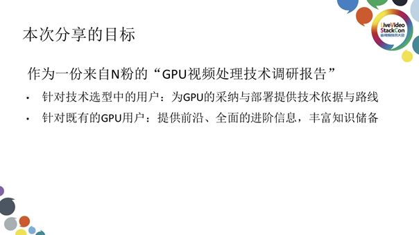
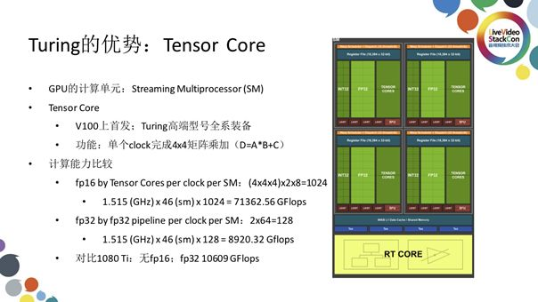

# GPU视频处理技术调研报告

⌚️:2020年11月30日

📚参考

```
本文来自英伟达高级工程师 季光在LiveVideoStack 线上交流分享，并由LiveVideoStack整理而成。分享中季光详细解析了GPU在视频编解码，图像分析和视频处理方面的相关技术支持，及实际性能评测数据。可以说是一份详细的“GPU视频处理技术调研报告”。
```

- 文章链接：[🔗](https://blog.csdn.net/vn9PLgZvnPs1522s82g/article/details/84057028)   ||      视频链接：[🔗](https://www.baijiayun.com/web/playback/index?classid=18110798306449&token=KcfWRw-Z3NfhKKZLIMQ5hppFaosTwLmE2fz-KBQwWWbRDuat0iGXznoobLduG-7tCqdH1zJ1Si0)   

---

大家好，我是季光，现就职于NVIDIA并担任高级工程师。我在2014年加入英伟达并负责云游戏基础设施开发，随后也曾为Video Codec SDK v8.1应用层开发做出了一些贡献。如果你是英伟达Video Codec SDK的早期用户就会发现早期版本的SDK中提供的样例程序并不易用，其原因在于与此相关的代码逻辑不清晰且难以复用。当时我们注意到了这些问题并对其进行了修复，使得v8.1版本的SDK有了很大改善。除此之外，我也是DeepStream SDK v1.0的主要开发者。

   
接下来为大家分享的内容可以说是我站在英伟达技术粉丝的角度撰写的“GPU视频处理技术调研报告”，并不代表英伟达官方的观点。我期待通过分享，为处于技术选型中的用户提供GPU的采纳与部署所需的技术依据与路线，也希望为既有的GPU用户提供前沿、全面的进阶信息与丰富的知识储备。    

## 1. NVIDIA GPU 基础准备

### 1.1 产品线

   
在开始正式的分享之前，首先我们有必要了解一下NVIDIA GPU的产品线。英伟达的产品线策略大致可以总结为利用少量的GPU型号衍生出可满足不同客户群需求的复杂显卡产品，尽管我们在消费级、企业级与工作站级都部署有大量显卡产品，但这些产品内部封装的GPU种类，型号屈指可数，同一款GPU经过筛选并搭配不同的显存与驱动就可得到满足不同需求的产品。2018年8月英伟达发布了新一代图像处理架构Turing，我们以此架构下的一款全新GPU：TU104为例。经过包装与校调，TU104可衍生出三档产品：搭载了8G显存，面向如游戏玩家等PC用户设计的消费级显卡GeForce RTX 2080；搭载了16G显存，面向企业级用户设计的Tesla T4与同样搭载了16G显存，面向工作站用户设计的Quadro RTX 5000。其中我们可以看到，相对于企业级与工作站级的专业显卡，消费级显卡在显存上做出了些许舍弃，在某种程度上这样做也是为了限制这些消费级显卡在企业级市场的使用。除此之外，我们还有TU102，这是Turing架构GPU中面积最大、功能最强的芯片，所对应的消费级显卡为旗舰级的GeForce RTX 2080 Ti，工作站级显卡为Quadro RTX 6000与Quadro RTX 8000；相对而言面积更小、定位中端的TU106，与其对应的消费级产品是GeForce RTX 2070，英伟达会在后续推出使用此芯片的工作站级产品。     

### 1.2 型号选择

   
接下来就有一个很实际的问题摆在我们面前：如何寻找最实惠的显卡型号？我们推荐的考虑指标为单位计算力的价格，如上图展示的那样：图中蓝色线拟合使用Maxwell 架构的9系消费级显卡产品，红色线拟合使用Pascal架构的10系消费级显卡产品；纵轴表示产品价格，横轴表示显卡算力；也就是说点或线在图中所处位置越低代表此产品（线）性价比越高。从中我们不难看出，代表比Maxwell架构更先进的Pascal架构的10系产品，其性价比明显高于9系，这也是开发新一代产品所要达到的目标。而10系显卡中的1080Ti所处位置最低，性价比最高。我们在选择显卡时可重点关注这些高端型号，而一些价格较为便宜的中低端型号产品虽然位于曲线底部有较高性价比，但产品定位导致的显存等核心参数的低下会严重制约这些产品的使用场景，并不推荐使用。    

经过调研，我们推荐选择GeForce RTX 2080作为视频加速的基础硬件。作为售价达到6299元人民币的次旗舰消费级显卡RTX 2080 ，搭载了型号为TU104的GPU与8G GDDR6显存。包括46个SM（2944个CUDA核心），稳定运行的时钟频率为1.515GHz并可在短时间内超频到1.71GHz；可稳定达到的计算力为约8920GLOPS，可以说这款产品将成为日后消费级显卡市场的主流型号。而对比上一代产品中的性价比之王GeForce 1080 Ti，即使售价为5499元人民币，但搭载了11G显存的它，其计算力达到了10609GFLOPS。无论是显存还是计算力，1080Ti都远高于RTX2080，那么我们为什么依旧推荐选择采用新一代架构的RTX2080呢？我们通过深入了解GPU的功能及RTX 2080的新特性来回答这个问题。   

## 2. NVIDIA GPU 

### 2.1 视频处理模块

   
上图展示的是GPU中一些与视频处理相关的模块，大致可分为三个部分：**用于视频解码的NVDEC**、**用于视频编码的NVENC**、**用于计算的CUDA Cores**。三者均靠API向应用层提供功能，而Buffer代表连接此三者的显存。     
    
上图展示的是与此相关的API架构。最底层为NVENC、NVDEC与CUDA，向上一层为NVIDIA DRIVER；在DRIVER层上我们提供了两个重要的SDK：与视频编解码相关的Video Codec SDK和与图像处理计算相关的CUDA TOOLKIT，开发者在构造应用时会多次接触到这两个SDK；继续向上，我们还提供了一些更高级的API如集成了Video Codec、FFmpeg等的功能，令开发者可通过FFmpeg命令行使用这些功能或用库的方式集成至应用中并轻松从软件Codec切换到硬件Codec；除此之外我们还提供了如DeepStream SDK、cuDNN、TensorRT、cuBLAS、cuSPARSE等计算类型的API。    

### 2.2 GPU编程基础

   
为了能够编好一个GPU程序，我们有必要深入了解一下GPU的编程模型。我们说GPU编程是一种“异构”的编程模式，所谓“异构”是指计算过程并不在CPU内进行而是在一个外在设备（如GPU）内完成，我们需要某种方式将计算所需的必要数据拷贝到此外在设备内并启动此设备，待计算完成后再将结果取回。上图左侧展示的就是常见的异构计算流程：平时使用的数据都在主存储存，需要计算时这些数据会被拷贝到GPU的显存上进行计算，随后计算完成得到结果后这些数据再被拷贝回主存。如果将这样的原理落实在代码层面则是如上图右侧展示的那样，这段代码已经非常接近于能够编译运行的状态，所演示的是最基本的GPU计算模式。首先我们在main函数中定义两个数：代表输入的a和与代表存入a的平方的输出结果b。我们专门定义了a和b在显存上的两个指针，随后调用cudaMalloc将指针作为一个参数。将a和b预分配完成后，我们需要通过调用cudaMemcpy把主存上的a拷贝到显存上的a当中，并通过调用cudaKernel也就是之前定义的square启动GPU进行运算。计算同时将数据存入显存的b中，完成计算后再借助cudaMemcpy将显存的b拷贝回主存的b中并释放显存，显示b中计算结果，这样便完成了整个计算过程。    
   
总结GPU的编程基础，首先CUDA SDK提供了最基本的GPU编程API，其中包括负责分配、释放显存的cudaMalloc、cudaFree，负责主存和显存间数据交换的cudaMemcpy，以及关键需要自己定义的CUDA kernel。以上展示的是最基础的CUDA编程模型，绝大多数情况下的CUDA kernel已被英伟达工程师与其他一些开发者实现，我们只需深入理解此模型就可以实现很多事情。这里需要强调一下内存显存之间数据拷贝的开销，这部分开销可以说是很大的。显存内部拷贝数据所需的带宽可达每秒上百GB，而主存与显存间的带宽即使是高规格的X16 PCI-E3.0也仅有每秒十几GB，如果PCI-E受限甚至无法达到此指标。我们需要尽量避免主存和显存之间的拷贝，而像刚才示例中输入的数据必须来自主存故这种拷贝无法避免。比较合理的是让GPU计算过程中所需要的数据一直保留在显存上，直到最终算清结果后再将其拷贝回主存。   

## 3. 图像处理加速

   
图像处理加速其实就是之前我们所举示例的进阶版，我们可以将原始图像看作是刚才的a，将此图像载入显存后利用GPU的并行计算能力处理，而后将处理完成的图像拷贝回b中，此图像以内存块的形式存在于主存与显存中。这里我推荐大家了解一下NPP库，其优势在于实现了图像处理的常用算法，预先实现了很多常见的CUDA kernel并无需GPU编程，通过API即可直接使用，不过在你尝试使用之前需要理解主存与显存之间的数据交换原理。除此之外，如果你有自己编写CUDA kernel的需求，那么你需要学习CUDA C编程。当然我们也在NVIDIA Codec SDK中提供了缩放、颜色空间转换等常用算法的样例代码，你可以参照这些样例代码并根据自己的需求进行修改。入门CUDA C编程较为容易，若是想优化其性能实现极致的处理效果则需要学习很多的知识与积累大量实践经验。初期探索只要实现数据一直保留在GPU上的稳定运行，即使未能达到最佳的性能也可以实现非常可观的加速效果。

## 4. 视频解码

### 4.1 基础准备

   
接下来我想为大家介绍的是视频解码。NVIDIA的全产品线支持视频解码且没有并发路数的限制，上图展示了不同图形卡支持的视频格式。我们关心的是图形卡可达到的视频解码能力，以Pascal架构产品中专面向视频分析推出的Tesla P4为例，对码率为1.5Mbps的1080P无B帧H264/HEVC的视频文件进行解码，其解码速度可分别达到678/733 FPS；而我之前推荐的新一代Turing架构产品中的RTX2080此项测试的结果和Tesla P4非常接近；如果使用Turing架构的Tesla T4进行相同测试，其H264下的解码能力翻倍而HEVC下的解码能力达到了Tesla P3的3倍。这里不得不注意的是，为什么采用相同GPU的消费级显卡RTX2080和企业级显卡Tesla T4在解码能力上会有如此大的差别？其在于消费级显卡相对于企业级显卡在部分功能与性能上的舍弃。

### 4.2 视频解码实战

如果你需要使用FFmpeg命令行实现视频解码，可在编译FFmpeg时添加一些选项如nonfree、cuda、nvenc、cuvid（cuvid是为了兼容性设置的NVDecode的别称）、Libnpp、等，只要编译前安装了cuda SDK，那么编译出的FFmpeg即附带相应功能。如果需要使用此命令则指明解码用NVDecode，其他的与正常使用FFmpeg一般无二。除此之外你也可使用SDK中的样例程序或NVDecLite，如上图右侧展示的那样，首先使用NvDecLite定义对象，而后通过外层的While循环每次加载一部分数据，通过内层的While循环解码若干帧。上图展示的代码可完整实现视频的解码功能，可见亲手编写一个NVDecode解码程序并不困难。    

## 5. 视频编码

### 5.1 基础准备

   
至于视频编码，NVIDIA产品中的Tesla和Quadro没有并发路数的限制，而消费级的GeForce显卡则有整个主机限2路的限制。这里的整个主机限制2路与主机上安装的显卡数量无关，即使是多显卡形成的显卡群也只能实现2路的并发编码。关于画质，相对于上一代的Pascal架构接近于x264 medium的预设，本代的Turing可在保持画质相当的情况下节省10%～20%的码流，换句话说同码流下Turing的画质有了显著的提高，保持码流不变的情况下Turing的PSNR提升明显。值得一提的是，Turing支持了HEVC编码的B帧，极大提高了HEVC编码的实用性。关于编码速度，编码的速度与参数的设置有关，对于上一代产品Tesla P4而言，将参数设置为高性能HP或高画质HQ处理1080P H264视频文件，编码速度可达到1150与658 FPS。由于目前的驱动还不完善，Turing架构产品的编码速度比上一代暂时略有所下降，预计新版SDK与配套的驱动将会在2019年年初发布，届时Turing图形卡的视频编码能力或得到进一步提升。    

### 5.2 画质比较

   
上图表格展示的是Turing架构下RTX2080和Pascal架构下的P6000分别在高画质与高性能下编码同码率视频文件输出结果的画质比较，可以看到新一代Turing产品无论是性能还是效率都高于上一代产品。

### 5.3 视频编码实战

   
如果你想通过FFmpeg命令行实现视频编码，与解码类似，首先指明编码使用的Codec再指明所需输出即可，（即-c:v h.264_nvenc output_file），也可联合使用NVDecode与NVEncode，添加-hwaccel cuvid选项表示数据一直保留在显存当中，在Decode完成解码后立刻将数据交给Encode进行编码。如果在这里你使用C++直接调用SDK，其代码也非常简单。    

## 6. 数据流动与优化

### 6.1 理想的数据流动

   
之前我们提到，主存与显存之间的数据交换代价非常之大。我们希望数据一直存储在显存当中，上图展示的便是这样一个理想的数据流动过程。首先我们将视频输入至显存中进行解码，解码完成后这些数据会被留在显存中进行中间处理如重采样等，完成此中间处理后再对视频进行编码，编码完成后将此编码好的数据传输回主存中。中间处理可能会经历很多步骤，我们希望所有的处理都是由GPU在显存中完成而不必将这些中间数据拷贝回主存。虽然CUDA编程较易入门但如果你有此方面需求则需要自己编写CUDA kernel从而尽量将数据保存在显存当中从而极大提升整个程序的性能表现。但如果此视频数据并不经过转码整个流程，也许在解码之后我们就需要对其进行视频分析。下面讲讲如何实现这种视频分析。    

### 6.2. 优化思路：神经网络预测

   

这里就需要我们借助深度学习的力量也就是神经网络预测。常见的一些神经网络预测框架与工具有MXNet、TensorFlow、cuDNN、cuBLAS、TensorRT等。MXNet与TensorFlow已经对GPU有良好的支持，甚至可通过开关切换CPU/GPU；但由于没有显存互操作的API，MXNet与TensorFlow无法直接接受一个显存的指针，也无法衔接NVDecode输出的显存数据，这就使得从NVDecode显存中输出的数据需先被拷贝到主存再通过MXNet 或TensorFlow的API拷贝回显存继而被计算，这也是无奈之举。我们希望将来NVDecode的功能可被集成到MXNet/TensorFlow中或通过互操作API直接传输数据，这也是我们正在探索并期待下一步实现的目标。除此之外，如果你并不使用MXNet和TensorFlow，也可以借助cuDNN和cuBLAS搭建一个神经网络，其中拥有更基础的计算API并构建了MXNet和TensorFlow的主要GPU功能；也可接受显存数据为输入从而使得NVDecode与cuDNN和cuBLAS无缝衔接。最后我推荐大家使用一下TensorRT工具，其功能是接收训练好的MXNet和TensorFlow并通过优化加快神经网络的预测。TensorRT中包括了高度优化的GPU计算代码，使得开发者方便调用Tensor Core进行加速；相对于效率已经很高的MXNet，TensorFlow可在TensorRT的优化下实现性能更佳的加速：在保持硬件不变的情况下使用TensorRT可实现3～10倍加速，可以说TensorRT是神经网络预测性能优化的利器。   

### 6.3 优化关键：Tensor Core

   
说了这么多，想必大家一定很好奇Turing架构产品相对于前几代产品最突出的优势在哪里，这里就不得不说Turing架构产品中集成的Tensor Core。上图右侧展示的是GPU中的一个SM单元，GPU中的SM单元相当于CPU中的一个核心，也就是说SM才是一个真正意义上的构造单元而CUDA核仅是SM中的一条流水线。观察此图我们可以注意到FP32中的每个小方格代表的是一个CUDA核，一个SM中包括64个CUDA核，很显然我们不能用CUDA核直接与CPU物理核心类比。而一个SM中位于CUDA核旁边的Tensor Cores共有8个，Tensor核的功能十分强大，可在单个clock中完成4×4矩阵乘加，也就是三个4x4的矩阵A、B、C进行的AxB+C运算。我们知道一个大的矩阵乘法可被切成多个小矩阵进行计算，而后再将计算结果汇总即可得到我们想要的答案。Tensor Code的加入可明显加快矩阵乘法。


上图给出了fp16 Tensor Core与fp32 CUDA Core的算力比较结果，并以1080Ti作为基准，可以看到Tensor Core的性能强大。需要强调的是，这里的结果是理想化的实验室测试数据，在实践探索中我们可通过优化实际发挥其80%以上的性能，如果像英伟达官方那样采用GPU汇编尽可能优化可实现90%以上的性能。

## 7. 总结与评价

   
最后简单评价一下NVIDIA的新一代图像处理器架构Turing，可以说是有创新与舍弃。首先是fp32并没有大幅度提高，同级的GPU仅提高15%～20%，并且大量的芯片面积用于其它功能；其次在Tesla/Quadro上，解码速度有了明显提升，而消费级产品的解码速度与上一代产品持平；除此之外，更高的编码质量也得以实现，相对于消费级RTX产品并发路数为2路的限制，Tesla/Quadro产品上并没有并发路数的限制；最后，高效的Tensor Code加速使得RTX 2080 Ti的Ai计算能力（fp16）约为GTX 1080 Ti（fp32）的7倍。