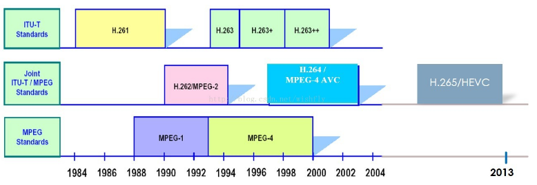
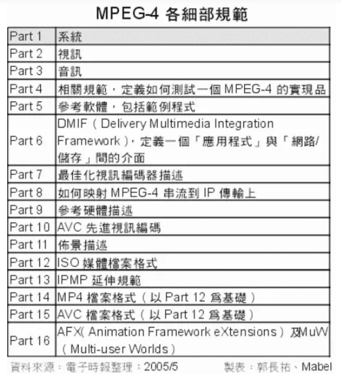

# 视频的常用概念

⌚️:2020年11月30日

📚参考

----

## 一、机构  

格式的统一肯定会极大地提高人们的生活的便利以及数据的传播，为什么还会有如此繁多的视频编码的方式，难道就没有专门机构或者组织来管理一下吗？带着这些疑问我们认识一下底下的两个机构。

### 1、ITU-T  

ITU-TITU-T的中文名称是**国际电信联盟远程通信标准化组织(ITU-T for ITU Telecommunication Standardization Sector)**, 它是国际电信联盟管理下的专门制定远程通信相关国际标准的组织。由ITU-T指定的国际标准通常被称为建议(Recommendations)。由于 ITU-T是ITU的一部分，而ITU是联合国下属的组织，所以由该组织提出的国际标准比起其它的组织提出的类似的技术规范更正式一些。它制定的标准有H.261、H.263、H.263+等，目前流行最广的，影响也是最大的H.264也有他的一份功劳。   

* H - 视频音频以及多媒体系统复合方法  
* H.223 低码率多媒体通信复合协议   
* H.225.0 也被称为实时传输协议  
* H.261 视频压缩标准, 约1991年  
* H.262 视频压缩标准(和MPEG-2第二部分内容相同), 约1994年  
* H.263 视频压缩标准, 约1995年  
* H.263v2 (也就是 H.263+) 视频压缩标准, 约1998年  
* H.264 视频压缩标准(和MPEG-4第十部分内容相同), 约2003年H.323 基于包传输的多媒体通信系统  


### 2、ISO  

ISO国际标准化组织（ISO）是由各国标准化团体（ISO成员团体）组成的世界性的联合会。负责各种标准的制定，当然也少不了关于视频编码方面的。它制定的标准有MPEG-1、MPEG-2、MPEG-4等。并且已经制定出来了最新的MPEG-7，并且计划公布MPEG-21。国际标准化组织（ISO）制定的标准主要集中在MPEG系列。也就是由动态的图像专家组制定的一系列的标准。由ISO下属的MPEG运动图象专家组开发视频编码方面主要是Mpeg1（vcd用的就是它）、Mpeg2（DVD使用）、Mpeg4（现在的DVDRIP使用的都是它的变种，如：divx，xvid等）、Mpeg4 AVC（现在正热门也就是H.264）  

国际标准化组织（ISO）制定的标准主要集中在MPEG系列。也就是**由动态的图像专家组制定的一系列的标准**。由ISO下属的MPEG运动图象专家组开发视频编码方面主要是Mpeg1（vcd用的就是它）、Mpeg2（DVD使用）、Mpeg4（现在的DVDRIP使用的都是它的变种，如：divx，xvid等）、Mpeg4 AVC（现在正热门也就是H.264）  

MPEG 全称是Moving Pictures Experts Group，它是“动态图象专家组”的英文缩写，该专家组成立于1988年，致力于运动图像及其伴音的压缩编码标准化工作，原先他们打算开发MPEG1、 MPEG2、MPEG3和MPEG4四个版本，以适用于不同带宽和数字影像质量的要求。   

### 3、其他  

除了上述两个组织之外，其他比较有影响力的标准还有：  

* Google：VP8/VP9;  
* Microsoft : VC-1;  
* 国产自主标准：AVS/AVS+/AVS2

## 二、码率和帧率

* 码率，即比特率，数据传输时单位时间传送的数据位数，单位 千位每秒 ，通俗理解为取样率，单位时间内取样率越大，精度就越高，处理出来的文件就越接近原始文件，也就是说画面的细节越丰富，所以说影响视频画面质量，进而影响QOE
* 帧速率：每秒钟播放多少帧，电影一般至少24帧/s
* 分辨率：视频的宽高尺寸


视频的清晰度与码率一一对应，码率 > 1024kbps为超清视频；对应关系如下

|      |   码率   |  分辨率  | 俗名 |
| :--: | :------: | :------: | :--: |
| 超清 | 1024kbps | 1280*720 | 720P |
| 高清 | 512kbps  | 640*480  | 480P |
| 流畅 | 256kbps  | 480*360  | 360P |

码率单位：kbps 

视频文件大小的单位: KB

时间单位：s

举例：视频文件大小为240MB, 播放时间1min.通过公式

```
bitRate = （videoFile Size *8）/time 
```

得 该视频的码率 = 240\*1024\*8/60 = 1048576 kbps

补充：

固定码率（cbr：constant-bit-rate）：以固定的压缩比压缩文件
可变码率(vbr：variable-bit-rate)：制作视频时采用变化的码率，即动作不激烈时用低码率，激烈时用高码率制作，这不仅保留了比较好的画质而且也降低了视频文件的体积

#### 视频编码的基本原理

视频图像数据有极强的相关性，也就是说有大量的冗余信息，其中冗余信息可分为空域冗余信息和时域冗余信息。压缩技术就是将数据中的冗余信息去掉（去掉数据之间的相关性），压缩技术包含帧内图像数据压缩技术、帧间图像数据压缩技术和熵编码压缩技术。视频文件相关的三个参数：码率、分辨率和帧率。

* 码率：
  把每秒显示的图片进行压缩后的数据量。影响体积，与体积成正比，码率越大，体积越大，体积指的是视频文件的大小。
* 分辨率：
  图片的长度和宽度
* 帧率：
  每秒显示的图片数。影响画面流畅度，与画面流畅度成正比，帧率越大，画面月流畅；帧率越小，画面越有跳动感。由于人类眼睛的生理结构，帧率>16,人认为画面是连贯的，这就是视频暂留现象。当帧速达到一定数值后，再增长的话，人眼也不容易感觉到有明显的流畅度提升了。

#### 关系

帧率 * 分辨率  = 压缩前的每秒数据量（单位 B/s）

压缩比 = 压缩前的每秒数据量/码率    （对于同一个视频源采用同一种视频编码算法，则压缩比越高，画面质量越差）

生活中的“清晰度”：指画面十分细腻，没有马赛克。并不是分辨率越高图像越清晰。

简而言之：分辨率一定，码率与清晰度成正比，码率越高，图像越清晰。

码率一定，分辨率与清晰度成反比，分辨率越高，图像越不清晰

#### 视频质量有2中表现方式：主观方式和客观方式

主观方式：即我们所说的清晰度

客观方式： 量化参数或者压缩比或者码率。在视频源一样，压缩算法也一样的前提下，量化参数，压缩比和码率是有直接的比例关系的。


#### 分辨率的变化又称为“重新采样”。

下采样：高分辨率变为低分辨率。

上采样：低分辨率变高分辨率。由于需要插值等方法补充缺失的像素点，必然会带有失真。

## 三、视频格式发展史

   

### 1、MPEG-4  

MPEG-4于1999年初正式成为国际标准。它是一个适用于低传输速率应用的方案。与MPEG1和MPEG2相比，MPEG4更加注重多媒体系统的交互性和灵活性。MPEG-4（同时也是ISO/IEC 14496）的制订并非只有动态视频的编解码而已，其中还包括诸多的环节与项目，真正与视频直接且密切相关的，其实就是MPEG-4 Part 2（也称为MPEG-4 Visual）的部分，其余还有用于传送时的整合架构规范、文件格式、软件规范、相关定义等。
  

### 2、目前主流占优势的H.264  

H.264 是由ITU-T 的VCEG（视频编码专家组）和ISO/IEC 的MPEG（活动图像编码专家组）联合组建的联合视频组（JVT：joint video team）提出的一个新的数字视频编码标准，它既是ITU-T 的H.264，又是ISO/IEC 的MPEG-4 的第10 部分。而国内业界通常所说的MPEG-4 是MPEG-4 的第2 部分。即：H.264=MPEG-4（第十部分，也叫ISO/IEC 14496-10）=MPEG-4 AVC.因此，**不论是MPEG-4 AVC、MPEG-4 Part 10，还是ISO/IEC 14496-10，都是指H.264**。H.264也是MPEG-4的一部分。H.264标准从1998 年1 月份开始草案征集，到2003 年7 月，整套H.264 （ISO/IEC 14496-10）规范定稿。2005年1 月，MPEG 组织正式发布了H.264 验证报告，从各个方面论证了H.264 的可用性以及各种工具集的效果，从标准的角度，印证H.264 的成熟性。  

H.264关于该技术的视频编码方案，现在正式命名为ITU-T H.264或“JVT/AVC草案”。H.264/MPEG-4 AVC作为MPEG-4标准的扩展（MPEG-4 Part 10），充分利用了现有MPEG-4标准中的各个环节。H.264/MPEG-4 AVC就在现有MPEG-4 Advanced Simple Profile的基础之上进行发展的。它即保留了以往压缩技术的优点和精华又具有其他压缩技术无法比拟的许多优点。

### 3、既生瑜何生亮？  

其实通过上面的讨论我们也看到了H.264跟MPEG-4（part2）都是为了互联网而生，而且有许多共同的特点，那么既生MPEG-4？何生 H.264？有了MPEG-4（第二部分）为什么还要H.264，岂不是多此一举？两者到底有多大的区别呢？为何需要再订制出MPEG-4 Part 10呢？直接沿用MPEG-4 Part 2难道不行？  

虽然MPEG-4已针对Internet传送而设计，提供比MPEG-2更高的视频压缩效率，更灵活与弹性变化的播放取样率，但就视频会议而言总希望有更进一步的压缩，所以才需要出现了H.264。  

首先就是上文提到的H.264对于带宽的要求低，在带宽比较吃紧的情况下一样可以正常的工作，只相当于MPEG-4第二部分的2/3，不要小看这些，这些就可以决定你看视频是否流畅。更具体地说，H.264力求在40kbps～300kbps的有限带宽下尽可能得到流畅、清晰的表现。那么到底压缩了更小的H.264能够有更高的压缩率，播放效果是不是大打折扣呢？播放效果与MPEG-2、MPEG-4近乎相同嘛？是的，其实视频的质量我们看不出多大的差别，之所以出现这种现象答案在于H.264采用了更复杂的编码算法，当然对于解码也提出了更高的要求。以前之所以未采用更复杂的算法，是考虑到解码（播放）端的运算能力不足，就会导致播放不流畅，失去视频娱乐观赏的意义，但如今不同，无论桌面电脑、移动终端的性能都突飞猛进，即便运用更复杂的压缩编码都可以实时解码、流畅地播放，这正是MEPG-4、H.264能够流行的一项先决条件。但是其实这些都不是关键，目前的宽带已经完全满足了mpeg-4第二部分的使用，但是为什么还要H.264呢？就是因为授权的问题。关于这个问 题，H.264不仅压缩算法比以往的MPEG-4更优异，带宽耗用更低，还有一项最诱人的特点：授权费用比较合理，因为H.264晚于MPEG-4问世， 且两者定位接近，既然如此，H.264只好在授权费上降低定位，期盼以较宽厚的授权方式争取被采用，而这正是对了运营商的胃口，当初许多运营商对 MPEG-4的授权深表反感，之后也都热烈拥护H.264。

### 4、巨头微软力推的VC-1

VC-1是软件巨头微软力推的一种视频编码的格式，但是它的发展并不是很顺利，可以说是历经坎坷。直到2006年初，活动图像和电视工程师协会(SMPTE)才正式颁布了由微软提出并开发的VC-1视频编码标准。

### 5、总结  

**目前的视频发展中，可以说老的视频格式并没有死去，而是正当年。而新的视频由于适应了网络时代的发展，前途光明**。  目前的MPEG-2的视频在蓝光时代一样是得到了重用，MPEG-2不是MPEG -1的简单升级，MPEG-2在系统和传送方面作了更加详细的规定和进一步的完善。MPEG-2特别适用于广播级的数字电视的编码和传送，被认定为SDTV和HDTV的编码标准。DVD影碟就是采用MPEG-2压缩标准。而H.264虽然收费问题仍让人不满，但是由于普及的面大，加上其算法上面的领先，在短时间内不会让别人追上。而MPEG-4{2}由于目前网络速度的发展，加上费用的下降甚至于以后的费用可能为零来竞争，也很有发展前途。而google与微软自己力推的WMV以及WebM都有着巨头强大的实力作为后盾。特别是WMV这几年已经在日常中比较常见了，而WebM由于开源加上免费的优点，再加上其最大的视频网站YOutobe作为后盾，加上许多厂家的力捧，很有希望在以后后来居上。

## 四、封装格式和编码格式  

**封装格式**和**编码**的关系，就是和酒与酒瓶的关系差不多，而播放器就是开酒器。为了可以喝更好的酒，最好先了解酒是什么酒，酒瓶是什么酒瓶，怎么使用开酒器开酒瓶。  

**码率**或者可以比喻做酒的原料。对于同一个酒瓶和做同一种酒的情况下，如果原料太少，又要要求用酒把酒瓶灌满，此时只好兑水了，酒的品质就会变差了。然而，如果原料太多，又会造成原料浪费。所以要做好酒，我们就需要充足的原料。同样道理，压制一个视频，充足的码率是非常需要的。如果码率过高，画质提升不上去的同时还使视频体积过大。如果码率不足，视频容易出各种各样的问题，导致压崩。当然，码率不是画质的唯一指标，压制的时候的各种参数设置，各种滤镜也是非常重要的。如果码率给得足够高，理论上各编码的画质是一样的，不过体积完全不一样。

### 1、什么是封装格式

封装格式的辨认很简单，大多数情况下，拓展名就是封装格式的名字。比如一个文件“金刚狼.avi”，那它就是属于avi的封装格式，“钢之炼金术师.Mkv”，那它就属于mkv封装格式， “喜羊羊与灰太狼.rmvb”就是rmvb封装格式。简而言之，视频文件后缀名就是封装格式的名字。不过wmv和rmvb就比较特殊，后面编码器部分再说。  

封装格式就是酒瓶。酒瓶就不影响酒的口感，同样，封装格式一样不影响视频画质。它只负责把内部的视频轨和音频轨集成在一起，只起到一个文件夹（或者压缩包）的作用，并没有对视频轨和音频轨造成影响。   


封装就是媒体的容器，而容器就是把编码器生成的多媒体内容(视频，音频，字幕，章节信息等)混合封装在一起的标准。容器使得不同多媒体内容同步播放变得很简单，而容器的另一个作用就是为多媒体内容提供索引，也就是说如果没有容器存在的话一部影片你只能从一开始看到最后，不能拖动进度条，而且打开的视频也没有声音。下面是几种常见的封装格式：  

* AVI 格式(后缀为 .avi)  
* DV-AVI 格式(后缀为 .avi)  
* QuickTime File Format 格式(后缀为 .mov)  
* MPEG 格式(文件后缀可以是 .mpg .mpeg .mpe .dat .vob .asf .3gp .mp4等)  
* WMV 格式(后缀为.wmv .asf)  
* Real Video 格式(后缀为 .rm .rmvb)  
* Flash Video 格式(后缀为 .flv)  
* Matroska 格式(后缀为 .mkv)  
* MPEG2-TS 格式 (后缀为 .ts)  

目前，我们在流媒体传输，尤其是直播中主要采用的就是 FLV 和 MPEG2-TS 格式，分别用于 RTMP/HTTP-FLV 和 HLS 协议。

### 2、几种主流媒体格式情况  

#### 1、AVI（Audio Video Interleave）  

比较早的AVI是Microsoft开发的。其含义是Audio Video Interactive，就是把视频和音频编码混合在一起存储。AVI也是最长寿的格式，已存在10余年了，虽然发布过改版（V2.0于1996年发布），但已显老态。AVI格式上限制比较多，只能有一个视频轨道和一个音频轨道（现在有非标准插件可加入最多两个音频轨道），还可以有一些附加轨道，如文字等。AVI格式不提供任何控制功能。扩展名：avi  
总结：只能封装一条视频和一条音频，不能封装字幕，没有流媒体功能（就是不能使用它进行在线播放的意思）  

#### 2、WMV（Windows Media Video）  

WMV是微软公司开发的一组数字视频编解码格式的通称，ASF（Advanced Systems Format）是其封装格式。 ASF封装的WMV档具有“数字版权保护”功能。扩展名:wmv/asf、wmvhd 其音频编码采用WMA，视频编码采用WMV,需要版权支持且机顶盒支持的不多。   
VC-1是最后一个被承认的高清编码格式（其他是H.264、VC-1、MPEG-2、MPEG-4、DivX、XviD、WMA-HD以及X264）  
VC-1虽然没有H.264好，但是有微软做后台，不能小视，也即我们通常所说的DVDrip格式  
Divx收费，Xvid免费开源，并且比Divx有所加强，Xvid压缩率约是Divx的2倍  

#### 3、MPEG格式:MPEG（Moving Picture Experts Group）   

MPEG是一个国际标准化组织（ISO）认可的媒体封装形式，受到大部份机器的支持。其存储方式多样，可以适应不同的应用环境。MPEG-4档的档容器格式在Part 1（mux）、14（asp）、15（avc）等中规定。MPEG的控制功能丰富，可以有多个视频（即角度）、音轨、字幕（位图字幕）等等。  
MPEG的一个简化版本3GP还广泛的用于准3G手机上。扩展名:dat（用于VCD）、vob、mpg/mpeg、3gp/3g2（用于手机）等  
MPEG1是最早出现的，VCD这个具体的格式最早是从日本来的并遵从MPEG1规格  
MPEG2：其代表是DVD。一般为480P（640\*480）。DVD当时都符合这个标准。 

Xvid 和H.264同属于MPEG4，MPEG-2还可能称作MPEG2-HD，MPEG2-TS，其实在ITU-T的命名规范中被称之为H.262  

H.264有两个名称，一个是沿用ITU-T组织的H.26x名称，叫“H.264”，另一个则是“MPEG-4AVC（MPEG4第10部分）”，AVC意为高级视频编码。  

H264的数据压缩率比当前DVD系统中使用的MPEG-2高2-3倍，比MPEG-4高1.5-2倍。  
x264编码，是H.264编码的一个开源分支，它符合H.264标准，其功能在于编码(encoding)，而不作为解码器(decoder)使用，264编码最大的特点在于注重实用，它在不明显降低编码性能的前提下，努力降低编码的计算复杂度，X264对于H.264编码中的一些复杂编码特性做了折衷处理，其压缩视频体积小于Xvid(MPEG4)编码视频.   
mp4格式是H.264编码指定使用的标准封装格式，3GP是MP4格式的一种简化版本，减少了储存空间和较低的频宽需求，让手机上有限的储存空间可以使用可以封装多种多条编码的视频和音频，也可以封装字幕，但没有流媒体功能，可以做成分片式进行流式播放。  

#### 4、Matroska  

Matroska是一种新的多媒体封装格式，这个封装格式可把多种不同编码的视频及16条或以上不同格式的音频和语言不同的字幕封装到一个Matroska Media档内。它也是其中一种开放源代码的多媒体封装格式。Matroska同时还可以提供非常好的交互功能，而且比MPEG的方便、强大。扩展名:mkv

#### 5、Real Video或者称Real Media（RM）档  

是由RealNetworks开发的一种档容器。它通常只能容纳Real Video和Real Audio编码的媒体。该档带有一定的交互功能，允许编写脚本以控制播放。RM，尤其是可变比特率的RMVB格式，体积很小，非常受到网络下载者的欢迎。扩展名：rm/rmvb.  

视频编码有RealVideo G2（早期）（ RV40, RV50, RV60 ）、RealVideo 8/9/10（RM8, RM9, RM10）  
音频编码有RealAudio cook/sipro（早期）、RealAudio AAC/AACPlus等，实际上h264早就把RM挤出历史的舞台。  

和avi差不多，但它们都有流媒体功能，区别是rmvb支持可变码率，rm不可变码率，即恒码率。  

#### 6、QuickTime File Format  

是由苹果公司开发的容器。1998年2月11日，国际标准组织（ISO）认可QuickTime文件格式作为MPEG-4标准的基础。QT可存储的内容相当丰富，除了视频、音频以外还可支持图片、文字（文本字幕）等。扩展名：mov、qt  

#### 7、Ogg Media   

是一个完全开放性的多媒体系统计划，OGM（Ogg Media File）是其容器格式。OGM可以支持多视频、音频、字幕（文本字幕）等多种轨道。扩展名：ogg

#### 8、MOD格式  

是JVC生产的硬盘摄录机所采用的存储格式名称   

#### 9、MKV  

和mp4差不多，但有流媒体功能，可以使用它进行在线播放，还可以使用它封装rv（rm/rmvb）编码呢！  

另外：  
视频封装格式是MP4，MKV，或者其它，它们都是：视频流，音频流，字幕完全用自己独立的轨道，并且可以是外挂字幕。  
字幕后缀名为str，ass，ssa等。这些字幕有自己的特效，什么时候以怎样的形式出现哪些文字，都是由写好的代码控制的。  

# 多媒体

**多媒体（Multimedia**是多种媒体的综合，一般包括文本，声音和图像等多种媒体形式。   

在计算机系统中，多媒体指组合两种或两种以上媒体的一种人机交互式信息交流和传播媒体。使用的媒体包括文字、图片、照片、声音 、动画和影片，以及程式所提供的互动功能。   

多媒体是超媒体（Hypermedia）系统中的一个子集，而超媒体系统是使用超链接（Hyperlink）构成的全球信息系统，全球信息系统是因特网上使用TCP/IP 协议和UDP/IP 协议的应用系统。二维的多媒体网页使用HTML、XML等语言编写，三维的多媒体网页使用VRML等语言编写。许多多媒体作品使用光盘发行，以后将更多地使用网络发行。  

## 一、视频格式

视频格式可以分为适合本地播放的**本地影像视频**和适合在网络中播放的网络**流媒体影像视频**两大类。    

原始的视频数据可以理解为通过摄像头等驱动获取的没有经过编码的数据，市面上usb摄像头输出的格式常见的有：**RGB24**、**YUV2**、**YV2**，MJPEG（经过编码的数据）。   

### 1.常见格式

* [MPEG-图像运动专家组（Motion Picture Experts Group）](https://baike.baidu.com/item/MPEG)   
* [AVI-音频视频交错（Audio Video Interleaved）](https://baike.baidu.com/item/AVI/213655)   
* [MOV](https://baike.baidu.com/item/MOV)
* [ASF-高级流格式（Advanced Streaming format)](https://baike.baidu.com/item/ASF/3918)  
* [WMV](https://baike.baidu.com/item/WMV)
* [NAVI](https://baike.baidu.com/item/nAVI/838785)
* [3GP](https://baike.baidu.com/item/3gp)
* [Real Video](https://baike.baidu.com/item/REAL%20VIDEO)
* [MKV](https://baike.baidu.com/item/mkv)
* [FLV](https://baike.baidu.com/item/flv)
* [F4V](https://baike.baidu.com/item/F4V)
* [RMVB](https://baike.baidu.com/item/rmvb)
* [WebM](https://baike.baidu.com/item/WebM)

## 二.音频格式

### 1.常见格式

* [CD](https://baike.baidu.com/item/cd/3663?fr=aladdin)
* [WAVE](https://baike.baidu.com/item/WAVE/13872619)
* [AIFF](https://baike.baidu.com/item/AIFF)
* [AU](https://baike.baidu.com/item/Adobe%20Audition/6782463?fromtitle=AU&fromid=17105768)
* [MP3](https://baike.baidu.com/item/mp3/9858706)
* [MPEG-4](https://baike.baidu.com/item/MPEG-4)
* [MIDI](https://baike.baidu.com/item/MIMD)
* [WMA](https://baike.baidu.com/item/WMA/2175065)
* [RealAudio](https://baike.baidu.com/item/RealAudio)
* [VQF](https://baike.baidu.com/item/VQF)
* [OggVorbis](https://baike.baidu.com/item/Ogg%20Vorbis)
* [AMR-Adaptive Multi-Rate](https://baike.baidu.com/item/Adaptive%20Multi%20Rate)

### 2.比较

作为数字音乐文件格式的标准，WAV格式容量过大，因而使用起来不方便。因此，一般情况下，我们把它压缩为MP3或WMA格式。

## 三.字幕格式

* 外挂字幕：视频文件和字幕文件分离。
* 内嵌字幕：视频文件和字幕文件集成到一起。  

### 1.外挂字幕的格式

* srt格式：这是最好的，体积小，用记事本可以打开编辑。
* sub+idx：这种事图形字幕，只能用字幕转换软件；体积较大。
* ass字幕：网上比较少，比srt多一些特效。  

## 四、采集录制和播放渲染

### 1.视频采集

视频采集（Video Capture）把模拟视频转换成数字视频，并按数字视频文件的格式保存下来。所谓视频采集就是将模拟摄像头、录像机、LD视盘机、电视机输出的视频信号，通过专用的模拟、数字转换设备，转换为二进制数字信息的过程。   

在视频采集工作中，**视频采集卡**是主要设备，它分为**专业**和**家用**两个级别。专业视频采集卡不仅可以进行视频采集，并且还可以实现硬件级的视频压缩和视频编辑。   家庭级的视频采集卡只能做到视频采集和初步硬件压缩，而更低端的电视卡，虽可以进行视频采集，但他通常都省却了硬件级的视频压缩功能。  

### 2. 视频渲染

Shade（着色）提供了非常直观，实时的表面基本着色效果，根据硬件的能力，还能显示出纹理贴图、光源影响甚至阴影效果，但这一切都是粗糙的，特别是没有硬件支持的情况下，他的显式甚至会是无理无序的。   

Render（渲染）效果就不同了，它是基于一套完整的程序计算出来的，硬件对他的影响只是一个速度问题，而不会改变渲染的结果，影响结果的是看他基于什么程序渲染的，比如是光线追踪还是光能追踪。   

## 五、编解码器

编解码器（codec）指的是一个能够对一个信号或者一个数据流进行变换的设备或者程序。   

## 六、容器

音视频编码及文件格式（容器）是个很庞大的知识领域。  首先要分清媒体文件和编码的区别：文件是即包括视频又包括音频、甚至还带有脚本的一个集合，也可以叫做容器； 文件当中的视频和音频的压缩算法才是具体的编码。   

### 1.常见音视频编码分类

* MPEG
* H.26x系列
* 微软的windows media系列
* Real Media系列
* QuickTime系列

### 2.DTS文件格式（容器）

* AVI
* MPEG
* MPG
* VOB
* MP4
* 3GP
* ASF
* RM
* MOV
* MKV
* WAV
* MP3

## 七、协议

### 1.视频协议

目前主要的视频压缩协议有：H.261,H.263,H.264和MPEG-1，MPEG-2，MPEG-4.  

从应用角度来说，MPEG系列在消费类应用更广些，比如VCD是MPEG-1，DVD是MPEG-2。而H.x系列常用到**视频会议**。  

从技术角度来说，H系列的协议对网络的支持更好些，这点MPEG系列要差些，但是MPEG每一代都比H系列的协议晚些，算法也更先进些，因此，它用来做存储协议是合适的。   

### 2.音频协议

音频协议也分为两大类：ITU组织的主要是用于视频会议的g系列协议，包括g.711,g.722,g.723,g.726,g.728,g.729等。这些协议的特点：第一对人讲话压缩的比较好，对音乐比较差。第二压缩率大，码率低。    
ISO更为人熟知，比如mp3.    

### 3.上层通讯协议

在视频会议系统中，目前流行的有**h.323和sip协议**，在流媒体应用中，**isma， rtsp**应用的比较多。   

## 八、常用概念介绍

