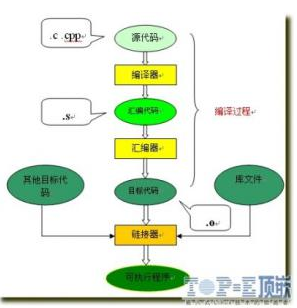
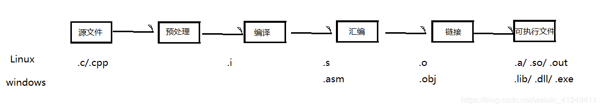

# C语言的编译链接执行过程

2020年7月29日，原文地址见末尾

机器不能识别高级语言，而对我们来说高级语言更方便理解，这需要编译器的帮助才能完成中间的转化过程：将高级语言转化成机器能识别的二进制文件。

 而一个C程序在执行过程中，需要经历两个环境：**编译环境和执行环境**

## 1. 编译环境的四个步骤

- 预处理：对源代码进行处理
- 编译：生成汇编语言
- 汇编：将汇编语言转化成机器语言
- 链接：将生成的目标文件与相关的目标文件或标准库链接，生成可执行文件。

### 1.1 预处理

 预处理过后的源代码仍然是.c文件，这个过程中只是对源代码进行了一些替换，删除，添加动作。如果你的程序即便语法错误，这个步骤仍然会执行。

- 对#include文件替换
- 宏#define的递归替换
- 条件预编译指令的替换
- 去掉注释
- 保留#pragma指令，编译器会用到。

### 1.2 编译

 编译的过程会将.c文件转换成汇编语言，再转换之前会先源代码进行词法分析、语法分析、语义分析、符号汇总，再将对应的源代码翻译成汇编语言，这里的汇编语言，其实是机器码的助记符。

 符号汇总，是将程序中的函数名，全局变量看作一个符号，便于在链接过程中找到相应的位置。

### 1.3 汇编

 汇编将汇编语言转换成对应的二进制语言，即机器指令。将.s语言生成.obj的目标文件。

 目标文件由段组成，通常一个目标文件中至少两个段：

- 代码段：主要是程序的指令，可读可执行，但不可写
- 数据段：存放程序要用到的临时变量或静态数据库，可读，可执行，可写

 **不同CPU对应的机器码不同**

### 1.4 链接

 将多个目标文件链接成可执行文件，合并段表，符号表的重定向。

<在Linux 下编程时，我们可以根据这个过程写一个[Makefile](https://blog.csdn.net/weixin_41249411/article/details/83578201)文件，方便修改编译。

## 2. 执行环境

- 程序在过程中必须载入程序，CPU通过执行内存中的指令开始执行程序。
- 程序的执行从调用main函数开始

## 参考

> [原文地址](https://blog.csdn.net/weixin_41249411/article/details/83578238)