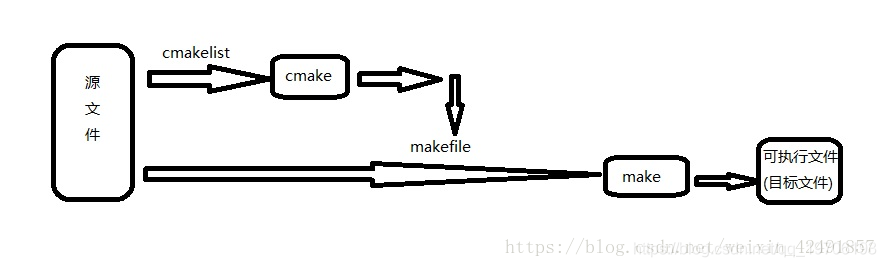

# GCC、Make、CMake、Makefile、CMakelists

2020年8月9日

---

简而言之，GCC是一个编译套件，我们可以通过gcc/g++来编译C/C++的目标项目，但是当一个项目比较复杂的时候，直接编译就会很麻烦，因此就出现了makefile，makefile就是包含一堆编译命令的文件，使用Make工具就可以读取并执行Makefile文件中的编译指令，从而快速进行项目编译，提升工作效率，但是makefile又需要我们自己编写，项目小还好说，项目庞大的时候，我们需要去每个文件夹下编写不同的Makefile，工作量实在大。因此，又出现了CMakelists，CMakelists可以通过更简单的写法来生成对应的Makefile文件，然后通过CMake工具“读取”并执行CMakelists.txt文件中的语句，来生成对应的Makefile。然后我们就可以通过Make工具来“执行”Makefile了。

相当于现在我们只要编写CMakelists.txt，就会自动生成Makefile文件。不同平台的Makefile文件不一样，通过CMake，达到一个可以快速跨平台编译的效果。

### 1. gcc

gcc是GNU Compiler Collection（就是GNU编译器套件），也可以简单认为是编译器，它可以编译很多种编程语言（括C、C++、Objective-C、Fortran、Java等等）。

当你的程序只有一个源文件时，直接就可以用gcc命令编译它。但是当你的程序包含很多个源文件时，用gcc命令逐个去编译时，你就很容易混乱而且工作量大，**所以出现了make工具**。

### 2. make

make工具可以看成是一个智能的批处理工具，它本身并没有编译和链接的功能，而是用类似于批处理的方式—通过调用makefile文件中用户指定的命令来进行编译和链接的。

makefile是什么？简单的说就像一首歌的乐谱，make工具就像指挥家，指挥家根据乐谱指挥整个乐团怎么样演奏，make工具就根据makefile中的命令进行编译和链接的。

makefile命令中就包含了调用gcc（也可以是别的编译器）去编译某个源文件的命令。

makefile在一些简单的工程完全可以人工手下，但是当工程非常大的时候，手写makefile也是非常麻烦的，如果换了个平台makefile又要重新修改。**这时候就出现了Cmake这个工具**，

### 3. cmake

cmake就可以更加简单的生成makefile文件给上面那个make用。当然cmake还有其他功能，就是可以跨平台生成对应平台能用的makefile，你不用再自己去修改了。

可是cmake根据什么生成makefile呢？它又要根据一个叫CMakeLists.txt文件（学名：组态档）去生成makefile。

到最后CMakeLists.txt文件谁写啊？亲，是你自己手写的。

当然如果你用IDE，类似VS这些一般它都能帮你弄好了，你只需要按一下那个三角形

