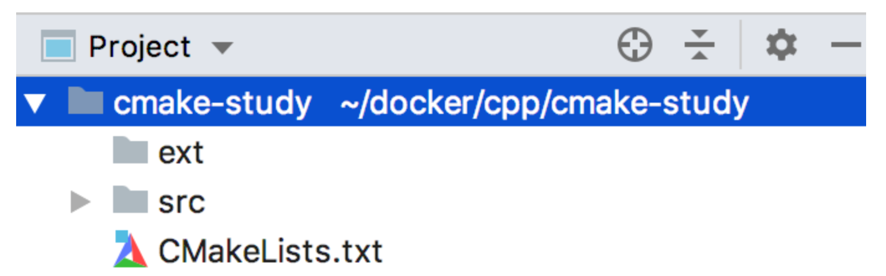
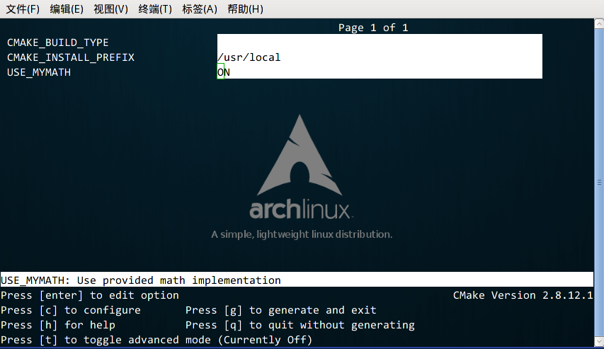

# CMakeLists

2020年11月27日

[GitHub](https://github.com/TD-4/cmake-demo)

---

**CMake** 是一个跨平台的、开源的构建工具。`cmake` 是 `makefile` 的上层工具，它们的目的正是为了产生可移植的makefile，并简化自己动手写makefile时的巨大工作量.

目前很多开源的项目都可以通过CMake工具来轻松构建工程.

## 1. CMakeLists教程-1

### 1.1 入门案例

#### 项目部署



> **c/c++** 项目工程部署如上:

- `src` : 源码工程目录
- `ext` : 第三方依赖库文件与头文件
- `CMakeLists.txt` : cmake 构建配置文件

#### 简单案例

源文件编写 : `src/main.cc`

```
#include <iostream>

int main() {
    std::cout << "Hello, World!" << std::endl;
    return 0;
}
```

编写CMAKE 配置文件 `CMakeLists.txt`

```
# cmake 最低版本需求
cmake_minimum_required(VERSION 3.13)

# 工程名称
project(cmake_study)

# 设置
set(CMAKE_CXX_STANDARD 11)

# 编译源码生成目标
add_executable(cmake_study src/main.cc)
```

cmake 命令便按照 `CMakeLists` 配置文件运行构建`Makefile`文件

```
$ mkdir build
$ cd build/
$ cmake ..
```

为了不让编译产生的中间文件污染我们的工程，我们可以创建一个 `build` 目录进入执行 `cmake` 构建工具. 如果没有错误， 执行成功后会在 `build` 目录下产生 `Makefile` 文件。

然后我们执行 `make` 命令就可以编译我们的项目了。

```
-rw-r--r--  1 root root 13591 Jul 20 12:09 CMakeCache.txt
drwxr-xr-x 14 root root   448 Jul 20 12:09 CMakeFiles
-rw-r--r--  1 root root  5034 Jul 20 12:09 Makefile
-rw-r--r--  1 root root  1508 Jul 20 12:09 cmake_install.cmake
-rwxr-xr-x  1 root root  9104 Jul 20 12:09 cmake_study
$ ./cmake_study
Hello, World!
```

以上就是大致的 cmake 构建运行过程。

**从上面的过程可以看出，cmake 的重点在配置 `CMakeLists.txt` 文件。**

------

### 1.2 CMakeLists 详解

#### CMakeLists 变量篇

我们可以使用 `SET(set)` 来定义变量

**语法** ：`SET(VAR [VALUE] [CACHE TYPE DOCSTRING [FORCE]]) `

**指令功能** : 用来显式的定义变量 

**例子** : `SET (SRC_LST main.c other.c)` 

**说明**: 用变量代替值，例子中定义 `SRC_LST` 代替后面的字符串。

我们可以使用 `${NAME}` 来获取变量的名称。

**cmake 常用变量**

| 环境变量名                                                   | 描述                                                         |
| :----------------------------------------------------------- | :----------------------------------------------------------- |
| CMAKE_BINARY_DIR, PROJECT_BINARY_DIR, `<projectname>`_BINARY_DIR | 如果是 `in source` 编译,指得就是工程顶层目录,如果是 `out-of-source` 编译,指的是工程编译发生的目录。PROJECT_BINARY_DIR 跟其他指令稍有区别,现在,你可以理解为他们是一致的。 |
| CMAKE_SOURCE_DIR, PROJECT_SOURCE_DIR, `<projectname>`_SOURCE_DIR | 工程顶层目录。                                               |
| CMAKE_CURRENT_SOURCE_DIR                                     | 当前处理的 CMakeLists.txt 所在的路径,比如上面我们提到的 src 子目录。 |
| CMAKE_CURRRENT_BINARY_DIR                                    | 如果是 `in-source` 编译,它跟 CMAKE_CURRENT_SOURCE_DIR 一致,如果是 `out-of-source` 编译,他指的是 target 编译目录。 |
| EXECUTABLE_OUTPUT_PATH , LIBRARY_OUTPUT_PATH                 | 最终目标文件存放的路径。                                     |
| PROJECT_NAME                                                 | 通过 PROJECT 指令定义的项目名称。                            |

**cmake 系统信息**

| 系统信息变量名         | 描述                                            |
| :--------------------- | :---------------------------------------------- |
| CMAKE_MAJOR_VERSION    | CMAKE 主版本号,比如 2.4.6 中的 2                |
| CMAKE_MINOR_VERSION    | CMAKE 次版本号,比如 2.4.6 中的 4                |
| CMAKE_PATCH_VERSION    | CMAKE 补丁等级,比如 2.4.6 中的 6                |
| CMAKE_SYSTEM           | 系统名称,比如 Linux-2.6.22                      |
| CMAKE_SYSTEM_NAME      | 不包含版本的系统名,比如 Linux                   |
| CMAKE_SYSTEM_VERSION   | 系统版本,比如 2.6.22                            |
| CMAKE_SYSTEM_PROCESSOR | 处理器名称,比如 i686.                           |
| UNIX                   | 在所有的类 UNIX 平台为 TRUE,包括 OS X 和 cygwin |
| WIN32                  | 在所有的 win32 平台为 TRUE,包括 cygwin          |

**cmake 编译选项**

| 编译控制开关名    | 描述                                                    |
| :---------------- | :------------------------------------------------------ |
| BUILD_SHARED_LIBS | 使用 `ADD_LIBRARY` 时生成动态库                         |
| BUILD_STATIC_LIBS | 使用 `ADD_LIBRARY` 时生成静态库                         |
| CMAKE_C_FLAGS     | 设置 C 编译选项,也可以通过指令 ADD_DEFINITIONS()添加。  |
| CMAKE_CXX_FLAGS   | 设置 C++编译选项,也可以通过指令 ADD_DEFINITIONS()添加。 |

#### CMake 常用指令

- **ADD_DEFINITIONS**

语法 : `ADD_DEFINITIONS(-DENABLE_DEBUG -DABC)`

向 C/C++编译器添加 `-D` 定义. 如果你的代码中定义了`#ifdef ENABLE_DEBUG #endif`,这个代码块就会生效。

- **ADD_DEPENDENCIES**

语法: `ADD_DEPENDENCIES(target-name depend-target1 depend-target2 ...)`

定义 target 依赖的其他 target, 确保在编译本 target 之前,其他的 target 已经被构建。

- **ADD_EXECUTABLE**

语法 : `ADD_EXECUTABLE(<name> [source1] [source2 ...])`

利用源码文件生成目标可执行程序。

- **ADD_LIBRARY**

语法 : `ADD_LIBRARY(<name> [STATIC | SHARED | MODULE] [source1] [source2 ...])`

根据源码文件生成目标库。

`STATIC`,`SHARED` 或者 `MODULE` 可以指定要创建的库的类型。 STATIC库是链接其他目标时使用的目标文件的存档。 SHARED库是动态链接的，并在运行时加载

- **ADD_SUBDIRECTORY**

语法 : `ADD_SUBDIRECTORY(NAME)` 添加一个文件夹进行编译，该文件夹下的 CMakeLists.txt 负责编译该文件夹下的源码. NAME是想对于调用add_subdirectory的CMakeListst.txt的相对路径．

- **ENABLE_TESTING**

语法: `ENABLE_TESTING()`.

控制 Makefile 是否构建 test 目标,涉及工程所有目录。 一般情况这个指令放在工程的主CMakeLists.txt 中.

- **ADD_TEST**

语法 : `ADD_TEST(testname Exename arg1 arg2 ...)`

`testname` 是自定义的 test 名称,`Exename` 可以是构建的目标文件也可以是外部脚本等等。 后面连接传递给可执行文件的参数。 如果没有在同一个 CMakeLists.txt 中打开`ENABLE_TESTING()`指令, 任何 `ADD_TEST` 都是无效的。

- **AUX_SOURCE_DIRECTORY**

语法 : `AUX_SOURCE_DIRECTORY(dir VARIABLE)`

作用是发现一个目录下所有的源代码文件并将列表存储在一个变量中,这个指令临时被用来自动构建源文件列表。因为目前 cmake 还不能自动发现新添加的源文件。

比如 :

```
AUX_SOURCE_DIRECTORY(. SRC_LIST)
ADD_EXECUTABLE(main ${SRC_LIST})
```

- **CMAKE_MINIMUM_REQUIRED**

语法 : `CMAKE_MINIMUM_REQUIRED` 定义 cmake 的最低兼容版本 比如 `CMAKE_MINIMUM_REQUIRED(VERSION 2.5 FATAL_ERROR)` 如果 cmake 版本小与 2.5,则出现严重错误,整个过程中止。

- **EXEC_PROGRAM**

在 CMakeLists.txt 处理过程中执行命令,并不会在生成的 Makefile 中执行。 具体语法为:

```
EXEC_PROGRAM(Executable [directory in which to run]
                [ARGS <arguments to executable>]
                [OUTPUT_VARIABLE <var>]
                [RETURN_VALUE <var>])
```

用于在指定的目录运行某个程序,通过 ARGS 添加参数,如果要获取输出和返回值,可通过OUTPUT_VARIABLE 和 RETURN_VALUE 分别定义两个变量.

这个指令可以帮助你在 CMakeLists.txt 处理过程中支持任何命令,比如根据系统情况去修改代码文件等等。

- **FILE 指令**

文件操作指令

语法:

```
 FILE(WRITE filename "message to write"... )
 FILE(APPEND filename "message to write"... )
 FILE(READ filename variable)
 FILE(GLOB variable [RELATIVE path] [globbing expression_r_rs]...)
 FILE(GLOB_RECURSE variable [RELATIVE path] [globbing expression_r_rs]...)
 FILE(REMOVE [directory]...)
 FILE(REMOVE_RECURSE [directory]...)
 FILE(MAKE_DIRECTORY [directory]...)
 FILE(RELATIVE_PATH variable directory file)
 FILE(TO_CMAKE_PATH path result)
 FILE(TO_NATIVE_PATH path result)
```

#### CMake 控制指令

- **IF 指令**

```
if(<condition>)
  <commands>
elseif(<condition>) # optional block, can be repeated
  <commands>
else()              # optional block
  <commands>
endif()

#####

IF(var),如果变量不是:空,0,N, NO, OFF, FALSE, NOTFOUND 或<var>_NOTFOUND 时,表达式为真。
IF(NOT var ),与上述条件相反。
IF(var1 AND var2),当两个变量都为真是为真。
IF(var1 OR var2),当两个变量其中一个为真时为真。
IF(COMMAND cmd),当给定的 cmd 确实是命令并可以调用是为真。
IF(EXISTS dir)或者 IF(EXISTS file),当目录名或者文件名存在时为真。
IF(file1 IS_NEWER_THAN file2),当 file1 比 file2 新,或者 file1/file2 其中有一个不存在时为真,文件名请使用完整路径。
IF(IS_DIRECTORY dirname),当 dirname 是目录时,为真。
IF(variable MATCHES regex)
IF(string MATCHES regex)
```

- **FOREACH 指令**

语法:

```
foreach(<loop_var> <items>)
  <commands>
endforeach()
```

其中`<items>`是以分号或空格分隔的项目列表。记录foreach匹配和匹配之间的所有命令endforeach而不调用。 一旦endforeach评估，命令的记录列表中的每个项目调用一次`<items>`。在每次迭代开始时，变量loop_var将设置为当前项的值。

- **WHILE 指令**

语法:

```
while(<condition>)
  <commands>
endwhile()
```

while和匹配之间的所有命令 endwhile()被记录而不被调用。 一旦endwhile()如果被评估，则只要为`<condition>`真，就会调用记录的命令列表。

------


## 2. [入门案例](https://www.hahack.com/codes/cmake/)

### 2.1 入门案例：单个源文件

对于简单的项目，只需要写几行代码就可以了。例如，假设现在我们的项目中只有一个源文件 `main.cc` ，该程序的用途是计算一个数的指数幂。

```c++
#include <stdio.h>
#include <stdlib.h>

/**
 * power - Calculate the power of number.
 * @param base: Base value.
 * @param exponent: Exponent value.
 *
 * @return base raised to the power exponent.
 */
double power(double base, int exponent)
{
    int result = base;
    int i;
    
    if (exponent == 0) {
        return 1;
    }
    
    for(i = 1; i < exponent; ++i){
        result = result * base;
    }

    return result;
}

int main(int argc, char *argv[])
{
    if (argc < 3){
        printf("Usage: %s base exponent \n", argv[0]);
        return 1;
    }
    double base = atof(argv[1]);
    int exponent = atoi(argv[2]);
    double result = power(base, exponent);
    printf("%g ^ %d is %g\n", base, exponent, result);
    return 0;
}
```

#### 编写 CMakeLists.txt

首先编写 CMakeLists.txt 文件，并保存在与 `main.cc`源文件同个目录下：

```c++
# CMake 最低版本号要求
cmake_minimum_required (VERSION 2.8)

# 项目信息
project (Demo1)

# 指定生成目标
add_executable(Demo main.cc)
```

CMakeLists.txt 的语法比较简单，由命令、注释和空格组成，其中命令是不区分大小写的。符号 `#` 后面的内容被认为是注释。命令由命令名称、小括号和参数组成，参数之间使用空格进行间隔。

对于上面的 CMakeLists.txt 文件，依次出现了几个命令：

1. `cmake_minimum_required`：指定运行此配置文件所需的 CMake 的最低版本；
2. `project`：参数值是 `Demo1`，该命令表示项目的名称是 `Demo1` 。
3. `add_executable`： 将名为 [main.cc](http://main.cc/) 的源文件编译成一个名称为 Demo 的可执行文件。

#### 编译项目

之后，在当前目录执行 `cmake .` ，得到 Makefile 后再使用 `make` 命令编译得到 Demo1 可执行文件。

```
[ehome@xman Demo1]$ cmake .
-- The C compiler identification is GNU 4.8.2
-- The CXX compiler identification is GNU 4.8.2
-- Check for working C compiler: /usr/sbin/cc
-- Check for working C compiler: /usr/sbin/cc -- works
-- Detecting C compiler ABI info
-- Detecting C compiler ABI info - done
-- Check for working CXX compiler: /usr/sbin/c++
-- Check for working CXX compiler: /usr/sbin/c++ -- works
-- Detecting CXX compiler ABI info
-- Detecting CXX compiler ABI info - done
-- Configuring done
-- Generating done
-- Build files have been written to: /home/ehome/Documents/programming/C/power/Demo1
[ehome@xman Demo1]$ make
Scanning dependencies of target Demo
[100%] Building C object CMakeFiles/Demo.dir/main.cc.o
Linking C executable Demo
[100%] Built target Demo
[ehome@xman Demo1]$ ./Demo 5 4
5 ^ 4 is 625
[ehome@xman Demo1]$ ./Demo 7 3
7 ^ 3 is 343
[ehome@xman Demo1]$ ./Demo 2 10
2 ^ 10 is 1024
```

### 2.2 多个源文件

#### 同一目录，多个源文件

本小节对应的源代码所在目录：[Demo2](https://github.com/TD-4/cmake-demo)。

上面的例子只有单个源文件。现在假如把 `power` 函数单独写进一个名为 `MathFunctions.c` 的源文件里，使得这个工程变成如下的形式：

```
./Demo2
    |
    +--- main.cc
    |
    +--- MathFunctions.cc
    |
    +--- MathFunctions.h
```

这个时候，CMakeLists.txt 可以改成如下的形式：

```
# CMake 最低版本号要求
cmake_minimum_required (VERSION 2.8)

# 项目信息
project (Demo2)

# 指定生成目标
add_executable(Demo main.cc MathFunctions.cc)
```

唯一的改动只是在 `add_executable` 命令中增加了一个 `MathFunctions.cc` 源文件。这样写当然没什么问题，但是如果源文件很多，把所有源文件的名字都加进去将是一件烦人的工作。更省事的方法是使用 `aux_source_directory` 命令，该命令会查找指定目录下的所有源文件，然后将结果存进指定变量名。其语法如下：

```
aux_source_directory(<dir> <variable>)
```

因此，可以修改 CMakeLists.txt 如下：

```
# CMake 最低版本号要求
cmake_minimum_required (VERSION 2.8)

# 项目信息
project (Demo2)

# 查找当前目录下的所有源文件
# 并将名称保存到 DIR_SRCS 变量
aux_source_directory(. DIR_SRCS)

# 指定生成目标
add_executable(Demo ${DIR_SRCS})
```

这样，CMake 会将当前目录所有源文件的文件名赋值给变量 `DIR_SRCS` ，再指示变量 `DIR_SRCS` 中的源文件需要编译成一个名称为 Demo 的可执行文件。

#### 多个目录，多个源文件

本小节对应的源代码所在目录：[Demo3](https://github.com/wzpan/cmake-demo/tree/master/Demo3)。

现在进一步将 MathFunctions.h 和 [MathFunctions.cc](http://mathfunctions.cc/) 文件移动到 math 目录下。

```
./Demo3
    |
    +--- main.cc
    |
    +--- math/
          |
          +--- MathFunctions.cc
          |
          +--- MathFunctions.h
```

对于这种情况，需要分别在项目根目录 Demo3 和 math 目录里各编写一个 CMakeLists.txt 文件。为了方便，我们可以先将 math 目录里的文件编译成静态库再由 main 函数调用。

根目录中的 CMakeLists.txt ：

```
# CMake 最低版本号要求
cmake_minimum_required (VERSION 2.8)

# 项目信息
project (Demo3)

# 查找当前目录下的所有源文件
# 并将名称保存到 DIR_SRCS 变量
aux_source_directory(. DIR_SRCS)

# 添加 math 子目录
add_subdirectory(math)

# 指定生成目标 
add_executable(Demo main.cc)

# 添加链接库
target_link_libraries(Demo MathFunctions)
```

该文件添加了下面的内容: 第3行，使用命令 `add_subdirectory` 指明本项目包含一个子目录 math，这样 math 目录下的 CMakeLists.txt 文件和源代码也会被处理 。第6行，使用命令 `target_link_libraries` 指明可执行文件 main 需要连接一个名为 MathFunctions 的链接库 。

子目录中的 CMakeLists.txt：

```
# 查找当前目录下的所有源文件
# 并将名称保存到 DIR_LIB_SRCS 变量
aux_source_directory(. DIR_LIB_SRCS)

# 生成链接库
add_library (MathFunctions ${DIR_LIB_SRCS})
```

在该文件中使用命令 `add_library` 将 src 目录中的源文件编译为静态链接库。

### 2.3 自定义编译选项


本节对应的源代码所在目录：[Demo4](https://github.com/wzpan/cmake-demo/tree/master/Demo4)。

CMake 允许为项目增加编译选项，从而可以根据用户的环境和需求选择最合适的编译方案。

例如，可以将 MathFunctions 库设为一个可选的库，如果该选项为 `ON` ，就使用该库定义的数学函数来进行运算。否则就调用标准库中的数学函数库。

#### 修改 CMakeLists 文件

我们要做的第一步是在顶层的 CMakeLists.txt 文件中添加该选项：

```
# CMake 最低版本号要求
cmake_minimum_required (VERSION 2.8)

# 项目信息
project (Demo4)

# 加入一个配置头文件，用于处理 CMake 对源码的设置
configure_file (
  "${PROJECT_SOURCE_DIR}/config.h.in"
  "${PROJECT_BINARY_DIR}/config.h"
  )

# 是否使用自己的 MathFunctions 库
option (USE_MYMATH
       "Use provided math implementation" ON)

# 是否加入 MathFunctions 库
if (USE_MYMATH)
  include_directories ("${PROJECT_SOURCE_DIR}/math")
  add_subdirectory (math)  
  set (EXTRA_LIBS ${EXTRA_LIBS} MathFunctions)
endif (USE_MYMATH)

# 查找当前目录下的所有源文件
# 并将名称保存到 DIR_SRCS 变量
aux_source_directory(. DIR_SRCS)

# 指定生成目标
add_executable(Demo ${DIR_SRCS})
target_link_libraries (Demo  ${EXTRA_LIBS})
```

其中：

1. 第7行的 `configure_file` 命令用于加入一个配置头文件 config.h ，这个文件由 CMake 从 [config.h.in](http://config.h.in/) 生成，通过这样的机制，将可以通过预定义一些参数和变量来控制代码的生成。
2. 第13行的 `option` 命令添加了一个 `USE_MYMATH` 选项，并且默认值为 `ON` 。
3. 第17行根据 `USE_MYMATH` 变量的值来决定是否使用我们自己编写的 MathFunctions 库。

#### 修改 [main.cc](http://main.cc/) 文件

之后修改 [main.cc](http://main.cc/) 文件，让其根据 `USE_MYMATH` 的预定义值来决定是否调用标准库还是 MathFunctions 库：

```
#include <stdio.h>
#include <stdlib.h>
#include "config.h"

#ifdef USE_MYMATH
  #include "math/MathFunctions.h"
#else
  #include <math.h>
#endif


int main(int argc, char *argv[])
{
    if (argc < 3){
        printf("Usage: %s base exponent \n", argv[0]);
        return 1;
    }
    double base = atof(argv[1]);
    int exponent = atoi(argv[2]);
    
#ifdef USE_MYMATH
    printf("Now we use our own Math library. \n");
    double result = power(base, exponent);
#else
    printf("Now we use the standard library. \n");
    double result = pow(base, exponent);
#endif
    printf("%g ^ %d is %g\n", base, exponent, result);
    return 0;
}
```

#### 编写 [config.h.in](http://config.h.in/) 文件

上面的程序值得注意的是第2行，这里引用了一个 config.h 文件，这个文件预定义了 `USE_MYMATH` 的值。但我们并不直接编写这个文件，为了方便从 CMakeLists.txt 中导入配置，我们编写一个 [config.h.in](http://config.h.in/) 文件，内容如下：

```
#cmakedefine USE_MYMATH
```

这样 CMake 会自动根据 CMakeLists 配置文件中的设置自动生成 config.h 文件。

#### 编译项目

现在编译一下这个项目，为了便于交互式的选择该变量的值，可以使用 `ccmake` 命令（也可以使用 `cmake -i`命令，该命令会提供一个会话式的交互式配置界面）：




CMake的交互式配置界面


从中可以找到刚刚定义的 `USE_MYMATH` 选项，按键盘的方向键可以在不同的选项窗口间跳转，按下 `enter` 键可以修改该选项。修改完成后可以按下 `c` 选项完成配置，之后再按 `g` 键确认生成 Makefile 。ccmake 的其他操作可以参考窗口下方给出的指令提示。

我们可以试试分别将 `USE_MYMATH` 设为 `ON` 和 `OFF` 得到的结果：

##### USE_MYMATH 为 ON

运行结果：

```
[ehome@xman Demo4]$ ./Demo
Now we use our own MathFunctions library. 
 7 ^ 3 = 343.000000
 10 ^ 5 = 100000.000000
 2 ^ 10 = 1024.000000
```

此时 config.h 的内容为：

```
#define USE_MYMATH
```

##### USE_MYMATH 为 OFF

运行结果：

```
[ehome@xman Demo4]$ ./Demo
Now we use the standard library. 
 7 ^ 3 = 343.000000
 10 ^ 5 = 100000.000000
 2 ^ 10 = 1024.000000
```

此时 config.h 的内容为：

```
/* #undef USE_MYMATH */
```

### 2.4 安装和测试


本节对应的源代码所在目录：[Demo5](https://github.com/wzpan/cmake-demo/tree/master/Demo5)。

CMake 也可以指定安装规则，以及添加测试。这两个功能分别可以通过在产生 Makefile 后使用 `make install`和 `make test` 来执行。在以前的 GNU Makefile 里，你可能需要为此编写 `install` 和 `test` 两个伪目标和相应的规则，但在 CMake 里，这样的工作同样只需要简单的调用几条命令。

#### 定制安装规则

首先先在 math/CMakeLists.txt 文件里添加下面两行：

```
# 指定 MathFunctions 库的安装路径
install (TARGETS MathFunctions DESTINATION bin)
install (FILES MathFunctions.h DESTINATION include)
```

指明 MathFunctions 库的安装路径。之后同样修改根目录的 CMakeLists 文件，在末尾添加下面几行：

```
# 指定安装路径
install (TARGETS Demo DESTINATION bin)
install (FILES "${PROJECT_BINARY_DIR}/config.h"
         DESTINATION include)
```

通过上面的定制，生成的 Demo 文件和 MathFunctions 函数库 libMathFunctions.o 文件将会被复制到 `/usr/local/bin` 中，而 MathFunctions.h 和生成的 config.h 文件则会被复制到 `/usr/local/include` 中。我们可以验证一下（顺带一提的是，这里的 `/usr/local/` 是默认安装到的根目录，可以通过修改 `CMAKE_INSTALL_PREFIX` 变量的值来指定这些文件应该拷贝到哪个根目录）：

```
[ehome@xman Demo5]$ sudo make install
[ 50%] Built target MathFunctions
[100%] Built target Demo
Install the project...
-- Install configuration: ""
-- Installing: /usr/local/bin/Demo
-- Installing: /usr/local/include/config.h
-- Installing: /usr/local/bin/libMathFunctions.a
-- Up-to-date: /usr/local/include/MathFunctions.h
[ehome@xman Demo5]$ ls /usr/local/bin
Demo  libMathFunctions.a
[ehome@xman Demo5]$ ls /usr/local/include
config.h  MathFunctions.h
```

#### 为工程添加测试

添加测试同样很简单。CMake 提供了一个称为 CTest 的测试工具。我们要做的只是在项目根目录的 CMakeLists 文件中调用一系列的 `add_test` 命令。

```
# 启用测试
enable_testing()

# 测试程序是否成功运行
add_test (test_run Demo 5 2)

# 测试帮助信息是否可以正常提示
add_test (test_usage Demo)
set_tests_properties (test_usage
  PROPERTIES PASS_REGULAR_EXPRESSION "Usage: .* base exponent")

# 测试 5 的平方
add_test (test_5_2 Demo 5 2)

set_tests_properties (test_5_2
 PROPERTIES PASS_REGULAR_EXPRESSION "is 25")

# 测试 10 的 5 次方
add_test (test_10_5 Demo 10 5)

set_tests_properties (test_10_5
 PROPERTIES PASS_REGULAR_EXPRESSION "is 100000")

# 测试 2 的 10 次方
add_test (test_2_10 Demo 2 10)

set_tests_properties (test_2_10
 PROPERTIES PASS_REGULAR_EXPRESSION "is 1024")
```

上面的代码包含了四个测试。第一个测试 `test_run` 用来测试程序是否成功运行并返回 0 值。剩下的三个测试分别用来测试 5 的 平方、10 的 5 次方、2 的 10 次方是否都能得到正确的结果。其中 `PASS_REGULAR_EXPRESSION` 用来测试输出是否包含后面跟着的字符串。

让我们看看测试的结果：

```
[ehome@xman Demo5]$ make test
Running tests...
Test project /home/ehome/Documents/programming/C/power/Demo5
    Start 1: test_run
1/4 Test #1: test_run .........................   Passed    0.00 sec
    Start 2: test_5_2
2/4 Test #2: test_5_2 .........................   Passed    0.00 sec
    Start 3: test_10_5
3/4 Test #3: test_10_5 ........................   Passed    0.00 sec
    Start 4: test_2_10
4/4 Test #4: test_2_10 ........................   Passed    0.00 sec

100% tests passed, 0 tests failed out of 4

Total Test time (real) =   0.01 sec
```

如果要测试更多的输入数据，像上面那样一个个写测试用例未免太繁琐。这时可以通过编写宏来实现：

```
# 定义一个宏，用来简化测试工作
macro (do_test arg1 arg2 result)
  add_test (test_${arg1}_${arg2} Demo ${arg1} ${arg2})
  set_tests_properties (test_${arg1}_${arg2}
    PROPERTIES PASS_REGULAR_EXPRESSION ${result})
endmacro (do_test)
 
# 使用该宏进行一系列的数据测试
do_test (5 2 "is 25")
do_test (10 5 "is 100000")
do_test (2 10 "is 1024")
```

关于 CTest 的更详细的用法可以通过 `man 1 ctest` 参考 CTest 的文档。

### 2.5 支持 gdb

让 CMake 支持 gdb 的设置也很容易，只需要指定 `Debug` 模式下开启 `-g` 选项：

```
set(CMAKE_BUILD_TYPE "Debug")
set(CMAKE_CXX_FLAGS_DEBUG "$ENV{CXXFLAGS} -O0 -Wall -g -ggdb")
set(CMAKE_CXX_FLAGS_RELEASE "$ENV{CXXFLAGS} -O3 -Wall")
```

之后可以直接对生成的程序使用 gdb 来调试。

### 2.6 添加环境检查


本节对应的源代码所在目录：[Demo6](https://github.com/wzpan/cmake-demo/tree/master/Demo6)。

有时候可能要对系统环境做点检查，例如要使用一个平台相关的特性的时候。在这个例子中，我们检查系统是否自带 pow 函数。如果带有 pow 函数，就使用它；否则使用我们定义的 power 函数。

#### 添加 CheckFunctionExists 宏

首先在顶层 CMakeLists 文件中添加 CheckFunctionExists.cmake 宏，并调用 `check_function_exists` 命令测试链接器是否能够在链接阶段找到 `pow` 函数。

```
# 检查系统是否支持 pow 函数
include (${CMAKE_ROOT}/Modules/CheckFunctionExists.cmake)
check_function_exists (pow HAVE_POW)
```

将上面这段代码放在 `configure_file` 命令前。

#### 预定义相关宏变量

接下来修改 [config.h.in](http://config.h.in/) 文件，预定义相关的宏变量。

```
// does the platform provide pow function?
#cmakedefine HAVE_POW
```

#### 在代码中使用宏和函数

最后一步是修改 [main.cc](http://main.cc/) ，在代码中使用宏和函数：

```
#ifdef HAVE_POW
    printf("Now we use the standard library. \n");
    double result = pow(base, exponent);
#else
    printf("Now we use our own Math library. \n");
    double result = power(base, exponent);
#endif
```

### 2.7 添加版本号


本节对应的源代码所在目录：[Demo7](https://github.com/wzpan/cmake-demo/tree/master/Demo7)。

给项目添加和维护版本号是一个好习惯，这样有利于用户了解每个版本的维护情况，并及时了解当前所用的版本是否过时，或是否可能出现不兼容的情况。

首先修改顶层 CMakeLists 文件，在 `project` 命令之后加入如下两行：

```
set (Demo_VERSION_MAJOR 1)
set (Demo_VERSION_MINOR 0)
```

分别指定当前的项目的主版本号和副版本号。

之后，为了在代码中获取版本信息，我们可以修改 [config.h.in](http://config.h.in/) 文件，添加两个预定义变量：

```
// the configured options and settings for Tutorial
#define Demo_VERSION_MAJOR @Demo_VERSION_MAJOR@
#define Demo_VERSION_MINOR @Demo_VERSION_MINOR@
```

这样就可以直接在代码中打印版本信息了：

```
#include <stdio.h>
#include <stdlib.h>
#include <math.h>
#include "config.h"
#include "math/MathFunctions.h"

int main(int argc, char *argv[])
{
    if (argc < 3){
        // print version info
        printf("%s Version %d.%d\n",
            argv[0],
            Demo_VERSION_MAJOR,
            Demo_VERSION_MINOR);
        printf("Usage: %s base exponent \n", argv[0]);
        return 1;
    }
    double base = atof(argv[1]);
    int exponent = atoi(argv[2]);
    
#if defined (HAVE_POW)
    printf("Now we use the standard library. \n");
    double result = pow(base, exponent);
#else
    printf("Now we use our own Math library. \n");
    double result = power(base, exponent);
#endif
    
    printf("%g ^ %d is %g\n", base, exponent, result);
    return 0;
}
```

### 2.8 生成安装包


本节对应的源代码所在目录：[Demo8](https://github.com/wzpan/cmake-demo/tree/master/Demo8)。

本节将学习如何配置生成各种平台上的安装包，包括二进制安装包和源码安装包。为了完成这个任务，我们需要用到 CPack ，它同样也是由 CMake 提供的一个工具，专门用于打包。

首先在顶层的 CMakeLists.txt 文件尾部添加下面几行：

```
# 构建一个 CPack 安装包
include (InstallRequiredSystemLibraries)
set (CPACK_RESOURCE_FILE_LICENSE
  "${CMAKE_CURRENT_SOURCE_DIR}/License.txt")
set (CPACK_PACKAGE_VERSION_MAJOR "${Demo_VERSION_MAJOR}")
set (CPACK_PACKAGE_VERSION_MINOR "${Demo_VERSION_MINOR}")
include (CPack)
```

上面的代码做了以下几个工作：

1. 导入 InstallRequiredSystemLibraries 模块，以便之后导入 CPack 模块；
2. 设置一些 CPack 相关变量，包括版权信息和版本信息，其中版本信息用了上一节定义的版本号；
3. 导入 CPack 模块。

接下来的工作是像往常一样构建工程，并执行 `cpack` 命令。

- 生成二进制安装包：

```
cpack -C CPackConfig.cmake
```

- 生成源码安装包

```
cpack -C CPackSourceConfig.cmake
```

我们可以试一下。在生成项目后，执行 `cpack -C CPackConfig.cmake` 命令：

```
[ehome@xman Demo8]$ cpack -C CPackSourceConfig.cmake
CPack: Create package using STGZ
CPack: Install projects
CPack: - Run preinstall target for: Demo8
CPack: - Install project: Demo8
CPack: Create package
CPack: - package: /home/ehome/Documents/programming/C/power/Demo8/Demo8-1.0.1-Linux.sh generated.
CPack: Create package using TGZ
CPack: Install projects
CPack: - Run preinstall target for: Demo8
CPack: - Install project: Demo8
CPack: Create package
CPack: - package: /home/ehome/Documents/programming/C/power/Demo8/Demo8-1.0.1-Linux.tar.gz generated.
CPack: Create package using TZ
CPack: Install projects
CPack: - Run preinstall target for: Demo8
CPack: - Install project: Demo8
CPack: Create package
CPack: - package: /home/ehome/Documents/programming/C/power/Demo8/Demo8-1.0.1-Linux.tar.Z generated.
```

此时会在该目录下创建 3 个不同格式的二进制包文件：

```
[ehome@xman Demo8]$ ls Demo8-*
Demo8-1.0.1-Linux.sh  Demo8-1.0.1-Linux.tar.gz  Demo8-1.0.1-Linux.tar.Z
```

这 3 个二进制包文件所包含的内容是完全相同的。我们可以执行其中一个。此时会出现一个由 CPack 自动生成的交互式安装界面：

```
[ehome@xman Demo8]$ sh Demo8-1.0.1-Linux.sh 
Demo8 Installer Version: 1.0.1, Copyright (c) Humanity
This is a self-extracting archive.
The archive will be extracted to: /home/ehome/Documents/programming/C/power/Demo8

If you want to stop extracting, please press <ctrl-C>.
The MIT License (MIT)

Copyright (c) 2013 Joseph Pan(http://hahack.com)

Permission is hereby granted, free of charge, to any person obtaining a copy of
this software and associated documentation files (the "Software"), to deal in
the Software without restriction, including without limitation the rights to
use, copy, modify, merge, publish, distribute, sublicense, and/or sell copies of
the Software, and to permit persons to whom the Software is furnished to do so,
subject to the following conditions:

The above copyright notice and this permission notice shall be included in all
copies or substantial portions of the Software.

THE SOFTWARE IS PROVIDED "AS IS", WITHOUT WARRANTY OF ANY KIND, EXPRESS OR
IMPLIED, INCLUDING BUT NOT LIMITED TO THE WARRANTIES OF MERCHANTABILITY, FITNESS
FOR A PARTICULAR PURPOSE AND NONINFRINGEMENT. IN NO EVENT SHALL THE AUTHORS OR
COPYRIGHT HOLDERS BE LIABLE FOR ANY CLAIM, DAMAGES OR OTHER LIABILITY, WHETHER
IN AN ACTION OF CONTRACT, TORT OR OTHERWISE, ARISING FROM, OUT OF OR IN
CONNECTION WITH THE SOFTWARE OR THE USE OR OTHER DEALINGS IN THE SOFTWARE.


Do you accept the license? [yN]: 
y
By default the Demo8 will be installed in:
  "/home/ehome/Documents/programming/C/power/Demo8/Demo8-1.0.1-Linux"
Do you want to include the subdirectory Demo8-1.0.1-Linux?
Saying no will install in: "/home/ehome/Documents/programming/C/power/Demo8" [Yn]: 
y

Using target directory: /home/ehome/Documents/programming/C/power/Demo8/Demo8-1.0.1-Linux
Extracting, please wait...

Unpacking finished successfully
```

完成后提示安装到了 Demo8-1.0.1-Linux 子目录中，我们可以进去执行该程序：

```
[ehome@xman Demo8]$ ./Demo8-1.0.1-Linux/bin/Demo 5 2
Now we use our own Math library. 
5 ^ 2 is 25
```

关于 CPack 的更详细的用法可以通过 `man 1 cpack` 参考 CPack 的文档。

### 2.9 将其他平台的项目迁移到 CMake

CMake 可以很轻松地构建出在适合各个平台执行的工程环境。而如果当前的工程环境不是 CMake ，而是基于某个特定的平台，是否可以迁移到 CMake 呢？答案是可能的。下面针对几个常用的平台，列出了它们对应的迁移方案。

#### autotools

- [am2cmake](https://projects.kde.org/projects/kde/kdesdk/kde-dev-scripts/repository/revisions/master/changes/cmake-utils/scripts/am2cmake) 可以将 autotools 系的项目转换到 CMake，这个工具的一个成功案例是 KDE 。
- [Alternative Automake2CMake](http://emanuelgreisen.dk/stuff/kdevelop_am2cmake.php.tgz) 可以转换使用 automake 的 KDevelop 工程项目。
- [Converting autoconf tests](http://www.cmake.org/Wiki/GccXmlAutoConfHints)

#### qmake

- [qmake converter](http://www.cmake.org/Wiki/CMake:ConvertFromQmake) 可以转换使用 QT 的 qmake 的工程。

#### Visual Studio

- [vcproj2cmake.rb](http://vcproj2cmake.sf.net/) 可以根据 Visual Studio 的工程文件（后缀名是 `.vcproj` 或 `.vcxproj`）生成 CMakeLists.txt 文件。
- [vcproj2cmake.ps1](http://nberserk.blogspot.com/2010/11/converting-vc-projectsvcproj-to.html) vcproj2cmake 的 PowerShell 版本。
- [folders4cmake](http://sourceforge.net/projects/folders4cmake/) 根据 Visual Studio 项目文件生成相应的 “source_group” 信息，这些信息可以很方便的在 CMake 脚本中使用。支持 Visual Studio 9/10 工程文件。

#### CMakeLists.txt 自动推导

- [gencmake](http://websvn.kde.org/trunk/KDE/kdesdk/cmake/scripts/) 根据现有文件推导 CMakeLists.txt 文件。
- [CMakeListGenerator](http://www.vanvelzensoftware.com/postnuke/index.php?name=Downloads&req=viewdownload&cid=7) 应用一套文件和目录分析创建出完整的 CMakeLists.txt 文件。仅支持 Win32 平台。

### 相关链接

1. [官方主页](http://www.cmake.org/)
2. [官方文档](http://www.cmake.org/cmake/help/cmake2.4docs.html)
3. [官方教程](http://www.cmake.org/cmake/help/cmake_tutorial.html)
4. [Wiki](http://www.cmake.org/Wiki/CMake#Basic_CMakeLists.txt_from-scratch-generator)
5. [FAQ](http://www.cmake.org/Wiki/CMake_FAQ)
6. [bug tracker](http://www.cmake.org/Bug)
7. 邮件列表：
   - [cmake on Gmane](http://dir.gmane.org/gmane.comp.programming.tools.cmake.user)
   - http://www.mail-archive.com/cmake@cmake.org/
   - [http://marc.info/?l=cmake](http://www.mail-archive.com/cmake@cmake.org/)
8. 其他推荐文章
   - [在 linux 下使用 CMake 构建应用程序](http://www.ibm.com/developerworks/cn/linux/l-cn-cmake/)
   - [cmake的一些小经验](http://www.cppblog.com/skyscribe/archive/2009/12/14/103208.aspx)
   - [Packaging Software with CPack](http://www.kitware.com/media/archive/kitware_quarterly0107.pdf)
   - [视频教程: 《Getting Started with CMake》](http://www.youtube.com/watch?v=CLvZTyji_Uw)

### 类似工具

- [SCons](http://scons.org/)：Eric S. Raymond、Timothee Besset、Zed A. Shaw 等大神力荐的项目架构工具。和 CMake 的最大区别是使用 Python 作为执行脚本。

------

1. [这个页面](http://www.cmake.org/Wiki/CMake_Projects)详细罗列了使用 CMake 的知名项目 [↩︎](https://www.hahack.com/codes/cmake/#fnref1)

- [Prev](https://www.hahack.com/codes/livereload-for-hexo/)
- [Archive](https://www.hahack.com/archive)
- [Next](https://www.hahack.com/slides/clumsy-web-worker/)